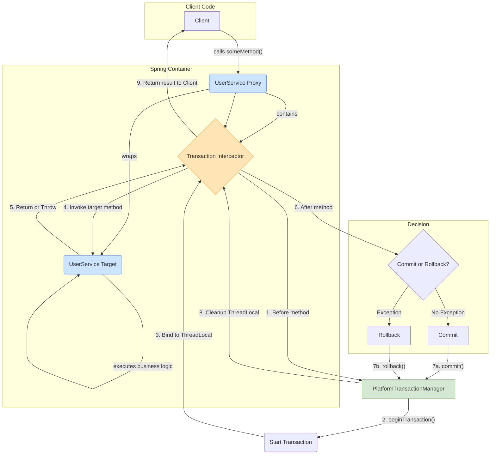

## 面试

### Spring 事务隔离级别

- `DEFAULT`(默认):使用底层数据库的默认隔离级别。如果数据库没有特定的设置，通常默认为 READ_CONMITTED 。
- `READ_UNCOMMITTED`(读未提交):最低的隔离级别，允许事务读取尚未提交的数据，可能会导致脏读、不可重复读和幻读。
- `READ_COMMITTED`(读已提交):仅允许读取已经提交的数据，避免了脏读，但可能会出现不可重复读和幻读问题。
- `REPEATABLE_READ`(可重复读):确保在同一个事务内的多次读取结果一致，避免脏读和不可重复读，但可能会有幻读问题。
- `SERIALIZABLE`(可串行化):最高的隔离级别，通过强制事务按顺序执行，完全避免脏读、不可重复读和幻读，代价是性能显著下降

### Spring 有哪几种事务传播行为

- **`PROPAGATION_REQUIRED`** (默认): 如果当前存在事务，则用当前事务；如果没有事务，则新起一个事务。
- **`PROPAGATION_SUPPORTS`**: 支持当前事务，如果不存在，则以非事务方式执行。
- **`PROPAGATION_MANDATORY`**: 支持当前事务，如果不存在，则抛出异常。
- **`PROPAGATION_REQUIRES_NEW`**: 创建一个新事务，如果存在当前事务，则挂起当前事务。
- **`PROPAGATION_NOT_SUPPORTED`**: 不支持当前事务，始终以非事务方式执行。
- **`PROPAGATION_NEVER`**: 不支持当前事务，如果当前存在事务，则抛出异常。
- **`PROPAGATION_NESTED`**: 如果当前事务存在，则在嵌套事务中执行。内层事务依赖外层事务，如果外层失败，则会回滚内层；内层失败不影响外层。

### Spring 事务传播行为有什么用

- 主要作用是定义和管理事务边界，尤其是一个事务方法调用另一个事务方法时，事务如何传播的问题，它解决了多个事务方法嵌套执行时，是否要开启新事务、复用现有事务或者挂起事务等复杂情况。

  1. **控制事务的传播和嵌套**:根据具体业务需求，可以指定是否使用现有事务或开启新的事务，解决事务的传播问题。
  2. **确保独立操作的事务隔离**:某些操作(如日志记录、发送通知)应当独立于主事务执行，即使主事务失败，这些操作也可以成功完成
  3. **控制事务的边界和一致性**:不同的业务场景可能需要不同的事务边界，例如强制某个方法必须在事务中执行，或者确保某个方法永远不在事务中运行，

### Spring 事务的超时时间

1.  **作用**：它是一个重要的保护机制，用于防止事务因执行时间过长而长时间占用数据库连接和锁，避免拖垮整个系统。

2.  **配置与行为**：我们可以在`@Transactional`注解里通过`timeout`属性来设置，单位是秒。例如，`@Transactional(timeout = 10)`就意味着如果这个事务从开始到结束超过了 10 秒，事务管理器就会强制它回滚。

3.  **关键注意事项**：
    - 首先，这个功能需要底层事务管理器的支持，不过主流的管理器（如 DataSourceTransactionManager）通常都支持。
    - 其次，也是很重要的一点，`timeout`设置只对开启新事务的方法生效（比如传播级别为`REQUIRED`或`REQUIRES_NEW`）。如果一个方法只是加入已有的事务，那么它自身的`timeout`配置是无效的，会沿用外部事务的设置。

### Spring 事务的是否只读

**1. 核心作用：**
`readOnly=true`是一个重要的**性能优化**提示。它告诉 Spring 和数据库，这个事务内不涉及任何数据的写操作，只进行查询。

**2. 主要优化点：**
它的价值主要体现在三个方面：

- **数据库层面**：数据库可以优化执行，例如不记录用于回滚的 undo log，从而减少开销。
- **框架层面**：对于 Hibernate 这样的 ORM 框架，它可以关闭“脏检查”（Dirty Checking），避免了检测实体变化的性能消耗。
- **架构层面**：在读写分离的架构中，`readOnly=true`是实现请求路由的关键依据。AOP 可以根据这个标识，将查询请求自动转发到**只读数据库**，从而减轻主库的压力。

**3. 关键注意事项：**

- `readOnly`是一个**提示性**而非强制性的配置。如果你在只读事务里执行了写操作，结果取决于底层数据库，它可能会成功，也可能报错。
- 这个设置只对开启新事务的方法有意义（如`REQUIRED`传播级别）。如果方法是加入到一个已有的非只读事务中，`readOnly`的设置会被忽略掉。

### Spring 事务的回滚规则

**1. 默认规则：**
Spring 事务默认只在遇到**`RuntimeException`（运行时异常）**和**`Error`**时才会自动回滚。对于**受检异常（Checked Exception）**，它默认是**不回滚**的。

**2. 精确控制：**
我们可以通过`@Transactional`注解的两个属性来打破这个默认规则：

- **`rollbackFor`**：这个属性可以指定哪些异常需要**强制回滚**。最常见的用法就是让受检异常也触发回滚，例如 `@Transactional(rollbackFor = IOException.class)`。
- **`noRollbackFor`**：这个属性的作用正好相反，它可以指定哪些异常**不回滚**。比如，我们有一个自定义的`InsufficientStockException`（库存不足异常），它虽然是`RuntimeException`，但在业务上我们不希望它回滚整个事务，就可以使用 `@Transactional(noRollbackFor = InsufficientStockException.class)`。

**3. 总结：**
总的来说，Spring 提供了一套“默认回滚运行时异常，不回滚受检异常”的基准规则，同时通过`rollbackFor`和`noRollbackFor`属性赋予了我们根据具体业务场景灵活定义回滚策略的能力，从而精确地保障数据的一致性。

## Spring 支持的事务管理类型

> [!TIP]
>
> **了解即可**
> Spring 提供了灵活的事务管理模型，开发者可以根据项目的复杂度和需求选择最合适的方式。

Spring 主要支持以下三种事务管理类型：

- **编程式事务管理**:

  - **描述**: 在业务代码中通过注入`PlatformTransactionManager`或使用`TransactionTemplate`，显式地调用`getTransaction`, `commit`, `rollback`等方法来控制事务。
  - **优缺点**: 提供了最精细的事务控制能力，但与业务代码高度耦合，不推荐在常规业务中使用。

- **声明式事务管理 (基于 XML)**:

  - **描述**: 通过 XML 配置，利用 Spring AOP 技术，将事务切面织入到业务方法中，使业务代码与事务代码解耦。
  - **优缺点**: 实现了关注点分离，但 XML 配置较为繁琐，已不常用。

- **声明式事务管理 (基于注解)**:
  - **描述**: 这是目前最主流、最推荐的方式。通过在方法上添加`@Transactional`注解，以非侵入的方式管理事务。
  - **优缺点**: 简单、直观、开发效率高，是声明式事务管理的最佳实践。

## Spring 的事务实现原理

> [!TIP]
>
> **了解即可**
> Spring 事务管理的核心是**“平台无关性”**和**AOP**。它通过一套统一的 API，适配了多种底层事务技术（如 JDBC, JTA, Hibernate），并通过 AOP 代理将事务逻辑无缝织入到业务代码中。

### 核心组件

Spring 事务管理抽象了三个核心接口：

1.  **`PlatformTransactionManager` (平台事务管理器)**:
    - 这是 Spring 事务管理的**核心接口**，定义了获取事务(`getTransaction`)、提交(`commit`)和回滚(`rollback`)的基本操作。
    - Spring 会根据配置（如 JDBC, JTA）提供具体的实现类，如`DataSourceTransactionManager`。开发者只需面向这个接口编程，无需关心底层细节。
2.  **`TransactionDefinition` (事务定义)**:
    - 定义了事务的元数据，包括**隔离级别**、**传播行为**、**超时时间**、**是否只读**等。`@Transactional`注解中的所有属性，最终都会被封装成一个`TransactionDefinition`对象。
3.  **`TransactionStatus` (事务状态)**:
    - 描述了一个特定事务在运行时的状态信息，例如是否是一个新事务、是否已被标记为只能回滚等。事务管理器通过它来控制事务的执行。

### 实现原理：AOP + ThreadLocal

Spring 声明式事务的实现原理可以概括为：

1.  **AOP 代理**:
    - 在应用启动时，Spring 会扫描所有`@Transactional`注解。
    - 对于标注了该注解的 Bean，Spring 会使用 AOP 技术（默认为 CGLIB）为其创建一个**代理对象**。
    - 这个代理对象包装了原始的 Bean 实例，并包含了一个**事务拦截器**（`TransactionInterceptor`）。
2.  **方法拦截**:
    - 当客户端代码调用 Bean 的方法时，实际调用的是这个代理对象的方法。
    - 事务拦截器会**拦截**这个调用。
3.  **事务处理**:
    - **方法调用前**: 拦截器根据方法的`@Transactional`注解信息（即`TransactionDefinition`），通过`PlatformTransactionManager`**开启事务**。
    - **绑定上下文**: 开启的事务信息（如数据库连接、事务状态）会被保存到`ThreadLocal`变量中，确保了事务在当前线程中的唯一性和隔离性。
    - **执行业务方法**: 拦截器调用原始 Bean 实例的业务方法。
    - **方法调用后**:
      - 如果业务方法**正常执行完毕**，拦截器会通过`PlatformTransactionManager`**提交事务**。
      - 如果业务方法**抛出异常**，拦截器会根据回滚规则，通过`PlatformTransactionManager`**回滚事务**。
    - **清理上下文**: 无论成功或失败，最后都会清理`ThreadLocal`中的事务信息。



通过这个流程，事务管理的逻辑被完全从业务代码中分离出来，实现了非侵入式的声明式事务管理。

## Spring 事务隔离级别

> [!TIP]
>
> - `DEFAULT`(默认):使用底层数据库的默认隔离级别。如果数据库没有特定的设置，通常默认为 READ_CONMITTED 。
> - `READ_UNCOMMITTED`(读未提交):最低的隔离级别，允许事务读取尚未提交的数据，可能会导致脏读、不可重复读和幻读。
> - `READ_COMMITTED`(读已提交):仅允许读取已经提交的数据，避免了脏读，但可能会出现不可重复读和幻读问题。
> - `REPEATABLE_READ`(可重复读):确保在同一个事务内的多次读取结果一致，避免脏读和不可重复读，但可能会有幻读问题。
> - `SERIALIZABLE`(可串行化):最高的隔离级别，通过强制事务按顺序执行，完全避免脏读、不可重复读和幻读，代价是性能显著下降

> [!NOTE]
>
> - 脏读(Dirty Read):一个事务读取了另一个尚未提交的事务的数据，如果该事务回滚，则数据是不一致的。
> - 不可重复读 (Non-repeatable Read):在同一事务内的多次读取，前后数据不一致，因为其他事务修改了该数据并提交。
> - 幻读(Phantom Read):在一个事务内的多次查询，查询结果集不同，因为其他事务插入或删除了数据。

| 隔离级别           | 脏读 | 不可重复读 | 幻读 |
| :----------------- | :--- | :--------- | :--- |
| `READ_UNCOMMITTED` | 是   | 是         | 是   |
| `READ_COMMITTED`   | 否   | 是         | 是   |
| `REPEATABLE_READ`  | 否   | 否         | 是   |
| `SERIALIZABLE`     | 否   | 否         | 否   |

### 隔离级别与性能之间的权衡

- 选择隔离级别需要根据应用的具体需求进行权衡:
  - 低隔离级别(READ UNCOMMITTED 和 READCOMMITTED):性能高，但可能存在并发问题，适合数据一致性要求不高的场景。
  - 高隔离级别(REPEATABLE READ 和 SERIALIZABLE):数据一致性强，但性能较差，适合高数据一致性要求的场景。

### Spring 中的事务隔离级别设置

> [!NOTE]
>
> - 在 Spring 中，使用 @Transactional 注解可以方便地设置事务的隔离级别。
> - 通过 isolation 属性，开发者可以灵活地指定每个事务的隔离级别。

```java
@Transactional(isolation = Isolation.REPEATABLE_READ)
public void processTransaction() {
    // 事务逻辑
}
```

## Spring 有哪几种事务传播行为

> [!TIP]
>
> - **`PROPAGATION_REQUIRED`** (默认): 如果当前存在事务，则用当前事务；如果没有事务，则新起一个事务。
> - **`PROPAGATION_SUPPORTS`**: 支持当前事务，如果不存在，则以非事务方式执行。
> - **`PROPAGATION_MANDATORY`**: 支持当前事务，如果不存在，则抛出异常。
> - **`PROPAGATION_REQUIRES_NEW`**: 创建一个新事务，如果存在当前事务，则挂起当前事务。
> - **`PROPAGATION_NOT_SUPPORTED`**: 不支持当前事务，始终以非事务方式执行。
> - **`PROPAGATION_NEVER`**: 不支持当前事务，如果当前存在事务，则抛出异常。
> - **`PROPAGATION_NESTED`**: 如果当前事务存在，则在嵌套事务中执行。内层事务依赖外层事务，如果外层失败，则会回滚内层；内层失败不影响外层。

### 应用场景详解

> [!NOTE]
> 每种传播行为都有其独特的适用场景，理解它们有助于设计出健壮、高效的业务系统。

#### `PROPAGATION_REQUIRED`

- **应用场景**: 最常见的业务逻辑调用。比如，在订单创建时调用库存减少的方法，它们都应该共享同一个事务。
- **优点**: 事务复用，性能开销较小，适用于绝大多数业务逻辑。

#### `PROPAGATION_REQUIRES_NEW`

- **应用场景**: 需要独立提交的辅助业务，如日志记录、审计、发送通知等。即使主事务失败回滚，这些操作也应成功提交。
- **优点**: 事务隔离，防止主事务的失败影响到辅助操作，保证了核心业务与非核心业务的解耦。

#### `PROPAGATION_SUPPORTS`

- **应用场景**: 可选的事务支持。比如，一个通用的查询方法，它既可能被一个带事务的业务方法调用，也可能被一个无事务的后台任务调用。
- **优点**: 灵活，能适应不同的调用上下文。

#### `PROPAGATION_NOT_SUPPORTED`

- **应用场景**: 需要明确禁止在事务中执行的场景，比如某些数据库的特定监控查询或配置读取，这些操作不应被任何外部事务锁定或影响。
- **优点**: 避免不必要的事务开销和潜在的锁问题。

#### `PROPAGATION_MANDATORY`

- **应用场景**: 用于实现一些必须在特定事务上下文中执行的工具类或内部方法。常用于确保方法调用链的事务一致性。
- **优点**: 强制性的事务检查，能防止方法被错误地在无事务环境中使用。
- **缺点**: 强依赖外部事务，如果没有事务，则会失败，降低了方法的通用性。

#### `PROPAGATION_NEVER`

- **应用场景**: 与`MANDATORY`相反，用于确保方法绝对不在任何事务中执行。
- **优点**: 提供了一种强校验机制，防止敏感操作被意外卷入事务。
- **缺点**: 依赖于没有事务的调用环境。

#### `PROPAGATION_NESTED`

- **应用场景**: 复杂的业务流程中，需要支持部分回滚的场景。比如，一个包含多个步骤的批量操作，其中某个步骤失败后，你只想回滚该步骤，而不是整个批量操作。
- **优点**: 提供了比`REQUIRES_NEW`更细粒度的事务控制，它依赖于 JDBC 的 Savepoint 机制，可以实现子事务的回滚而不影响父事务。
- **注意**: 并非所有数据库和事务管理器都支持`NESTED`传播行为。

### 事务传播行为使用示例

> [!NOTE]
> 为了清晰地展示传播行为，下面的例子将围绕两个 Service 展开：`UserService`（主业务）和`LogService`（日志记录等辅助业务）。

#### `PROPAGATION_REQUIRED` (默认)

**场景**: `UserService`的`register`方法是一个事务，它调用`LogService`的`log`方法。`log`方法使用`REQUIRED`，它会加入到`register`方法的现有事务中。

```java
@Service
public class UserService {
    @Autowired
    private LogService logService;

    @Transactional(propagation = Propagation.REQUIRED)
    public void register(String username) {
        // 1. 数据库操作：创建用户
        System.out.println(username + " a registered.");

        // 2. 调用log方法，它会加入当前事务
        logService.log("User registered: " + username);

        // 3. 如果这里发生异常，用户创建和日志记录都会被回滚
        if ("test_rollback".equals(username)) {
            throw new RuntimeException("Rollback required.");
        }
    }
}

@Service
public class LogService {
    @Transactional(propagation = Propagation.REQUIRED)
    public void log(String message) {
        // 数据库操作：记录日志
        System.out.println("Log: " + message);
    }
}
```

**结果**: `logService.log`和`userService.register`在同一个事务中。`register`方法回滚，`log`方法的操作也会一并回滚。

---

#### `PROPAGATION_REQUIRES_NEW`

**场景**: 无论`register`事务是否成功，都需要**独立地**记录一条操作日志。`log`方法使用`REQUIRES_NEW`，它会挂起`register`的事务，并开启一个自己的新事务。

```java
// UserService中的register方法不变

@Service
public class LogService {
    @Transactional(propagation = Propagation.REQUIRES_NEW)
    public void log(String message) {
        // 这个操作在一个全新的、独立的事务中执行
        System.out.println("Log (in new transaction): " + message);
    }
}
```

**结果**: `register`方法的回滚**不会**影响到`log`方法。日志会成功提交到数据库，即使用户注册失败了。

---

#### `PROPAGATION_SUPPORTS`

**场景**: `log`方法可以支持事务，也可以不支持。

- 如果被一个带事务的方法（如`register`）调用，它就加入该事务。
- 如果被一个不带事务的方法调用，它就以非事务方式执行。

```java
@Service
public class LogService {
    @Transactional(propagation = Propagation.SUPPORTS)
    public void log(String message) {
        System.out.println("Log (supports transaction): " + message);
    }
}
```

**结果**: 行为取决于调用方。被`register`调用时，行为同`REQUIRED`；如果被一个无`@Transactional`注解的方法调用，则`log`方法自身不会开启事务。

---

#### `PROPAGATION_NOT_SUPPORTED`

**场景**: `log`方法明确表示不希望在事务中运行。如果它被一个带事务的方法（如`register`）调用，那么调用方的事务会被挂起，`log`方法以非事务方式执行。

```java
@Service
public class LogService {
    @Transactional(propagation = Propagation.NOT_SUPPORTED)
    public void log(String message) {
        // 该方法运行时，外层事务会被挂起
        System.out.println("Log (not in transaction): " + message);
    }
}
```

**结果**: `log`方法的操作会立即提交，因为它不在任何事务中。即使`register`方法后续失败并回滚，日志记录也不会受影响。

---

#### `PROPAGATION_MANDATORY`

**场景**: `log`方法**强制要求**必须在一个已存在的事务中调用，否则就报错。这常用于核心业务的子流程，确保其原子性。

```java
@Service
public class LogService {
    @Transactional(propagation = Propagation.MANDATORY)
    public void log(String message) {
        System.out.println("Log (must be in transaction): " + message);
    }
}
```

**结果**:

- `userService.register`调用它时，正常执行。
- 如果一个没有`@Transactional`的方法直接调用`logService.log()`，会抛出`IllegalTransactionStateException`异常。

---

#### `PROPAGATION_NEVER`

**场景**: `log`方法**强制要求**不能在任何事务中调用。

```java
@Service
public class LogService {
    @Transactional(propagation = Propagation.NEVER)
    public void log(String message) {
        System.out.println("Log (must not be in transaction): " + message);
    }
}
```

**结果**:

- `userService.register`调用它时，会抛出`IllegalTransactionStateException`异常。
- 只有在没有事务的上下文中调用它，才能正常执行。

---

#### `PROPAGATION_NESTED`

**场景**: `register`方法调用`log`，`log`希望拥有一个可以独立回滚的“子事务”。如果`log`失败，只回滚它自己，不影响`register`继续执行。但如果`register`失败，`log`的操作也必须回滚。

```java
@Service
public class LogService {
    @Transactional(propagation = Propagation.NESTED)
    public void log(String message) {
        // 该方法在嵌套事务中执行
        System.out.println("Log (in nested transaction): " + message);
        // 如果这里发生异常，只有这个嵌套事务会回滚
    }
}
```

**结果**: `NESTED`使用数据库的保存点（Savepoint）机制。`log`方法可以独立于`register`方法回滚，但它最终的提交依赖于`register`方法的成功提交。
**(注意: 并非所有数据库都支持保存点)**

## Spring 事务传播行为有什么用

> [!TIP]
>
> - 主要作用是定义和管理事务边界，尤其是一个事务方法调用另一个事务方法时，事务如何传播的问题，它解决了多个事务方法嵌套执行时，是否要开启新事务、复用现有事务或者挂起事务等复杂情况。
>
> 1. **控制事务的传播和嵌套**:根据具体业务需求，可以指定是否使用现有事务或开启新的事务，解决事务的传播问题。
> 2. **确保独立操作的事务隔离**:某些操作(如日志记录、发送通知)应当独立于主事务执行，即使主事务失败，这些操作也可以成功完成
> 3. **控制事务的边界和一致性**:不同的业务场景可能需要不同的事务边界，例如强制某个方法必须在事务中执行，或者确保某个方法永远不在事务中运行，

## Spring 事务在什么情况下会失效

### 面试

> [!TIP]
> 面试：

> [!WARNING]
> 大多数`@Transactional`注解导致的“事务失效”问题，其根源都与 Spring 的 AOP（面向切面编程）代理机制有关。理解这一点是排查问题的关键。

以下是几种常见的事务失效场景：

1.  **`rollbackFor` 属性设置不当**

    - **原因**: Spring 的`@Transactional`默认只对`RuntimeException`和`Error`进行回滚。如果方法抛出的是一个受检异常（Checked Exception，如 `IOException`, `SQLException`），而你没有配置`rollbackFor`属性，事务将不会回滚。
    - **解决方案**: 明确指定需要回滚的异常类型。
      ```java
      @Transactional(rollbackFor = Exception.class) // 对所有Exception都回滚
      public void performAction() throws IOException {
          // ...
          throw new IOException("File not found");
      }
      ```

2.  **异常被 `try-catch` 块捕获**

    - **原因**: 如果你在事务方法内部用`try-catch`捕获了异常，并且没有在`catch`块中重新抛出，那么 Spring 的事务 AOP 切面将无法感知到异常的发生，自然不会触发回滚。
    - **错误示例**:
      ```java
      @Transactional
      public void performAction() {
          try {
              // ... 执行数据库操作 ...
              throw new RuntimeException("Something went wrong");
          } catch (Exception e) {
              // 异常被“吞掉”了，事务AOP不知道，导致事务正常提交
              log.error("An error occurred but was handled.", e);
          }
      }
      ```

3.  **方法访问权限问题 (非 `public` 方法)**

    - **原因**: Spring AOP 代理默认只拦截`public`方法。如果你将`@Transactional`注解用在`protected`、`private`或包级私有的方法上，事务将不会生效。
    - **源码佐证**: 在 Spring 的`TransactionAttributeSource`实现中，有类似`Modifier.isPublic(method.getModifiers())`的检查逻辑。

4.  **同一个类中的方法调用 (this 调用)**

    - **原因**: 这是最常见也最隐蔽的失效场景。当一个类中的方法 A 调用同一个类中的方法 B（`this.methodB()`）时，这个调用是对象内部的直接调用，**没有经过 Spring 的代理对象**。因此，即使方法 B 上标注了`@Transactional`，其事务切面也无法被执行。
    - **示例**:

      ```java
      @Service
      public class OrderService {
          public void createOrder() {
              // 错误调用：this.insertOrder() 不会经过代理，事务失效
              this.insertOrder();
          }

          @Transactional
          public void insertOrder() {
              // ... 数据库操作 ...
          }
      }
      ```

    - **解决方案**: 将事务方法移到另一个 Bean 中，通过注入的 Bean 实例来调用；或者通过`AopContext.currentProxy()`获取当前代理对象来调用。

5.  **方法被 `final` 或 `static` 修饰**

    - **原因**: Spring AOP 的默认实现（CGLIB）是通过动态创建子类来作为代理的。`final`方法无法被子类重写，`static`方法属于类而不是实例。因此，AOP 无法代理这两类方法，`@Transactional`自然也无法生效。

6.  **事务传播行为配置错误**

    - **原因**: 不恰当的传播行为会导致事务逻辑与预期不符。例如，一个主方法调用一个子方法，如果子方法被配置为`PROPAGATION_REQUIRES_NEW`，它会开启一个全新的、独立的事务。如果子方法提交后，主方法发生异常并回滚，子方法的操作**不会**被回滚，这可能破坏了业务的整体原子性。

      ```java
      // 主方法
      @Transactional
      public void mainOperation() {
          subOperation(); // 开启新事务并已提交
          throw new RuntimeException("Main failed!"); // 主事务回滚，但subOperation不回滚
      }

      // 子方法
      @Transactional(propagation = Propagation.REQUIRES_NEW)
      public void subOperation() {
          // ...
      }
      ```

7.  **在多线程环境下调用**

    - **原因**: Spring 的事务上下文是基于`ThreadLocal`来存储的，这意味着事务信息与当前线程绑定。如果在事务方法中开启一个新的线程去执行数据库操作，新线程将**不持有**原线程的事务上下文，导致操作在事务之外执行。

8.  **数据库引擎不支持事务**
    - **原因**: 这是最根本的问题。如果你的数据库表使用的是不支持事务的存储引擎（例如 MySQL 的 MyISAM），那么 Spring 即使配置了事务管理，也无法生效，因为底层就不支持。
    - **解决方案**: 确保你的数据库和表都使用支持事务的引擎，如 InnoDB。

## Spring 事务的超时时间

> [!NOTE]
> 事务超时是一个重要的保护机制，可以防止因某个事务长时间持有数据库连接或锁，而导致整个系统性能下降或资源耗尽。

- **定义**: 超时时间定义了事务从开始到结束所允许的最大时长。如果一个事务的执行时间超过了这个设定的值，事务管理器将强制其回滚。

- **配置**: 超时时间通过 `@Transactional` 注解的 `timeout` 属性进行设置，单位为**秒**。

- **代码示例**:

  ```java
  /**
   * 该方法执行时间如果超过10秒，将被强制回滚。
   */
  @Transactional(timeout = 10)
  public void longRunningOperation() {
      try {
          // 模拟一个长时间运行的任务
          Thread.sleep(15000);
      } catch (InterruptedException e) {
          // ...
      }
      // ... 其他数据库操作 ...
  }
  ```

- **注意事项**:
  - `timeout` 属性的生效依赖于底层事务管理器的支持。大多数主流的事务管理器（如 JTA、DataSourceTransactionManager）都支持超时设置。
  - 超时配置仅对新开启的事务有效（即传播行为为 `REQUIRED`, `REQUIRES_NEW`, `NESTED`）。如果一个方法加入到一个已存在的事务中（如`SUPPORTS`），它自己的`timeout`设置将被忽略，沿用外部事务的超时配置。

## Spring 事务的回滚规则

> [!NOTE]
> 精确地控制哪些异常触发回滚，是保证业务逻辑正确性的重要一环。Spring 通过`@Transactional`注解的`rollbackFor`和`noRollbackFor`属性，提供了这种细粒度的控制能力。

- **默认行为**:

  - 当方法中抛出`RuntimeException`或`Error`时，Spring 事务会**自动回滚**。
  - 当方法中抛出**受检异常** (Checked Exception，即非`RuntimeException`) 时，Spring 事务**不会**自动回滚。

- **`rollbackFor`**:

  - **作用**: 告诉 Spring，除了默认的`RuntimeException`和`Error`外，当指定的**其他异常**被抛出时，**也需要回滚事务**。
  - **应用场景**: 最常见的场景就是让事务在遇到受检异常（如`IOException`, `SQLException`）时也能回滚。
  - **示例**:
    ```java
    // 指定当发生IOException时，事务也需要回滚
    @Transactional(rollbackFor = IOException.class)
    public void processFile(String filePath) throws IOException {
        // ... 数据库操作 ...
        if (!new File(filePath).exists()) {
            throw new IOException("文件不存在，需要回滚数据库操作");
        }
    }
    ```

- **`noRollbackFor`**:

  - **作用**: 告诉 Spring，即使发生了某些默认会触发回滚的异常（通常是`RuntimeException`的子类），**也不要回滚事务**。
  - **应用场景**: 当业务中某些特定的运行时异常不代表业务失败，而是一种正常的业务流程分支时。例如，一个库存不足的异常，你可能希望记录这个状态但不回滚整个订单创建流程。
  - **示例**:

    ```java
    // 自定义一个库存不足的异常
    public class InsufficientStockException extends RuntimeException {
        public InsufficientStockException(String message) {
            super(message);
        }
    }

    // 即使发生InsufficientStockException（它是RuntimeException），也不要回滚事务
    @Transactional(noRollbackFor = InsufficientStockException.class)
    public void createOrder(Product product) {
        // ... 其他数据库操作 ...
        if (product.getStock() <= 0) {
            // 抛出异常，但事务不会回滚
            throw new InsufficientStockException("库存不足，操作不回滚");
        }
    }
    ```

> [!TIP] > **最佳实践**:
>
> - 通常建议将所有业务异常定义为继承自`RuntimeException`的非受检异常。
> - 在需要全局处理受检异常回滚的场景下，可以统一配置`@Transactional(rollbackFor = Exception.class)`。
> - `noRollbackFor`的使用场景相对较少，需谨慎评估，确保不会破坏数据一致性。

## Spring 事务的是否只读

> [!NOTE]
> 将事务设置为只读（Read-Only）是一个重要的性能优化手段，它向数据库和 Spring 事务管理器提供了一个明确的信号：这个事务内不会有任何写操作。

- **定义**: `readOnly`属性用于声明一个事务是否为只读事务。默认值为`false`。

- **配置**: 通过`@Transactional`注解的`readOnly`属性进行设置。

  ```java
  @Transactional(readOnly = true)
  public User findUserById(Long id) {
      return userRepository.findById(id);
  }
  ```

- **核心价值与优化原理**:

  1.  **数据库层面的优化**: 当数据库接收到这是一个只读事务的信号时，它可能会启用一些优化措施。例如，它可能不会为这个事务分配和维护用于回滚的 undo log，从而减少了数据库的开销。
  2.  **避免脏检查**: 在某些 ORM 框架（如 Hibernate）中，将事务设置为只读可以避免对实体进行“脏检查”（Dirty Checking），即跳过检测实体自加载以来是否有变化的步骤，从而提高性能。
  3.  **实现读写分离**: 在读写分离的架构中，`readOnly=true`是一个关键的路由依据。数据源路由 AOP 可以根据这个属性，将事务中的所有查询请求路由到负载较低的**只读数据库副本**（Read Replica）上，从而减轻主数据库（Master）的压力。

- **注意事项**:
  - `readOnly`属性是一个**提示性**的配置，而非强制性约束。如果你在一个标记为`readOnly=true`的事务中执行了写操作（INSERT, UPDATE, DELETE），其结果取决于底层的事务管理器和数据库。有些数据库可能会抛出异常，而有些则可能忽略这个提示并成功执行写操作。
  - 这个属性只对开启一个新事务的传播行为（如`REQUIRED`, `REQUIRES_NEW`）有意义。如果事务是加入一个已存在的、非只读的事务，那么`readOnly`设置会被忽略。
