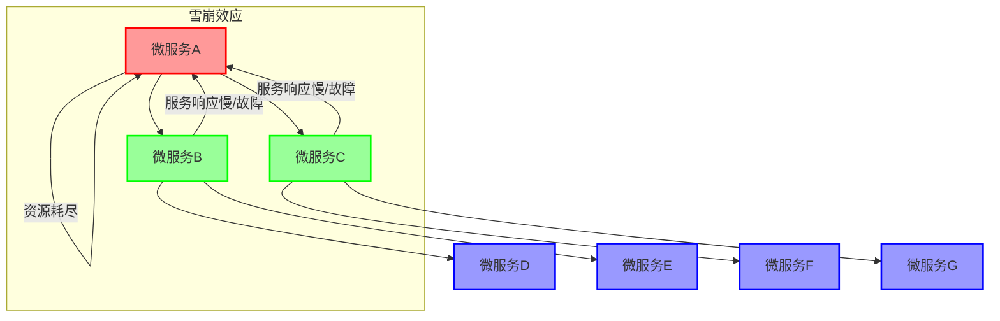
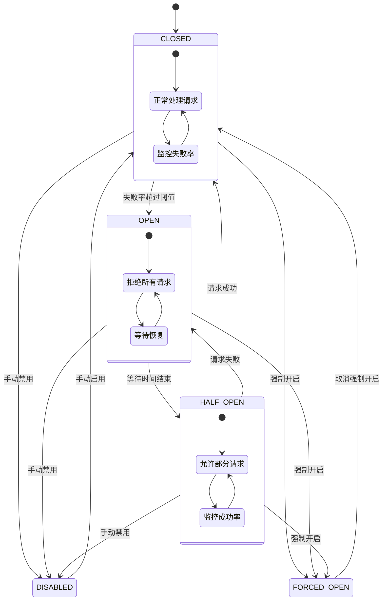
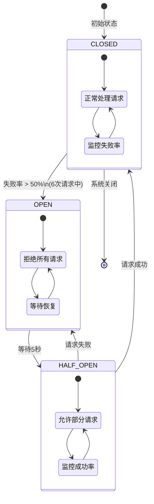
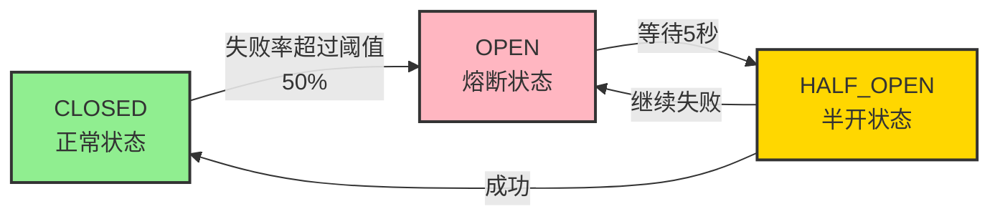
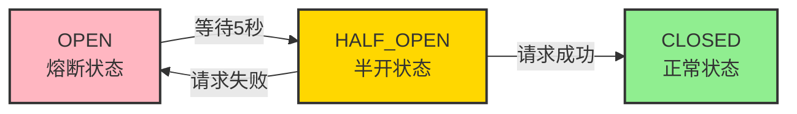

# CircuitBreaker 熔断基础

## Circuit Breaker 能解决的问题

在分布式系统中，复杂的架构通常涉及多个应用程序和依赖关系。某些依赖在某些时刻不可避免地会发生故障，这些故障可能会引发严重的系统问题，例如"雪崩效应"。

### 雪崩效应的成因

在典型的微服务架构中，多个微服务之间通常存在调用链。例如，微服务 A 可能会调用微服务 B 和微服务 C，而 B 和 C 又可能进一步调用其他微服务。这种多层级的调用关系被称为"扇出"。当"扇出"链路中的某个微服务响应时间过长或无法响应时，逐渐占用越来越多的系统资源，最终导致微服务 A 的资源耗尽，进而引发系统崩溃，形成"雪崩效应"。



### 高流量场景中的风险

对于高流量应用而言，即使仅有一个后端依赖出现问题，也可能迅速耗尽整个系统的资源。更糟糕的是，这种情况可能导致服务间的延迟增加，造成队列备份、线程阻塞及其他系统资源紧张，最终引发级联故障。因此，必须通过隔离和管理故障及延迟，确保单一依赖的失败不会影响整个应用或系统的可用性。

### 级联故障的防范

在实际场景中，当某个模块的实例发生故障后，该模块可能继续接收流量并调用其他模块，从而引发级联故障，导致雪崩效应。

为解决这些问题，Circuit Breaker 机制在调用链中引入了"断路器"逻辑，当检测到异常时会主动中断调用，以保护系统避免更大范围的故障扩散。

## Circuit Breaker 的工作原理

Circuit Breaker 的工作原理基于有限状态机，包括以下三个主要状态：

1. **CLOSED（关闭状态）**：这是系统的正常状态，所有请求都能正常通过。当失败率低于阈值时，系统保持在该状态；当失败率超过阈值时，状态会转换为"OPEN"（开启状态）。

2. **OPEN（开启状态）**：当失败率超过设定的阈值时，Circuit Breaker 进入开启状态。在此状态下，所有请求将立即失败，阻止任何对下游服务的调用，以防止系统资源耗尽。

3. **HALF_OPEN（半开状态）**：经过设定的等待时间后，Circuit Breaker 从开启状态转换为半开状态。在此状态下，部分请求会被允许通过，以测试下游服务是否已恢复。如果通过的请求成功率较高，系统会切换回关闭状态；如果失败率依然较高，系统会再次切换回开启状态。

此外，还有两个特殊状态：

- **DISABLED（禁用状态）**：断路器功能被完全关闭，不再监控或限制请求。
- **FORCED_OPEN（强制开启状态）**：无论实际情况如何，断路器被强制设置为开启状态，所有请求都会被拒绝。



### Circuit Breaker 具体状态转换示例

- 当执行的 6 次请求中，失败率达到 50% 时，Circuit Breaker 将进入"开启（OPEN）"状态（类似于保险丝跳闸），此时所有请求都会被拒绝。
- 等待 5 秒后，Circuit Breaker 将自动从"开启（OPEN）"状态过渡到"半开（HALF_OPEN）"状态，允许部分请求通过以测试服务是否恢复正常。
- 如果请求仍然异常，Circuit Breaker 将重新进入"开启（OPEN）"状态；如果请求正常，系统将恢复到"关闭（CLOSED）"状态，继续正常处理请求。



通过这些状态的转换，Circuit Breaker 能有效管理依赖服务的故障，防止系统因部分服务不可用而崩溃。

## 示例实现

### 消费者配置

#### application.yml

```yaml
spring:
  cloud:
    openfeign:
      client:
        config:
          default:
            connectTimeout: 10000 # 连接超时时间
            readTimeout: 10000 # 读取超时时间
  profiles:
    active: dev
```

#### bootstrap.yml

```yaml
spring:
  application:
    name: cloud-consumer-service-feign
  cloud:
    consul:
      host: localhost
      port: 8500
      discovery:
        prefer-ip-address: true
        service-name: ${spring.application.name}
      config:
        prefix: config/consumer-service
        profile-separator: "-"
        format: YAML
        data-key: data
        enabled: true
```

#### application-dev.yml

```yaml
server:
  port: 9988

spring:
  openfeign:
    client:
      config:
        default:
          connectTimeout: 20000
          readTimeout: 20000
    httpclient:
      hc5:
        enabled: true
    compression:
      request:
        enabled: true
        min-request-size: 2048
        mime-types: text/xml,application/xml,application/json
      response:
        enabled: true
    circuitbreaker:
      enabled: true
      group:
        enabled: true

logging:
  level:
    com:
      atguigu:
        cloud:
          apis:
            PayFeignApi: debug

resilience4j:
  circuitbreaker:
    configs:
      default:
        failureRateThreshold: 50
        slidingWindowType: COUNT_BASED
        slidingWindowSize: 6
        minimumNumberOfCalls: 6
        automaticTransitionFromOpenToHalfOpenEnabled: true
        waitDurationInOpenState: 5s
        permittedNumberOfCallsInHalfOpenState: 6
        recordExceptions:
          - java.lang.Exception
    instances:
      cloud-payment-service:
        baseConfig: default
```

### 服务接口定义

```java
@FeignClient(value = "cloud-payment-service")
public interface PayFeignApi {
    @GetMapping(value = "/pay/circuit/{id}")
    public ResultData<String> myCircuit(@PathVariable("id") Integer id);
}
```

### 消费者控制器

```java
@RestController
public class OrderCircuitController {
    @Resource
    private PayFeignApi payFeignApi;

    @GetMapping(value = "/feign/pay/circuit/{id}")
    @CircuitBreaker(name = "cloud-payment-service", fallbackMethod = "myCircuitFallback")
    public ResultData<String> myCircuitBreaker(@PathVariable("id") Integer id) {
        return payFeignApi.myCircuit(id);
    }

    public ResultData<String> myCircuitFallback(Integer id, Throwable t) {
        return ResultData.defaultfail("myCircuitFallback，系统繁忙，请稍后再试-----/(ㄒoㄒ)/~~", "");
    }
}
```

### 生产者控制器

```java
@RestController
public class PayCircuitController {
    @GetMapping(value = "/pay/circuit/{id}")
    public ResultData<String> myCircuit(@PathVariable("id") Integer id) {
        if (id == -4) throw new RuntimeException("----circuit id 不能负数");
        if (id == 9999) {
            try {
                TimeUnit.SECONDS.sleep(5);
            } catch (InterruptedException e) {
                e.printStackTrace();
            }
        }
        return ResultData.defaultsuccess("Hello, circuit! inputId:  " + id + " \t " + IdUtil.simpleUUID());
    }
}
```

## 测试结果

### 测试场景说明

通过模拟请求失败、超时和成功来观察 Circuit Breaker 的状态变化：

1. **初始状态：CLOSED**

   - 系统处于正常状态，所有请求正常通过
   - 发生异常或超时时，开始记录失败

2. **状态转换：CLOSED → HALF_OPEN**

   - 失败率超过阈值时，进入半开状态
   - 允许部分请求通过，检测服务恢复情况

3. **状态转换：HALF_OPEN → OPEN**

   - 多次请求失败后，进入开启状态
   - 拒绝所有请求，避免资源浪费

4. **状态转换：OPEN → HALF_OPEN**

   - 等待指定时间后，进入半开状态
   - 允许少量请求通过，检测服务状态

5. **状态转换：HALF_OPEN → CLOSED**
   - 请求成功率提高后，恢复正常状态
   - 继续正常处理请求

### 状态转换过程

1. **失败后状态变化**：



2. **恢复后状态变化**：


