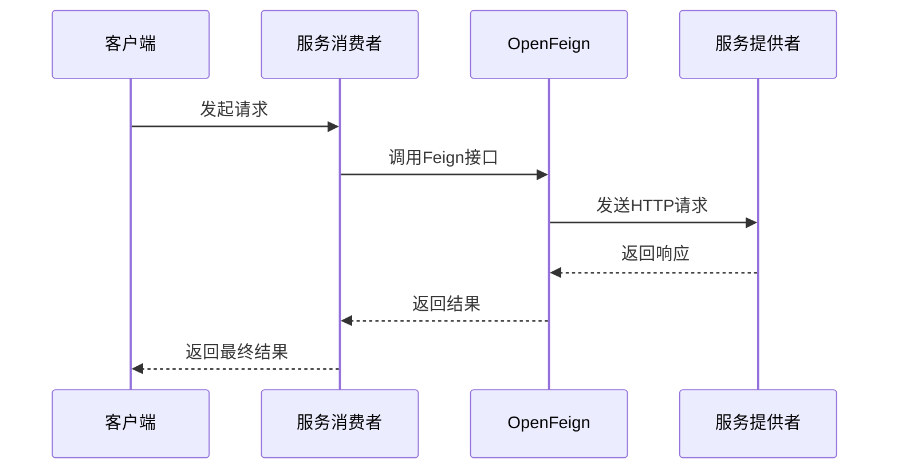

# OpenFeign 详解

## 1. 覆盖 OpenFeign 默认值

每个 **feign 客户端**都是组件集合的一部分，这些组件协同工作以**按需联系远程服务器**。该集合具有一个名称，可通过注解进行定义。

Spring Cloud 支持通过声明式配置来控制 feign 客户端。使用 `@FeignClient` 注解，通过传入指定参数，对服务名称进行定义：

```java
@FeignClient(name = "stores", configuration = FooConfiguration.class)
public interface StoreClient {
    //..
}
```

在这种情况下，客户端由已存在的 `FooConfiguration` 以及 `FeignClientsConfiguration` 中的任何组件组成（其中前者将覆盖后者）。

> [!NOTE] > `FeignClientsConfiguration` 是 `Spring Cloud` 提供的**默认配置类**，用于配置 Feign 客户端。包含 Feign 客户端的基本设置，如编码器、解码器、契约、日志记录等。使用 `@EnableFeignClients` 或 `@FeignClient` 注解时，`FeignClientsConfiguration` 将自动加载并应用到 Feign 客户端，实现 Spring 方式的配置和管理。

> [!NOTE] > `FooConfiguration` 无需使用 `@Configuration` 注解。若进行注解，需将其排除在 `@ComponentScan` 范围之外，避免成为默认的 `feign.Decoder`、`feign.Encoder`、`feign.Contract` 等配置源。可通过将其置于与 `@ComponentScan` 或 `@SpringBootApplication` 不重叠的包中，或在 `@ComponentScan` 中显式排除。

> [!NOTE] > `@FeignClient` 注解中的 `contextId` 属性用于更改客户端集合名称，覆盖客户端名称别名，并作为该客户端配置 bean 名称的一部分。

> [!WARNING]
> 使用 url 属性时，必须指定 name 属性。

支持在 name 和 url 属性中使用占位符：

```java
@FeignClient(name = "${feign.name}", url = "${feign.url}")
public interface StoreClient {
    //..
}
```

> [!NOTE] > `spring-cloud-starter-openfeign` 支持 `spring-cloud-starter-loadbalancer`。作为可选依赖项，使用时需确保已添加到项目中。

### HTTP 客户端配置

使用基于 OkHttpClient 的 Feign 客户端，需确保 OKHttpClient 位于类路径中，并设置：

```properties
spring.cloud.openfeign.okhttp.enabled=true
```

使用基于 Apache HttpClient 5 的 Feign 客户端，需确保 HttpClient 5 位于类路径中。可通过设置 `spring.cloud.openfeign.httpclient.hc5.enabled=false` 禁用其在 Feign 客户端中的使用。使用 Apache HC5 时，可通过提供 `org.apache.hc.client5.http.impl.classic.CloseableHttpClient` 类型的 bean 自定义 HTTP 客户端。

HTTP 客户端属性配置说明：

- `spring.cloud.openfeign.httpclient.xxx` 前缀：适用于所有客户端
- `httpclient` 前缀：适用于 Apache HttpClient 5
- `httpclient.okhttp` 前缀：适用于 OkHttpClient

> [!TIP]
> Spring Cloud OpenFeign 默认不提供以下 Bean，但会从应用程序上下文中查找所需 Bean 创建 Feign 客户端。

# OpenFeign 服务接口调用

## OpenFeign 概述

### 1. LoadBalancer 与 OpenFeign 的区别

LoadBalancer 和 OpenFeign 在微服务架构中具有不同的功能和应用场景：

- **LoadBalancer**：用于多个**服务实例**间的请求分配，实现负载均衡。负责将请求分发至不同服务实例，提升服务可用性和性能。
- **OpenFeign**：声明式 HTTP 客户端，用于服务间通信。通过注解方式定义**服务接口**，无需编写复杂 HTTP 客户端代码。可与 LoadBalancer 结合使用，提供客户端负载均衡功能。

**OpenFeign 的优势**：

- **简化服务调用**：自动处理 HTTP 请求和响应
- **提升可维护性**：声明式接口使代码更直观
- **扩展性**：支持集成日志记录、请求拦截等功能

### 2. LoadBalancer 与 OpenFeign 的选择

在需要频繁服务间通信且追求代码简洁性的微服务架构中，建议使用 OpenFeign。LoadBalancer 可与 OpenFeign 结合使用，实现客户端负载均衡。

仅关注服务实例间负载均衡时，LoadBalancer 可能已足够。在大多数场景中，**OpenFeign 和 LoadBalancer 是互补的，常配合使用**。

### 3. OpenFeign 定义

OpenFeign 是声明式 HTTP 客户端，用于简化微服务间调用。通过注解方式定义服务接口，无需手动编写 HTTP 请求代码。

### 4. OpenFeign 功能特性

OpenFeign 在微服务架构中提供以下核心功能：

- **可插拔注解支持**：支持 Feign 注解和 JAX-RS 注解，使 HTTP 请求定义更直观，支持插件扩展
- **可插拔编码器/解码器**：支持自定义 HTTP 请求和响应的编码器和解码器，支持多种数据格式
- **Sentinel 集成**：支持 Alibaba Sentinel，实现服务熔断、限流和降级
- **LoadBalancer 集成**：支持 Spring Cloud LoadBalancer，实现客户端负载均衡
- **请求/响应压缩**：支持 HTTP 请求和响应压缩，提升传输效率

## OpenFeign 基本用法

### 启动类配置

```java
import org.springframework.boot.SpringApplication;
import org.springframework.boot.autoconfigure.SpringBootApplication;
import org.springframework.cloud.client.discovery.EnableDiscoveryClient;
import org.springframework.cloud.openfeign.EnableFeignClients;
import org.springframework.context.annotation.ComponentScan;

@SpringBootApplication
@EnableDiscoveryClient // 向 Consul 注册中心注册服务
@EnableFeignClients // 启用 OpenFeign
public class SpringApplication {
    public static void main(String[] args) {
        SpringApplication.run(SpringApplication.class, args);
    }
}
```

### 服务提供者实现

```java
import org.springframework.web.bind.annotation.GetMapping;
import org.springframework.web.bind.annotation.PathVariable;
import org.springframework.web.bind.annotation.RestController;

@RestController
public class ProviderController {

    @GetMapping("provider/store/get/{num}")
    public ResultData<String> getStore(@PathVariable("num") Integer num) {
        return ResultData.success("provider store get " + num);
    }
}
```

### 服务接口定义

> [!NOTE]
> 接口中的 API 需与 ProviderController 中的方法参数保持一致

> [!WARNING]
> 建议为每个 OpenFeign 服务接口指定 contextId，避免 name 相同时出现 Bean 冲突

```java
import com.cluod.commons.resp.ResultData;
import org.springframework.cloud.openfeign.FeignClient;
import org.springframework.web.bind.annotation.GetMapping;
import org.springframework.web.bind.annotation.PathVariable;

@FeignClient(name = "cloud-payment-service", contextId = "StoreClient")
public interface StoreClient {

    @GetMapping("provider/store/get/{num}")
    public ResultData getStore(@PathVariable("num") Integer num);
}
```

### 服务消费者实现

```java
import com.cluod.stores.api.StoreClient;
import com.cluod.commons.resp.ResultData;
import jakarta.annotation.Resource;
import org.springframework.web.bind.annotation.GetMapping;
import org.springframework.web.bind.annotation.PathVariable;
import org.springframework.web.bind.annotation.RestController;

@RestController
public class ConsumerController {

    @Resource
    private StoreClient storeClient;

    @GetMapping("consumer/store/get/{num}")
    private ResultData<String> getStore(@PathVariable("num") Integer num) {
        return storeClient.getStore(num);
    }
}
```

### 服务调用流程

1. 调用 ConsumerController 的 getStore() 方法时，OpenFeign 服务调用接口 storeClient 根据 @FeignClient() 中的服务名称或 IP 调用对应服务的 API，实现微服务实例间的调用。

### 服务调用流程图


