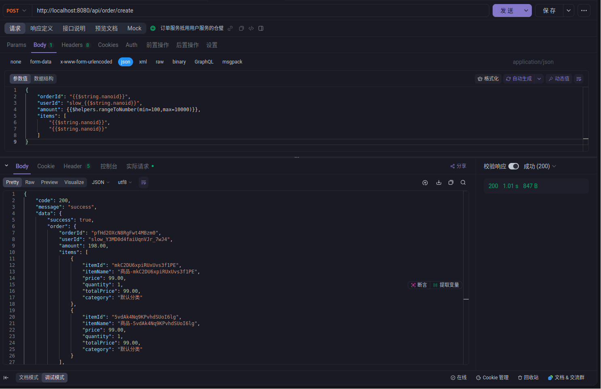
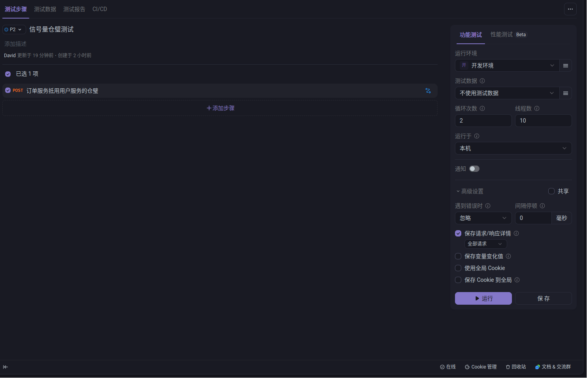
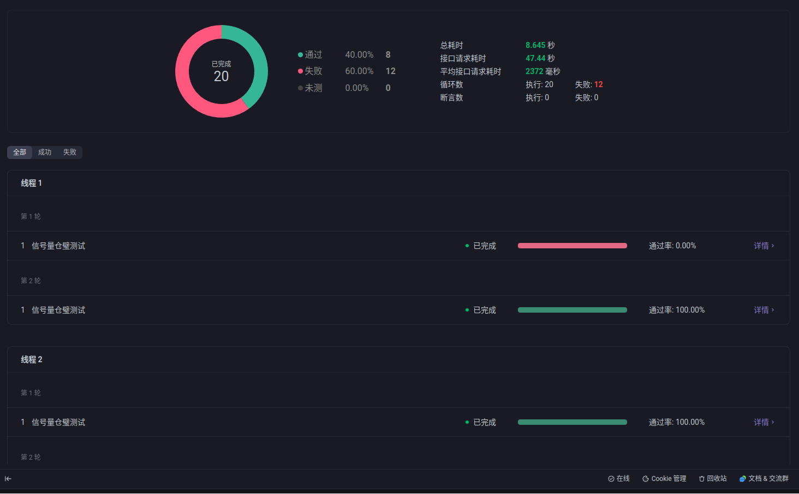
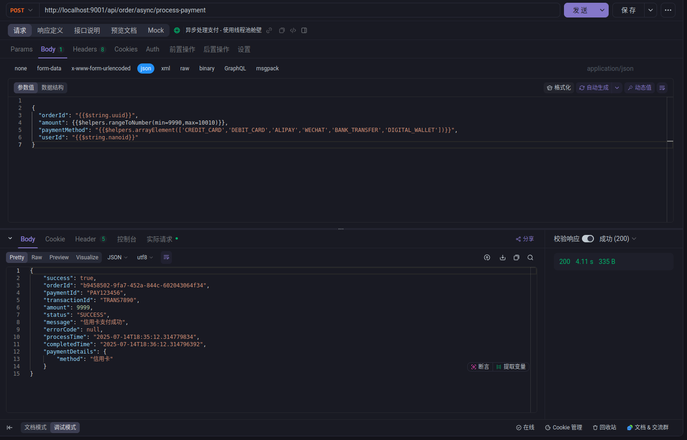
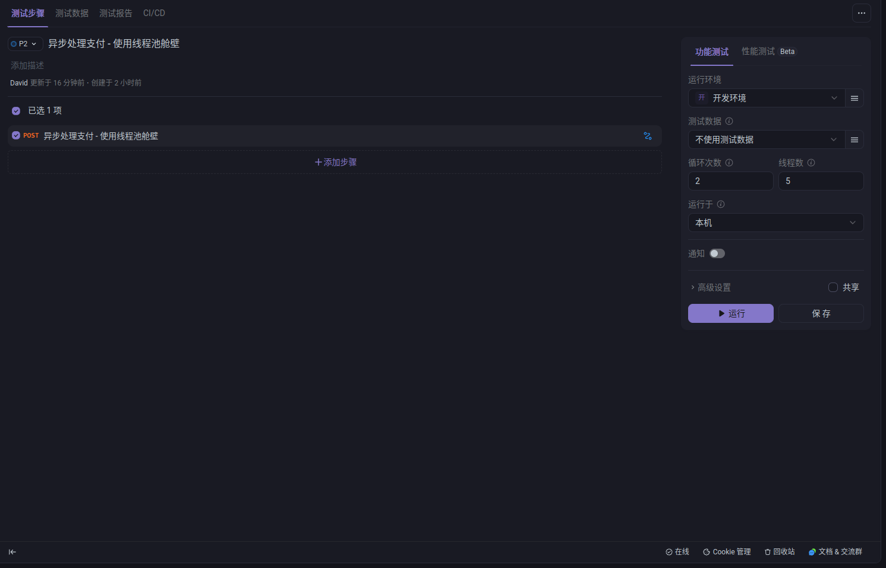
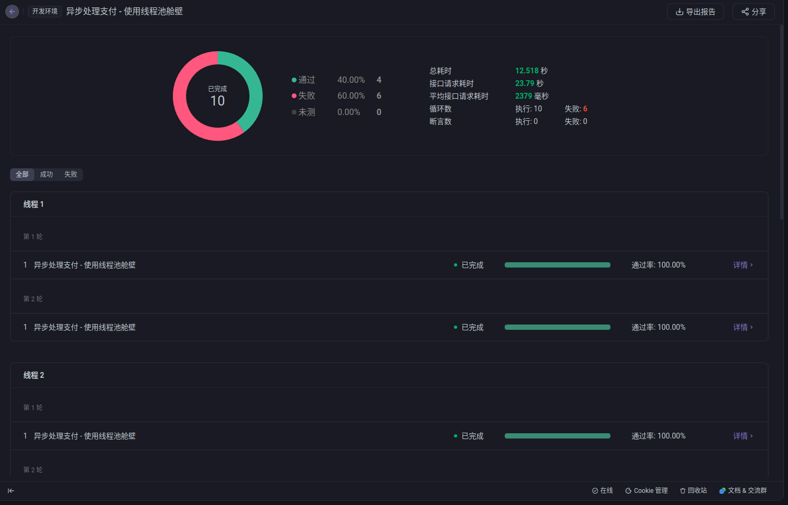
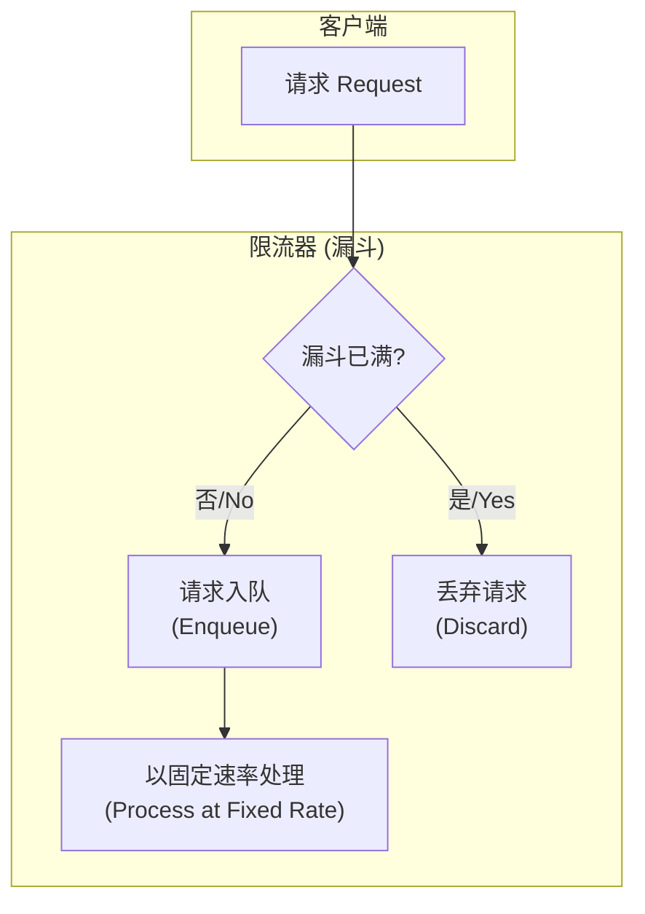
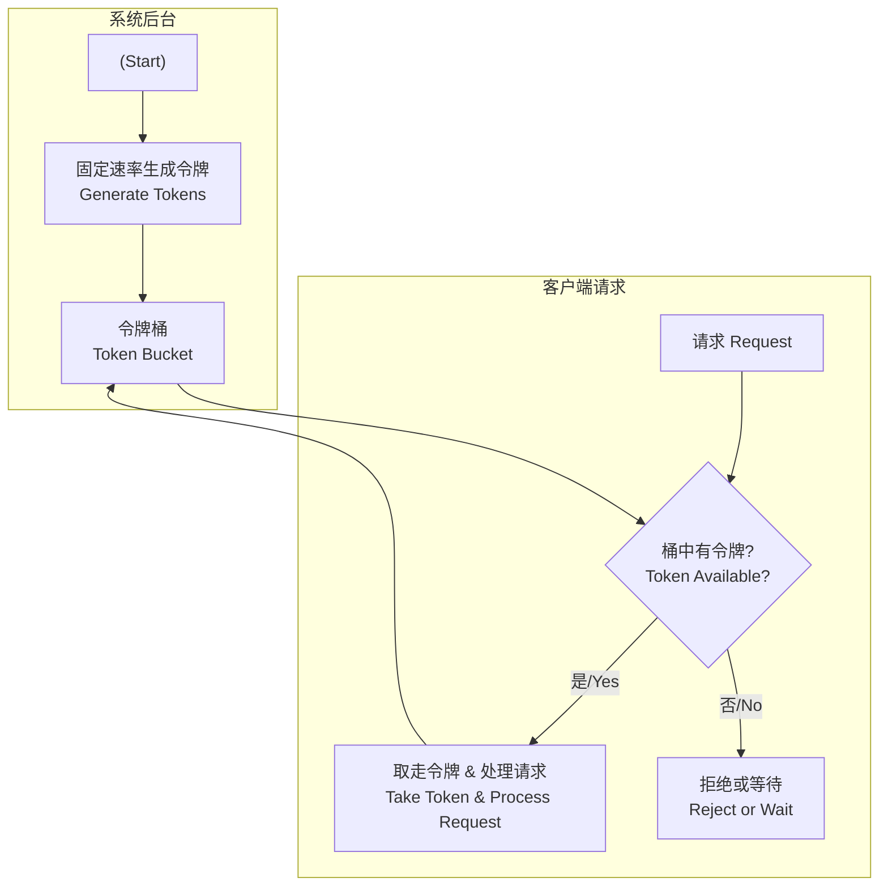
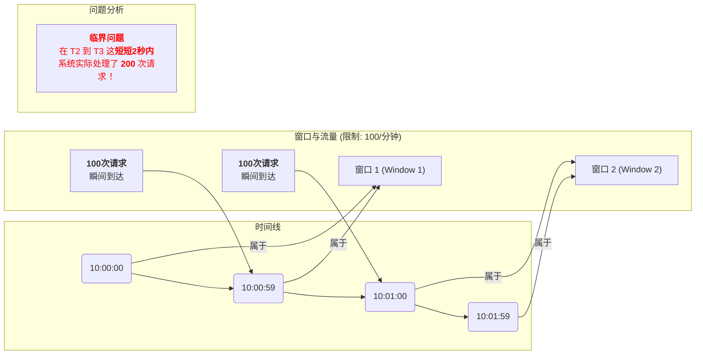
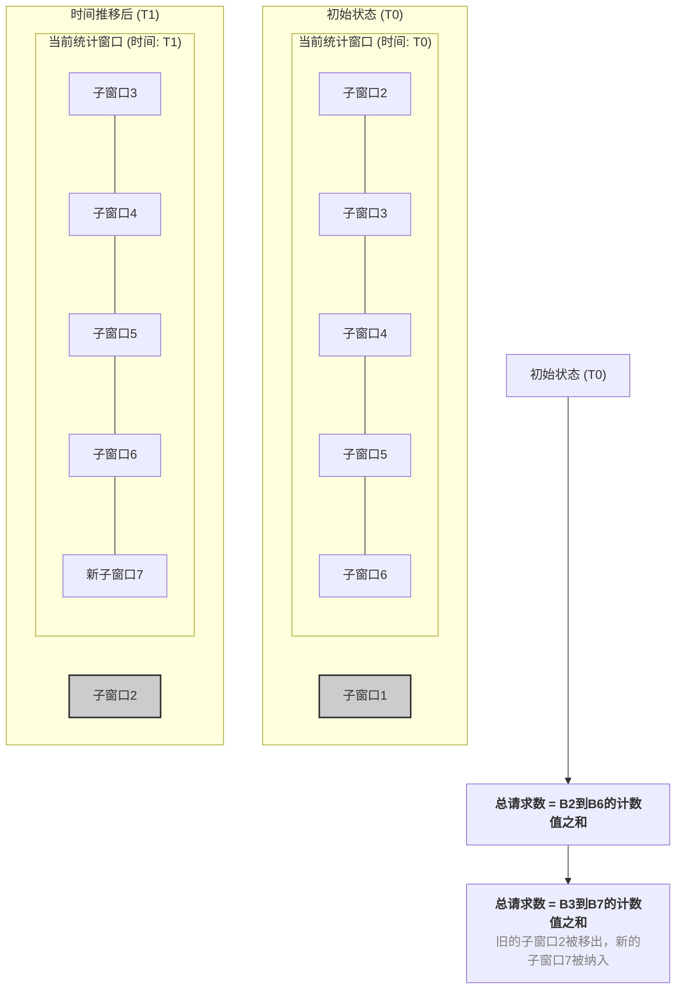

## **什么是 BulkHead 舱壁模式？**

BulkHead（舱壁模式）是一种重要的系统保护机制，主要用于**防止单个组件或服务的故障扩散到整个系统**，从而提高系统的稳定性和可靠性。通过**限制并发执行**的数量，BulkHead 模式可以有效防止系统过载。

## **BulkHead 的实现方式**

### 1. **线程池隔离**

- **工作原理**：为每个服务或组件分配独立的线程池资源
- **优势**：
  - 防止单个服务过载影响整个系统
  - 即使某个服务超出其线程池容量，其他服务仍能正常工作
- **适用场景**：服务之间相对独立且并发量较高的微服务架构

### 2. **信号量隔离**

- **工作原理**：通过信号量限制并发请求数量
- **优势**：
  - 更精细的资源使用控制
  - 相比线程池隔离，资源开销更小
- **适用场景**：资源消耗较高或需要严格控制的场景（如数据库连接池、外部 API 调用）

## **实体类定义**

在实现 BulkHead 舱壁模式之前，我们需要定义相关的实体类和数据传输对象。这些类为我们的示例代码提供了基础结构。

### **用户相关实体类**

````java
// UserDetailsResponse.java
// 用户详情响应
@Data
@Builder
@NoArgsConstructor
@AllArgsConstructor
public class UserDetailsResponse {
    private String userId;
    private String username;
    private String email;
    private LocalDateTime createTime;
    private String status;
    private String phone;
    private String avatar;

    // 扩展字段
    private ConcurrentHashMap<String, Object> extraInfo;
}
```

```java
// BatchUserRequest.java
// 批量用户查询请求
@Data
@Builder
@NoArgsConstructor
@AllArgsConstructor
public class BatchUserRequest {
    @NotEmpty(message = "用户ID列表不能为空")
    private CopyOnWriteArrayList<String> userIds;

    private boolean includeInactive; // 是否包含非活跃用户
    private CopyOnWriteArraySet<String> fields; // 需要返回的字段
}
````

### **订单相关实体类**

```java
// CreateOrderRequest.java
// 创建订单请求
@Data
@Builder
@NoArgsConstructor
@AllArgsConstructor
public class CreateOrderRequest {
    @NotBlank(message = "订单ID不能为空")
    private String orderId;

    @NotBlank(message = "用户ID不能为空")
    private String userId;

    @NotNull(message = "订单金额不能为空")
    @DecimalMin(value = "0.01", message = "订单金额必须大于0")
    private BigDecimal amount;

    @NotEmpty(message = "商品列表不能为空")
    private CopyOnWriteArrayList<String> items;

    private String couponCode; // 优惠券码
    private String remark; // 订单备注
    private ConcurrentHashMap<String, Object> metadata; // 扩展元数据
}
```

```java
// OrderResponse.java
// 订单响应
@Data
@Builder
@NoArgsConstructor
@AllArgsConstructor
public class OrderResponse {
    private boolean success;
    private Order order;
    private String message;
    private String errorCode;
    private boolean needVerification; // 是否需要验证
    private LocalDateTime responseTime;
}
```

```java
// Order.java
// 订单实体
@Data
@Builder
@NoArgsConstructor
@AllArgsConstructor
public class Order {
    private String orderId;
    private String userId;
    private BigDecimal amount;
    private CopyOnWriteArrayList<OrderItem> items;
    private String status; // CREATED, PENDING_VERIFICATION, CONFIRMED, CANCELLED
    private LocalDateTime createTime;
    private LocalDateTime updateTime;
    private String couponCode;
    private BigDecimal discountAmount;
    private BigDecimal finalAmount;
    private String remark;
    private ConcurrentHashMap<String, Object> metadata;
}
```

```java
// OrderItem.java
// 订单项
@Data
@Builder
@NoArgsConstructor
@AllArgsConstructor
public class OrderItem {
    private String itemId;
    private String itemName;
    private BigDecimal price;
    private Integer quantity;
    private BigDecimal totalPrice;
    private String category;
}
```

```java
// BatchOrderRequest.java
// 批量订单请求
@Data
@Builder
@NoArgsConstructor
@AllArgsConstructor
public class BatchOrderRequest {
    @NotEmpty(message = "订单列表不能为空")
    @Size(max = 100, message = "批量处理订单数量不能超过100")
    private CopyOnWriteArrayList<CreateOrderRequest> orders;

    private boolean validateUser; // 是否验证用户
    private boolean allowPartialSuccess; // 是否允许部分成功
}
```

```java
// BatchOrderResponse.java
// 批量订单响应
@Data
@Builder
@NoArgsConstructor
@AllArgsConstructor
public class BatchOrderResponse {
    private boolean success;
    private CopyOnWriteArrayList<Order> orders;
    private CopyOnWriteArrayList<String> failedOrderIds;
    private int processedCount;
    private int successCount;
    private int failedCount;
    private String message;
    private ConcurrentHashMap<String, String> errors; // orderId -> errorMessage
}
```

### **支付相关实体类**

```java
// PaymentRequest.java
// 支付请求
@Data
@Builder
@NoArgsConstructor
@AllArgsConstructor
public class PaymentRequest {
    @NotBlank(message = "订单ID不能为空")
    private String orderId;

    @NotBlank(message = "用户ID不能为空")
    private String userId;

    @NotNull(message = "支付金额不能为空")
    @DecimalMin(value = "0.01", message = "支付金额必须大于0")
    private BigDecimal amount;

    @NotBlank(message = "支付方式不能为空")
    private String paymentMethod; // CREDIT_CARD, ALIPAY, WECHAT, BANK_TRANSFER

    private String bankCard; // 银行卡号（脱敏）
    private String currency; // 货币类型，默认CNY
    private String callbackUrl; // 回调地址
    private ConcurrentHashMap<String, String> extraParams; // 额外参数
}
```

```java
// PaymentResponse.java
// 支付响应
@Data
@Builder
@NoArgsConstructor
@AllArgsConstructor
public class PaymentResponse {
    private boolean success;
    private String orderId;
    private String paymentId;
    private String transactionId; // 第三方交易ID
    private BigDecimal amount;
    private String status; // PENDING, SUCCESS, FAILED, CANCELLED
    private String message;
    private String errorCode;
    private LocalDateTime processTime;
    private LocalDateTime completedTime;
    private ConcurrentHashMap<String, Object> paymentDetails;
}
```

```java
// PaymentException.java
// 支付异常
public class PaymentException extends RuntimeException {
    private String errorCode;
    private String orderId;

    public PaymentException(String message) {
        super(message);
    }

    public PaymentException(String message, String errorCode) {
        super(message);
        this.errorCode = errorCode;
    }

    public PaymentException(String message, String errorCode, String orderId) {
        super(message);
        this.errorCode = errorCode;
        this.orderId = orderId;
    }

    // getters and setters
    public String getErrorCode() { return errorCode; }
    public void setErrorCode(String errorCode) { this.errorCode = errorCode; }
    public String getOrderId() { return orderId; }
    public void setOrderId(String orderId) { this.orderId = orderId; }
}
```

### **通知相关实体类**

```java
// NotificationRequest.java
// 通知请求
@Data
@Builder
@NoArgsConstructor
@AllArgsConstructor
public class NotificationRequest {
    @NotBlank(message = "用户ID不能为空")
    private String userId;

    @NotBlank(message = "通知类型不能为空")
    private String type; // EMAIL, SMS, PUSH, PAYMENT_SUCCESS, ORDER_UPDATE

    @NotBlank(message = "通知内容不能为空")
    private String content;

    private String title; // 通知标题
    private String orderId; // 关联订单ID
    private String templateId; // 模板ID
    private ConcurrentHashMap<String, Object> templateParams; // 模板参数
    private CopyOnWriteArrayList<String> channels; // 通知渠道：email, sms, push
    private Integer priority; // 优先级：1-5，5最高
    private LocalDateTime scheduledTime; // 定时发送时间
}
```

```java
// NotificationResponse.java
// 通知响应
@Data
@Builder
@NoArgsConstructor
@AllArgsConstructor
public class NotificationResponse {
    private boolean success;
    private String notificationId;
    private String userId;
    private String message;
    private String errorCode;
    private LocalDateTime sentTime;
    private CopyOnWriteArrayList<String> successChannels; // 成功发送的渠道
    private CopyOnWriteArrayList<String> failedChannels; // 失败的渠道
    private ConcurrentHashMap<String, String> channelResults; // 各渠道详细结果
}
```

### **组合处理相关实体类**

```java
// CompleteOrderRequest.java
// 完整订单处理请求
@Data
@Builder
@NoArgsConstructor
@AllArgsConstructor
public class CompleteOrderRequest {
    @NotBlank(message = "订单ID不能为空")
    private String orderId;

    @NotNull(message = "支付请求不能为空")
    private PaymentRequest paymentRequest;

    @NotNull(message = "通知请求不能为空")
    private NotificationRequest notificationRequest;

    private boolean requirePaymentSuccess; // 是否要求支付成功
    private boolean allowAsyncNotification; // 是否允许异步通知
    private Integer timeoutSeconds; // 超时时间（秒）
}
```

```java
// CompleteOrderResponse.java
// 完整订单处理响应
@Data
@Builder
@NoArgsConstructor
@AllArgsConstructor
public class CompleteOrderResponse {
    private String orderId;
    private boolean paymentSuccess;
    private boolean notificationSent;
    private PaymentResponse paymentResponse;
    private NotificationResponse notificationResponse;
    private LocalDateTime completedTime;
    private String message;
    private String status; // SUCCESS, PARTIAL_SUCCESS, FAILED
    private CopyOnWriteArrayList<String> warnings; // 警告信息
    private ConcurrentHashMap<String, Object> additionalInfo;
}
```

### **用户信息相关类**

```java
// UserInfo.java
// 用户信息实体
@Data
@Builder
@NoArgsConstructor
@AllArgsConstructor
public class UserInfo {
    private String userId;
    private String username;
    private String email;
    private String phone;
    private String status; // ACTIVE, INACTIVE, SUSPENDED
    private UserProfile profile;
    private UserPermissions permissions;
    private LocalDateTime createTime;
    private LocalDateTime lastLoginTime;
    private ConcurrentHashMap<String, Object> metadata;
}
```

```java
// UserProfile.java
// 户档案
@Data
@Builder
@NoArgsConstructor
@AllArgsConstructor
public class UserProfile {
    private String nickname;
    private String avatar;
    private String gender;
    private LocalDate birthday;
    private String address;
    private String occupation;
    private CopyOnWriteArrayList<String> interests;
}
```

```java
// UserPermissions.java
// 用户权限
@Data
@Builder
@NoArgsConstructor
@AllArgsConstructor
public class UserPermissions {
    private CopyOnWriteArrayList<String> roles;
    private CopyOnWriteArrayList<String> permissions;
    private ConcurrentHashMap<String, Object> resourceLimits; // 资源限制
    private LocalDateTime permissionUpdateTime;
}
```

### **配置和枚举类**

```java
// BulkheadType.java
// 舱壁类型枚举
public enum BulkheadType {
    SEConcurrentHashMapHORE("信号量舱壁"),
    THREAD_POOL("线程池舱壁");

    private final String description;

    BulkheadType(String description) {
        this.description = description;
    }

    public String getDescription() {
        return description;
    }
}
```

```java
// ServiceStatus.java
// 服务状态枚举
public enum ServiceStatus {
    HEALTHY("健康"),
    DEGRADED("降级"),
    UNHEALTHY("不健康"),
    CIRCUIT_OPEN("熔断开启"),
    BULKHEAD_FULL("舱壁满载");

    private final String description;

    ServiceStatus(String description) {
        this.description = description;
    }

    public String getDescription() {
        return description;
    }
}
```

```java
// PaymentMethod.java
// 支付方式枚举
public enum PaymentMethod {
    CREDIT_CARD("信用卡"),
    DEBIT_CARD("借记卡"),
    ALIPAY("支付宝"),
    WECHAT("微信支付"),
    BANK_TRANSFER("银行转账"),
    DIGITAL_WALLET("数字钱包");

    private final String description;

    PaymentMethod(String description) {
        this.description = description;
    }

    public String getDescription() {
        return description;
    }
}
```

```java
// NotificationType.java
// 通知类型枚举
public enum NotificationType {
    EMAIL("邮件通知"),
    SMS("短信通知"),
    PUSH("推送通知"),
    PAYMENT_SUCCESS("支付成功通知"),
    ORDER_UPDATE("订单更新通知"),
    SYSTEM_ALERT("系统告警");

    private final String description;

    NotificationType(String description) {
        this.description = description;
    }

    public String getDescription() {
        return description;
    }
}
```

### **异常处理类**

```java
// BulkheadException.java
// 舱壁异常
public class BulkheadException extends RuntimeException {
    private String serviceName;
    private BulkheadType bulkheadType;
    private String errorCode;

    public BulkheadException(String message) {
        super(message);
    }

    public BulkheadException(String message, String serviceName, BulkheadType bulkheadType) {
        super(message);
        this.serviceName = serviceName;
        this.bulkheadType = bulkheadType;
    }

    public BulkheadException(String message, Throwable cause) {
        super(message, cause);
    }

    // getters and setters
    public String getServiceName() { return serviceName; }
    public void setServiceName(String serviceName) { this.serviceName = serviceName; }
    public BulkheadType getBulkheadType() { return bulkheadType; }
    public void setBulkheadType(BulkheadType bulkheadType) { this.bulkheadType = bulkheadType; }
    public String getErrorCode() { return errorCode; }
    public void setErrorCode(String errorCode) { this.errorCode = errorCode; }
}
```

```java
// ServiceUnavailableException.java
// 服务不可用异常
public class ServiceUnavailableException extends RuntimeException {
    private String serviceName;
    private ServiceStatus serviceStatus;
    private LocalDateTime timestamp;

    public ServiceUnavailableException(String message, String serviceName) {
        super(message);
        this.serviceName = serviceName;
        this.timestamp = LocalDateTime.now();
    }

    public ServiceUnavailableException(String message, String serviceName, ServiceStatus serviceStatus) {
        super(message);
        this.serviceName = serviceName;
        this.serviceStatus = serviceStatus;
        this.timestamp = LocalDateTime.now();
    }

    // getters and setters
    public String getServiceName() { return serviceName; }
    public void setServiceName(String serviceName) { this.serviceName = serviceName; }
    public ServiceStatus getServiceStatus() { return serviceStatus; }
    public void setServiceStatus(ServiceStatus serviceStatus) { this.serviceStatus = serviceStatus; }
    public LocalDateTime getTimestamp() { return timestamp; }
    public void setTimestamp(LocalDateTime timestamp) { this.timestamp = timestamp; }
}
```

### **工具类**

```java
// IdGenerator.java
// ID生成工具
@Component
public class IdGenerator {
    private static final String ORDER_PREFIX = "ORD";
    private static final String PAYMENT_PREFIX = "PAY";
    private static final String NOTIFICATION_PREFIX = "NOT";

    public String generateOrderId() {
        return ORDER_PREFIX + System.currentTimeMillis() +
               String.format("%04d", new Random().nextInt(10000));
    }

    public String generatePaymentId() {
        return PAYMENT_PREFIX + System.currentTimeMillis() +
               String.format("%04d", new Random().nextInt(10000));
    }

    public String generateNotificationId() {
        return NOTIFICATION_PREFIX + System.currentTimeMillis() +
               String.format("%04d", new Random().nextInt(10000));
    }

    public String generateTempOrderId() {
        return "TEMP_" + generateOrderId();
    }
}
```

```java
// ValidationUtils.java
// 验证工具类
@Component
public class ValidationUtils {

    public boolean isValidUserId(String userId) {
        return userId != null && userId.trim().length() > 0 &&
               userId.matches("^[a-zA-Z0-9_]{3,32}$");
    }

    public boolean isValidAmount(BigDecimal amount) {
        return amount != null && amount.compareTo(BigDecimal.ZERO) > 0 &&
               amount.compareTo(BigDecimal.valueOf(1000000)) <= 0;
    }

    public boolean isValidOrderId(String orderId) {
        return orderId != null && orderId.trim().length() > 0 &&
               orderId.matches("^[A-Z0-9_]{6,50}$");
    }

    public boolean isValidEmail(String email) {
        return email != null &&
               email.matches("^[A-Za-z0-9+_.-]+@([A-Za-z0-9.-]+\\.[A-Za-z]{2,})$");
    }

    public boolean isValidPhoneNumber(String phone) {
        return phone != null &&
               phone.matches("^1[3-9]\\d{9}$");
    }
}
```

## **实现 SeConcurrentHashMaphoreBulkhead（信号量舱壁）**

BulkHead 模式在 Resilience4j 中提供了两种实现方式：信号量舱壁（SeConcurrentHashMaphoreBulkhead）和固定线程池舱壁（FixedThreadPoolBulkhead）。下面我们分别实现这两种方式。

> [!NOTE]
> 信号量舱壁通过控制同时访问资源的线程数量来实现隔离，适用于轻量级的资源控制场景。

### **order-service 依赖配置**

```xml
<dependency>
    <groupId>org.springframework.cloud</groupId>
    <artifactId>spring-cloud-starter-circuitbreaker-resilience4j</artifactId>
</dependency>
<dependency>
    <groupId>io.github.resilience4j</groupId>
    <artifactId>resilience4j-bulkhead</artifactId>
</dependency>
<dependency>
    <groupId>org.springframework.boot</groupId>
    <artifactId>spring-boot-starter-aop</artifactId>
</dependency>
```

### **order-service 配置文件**

```yaml
// application.yml
spring:
  application:
    name: order-service
  cloud:
    consul:
      host: localhost
      port: 8500
      discovery:
        service-name: ${spring.application.name}
    openfeign:
      client:
        config:
          default:
            connect-timeout: 3000 # 连接超时时间
            read-timeout: 3000 # 读取超时时间
      circuitbreaker:
        enabled: false
        group:
          enabled: false
      httpclient:
        hc5:
          enabled: true

resilience4j:
  bulkhead:
    configs:
      default:
        # 信号量舱壁配置
        maxConcurrentCalls: 3 # 最大并发调用数
        maxWaitDuration: 4s # 最大等待时间
    instances:
      # 用户服务信号量舱壁
      user-service:
        baseConfig: default
        maxConcurrentCalls: 2 # 用户服务限制更严格
        maxWaitDuration: 2s # 最大等待时间
  timelimiter:
    instances:
      user-service: # 实例名称，需要和熔断器配置的实例名对应
        timeoutDuration: 3s # 超时时间

# 启用监控端点
management:
  endpoints:
    web:
      exposure:
        include: health,info,metrics,bulkheads
  endpoint:
    health:
      show-details: always
```

### **order-service 实现**

```java
// orderServiceMain.java
@SpringBootApplication
@EnableDiscoveryClient
@EnableFeignClients
public class orderServiceMain {
    public static void main(String[] args) {
        SpringApplication.run(orderServiceMain.class, args);
    }
}
```

```java
// WebClientConfig.java
@Configuration
public class WebClientConfig {

    @Bean
    @LoadBalanced
    public WebClient.Builder loadBalancedWebClientBuilder() {
        return WebClient.builder();
    }
}
```

```java
// UserFeignClient.java
@FeignClient(name = "user-service", path = "/api/user")
public interface UserFeignClient {

    @GetMapping("/details/{userId}")
    ResponseResult<UserDetailsResponse> getUserDetails(@PathVariable("userId") String userId);
}
```

```java
// OrderController.java
@Slf4j
@RequestMapping("/api/order")
@RequiredArgsConstructor
@RestController
public class OrderController {

        private final UserFeignClient userFeignClient;

        private final OrderService orderService;

        /**
         * 创建订单 - 使用信号量舱壁保护用户服务调用
         */
        @PostMapping("/create")
        @Bulkhead(name = "user-service", type = Bulkhead.Type.SEMAPHORE, fallbackMethod = "createOrderFallback")
        public ResponseResult<OrderResponse> createOrder(@RequestBody CreateOrderRequest request) {
                log.info("开始创建订单: {}", request.getOrderId());

                try {
                        // 1. 验证用户信息（受信号量保护）
                        UserDetailsResponse user = userFeignClient.getUserDetails(request.getUserId()).getData();
                        log.info("用户验证成功: {}", user.getUsername());

                        // 2. 创建订单
                        Order order = orderService.createOrder(request, user);

                        return ResponseResult.success(OrderResponse.builder()
                                        .success(true)
                                        .order(order)
                                        .message("订单创建成功")
                                        .build());

                } catch (Exception e) {
                        log.error("创建订单失败: {}", e.getMessage(), e);
                        throw e; // 触发舱壁降级
                }
        }
        // ================ 降级方法 ================

        /**
         * 创建订单降级方法
         */
        public ResponseResult<OrderResponse> createOrderFallback(CreateOrderRequest request, Exception ex) {
                log.warn("用户服务调用受限，订单创建降级. 订单ID: {}, 异常: {}",
                                request.getOrderId(), ex.getMessage());

                // 创建临时订单，等待后续处理
                Order tempOrder = orderService.createTemporaryOrder(request);

                return ResponseResult.success(OrderResponse.builder()
                                .success(true)
                                .order(tempOrder)
                                .message("系统繁忙，订单已创建但需要稍后验证用户信息")
                                .needVerification(true)
                                .build());
        }
}
```

```java
// OrderService.java
@Slf4j
@Service
public class OrderService {

    private final Random random = new Random();

    // 模拟商品数据
    private final Map<String, OrderItem> mockItems = Map.of(
            "item001",
            OrderItem.builder().itemId("item001").itemName("笔记本电脑").price(new BigDecimal("5999.00")).category("电子产品")
                    .build(),
            "item002",
            OrderItem.builder().itemId("item002").itemName("无线鼠标").price(new BigDecimal("199.00")).category("电子产品")
                    .build(),
            "item003",
            OrderItem.builder().itemId("item003").itemName("机械键盘").price(new BigDecimal("399.00")).category("电子产品")
                    .build(),
            "item004",
            OrderItem.builder().itemId("item004").itemName("显示器").price(new BigDecimal("1299.00")).category("电子产品")
                    .build(),
            "item005", OrderItem.builder().itemId("item005").itemName("手机").price(new BigDecimal("3999.00"))
                    .category("电子产品").build());

    /**
     * 创建订单
     */
    public Order createOrder(CreateOrderRequest request, UserDetailsResponse user) {
        log.info("开始创建订单，订单ID: {}, 用户: {}", request.getOrderId(), user.getUsername());

        // 构建订单商品列表
        List<OrderItem> orderItems = buildOrderItems(request.getItems());

        // 计算订单总金额
        BigDecimal calculatedAmount = calculateTotalAmount(orderItems);

        // 应用优惠券折扣
        BigDecimal discountAmount = applyDiscount(request.getCouponCode(), calculatedAmount);
        BigDecimal finalAmount = calculatedAmount.subtract(discountAmount);

        // 构建订单
        Order order = Order.builder()
                .orderId(request.getOrderId())
                .userId(request.getUserId())
                .amount(calculatedAmount)
                .items(orderItems)
                .status("CONFIRMED")
                .createTime(LocalDateTime.now())
                .updateTime(LocalDateTime.now())
                .couponCode(request.getCouponCode())
                .discountAmount(discountAmount)
                .finalAmount(finalAmount)
                .remark(request.getRemark())
                .metadata(request.getMetadata() != null ? request.getMetadata() : new ConcurrentHashMap<>())
                .build();

        // 添加一些元数据
        order.getMetadata().put("createdBy", user.getUsername());
        order.getMetadata().put("userStatus", user.getStatus());
        order.getMetadata().put("processTime", System.currentTimeMillis());

        log.info("订单创建成功，订单ID: {}, 最终金额: {}", order.getOrderId(), order.getFinalAmount());
        return order;
    }

    /**
     * 批量创建订单
     */
    public List<Order> batchCreateOrders(List<CreateOrderRequest> requests,
            List<UserDetailsResponse> users) {
        log.info("开始批量创建订单，数量: {}", requests.size());

        List<Order> orders = new CopyOnWriteArrayList<>();

        // 创建用户ID到用户信息的映射
        Map<String, UserDetailsResponse> userMap = new ConcurrentHashMap<>();
        users.forEach(user -> userMap.put(user.getUserId(), user));

        for (CreateOrderRequest request : requests) {
            try {
                UserDetailsResponse user = userMap.get(request.getUserId());
                if (user != null) {
                    Order order = createOrder(request, user);
                    orders.add(order);
                } else {
                    log.warn("用户信息不存在，跳过订单创建: {}", request.getOrderId());
                }
            } catch (Exception e) {
                log.error("创建订单失败，订单ID: {}, 错误: {}", request.getOrderId(), e.getMessage());
            }
        }

        log.info("批量订单创建完成，成功数量: {}", orders.size());
        return orders;
    }

    /**
     * 创建临时订单（降级时使用）
     */
    public Order createTemporaryOrder(CreateOrderRequest request) {
        log.info("创建临时订单，订单ID: {}", request.getOrderId());

        // 构建订单商品列表
        List<OrderItem> orderItems = buildOrderItems(request.getItems());

        // 计算订单总金额
        BigDecimal calculatedAmount = calculateTotalAmount(orderItems);

        // 应用优惠券折扣
        BigDecimal discountAmount = applyDiscount(request.getCouponCode(), calculatedAmount);
        BigDecimal finalAmount = calculatedAmount.subtract(discountAmount);

        // 构建临时订单
        Order order = Order.builder()
                .orderId(request.getOrderId())
                .userId(request.getUserId())
                .amount(calculatedAmount)
                .items(orderItems)
                .status("PENDING_VERIFICATION") // 临时订单状态
                .createTime(LocalDateTime.now())
                .updateTime(LocalDateTime.now())
                .couponCode(request.getCouponCode())
                .discountAmount(discountAmount)
                .finalAmount(finalAmount)
                .remark(request.getRemark())
                .metadata(request.getMetadata() != null ? request.getMetadata() : new ConcurrentHashMap<>())
                .build();

        // 添加临时订单标识
        order.getMetadata().put("isTemporary", true);
        order.getMetadata().put("needVerification", true);
        order.getMetadata().put("processTime", System.currentTimeMillis());

        log.info("临时订单创建成功，订单ID: {}, 状态: {}", order.getOrderId(), order.getStatus());
        return order;
    }

    /**
     * 构建订单商品列表
     */
    private List<OrderItem> buildOrderItems(List<String> itemIds) {
        List<OrderItem> orderItems = new CopyOnWriteArrayList<>();

        for (String itemId : itemIds) {
            OrderItem mockItem = mockItems.get(itemId);
            if (mockItem != null) {
                // 模拟随机数量
                int quantity = random.nextInt(3) + 1; // 1-3个

                OrderItem orderItem = OrderItem.builder()
                        .itemId(mockItem.getItemId())
                        .itemName(mockItem.getItemName())
                        .price(mockItem.getPrice())
                        .quantity(quantity)
                        .totalPrice(mockItem.getPrice().multiply(BigDecimal.valueOf(quantity)))
                        .category(mockItem.getCategory())
                        .build();

                orderItems.add(orderItem);
            } else {
                // 创建默认商品
                int quantity = random.nextInt(2) + 1;
                BigDecimal price = new BigDecimal("99.00");

                OrderItem defaultItem = OrderItem.builder()
                        .itemId(itemId)
                        .itemName("商品-" + itemId)
                        .price(price)
                        .quantity(quantity)
                        .totalPrice(price.multiply(BigDecimal.valueOf(quantity)))
                        .category("默认分类")
                        .build();

                orderItems.add(defaultItem);
            }
        }

        return orderItems;
    }

    /**
     * 计算订单总金额
     */
    private BigDecimal calculateTotalAmount(List<OrderItem> items) {
        return items.stream()
                .map(OrderItem::getTotalPrice)
                .reduce(BigDecimal.ZERO, BigDecimal::add);
    }

    /**
     * 应用优惠券折扣
     */
    private BigDecimal applyDiscount(String couponCode, BigDecimal amount) {
        if (couponCode == null || couponCode.trim().isEmpty()) {
            return BigDecimal.ZERO;
        }

        // 模拟不同优惠券
        return switch (couponCode.toUpperCase()) {
            case "VIP10" -> amount.multiply(new BigDecimal("0.1")); // 9折
            case "NEW20" -> amount.multiply(new BigDecimal("0.2")); // 8折
            case "SAVE50" -> new BigDecimal("50.00"); // 立减50元
            case "SAVE100" -> new BigDecimal("100.00"); // 立减100元
            default -> BigDecimal.ZERO; // 无效优惠券
        };
    }
}
```

### **user-service 配置文件**

```yml
// application.yml
spring:
  application:
    name: user-service
  cloud:
    consul:
      host: localhost
      port: 8500
      discovery:
        service-name: ${spring.application.name}
```

### **user-service 实现**

```java
// UserServiceMain.java
@SpringBootApplication
@EnableDiscoveryClient
@RefreshScope
public class UserServiceMain {
    public static void main(String[] args) {
        SpringApplication.run(UserServiceMain.class, args);
    }
}
```

```java
// UserServiceMain.java
@RestController
@RequestMapping("/api/user")
@Slf4j
public class UserController {

    /**
     * 获取用户详情 - 模拟耗时操作
     */
    @GetMapping("/details/{userId}")
    public ResponseResult<UserDetailsResponse> getUserDetails(@PathVariable("userId") String userId) {
        log.info("开始获取用户详情: {}", userId);

        // 模拟不同的处理时间
        if (userId.contains("slow")) {
            try {
                TimeUnit.SECONDS.sleep(2); // 模拟慢查询
                log.info("慢查询完成: {}", userId);
            } catch (InterruptedException e) {
                Thread.currentThread().interrupt();
                throw new RuntimeException("查询被中断", e);
            }
        }

        if (userId.contains("error")) {
            throw new RuntimeException("用户服务内部错误");
        }

        // 正常处理
        return ResponseResult.success(UserDetailsResponse.builder()
                .userId(userId)
                .username("user_" + userId)
                .email(userId + "@example.com")
                .createTime(LocalDateTime.now())
                .status("ACTIVE")
                .build());
    }
}
```

### **信号量舱壁测试**

#### **并发测试脚本**





#### **期望测试结果**

- 失败：仓璧降级调用
- 成功：正常处理



## **实现 FixedThreadPoolBulkhead（固定线程池舱壁）**

固定线程池舱壁使用独立的线程池来执行受保护的操作，提供更强的隔离性，适用于 I/O 密集型或长时间运行的操作。

### **order-service 依赖配置**

```xml
<dependency>
    <groupId>org.springframework.cloud</groupId>
    <artifactId>spring-cloud-starter-circuitbreaker-resilience4j</artifactId>
</dependency>
<dependency>
    <groupId>io.github.resilience4j</groupId>
    <artifactId>resilience4j-bulkhead</artifactId>
</dependency>
<dependency>
    <groupId>org.springframework.boot</groupId>
    <artifactId>spring-boot-starter-aop</artifactId>
</dependency>
```

### **order-service 配置文件**

```yaml
// application.yml
spring:
  application:
    name: order-service
  cloud:
    consul:
      host: localhost
      port: 8500
      discovery:
        service-name: ${spring.application.name}
    openfeign:
      client:
        config:
          default:
            connect-timeout: 5000 # 连接超时时间
            read-timeout: 5000 # 读取超时时间
      circuitbreaker:
        enabled: false
        group:
          enabled: false
      httpclient:
        hc5:
          enabled: true

resilience4j:
  thread-pool-bulkhead:
    instances:
      # 支付服务线程池舱壁
      payment-service:
        maxThreadPoolSize: 1
        coreThreadPoolSize: 1
        queueCapacity: 1
      # 通知服务线程池舱壁
  timelimiter:
    instances:
      payment-service: # 实例名称，需要和熔断器配置的实例名对应
        timeoutDuration: 5s # 超时时间

# 启用监控端点
management:
  endpoints:
    web:
      exposure:
        include: health,info,metrics,bulkheads
  endpoint:
    health:
      show-details: always
```

### **Order-service 实现**

```java
// OrderMain.java
@SpringBootApplication
@EnableDiscoveryClient
@EnableFeignClients
public class OrderMain
{
    public static void main(String[] args)
    {
        SpringApplication.run(OrderMain.class,args);
    }
}
```

```java
// PaymentFeignClient.java
@FeignClient(name = "payment-service", path = "/api/payment")
public interface PaymentFeignClient {

    @PostMapping("/process")
    PaymentResponse processPayment(@RequestBody PaymentRequest request);
}
```

```java
// OrderAsyncController.java
@Slf4j
@RestController
@RequestMapping("/api/order/async")
@RequiredArgsConstructor
public class OrderAsyncController {
    private final PaymentFeignClient paymentFeignClient;

    /**
     * 异步处理支付 - 使用线程池舱壁
     */
    @PostMapping("/process-payment")
    @Bulkhead(name = "payment-service", type = Bulkhead.Type.THREADPOOL,
            fallbackMethod = "processPaymentFallback")
    public CompletableFuture<PaymentResponse> processPaymentAsync(@RequestBody PaymentRequest request) {
        return CompletableFuture.supplyAsync(() -> {
            try {
                log.info("异步处理支付开始: {} {}", request.getOrderId(), Thread.currentThread().getName());
                PaymentResponse response = paymentFeignClient.processPayment(request);
                log.info("支付处理完成: {}", request.getOrderId());
                return response;
            } catch (Exception e) {
                log.error("支付处理异常: {}", e.getMessage(), e);
                throw new RuntimeException("支付处理失败", e);
            }
        });
    }

    // ================ 降级方法 ================

    /**
     * 支付处理降级方法
     */
    public CompletableFuture<PaymentResponse> processPaymentFallback(PaymentRequest request, Throwable ex) {
        log.warn("支付服务线程池满载，降级处理. 订单: {}, 异常: {}",
                request.getOrderId(), ex.getMessage());

        return CompletableFuture.completedFuture(
                PaymentResponse.builder()
                        .success(false)
                        .orderId(request.getOrderId())
                        .message("支付服务繁忙，请稍后重试")
                        .errorCode("THREAD_POOL_EXHAUSTED")
                        .build()
        );
    }
}
```

```java
// WebClientConfig.java
@Configuration
public class WebClientConfig {

    @Bean
    @LoadBalanced
    public WebClient.Builder loadBalancedWebClientBuilder() {
        return WebClient.builder();
    }
}
```

### **PaymentC-service 配置文件**

```yml
// application.yml
spring:
  application:
    name: payment-service
  cloud:
    consul:
      host: localhost
      port: 8500
      discovery:
        service-name: ${spring.application.name}
```

### **Payment-service 实现**

```java
// PaymentMain.java
@SpringBootApplication
@EnableDiscoveryClient
public class PaymentMain
{
    public static void main(String[] args)
    {
        SpringApplication.run(PaymentMain.class,args);
    }
}
```

```java
// PaymentService.java
@Service
public class PaymentService {

    public PaymentResponse processPayment(PaymentRequest request) {
        PaymentMethod paymentMethod;
        try {
            paymentMethod = PaymentMethod.valueOf(request.getPaymentMethod().toUpperCase());
        } catch (IllegalArgumentException e) {
            throw new RuntimeException("无效的支付方式: " + request.getPaymentMethod(), e);
        }

        // 模拟支付处理逻辑
        return PaymentResponse.builder()
                .success(true)
                .orderId(request.getOrderId())
                .paymentId("PAY123456")
                .transactionId("TRANS7890")
                .amount(request.getAmount())
                .status("SUCCESS")
                .message(paymentMethod.getDescription() + "支付成功")
                .processTime(LocalDateTime.now())
                .completedTime(LocalDateTime.now().plusMinutes(1))
                .paymentDetails(Collections.singletonMap("method", paymentMethod.getDescription()))
                .build();
    }
}
```

```java
// PaymentController.java
@Slf4j
@RestController
@RequestMapping("/api/payment")
@RequiredArgsConstructor
public class PaymentController {

    private final PaymentService paymentService;

    /**
     * 处理支付 - 模拟I/O密集型操作
     */
    @PostMapping("/process")
    public PaymentResponse processPayment(@RequestBody PaymentRequest request) {
        log.info("开始处理支付: {}", request.getOrderId());

        // 模拟不同的支付场景
        if (request.getAmount().compareTo(BigDecimal.valueOf(10000)) > 0) {
            // 大额支付需要更长处理时间
            try {
                Thread.sleep(4000);
            } catch (InterruptedException e) {
                Thread.currentThread().interrupt();
                throw new RuntimeException("支付处理被中断", e);
            }
        }

        if (request.getOrderId().contains("fail")) {
            throw new PaymentException("支付处理失败");
        }

        // 正常支付处理
        return paymentService.processPayment(request);
    }
}
```

### **线程池舱壁测试**

#### **并发测试脚本**





#### **期望测试结果**

- 失败：仓璧降级调用
- 成功：正常处理



## **最佳实践与注意事项**

### **信号量舱壁适用场景**

- **轻量级操作**：CPU 密集型任务，内存查询等
- **低延迟要求**：需要快速响应的场景
- **资源占用小**：不涉及长时间 I/O 等待的操作
- **同步调用**：不需要异步处理的业务逻辑

```java
// 适合信号量舱壁的场景示例
@Bulkhead(name = "cache-service", type = Bulkhead.Type.SEConcurrentHashMapHORE)
public UserInfo getUserFromCache(String userId) {
    // 内存缓存查询，快速返回
    return cacheManager.get("user:" + userId);
}
```

### **线程池舱壁适用场景**

- **I/O 密集型操作**：数据库查询、文件操作、网络调用
- **长时间运行**：复杂计算、批处理任务
- **异步处理需求**：需要异步执行的业务逻辑
- **完全隔离**：需要严格隔离的关键服务

```java
// 适合线程池舱壁的场景示例
@Bulkhead(name = "external-api", type = Bulkhead.Type.THREADPOOL)
@TimeLimiter(name = "external-api")
public CompletableFuture<String> callExternalApi(String request) {
    return CompletableFuture.supplyAsync(() -> {
        // 调用外部API，可能耗时较长
        return externalApiClient.call(request);
    });
}
```

## **常见问题与解决方案**

### **问题 1：舱壁参数设置不当**

```
症状：频繁触发降级或系统响应缓慢
原因：maxConcurrentCalls设置过小或过大
解决方案：
1. 监控实际并发数和响应时间
2. 逐步调整参数进行压测
3. 使用公式：并发数 = QPS × 平均响应时间
```

### **问题 2：降级方法设计不当**

```
症状：降级方法执行时间过长或资源消耗过大
原因：降级方法中包含复杂逻辑或外部依赖
解决方案：
1. 降级方法应快速返回
2. 避免在降级方法中调用其他远程服务
3. 使用本地缓存或静态数据
4. 设计多级降级策略
```

### **问题 3：线程池配置不合理**

```
症状：线程池队列满载或线程创建过多
原因：线程池大小和队列容量配置不当
解决方案：
1. I/O密集型：线程数 = CPU核心数 × (1 + 等待时间/计算时间)
2. CPU密集型：线程数 = CPU核心数 + 1
3. 队列容量设为线程池大小的5-10倍
4. 合理设置keepAliveDuration避免频繁创建销毁
```

### **问题 4：监控告警配置缺失**

```
症状：系统问题无法及时发现
原因：缺少关键指标监控和告警
解决方案：
1. 配置舱壁使用率告警（>80%）
2. 监控降级触发频率（>5%）
3. 设置响应时间告警
4. 建立舱壁状态仪表板
```

## 限流(RateLimiter)

### **一、限流的战略意义（为什么必须限流？）**

从架构层面看，限流的核心战略价值体现在四个方面：

1.  **保障核心服务稳定**：这是首要目标。任何服务的资源（CPU、内存、I/O、数据库连接）都存在上限。限流确保了进入系统的请求速率永远在服务处理能力的“甜点区”，防止因过载导致响应延迟、服务崩溃。
2.  **防御恶意流量**：有效抵御 DDoS 攻击、API 滥刷、密码爆破等消耗性攻击，是安全体系的重要组成部分。
3.  **保障服务质量（QoS）**：在多租户或开放平台（Open API）场景下，限流是实现公平调度的关键。它能防止某个“野蛮”租户耗尽所有资源，从而保证所有消费者的基本服务体验。
4.  **成本控制**：当系统依赖按量付费的第三方服务时（如云服务、短信网关、AI 模型调用），精确的限流等同于预算控制，避免意外流量带来失控的账单。

### **二、四大核心限流算法的架构审视**

接下来，我们深入剖析四种主流限流算法，并从架构师的视角审视其原理、优劣、实现模式与适用场景。

#### **1. 漏斗算法 (Leaky Bucket)**

**工作原理**：
该算法强制将流入的请求（水滴）放入一个固定容量的队列（漏斗）中，并以一个恒定的速率处理（漏出）。若请求涌入过快导致队列溢出，则直接拒绝。其核心在于“强制平滑化”。

**图解：**



**架构师视角**：

- **优点**：具备强大的\*\*流量整形（Traffic Shaping）\*\*能力。无论上游流量如何抖动，到达下游服务的速率永远是平稳的。
- **缺点**：**吞吐量不友好，无法应对突发流量**。即使系统资源有大量空闲，也必须遵循固定的、通常是保守的处理速率，这在追求高性能的互联网场景下是致命的。所有请求都需要排队，增加了响应延迟。
- **实现模式**：通常基于\*\*消息队列（MQ）\*\*或语言内的`BlockingQueue`实现。
- **适用场景**：非常明确，即**严格保护下游、需要强制平滑流量**的场景。例如：
  - 与有严格 QPS 限制的第三方 API 对接。
  - 向 MQ 或数据库写日志/消息，需要平滑写入以避免冲击下游消费者或 DB。

#### **2. 令牌桶算法 (Token Bucket)**

**工作原理**：
系统以恒定速率向一个固定容量的桶中生成令牌（Token）。每个请求到达时，必须先获取一个令牌才能被处理。若桶中无令牌，则请求被拒绝或等待。如果桶未满，令牌会随时间累积，直至桶满。

**图解：**



**架构师视角**：

- **优点**：**既能控制平均速率，又能有效应对突发流量**。积攒的令牌（即桶的容量）为系统提供了一个可控的“缓冲池”，允许在短时间内处理超过平均速率的请求。这是其相比漏斗算法的最大优势。
- **缺点**：允许的突发流量（桶容量配置过大时）可能会形成一个“流量尖刺”，若下游服务对此没有预期和保护，依然有被压垮的风险。
- **实现模式**：无需真实队列，仅需记录上次发令牌的时间和当前令牌数即可。**Google Guava 的`RateLimiter`是业界的标杆实现**。在 Spring Cloud 生态中，**Spring Cloud Gateway 内置的`RequestRateLimiter`过滤器默认就是基于令牌桶算法实现的（使用 Redis）**。
- **适用场景**：**应用最广泛，是绝大多数互联网应用场景的首选**。
  - API 网关的入口流量总控。
  - 保护核心服务（如商品、订单服务）或资源（如数据库、缓存）。
  - 电商秒杀、抢购等高并发场景的入口保护。

#### **3. 固定时间窗口算法 (Fixed Time Window)**

**工作原理**：
将时间划分为固定的窗口（如每秒、每分钟），在每个窗口内维护一个请求计数器。当请求到来时，若当前窗口计数未超限，则计数加一并处理请求；若超限，则拒绝。窗口切换时，计数器清零。

**图解：“临界问题”可视化**
此算法最大的缺陷在于窗口切换的临界点，可能导致实际流量翻倍。



**架构师视角**：

- **优点**：实现极其简单，理解和开发成本低。
- **缺点**：存在致命的\*\*“临界问题”或“边界问题”\*\*。如上图所示，攻击者可利用窗口切换的瞬间，发送双倍于限流阈值的请求，可能导致系统瞬时过载。
- **实现模式**：通常使用**Redis 的`INCR`和`EXPIRE`命令**组合即可快速实现。
- **适用场景**：仅适用于**对限流精度要求不高、能容忍临界毛刺**的场景，或作为一种粗粒度的保护。

#### **4. 滑动时间窗口算法 (Sliding Time Window)**

**工作原理**：
它是固定窗口的改进版。它将一个大窗口（如 1 分钟）分割成多个更小的子窗口（如 6 个 10 秒的子窗口）。请求计数被记录在对应的子窗口中。统计总请求数时，会累加当前时间点前一个大窗口周期内所有子窗口的计数值。随着时间流逝，窗口会平滑地“滑动”，不断包含新的子窗口，丢弃旧的子窗口。

**图解：窗口的“滑动”**



- **优点**：完美解决了固定窗口的临界问题，限流控制**非常平滑且精确**。
- **缺点**：实现相对复杂，且需要存储每个子窗口的计数值，当流量巨大且子窗口划分很细时，**存储开销会变大**。
- **实现模式**：**Redis 的`ZSET`（有序集合）是实现滑动窗口的绝佳数据结构**。通过将请求时间戳作为`score`存入`ZSET`，可以高效地完成添加新请求、移除过期请求、统计窗口内请求总数这三个核心操作。
- **适用场景**：适用于**对限流精度和稳定性要求极高**的场景。
  - 金融交易、支付、反作弊等核心业务接口。
  - 需要进行精细化、无毛刺流量控制的开放平台 API。

### **三、横向对比与架构选型建议**

| 算法           | 核心思想                           | 允许突发          | 流量平滑度           | 实现复杂度   | 关键场景               |
| :------------- | :--------------------------------- | :---------------- | :------------------- | :----------- | :--------------------- |
| **漏斗算法**   | 以固定速率流出，强制平滑           | 否                | **非常平滑**         | 简单         | 流量整形、保护下游     |
| **令牌桶算法** | 以固定速率存入令牌，有令牌即可通过 | **是**            | 平均速率可控         | 中等         | **通用，应对突发流量** |
| **固定窗口**   | 按固定时间片计数，到点清零         | 否 (但有临界风险) | 差，有临界问题       | **非常简单** | 粗粒度、要求不高的场景 |
| **滑动窗口**   | 维护一个动态滑动的时间窗口         | 否                | **平滑，无临界问题** | 复杂         | **精细化控制、高精度** |

**架构选型建议：**

- **首选令牌桶（Token Bucket）**：对于绝大多数 Web 应用和 API 网关，令牌桶是最佳选择。它在控制平均速率和应对突发之间取得了完美的平衡，是事实上的工业标准。
- **需要流量整形时选漏斗（Leaky Bucket）**：当你的目标不是承载最大吞吐量，而是以平稳的速率滋养下游脆弱的服务时，漏斗算法是唯一正确的选择。
- **对精度要求极高时选滑动窗口（Sliding Window）**：在金融、支付等不容许任何临界问题的场景，应不惜增加复杂度和存储成本，选择滑动窗口。
- **谨慎使用固定窗口（Fixed Window）**：除非是内部非核心接口或对限流精度完全不敏感的场景，否则不推荐使用。它的简单性背后是可用性的隐患。

### **四、限流的实现**

```xml
<!--resilience4j-ratelimiter-->
<dependency>
    <groupId>org.springframework.cloud</groupId>
    <artifactId>spring-cloud-starter-circuitbreaker-resilience4j</artifactId>
</dependency>
<dependency>
    <groupId>io.github.resilience4j</groupId>
    <artifactId>resilience4j-ratelimiter</artifactId>
</dependency>
```

```yml
// application.yml
resilience4j:
  ratelimiter:
    configs:
      default:
        limitForPeriod: 2 #在一次刷新周期内，允许执行的最大请求数
        limitRefreshPeriod: 1s # 限流器每隔limitRefreshPeriod刷新一次，将允许处理的最大请求数量重置为limitForPeriod
        timeout-duration: 1 # 线程等待权限的默认等待时间
```

```java
@PostMapping("/process-payment")
@Bulkhead(name = "payment-service", type = Bulkhead.Type.THREADPOOL,
        fallbackMethod = "processPaymentFallback")
@RateLimiter(name = "payment-service",fallbackMethod = "processPaymentRateLimiterFallback")
public CompletableFuture<PaymentResponse> processPaymentAsync(@RequestBody PaymentRequest request) {
    return CompletableFuture.supplyAsync(() -> {
        try {
            log.info("异步处理支付开始: {} {}", request.getOrderId(), Thread.currentThread().getName());
            PaymentResponse response = paymentFeignClient.processPayment(request);
            log.info("支付处理完成: {}", request.getOrderId());
            return response;
        } catch (Exception e) {
            log.error("支付处理异常: {}", e.getMessage(), e);
            throw new RuntimeException("支付处理失败", e);
        }
    });
}
```

```java
public CompletableFuture<PaymentResponse> processPaymentRateLimiterFallback(PaymentRequest request, Throwable ex) {
    log.warn("支付服务限流，降级处理. 订单: {}, 异常: {}",
            request.getOrderId(), ex.getMessage());

    return CompletableFuture.completedFuture(
            PaymentResponse.builder()
                    .success(false)
                    .orderId(request.getOrderId())
                    .message("支付服务繁忙，请稍后重试")
                    .errorCode("THREAD_POOL_EXHAUSTED")
                    .build()
    );
}
```

## **最佳实践与注意事项**

### **信号量舱壁适用场景**

- **轻量级操作**：CPU 密集型任务，内存查询等
- **低延迟要求**：需要快速响应的场景
- **资源占用小**：不涉及长时间 I/O 等待的操作
- **同步调用**：不需要异步处理的业务逻辑

```java
// 适合信号量舱壁的场景示例
@Bulkhead(name = "cache-service", type = Bulkhead.Type.SEConcurrentHashMapHORE)
public UserInfo getUserFromCache(String userId) {
    // 内存缓存查询，快速返回
    return cacheManager.get("user:" + userId);
}
```

### **线程池舱壁适用场景**

- **I/O 密集型操作**：数据库查询、文件操作、网络调用
- **长时间运行**：复杂计算、批处理任务
- **异步处理需求**：需要异步执行的业务逻辑
- **完全隔离**：需要严格隔离的关键服务

```java
// 适合线程池舱壁的场景示例
@Bulkhead(name = "external-api", type = Bulkhead.Type.THREADPOOL)
@TimeLimiter(name = "external-api")
public CompletableFuture<String> callExternalApi(String request) {
    return CompletableFuture.supplyAsync(() -> {
        // 调用外部API，可能耗时较长
        return externalApiClient.call(request);
    });
}
```

## **常见问题与解决方案**

### **问题 1：舱壁参数设置不当**

```
症状：频繁触发降级或系统响应缓慢
原因：maxConcurrentCalls设置过小或过大
解决方案：
1. 监控实际并发数和响应时间
2. 逐步调整参数进行压测
3. 使用公式：并发数 = QPS × 平均响应时间
```

### **问题 2：降级方法设计不当**

```
症状：降级方法执行时间过长或资源消耗过大
原因：降级方法中包含复杂逻辑或外部依赖
解决方案：
1. 降级方法应快速返回
2. 避免在降级方法中调用其他远程服务
3. 使用本地缓存或静态数据
4. 设计多级降级策略
```

### **问题 3：线程池配置不合理**

```
症状：线程池队列满载或线程创建过多
原因：线程池大小和队列容量配置不当
解决方案：
1. I/O密集型：线程数 = CPU核心数 × (1 + 等待时间/计算时间)
2. CPU密集型：线程数 = CPU核心数 + 1
3. 队列容量设为线程池大小的5-10倍
4. 合理设置keepAliveDuration避免频繁创建销毁
```

### **问题 4：监控告警配置缺失**

```
症状：系统问题无法及时发现
原因：缺少关键指标监控和告警
解决方案：
1. 配置舱壁使用率告警（>80%）
2. 监控降级触发频率（>5%）
3. 设置响应时间告警
4. 建立舱壁状态仪表板
```

### **问题 5：项目如果不触发降级**

缺少依赖

```xml
<dependency>
    <groupId>io.github.resilience4j</groupId>
    <artifactId>resilience4j-bulkhead</artifactId>
</dependency>
<dependency>
    <groupId>io.github.resilience4j</groupId>
    <artifactId>resilience4j-ratelimiter</artifactId>
</dependency>
```
