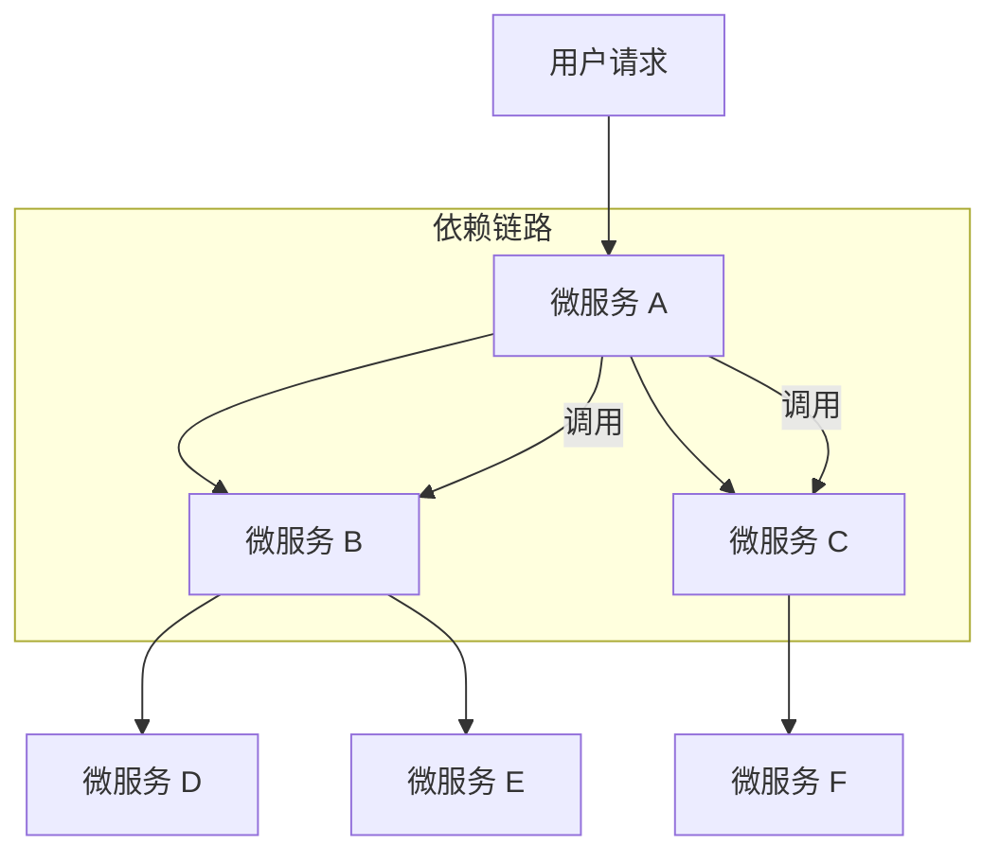
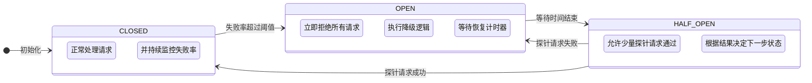
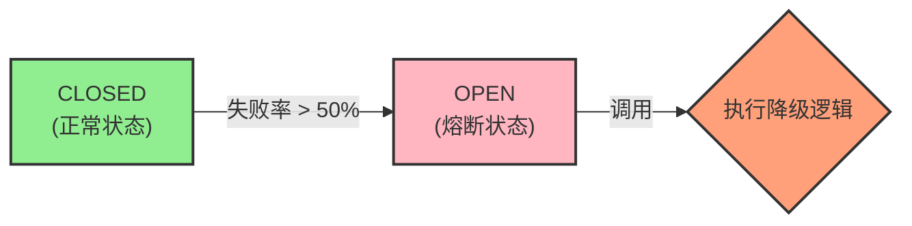
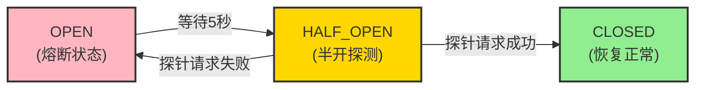
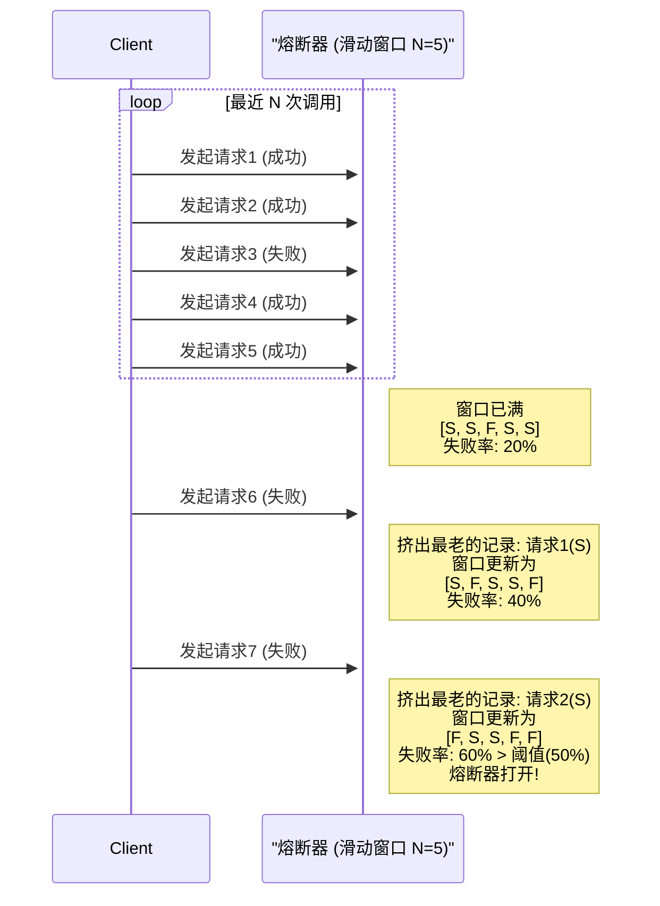
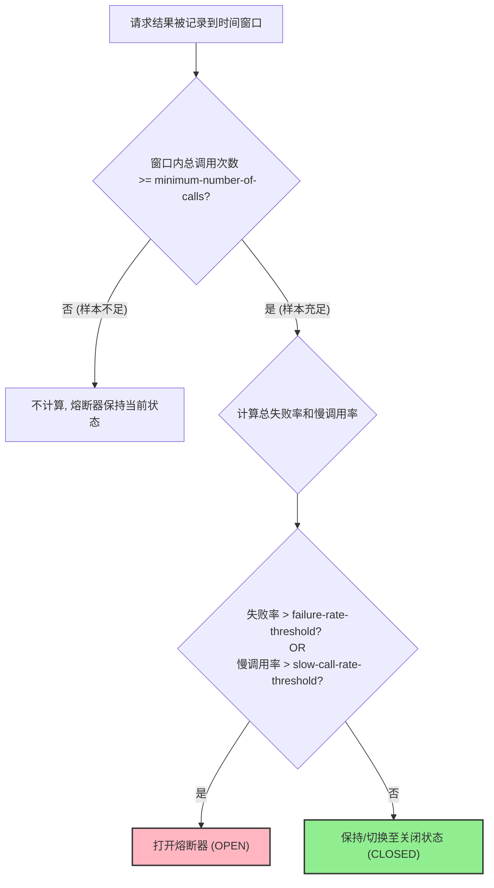

## **一、 问题背景：为何需要熔断器？**

在现代分布式系统，特别是微服务架构中，服务之间相互依赖、相互调用是常态。一个用户请求的背后，可能是一条由多个微服务构成的复杂调用链。这种设计在提升系统灵活性和可扩展性的同时，也引入了新的风险——**级联故障（Cascading Failures）**，通常被称为“雪崩效应”。

### **雪崩效应的根源**

想象一个典型的“扇出”调用场景：微服务 A 依赖于微服务 B 和 C，而 B 和 C 又各自依赖于其他服务。



如果链路末端的某个服务（如 `SVC_D`）因为高负载、程序 Bug 或网络问题，出现响应缓慢或无响应，那么对它的调用请求就会开始堆积。调用方 `SVC_B` 的线程池、连接池等资源将被这些等待的请求迅速占满。很快，`SVC_B` 自身也会变得不稳定，无法响应来自 `SVC_A` 的请求。

这个故障会像雪球一样，沿着调用链逆向传递，最终导致入口处的 `SVC_A` 也因资源耗尽而崩溃。此时，整个系统对外表现为大面积瘫痪，这就是毁灭性的**雪崩效应**。

在高流量场景下，单个节点的微小延迟都可能被放大，并迅速传导至整个系统，造成灾难性后果。因此，我们必须实现一种**快速失败（Fail-Fast）和故障隔离**的机制，确保单个依赖的故障不会拖垮整个系统。**Circuit Breaker（熔断器）模式**正是为此而生。

## **二、 核心原理：熔断器模式详解**

Circuit Breaker 的设计灵感来源于现实世界中的电路保险丝。它在服务调用方和服务提供方之间引入了一个代理层，通过监控调用的成功与失败，动态地改变自身状态，从而实现对下游服务的保护和自动恢复。

其核心是一个有限状态机，包含三个主要状态：

1.  **`CLOSED` (闭合状态)**：

    - **行为**：这是熔断器的默认和正常状态。所有请求都会直接穿过熔断器，到达下游服务。
    - **逻辑**：在此状态下，熔断器会持续计算近期请求的失败率。如果失败率低于预设的阈值，它将保持`CLOSED`状态。
    - **状态转换**：当失败率在指定的时间窗口内（或指定请求次数内）超过阈值时，熔断器会从`CLOSED`切换到`OPEN`状态。

2.  **`OPEN` (断开状态)**：

    - **行为**：熔断器已“跳闸”。所有进入该熔断器的请求都会立即失败，直接返回一个错误响应（如执行降级逻辑），而不会去调用下游服务。
    - **逻辑**：这是一种保护机制，通过阻止流量涌向下游已经出问题的服务，给予其恢复的时间，同时也避免了调用方因无谓的等待而耗尽资源。
    - **状态转换**：在`OPEN`状态下停留一段预设的时间（`waitDurationInOpenState`）后，熔断器会自动切换到`HALF_OPEN`状态，尝试进行恢复探测。

3.  **`HALF_OPEN` (半开状态)**：

    - **行为**：熔断器会允许一小部分“探针”请求通过，去调用下游服务。
    - **逻辑**：这是从故障中恢复的试探阶段。熔断器会根据这些探针请求的结果来判断下游服务是否已经恢复。
    - **状态转换**：
      - **如果探针请求的失败率仍然高于阈值**，说明下游服务尚未恢复。熔断器会立刻切换回`OPEN`状态，重新开始等待计时。
      - **如果探针请求的成功率达到标准**，说明下游服务已恢复。熔断器则会切换到`CLOSED`状态，恢复正常链路。

此外，还有两个用于管理和干预的特殊状态：

- **`DISABLED` (禁用状态)**：熔断器功能被完全关闭，所有请求都将通过。
- **`FORCED_OPEN` (强制开启状态)**：手动将熔断器置于`OPEN`状态，拒绝所有请求。常用于计划内维护或紧急故障处理。

### **状态转换流程图**



## **三、 实战：基于 Resilience4j 的熔断实现**

Hystrix 进入维护模式后，**Resilience4j** 已成为 Java 生态中熔断、限流等弹性能力实现的首选。它是一个轻量级、函数式的容错库，无外部依赖，与 Spring Cloud 生态无缝集成。

### **1. 引入依赖**

```xml
<!--resilience4j-circuitbreaker-->
<dependency>
    <groupId>org.springframework.cloud</groupId>
    <artifactId>spring-cloud-starter-circuitbreaker-resilience4j</artifactId>
</dependency>
<!-- 由于断路保护等需要AOP实现，所以必须导入AOP包 -->
<dependency>
    <groupId>org.springframework.boot</groupId>
    <artifactId>spring-boot-starter-aop</artifactId>
</dependency>
```

### **1. 核心配置 (application.yml)**

我们将熔断相关的配置集中在`application.yml`或其环境特定文件中。

```yaml
# application.yml
resilience4j:
  circuitbreaker:
    configs:
      # 定义一个可复用的默认配置模板
      default:
        failureRateThreshold: 60 # 失败率阈值(%)。当失败率达到60%时，熔断器将打开
        slidingWindowType: TIME_BASED # 滑动窗口类型。推荐使用基于时间的窗口
        slidingWindowSize: 10 # 滑动窗口大小。统计最近10秒内的调用情况
        minimumNumberOfCalls: 5 # 最小调用次数。至少需要5次调用才开始计算失败率
        automaticTransitionFromOpenToHalfOpenEnabled: true # 自动从OPEN转换到HALF_OPEN
        waitDurationInOpenState: 10s # 在OPEN状态下等待10秒后，转换为HALF_OPEN
        permittedNumberOfCallsInHalfOpenState: 3 # 在HALF_OPEN状态下，允许3个探针请求
        slowCallRateThreshold: 80 # 慢调用率阈值(%)
        slowCallDurationThreshold: 2s # 超过2秒的调用被视为慢调用
        recordExceptions: # 将哪些异常记录为失败
          - java.lang.Exception
          - java.util.concurrent.TimeoutException
          - feign.FeignException
        ignoreExceptions: # 忽略哪些异常（不计入失败统计）
          - java.lang.IllegalArgumentException
    instances:
      # 支付服务熔断器配置
      payment-service:
        baseConfig: default
        failureRateThreshold: 50 # 支付服务要求更严格，50%失败率就熔断
        minimumNumberOfCalls: 10 # 支付服务调用频率高，需要更多样本
      # 用户服务熔断器配置
      user-service:
        baseConfig: default
        slowCallDurationThreshold: 1s # 用户查询要求更快响应
      # 通知服务熔断器配置（容错性更高）
      notification-service:
        baseConfig: default
        failureRateThreshold: 80 # 通知服务允许更高的失败率
        waitDurationInOpenState: 30s # 通知服务恢复时间更长
```

**关键配置参数解析:**

| 参数                                    | 解释                                                                                           |
| --------------------------------------- | ---------------------------------------------------------------------------------------------- |
| `failureRateThreshold`                  | **失败率阈值**：触发熔断的核心条件。                                                           |
| `slidingWindowType`                     | **滑动窗口类型**：`COUNT_BASED`（基于次数）或 `TIME_BASED`（基于时间）。                       |
| `slidingWindowSize`                     | **滑动窗口大小**：在`CLOSED`状态下，统计失败率的样本范围（次数或秒数）。                       |
| `minimumNumberOfCalls`                  | **最小调用次数**：防止因偶然的少量失败就触发熔断。只有当调用次数达到该值后，才开始计算失败率。 |
| `waitDurationInOpenState`               | **开启状态持续时间**：熔断器在`OPEN`状态下停留的时间，之后会自动转为`HALF_OPEN`。              |
| `permittedNumberOfCallsInHalfOpenState` | **半开状态探测次数**：在`HALF_OPEN`状态下，允许多少个请求去探测下游服务是否恢复。              |
| `recordExceptions`                      | **记录为失败的异常**：定义哪些异常发生时，应被计为一次“失败”调用。                             |

### **2. 服务提供方 (Producer)**

为了模拟真实的业务场景，我们在支付服务中创建多个端点来测试不同的故障情况。

```java
// PaymentController.java
@RestController
@RequestMapping("/api/payment")
@Slf4j
public class PaymentController {

    @Autowired
    private PaymentService paymentService;

    /**
     * 处理支付请求 - 核心业务接口
     */
    @PostMapping("/process")
    public PaymentResponse processPayment(@RequestBody PaymentRequest request) {
        log.info("处理支付请求: {}", request.getOrderId());

        // 模拟不同的业务场景
        if (request.getAmount().compareTo(BigDecimal.ZERO) <= 0) {
            throw new IllegalArgumentException("支付金额必须大于0");
        }

        // 模拟支付处理时间和可能的失败
        if (request.getOrderId().contains("timeout")) {
            // 模拟超时场景
            try {
                Thread.sleep(3000); // 3秒超时
            } catch (InterruptedException e) {
                Thread.currentThread().interrupt();
            }
        }

        if (request.getOrderId().contains("fail")) {
            // 模拟支付失败
            throw new PaymentException("支付处理失败，请稍后重试");
        }

        // 正常支付处理
        return paymentService.processPayment(request);
    }

    /**
     * 查询支付状态 - 查询类接口
     */
    @GetMapping("/status/{orderId}")
    public PaymentStatus getPaymentStatus(@PathVariable String orderId) {
        log.info("查询支付状态: {}", orderId);

        // 模拟查询延迟
        if (orderId.contains("slow")) {
            try {
                Thread.sleep(1500); // 1.5秒延迟
            } catch (InterruptedException e) {
                Thread.currentThread().interrupt();
            }
        }

        return paymentService.getPaymentStatus(orderId);
    }

    /**
     * 健康检查端点
     */
    @GetMapping("/health")
    public Map<String, String> healthCheck() {
        Map<String, String> status = new HashMap<>();
        status.put("status", "UP");
        status.put("timestamp", LocalDateTime.now().toString());
        return status;
    }
}
```

```java
// PaymentException.java
// 自定义异常类
@ResponseStatus(HttpStatus.INTERNAL_SERVER_ERROR)
public class PaymentException extends RuntimeException {
    public PaymentException(String message) {
        super(message);
    }
}
```

### **3. 服务调用方 (Consumer)**

在订单服务中，我们通过 Feign 客户端调用支付服务，并使用`@CircuitBreaker`注解实现熔断保护。

**Feign 接口定义:**

```java
// PaymentFeignClient.java
@FeignClient(
    name = "payment-service",
    path = "/api/payment",
    configuration = PaymentFeignConfig.class
)
public interface PaymentFeignClient {

    @PostMapping("/process")
    PaymentResponse processPayment(@RequestBody PaymentRequest request);

    @GetMapping("/status/{orderId}")
    PaymentStatus getPaymentStatus(@PathVariable("orderId") String orderId);

    @GetMapping("/health")
    Map<String, String> healthCheck();
}
```

```java
// PaymentFeignConfig.java
// Feign 配置类
@Configuration
public class PaymentFeignConfig {

    @Bean
    public Request.Options requestOptions() {
        // 连接超时1秒，读取超时2秒
        return new Request.Options(1000, 2000);
    }

    @Bean
    public Logger.Level feignLoggerLevel() {
        return Logger.Level.BASIC;
    }
}
```

**订单服务 Controller 层:**

```java
// OrderController.java
@RestController
@RequestMapping("/api/order")
@Slf4j
public class OrderController {

    @Autowired
    private PaymentFeignClient paymentFeignClient;

    @Autowired
    private OrderService orderService;

    /**
     * 创建订单并处理支付
     */
    @PostMapping("/create")
    @CircuitBreaker(name = "payment-service", fallbackMethod = "createOrderFallback")
    public OrderResponse createOrder(@RequestBody OrderRequest request) {
        log.info("创建订单: {}", request.getOrderId());

        try {
            // 1. 创建订单
            Order order = orderService.createOrder(request);

            // 2. 调用支付服务
            PaymentRequest paymentRequest = PaymentRequest.builder()
                .orderId(order.getOrderId())
                .amount(order.getTotalAmount())
                .userId(order.getUserId())
                .build();

            PaymentResponse paymentResponse = paymentFeignClient.processPayment(paymentRequest);

            // 3. 更新订单状态
            if (paymentResponse.isSuccess()) {
                orderService.updateOrderStatus(order.getOrderId(), OrderStatus.PAID);
                return OrderResponse.success(order, "订单创建并支付成功");
            } else {
                orderService.updateOrderStatus(order.getOrderId(), OrderStatus.PAYMENT_FAILED);
                return OrderResponse.failed(order, "支付失败: " + paymentResponse.getMessage());
            }

        } catch (Exception e) {
            log.error("创建订单异常: {}", e.getMessage(), e);
            throw e; // 让熔断器捕获异常
        }
    }

    /**
     * 查询订单支付状态
     */
    @GetMapping("/{orderId}/payment-status")
    @CircuitBreaker(name = "payment-service", fallbackMethod = "getPaymentStatusFallback")
    public PaymentStatusResponse getOrderPaymentStatus(@PathVariable String orderId) {
        log.info("查询订单支付状态: {}", orderId);

        PaymentStatus status = paymentFeignClient.getPaymentStatus(orderId);
        return PaymentStatusResponse.builder()
            .orderId(orderId)
            .status(status)
            .queryTime(LocalDateTime.now())
            .build();
    }

    // ================== 降级方法 (Fallback Methods) ==================

    /**
     * 创建订单的降级方法
     */
    public OrderResponse createOrderFallback(OrderRequest request, Exception ex) {
        log.warn("支付服务不可用，订单创建降级处理. 订单ID: {}, 异常: {}",
                request.getOrderId(), ex.getMessage());

        // 创建订单但标记为待支付状态
        Order order = orderService.createOrder(request);
        orderService.updateOrderStatus(order.getOrderId(), OrderStatus.PENDING_PAYMENT);

        return OrderResponse.builder()
            .success(true)
            .order(order)
            .message("订单创建成功，支付服务暂时不可用，请稍后完成支付")
            .needRetryPayment(true)
            .build();
    }

    /**
     * 支付状态查询的降级方法
     */
    public PaymentStatusResponse getPaymentStatusFallback(String orderId, Exception ex) {
        log.warn("支付服务不可用，无法查询支付状态. 订单ID: {}, 异常: {}",
                orderId, ex.getMessage());

        return PaymentStatusResponse.builder()
            .orderId(orderId)
            .status(PaymentStatus.UNKNOWN)
            .message("支付服务暂时不可用，请稍后查询")
            .queryTime(LocalDateTime.now())
            .available(false)
            .build();
    }
}
```

## **四、 熔断测试与状态验证**

现在，我们通过模拟真实的业务场景来观察熔断器的状态转换。

**测试场景:** 根据我们的配置 (`slidingWindowSize: 10s`, `failureRateThreshold: 60%`, `minimumNumberOfCalls: 5`)，在 10 秒窗口内，至少需要 5 次调用，且失败率超过 60%时，熔断器会开启。

### **测试步骤详解**

**Step 1: 正常业务调用 (状态: `CLOSED`)**

模拟正常的订单创建和支付流程：

```bash
# 创建正常订单
curl -X POST http://localhost:8080/api/order/create \
  -H "Content-Type: application/json" \
  -d '{
    "orderId": "ORDER_20250713_001",
    "userId": "user_123",
    "items": [{"productId": "PROD_001", "quantity": 2, "price": 99.99}],
    "totalAmount": 199.98
  }'

# 查询支付状态
curl http://localhost:8080/api/order/ORDER_20250713_001/payment-status
```

- **结果**：所有请求正常返回，订单创建成功，支付处理完成
- **熔断器状态**：`CLOSED`
- **日志输出**：显示正常的业务处理流程

**Step 2: 触发故障场景 (状态: `CLOSED` → `OPEN`)**

模拟支付服务出现故障：

```bash
# 连续创建包含 "fail" 标识的订单（模拟支付失败）
for i in {1..4}; do
  curl -X POST http://localhost:8080/api/order/create \
    -H "Content-Type: application/json" \
    -d '{
      "orderId": "ORDER_fail_'$i'",
      "userId": "user_456",
      "items": [{"productId": "PROD_002", "quantity": 1, "price": 50.00}],
      "totalAmount": 50.00
    }'
  sleep 1
done

# 第5次调用，触发熔断
curl -X POST http://localhost:8080/api/order/create \
  -H "Content-Type: application/json" \
  -d '{
    "orderId": "ORDER_fail_5",
    "userId": "user_789",
    "items": [{"productId": "PROD_003", "quantity": 1, "price": 75.00}],
    "totalAmount": 75.00
  }'
```

- **前 4 次调用结果**：支付服务返回异常，但订单仍然创建，状态为支付失败
- **第 5 次调用及后续**：熔断器开启，直接执行降级逻辑
- **熔断器状态**：从 `CLOSED` 切换到 `OPEN`
- **降级响应**：
  ```json
  {
    "success": true,
    "order": {...},
    "message": "订单创建成功，支付服务暂时不可用，请稍后完成支付",
    "needRetryPayment": true
  }
  ```

**Step 3: 熔断期间的表现 (状态: `OPEN`)**

在熔断器开启后的 10 秒内，继续发送请求：

```bash
# 尝试创建正常订单
curl -X POST http://localhost:8080/api/order/create \
  -H "Content-Type: application/json" \
  -d '{
    "orderId": "ORDER_normal_after_break",
    "userId": "user_111",
    "items": [{"productId": "PROD_001", "quantity": 1, "price": 99.99}],
    "totalAmount": 99.99
  }'

# 尝试查询支付状态
curl http://localhost:8080/api/order/ORDER_20250713_001/payment-status
```

- **结果**：所有请求都不会调用支付服务，直接返回降级响应
- **响应时间**：毫秒级返回，实现快速失败
- **熔断器状态**：`OPEN`
- **业务影响**：订单仍能创建，但支付状态查询返回"服务不可用"
- **熔断器状态**：`CLOSED`。

**Step 2: 触发熔断 (状态: `CLOSED` -\> `OPEN`)**

- 连续 3 次或以上访问 `http://localhost:9988/feign/pay/circuit/-1`。
- **结果**：
  - 前几次请求，你会看到服务端的 `RuntimeException` 错误栈（如果全局异常处理器没有捕获）。
  - 当失败次数达到阈值（本例中为 3 次失败 / 6 次总调用），熔断器“跳闸”。
  - 此时再次访问，无论是 `.../circuit/-1` 还是正常的 `.../circuit/1`，都会**立即**返回降级信息：`"myCircuitFallback: 系统繁忙..."`。
- **熔断器状态**：从 `CLOSED` 切换到 `OPEN`。

**Step 3: 熔断期间 (状态: `OPEN`)**

- 在熔断器开启后的 5 秒内，持续访问 `http://localhost:9988/feign/pay/circuit/1`。
- **结果**：每次调用都**不会**请求下游服务，而是毫秒级地返回降级响应。这完美地实现了故障隔离和快速失败。
- **熔断器状态**：`OPEN`。



**Step 4: 自动恢复探测 (状态: `OPEN` → `HALF_OPEN`)**

等待 `waitDurationInOpenState`（配置的 10 秒）后：

- **自动转换**：熔断器自动进入 `HALF_OPEN` 状态
- **日志输出**：`CircuitBreaker 'payment-service' changed state from OPEN to HALF_OPEN`
- **准备探测**：允许少量请求通过进行健康探测

**Step 5: 服务恢复验证 (状态: `HALF_OPEN` → `CLOSED` 或 `OPEN`)**

在 `HALF_OPEN` 状态下，有 3 次探针机会（`permittedNumberOfCallsInHalfOpenState: 3`）：

**场景一：服务已恢复**

```bash
# 发送正常订单创建请求
curl -X POST http://localhost:8080/api/order/create \
  -H "Content-Type: application/json" \
  -d '{
    "orderId": "ORDER_recovery_test",
    "userId": "user_recovery",
    "items": [{"productId": "PROD_001", "quantity": 1, "price": 99.99}],
    "totalAmount": 99.99
  }'
```

- **结果**：请求被放行，支付服务正常响应，订单创建和支付成功
- **熔断器状态**：立即从 `HALF_OPEN` 切换回 `CLOSED`
- **后续请求**：恢复正常处理

**场景二：服务仍有问题**

```bash
# 发送会导致支付失败的请求
curl -X POST http://localhost:8080/api/order/create \
  -H "Content-Type: application/json" \
  -d '{
    "orderId": "ORDER_still_fail",
    "userId": "user_fail",
    "items": [{"productId": "PROD_001", "quantity": 1, "price": 99.99}],
    "totalAmount": 99.99
  }'
```

- **结果**：探针请求失败，支付服务仍然有问题
- **熔断器状态**：立即从 `HALF_OPEN` 切换回 `OPEN`
- **等待周期**：重新开始 10 秒的等待计时

### **监控和观察**

**应用日志观察：**

```log
2025-07-13 10:15:23.456 INFO  OrderController - 创建订单: ORDER_20250713_001
2025-07-13 10:15:23.789 INFO  OrderController - 订单创建并支付成功
2025-07-13 10:16:45.123 WARN  OrderController - 支付服务不可用，订单创建降级处理
2025-07-13 10:16:45.124 INFO  CircuitBreakerEventConsumer - CircuitBreaker 'payment-service' changed state from CLOSED to OPEN
```

**Actuator 端点监控：**

```bash
# 查看熔断器状态
curl http://localhost:8080/actuator/circuitbreakers

# 查看详细指标
curl http://localhost:8080/actuator/circuitbreakerevents
```



### **五、 滑动窗口策略**

在微服务架构中，熔断器是保障服务韧性的核心组件。它通过监控对下游服务的调用情况，在服务出现故障时快速失败（Fail-Fast），防止故障的连锁扩散。而这一切决策的核心依据，便是滑动窗口策略。滑动窗口负责收集和统计最近一段时间的请求数据，为熔断器的状态转换（CLOSED, OPEN, HALF-OPEN）提供决策依据。

熔断器的实现可以基于不同的滑动窗口策略，主要有以下两种：

- **COUNT-BASED (基于计数的滑动窗口)**：通过统计最近 N 次请求的成功和失败次数来判断是否触发熔断。
- **TIME-BASED (基于时间的滑动窗口)**：通过设定一个时间窗口，在窗口时间内统计请求的成功和失败情况。

下面，我们来深入剖析这两种策略的内部机制、优缺点以及在现代框架中的应用。

### **1. COUNT-BASED (基于计数的滑动窗口)**

这是最简单直观的一种实现方式。

#### **工作机制**

它在内存中维护一个固定大小的“环形数组”（Ring Buffer）或队列，长度为 N。每当一个新的请求发生（无论成功、失败或超时），它都会被记录下来并放入这个数组。如果数组已满，最老的一条记录将被挤出。

熔断器的决策逻辑（例如，计算失败率）始终基于这最近的 N 次请求。

为了更直观地展示这个过程，可以参考下面的序列图：



#### **举例说明：**

假设我们配置 `sliding-window-type: count` 并且 `sliding-window-size: 100`。
这意味着熔断器会持续监控最近的 100 次调用。当第 101 次调用发生时，它会替换掉第 1 次调用的记录。熔断决策（如失败率是否超过 50%）将基于这 100 个样本进行计算。

#### **优点**

- **实现简单**：逻辑清晰，内存占用固定且可预测。
- **资源消耗低**：不需要额外的时间线程来管理窗口的滑动。

#### **缺点**

- **无法应对流量毛刺（Bursty Traffic）问题**：这是其最致命的缺陷。如果一个服务在很长一段时间内没有被调用，窗口中可能充满了很久以前的“成功”记录。此时，即使连续出现几次失败的调用，也可能因为被大量旧的成功记录“稀释”，导致失败率无法达到阈值，熔断器不会及时打开。
- **时间敏感性差**：它只关心“次数”，不关心这些次数发生在多长的时间内。例如，1 分钟内发生 100 次调用和 1 天内发生 100 次调用，对于 COUNT-BASED 窗口来说是等价的，但这在现实场景中显然代表了完全不同的负载情况。

#### **适用场景**

由于其明显的缺点，纯粹的 COUNT-BASED 滑动窗口在现代复杂的微服务环境中已非常罕见。它可能仅适用于那些调用频率非常稳定、可预测且对时间不敏感的特殊场景。

### **2. TIME-BASED (基于时间的滑动窗口)**

这是目前业界主流且推荐的策略，被 Resilience4j 等现代熔断器库作为默认实现。

#### **工作机制**

TIME-BASED 窗口不再关注固定数量的请求，而是关注一个固定的时间周期（例如，最近的 60 秒）。为了平滑地滑动并高效计算，它通常会把整个时间窗口分割成多个更小的“桶”（Bucket）。

下面的甘特图清晰地展示了分桶和窗口滑动的机制：

```mermaid
flowchart TD
    subgraph "时间窗口示例 (60秒窗口, 6个桶)"
        A["Bucket1 (0-10s)"] --> B["Bucket2 (10-20s)"]
        B --> C["Bucket3 (20-30s)"]
        C --> D["Bucket4 (30-40s)"]
        D --> E["Bucket5 (40-50s)"]
        E --> F["Bucket6 (50-60s)"]
    end

    subgraph "窗口滑动过程"
        G["T=61s: Bucket1过期"] --> H["创建Bucket7 (60-70s)"]
        H --> I["新窗口: Bucket2-7"]
    end

    subgraph "数据聚合"
        J["聚合所有活动桶的数据"]
        J --> K["计算失败率和慢调用率"]
    end

    style A fill:#87CEEB,stroke:#333,stroke-width:2px
    style F fill:#FFB6C1,stroke:#333,stroke-width:2px
    style H fill:#90EE90,stroke:#333,stroke-width:2px
```



#### **举例说明（Resilience4j 的实现方式）：**

假设我们配置 `sliding-window-type: time`，`sliding-window-size: 60` (秒)，并且内部默认或配置了 10 个桶。

- **分桶 (Bucketing)**：整个 60 秒的时间窗口被划分为 10 个桶，每个桶负责记录 6 秒内的调用数据（成功数、失败数、慢调用数等）。
- **数据记录**：当请求发生时，其结果会被记录在当前时间所在的桶内。例如，在第 13 秒发生的调用，其结果会记录在第 3 个桶里（12s-18s）。
- **窗口滑动**：时间是向前流逝的。当第 61 秒到来时，第一个桶（0s-6s）的数据就会过期，被丢弃。同时一个新的桶被创建出来，用于记录 60s-66s 的数据。这样，整个窗口就向前“滑动”了。
- **指标聚合**：在任何时刻，熔断器需要决策时，它会聚合当前所有有效桶（在此例中是 10 个桶）的数据，计算出在整个时间窗口（60 秒）内的总请求数、失败率、慢调用率等核心指标。

#### **优点**

- **时间敏感，更符合直觉**：它统计的是“最近一段时间内”的系统健康状况，完美解决了 COUNT-BASED 的流量毛刺问题。无论流量如何波动，它始终能反映出最近一个时间周期内的真实表现。
- **数据更平滑**：通过分桶机制，避免了在窗口边界发生数据突变的问题，统计结果更加平滑和准确。
- **灵活性高**：可以配置窗口大小和桶的数量，以适应不同服务的特性。

#### **缺点**

- **实现相对复杂**：需要管理桶的创建、过期和数据聚合。
- **内存占用稍高**：需要为多个桶分配内存来存储统计数据。但在大多数应用中，这点开销是完全可以接受的，并且对于保障系统稳定性来说是值得的。

### **总结与最佳实践：现代熔断器的混合模型**

在 Spring Cloud 生态中，我们现在主要使用 Resilience4j。值得注意的是，Resilience4j 的配置虽然区分了 `time-based` 和 `count-based`，但其决策过程通常是一个混合模型。

**即便是选择了 time-based 窗口，我们依然会配置一个基于计数的阈值，这才是最完善的实践。**

来看一个典型的 Resilience4j 配置：

```yaml
resilience4j:
  circuitbreaker:
    instances:
      myApiService:
        # 1. 选择基于时间的滑动窗口
        sliding-window-type: time-based
        # 2. 设置时间窗口大小为60秒
        sliding-window-size: 60
        # 3. 核心！设置窗口内触发计算的最小调用次数
        minimum-number-of-calls: 20
        # 4. 设置失败率阈值
        failure-rate-threshold: 50
        # 5. 设置慢调用率阈值
        slow-call-rate-threshold: 80
        # 6. 定义慢调用的耗时
        slow-call-duration-threshold: 5000 # 5秒
```

#### **解读这段配置：**

熔断器首先采用一个 60 秒的时间窗口来收集数据 (`time-based`)。

但是，它并不会在只有一两次调用的情况下就草率地计算失败率。`minimum-number-of-calls: 20` 这个计数阈值规定了：**只有当 60 秒窗口内的总调用次数达到 20 次时**，熔断器才会开始计算失败率。

一旦调用次数超过 20 次，熔断器就会检查失败率是否超过了 50%。如果超过，则熔断器打开。

这种 **“时间窗口 + 最小请求数阈值”** 的混合模型，其决策流程可以可视化为：



该模型结合了两者的优点：

- **确保了统计的及时性（基于时间）**。
- **避免了因样本量过小而导致的误判（基于计数）**。例如，如果窗口内只有 2 次调用，其中 1 次失败，失败率高达 50%，但这种情况下熔断显然是不合理的。

1.  **首选并默认使用 `TIME-BASED` 滑动窗口**，因为它能更准确地反映服务在“最近”一段时间的健康状况。
2.  **务必配置 `minimum-number-of-calls`**，为熔断决策提供一个有统计意义的最小样本量，防止在低流量时发生误判。
3.  根据服务的 QPS、重要性和网络状况，仔细调优 `sliding-window-size`, `failure-rate-threshold` 和 `slow-call-rate-threshold` 等参数，以达到最佳的保护效果。
4.  纯粹的 `COUNT-BASED` 策略在理论上存在，但在追求高可用的现代分布式系统中，已经基本被功能更强大、表现更稳健的 **TIME-BASED 混合模型**所取代。
