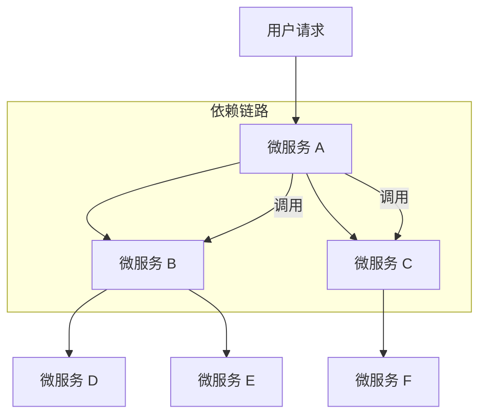

## **CircuitBreaker 熔断基础：从原理到 Resilience4j 实战**

- **发布时间:** 2025-06-17
- **标签:** [SpringCloud, Resilience4j, Microservices, CircuitBreaker]
- **分类:** SpringCloud
- **摘要:** 本文深入剖析了微服务架构中的核心容错模式——Circuit Breaker（熔断器）。你将理解其如何通过`CLOSED`、`OPEN`、`HALF_OPEN`三种状态的智能转换，有效防止服务间的“雪崩效应”。此外，我们还将结合业界主流的 Resilience4j 框架，在 Spring Cloud 环境中进行配置、编码和测试，为你提供一套完整的实战指南。
- **草稿:** false

---

## **一、 问题背景：为何需要熔断器？**

在现代分布式系统，特别是微服务架构中，服务之间相互依赖、相互调用是常态。一个用户请求的背后，可能是一条由多个微服务构成的复杂调用链。这种设计在提升系统灵活性和可扩展性的同时，也引入了新的风险——**级联故障（Cascading Failures）**，通常被称为“雪崩效应”。

### **雪崩效应的根源**

想象一个典型的“扇出”调用场景：微服务 A 依赖于微服务 B 和 C，而 B 和 C 又各自依赖于其他服务。



如果链路末端的某个服务（如 `SVC_D`）因为高负载、程序 Bug 或网络问题，出现响应缓慢或无响应，那么对它的调用请求就会开始堆积。调用方 `SVC_B` 的线程池、连接池等资源将被这些等待的请求迅速占满。很快，`SVC_B` 自身也会变得不稳定，无法响应来自 `SVC_A` 的请求。

这个故障会像雪球一样，沿着调用链逆向传递，最终导致入口处的 `SVC_A` 也因资源耗尽而崩溃。此时，整个系统对外表现为大面积瘫痪，这就是毁灭性的**雪崩效应**。

在高流量场景下，单个节点的微小延迟都可能被放大，并迅速传导至整个系统，造成灾难性后果。因此，我们必须实现一种**快速失败（Fail-Fast）和故障隔离**的机制，确保单个依赖的故障不会拖垮整个系统。**Circuit Breaker（熔断器）模式**正是为此而生。

## **二、 核心原理：熔断器模式详解**

Circuit Breaker 的设计灵感来源于现实世界中的电路保险丝。它在服务调用方和服务提供方之间引入了一个代理层，通过监控调用的成功与失败，动态地改变自身状态，从而实现对下游服务的保护和自动恢复。

其核心是一个有限状态机，包含三个主要状态：

1.  **`CLOSED` (闭合状态)**：

    - **行为**：这是熔断器的默认和正常状态。所有请求都会直接穿过熔断器，到达下游服务。
    - **逻辑**：在此状态下，熔断器会持续计算近期请求的失败率。如果失败率低于预设的阈值，它将保持`CLOSED`状态。
    - **状态转换**：当失败率在指定的时间窗口内（或指定请求次数内）超过阈值时，熔断器会从`CLOSED`切换到`OPEN`状态。

2.  **`OPEN` (断开状态)**：

    - **行为**：熔断器已“跳闸”。所有进入该熔断器的请求都会立即失败，直接返回一个错误响应（如执行降级逻辑），而不会去调用下游服务。
    - **逻辑**：这是一种保护机制，通过阻止流量涌向下游已经出问题的服务，给予其恢复的时间，同时也避免了调用方因无谓的等待而耗尽资源。
    - **状态转换**：在`OPEN`状态下停留一段预设的时间（`waitDurationInOpenState`）后，熔断器会自动切换到`HALF_OPEN`状态，尝试进行恢复探测。

3.  **`HALF_OPEN` (半开状态)**：

    - **行为**：熔断器会允许一小部分“探针”请求通过，去调用下游服务。
    - **逻辑**：这是从故障中恢复的试探阶段。熔断器会根据这些探针请求的结果来判断下游服务是否已经恢复。
    - **状态转换**：
      - **如果探针请求的失败率仍然高于阈值**，说明下游服务尚未恢复。熔断器会立刻切换回`OPEN`状态，重新开始等待计时。
      - **如果探针请求的成功率达到标准**，说明下游服务已恢复。熔断器则会切换到`CLOSED`状态，恢复正常链路。

此外，还有两个用于管理和干预的特殊状态：

- **`DISABLED` (禁用状态)**：熔断器功能被完全关闭，所有请求都将通过。
- **`FORCED_OPEN` (强制开启状态)**：手动将熔断器置于`OPEN`状态，拒绝所有请求。常用于计划内维护或紧急故障处理。

### **状态转换流程图**

```mermaid
stateDiagram-v2
    direction LR
    [*] --> CLOSED: 初始化
    CLOSED --> OPEN: 失败率超过阈值
    OPEN --> HALF_OPEN: 等待时间结束
    HALF_OPEN --> CLOSED: 探针请求成功
    HALF_OPEN --> OPEN: 探针请求失败

    state "闭合 (CLOSED)" as CLOSED {
        note right of CLOSED
            正常处理请求
            并持续监控失败率
        end note
    }
    state "断开 (OPEN)" as OPEN {
        note right of OPEN
            立即拒绝所有请求
            执行降级逻辑
            等待恢复计时器
        end note
    }
    state "半开 (HALF_OPEN)" as HALF_OPEN {
        note left of HALF_OPEN
            允许少量探针请求通过
            根据结果决定下一步状态
        end note
    }
```

## **三、 实战：基于 Resilience4j 的熔断实现**

Hystrix 进入维护模式后，**Resilience4j** 已成为 Java 生态中熔断、限流等弹性能力实现的首选。它是一个轻量级、函数式的容错库，无外部依赖，与 Spring Cloud 生态无缝集成。

### **1. 核心配置 (application.yml)**

我们将熔断相关的配置集中在`application.yml`或其环境特定文件中。

```yaml
resilience4j:
  circuitbreaker:
    configs:
      # 定义一个可复用的默认配置模板
      default:
        failureRateThreshold: 50 # 失败率阈值(%)。当失败率达到50%时，熔断器将打开
        slidingWindowType: COUNT_BASED # 滑动窗口类型。此处基于请求数量
        slidingWindowSize: 6 # 滑动窗口大小。在CLOSED状态下，统计最近6次调用的失败率
        minimumNumberOfCalls: 6 # 最小调用次数。在熔断器计算失败率之前，至少需要6次调用
        automaticTransitionFromOpenToHalfOpenEnabled: true # 自动从OPEN转换到HALF_OPEN，无需任何操作
        waitDurationInOpenState: 5s # 在OPEN状态下等待5秒后，转换为HALF_OPEN
        permittedNumberOfCallsInHalfOpenState: 2 # 在HALF_OPEN状态下，允许2个探针请求
        recordExceptions: # 将哪些异常记录为失败
          - java.lang.Exception
    instances:
      # 为名为 "cloud-payment-service" 的服务创建一个熔断器实例
      # 这个名字将与代码中的 @CircuitBreaker 注解关联
      cloud-payment-service:
        baseConfig: default # 继承上面定义的 'default' 配置
```

**关键配置参数解析:**

| 参数                                    | 解释                                                                                           |
| --------------------------------------- | ---------------------------------------------------------------------------------------------- |
| `failureRateThreshold`                  | **失败率阈值**：触发熔断的核心条件。                                                           |
| `slidingWindowType`                     | **滑动窗口类型**：`COUNT_BASED`（基于次数）或 `TIME_BASED`（基于时间）。                       |
| `slidingWindowSize`                     | **滑动窗口大小**：在`CLOSED`状态下，统计失败率的样本范围（次数或秒数）。                       |
| `minimumNumberOfCalls`                  | **最小调用次数**：防止因偶然的少量失败就触发熔断。只有当调用次数达到该值后，才开始计算失败率。 |
| `waitDurationInOpenState`               | **开启状态持续时间**：熔断器在`OPEN`状态下停留的时间，之后会自动转为`HALF_OPEN`。              |
| `permittedNumberOfCallsInHalfOpenState` | **半开状态探测次数**：在`HALF_OPEN`状态下，允许多少个请求去探测下游服务是否恢复。              |
| `recordExceptions`                      | **记录为失败的异常**：定义哪些异常发生时，应被计为一次“失败”调用。                             |

### **2. 服务提供方 (Producer)**

为了测试熔断，我们在服务提供方模拟出正常、异常和超时三种情况。

```java
// PayCircuitController.java
@RestController
public class PayCircuitController {
    @GetMapping(value = "/pay/circuit/{id}")
    public String myCircuit(@PathVariable("id") Integer id) {
        // 模拟业务异常
        if (id < 0) {
            throw new RuntimeException("---- Circuit Breaker: id 不能为负数 ----");
        }
        // 模拟请求超时
        if (id == 9999) {
            try {
                TimeUnit.SECONDS.sleep(5);
            } catch (InterruptedException e) {
                // ...
            }
        }
        // 正常返回
        return "Hello, circuit! inputId: " + id + " \t " + IdUtil.simpleUUID();
    }
}
```

### **3. 服务调用方 (Consumer)**

在 Feign 客户端的调用方法上，我们使用`@CircuitBreaker`注解来启用熔断功能。

**Feign 接口定义:**

```java
// PayFeignApi.java
@FeignClient(value = "cloud-payment-service")
public interface PayFeignApi {
    @GetMapping(value = "/pay/circuit/{id}")
    String myCircuit(@PathVariable("id") Integer id);
}
```

**Controller 层调用与降级处理:**

```java
// OrderCircuitController.java
@RestController
public class OrderCircuitController {
    @Resource
    private PayFeignApi payFeignApi;

    @GetMapping(value = "/feign/pay/circuit/{id}")
    @CircuitBreaker(name = "cloud-payment-service", fallbackMethod = "myCircuitFallback")
    public String myCircuitBreaker(@PathVariable("id") Integer id) {
        return payFeignApi.myCircuit(id);
    }

    // 降级方法 (Fallback)
    // 方法签名必须与原方法保持一致，但可以在最后追加一个 Throwable 类型的参数来接收异常信息。
    public String myCircuitFallback(Integer id, Throwable t) {
        // 你可以在这里记录日志，t.getMessage() 会包含原始异常信息
        // log.error("Circuit Breaker fallback triggered for id: {}, error: {}", id, t.getMessage());
        return "myCircuitFallback: 系统繁忙或服务暂时不可用，请稍后再试。/(ㄒoㄒ)/~~";
    }
}
```

## **四、 熔断测试与状态验证**

现在，我们通过逐步测试来观察熔断器的状态转换。

**测试场景:** 根据我们的配置 (`slidingWindowSize: 6`, `failureRateThreshold: 50%`)，在最近的 6 次调用中，只要有 3 次失败，熔断器就会开启。

**Step 1: 正常调用 (状态: `CLOSED`)**

- 访问 `http://localhost:9988/feign/pay/circuit/1`，`.../2`，`.../3`
- **结果**：所有请求均正常返回，如 `"Hello, circuit! inputId: 1 ..."`。
- **熔断器状态**：`CLOSED`。

**Step 2: 触发熔断 (状态: `CLOSED` -\> `OPEN`)**

- 连续 3 次或以上访问 `http://localhost:9988/feign/pay/circuit/-1`。
- **结果**：
  - 前几次请求，你会看到服务端的 `RuntimeException` 错误栈（如果全局异常处理器没有捕获）。
  - 当失败次数达到阈值（本例中为 3 次失败 / 6 次总调用），熔断器“跳闸”。
  - 此时再次访问，无论是 `.../circuit/-1` 还是正常的 `.../circuit/1`，都会**立即**返回降级信息：`"myCircuitFallback: 系统繁忙..."`。
- **熔断器状态**：从 `CLOSED` 切换到 `OPEN`。

**Step 3: 熔断期间 (状态: `OPEN`)**

- 在熔断器开启后的 5 秒内，持续访问 `http://localhost:9988/feign/pay/circuit/1`。
- **结果**：每次调用都**不会**请求下游服务，而是毫秒级地返回降级响应。这完美地实现了故障隔离和快速失败。
- **熔断器状态**：`OPEN`。

<!-- end list -->

```mermaid
flowchart LR
    A[CLOSED<br/>(正常状态)] -->|失败率 > 50%| B[OPEN<br/>(熔断状态)]
    B -- 调用 --> C{执行降级逻辑}

    style A fill:#90EE90,stroke:#333,stroke-width:2px
    style B fill:#FFB6C1,stroke:#333,stroke-width:2px
    style C fill:#FFA07A,stroke:#333,stroke-width:2px
```

**Step 4: 自动恢复探测 (状态: `OPEN` -\> `HALF_OPEN`)**

- 等待超过 `waitDurationInOpenState`（我们配置的 5 秒）。
- **结果**：熔断器自动进入`HALF_OPEN`状态，准备放行探针请求。
- **熔断器状态**：从 `OPEN` 切换到 `HALF_OPEN`。

**Step 5: 恢复验证 (状态: `HALF_OPEN` -\> `CLOSED` 或 `OPEN`)**

- 在进入`HALF_OPEN`状态后，我们有 2 次（`permittedNumberOfCallsInHalfOpenState`）探测机会。
  - **场景一：恢复成功**
    - 访问 `http://localhost:9988/feign/pay/circuit/1`。
    - **结果**：该请求被放行，并成功调用下游服务，返回 `"Hello, circuit!..."`。
    - **熔断器状态**：探测成功，熔断器立即从 `HALF_OPEN` 切换回 `CLOSED`。后续所有请求恢复正常。
  - **场景二：恢复失败**
    - 访问 `http://localhost:9988/feign/pay/circuit/-1`。
    - **结果**：该探针请求依然失败，直接返回降级响应 `"myCircuitFallback:..."`。
    - **熔断器状态**：探测失败，熔断器立即从 `HALF_OPEN` 切换回 `OPEN`，并重新开始 5 秒的等待计时。

```mermaid
flowchart LR
    A[OPEN<br/>(熔断状态)] -->|等待5秒| B[HALF_OPEN<br/>(半开探测)]
    B -->|探针请求成功| C[CLOSED<br/>(恢复正常)]
    B -->|探针请求失败| A

    style A fill:#FFB6C1,stroke:#333,stroke-width:2px
    style B fill:#FFD700,stroke:#333,stroke-width:2px
    style C fill:#90EE90,stroke:#333,stroke-width:2px
```
