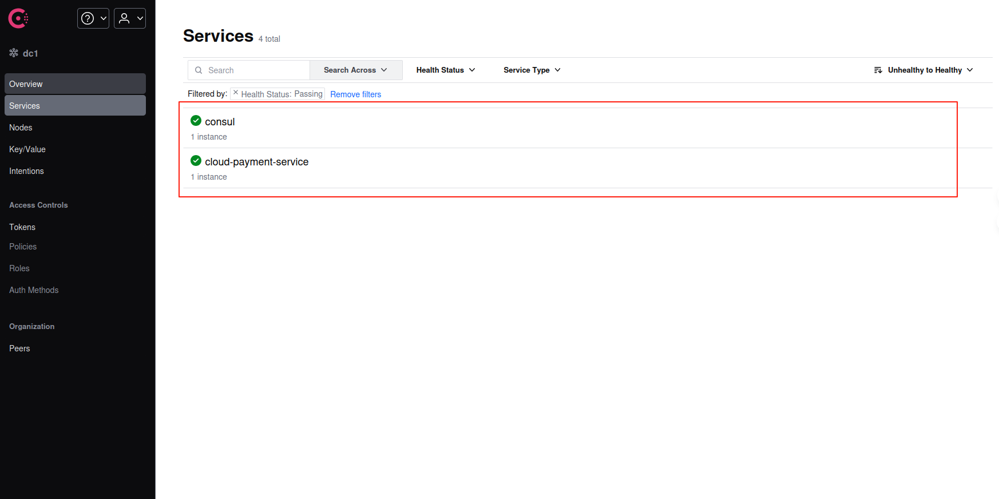
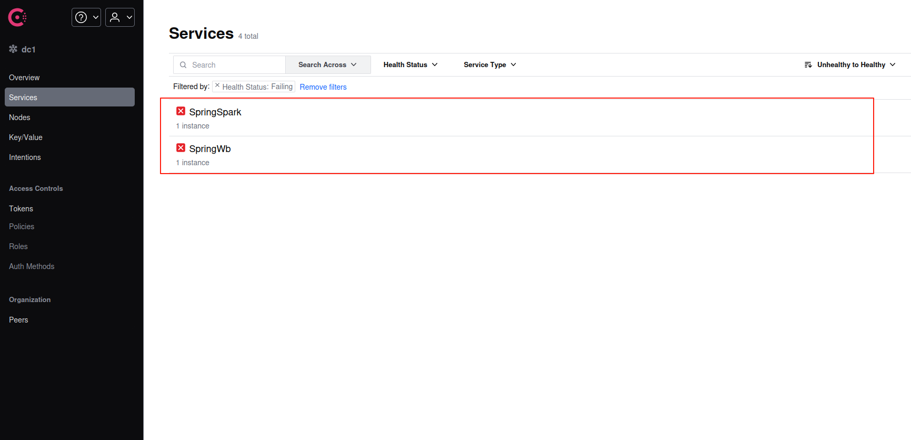

在现代微服务架构中，服务间的通信是构建系统的核心。传统地，我们可能会在配置文件中硬编码依赖服务的 IP 地址和端口号。这种看似简单的方式，在动态和复杂的微服务环境中会迅速演变成一场噩梦，主要体现在以下几个方面：

1.  **脆弱性与变更困难**：一旦某个服务的实例地址或端口发生变动（例如因故障重启、迁移或扩缩容），所有依赖它的服务都必须手动修改配置并重新部署，这在快速迭代的环境中是不可接受的。
2.  **缺乏弹性与负载均衡**：当一个服务为了提升处理能力而部署多个实例时，硬编码的方式无法实现请求的动态分发和负载均衡，导致资源利用率低下，也无法通过增加实例来水平扩展。
3.  **运维复杂度激增**：在拥有数十甚至上百个微服务的系统中，手动管理这张静态的服务依赖网络，其复杂度和出错率会随着系统的增长而呈指数级上升。

为了应对这些挑战，引入一套完善的服务治理机制至关重要。以 **Spring Cloud** 为代表的微服务框架，通过整合 **Consul**、Eureka 等组件，为我们提供了优雅的解决方案，旨在实现：

- **动态服务注册与发现**：服务实例启动时自动向注册中心注册自身信息，下线时自动注销。其他服务则通过注册中心动态发现依赖服务的可用实例列表。
- **智能负载均衡**：结合 Ribbon 或 Spring Cloud LoadBalancer，客户端可以在多个可用实例之间智能地分发请求，提升系统的吞吐量和容错能力。
- **集中化与动态配置**：使用 Consul KV 或 Spring Cloud Config，实现配置的统一管理和实时更新，无需重启服务即可应用新配置。

本文将聚焦于服务治理的核心组件之一 —— **HashiCorp Consul**，深入探讨其核心功能以及如何在 Spring Cloud 项目中进行深度集成和实践。

## Consul 核心能力解析

Consul 是一个功能强大、易于使用的服务网格解决方案，它提供了构建现代化、高弹性微服务架构所需的一系列关键能力：

- **服务发现 (Service Discovery)**：Consul 的核心功能。客户端应用可以向 Consul Agent 注册一个服务（如 `payment-service`），并可选地提供 IP、端口、标签等元数据。其他应用可以通过 Consul 的 DNS 接口或 HTTP API 查询并获取该服务的健康实例列表。

- **健康检查 (Health Checking)**：Consul Agent 可以定期对服务实例或节点本身执行健康检查。检查类型多样，可以是简单的 TCP 连接检查、HTTP 状态码检查，甚至是执行本地脚本。服务发现会**自动过滤掉健康检查失败的实例**，确保流量只会流向健康的服务提供者，从而实现服务调用的高可用。

- **键/值存储 (Key/Value Store)**：Consul 提供了一个层级化的键/值存储系统。开发者可以利用它来存储动态配置、进行特性开关（Feature Toggling）、实现分布式锁、执行领导者选举等高级协调任务。它提供了一个简单易用的 HTTP API。

- **安全服务通信 (Secure Service Communication)**：通过 **Consul Connect**，Consul 能为服务自动生成和分发 TLS 证书，轻松建立起服务间的 mTLS (双向 TLS)加密通信。通过定义 **Intention**（意图），可以精细化地控制哪些服务之间允许通信，从而在应用层实现零信任网络安全模型。

- **多数据中心 (Multi-Datacenter)**：Consul 在设计之初就原生支持跨数据中心部署。这使得构建异地多活、灾备恢复的分布式系统变得简单，无需在应用层面构建复杂的跨区域服务发现逻辑。

- **Web UI 界面**：Consul 自带一个美观且功能强大的 Web UI（默认端口 `8500`），管理员可以通过它直观地查看服务状态、节点信息、健康检查结果以及管理 K/V 存储，极大地简化了日常运维工作。

## Spring Cloud 集成 Consul：服务注册与发现实战

将 Spring Cloud 应用接入 Consul 非常直接，主要涉及依赖管理、配置和代码启用三个步骤。

### 1. 依赖管理 (Dependency Management)

首先，在你的 `pom.xml` 文件中添加必要的 Spring Cloud Consul 依赖。

**最佳实践**是使用 `spring-cloud-dependencies` BOM (Bill of Materials) 来统一管理版本，避免不同组件间的版本冲突。

```xml
    <dependency>
        <groupId>org.springframework.cloud</groupId>
        <artifactId>spring-cloud-starter-consul-discovery</artifactId>
    </dependency>

    <dependency>
        <groupId>org.springframework.cloud</groupId>
        <artifactId>spring-cloud-starter-consul-config</artifactId>
    </dependency>

    <dependency>
        <groupId>org.springframework.cloud</groupId>
        <artifactId>spring-cloud-starter-bootstrap</artifactId>
    </dependency>

    <dependency>
        <groupId>org.springframework.boot</groupId>
        <artifactId>spring-boot-starter-actuator</artifactId>
    </dependency>
```

### 2. 核心配置 (`bootstrap.yml`)

为了让应用在启动时就能从 Consul 获取配置并注册自己，我们需要在 `src/main/resources` 目录下创建 `bootstrap.yml` 文件。

> **为什么是 `bootstrap.yml` 而不是 `application.yml`?**
> Spring Cloud 引入了一个 "Bootstrap Context" 的概念。这个上下文在主 `ApplicationContext` 启动之前被创建，专门用于加载外部配置源（如 Consul KV 或 Config Server）。因此，所有与服务发现和远程配置相关的属性都应放在 `bootstrap.yml` 中，以确保它们在应用生命周期的早期阶段就被正确加载。

```yaml
spring:
  application:
    # 服务名称，将作为注册到Consul的Service ID
    name: payment-service
  cloud:
    consul:
      # Consul Agent的地址和端口
      host: localhost
      port: 8500
      # 服务发现相关配置
      discovery:
        # 优先使用服务的IP地址进行注册，而不是主机名
        prefer-ip-address: true
        # 自定义注册到Consul的服务名，默认为 ${spring.application.name}
        service-name: ${spring.application.name}
        # 开启健康检查
        health-check-enabled: true
        # 健康检查的URL，与Actuator端点集成
        health-check-path: /actuator/health
        # 健康检查的频率，例如每15秒检查一次
        health-check-interval: 15s
      # 分布式配置相关
      config:
        # 启用Consul作为配置中心
        enabled: true
        # 在Consul KV中的配置路径前缀
        prefix: config
        # 指定配置文件的格式
        format: YAML
        # 默认上下文的分隔符，通常用于区分不同的profile
        profile-separator: "-"
        # 存放配置内容的键，最终路径为: prefix/service-name/data-key
        data-key: data
```

### 3. 启用服务发现

在你的 Spring Boot 应用主类上，添加 `@EnableDiscoveryClient` 注解。这个注解会触发 Spring Cloud 的自动配置，激活服务注册与发现的客户端逻辑。

```java
import org.springframework.boot.SpringApplication;
import org.springframework.boot.autoconfigure.SpringBootApplication;
import org.springframework.cloud.client.discovery.EnableDiscoveryClient;

@SpringBootApplication
@EnableDiscoveryClient // 启用服务发现客户端功能
public class PaymentServiceApplication {
    public static void main(String[] args) {
        SpringApplication.run(PaymentServiceApplication.class, args);
    }
}
```

> **注意**: 在较新版本的 Spring Cloud 中，如果 `spring-cloud-starter-consul-discovery` 在 classpath 上，`@EnableDiscoveryClient` 注解是可选的，系统会自动启用服务发现。但显式声明是一种良好的编码习惯。

至此，启动该应用，它将自动完成以下流程：

1.  **加载 Bootstrap 配置**：读取 `bootstrap.yml` 中的 Consul 连接信息。
2.  **初始化 Consul 客户端**：Spring Cloud auto-configuration 创建一个与 Consul Agent 通信的客户端。
3.  **构建注册信息**：根据配置，组装包含服务名、IP、端口、健康检查端点等信息的服务实例数据。
4.  **发送注册请求**：通过 HTTP API 将服务实例信息发送到 Consul Agent。
5.  **启动健康检查**：Consul Server 会根据注册信息，定期轮询应用的 `/actuator/health` 端点来监控其健康状态。

## Spring Cloud Consul 进阶功能

### 1. 健康检查集成

Consul 的健康检查是其服务发现机制的基石。当与 Spring Boot Actuator 集成时，Consul 会周期性地访问 `/actuator/health` 端点。

- 如果端点返回 HTTP `200 OK` 并且响应体中的 `status` 字段为 `UP`，则认为该实例健康。
- 如果端点无响应、返回非 `200` 状态码或 `status` 为 `DOWN`，则实例被标记为不健康。

**正常状态**:
在 Consul UI 中，服务实例旁边会有一个绿色的对勾，表示所有健康检查通过。



**异常状态**:
当服务实例出现问题（例如数据库连接断开），Actuator 的健康状态会变为 `DOWN`。Consul 检测到后，会立即将该实例标记为 `critical` 状态，并从服务发现结果中剔除。



### 2. 分布式配置中心

利用 Consul 的 K/V Store，我们可以实现配置的集中化和动态刷新。

根据我们之前的 `bootstrap.yml` 配置，应用 `payment-service` 会在启动时尝试从 Consul K/V 中读取以下路径的配置：

`config/payment-service/data`

你可以在 Consul UI 的 Key/Value 面板中创建这个键，并以 YAML 格式存入你的配置，例如：

```yaml
# 在 Consul K/V 中，键为 config/payment-service/data 的值
cloud-payment-service:
  info: welcome to Spring Cloud development
```

应用启动时会加载这些配置，并将其合并到 Spring 的 `Environment` 中。这意味着你可以在代码中通过 `@Value` 或 `@ConfigurationProperties` 直接注入这些值。更强大的是，结合 Spring Cloud Bus，你可以实现修改 Consul 中的配置后，无需重启服务即可动态刷新应用中的配置值。

#### 多环境与多版本配置管理

在企业级开发中，为不同环境维护独立的配置文件是标准实践。Spring 通过 `profiles` 的概念来支持这一点。我们可以通过在 `application.yml` 或启动参数中设置 `spring.profiles.active` 来激活一个或多个 `profile`。

例如，在开发环境中，我们配置：

```yaml
# application.yml
spring:
  profiles:
    active: dev
```

Spring Cloud Consul 会根据激活的 `profile`，按照特定顺序从 Consul K/V 中查找并加载配置。根据我们 `bootstrap.yml` 的设置 (`prefix: config`, `profile-separator: '-'`, `data-key: data`)，加载顺序如下：

1.  **加载通用配置**：

    - 路径: `config/application/data`
    - 作用：存放所有服务、所有环境共享的全局配置。

2.  **加载特定服务通用配置**：

    - 路径: `config/payment-service/data`
    - 作用：存放 `payment-service` 在所有环境下都通用的配置。**此处的配置会覆盖 `config/application/data` 中的同名配置。**

3.  **加载特定环境通用配置**：

    - 路径: `config/application-dev/data`
    - 作用：存放所有服务在 `dev` 环境下共享的配置。

4.  **加载特定服务特定环境配置**：

    - 路径: `config/payment-service-dev/data`
    - 作用：存放 `payment-service` 在 `dev` 环境下的专属配置。**这是最高优先级的配置，会覆盖前面所有同名配置。**

**配置示例：**

假设我们有 `dev` 和 `prod` 两个环境。

**1. 创建通用配置 (K/V Store)**

- **Key**: `config/payment-service/data`
- **Value**:
  ```yaml
  # 一个通用的信息
  service:
    info: "This is a generic payment service configuration."
  ```

**2. 创建开发环境配置 (K/V Store)**

- **Key**: `config/payment-service-dev/data`
- **Value**:
  ```yaml
  # dev环境专属配置，会覆盖通用配置
  service:
    info: "Welcome to Spring Cloud [DEV] environment."
  ```

**3. 创建生产环境配置 (K/V Store)**

- **Key**: `config/payment-service-prod/data`
- **Value**:
  ```yaml
  # prod环境专属配置，会覆盖通用配置
  service:
    info: "Welcome to Spring Cloud [PROD] environment."
  ```

**结果**：

- 当应用以 `spring.profiles.active=dev` 启动时，它会加载通用配置和开发环境配置。最终 `service.info` 的值是 `"Welcome to Spring Cloud [DEV] environment."`，并且会获得 `dev` 环境的数据库 URL。
- 当以 `spring.profiles.active=prod` 启动时，`service.info` 的值将是 `"Welcome to Spring Cloud [PROD] environment."`，并配置了生产数据库和更严格的日志级别。

> 通过这种分层、覆盖的机制，我们可以非常灵活且清晰地管理复杂的多环境配置，同时最大限度地实现配置复用。结合 Spring Cloud Bus，甚至可以实现配置的动态刷新，而无需重启服务。

好的，作为一名资深的 Spring Cloud 架构师，我将对您提供的这部分内容进行重构和深化。原始文档准确地展示了如何使用`RestTemplate`进行基础的服务调用，但从架构师的视角来看，我们可以提供更全面的视图，对比不同的技术选型，并强烈推荐当前业界的主流最佳实践。

以下是优化和补充后的版本：

---

## 微服务架构下的服务间通信：从`RestTemplate`到`OpenFeign`的演进

在服务被成功注册到 Consul 之后，下一步的核心任务就是实现服务之间的通信。Spring Cloud 生态提供了多种强大的工具来完成这项工作。让我们从经典的方式开始，并逐步演进到更现代化、更优雅的解决方案。

### **前置条件**

确保您已经拥有：

1.  一个正在运行的 Consul 实例。
2.  至少两个 Spring Boot 应用（一个服务提供者，一个服务消费者）。
3.  两个应用都已集成`spring-cloud-starter-consul-discovery`，并成功将自己注册到 Consul。

---

### 方式一：使用 `RestTemplate` (经典方式)

`RestTemplate`是 Spring 框架提供的用于访问 RESTful 服务的传统 HTTP 客户端。结合 Spring Cloud 的`@LoadBalanced`注解，它可以轻松地实现基于服务名的客户端负载均衡。

#### 1. 架构解读：`@LoadBalanced` 的背后

当您在一个`RestTemplate`的 Bean 上标注`@LoadBalanced`时，Spring Cloud 会启用一个拦截器。这个拦截器会：

- **拦截请求**：捕获所有通过该`RestTemplate`实例发出的 HTTP 请求。
- **解析服务名**：识别 URL 中的主机名部分（例如`cloud-payment-service`），并将其理解为一个服务 ID，而非真实的域名。
- **服务发现**：向 Consul 查询该服务 ID 下所有健康的实例列表。
- **负载均衡**：从实例列表中，根据负载均衡策略（默认为轮询`Round-Robin`）选择一个具体的 `IP:端口`。
- **重写 URL 并发送请求**：将原始 URL 中的服务名替换为选定实例的`IP:端口`，然后发送实际的 HTTP 请求。

这个过程对开发者是透明的，极大地简化了服务调用。

#### 2. 配置 `RestTemplate`.

在您的服务消费者应用中，创建一个配置类来提供`RestTemplate`的 Bean。

```java
import org.springframework.cloud.client.loadbalancer.LoadBalanced;
import org.springframework.context.annotation.Bean;
import org.springframework.context.annotation.Configuration;
import org.springframework.web.client.RestTemplate;

@Configuration
public class RestTemplateConfig {

    @Bean
    @LoadBalanced // 核心注解，激活基于服务发现的负载均衡能力
    public RestTemplate restTemplate() {
        return new RestTemplate();
    }
}
```

- **注意**：您提供的原始代码中包含了很多`org.springframework.cloud.loadbalancer`下的导入，这些对于基础的`@LoadBalanced`功能而言是不必要的，会自动配置。保持代码的简洁性是良好实践。

#### 3. 编写服务提供者 (Provider)

提供一个简单的 REST 端点供其他服务调用。

```java
import org.springframework.web.bind.annotation.GetMapping;
import org.springframework.web.bind.annotation.RestController;

@RestController
public class PaymentProviderController {

    @GetMapping("/rest/test")
    public String provideRestTest() {
        // 为了清晰，可以返回更具体的信息
        return "Response from [PaymentProviderController]: Consul and RestTemplate test success!";
    }
}
```

#### 4. 编写服务消费者 (Consumer)

使用注入的`RestTemplate`来调用提供者。

```java
import jakarta.annotation.Resource;
import lombok.extern.slf4j.Slf4j;
import org.springframework.web.bind.annotation.GetMapping;
import org.springframework.web.bind.annotation.RestController;
import org.springframework.web.client.RestTemplate;

@Slf4j
@RestController
public class OrderConsumerController {

    @Resource
    private RestTemplate restTemplate;

    // 最佳实践：将服务名定义为常量，便于维护
    public static final String PAYMENT_SERVICE_URL = "http://cloud-payment-service";

    @GetMapping("/consumer/rest/test")
    public String consumeRestTest() {
        log.info("Consumer is calling provider...");
        // 使用服务名进行调用
        return restTemplate.getForObject(PAYMENT_SERVICE_URL + "/rest/test", String.class);
    }
}
```

- **关键点**：`PAYMENT_SERVICE_URL`中的`cloud-payment-service`必须与提供者在`application.yml`中`spring.application.name`的值完全一致。

#### 5. 测试

启动 Consul、服务提供者和服务消费者。访问消费者的`http://<consumer-host>:<port>/consumer/rest/test`端点，您应该能成功获取到提供者返回的字符串 `Response from [PaymentProviderController]: Consul and RestTemplate test success!`。

---

### 方式二：使用 `OpenFeign`

尽管`RestTemplate`行之有效，但它存在一些缺点：

- **代码冗余**：需要手动拼接 URL。
- **非类型安全**：URL 是硬编码的字符串，容易出错，且返回值需要手动转换为期望的类型。
- **可读性差**：业务代码与 HTTP 调用逻辑混杂在一起。

**OpenFeign** 是一个声明式的 HTTP 客户端，它将上述问题优雅地解决了。通过创建一个 Java 接口并使用注解，您可以像调用本地方法一样调用远程 HTTP 服务。

#### 1. 架构优势

- **声明式**：将 HTTP API 的定义抽象为 Java 接口，完全分离了调用方业务逻辑和远程 API 的定义。
- **类型安全**：所有请求参数和返回值都是强类型的 Java 对象，编译期即可发现错误。
- **高度集成**：无缝集成了 Ribbon/Spring Cloud LoadBalancer 进行负载均衡，集成了 Hystrix/Sentinel 进行服务熔断。
- **代码简洁**：极大地减少了样板代码，提升了开发效率和代码可维护性。

#### 2. 添加依赖

确保消费者的`pom.xml`中已添加`spring-cloud-starter-openfeign`依赖。

#### 3. 启用 OpenFeign

在消费者的主启动类上添加`@EnableFeignClients`注解。

```java
import org.springframework.boot.SpringApplication;
import org.springframework.boot.autoconfigure.SpringBootApplication;
import org.springframework.cloud.client.discovery.EnableDiscoveryClient;
import org.springframework.cloud.openfeign.EnableFeignClients;

@SpringBootApplication
@EnableDiscoveryClient
@EnableFeignClients // 启用 Feign 功能
public class OrderConsumerApplication {
    public static void main(String[] args) {
        SpringApplication.run(OrderConsumerApplication.class, args);
    }
}
```

#### 4. 创建 Feign 客户端接口

在消费者项目中，创建一个接口来定义对`cloud-payment-service`的调用。

```java
import org.springframework.cloud.openfeign.FeignClient;
import org.springframework.web.bind.annotation.GetMapping;

// value/name 属性指向要调用的微服务在Consul上的注册名
@FeignClient(value = "cloud-payment-service")
public interface PaymentFeignClient {

    // 接口方法的签名要与服务提供者的Controller方法完全匹配
    // 包括请求路径、方法类型(GET/POST)、参数等
    @GetMapping("/rest/test")
    String provideRestTest();
}
```

#### 5. 在消费者中使用 Feign 客户端

现在，您可以像注入任何其他 Spring Bean 一样注入并使用`PaymentFeignClient`。

```java
import jakarta.annotation.Resource;
import lombok.extern.slf4j.Slf4j;
import org.springframework.web.bind.annotation.GetMapping;
import org.springframework.web.bind.annotation.RestController;

@Slf4j
@RestController
public class OrderConsumerController {

    @Resource
    private PaymentFeignClient paymentFeignClient; // 直接注入 Feign 客户端

    @GetMapping("/consumer/feign/test")
    public String consumeWithFeign() {
        log.info("Consumer is calling provider via OpenFeign...");
        // 调用远程服务就像调用本地方法一样简单
        return paymentFeignClient.provideRestTest();
    }
}
```

#### 6. 测试

启动所有服务，访问消费者的`/consumer/feign/test`端点，您会得到与`RestTemplate`方式相同的结果，但实现过程显然更加优雅和健壮。

## **生产环境下的 Consul：从持久化到高可用集群**

在任何严肃的生产环境中，依赖一个默认配置（内存存储、单节点）的 Consul 都是极具风险的。当 Consul 节点发生重启或宕机，所有服务注册信息、配置数据都将丢失，导致整个微服务体系瘫痪。为了构建一个健壮、可靠的服务治理基石，我们必须解决两个核心问题：

1.  **数据持久性 (Durability)**：确保 Consul 在**重启**后能够恢复其状态。
2.  **高可用性 (High Availability)**：确保在部分节点**宕机**后，Consul 集群依然能够正常服务。

本节将深入探讨如何实现这两点。

---

### 一、 数据持久化

默认情况下，Consul Agent 将其状态信息存储在内存中。为了让数据在重启后得以保留，我们必须为其配置一个持久化存储目录。

#### 1. 为何必须持久化？

- **状态恢复**：持久化是 Consul 在重启后能恢复其服务目录、K/V 存储、会话信息、ACLs 等所有状态数据的前提。
- **Raft 协议基础**：在集群模式下，Raft 一致性协议的日志也必须持久化到磁盘，以保证数据一致性和选举的正确性。
- **避免数据丢失**：这是最直接的原因，防止因意外关闭或计划内维护导致的所有配置信息的丢失。

#### 2. 如何实现？

通过在 Consul 的启动配置中指定`data_dir`参数即可。Consul 会将所有需要持久化的数据写入此目录。

**推荐方式：使用配置文件**

创建一个`consul.json`配置文件。这种方式比冗长的命令行参数更易于管理和版本控制。

**示例：一个用于开发的单节点持久化配置 (`consul-dev.json`)**

```json
{
  "bootstrap_expect": 1,
  "server": true,
  "node_name": "consul-server",
  "datacenter": "dc1",
  "data_dir": "/usr/local/consul/Repository",
  "log_level": "INFO",
  "enable_syslog": true,
  "bootstrap_expect": 1,
  "bind_addr": "127.0.0.1",
  "advertise_addr": "127.0.0.1",
  "client_addr": "0.0.0.0",
  "ui": true
}
```

- `"server": true"`：表明这是一个 Server 角色的节点，它会参与 Raft 协议并存储数据。
- `"bootstrap_expect": 1"`：表示这是一个单节点的集群，启动后它自己就是 Leader。**此配置仅适用于开发或测试环境。**
- `"data_dir": "/usr/local/consul/Repository"`：**核心配置**。指定数据存储目录。请确保 Consul 进程对该目录有读写权限。

**启动命令：**

```bash
# 确保目录存在
mkdir -p /usr/local/consul/Repository

# 使用配置文件启动
consul agent -config-file=consul-dev.json
```

---

### 二、 高可用集群

解决了持久化问题后，我们来应对更严峻的挑战：单点故障。一个持久化的单节点 Consul，如果其所在服务器宕机，整个服务治理体系依然会崩溃。**在生产环境中，部署一个高可用的 Consul 集群是强制性要求。**

#### 1. 架构原理：Raft 一致性协议

Consul Server 集群使用 [Raft 协议](https://raft.github.io/) 来保证数据在多个节点间的强一致性。其核心思想是：

- 集群选举一个**Leader**节点，所有写操作都必须通过 Leader 执行。
- 写操作日志会被复制到大多数(**Quorum**)的**Follower**节点上。
- 只有当操作被确认写入到大多数节点后，才算成功。这个“大多数”通常是 `(N/2) + 1`，其中 N 是集群中的 Server 节点数。

#### 2. 集群规模：为何总是奇数？

根据 Raft 的原理，为了能容忍`F`个节点故障，集群至少需要 `2F + 1` 个节点。

- **3 节点集群**：可容忍 1 个节点故障。(`(3/2)+1 = 2`个节点存活即可)
- **5 节点集群**：可容忍 2 个节点故障。(`(5/2)+1 = 3`个节点存活即可)
- **4 节点集群呢？** 同样只能容忍 1 个节点故障(`(4/2)+1 = 3`个节点存活)，但成本更高。因此，**生产环境的 Server 集群节点数总是奇数（推荐 3 或 5）**。

#### 3. 如何配置集群？

假设我们部署一个 3 节点的集群，IP 分别为 `10.0.0.1`, `10.0.0.2`, `10.0.0.3`。

**示例：生产环境的 3 节点集群配置 (`consul-prod.json`)**
这个配置文件可以在 3 台服务器上通用。

```json
{
  "bootstrap_expect": 1,
  "server": true,
  "node_name": "consul-server",
  "datacenter": "dc1",
  "data_dir": "/usr/local/consul/Repository",
  "log_level": "INFO",
  "enable_syslog": true,
  "bootstrap_expect": 1,
  "bind_addr": "127.0.0.1",
  "advertise_addr": "127.0.0.1",
  "client_addr": "0.0.0.0",
  "ui": true,
  "bootstrap_expect": 3,
  "retry_join": ["10.0.0.1", "10.0.0.2", "10.0.0.3"]
}
```

**关键集群配置：**

- `"bootstrap_expect": 3"`：**核心配置**。通知每个 Server 节点，期望有 3 个 Server 加入集群后才开始选举 Leader 并对外提供服务。
- `"retry_join": [...]"`：**核心配置**。提供了其他集群成员的地址列表。节点启动后会尝试连接这些地址以加入集群。

在 3 台服务器上分别调整`node_name`后，使用相同的命令启动，它们会自动发现彼此并组成一个高可用的集群。

---

### 三、 存储与管理 K/V 数据

一旦您的 Consul 后端（无论是单点持久化还是高可用集群）部署完毕，您就可以放心地使用其 K/V 存储功能了。

- **存储数据**：
  ```bash
  # 将本地的 a.yml 文件内容存入 Consul K/V
  consul kv put config/payment-service/data -f a.yml
  ```
- **获取数据**：
  ```bash
  consul kv get config/payment-service/data
  ```

这些数据现在被安全地存储在 Consul 的持久化目录中，并通过 Raft 协议在集群节点间同步，您的 Spring Cloud 应用可以像之前一样通过`bootstrap.yml`的配置来加载它们，无需关心后端是单点还是集群。

### 生产环境配置

- `consul.service` 文件解析

> 存储于 /etc/systemd/system/consul.service

```ini
[Unit]
Description=Consul Service
Documentation=https://www.consul.io/
Requires=network-online.target
After=network-online.target

[Service]
Environment="GOMAXPROCS=2"
ExecStart=/usr/bin/consul agent -config-dir=/usr/local/consul/conf
ExecReload=/bin/kill -HUP $MAINPID
KillMode=process
Restart=on-failure
LimitNOFILE=65536

[Install]
WantedBy=multi-user.target
```

- 启动服务： `sudo systemctl start consul`
- 停止服务： `sudo systemctl stop consul`
- 重启服务： `sudo systemctl restart consul`
- 查看服务状态： `sudo systemctl status consul`
- 设置开机自启： `sudo systemctl enable consul`
