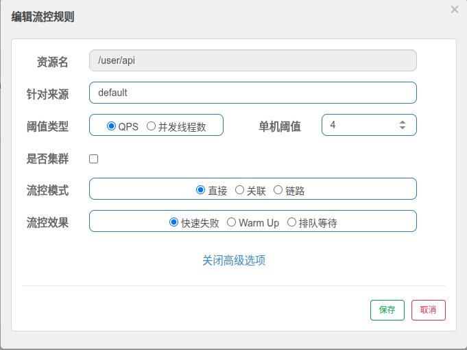
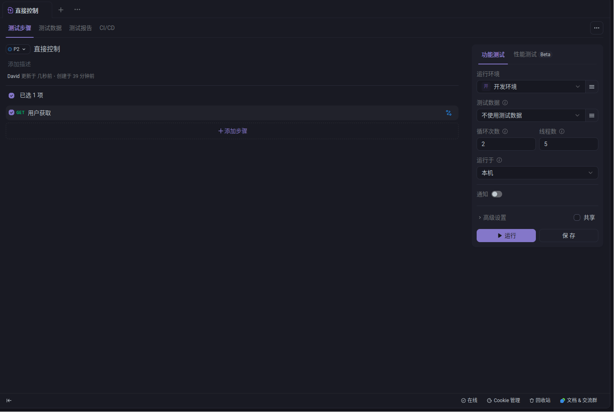
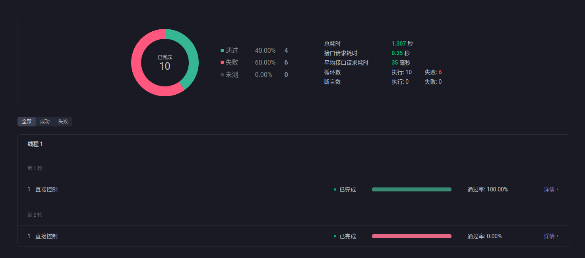
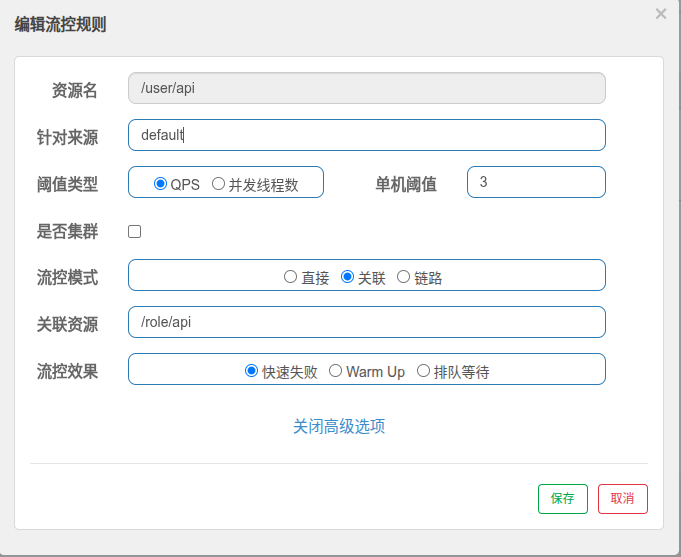
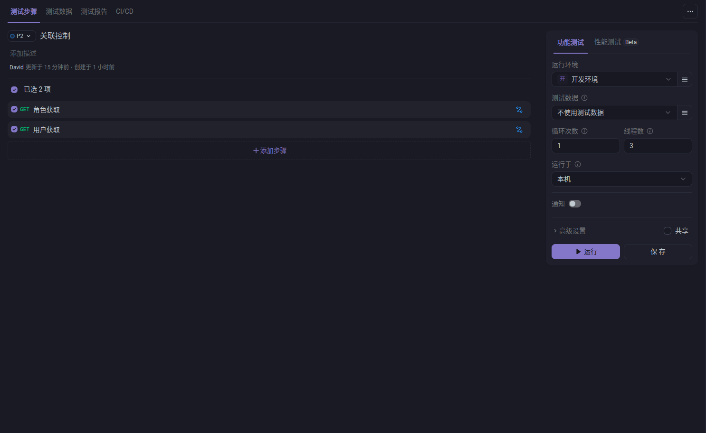
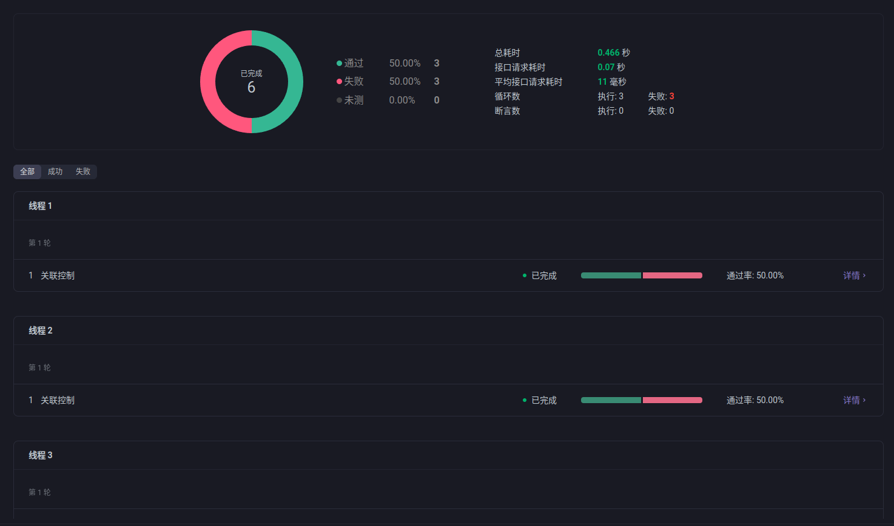
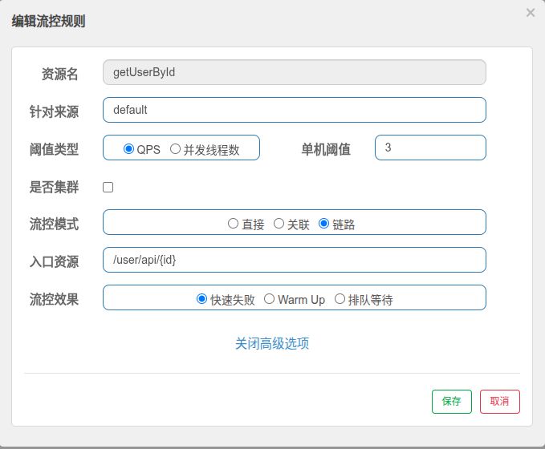
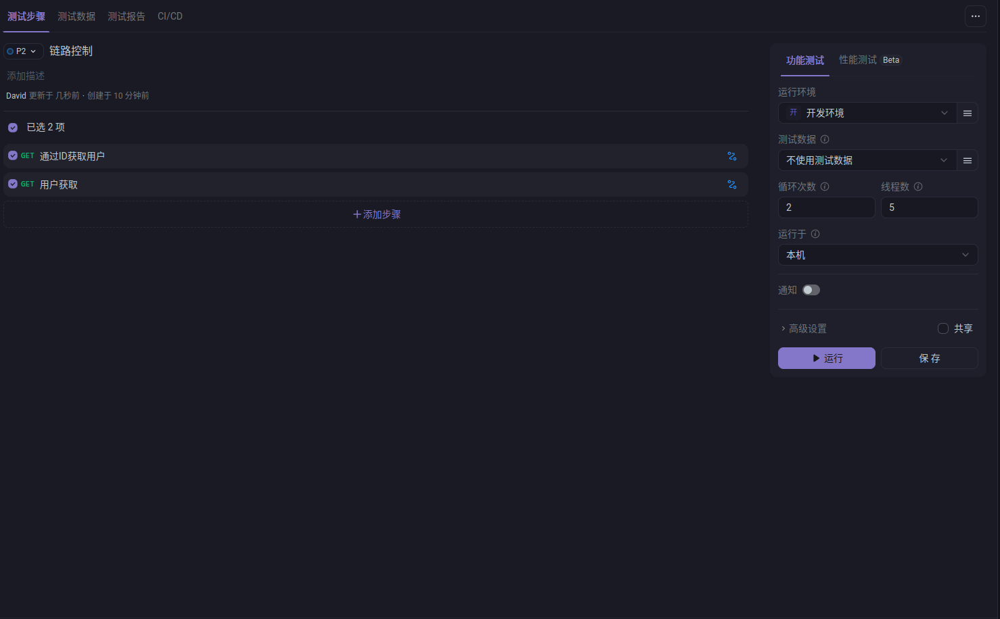
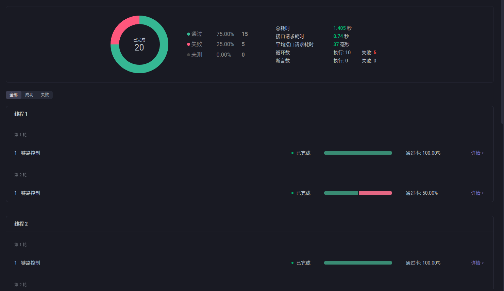

## 安装控制台

### Docker 镜像构建

创建 Dockerfile 文件：

```dockerfile
FROM eclipse-temurin:17-jdk-jammy
LABEL maintainer="sentinel-user"
LABEL version="1.8.8"
LABEL description="Sentinel Dashboard 1.8.8 on JDK 17"

WORKDIR /app

# 下载 Sentinel Dashboard JAR 包
RUN wget -O sentinel-dashboard.jar https://github.com/alibaba/Sentinel/releases/download/1.8.8/sentinel-dashboard-1.8.8.jar

# 暴露端口
EXPOSE 8080

# 启动命令
ENTRYPOINT [ "java", \
    "-Dserver.port=8080", \
    "-Dcsp.sentinel.dashboard.server=localhost:8080", \
    "-Dproject.name=sentinel-dashboard", \
    "-jar", "sentinel-dashboard.jar" ]
```

### 构建镜像

```bash
docker build -t sentinel-dashboard:1.8.8 .
```

### Docker Compose 配置

创建 `docker-compose.yml` 文件：

```yaml
services:
  sentinel:
    image: sentinel-dashboard:1.8.8
    container_name: sentinel
    restart: unless-stopped
    ports:
      - "8080:8080"
    networks:
      spring-cloud-networks:
        ipv4_address: 10.25.0.12
    environment:
      - JAVA_OPTS=-Xmx512m -Xms512m

networks:
  spring-cloud-networks:
    name: spring-cloud-networks
    driver: bridge
    ipam:
      driver: default
      config:
        - subnet: 10.25.0.0/24 # 子网定义，支持静态IP分配
```

### 启动服务

```bash
docker-compose up -d
```

访问控制台：http://localhost:8080（默认用户名/密码：sentinel/sentinel）

## 流控模式详解

Sentinel 提供三种流控模式，每种模式适用于不同的业务场景：

### 1. 直接模式

直接模式是最基本的流控方式，直接对指定资源进行流量控制。当资源的 QPS 或并发线程数超过设定阈值时，新的请求会被直接拒绝。

#### 配置步骤

1. **进入流控规则配置界面**
   - 登录 Sentinel 控制台
   - 选择目标应用
   - 点击"流控规则"菜单

2. **新增流控规则**

   配置参数如下：

   | 参数         | 值          | 说明                       |
   | ------------ | ----------- | -------------------------- |
   | **资源名**   | `/user/api` | 需要流控的接口路径         |
   | **针对来源** | `default`   | 默认来源，适用于所有调用方 |
   | **阈值类型** | `QPS`       | 基于每秒请求数进行限流     |
   | **单机阈值** | `4`         | 每秒最多允许 4 个请求      |
   | **是否集群** | `否`        | 单机模式                   |
   | **流控模式** | `直接`      | 直接对资源进行流控         |
   | **流控效果** | `快速失败`  | 超出阈值的请求立即失败     |



#### 压力测试

使用 Apifox 进行压力测试：

**测试配置：**

- 线程数：5
- 循环次数：2
- 总请求数：10



#### 测试结果分析

**预期结果：**

- 成功请求：4 个（符合 QPS=4 的限制）
- 失败请求：6 个（被流控拦截）



**结果说明：**
直接模式成功限制了 `/user/api` 接口的访问频率，超出阈值的请求被快速失败处理，保护了后端服务不被过载。

### 2. 关联模式

关联模式用于处理资源间的依赖关系。当关联资源的 QPS 或并发数超过阈值时，会限制当前资源的访问。这种模式常用于保护重要资源不被次要资源的高并发影响。

#### 应用场景

- 读写分离场景：当写操作过于频繁时，限制读操作
- 资源优先级保护：保护核心业务资源不被非核心业务影响
- 依赖资源保护：当依赖的下游服务压力过大时，限制上游请求

#### 配置步骤

配置参数如下：

| 参数         | 值          | 说明                 |
| ------------ | ----------- | -------------------- |
| **资源名**   | `/user/api` | 当前需要被流控的资源 |
| **针对来源** | `default`   | 默认来源             |
| **阈值类型** | `QPS`       | 基于每秒请求数       |
| **单机阈值** | `3`         | 关联资源的 QPS 阈值  |
| **是否集群** | `否`        | 单机模式             |
| **流控模式** | `关联`      | 关联模式             |
| **关联资源** | `/role/api` | 被关联监控的资源     |
| **流控效果** | `快速失败`  | 快速失败策略         |



#### 压力测试

**测试策略：**

1. 对 `/role/api` 接口进行高并发请求
2. 同时访问 `/user/api` 接口观察流控效果

**测试配置：**

- 线程数：3
- 循环次数：1
- 每个线程同时请求两个接口



#### 测试结果分析

**测试结果：**

- `/role/api` 成功请求：3 个
- `/user/api` 成功请求：0 个（全部被流控）



**结果说明：**
当 `/role/api` 的 QPS 达到设定阈值 3 时，关联的 `/user/api` 接口被完全限流，体现了关联模式的保护机制。这种模式有效防止了次要资源对重要资源的影响。

### 3. 链路模式

链路模式是一种更精细化的流控方式，它根据调用链路的“入口”来区分流量，并对来自特定入口的流量进行限制，而不影响来自其他入口的相同资源的调用。

#### 应用场景

- 微服务调用链路保护：只对特定服务调用链进行限流。
- 多入口资源保护：同一个资源有多个访问入口时，只限制特定入口。
- 精细化流量管理：需要对不同业务场景进行差异化限流。

#### 配置步骤

**前置条件：**

1.  需要在应用中配置 Sentinel，并正确设置调用链路追踪。
2.  确保微服务间的调用链路信息能被 Sentinel 正确识别。
3.  在 Spring Boot 应用中需要添加相关依赖和配置。

**典型配置示例：**

```yaml
# application.yml 中的 Sentinel 配置
spring:
  cloud:
    sentinel:
      transport:
        dashboard: localhost:8080
      web-context-unify: false # 关闭上下文整合，启用链路模式
```

```java
@SentinelResource(value = "getUserById")
```

**流控规则配置：**

| 参数         | 值               | 说明                                           |
| :----------- | :--------------- | :--------------------------------------------- |
| **资源名**   | `getUserById`    | `@SentinelResource` 注解中定义的值。           |
| **针对来源** | `default`        | 默认来源。                                     |
| **阈值类型** | `QPS`            | 基于每秒请求数。                               |
| **单机阈值** | `3`              | 来自指定入口的 QPS 不能超过 3。                |
| **流控模式** | `链路`           | 模式设置为链路模式。                           |
| **入口资源** | `/user/api/{id}` | 指定调用链路的入口，即 Controller 的接口路径。 |
| **流控效果** | `快速失败`       | 触发限流后，请求立即失败。                     |



#### 压力测试

**测试配置：**

- 线程数：5
- 循环次数：2
- 每个线程同时请求两个接口。



#### 测试结果分析

**测试结果：**

- `/user/api` 成功请求：10 个
- `/user/api/{id}` 成功请求：5 个
- `/user/api/{id}` 快速失败：5 个



#### 最佳实践建议

**配置建议：**

- 合理设置阈值，避免过度限流影响正常业务
- 定期监控和调整规则，确保流控效果符合预期
- 建议先在测试环境充分验证后再上线生产

**监控要点：**

- 关注实时 QPS 和拒绝请求数
- 监控服务响应时间变化
- 观察错误率和成功率指标

## 最佳实践与运维建议

Sentinel 的三种流控模式各有特点和适用场景：

- **直接模式**：简单直接，适用于单一资源的保护
- **关联模式**：适用于有依赖关系的资源保护场景
- **链路模式**：提供最精细化的流控能力，适用于复杂的微服务架构

### 1. 规则配置原则

- **渐进式配置**：从宽松到严格，逐步调整阈值
- **业务优先级**：核心业务优先保障，非核心业务可适当限制
- **动态调整**：根据业务高峰期和低峰期动态调整规则

### 2. 监控与告警

- **实时监控**：持续关注关键指标的变化趋势
- **告警设置**：配置合理的告警阈值，及时发现异常
- **日志记录**：保留详细的流控日志，便于问题排查

### 3. 应急预案

- **快速熔断**：在系统过载时能够快速启动保护机制
- **降级策略**：制定合理的服务降级方案
- **恢复机制**：系统恢复后的规则调整和验证流程
