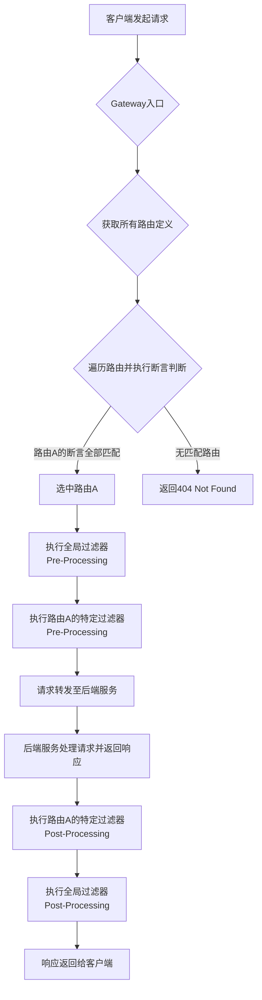
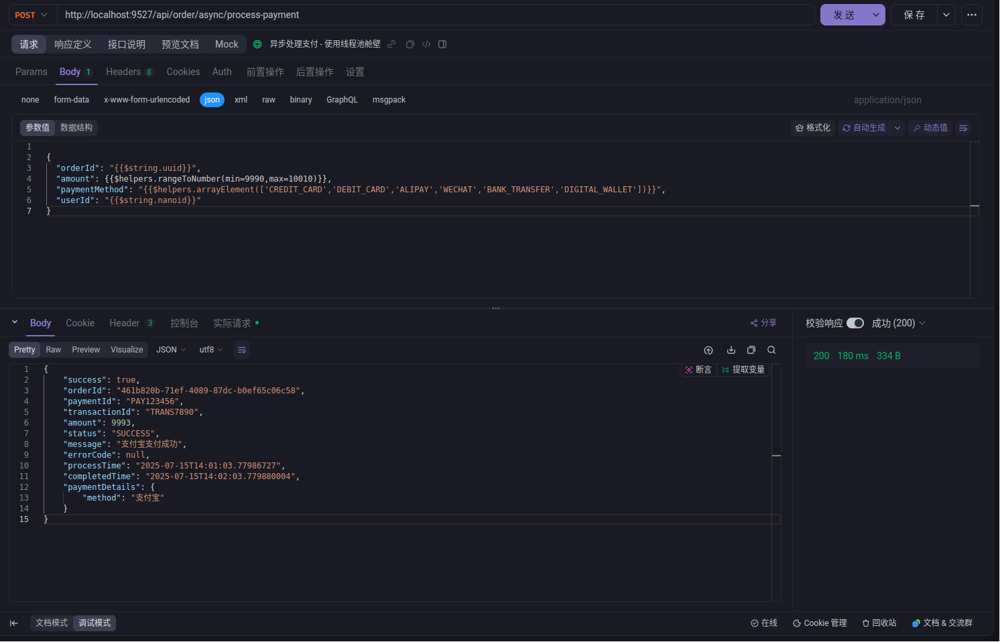
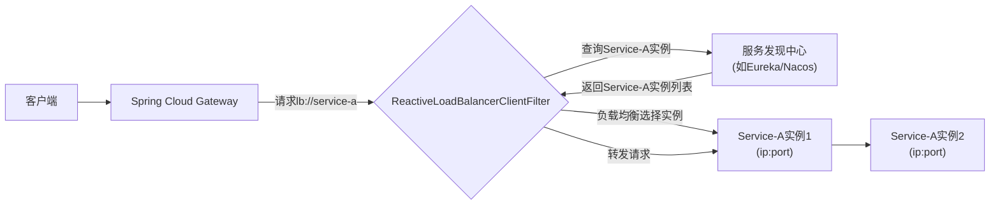

## 新一代网关：Spring Cloud Gateway

新一代网关，通常指的是在微服务架构下，用于统一管理、路由和处理所有进入系统的外部请求的组件。它不再仅仅是一个简单的反向代理，而是集成了多种高级功能，以满足现代分布式系统的复杂需求。Spring Cloud Gateway 便是其中的典型代表，它是 Spring Cloud 生态系统中用于构建 API 网关的强大且灵活的解决方案。

- **官方文档：** Spring Cloud Gateway 的官方文档是理解其核心概念和高级用法的最佳资源，详情请参考 [Spring Cloud Gateway Reference Documentation 4.0.4](https://docs.spring.io/spring-cloud-gateway/docs/4.0.4/reference/html/)。

- **体系定位：** 在微服务体系中，网关处于客户端请求与后端微服务之间的最前沿，是系统的统一入口。它作为基础设施层的一部分，负责将外部请求转发到正确的内部服务，并在此过程中执行各种横切关注点（Cross-cutting Concerns），如安全、流量管理等。它是一个开发框架，提供了构建分布式系统所需的基础能力。

- **微服务架构中网关的位置：** 网关部署在微服务集群的最前端，负责接收所有外部流量。它充当客户端与内部微服务之间的桥梁，将复杂的内部服务结构对外部进行抽象和隐藏，对外提供一个统一、简洁的 API 接口。

- **反向代理：** Spring Cloud Gateway 本质上是一个反向代理。它接收来自客户端的请求，然后将这些请求转发给后端的一个或多个服务。这种模式有以下优势：

  - **统一入口：** 客户端只需与网关通信，无需了解后端服务的具体地址。
  - **负载均衡：** 网关可以将请求分发到多个服务实例上，实现负载均衡。
  - **安全与认证：** 可以在网关层集中处理认证和授权，减轻后端服务的负担。
  - **易于监控：** 可以在网关层统一收集监控数据。
  - **流量管理：** 可以在网关层面实现限流、熔断、灰度发布等复杂的流量控制策略。

- **鉴权：** Spring Cloud Gateway 可以实现集中式鉴权。它能够根据请求的来源（如特定应用、其他网关或任意来源）以及请求路径（Path）对服务接口进行访问控制。通过配置鉴权规则，可以实现细粒度的黑名单或白名单控制，从而提高整个微服务系统的安全性。

## 新一代网关能干嘛？

新一代网关，特别是 Spring Cloud Gateway，具备多项核心功能，用于提升微服务系统的健壮性、安全性和可管理性：

- **流控（流量控制）：** Spring Cloud Gateway 可以集成如 Sentinel 等流量控制组件，实现对请求流量的细粒度控制。它可以基于 `Route` （路由 ID）维度或 `Custom API` 维度进行限流，从而防止后端服务因过载而崩溃。流控规则可以动态配置，实现灵活的流量管理策略。

- **熔断（Circuit Breaker）：** 网关能够实现服务熔断机制，当后端某个服务出现故障或响应过慢时，网关可以暂时切断对该服务的请求，避免雪崩效应，保护整个系统的稳定性。Spring Cloud 体系通过集成如 Resilience4j 等库提供熔断能力。

- **日志监控：** 网关是所有请求的入口，因此是进行日志记录和监控的理想位置。Spring Cloud Gateway 支持记录各类可观测性指标，包括：
  - **Metrics：** 收集请求数、QPS（每秒查询数）、响应码、P99/P999（99%和 99.9%请求的响应时间）等性能指标。
  - **Trace：** 实现全链路追踪，将网关层的请求与后续微服务的调用链串联起来，便于问题定位和性能分析。
  - **Logging：** 打印详细的网关日志，例如访问日志（accessLog）、请求日志（requestLog）和远程调用日志（remotingLog），为故障排查和运营分析提供数据支持。

## Gateway 三大核心

Spring Cloud Gateway 的核心功能围绕着三大基本概念构建：**路由（Route）**、**断言（Predicate）** 和 **过滤器（Filter）**。

### Route (路由)

- **定义：** 路由是构建网关的基本模块。每个路由都由一个唯一的 ID、一个目标 URI、一系列的断言（Predicate）和一系列的过滤器（Filter）组成。
- **匹配机制：** 当一个请求到达网关时，网关会评估所有的路由。如果请求满足某个路由定义中的所有断言条件，则该路由被匹配，网关将根据该路由的配置将请求转发到目标 URI，并应用路由中定义的过滤器。

### Predicate (断言)

- **定义：** 断言是判断一个 HTTP 请求是否符合某个路由规则的条件。Spring Cloud Gateway 的断言设计灵感来源于 Java 8 的 `java.util.function.Predicate` 函数式接口。
- **功能：** 开发人员可以通过断言，基于 HTTP 请求的任何内容（例如请求头、请求参数、路径、请求方法、时间等）来定义匹配规则。如果请求满足断言条件，那么对应的路由就会被激活。例如，可以设置一个断言，只允许来自特定 IP 地址的请求通过，或者只匹配路径前缀为 `/api/v1` 的请求。

### Filter (过滤器)

- **定义：** 过滤器指的是 Spring 框架中 `GatewayFilter` 的实例。它们允许在请求被路由之前或之后对请求或响应进行修改。
- **功能：** 过滤器提供了强大的横切能力，可以在请求生命周期的不同阶段插入自定义逻辑：
  - **Pre-Filter (请求前处理)：** 在请求被路由到目标服务之前执行。常见的应用包括：请求参数校验、添加/修改请求头、鉴权逻辑、日志记录等。
  - **Post-Filter (响应后处理)：** 在目标服务返回响应之后执行。常见的应用包括：修改响应头、统一响应格式、日志记录、异常处理等。
    Spring Cloud Gateway 提供了许多内置的 GatewayFilter 工厂，同时也支持自定义过滤器，极大地增强了网关的灵活性和扩展性。

好的，这是一份关于 Spring Cloud Gateway 工作流程的专业文档，并包含 Mermaid 流程图进行可视化。

---

## Spring Cloud Gateway 工作流程

### Gateway 工作流程概述

Spring Cloud Gateway 的核心工作流程可以概括为三个关键阶段：**路由转发**、**断言判断**和**执行过滤器链**。当一个客户端请求进入 Gateway 时，它会遵循一套严谨的流程，确保请求能够被正确地匹配、处理并转发到目标微服务，最终将响应返回给客户端。

### 官方总结与核心逻辑

尽管 Spring Cloud Gateway 的官方文档并没有一个单一的“官总总结”来概括其工作流程，但其架构设计和核心组件明确地展示了以下流程：

- **路由转发 (Route Forwarding):** Gateway 根据预先定义的路由规则，决定将收到的请求转发到哪个后端服务。
- **断言判断 (Predicate Judgment):** 在路由转发之前，Gateway 会通过一系列的断言（Predicate）来判断当前请求是否满足特定路由的条件。只有所有断言都为真，该路由才会被选中。
- **执行过滤器链 (Execute Filter Chain):** 一旦路由被选中，请求在转发到目标服务之前以及从目标服务收到响应之后，都会经过一个由一个或多个过滤器（Filter）组成的链条。这些过滤器可以对请求和响应进行修改，实现横切关注点。

这三个阶段紧密相连，共同构成了 Spring Cloud Gateway 处理请求的核心逻辑。

### 核心逻辑分解

#### 1. 请求到达与路由定位 (Request Arrival & Route Location)

当客户端发起一个 HTTP 请求到 Spring Cloud Gateway 时，这是整个流程的起点。Gateway 会立即开始识别并匹配这个请求。

- **Route Locator/Route Definition Locator：** Gateway 内部的 `RouteLocator` 或 `RouteDefinitionLocator` 组件负责维护和提供所有已定义的路由信息。这些路由信息通常来源于配置文件（如 `application.yml`）、代码配置或动态路由源（如 Nacos、Consul 等服务发现组件）。当请求到来时，Gateway 会从这些已注册的路由中进行查找。

#### 2. 断言判断与路由匹配 (Predicate Judgment & Route Matching)

这是决定哪个路由被选中的关键步骤。

- **RoutePredicateHandlerMapping：** Spring Cloud Gateway 通过 `RoutePredicateHandlerMapping` 组件来处理请求与路由的匹配。它会遍历所有已激活的路由，并针对每个路由执行其关联的所有 `Predicate` 断言。
- **Predicate Evaluation：** 每个 `Predicate` 都是一个条件判断。它可以基于请求的各种属性进行判断，例如：
  - **路径匹配 (Path Predicate)：** `Path=/foo/**` - 请求路径是否符合特定模式。
  - **主机匹配 (Host Predicate)：** `Host=**.example.com` - 请求的主机名是否匹配。
  - **方法匹配 (Method Predicate)：** `Method=GET,POST` - 请求方法是否为 GET 或 POST。
  - **头部匹配 (Header Predicate)：** `Header=X-Request-Id, \d+` - 请求头中是否包含特定头部且值符合模式。
  - **参数匹配 (Query Predicate)：** `Query=paramName, paramValue` - 请求参数是否匹配。
  - **时间匹配 (After/Before/Between Predicate)：** 请求是否在某个时间点之后、之前或之间。
- **路由选择：** 只有当一个路由的所有 `Predicate` 都返回 `true` 时，该路由才会被视为匹配成功，并被选中用于处理当前的请求。如果没有路由匹配，Gateway 通常会返回一个 404 Not Found 错误。

#### 3. 执行过滤器链 (Executing the Filter Chain)

一旦路由被成功匹配，Gateway 将进入最重要的阶段：执行过滤器链。这是对请求和响应进行修改和增强的核心机制。

- **FilteringWebHandler：** Gateway 使用 `FilteringWebHandler` 来管理和执行过滤器链。过滤器分为两种主要类型：
  - **全局过滤器 (Global Filters)：** 实现 `GlobalFilter` 接口，并使用 `@Order` 注解或实现 `Ordered` 接口来定义其执行顺序。这些过滤器会应用于所有路由，例如：
    - `NettyWriteResponseFilter`：负责将响应写回客户端。
    - `NettyRoutingFilter`：用于将请求路由到 HTTP/HTTPS 后端服务。
    - `ForwardRoutingFilter`：用于将请求转发到 Spring 应用程序内部的其他端点（例如 `/error` ）。
    - `ReactiveLoadBalancerClientFilter`：在集成服务发现（如 Eureka、Nacos）时，用于负载均衡地选择后端服务实例。
  - **网关过滤器 (Gateway Filters)：** 特定于某个路由，通过 `filters()` 方法在路由定义中配置。这些过滤器通常是 `GatewayFilter` 工厂的实例，它们在路由被匹配后才会被应用。
- **过滤器链的执行顺序：** 过滤器链的执行遵循一定的顺序。通常，过滤器会先执行“pre”逻辑（在将请求转发到目标服务之前），然后请求被转发到目标服务，接收到响应后，过滤器会执行“post”逻辑（在将响应返回给客户端之前）。这个“pre”和“post”的概念类似于 AOP（面向切面编程），允许在核心业务逻辑（即请求转发）的前后插入自定义逻辑。
  - **Pre-Processing (请求预处理)：** 在请求被转发到后端服务之前执行。常见的操作包括：请求参数校验、鉴权、添加/修改请求头、请求日志记录、限流检查等。
  - **Post-Processing (响应后处理)：** 在从后端服务接收到响应之后执行。常见的操作包括：修改响应头、统一响应格式、响应日志记录、异常处理、指标收集等。

#### 4. 请求转发与响应返回 (Request Forwarding & Response Return)

在过滤器链中的某个路由过滤器（如 `NettyRoutingFilter` 或 `ForwardRoutingFilter`）的“pre”逻辑中，请求会被实际转发到目标 URI 所指向的后端服务实例。一旦后端服务处理完请求并返回响应，该响应会沿着过滤器链反向传递，执行过滤器的“post”逻辑，最终被发送回客户端。

### Gateway 工作流程 Mermaid 可视化

为了更直观地理解上述流程，以下是一个使用 Mermaid 语法绘制的 Spring Cloud Gateway 工作流程图：



**流程图解释:**

- **A[客户端发起请求]**: 客户端向 Gateway 发送 HTTP 请求。
- **B{Gateway 入口}**: Spring Cloud Gateway 接收到请求。
- **C{获取所有路由定义}**: Gateway 从配置或服务发现中加载所有已定义的路由规则。
- **D{遍历路由并执行断言判断}**: Gateway 逐个检查每个路由的断言是否与当前请求匹配。
- **E[选中路由 A]**: 如果某个路由的所有断言都匹配成功，则该路由被选中。
- **F[返回 404 Not Found]**: 如果没有任何路由匹配，Gateway 返回 404 错误。
- **G{执行全局过滤器(Pre-Processing)}**: 请求在被转发前，首先通过所有适用的全局过滤器。
- **H{执行路由 A 的特定过滤器(Pre-Processing)}**: 接着，执行选中路由 A 上定义的特定过滤器。
- **I[请求转发至后端服务]**: 请求被实际发送到目标后端服务。
- **J[后端服务处理请求并返回响应]**: 后端服务处理请求并生成响应。
- **K{执行路由 A 的特定过滤器(Post-Processing)}**: 响应从后端服务返回后，首先经过路由 A 的特定过滤器进行后处理。
- **L{执行全局过滤器(Post-Processing)}**: 接着，响应通过所有适用的全局过滤器进行后处理。
- **M[响应返回给客户端]**: 最终，处理后的响应被发送回客户端。

## Spring Cloud Gateway 配置示例

### Maven 依赖

```xml
// pom.xml
<!--gateway-->
<dependency>
    <groupId>org.springframework.cloud</groupId>
    <artifactId>spring-cloud-starter-gateway</artifactId>
</dependency>
<!--服务注册发现consul discovery,网关也要注册进服务注册中心统一管控-->
<dependency>
    <groupId>org.springframework.cloud</groupId>
    <artifactId>spring-cloud-starter-consul-discovery</artifactId>
</dependency>
<!-- 指标监控健康检查的actuator,网关是响应式编程删除掉spring-boot-starter-web dependency-->
<dependency>
    <groupId>org.springframework.boot</groupId>
    <artifactId>spring-boot-starter-actuator</artifactId>
</dependency>
```

### application.yml 配置

```yaml
// application.yml
server:
  port: 9527
spring:
  application:
    name: cloud-gateway
  cloud:
    consul:
      host: localhost
      port: 8500
      discovery:
        service-name: ${spring.application.name}
    gateway:
      routes:
        - id: oder_route1 #路由的ID(类似mysql主键ID)，没有固定规则但要求唯一，建议配合服务名
          uri: http://localhost:9001 #匹配后提供服务的路由地址
          predicates:
            - Path=/api/order/async/** # 断言，路径相匹配的进行路由
```

> 通过访问 http://localhost:9527/api/order/async/process-payment 然后网关会将请求转发到 http://localhost:9001/api/order/async/process-payment



> [!TIP]
> FeignClient 可以指向网关 ， 但是内网服务没必要走网关
> @FeignClient(name = "cloud-gateway")

### 动态获取服务 URI

将原先的 http://localhost:9001 修改为 lb://order-service,即 lb://服务名，网关会自动从注册中心获取服务实例列表，并进行负载均衡。

> la 是负载均衡的缩写，表示使用负载均衡策略来选择服务实例。

```yaml
// application.yml
server:
  port: 9527
spring:
  application:
    name: cloud-gateway
  cloud:
    consul:
      host: localhost
      port: 8500
      discovery:
        service-name: ${spring.application.name}
    gateway:
      routes:
        - id: order_route1 #路由的ID(类似mysql主键ID)，没有固定规则但要求唯一，建议配合服务名
          uri: lb://order-service #匹配后提供服务的路由地址
          predicates:
            - Path=/api/order/async/** # 断言，路径相匹配的进行路由
```

动态路由的整体架构涉及以下几个核心组件：



## Route Predicate Factories

虽然标题提到了“Route Predicate Factories”，但在这里，它更多地是指导引我们思考 Spring Cloud Gateway 的模块化设计。实际上，实现动态获取服务 URI 的核心机制并不是一个 `PredicateFactory`，而是一个**全局过滤器**——`ReactiveLoadBalancerClientFilter`。

- **`Route Predicate Factories`** 是 Spring Cloud Gateway 用来创建**断言**（Predicate）的工厂类。每个内置断言（如 Path, Header, Method 等）都对应一个 `XXXRoutePredicateFactory`。它们负责解析配置中的断言参数，并生成一个 `Predicate<ServerWebExchange>` 函数式接口实例，用于判断请求是否满足条件。
- **`ReactiveLoadBalancerClientFilter`**：这是 Spring Cloud Gateway 中负责服务发现和客户端负载均衡的关键组件。当路由的 URI 方案（scheme）是 `lb://` 时，这个全局过滤器就会介入。它利用 `DiscoveryClient`（与服务发现中心交互的客户端）来解析服务 ID，并使用 `ReactorLoadBalancer` 来选择一个具体的服务实例地址。

### 常用的内置 Route Predicate

Spring Cloud Gateway 提供了 10+种开箱即用的内置断言工厂。它们通过在路由配置中简单地添加一行配置即可使用。

- **配置语法总体概述：**
  断言通常在 `spring.cloud.gateway.routes` 配置项下，以 `predicates:` 列表的形式定义。每个断言都有一个名称和可选的参数。

  例如：

  ```yaml
  spring:
    cloud:
      gateway:
        routes:
          - id: example_route
            uri: lb://example-service
            predicates:
              - Path=/api/**
              - Header=X-Request-Id, \d+
              - Method=GET,POST
  ```

- **常用断言 API 详解：**

  1.  **`After Route Predicate`**

      - **作用：** 匹配在指定时间戳之后发出的请求。
      - **语法：** `- After=2025-07-10T12:00:00.000+08:00[Asia/Shanghai]`
      - **示例：** 只有在特定时间之后才允许访问某个 API，可用于灰度发布或定时任务。

  2.  **`Before Route Predicate`**

      - **作用：** 匹配在指定时间戳之前发出的请求。
      - **语法：** `- Before=2025-07-10T12:00:00.000+08:00[Asia/Shanghai]`
      - **示例：** 截止日期前的促销活动。

  3.  **`Between Route Predicate`**

      - **作用：** 匹配在两个指定时间戳之间发出的请求。
      - **语法：** `- Between=2025-07-10T12:00:00.000+08:00[Asia/Shanghai], 2025-07-11T12:00:00.000+08:00[Asia/Shanghai]`
      - **示例：** 特定活动时间段内的 API 开放。

  4.  **`Cookie Route Predicate`**

      - **作用：** 匹配带有指定名称的 Cookie，且其值符合给定的正则表达式。
      - **语法：** `- Cookie=cookieName, a-cookie-value`
      - **示例：** 根据用户是否有特定会话 Cookie 来路由。

  5.  **`Header Route Predicate`**

      - **作用：** 匹配带有指定名称的请求头，且其值符合给定的正则表达式。
      - **语法：** `- Header=X-Request-Id, \d+`
      - **示例：** 根据请求头中的版本号进行 API 路由。

  6.  **`Host Route Predicate`**

      - **作用：** 匹配请求的 Host 头部。支持使用 `*` 通配符进行模式匹配。
      - **语法：** `- Host=**.foo.org, my.org`
      - **示例：** 根据不同的域名将请求路由到不同的服务。

  7.  **`Path Route Predicate`**

      - **作用：** 匹配请求的 URI 路径。支持 Ant 风格的路径匹配模式。
      - **语法：** `- Path=/foo/{segment}` 或 `- Path=/api/**`
      - **示例：** 最常用的路由匹配方式，如所有 `/api/user` 开头的请求路由到用户服务。

  8.  **`Query Route Predicate`**

      - **作用：** 匹配请求的查询参数。可以匹配参数名是否存在，或参数名及值是否符合正则表达式。
      - **语法：** `- Query=paramName, paramValueRegex` 或 `- Query=paramName`
      - **示例：** 根据 URL 中是否有 `version=2` 参数来路由到不同版本的 API。

  9.  **`RemoteAddr Route Predicate`**

      - **作用：** 匹配客户端的远程 IP 地址。可以指定一个或多个 CIDR（无类别域间路由）表示法。
      - **语法：** `- RemoteAddr=192.168.1.1/24`
      - **示例：** IP 黑白名单控制。

  10. **`Method Route Predicate`**

      - **作用：** 匹配请求的 HTTP 方法（GET, POST, PUT, DELETE 等）。
      - **语法：** `- Method=GET,POST`
      - **示例：** 仅允许 GET 请求访问某个资源。

## 自定义路由断言：XXXRoutePredicateFactory 实现与应用指南

在现代微服务架构中，API 网关作为流量的入口，承担着路由请求、负载均衡、认证授权等核心职责。Spring Cloud Gateway 作为一个功能强大且灵活的 API 网关解决方案，通过其可扩展的路由断言（Route Predicate）机制，允许开发者根据各种条件对请求进行匹配和转发。然而，内置的路由断言有时无法满足所有业务场景的复杂需求。本文将详细探讨如何通过实现 `RoutePredicateFactory` 接口来创建自定义路由断言，从而满足特定的路由匹配逻辑，并提供实践中的问题排查与解决方案。

### Spring Cloud Gateway 路由断言机制概述

Spring Cloud Gateway 的核心组件之一是路由断言。每个路由都包含一个或多个断言，只有当所有断言都为真时，请求才会被路由到目标服务。内置的路由断言如 `Path`、`Host`、`Method`、`Header`、`Query` 等，覆盖了大多数常见的匹配场景。然而，当我们需要基于自定义的业务逻辑、复杂的请求参数组合，甚至与外部系统进行交互来决定路由时，自定义路由断言就显得尤为重要。

### 自定义路由断言：XXXRoutePredicateFactory 实现步骤

实现一个自定义的 `RoutePredicateFactory` 需要遵循特定的步骤和约定。以下是根据思维导图提炼出的详细指南：

#### 模板与接口要求

- **继承 `AbstractRoutePredicateFactory` 抽象类：** 这是实现自定义断言的基础。`AbstractRoutePredicateFactory` 提供了一些便利的方法和结构，简化了自定义断言的开发。
- **实现 `RoutePredicateFactory` 接口：** 虽然通常继承抽象类即可，但理解 `RoutePredicateFactory` 接口定义了核心功能，即如何从配置中创建 `Predicate`。
- **命名约定：** “开关任意取名，但是必须以 `RoutePredicateFactory` 后缀结尾”。这是 Spring Cloud Gateway 自动发现机制的关键。例如，如果你希望你的断言在 YAML 配置中表现为 `MyCustomPredicate`，那么你的类名就应该是 `MyCustomPredicateRoutePredicateFactory`。

#### 编写步骤详解

1.  **新建类 `MyCustomPredicateRoutePredicateFactory` 并继承 `AbstractRoutePredicateFactory` 类：**

    ```java
    // MyCustomPredicateRoutePredicateFactory.java
    import org.springframework.cloud.gateway.handler.predicate.AbstractRoutePredicateFactory;
    import org.springframework.web.server.ServerWebExchange;
    import java.util.function.Predicate;

    public class MyCustomPredicateRoutePredicateFactory extends AbstractRoutePredicateFactory<MyCustomPredicateRoutePredicateFactory.Config> {

        public MyCustomPredicateRoutePredicateFactory() {
            super(Config.class);
        }

        // ... 后续步骤
    }
    ```

2.  **新建 `apply` 方法所需内部静态类 `MyRoutePredicateFactory.Config`：**
    这个 `Config` 类用于承载我们在 Gateway 配置文件（如 `application.yml`）中为自定义断言指定的参数。这些参数将在 `apply` 方法中被读取和使用。
    **重要提示：** “这个 `Config` 就是我们的路由断言规则，重要！” 这句话强调了 `Config` 类的重要性，它是自定义断言的配置载体。

    ```java
    @Validated
    public static class Config{
        @Setter
        @Getter
        @NotEmpty
        private String userType; //钻、金、银等用户等级
    }
    ```

    **注意：**

    - `Config` 类必须是公共的（`public`）且静态的（`static`），因为它会被 Spring 框架实例化。
    - 必须提供一个公共的无参构造函数。
    - 为每个配置属性提供公共的 `getter` 和 `setter` 方法，以便 Spring 能够将配置文件中的值绑定到 `Config` 对象。

3.  **空参构造方法：内部调用 `super()`：**
    在自定义断言的构造函数中，必须调用父类 `AbstractRoutePredicateFactory` 的构造函数，并将 `Config` 类的 `Class` 对象传递给它。这是 Spring Cloud Gateway 实例化和配置 `RoutePredicateFactory` 的必要步骤。

    ```java
    public MyCustomPredicateRoutePredicateFactory() {
        super(Config.class); // 传入 Config 类的 Class 对象
    }
    ```

4.  **重写 `apply` 方法第二版（如果需要）：**
    通常，我们只需要实现接收 `Config` 对象的 `apply` 方法。然而，`AbstractRoutePredicateFactory` 提供了多个 `apply` 方法的重载，例如接收一个参数列表的方法。如果你需要支持基于参数顺序的简单配置，可以考虑重写 `apply(List<String> args)` 方法。但对于更复杂的配置，使用 `Config` 类是更推荐和灵活的方式。

#### 完整代码 V1 示例

```java
package com.example.gateway.predicate;

import org.springframework.cloud.gateway.handler.predicate.AbstractRoutePredicateFactory;
import org.springframework.web.server.ServerWebExchange;
import org.springframework.stereotype.Component;
import java.util.function.Predicate;
import java.util.Arrays;
import java.util.List;

@Component // 确保Spring能够扫描到并注册这个Bean
public class MyCustomPredicateRoutePredicateFactory extends AbstractRoutePredicateFactory<MyCustomPredicateRoutePredicateFactory.Config> {

    public MyCustomPredicateRoutePredicateFactory() {
        super(MyCustomPredicateRoutePredicateFactory.Config.class); // 告知父类我们的配置类型
    }

    @Validated
    public static class Config{
        @Setter
        @Getter
        @NotEmpty
        private String userType; //钻、金、银等用户等级
    }

    @Override
    public Predicate<ServerWebExchange> apply(Config config)
    {
        return new Predicate<ServerWebExchange>()
        {
            @Override
            public boolean test(ServerWebExchange serverWebExchange)
            {
                //检查request的参数里面，userType是否为指定的值，符合配置就通过
                String userType = serverWebExchange.getRequest().getQueryParams().getFirst("userType");

                if (userType == null) return false;

                //如果说参数存在，就和config的数据进行比较
                if(userType.equals(config.getUserType())) {
                    return true;
                }

                return false;
            }
        };
    }
}
```

#### YAML 配置示例

```yaml
spring:
  cloud:
    gateway:
      routes:
        - id: custom_route_example
          uri: lb://your-service-id # 目标服务ID
          predicates:
            - Path=/pay/gateway/** # 内置断言
            - MyCustomPredicate=diamond # 如果不使用Config类，直接传递参数
            # 使用Config类配置自定义断言
            - MyCustomPredicate=diamond # 对应 userType
          filters:
            - StripPrefix=2
```

### 问题排查与解决方案

#### 导致原因： `Shortcut Configuration` 不生效？

“Shortcut Configuration” 指的是 Spring Cloud Gateway 默认提供的简写配置方式，例如 `Path=/foo/**`。对于自定义断言，如果你希望像内置断言那样直接在 `predicates` 后面跟参数列表，你需要实现 `shortcutFieldOrder()` 方法。

```java
// 在 MyCustomPredicateRoutePredicateFactory 类中
@Override
public List<String> shortcutFieldOrder() {
    // 返回 Config 类中字段的顺序，对应 YAML 中的参数顺序
    return Arrays.asList("userType");
}
```

**注意：** 如果你实现了 `shortcutFieldOrder()` 方法，那么在 YAML 中就可以这样配置：

```yaml
predicates:
  - MyCustomPredicate=diamond # 对应 userType
```

如果缺少此实现，或者实现不正确，Shortcut Configuration 将无法识别你的参数。

#### 解决方案：

1.  **先解决问题，让我们自定义的能用 `Fully Expanded Arguments`：**
    最稳妥且推荐的方式是使用“Fully Expanded Arguments”，即在 YAML 中明确指定 `Config` 类的属性名和值。这不需要实现 `shortcutFieldOrder()` 方法，也更易读和维护。

    ```yaml
    - MyCustomPredicate:
        userType: diamond
    ```

### `Bug` 分析与完整代码 V2

#### `bug` 分析：缺少 `shortcutFieldOrder` 方法的实现，所以不支持短格式

这个 `bug` 分析与前面“为什么 `Shortcut Configuration` 不生效？”的原因是对应的。如果自定义断言的 `Config` 类有多个参数，并且你希望通过逗号分隔的短格式在 YAML 中配置，那么必须实现 `shortcutFieldOrder()` 方法来定义这些参数的顺序。

#### 完整代码 V2 （加入 `shortcutFieldOrder` 方法）

在 `MyCustomPredicateRoutePredicateFactory` 类中添加 `shortcutFieldOrder()` 方法的实现：

```java
package com.example.gateway.predicate;

import org.springframework.cloud.gateway.handler.predicate.AbstractRoutePredicateFactory;
import org.springframework.web.server.ServerWebExchange;
import org.springframework.stereotype.Component;
import java.util.function.Predicate;
import java.util.Arrays;
import java.util.List;

@Component
public class MyCustomPredicateRoutePredicateFactory extends AbstractRoutePredicateFactory<MyCustomPredicateRoutePredicateFactory.Config> {

    public MyCustomPredicateRoutePredicateFactory() {
        super(Config.class);
    }

    @Override
    public Predicate<ServerWebExchange> apply(Config config) {
        return exchange -> {
            String userType = exchange.getRequest().getQueryParams().getFirst("userType");

            if (config.getUserType() != null && !config.getUserType().equals(userType)) {
                System.out.println("User type mismatch: " + userType + " vs " + config.getUserType());
                return false;
            }

            System.out.println("Custom predicate matched for userType: " + userType);
            return true;
        };
    }

    public static class Config {
        private String userType;

        public Config() {}

        public String getUserType() { return userType; }
        public void setUserType(String userType) { this.userType = userType; }
    }

    /**
     * 定义快捷配置的字段顺序
     * 如果在YAML中使用 MyCustomPredicate=diamond 形式，则需要此方法
     */
    @Override
    public List<String> shortcutFieldOrder() {
        // 这里的字符串必须与 Config 类中的属性名完全一致
        return Arrays.asList("userType");
    }
}
```

#### 再次 YAML 配置示例与测试

```yaml
spring:
  cloud:
    gateway:
      routes:
        - id: custom_route_example_v2
          uri: lb://your-service-id
          predicates:
            - Path=/pay/gateway/**
            # 使用快捷方式，需要 MyCustomPredicateRoutePredicateFactory 实现 shortcutFieldOrder()
            - MyCustomPredicate=diamond # 对应 userType
          filters:
            - StripPrefix=2
```
