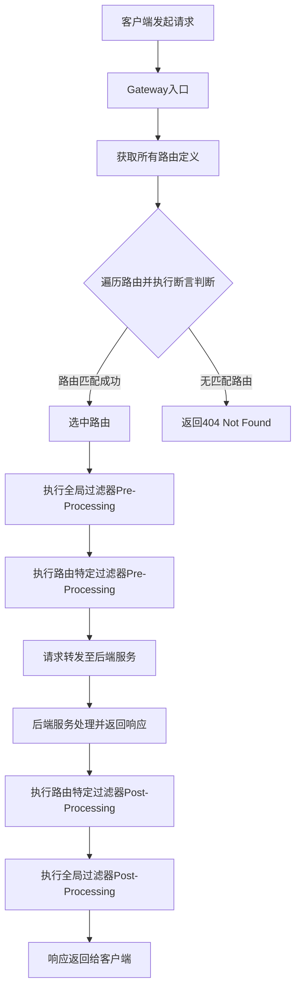

## 1. 新一代网关概述

### 1.1 什么是新一代网关

新一代网关是在微服务架构下，用于统一管理、路由和处理所有进入系统的外部请求的组件。它不再仅仅是一个简单的反向代理，而是集成了多种高级功能，以满足现代分布式系统的复杂需求。Spring Cloud Gateway 是其中的典型代表，它是 Spring Cloud 生态系统中用于构建 API 网关的强大且灵活的解决方案。

### 1.2 架构定位与作用

在微服务体系中，网关处于客户端请求与后端微服务之间的最前沿，是系统的统一入口。它作为基础设施层的一部分，具有以下核心作用：

- **统一入口**：客户端只需与网关通信，无需了解后端服务的具体地址
- **负载均衡**：将请求分发到多个服务实例上，实现负载均衡
- **安全与认证**：在网关层集中处理认证和授权，减轻后端服务负担
- **监控与可观测性**：统一收集监控数据，便于系统运维
- **流量管理**：实现限流、熔断、灰度发布等复杂的流量控制策略

### 1.3 核心功能特性

#### 1.3.1 流量控制（Flow Control）

Spring Cloud Gateway 可以集成 Sentinel 等流量控制组件，实现对请求流量的细粒度控制。支持基于 Route（路由 ID）维度或 Custom API 维度进行限流，防止后端服务因过载而崩溃。

#### 1.3.2 熔断机制（Circuit Breaker）

网关能够实现服务熔断机制，当后端某个服务出现故障或响应过慢时，网关可以暂时切断对该服务的请求，避免雪崩效应，保护整个系统的稳定性。

#### 1.3.3 日志监控（Logging & Monitoring）

作为所有请求的入口，网关是进行日志记录和监控的理想位置。支持以下可观测性指标：

- **Metrics**：收集请求数、QPS、响应码、P99/P999 等性能指标
- **Trace**：实现全链路追踪，将网关层的请求与后续微服务的调用链串联
- **Logging**：记录访问日志、请求日志和远程调用日志

#### 1.3.4 集中式鉴权

Spring Cloud Gateway 支持集中式鉴权，可以根据请求来源和路径对服务接口进行访问控制，实现细粒度的黑名单或白名单控制。

## 2. Spring Cloud Gateway 三大核心组件

Spring Cloud Gateway 的核心功能围绕着三大基本概念构建：**路由（Route）**、**断言（Predicate）** 和 **过滤器（Filter）**。

### 2.1 路由（Route）

**路由是构建网关的基本模块**，每个路由都包含以下要素：

- **唯一 ID**：路由的唯一标识符
- **目标 URI**：请求转发的目标地址
- **断言集合**：一系列用于匹配请求的条件
- **过滤器集合**：对请求和响应进行处理的组件

当一个请求到达网关时，网关会评估所有的路由。如果请求满足某个路由定义中的所有断言条件，则该路由被匹配，网关将根据该路由的配置将请求转发到目标 URI。

### 2.2 断言（Predicate）

断言是判断一个 HTTP 请求是否符合某个路由规则的条件。Spring Cloud Gateway 的断言设计灵感来源于 Java 8 的 `java.util.function.Predicate` 函数式接口。

开发人员可以通过断言，基于 HTTP 请求的任何内容来定义匹配规则，包括：

- 请求头（Headers）
- 请求参数（Query Parameters）
- 请求路径（Path）
- 请求方法（Method）
- 时间条件（Time-based）
- Cookie 信息
- 主机信息（Host）

### 2.3 过滤器（Filter）

过滤器是 Spring 框架中 `GatewayFilter` 的实例，允许在请求被路由之前或之后对请求或响应进行修改。过滤器提供了强大的横切能力：

- **Pre-Filter（请求前处理）**：在请求被路由到目标服务之前执行

  - 请求参数校验
  - 添加/修改请求头
  - 鉴权逻辑
  - 日志记录

- **Post-Filter（响应后处理）**：在目标服务返回响应之后执行
  - 修改响应头
  - 统一响应格式
  - 异常处理
  - 指标收集

## 3. 工作流程详解

### 3.1 核心工作流程

Spring Cloud Gateway 的工作流程可以概括为以下几个关键阶段：

1. **请求接收**：客户端发起 HTTP 请求到 Gateway
2. **路由匹配**：通过 RoutePredicateHandlerMapping 匹配路由
3. **断言评估**：执行路由中定义的所有断言
4. **过滤器链执行**：按顺序执行全局过滤器和路由过滤器
5. **请求转发**：将请求转发到目标服务
6. **响应处理**：处理服务响应并返回客户端

### 3.2 工作流程图



## 4. 项目配置与快速上手

### 4.1 Maven 依赖配置

```xml
<dependencies>
    <!-- Spring Cloud Gateway -->
    <dependency>
        <groupId>org.springframework.cloud</groupId>
        <artifactId>spring-cloud-starter-gateway</artifactId>
    </dependency>

    <!-- 服务注册发现 -->
    <dependency>
        <groupId>org.springframework.cloud</groupId>
        <artifactId>spring-cloud-starter-consul-discovery</artifactId>
    </dependency>

    <!-- 健康检查监控 -->
    <dependency>
        <groupId>org.springframework.boot</groupId>
        <artifactId>spring-boot-starter-actuator</artifactId>
    </dependency>

    <!-- 负载均衡 -->
    <dependency>
        <groupId>org.springframework.cloud</groupId>
        <artifactId>spring-cloud-starter-loadbalancer</artifactId>
    </dependency>
</dependencies>
```

### 4.2 基础配置示例

```yaml
server:
  port: 9527

spring:
  application:
    name: cloud-gateway
  cloud:
    consul:
      host: localhost
      port: 8500
      discovery:
        service-name: ${spring.application.name}
    gateway:
      discovery:
        locator:
          enabled: true # 开启服务发现
          lower-case-service-id: true # 服务名小写
      routes:
        - id: order_route
          uri: lb://order-service
          predicates:
            - Path=/api/order/**
          filters:
            - StripPrefix=1

        - id: user_route
          uri: lb://user-service
          predicates:
            - Path=/api/user/**
          filters:
            - StripPrefix=1
```

### 4.3 动态路由配置

使用 `lb://` 前缀可以启用基于服务发现的动态路由：

```yaml
spring:
  cloud:
    gateway:
      routes:
        - id: dynamic_route
          uri: lb://service-name # 自动从注册中心获取服务实例
          predicates:
            - Path=/api/**
```

## 5. 内置断言详解

Spring Cloud Gateway 提供了丰富的内置断言工厂，满足大多数路由匹配需求。

### 5.1 路径断言（Path Predicate）

```yaml
predicates:
  - Path=/api/order/{orderId}
  - Path=/api/user/**
```

### 5.2 时间断言（Time-based Predicates）

```yaml
predicates:
  # 在指定时间之后
  - After=2025-07-20T12:00:00.000+08:00[Asia/Shanghai]
  # 在指定时间之前
  - Before=2025-07-25T12:00:00.000+08:00[Asia/Shanghai]
  # 在指定时间范围内
  - Between=2025-07-20T12:00:00.000+08:00[Asia/Shanghai],2025-07-25T12:00:00.000+08:00[Asia/Shanghai]
```

### 5.3 请求头断言（Header Predicate）

```yaml
predicates:
  - Header=X-Request-Id, \d+
  - Header=Authorization, Bearer.*
```

### 5.4 请求方法断言（Method Predicate）

```yaml
predicates:
  - Method=GET,POST
```

### 5.5 查询参数断言（Query Predicate）

```yaml
predicates:
  - Query=version, 2
  - Query=debug
```

### 5.6 主机断言（Host Predicate）

```yaml
predicates:
  - Host=**.example.com
  - Host=api.example.com
```

### 5.7 Cookie 断言（Cookie Predicate）

```yaml
predicates:
  - Cookie=sessionId, [a-zA-Z0-9]+
```

### 5.8 远程地址断言（RemoteAddr Predicate）

```yaml
predicates:
  - RemoteAddr=192.168.1.1/24
```

## 6. 自定义断言开发

### 6.1 自定义断言的应用场景

在某些业务场景下，内置断言无法满足复杂的路由匹配需求，此时需要开发自定义断言：

- 基于用户等级的路由分发
- 基于请求内容的智能路由
- 集成外部系统的动态路由决策
- 复杂的业务逻辑判断

### 6.2 自定义断言实现步骤

#### 6.2.1 创建断言工厂类

```java
@Component
public class UserTypeRoutePredicateFactory extends AbstractRoutePredicateFactory<UserTypeRoutePredicateFactory.Config> {

    public UserTypeRoutePredicateFactory() {
        super(Config.class);
    }

    @Override
    public Predicate<ServerWebExchange> apply(Config config) {
        return exchange -> {
            String userType = exchange.getRequest().getQueryParams().getFirst("userType");

            if (userType == null) {
                return false;
            }

            return config.getUserType().equals(userType);
        };
    }

    @Override
    public List<String> shortcutFieldOrder() {
        return Arrays.asList("userType");
    }

    @Validated
    public static class Config {
        @NotEmpty
        private String userType;

        public String getUserType() {
            return userType;
        }

        public void setUserType(String userType) {
            this.userType = userType;
        }
    }
}
```

#### 6.2.2 配置使用

```yaml
spring:
  cloud:
    gateway:
      routes:
        - id: vip_user_route
          uri: lb://vip-service
          predicates:
            - Path=/api/**
            - UserType=diamond
```

### 6.3 高级自定义断言示例

#### 6.3.1 基于时间段的业务断言

```java
@Component
public class BusinessHourRoutePredicateFactory extends AbstractRoutePredicateFactory<BusinessHourRoutePredicateFactory.Config> {

    public BusinessHourRoutePredicateFactory() {
        super(Config.class);
    }

    @Override
    public Predicate<ServerWebExchange> apply(Config config) {
        return exchange -> {
            LocalTime now = LocalTime.now();
            LocalTime startTime = LocalTime.parse(config.getStartTime());
            LocalTime endTime = LocalTime.parse(config.getEndTime());

            return now.isAfter(startTime) && now.isBefore(endTime);
        };
    }

    @Override
    public List<String> shortcutFieldOrder() {
        return Arrays.asList("startTime", "endTime");
    }

    public static class Config {
        private String startTime;
        private String endTime;

        // getters and setters
    }
}
```

## 7. 过滤器深度解析

### 7.1 过滤器分类

Spring Cloud Gateway 的过滤器分为两大类：

#### 7.1.1 全局过滤器（Global Filters）

- 应用于所有路由
- 实现 `GlobalFilter` 接口
- 通过 `@Order` 注解或 `Ordered` 接口控制执行顺序

#### 7.1.2 路由过滤器（Gateway Filters）

- 特定于某个路由
- 在路由配置中通过 `filters` 属性指定
- 通过 `GatewayFilterFactory` 创建

### 7.2 内置过滤器详解

#### 7.2.1 路径操作过滤器

```yaml
filters:
  # 移除路径前缀
  - StripPrefix=1
  # 添加路径前缀
  - PrefixPath=/api
  # 路径重写
  - RewritePath=/api/(?<segment>.*), /$\{segment}
```

#### 7.2.2 请求头操作过滤器

```yaml
filters:
  # 添加请求头
  - AddRequestHeader=X-Request-Source, gateway
  # 移除请求头
  - RemoveRequestHeader=X-Internal-Header
  # 设置请求头
  - SetRequestHeader=X-Request-Time, #{T(java.time.LocalDateTime).now()}
```

#### 7.2.3 响应头操作过滤器

```yaml
filters:
  # 添加响应头
  - AddResponseHeader=X-Response-Source, gateway
  # 移除响应头
  - RemoveResponseHeader=X-Internal-Response
  # 设置响应头
  - SetResponseHeader=X-Response-Time, #{T(java.time.LocalDateTime).now()}
```

#### 7.2.4 限流过滤器

```yaml
filters:
  # Redis限流
  - name: RequestRateLimiter
    args:
      redis-rate-limiter.replenish-rate: 10
      redis-rate-limiter.burst-capacity: 20
      key-resolver: "#{@pathKeyResolver}"
```

#### 7.2.5 重试过滤器

```yaml
filters:
  - name: Retry
    args:
      retries: 3
      statuses: BAD_GATEWAY,BAD_REQUEST
      methods: GET,POST
```

#### 7.2.6 熔断过滤器

```yaml
filters:
  - name: CircuitBreaker
    args:
      name: myCircuitBreaker
      fallbackUri: forward:/fallback
```

## 8. 自定义过滤器开发

### 8.1 全局过滤器开发

#### 8.1.1 基础全局过滤器

```java
@Component
@Order(1)
public class AuthenticationGlobalFilter implements GlobalFilter {

    @Override
    public Mono<Void> filter(ServerWebExchange exchange, GatewayFilterChain chain) {
        ServerHttpRequest request = exchange.getRequest();
        ServerHttpResponse response = exchange.getResponse();

        // 获取请求头中的token
        String token = request.getHeaders().getFirst("Authorization");

        if (token == null || !token.startsWith("Bearer ")) {
            response.setStatusCode(HttpStatus.UNAUTHORIZED);
            return response.setComplete();
        }

        // 验证token逻辑
        if (!validateToken(token)) {
            response.setStatusCode(HttpStatus.UNAUTHORIZED);
            return response.setComplete();
        }

        // 添加用户信息到请求头
        ServerHttpRequest modifiedRequest = request.mutate()
            .header("X-User-Id", getUserIdFromToken(token))
            .build();

        return chain.filter(exchange.mutate().request(modifiedRequest).build());
    }

    private boolean validateToken(String token) {
        // 实现token验证逻辑
        return true;
    }

    private String getUserIdFromToken(String token) {
        // 从token中提取用户ID
        return "user123";
    }
}
```

#### 8.1.2 请求日志全局过滤器

```java
@Component
@Order(2)
@Slf4j
public class RequestLoggingGlobalFilter implements GlobalFilter {

    @Override
    public Mono<Void> filter(ServerWebExchange exchange, GatewayFilterChain chain) {
        ServerHttpRequest request = exchange.getRequest();

        // 记录请求开始时间
        long startTime = System.currentTimeMillis();

        // 记录请求信息
        log.info("Request started: {} {} from {}",
            request.getMethod(),
            request.getURI(),
            request.getRemoteAddress());

        return chain.filter(exchange).doFinally(signalType -> {
            // 记录请求完成时间
            long endTime = System.currentTimeMillis();
            log.info("Request completed: {} {} in {}ms",
                request.getMethod(),
                request.getURI(),
                endTime - startTime);
        });
    }
}
```

### 8.2 路由过滤器开发

#### 8.2.1 自定义路由过滤器工厂

```java
@Component
public class CustomRequestFilterFactory extends AbstractGatewayFilterFactory<CustomRequestFilterFactory.Config> {

    public CustomRequestFilterFactory() {
        super(Config.class);
    }

    @Override
    public GatewayFilter apply(Config config) {
        return (exchange, chain) -> {
            ServerHttpRequest request = exchange.getRequest();

            // 在这里实现自定义逻辑
            if (config.isEnabled()) {
                // 添加自定义请求头
                ServerHttpRequest modifiedRequest = request.mutate()
                    .header("X-Custom-Header", config.getHeaderValue())
                    .build();

                return chain.filter(exchange.mutate().request(modifiedRequest).build());
            }

            return chain.filter(exchange);
        };
    }

    @Override
    public List<String> shortcutFieldOrder() {
        return Arrays.asList("enabled", "headerValue");
    }

    public static class Config {
        private boolean enabled = true;
        private String headerValue = "default";

        // getters and setters
        public boolean isEnabled() {
            return enabled;
        }

        public void setEnabled(boolean enabled) {
            this.enabled = enabled;
        }

        public String getHeaderValue() {
            return headerValue;
        }

        public void setHeaderValue(String headerValue) {
            this.headerValue = headerValue;
        }
    }
}
```

#### 8.2.2 使用自定义路由过滤器

```yaml
spring:
  cloud:
    gateway:
      routes:
        - id: custom_filter_route
          uri: lb://backend-service
          predicates:
            - Path=/api/**
          filters:
            - CustomRequest=true,custom-value
```

### 8.3 高级过滤器开发

#### 8.3.1 异步处理过滤器

```java
@Component
@Order(10)
public class AsyncProcessingGlobalFilter implements GlobalFilter {

    @Autowired
    private AsyncService asyncService;

    @Override
    public Mono<Void> filter(ServerWebExchange exchange, GatewayFilterChain chain) {
        return asyncService.processRequestAsync(exchange)
            .flatMap(result -> {
                // 基于异步处理结果修改请求
                ServerHttpRequest modifiedRequest = exchange.getRequest().mutate()
                    .header("X-Async-Result", result)
                    .build();

                return chain.filter(exchange.mutate().request(modifiedRequest).build());
            })
            .onErrorResume(throwable -> {
                // 异步处理失败的处理逻辑
                ServerHttpResponse response = exchange.getResponse();
                response.setStatusCode(HttpStatus.INTERNAL_SERVER_ERROR);
                return response.setComplete();
            });
    }
}
```

#### 8.3.2 缓存过滤器

```java
@Component
public class CacheGatewayFilterFactory extends AbstractGatewayFilterFactory<CacheGatewayFilterFactory.Config> {

    @Autowired
    private RedisTemplate<String, Object> redisTemplate;

    public CacheGatewayFilterFactory() {
        super(Config.class);
    }

    @Override
    public GatewayFilter apply(Config config) {
        return (exchange, chain) -> {
            ServerHttpRequest request = exchange.getRequest();
            String cacheKey = generateCacheKey(request);

            // 尝试从缓存获取响应
            Object cachedResponse = redisTemplate.opsForValue().get(cacheKey);
            if (cachedResponse != null) {
                // 返回缓存的响应
                return writeResponse(exchange, cachedResponse);
            }

            // 如果缓存不存在，继续处理并缓存结果
            return chain.filter(exchange).doOnNext(result -> {
                // 缓存响应结果
                redisTemplate.opsForValue().set(cacheKey, result, Duration.ofMinutes(config.getTtl()));
            });
        };
    }

    private String generateCacheKey(ServerHttpRequest request) {
        return "cache:" + request.getURI().toString();
    }

    private Mono<Void> writeResponse(ServerWebExchange exchange, Object cachedResponse) {
        ServerHttpResponse response = exchange.getResponse();
        DataBuffer buffer = response.bufferFactory().wrap(cachedResponse.toString().getBytes());
        return response.writeWith(Mono.just(buffer));
    }

    public static class Config {
        private int ttl = 5; // 缓存时间（分钟）

        public int getTtl() {
            return ttl;
        }

        public void setTtl(int ttl) {
            this.ttl = ttl;
        }
    }
}
```

## 9. 高级特性与最佳实践

### 9.1 服务发现与负载均衡

#### 9.1.1 与 Consul 集成

```yaml
spring:
  cloud:
    consul:
      host: localhost
      port: 8500
      discovery:
        service-name: ${spring.application.name}
        health-check-interval: 30s
        health-check-timeout: 10s
        health-check-critical-timeout: 3m
    gateway:
      discovery:
        locator:
          enabled: true
          lower-case-service-id: true
```

#### 9.1.2 自定义负载均衡策略

```java
@Configuration
public class LoadBalancerConfiguration {

    @Bean
    @LoadBalanced
    public RestTemplate restTemplate() {
        return new RestTemplate();
    }

    @Bean
    public ReactorLoadBalancer<ServiceInstance> customLoadBalancer(Environment environment,
                                                                 LoadBalancerClientFactory loadBalancerClientFactory) {
        String name = environment.getProperty(LoadBalancerClientFactory.PROPERTY_NAME);
        return new CustomLoadBalancer(loadBalancerClientFactory.getLazyProvider(name, ServiceInstanceListSupplier.class), name);
    }
}
```

### 9.2 监控与可观测性

#### 9.2.1 Actuator 端点配置

```yaml
management:
  endpoints:
    web:
      exposure:
        include: health,info,gateway
  endpoint:
    health:
      show-details: always
    gateway:
      enabled: true
```

#### 9.2.2 自定义监控指标

```java
@Component
public class MetricsGlobalFilter implements GlobalFilter {

    private final MeterRegistry meterRegistry;
    private final Counter requestCounter;
    private final Timer requestTimer;

    public MetricsGlobalFilter(MeterRegistry meterRegistry) {
        this.meterRegistry = meterRegistry;
        this.requestCounter = Counter.builder("gateway.requests.total")
            .description("Total number of requests")
            .register(meterRegistry);
        this.requestTimer = Timer.builder("gateway.requests.duration")
            .description("Request duration")
            .register(meterRegistry);
    }

    @Override
    public Mono<Void> filter(ServerWebExchange exchange, GatewayFilterChain chain) {
        return Timer.Sample.start(meterRegistry)
            .stop(requestTimer)
            .then(chain.filter(exchange))
            .doOnSuccess(result -> requestCounter.increment())
            .doOnError(error -> requestCounter.increment("error", error.getClass().getSimpleName()));
    }
}
```

### 9.3 安全配置

#### 9.3.1 CORS 配置

```yaml
spring:
  cloud:
    gateway:
      globalcors:
        cors-configurations:
          "[/**]":
            allowed-origins: "*"
            allowed-methods: "*"
            allowed-headers: "*"
            allow-credentials: true
```

#### 9.3.2 安全过滤器

```java
@Component
public class SecurityGlobalFilter implements GlobalFilter {

    @Override
    public Mono<Void> filter(ServerWebExchange exchange, GatewayFilterChain chain) {
        ServerHttpRequest request = exchange.getRequest();
        String path = request.getURI().getPath();

        // 白名单路径
        if (isWhitelistedPath(path)) {
            return chain.filter(exchange);
        }

        // 检查认证
        String token = request.getHeaders().getFirst("Authorization");
        if (!isValidToken(token)) {
            return unauthorizedResponse(exchange);
        }

        return chain.filter(exchange);
    }

    private boolean isWhitelistedPath(String path) {
        return path.startsWith("/actuator/") || path.equals("/health");
    }

    private boolean isValidToken(String token) {
        // 实现token验证逻辑
        return token != null && token.startsWith("Bearer ");
    }

    private Mono<Void> unauthorizedResponse(ServerWebExchange exchange) {
        ServerHttpResponse response = exchange.getResponse();
        response.setStatusCode(HttpStatus.UNAUTHORIZED);
        return response.setComplete();
    }
}
```

### 9.4 性能优化

#### 9.4.1 连接池配置

```yaml
spring:
  cloud:
    gateway:
      httpclient:
        pool:
          max-connections: 1000
          max-idle-time: 30s
          max-life-time: 60s
        connect-timeout: 5000
        response-timeout: 10s
```

#### 9.4.2 内存配置

```yaml
server:
  netty:
    initial-buffer-size: 65536
    max-initial-line-length: 8192
    max-header-size: 8192
```

## 10. 故障排查与调试

### 10.1 常见问题与解决方案

#### 10.1.1 路由不匹配问题

**问题现象**：请求返回 404，路由配置看起来正确

**排查步骤**：

1. 检查断言配置是否正确
2. 确认服务是否已注册到注册中心
3. 使用 actuator 端点检查路由状态

```bash
# 查看所有路由
curl http://localhost:9527/actuator/gateway/routes

# 查看特定路由
curl http://localhost:9527/actuator/gateway/routes/{route_id}
```

#### 10.1.2 过滤器执行顺序问题

**问题现象**：过滤器没有按预期顺序执行

**解决方案**：

```java
@Component
@Order(1) // 数字越小，优先级越高
public class HighPriorityFilter implements GlobalFilter {
    // 实现逻辑
}
```

### 10.2 日志配置

```yaml
logging:
  level:
    org.springframework.cloud.gateway: DEBUG
    org.springframework.cloud.gateway.route.Route
```
