# Java 并发深度聚合快照：JUC、CAS、原子类、锁与线程机制

本文件为聚合证据快照（immutable raw），按 LLM-Wiki 规范原样收录多篇来源原文，不改动正文，仅增加 provenance 头部与分隔。后续 wiki 页通过 `sources: ["{slug}"]` 引用本快照。

- raw slug: `ingest-java-concurrency`
- 对应 wiki: `java-concurrency-deepdive`
- Personal-markdown-notes 固定提交: `bbb2126`（`https://github.com/DavidHLP/Personal-markdown-notes/tree/bbb21260029584d41d1c667f88c5c8e2b761aad9`）
- Fuwari 固定提交: `07cee2b`（`https://github.com/DavidHLP/Fuwari/tree/07cee2baf9cee227807dcd68004c5f2493e5ac52`）
- 捕获方式: `gh repo clone --depth 1` 后按路径分组，原样拼接，空文件与完全重复文件已标注但未删改内容

## 来源清单

| 序号 | 仓库 | 相对路径 | 大小 | 去重标注 |
| --- | --- | --- | --- | --- |
| 1 | Fuwari | `JUC/CASDeepDive.md` | 40983 |  |
| 2 | Fuwari | `JUC/CompletableFutureAction.md` | 7357 |  |
| 3 | Fuwari | `JUC/FutureTaskAction.md` | 7902 |  |
| 4 | Fuwari | `JUC/JavaAtomicClasses.md` | 19408 |  |
| 5 | Fuwari | `JUC/JavaDeadlockdiagnosis.md` | 13276 |  |
| 6 | Fuwari | `JUC/JavaInterruptMechanism.md` | 10609 |  |
| 7 | Fuwari | `JUC/LockSupport.md` | 14120 |  |
| 8 | Fuwari | `JUC/LongAdderVSAtomicLong.md` | 11228 |  |
| 9 | Fuwari | `JUC/Monitor.md` | 8708 |  |
| 10 | Fuwari | `JUC/Reentrancy.md` | 8015 |  |
| 11 | Fuwari | `JUC/ReentrantLock.md` | 6871 |  |
| 12 | Fuwari | `JUC/ThreadLocal.md` | 28632 |  |
| 13 | Fuwari | `JUC/synchronized.md` | 8071 |  |
| 14 | Fuwari | `Java/JDK17DetailedExplanationofJavaReferenceTypes.md` | 24331 |  |
| 15 | Fuwari | `Java/JDK8DetailedExplanationofJavaReferenceTypes.md` | 22957 |  |

## 免责与边界

- 黑马课程、实战 156KB、Feed 流等笔记含课程截图、本地路径、未验证配置，未作可复现实验复核，仅作证据保存。
- Fuwari 部分文章含零宽度字符（如 `OptimisticvsPessimisticLocking​.md` 路径含 `\u200b`），已按原样保留文件名。
- 个人笔记中的 `redis/业务/事务的作用域.md` 为空文件（仅 1 字节换行），已保留记录。
- 本快照不改写任何原文；冲突或过时结论由 wiki 层显式标注。

---

## 来源 1: Fuwari / `JUC/CASDeepDive.md`

- 原始 URL: <https://github.com/DavidHLP/Fuwari/blob/07cee2baf9cee227807dcd68004c5f2493e5ac52/src/content/posts/JUC/CASDeepDive.md>
- 本地路径: `JUC/CASDeepDive.md`

```markdown
---
title: 深入理解Java CAS：从原理到实践
published: 2025-07-01
description: 本文从Java资深开发者的视角，深入探讨了CAS（Compare-And-Swap）的原理、Unsafe类的使用、原子类、自旋锁实现、ABA问题及其解决方案AtomicStampedReference，旨在为高级开发者提供一份详尽的CAS学习指南。
tags: [Java, JUC, CAS, Concurrency]
category: JUC
draft: false
---

在并发编程中，确保数据一致性是一项关键挑战。虽然传统的锁机制（如 `synchronized` 或 `Lock`）提供了一种直接的解决方案，但它们本质上是悲观的，在高并发场景下，因线程阻塞和上下文切换而导致的性能开销不容忽视。

本文将深入探讨"比较并交换"（Compare-And-Swap, CAS），这是一种乐观的、非阻塞的算法，它构成了 Java `java.util.concurrent.atomic` 包中许多类的核心基础。

## 1. CAS 原理介绍

CAS（Compare-And-Swap）是一条 CPU 并发原语，其操作过程是原子的。它的功能是：检查内存中某个位置的值是否与预期值相等，如果相等，则将其更新为新值。

该操作涉及三个核心操作数：

1.  **V**：要更新的变量的内存地址。
2.  **A**：预期的旧值 (Expected Value)。
3.  **B**：计划更新的新值 (New Value)。

CAS 的执行逻辑可以概括为：仅当内存地址 V 处的值等于预期值 A 时，才将该位置的值更新为 B。否则，不执行任何操作。无论更新成功与否，操作都会返回 V 位置的当前值。这个"比较并更新"的过程由硬件直接支持（例如 x86 架构的 `cmpxchg` 指令），确保了其在多处理器环境下的原子性。

以下伪代码可以帮助理解其逻辑：

```java
// V: 内存值, A: 预期值, B: 新值
public boolean compareAndSwap(V, A, B) {
    // 这是一个原子操作
    if (V == A) {
        V = B;
        return true;
    } else {
        return false;
    }
}
```

作为一种乐观的非阻塞算法，CAS 允许线程在操作共享变量时无需挂起。如果操作失败，线程会收到通知，并可以基于此决定后续策略，通常是采用自旋（循环重试）方式，直至成功。

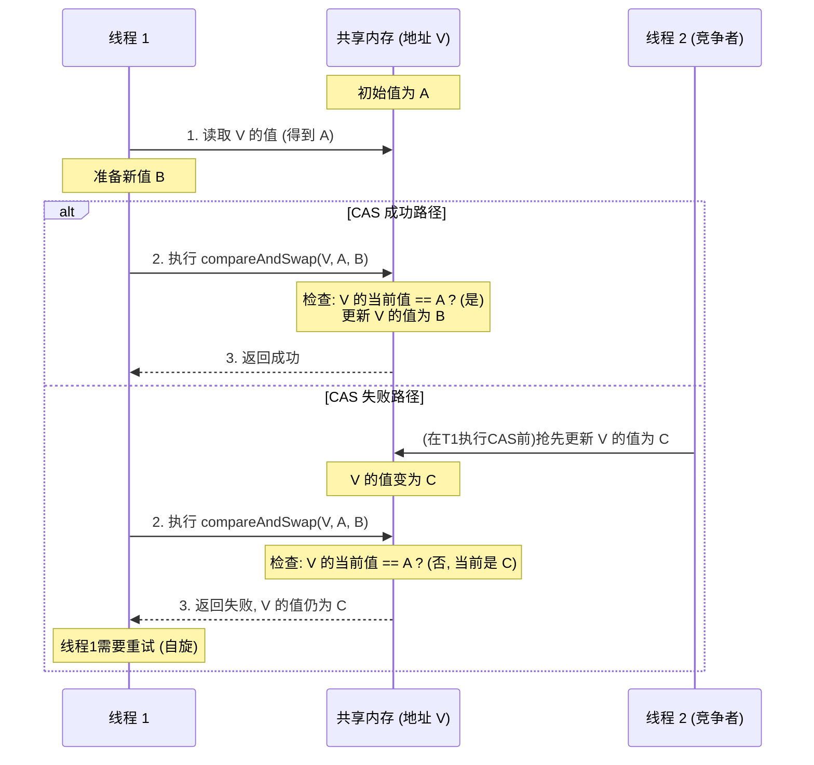

## 2. Unsafe 类详解

要理解 Java 中的 CAS，就必须分析 `sun.misc.Unsafe` 这个类。尽管它不属于标准的 Java API，但它是许多高性能并发框架（包括 JUC 原子类）的基石。

`Unsafe` 提供了硬件级别的原子操作，允许 Java 代码直接对内存进行操作。正是由于其"不安全"的特性，JDK 并不建议开发者直接使用。

### 获取 `Unsafe` 实例

`Unsafe` 的构造函数是私有的，且 `getUnsafe()` 方法会对调用者的类加载器进行检查，因此无法直接实例化。然而，可以通过反射机制获取其实例：

```java
import sun.misc.Unsafe;
import java.lang.reflect.Field;

public class UnsafeAccessor {

    private static final Unsafe unsafe;

    static {
        try {
            Field theUnsafe = Unsafe.class.getDeclaredField("theUnsafe");
            theUnsafe.setAccessible(true);
            unsafe = (Unsafe) theUnsafe.get(null);
        } catch (NoSuchFieldException | IllegalAccessException e) {
            throw new Error("Failed to get unsafe instance", e);
        }
    }

    public static Unsafe getUnsafe() {
        return unsafe;
    }
}
```

### `Unsafe` 中的 CAS 方法

`Unsafe` 提供了针对不同数据类型的 `compareAndSwap*` 方法：

- `compareAndSwapObject(Object o, long offset, Object expected, Object x)`: 针对对象引用的 CAS。
- `compareAndSwapInt(Object o, long offset, int expected, int x)`: 针对 `int` 类型字段的 CAS。
- `compareAndSwapLong(Object o, long offset, long expected, long x)`: 针对 `long` 类型字段的 CAS。

参数 `offset` 指的是字段在对象内存布局中的偏移量，可以通过 `objectFieldOffset(Field f)` 方法获得。

### Unsafe CAS 的三层实现深度剖析

Java 中的一个 CAS 操作，看似简单，实则经历了从 Java 层到 JVM C++ 层，最终到硬件汇编指令的层层递进。下面我们就来逐层拆解这个过程。

#### 第一层：Java - `AtomicInteger` 的视角

我们常用的 `AtomicInteger` 类是理解 CAS 应用的最佳入口。它的核心方法 `compareAndSet` 就是对 `Unsafe` 的一层薄封装。

```java
// AtomicInteger.java (JDK 源码)
public class AtomicInteger extends Number implements java.io.Serializable {
    private static final Unsafe unsafe = Unsafe.getUnsafe();
    private static final long valueOffset;

    static {
        try {
            // 获取'value'字段在AtomicInteger对象内存布局中的偏移量
            valueOffset = unsafe.objectFieldOffset
                (AtomicInteger.class.getDeclaredField("value"));
        } catch (Exception ex) { throw new Error(ex); }
    }

    private volatile int value;

    public final boolean compareAndSet(int expect, int update) {
        // 直接调用Unsafe的CAS原生方法
        return unsafe.compareAndSetInt(this, valueOffset, expect, update);
    }
    // ... 其他方法
}
```

- `valueOffset`: 这是一个关键的静态常量。它通过 `unsafe.objectFieldOffset` 在类加载时被计算出来，代表 `value` 字段相对于 `AtomicInteger` 对象起始地址的内存偏移量。有了这个偏移量，`Unsafe` 就可以像 C/C++ 中的指针一样，精确定位到要操作的内存位置。
- `compareAndSet`: 此方法直接将参数透传给 `unsafe.compareAndSetInt`。`this` 参数告诉 Unsafe 要操作哪个对象，`valueOffset` 提供了字段的精确地址，`expect` 和 `update` 则是 CAS 的核心参数。

#### 第二层：C++ (HotSpot JVM) - JNI 与 Intrinsic

`Unsafe` 的方法大多是 `native` 的，这意味着它们的实现不在 Java 层，而在 JVM 的 C++ 源码中。这里存在两条路径：

1.  **JNI 调用 (慢速路径)**: 在解释执行模式或 JIT 未优化的场景下，Java 调用会通过 Java Native Interface (JNI) 进入到 HotSpot 的 C++ 世界。其调用链大致为：`Java_sun_misc_Unsafe_compareAndSwapInt` (位于 `hotspot/src/share/vm/prims/unsafe.cpp`) -> `Atomic::cmpxchg` (位于 `hotspot/src/share/vm/runtime/atomic.hpp`)。

2.  **JIT Intrinsic (快速路径)**: 这是性能的关键。对于 `Unsafe` 的 CAS 方法这类高频、关键的操作，HotSpot 的 JIT 编译器（特别是 C2）会将其识别为"内在函数 (Intrinsic)"。JIT 不会生成 JNI 调用代码，而是直接在编译后的代码中嵌入与平台相关的、高效的汇编指令。这完全消除了 JNI 的开销。相关定义可以在 `hotspot/src/share/vm/opto/library_call.cpp` 中找到。

下面这张图清晰地展示了这两条路径的分野：

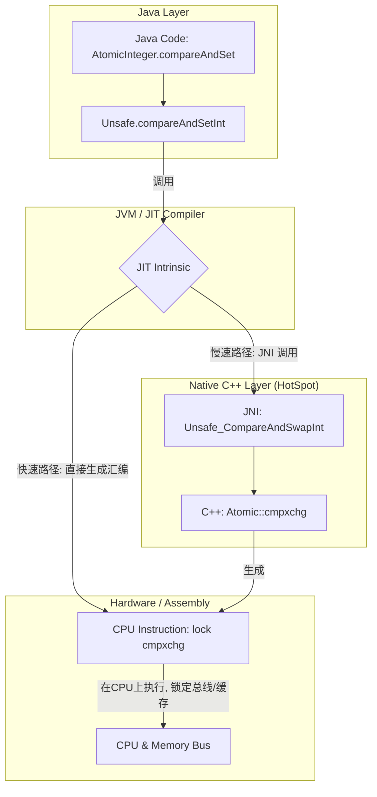

#### 第三层：汇编 - `lock cmpxchg` 原子指令

无论走哪条路径，最终在 x86/x64 架构的 CPU 上执行的都是一条核心汇编指令：`lock cmpxchg`。

- **`cmpxchg destination, source`**: 这条指令是"比较并交换"的核心。它隐式地使用 `EAX` 寄存器（或 `AX`/`AL`/`RAX`）作为"期望值"的载体。

  - **工作流程**: 1. 比较 `EAX` 寄存器中的值与 `destination` 内存地址中的值。 2. 如果相等（比较成功），则将 `source` 寄存器中的值写入 `destination` 内存地址，并设置 CPU 的零标志位（ZF=1）。 3. 如果不相等（比较失败），则将 `destination` 内存地址中的值加载到 `EAX` 寄存器，并清除零标志位（ZF=0）。
  - 这套机制与 Java CAS 的 `(V, A, B)` 三元组完美对应：`destination` 是 `V`，`EAX` 里的初始值是 `A`，`source` 是 `B`。

- **`lock` 前缀**: 这不是一条独立的指令，而是加在 `cmpxchg` 前面的一个前缀，用于保证操作的原子性。在多核时代，它的作用至关重要：
  - **保证原子性**: 它确保 `cmpxchg` 在执行期间，其他处理器不能访问这块内存。
  - **缓存锁定 (Cache Locking)**: 在现代 CPU 中，`lock` 通常不会锁定整个系统总线，而是实现更高效的"缓存锁定"。它会锁定包含目标内存地址的缓存行，在指令执行期间，其他核心可以继续访问其他内存地址，但不能访问被锁定的缓存行。只有当操作的内存跨越多个缓存行，或者该内存区域不支持缓存锁定时，才会降级为成本更高的总线锁定。
  - **内存屏障**: `lock` 前缀本身就是一个 full memory barrier（全功能内存屏障），它会清空和刷新处理器的写缓冲，并确保其后的读写操作不会被重排到 `lock` 操作之前，这保证了 `volatile` 语义的实现。

因此，Java 中一行简单的 `compareAndSet` 调用，其背后是 JIT 编译器、JVM C++ 实现和 CPU 硬件指令集层层协作的结果，最终由一条 `lock`-前缀的汇编指令，以极高的效率和安全性完成了这个原子操作。

**示例：**

下面是一个使用 `Unsafe` 实现原子计数器的例子：

```java
public class UnsafeCounter {
    private volatile int value = 0;
    private static final Unsafe unsafe = UnsafeAccessor.getUnsafe();
    private static final long valueOffset;

    static {
        try {
            valueOffset = unsafe.objectFieldOffset(UnsafeCounter.class.getDeclaredField("value"));
        } catch (NoSuchFieldException e) {
            throw new Error(e);
        }
    }

    public void increment() {
        int current;
        do {
            current = unsafe.getIntVolatile(this, valueOffset); // 获取当前值
        } while (!unsafe.compareAndSwapInt(this, valueOffset, current, current + 1)); // CAS更新
    }

    public int get() {
        return value;
    }
}
```

`increment` 方法通过一个 `do-while` 循环持续尝试更新 `value`。它首先获取当前值，然后通过 CAS 尝试将其加一。如果更新失败（意味着 `value` 已被其他线程修改），循环将继续，重新获取最新值并再次尝试，这便是典型的 CAS 自旋。

## 3. CAS 之 AtomicReference 深度剖析

直接使用 `Unsafe` 功能强大但过于底层且缺乏类型安全。为此，JDK 在 `java.util.concurrent.atomic` 包中提供了一系列高级抽象，其中 `AtomicReference` 是用于对引用类型进行原子操作的核心工具。

### 内部实现揭秘

与 `AtomicInteger` 类似，`AtomicReference` 本质上也是对 `Unsafe` 的一层安全、带泛型的封装。

```java
// AtomicReference.java (JDK 源码)
public class AtomicReference<V> implements java.io.Serializable {
    private static final Unsafe unsafe = Unsafe.getUnsafe();
    private static final long valueOffset;

    static {
        try {
            // 获取 'value' 字段在 AtomicReference 对象内存布局中的偏移量
            valueOffset = unsafe.objectFieldOffset
                (AtomicReference.class.getDeclaredField("value"));
        } catch (Exception ex) { throw new Error(ex); }
    }

    // 注意这里的 'volatile' 关键字！
    private volatile V value;

    public AtomicReference(V initialValue) {
        value = initialValue;
    }

    public final boolean compareAndSet(V expect, V update) {
        // 调用 Unsafe 的 compareAndSwapObject 方法
        return unsafe.compareAndSwapObject(this, valueOffset, expect, update);
    }
    // ...
}
```

从源码中，我们可以看到两个关键点：

1.  **`Unsafe.compareAndSwapObject`**: 所有的原子性保证都来自于底层 `Unsafe` 的 `compareAndSwapObject` (在 JDK 9 以后更名为 `compareAndSetObject`)。这与 `compareAndSetInt` 类似，最终都依赖于硬件的 `lock cmpxchg` 指令。
2.  **`volatile V value`**: 这是保证 **可见性** 的关键。`volatile` 关键字确保了对 `value` 字段的任何写操作都会立即被刷新到主内存，并且任何读操作都会从主内存中读取。这遵循 Java 内存模型（JMM）的 happens-before 原则，保证了一个线程对 `AtomicReference` 的修改对其他线程立即可见。**`volatile` 保证可见性，`Unsafe` (CAS) 保证原子性**，两者结合，才构成了 `AtomicReference` 完整的线程安全性。

### 核心用途：线程安全的延迟初始化

`AtomicReference` 的一个经典应用场景是实现线程安全的单例或昂贵资源的延迟初始化。相比于使用 `synchronized` 的双重检查锁定（DCL），使用 `AtomicReference` 的代码更简洁且优雅。

```java
public class ExpensiveResource {
    private ExpensiveResource() {
        // 模拟资源初始化耗时
        System.out.println("ExpensiveResource is being created...");
        try { Thread.sleep(1000); } catch (InterruptedException e) {}
    }

    // 使用 AtomicReference 来持有单例实例
    private static final AtomicReference<ExpensiveResource> instanceRef = new AtomicReference<>();

    public static ExpensiveResource getInstance() {
        // 先检查实例是否存在，大多数情况下这里的读操作无竞争，性能很高
        ExpensiveResource instance = instanceRef.get();
        if (instance == null) {
            // 实例不存在，才尝试创建并设置
            // 创建一个新的实例（这步操作在临界区之外，不影响其他线程）
            ExpensiveResource newInstance = new ExpensiveResource();
            // 使用 CAS 原子地设置引用，只有一个线程会成功
            if (instanceRef.compareAndSet(null, newInstance)) {
                // CAS 成功的线程，使用它自己创建的实例
                instance = newInstance;
            } else {
                // CAS 失败的线程，说明有其他线程已经抢先设置成功
                // 直接获取已设置好的实例即可
                instance = instanceRef.get();
            }
        }
        return instance;
    }
}
```

这个模式的优点在于，只有在实例未被创建时（`instance == null`）才会有多个线程进入同步逻辑，并且同步是通过无锁的 CAS 操作完成的，避免了 `synchronized` 可能带来的线程阻塞和上下文切换。一旦实例被创建，后续所有对 `getInstance()` 的调用都只会执行一次 `instanceRef.get()`，这是一个无锁、高性能的 `volatile` 读操作。

### 高级方法解析

除了 `compareAndSet`，`AtomicReference` 还提供了一些其他有用的原子方法：

- **`getAndSet(V newValue)`**: 原子地将引用设置为 `newValue`，并返回旧的值。这个操作可以看作一个 "先 get 再 set" 的原子捆绑。
- **`lazySet(V newValue)`**: 这是一个为极致性能优化而生的方法。它最终会将值设置为 `newValue`，但不保证该变更对其他线程的立即可见性。`lazySet` 只保证在本线程内，后续的读写操作不会被重排序到它前面，但它省略了昂贵的内存屏障指令，因此无法保证其他线程能多快看到这个更新。它适用于对数据可见性要求不那么严格，可以容忍短暂延迟的场景，例如更新统计数据、调试信息等，通过牺牲部分可见性来换取更高的吞吐量。

## 4. CAS 之手写自旋锁与深度解析

掌握了 CAS 的原理，我们便可以构建更复杂的同步原语，例如自旋锁。自旋锁是一种非阻塞锁，线程在获取锁失败时不会被挂起，而是在循环中持续尝试获取锁，即"自旋"。

该方法适用于锁占用时间短、竞争不激烈的场景，因为它避免了线程上下文切换的开销。

### 基础自旋锁实现

以下是一个基于 `AtomicReference` 实现的简单自旋锁：

```java
import java.util.concurrent.atomic.AtomicReference;

public class SpinLock {
    private final AtomicReference<Thread> owner = new AtomicReference<>();

    public void lock() {
        Thread currentThread = Thread.currentThread();
        // 当锁未被持有时（owner为null），尝试将owner设为当前线程
        // 若设置失败，则表示锁已被其他线程持有，继续自旋
        while (!owner.compareAndSet(null, currentThread)) {
            // 自旋等待
        }
    }

    public void unlock() {
        Thread currentThread = Thread.currentThread();
        // 仅持有锁的线程能够释放锁
        // 此处无需CAS，因为正常情况下只有持有者线程会调用unlock
        // 但为了严谨，防止非持有者错误调用，CAS会更安全
        owner.compareAndSet(currentThread, null);
    }
}
```

### 深度解析与改进

上面的基础实现虽然简洁，但在实际应用中存在一些关键问题：

1.  **不可重入 (Non-Reentrant)**: 这是最严重的问题。如果一个已经持有锁的线程再次尝试调用 `lock()` 方法，它会发现 `owner` 已经被设置为自己，`compareAndSet(null, currentThread)` 会永远失败，导致线程无限自旋，形成死锁。

2.  **CPU 消耗过高**: 在高竞争下，失败的线程会进入一个空的 `while` 循环（忙等待），这会持续占用 CPU 核心，造成性能浪费，甚至影响其他线程的执行。在 Java 9 之后，可以调用 `Thread.onSpinWait()` 来提示 JVM 该线程正在自旋，JVM 可能会进行一些优化（例如在 x86 平台上插入 `PAUSE` 指令）来降低功耗和提高性能。

3.  **公平性问题**: 这是一个非公平锁。等待锁的线程们相互竞争，任何线程都有可能在下一次循环中获得锁，这可能导致某些线程长时间等待，即"线程饥饿"。实现公平的自旋锁需要更复杂的机制（如排队）。

### 实现可重入的自旋锁

为了解决不可重入的问题，我们需要在锁中记录持有锁的线程以及该线程重入的次数。

```java
import java.util.concurrent.atomic.AtomicReference;

public class ReentrantSpinLock {
    private final AtomicReference<Thread> owner = new AtomicReference<>();
    private int recursionCount = 0;

    public void lock() {
        Thread currentThread = Thread.currentThread();
        // 如果锁的持有者是当前线程，则增加重入计数，然后直接返回
        if (owner.get() == currentThread) {
            recursionCount++;
            return;
        }

        // 循环尝试获取锁
        while (!owner.compareAndSet(null, currentThread)) {
            // 提示JVM，当前线程正在自旋等待，可能会有性能优化
            Thread.onSpinWait();
        }
        // 第一次获取锁，设置重入计数为1
        recursionCount = 1;
    }

    public void unlock() {
        Thread currentThread = Thread.currentThread();
        // 检查当前线程是否为锁的持有者
        if (owner.get() == currentThread) {
            recursionCount--;
            // 如果重入计数归零，则表示锁已完全释放，此时可以清空owner
            if (recursionCount == 0) {
                // 此处无需CAS，因为这是在锁的临界区内，只有持有者线程能访问
                owner.set(null);
            }
        } else {
            // 如果一个非持有者线程尝试解锁，可以考虑抛出异常，如IllegalMonitorStateException
            // throw new IllegalMonitorStateException("Calling thread is not the lock owner");
        }
    }
}
```

在这个改进版本中：

- `lock()` 方法首先检查当前线程是否已经是锁的持有者。如果是，则简单地增加 `recursionCount` 并返回，实现了锁的重入。
- `unlock()` 方法会递减计数器。只有当计数器减到 0 时，才表示最外层的锁被释放，此时才会真正将 `owner` 设置为 `null`，让其他线程有机会获取锁。
- 值得注意的是，对 `recursionCount` 的访问不需要额外的同步措施，因为对它的所有修改都发生在成功获取锁之后和释放锁之前的代码路径中，这块区域本身就是线程安全的临界区。

这个 `ReentrantSpinLock` 为我们展示了如何基于简单的 CAS 构建更复杂的并发原语，是深入理解并发控制的绝佳案例。

### 实现公平的自旋锁：Ticket Lock

前面提到的自旋锁都是非公平的，这意味着后来的线程有可能"插队"，先于等待已久的线程获得锁。为了实现公平性，我们可以借鉴银行排队叫号的思路，实现一种名为"Ticket Lock"的公平自旋锁。

**工作原理**：

1.  锁内部维护两个原子整型变量：`ticketNum` (票号分发器) 和 `serviceNum` (服务叫号器)。
2.  **获取锁 (lock)**：线程到来时，原子地将 `ticketNum` 加一，获得一个唯一的、递增的票号 (myTicket)。然后，它开始自旋，不断检查 `serviceNum` 的当前值是否等于自己的票号 `myTicket`。只有当轮到自己时，循环才会结束，表示获取锁成功。
3.  **释放锁 (unlock)**：持有锁的线程完成工作后，原子地将 `serviceNum` 加一。这相当于叫下一个号，从而唤醒正在等待那个票号的线程。

```java
import java.util.concurrent.atomic.AtomicInteger;

public class TicketLock {
    // 票号分发器
    private final AtomicInteger ticketNum = new AtomicInteger(0);
    // 服务叫号器
    private final AtomicInteger serviceNum = new AtomicInteger(0);

    public int lock() {
        // 原子地获取一个唯一的票号
        final int myTicket = ticketNum.getAndIncrement();

        // 当服务号不等于我的票号时，自旋等待
        while (serviceNum.get() != myTicket) {
            // 提示JVM，当前线程正在自旋
            Thread.onSpinWait();
        }

        // 返回我的票号，可以用于调试或记录
        return myTicket;
    }

    public void unlock(int myTicket) {
        // 只有当前持有锁的线程（即 serviceNum == myTicket 的线程）
        // 才能成功释放锁。这里简单地将服务号+1，让下一个线程获得锁。
        // 在更严格的实现中，可以要求传入票号进行验证。
        serviceNum.compareAndSet(myTicket, myTicket + 1);
    }
}
```

**公平性保证**：由于 `ticketNum` 是通过 `getAndIncrement` 原子递增的，每个线程都会获得一个唯一的、严格按到达顺序分配的票号。而 `serviceNum` 也是严格递增的，确保了服务（即锁的授予）是按照票号顺序进行的。这种先进先出 (FIFO) 的机制，从根本上保证了锁的公平性，杜绝了线程饥饿现象。

## 5. CAS 缺点深度剖析

尽管 CAS 功能强大且是无锁编程的基石，但它并非银弹。开发者必须深刻理解其固有的三大缺点，才能在实践中扬长避短。

### 1. ABA 问题：值的"貌合神离"

这是 CAS 最经典的问题。如果一个变量的值从 A 变为 B，再变回 A，CAS 在检查时会误认为该值没有发生变化，但实际上它已经被修改过。在多数情况下这无伤大雅，但在某些场景下，这会导致致命的错误。

**一个危险的实例：无锁栈**

想象一个无锁栈，其 `top` 节点通过 `AtomicReference` 维护。

1.  线程 T1 准备出栈。它读取当前 `top` 指向节点 A，并准备通过 CAS 将 `top` 指向 A 的下一个节点 `next(A)`。
2.  此时，线程 T2 介入。它连续执行了三次操作：
    a. 出栈，弹出节点 A。
    b. 出栈，弹出节点 `next(A)`。
    c. 入栈，将之前弹出的节点 A 重新入栈。
3.  现在，`top` 指针虽然再次指向了节点 A，但此 A 非彼 A。原来的栈结构是 `top -> A -> next(A) -> ...`，而现在的栈结构是 `top -> A -> (其他节点)`。`A` 的 `next` 指针已经丢失或改变。
4.  线程 T1 此时恢复执行。它的 CAS 操作 `compareAndSet(A, next(A))` 检查发现 `top` 仍然是 A，于是操作成功。但它设置的新 `top` 值 `next(A)` 已经是一个过时的、不再属于当前栈的"幽灵节点"，导致栈的链表结构被破坏。

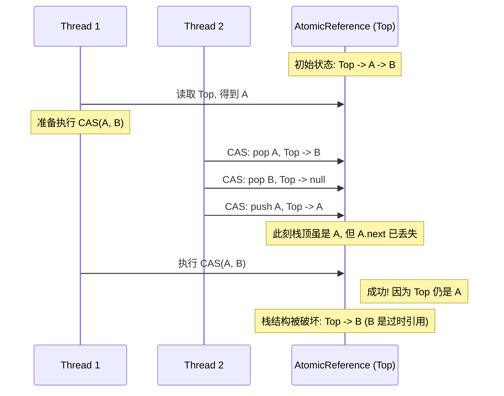

**解决方案**：`AtomicStampedReference`，通过版本号来确保引用的"新鲜度"。

### 2. 自旋开销：CPU 的空转地狱

如果 CAS 操作长时间不成功，自旋的线程会持续处于"忙等待"状态，这会给 CPU 带来巨大的执行开销。

- **机制**：一个在 `while(!cas(...))` 中空转的线程，会一直占用一个 CPU 核心的时间片，满负荷运转，执行无用的重复比较。这不像 `synchronized` 那样会让线程进入阻塞状态并让出 CPU。
- **影响**：在高竞争下，大量线程空转会急剧消耗 CPU 资源，导致系统整体性能下降，甚至"饿死"其他需要 CPU 的工作线程。

**缓解策略**:

- **自适应自旋 (JVM 优化)**：HotSpot JVM 足够智能，它会根据历史信息动态调整自旋。如果一个锁上的自旋经常成功，JVM 会认为它值得等待，并允许更长时间的自旋。反之，如果自旋经常失败，JVM 会缩短自旋时间甚至直接进入阻塞。
- **自旋等待提示 (`Thread.onSpinWait`)**: Java 9 引入的这个方法，底层会调用 CPU 的 `PAUSE` 指令（在 x86/x64 上）。`PAUSE` 指令不会让出 CPU，但它会告诉 CPU 这是一个自旋循环，CPU 会优化功耗，并避免因推测执行失败而带来的性能惩罚，这反而能让线程更快地检测到锁的释放。
- **有限次自旋与挂起**: 在自定义的锁实现中，可以设置一个自旋次数阈值，超过该阈值后就不再自旋，而是通过 `LockSupport.park()` 将线程挂起，等待被持有者 `unpark` 唤醒。`ReentrantLock` 的公平锁实现就采用了类似的策略。

### 3. 原子性粒度：仅限单一变量

CAS 操作的原子性保证仅限于**单个共享变量**。如果你需要原子地修改多个变量，一次 CAS 是无能为力的。

**例如**: 你想原子地更新一个表示用户状态的两个字段：`level` 和 `score`。

```java
// 错误示例：这不是原子操作
if (user.level == 10 && user.score == 1000) {
    user.level = 11;
    user.score = 1200;
}
```

在多线程环境下，检查和更新之间可能被其他线程打断。

**解决方案**:
将多个变量封装到一个不可变的对象中，然后使用 `AtomicReference` 来对这个对象的引用进行 CAS 操作。

```java
class UserState {
    final int level;
    final int score;
    // constructor...
}

AtomicReference<UserState> stateRef = new AtomicReference<>(new UserState(10, 1000));

// 循环尝试更新
while(true) {
    UserState oldState = stateRef.get();
    if (canUpdate(oldState)) {
        UserState newState = new UserState(oldState.level + 1, oldState.score + 200);
        if (stateRef.compareAndSet(oldState, newState)) {
            // 更新成功，退出循环
            break;
        }
    } else {
        // 无需更新，退出循环
        break;
    }
    // CAS 失败，循环会继续，使用最新的 state 重试
}
```

通过这种方式，我们将对多个字段的修改，转化为了对**单一引用**的原子性修改，从而保证了复合操作的原子性。

## 6. CAS 之 AtomicStampedReference 深度剖析

为了解决棘手的 ABA 问题，JDK 的创造者们为我们提供了 `AtomicStampedReference` 这个强大的工具。它通过引入一个"版本号"（stamp），为共享引用加上了时间的戳印，确保了操作的"新鲜度"。

### 内部结构：不变的 `Pair`

`AtomicStampedReference` 的魔法藏于其内部。它并不直接持有引用和版本号，而是将它们封装在一个私有的、不可变的静态内部类 `Pair` 中。

```java
// AtomicStampedReference.java (部分源码)
public class AtomicStampedReference<V> {

    private static class Pair<T> {
        final T reference;
        final int stamp;
        private Pair(T reference, int stamp) {
            this.reference = reference;
            this.stamp = stamp;
        }
        static <T> Pair<T> of(T reference, int stamp) {
            return new Pair<T>(reference, stamp);
        }
    }

    // ASR 持有的其实是一个对 Pair 对象的 volatile 引用
    private volatile Pair<V> pair;

    public boolean compareAndSet(V   expectedReference,
                                 V   newReference,
                                 int expectedStamp,
                                 int newStamp) {
        Pair<V> current = pair; // 读取当前的 Pair
        return
            expectedReference == current.reference && // 检查引用是否相等
            expectedStamp == current.stamp &&         // 检查版本号是否相等
            // 只有在引用和版本号都匹配的情况下，才尝试创建一个新的 Pair 对象去替换旧的
            ((newReference == current.reference &&
              newStamp == current.stamp) ||
             // 底层仍然是 Unsafe.compareAndSwapObject
             cas(current, Pair.of(newReference, newStamp)));
    }
    // ...
}
```

`AtomicStampedReference` 的所有操作，实际上都是围绕着这个 `Pair` 对象进行的。`compareAndSet` 方法会原子地读取当前的 `pair`，检查其内部的引用和版本号是否都符合预期，只有两者都匹配时，才会创建一个全新的 `Pair` 对象，并通过底层的 CAS 操作替换掉旧的 `Pair` 对象。

### 核心原理：修复无锁栈

现在我们回头看之前那个因 ABA 问题而损坏的无锁栈。如果使用 `AtomicStampedReference<Node>` 来维护栈顶，情况将大不相同。

1.  **初始状态**: `top` 指向 `Pair(A, v1)`。
2.  **T1 准备出栈**: 它读取到当前的 `top` 是 `Pair(A, v1)`。它准备执行 `compareAndSet(A, B, v1, v2)`。
3.  **T2 介入**: 它执行了一系列操作，`top` 的状态变化如下：
    - `pop A`: `top` 变为 `Pair(B, v2)`。
    - `pop B`: `top` 变为 `Pair(null, v3)`。
    - `push A`: `top` 变为 `Pair(A, v4)`。
4.  **T1 恢复执行**: 它执行 `compareAndSet` 时，期望的引用 A 与当前的引用 A 相符，但期望的版本号 `v1` 与当前的版本号 `v4` **不相符**。因此，CAS 操作失败！栈结构得以保护，免于损坏。

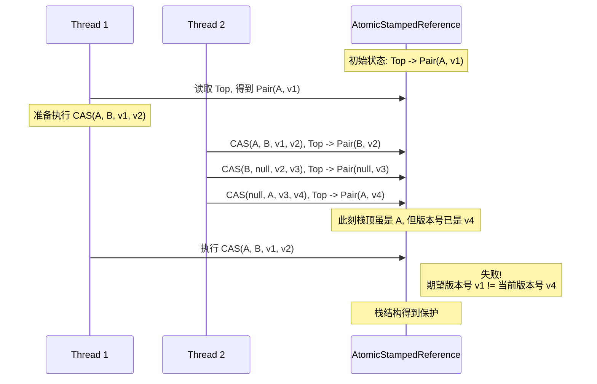

### 编码实战：简单 ABA 问题修复

下面这个简单的例子直观地展示了 `AtomicStampedReference` 如何阻止基于过时状态的更新。

```java
import java.util.concurrent.atomic.AtomicStampedReference;
import java.util.concurrent.TimeUnit;

public class ABAFix {
    // 初始值为 100, 初始版本号为 1
    static AtomicStampedReference<Integer> stampedRef = new AtomicStampedReference<>(100, 1);

    public static void main(String[] args) throws InterruptedException {
        new Thread(() -> {
            int stamp = stampedRef.getStamp(); // 获取当前版本号: 1
            System.out.println(Thread.currentThread().getName() + " 第一次获取版本号: " + stamp);

            try {
                // 等待T2也拿到初始版本号
                TimeUnit.SECONDS.sleep(1);
            } catch (InterruptedException e) { e.printStackTrace(); }

            // ABA 操作
            stampedRef.compareAndSet(100, 101, stamp, stamp + 1);
            System.out.println(Thread.currentThread().getName() + " 第二次获取版本号: " + stampedRef.getStamp());

            stampedRef.compareAndSet(101, 100, stampedRef.getStamp(), stampedRef.getStamp() + 1);
            System.out.println(Thread.currentThread().getName() + " 第三次获取版本号: " + stampedRef.getStamp());
        }, "T1").start();

        new Thread(() -> {
            int stamp = stampedRef.getStamp(); // T2获取初始版本号: 1
            System.out.println(Thread.currentThread().getName() + " 第一次获取版本号: " + stamp);

            try {
                // 等待 T1 完成 ABA 操作
                TimeUnit.SECONDS.sleep(3);
            } catch (InterruptedException e) { e.printStackTrace(); }

            // T2 尝试用旧的版本号去更新
            boolean success = stampedRef.compareAndSet(100, 2024, stamp, stamp + 1);
            System.out.println(Thread.currentThread().getName()
                + " CAS操作是否成功: " + success
                + ", 当前最新值: " + stampedRef.getReference()
                + ", 当前最新版本号: " + stampedRef.getStamp());

        }, "T2").start();
    }
}
// 输出:
// T1 第一次获取版本号: 1
// T2 第一次获取版本号: 1
// T1 第二次获取版本号: 2
// T1 第三次获取版本号: 3
// T2 CAS操作是否成功: false, 当前最新值: 100, 当前最新版本号: 3
```

`T2` 的更新失败了，因为它期望的版本号是 `1`，而此时的实际版本号已变为 `3`。`compareAndSet` 因版本号不匹配而返回 `false`，从而有效解决了 ABA 问题。

## 7. 高级实战：修复无锁栈的 ABA 风险

前面的例子直观但略显平淡。现在，我们将进入一个更真实、也更危险的场景：实现一个无锁栈，并亲手触发和修复其中由 ABA 问题导致的致命 Bug。

### 7.1. 风险复现：一个有问题的无锁栈

我们首先使用 `AtomicReference` 来实现一个看似正确的无锁栈。

```java
import java.util.concurrent.atomic.AtomicReference;

// 一个有ABA问题的无锁栈
public class UnsafeLockFreeStack<E> {
    private static class Node<E> {
        final E item;
        Node<E> next;
        Node(E item) { this.item = item; }
    }

    private final AtomicReference<Node<E>> top = new AtomicReference<>();

    public void push(E item) {
        Node<E> newNode = new Node<>(item);
        Node<E> oldTop;
        do {
            oldTop = top.get();
            newNode.next = oldTop;
        } while (!top.compareAndSet(oldTop, newNode));
    }

    public E pop() {
        Node<E> oldTop;
        Node<E> newTop;
        do {
            oldTop = top.get();
            if (oldTop == null) return null; // 栈为空
            newTop = oldTop.next;
        } while (!top.compareAndSet(oldTop, newTop));
        return oldTop.item;
    }
}
```

现在，让我们设计一个场景来摧毁它。我们将使用 `CountDownLatch` 来精确控制线程的执行顺序，稳定地复现 ABA 问题。

```java
import java.util.concurrent.CountDownLatch;
import java.util.concurrent.TimeUnit;

public class UnsafeStackTest {
    public static void main(String[] args) throws InterruptedException {
        UnsafeLockFreeStack<Integer> stack = new UnsafeLockFreeStack<>();
        stack.push(1);
        stack.push(2); // 栈顶 -> 2 -> 1

        CountDownLatch t1Latch = new CountDownLatch(1);

        // 线程1：准备 pop，但在 CAS 前暂停
        new Thread(() -> {
            // T1 读取 top 为 2，next 为 1
            // 此时 T1 认为只要 top 还是 2，就可以安全地把它更新为 1
            stack.pop();
            // 实际上，这里的 pop 分为两步: 1. get (top=2) 2. cas(2, 1)
            // 我们通过下面的线程操作，让它在 cas 前暂停
        }, "T1").start(); // 这个线程只是为了模拟第一次pop，让ABA的线程更容易观察

        // 线程2：模拟ABA操作
        new Thread(() -> {
            stack.pop(); // pop 2, 栈顶 -> 1
            stack.push(2); // push 2, 栈顶 -> 2 -> 1
            System.out.println("T2: ABA 操作完成");
            t1Latch.countDown();
        }, "T2").start();

        t1Latch.await(1, TimeUnit.SECONDS);

        // 线程3：在ABA操作后执行pop
        Integer val = stack.pop();
        System.out.println("T3 pop 的值: " + val);
        // 按理说，T3 pop 之后，栈应该剩下 1，但实际上...
        Integer remaining = stack.pop();
        System.out.println("栈中剩余的值: " + remaining); // 结果会是 null！数据丢失
    }
}
// 理想输出:
// T2: ABA 操作完成
// T3 pop 的值: 2
// 栈中剩余的值: 1

// 实际输出 (可能):
// T2: ABA 操作完成
// T3 pop 的值: 2
// 栈中剩余的值: null
```

上述代码虽然不能 100% 稳定复现（真实的复现需要更精密的线程控制或调试器），但它清晰地暴露了风险：在 `pop` 操作的 `get` 和 `compareAndSet` 之间，栈的状态可能经历了 `A->B->A` 的变化，导致最终的 CAS 基于一个"貌合神离"的旧状态，破坏了数据结构。

### 7.2. 风险修复：使用 AtomicStampedReference

现在，我们用 `AtomicStampedReference` 来加固我们的无锁栈。

```java
import java.util.concurrent.atomic.AtomicStampedReference;

public class SafeLockFreeStack<E> {
    private static class Node<E> {
        final E item;
        Node<E> next;
        Node(E item) { this.item = item; }
    }

    private final AtomicStampedReference<Node<E>> top = new AtomicStampedReference<>(null, 0);

    public void push(E item) {
        Node<E> newNode = new Node<>(item);
        int[] stampHolder = new int[1];
        Node<E> oldTop;
        do {
            oldTop = top.get(stampHolder); // 获取当前 top 和 stamp
            newNode.next = oldTop;
        } while (!top.compareAndSet(oldTop, newNode, stampHolder[0], stampHolder[0] + 1));
    }

    public E pop() {
        int[] stampHolder = new int[1];
        Node<E> oldTop;
        Node<E> newTop;
        do {
            oldTop = top.get(stampHolder); // 获取当前 top 和 stamp
            if (oldTop == null) {
                return null;
            }
            newTop = oldTop.next;
            // 关键：CAS 时必须传入获取到的 stamp
        } while (!top.compareAndSet(oldTop, newTop, stampHolder[0], stampHolder[0] + 1));
        return oldTop.item;
    }
}
```

**修复原理**：在 `SafeLockFreeStack` 中，每次 `push` 或 `pop` 操作成功，都会使版本号 `stamp` 加一。当线程 T1 在 `pop` 操作中途暂停时，它记录了旧的 `top` 引用和旧的版本号 `v1`。当 T2 完成 ABA 操作后，虽然 `top` 引用变回了原来的值，但版本号已经变成了 `v3`。T1 恢复执行时，它的 `compareAndSet` 会因为 `期望版本号 v1 != 当前版本号 v3` 而失败。它必须重新循环，获取最新的 `top` 和最新的版本号 `v3`，并在此基础上重新计算，从而保证了操作的正确性。
```

## 来源 2: Fuwari / `JUC/CompletableFutureAction.md`

- 原始 URL: <https://github.com/DavidHLP/Fuwari/blob/07cee2baf9cee227807dcd68004c5f2493e5ac52/src/content/posts/JUC/CompletableFutureAction.md>
- 本地路径: `JUC/CompletableFutureAction.md`

```markdown
---
title: CompletableFuture
published: 2025-06-24
description: 本文系统梳理了 CompletableFuture 的核心 API、典型用法与实践示例，涵盖任务创建、结果处理、组合操作及常见陷阱，帮助开发者快速掌握 Java 异步编程要点。
tags: [CompletableFuture, Java, 多线程]
category: JUC
draft: false
---

# CompletableFuture

> 以下内容整理自 `CompletableFutureAction.java`，涵盖常见的 API 使用场景。每小节均给出：关键知识点 → 示例代码 → 预期输出，方便快速查阅。

---

## 1. 直接 `new CompletableFuture()`

**关键知识点**

- 使用空参构造方法得到的是 _待手动完成_ 的 `CompletableFuture`，若未调用 `complete/completeExceptionally`，则 `get/join` 会永久阻塞 ⇒ **不安全**。

```java
// 不要这样使用！
CompletableFuture cf = new CompletableFuture();
```

**结果**

- 若无外部线程调用 `cf.complete(...)`，则获取结果的方法会一直阻塞。

---

## 2. `runAsync` / `supplyAsync`

**关键知识点**

- `runAsync`：无返回值，对应 `CompletableFuture<Void>`。
- `supplyAsync`：有返回值，使用 `Supplier<T>`。
- 若未显式指定线程池，则默认使用 `ForkJoinPool.commonPool()`；可通过第二个参数传入自定义 `Executor`。

```java
// 无返回值，使用公共线程池
CompletableFuture<Void> cf1 = CompletableFuture.runAsync(() ->
        System.out.println(Thread.currentThread().getName()));
System.out.println(cf1.get());        // 输出 null

// 有返回值，使用自定义线程池
ExecutorService pool = Executors.newFixedThreadPool(10);
CompletableFuture<String> cf2 = CompletableFuture.supplyAsync(() ->
        Thread.currentThread().getName(), pool);
System.out.println(cf2.get());
pool.shutdown();
```

**结果（示例）**

```text
ForkJoinPool.commonPool-worker-1
null
pool-1-thread-1
```

---

## 3. `whenComplete` / `exceptionally`

### 3.1 无自定义线程池

```java
CompletableFuture.supplyAsync(() -> 1)
        .whenComplete((v, t) -> System.out.println("whenComplete:" + (v + 1)))
        .exceptionally(t -> { System.out.println(t.getMessage()); return null; });
System.out.println("Main Thread:" + 3);
```

**结果**（主线程未休眠时）

```text
Main Thread:3
```

**结果**（主线程休眠 1s）

```text
Main Thread:3
whenComplete:2
```

### 3.2 使用自定义线程池

- 逻辑与 3.1 相同，只是把 `supplyAsync` 放入自定义线程池即可。

---

## 4. `join()`

**关键知识点**

- `join()` 与 `get()` 类似，但会将受检异常转换为 `UncheckedExecutionException`。

```java
int r = CompletableFuture.supplyAsync(() -> 1, pool).join();
System.out.println("CompletableFutureJoin:" + r);
```

**结果**

```text
CompletableFutureJoin:1
Main Thread
```

---

## 5. 获取结果方式对比

```java
CompletableFuture<String> f = CompletableFuture.supplyAsync(() -> {
    Thread.sleep(200);
    return Thread.currentThread().getName();
});
System.out.println("get:" + f.get());
System.out.println("join:" + f.join());
System.out.println("getNow:" + f.getNow("default"));
System.out.println("Timeout 200ms:" + f.get(200, TimeUnit.MILLISECONDS));
```

**结果（示例）**

```text
get: ForkJoinPool.commonPool-worker-1
join: ForkJoinPool.commonPool-worker-1
getNow: default
Timeout 200ms: ForkJoinPool.commonPool-worker-1
```

- 再次调用 `get(100, TimeUnit.MILLISECONDS)` 将抛出 `TimeoutException`。

---

## 6. 主动触发计算 `complete()`

```java
CompletableFuture<String> f = CompletableFuture.supplyAsync(() -> {
    Thread.sleep(300);
    return Thread.currentThread().getName();
});
TimeUnit.MILLISECONDS.sleep(200);
f.complete("Hello World");
System.out.println(f.get());
```

**结果**

```text
Hello World
```

---

## 7. 结果转换 `thenApply` / `handle`

### 7.0 回调方法区别速查

| 方法         | Lambda 类型     | 是否需要上一步结果 | 是否有返回值 |
| ------------ | --------------- | ------------------ | ------------ |
| `thenRun`    | `Runnable`      | 否                 | 否           |
| `thenAccept` | `Consumer<T>`   | 是                 | 否           |
| `thenApply`  | `Function<T,R>` | 是                 | 是           |

> 任务 A 执行完毕后：
>
> - **thenRun**：直接执行任务 B，B 不关心 A 的结果；
> - **thenAccept**：执行任务 B，B 依赖 A 的结果，但 B 自身无返回值；
> - **thenApply**：执行任务 B，B 依赖 A 的结果，并且 B 产生新的返回值。

### 常用函数式接口对照表

| 函数式接口        | 抽象方法               | 参数数量 | 返回值 |
| ----------------- | ---------------------- | -------- | ------ |
| `Runnable`        | `void run()`           | 0        | 无     |
| `Function<T,R>`   | `R apply(T t)`         | 1        | 有     |
| `Consumer<T>`     | `void accept(T t)`     | 1        | 无     |
| `Supplier<T>`     | `T get()`              | 0        | 有     |
| `BiConsumer<T,U>` | `void accept(T t,U u)` | 2        | 无     |

### 7.1 `thenApply`（链式转换）

```java
CompletableFuture.supplyAsync(() -> 1, pool)
        .thenApply(r -> r + 1)
        .thenApply(r -> r + 1)
        .thenApply(r -> r + 1);
System.out.println("Main Thread");
```

**结果**

```text
Main Thread
2
3
4
```

### 7.2 `handle`（可处理异常）

```java
CompletableFuture.supplyAsync(() -> 1, pool)
        .handle((r, ex) -> r + 1)
        .handle((r, ex) -> r + 1)
        .handle((r, ex) -> r + 1)
        .exceptionally(Throwable::getMessage);
```

---

## 8. 消费结果 `thenAccept` / 纯触发 `thenRun`

```java
// thenAccept 消费值
CompletableFuture.supplyAsync(() -> 1, pool)
        .thenAccept(r -> System.out.println(r + 10));

// thenRun 只关心前序完成
CompletableFuture.supplyAsync(() -> 1, pool)
        .thenRun(() -> System.out.println("thenRun"));
```

**结果**

```text
Main Thread
11            // thenAccept 输出
thenRun        // thenRun 输出
```

### `thenRun` 连续调用及线程差异

- 若前序计算线程休眠 → 后续 `thenRun` 仍在同一线程。
- 若不休眠 → 后两次 `thenRun` 可能在 `main` 线程。

### `thenRunAsync`

- 不指定线程池时，后续任务切到 `ForkJoinPool.commonPool()`。

---

## 9. 组合任务

### 9.1 `applyToEither`

- 获取**先完成**的结果，未完成的任务仍继续执行。

```java
CompletableFuture<String> f1 = CompletableFuture.supplyAsync(() -> {
    Thread.sleep(1000);
    return "future1 fast";
}, pool);
CompletableFuture<String> f2 = CompletableFuture.supplyAsync(() -> {
    Thread.sleep(2000);
    return "future2 slow";
}, pool);
CompletableFuture<String> fastest = f1.applyToEither(f2, s -> s);
fastest.thenAccept(System.out::println); // future1 fast
f2.thenAccept(System.out::println);      // future2 slow
```

**结果**

```text
future1 fast
future2 slow
```

### 9.2 `thenCombine`

- 等待**两个**任务都完成后合并结果。

```java
CompletableFuture<Integer> r =
        CompletableFuture.supplyAsync(() -> 10, pool)
                .thenCombine(CompletableFuture.supplyAsync(() -> 20, pool), Integer::sum);
r.thenAccept(System.out::println); // 30
```

**结果**

```text
30
```

---

> 以上示例均基于 JDK 17，输出可能因线程调度而略有差异，仅供参考。
```

## 来源 3: Fuwari / `JUC/FutureTaskAction.md`

- 原始 URL: <https://github.com/DavidHLP/Fuwari/blob/07cee2baf9cee227807dcd68004c5f2493e5ac52/src/content/posts/JUC/FutureTaskAction.md>
- 本地路径: `JUC/FutureTaskAction.md`

```markdown
---
title: FutureTask
published: 2025-06-24
description: 本文全面介绍 FutureTask 的使用场景、优势劣势及最佳实践，结合代码示例帮助开发者掌握 Java 线程池中异步任务管理的常用模式。
tags: [FutureTask, Java, 多线程]
category: JUC
draft: false
---

# FutureTask

## 1. FutureTask 基本使用

### 1.1 创建与执行

FutureTask 是 Java 并发编程中的一个重要类，它实现了 `Runnable` 和 `Future` 接口，可以用于异步计算。

```java
// 创建 FutureTask 实例，传入 Callable 实现
FutureTask<String> futureTask = new FutureTask<>(new Callable<String>() {
    @Override
    public String call() throws Exception {
        return "Callable / FutureTask Hello World";
    }
});

// 创建线程并启动
Thread thread = new Thread(futureTask);
thread.start();

// 获取计算结果（会阻塞直到计算完成）
String result = futureTask.get();
System.out.println(result);
```

**运行结果：**

```
Callable / FutureTask Hello World
```

## 2. 多线程与单线程性能对比

使用 FutureTask 可以显著提高程序的执行效率，特别是在需要执行多个耗时操作时。

### 2.1 使用 FutureTask 的并行执行

```java
public static void futureTaskExample() throws Exception {
    long startTime = System.currentTimeMillis();
    ExecutorService threadPool = Executors.newFixedThreadPool(3);

    // 创建多个 FutureTask 并行执行
    FutureTask<String> futureTask1 = createFutureTask(300);
    FutureTask<String> futureTask2 = createFutureTask(300);

    threadPool.submit(futureTask1);
    threadPool.submit(futureTask2);

    // 获取结果
    futureTask1.get();
    futureTask2.get();

    threadPool.shutdown();
    long endTime = System.currentTimeMillis();
    System.out.println("FutureTask time: " + (endTime - startTime)); // 约300ms
}
```

**运行结果：**

```
FutureTask time: 310
```

### 2.2 单线程串行执行

```java
public static void singleThreadExample() {
    long startTime = System.currentTimeMillis();

    try {
        Thread.sleep(300);
        Thread.sleep(300);
    } catch (InterruptedException e) {
        e.printStackTrace();
    }

    long endTime = System.currentTimeMillis();
    System.out.println("Single thread time: " + (endTime - startTime)); // 约600ms
}
```

**运行结果：**

```
NoFutureTask time: 900
```

## 3. FutureTask 的阻塞特性

### 3.1 get() 方法的阻塞

`futureTask.get()` 方法会阻塞当前线程，直到任务执行完成并返回结果。

```java
// 主线程会阻塞在 get() 方法，直到任务完成
String result = futureTask.get();
```

**运行结果：**

```
FutureTaskLastGet Main Thread
Callable / FutureTask Hello World
```

### 3.2 带超时的 get() 方法

可以设置超时时间，避免长时间阻塞：

```java
try {
    // 最多等待2秒
    String result = futureTask.get(2, TimeUnit.SECONDS);
} catch (TimeoutException e) {
    // 超时处理
    System.out.println("Task timed out");
}
```

**运行结果：**

```
Exception in thread "main" java.util.concurrent.TimeoutException
        at java.base/java.util.concurrent.FutureTask.get(FutureTask.java:204)
        at action.FutureTaskPreGetTimeout(action.java:192)
        at action.main(action.java:139)
```

## 4. 轮询检查任务状态

可以使用 `isDone()` 方法轮询检查任务是否完成：

```java
FutureTask<String> futureTask = new FutureTask<>(() -> {
    try {
        TimeUnit.SECONDS.sleep(2);
    } catch (Exception e) {
        e.printStackTrace();
    }
    return "Callable / FutureTask Hello World";
});

Thread thread = new Thread(futureTask);
thread.start();

// 轮询检查任务状态
while (!futureTask.isDone()) {
    System.out.println("FutureTask is not done");
    Thread.sleep(1000);
}

// 获取结果
System.out.println(futureTask.get());
```

**运行结果：**

```
FutureTask is not done
FutureTask is not done
FutureTask is not done
Callable / FutureTask Hello World
```

## 5. 关键点

1. **异步执行**：FutureTask 可以在单独的线程中执行耗时操作，不阻塞主线程。
2. **结果获取**：通过 `get()` 方法获取计算结果，该方法会阻塞直到计算完成。
3. **超时控制**：可以使用带超时参数的 `get(timeout, unit)` 方法避免长时间阻塞。
4. **状态查询**：通过 `isDone()` 方法可以查询任务是否完成。
5. **异常处理**：任务执行过程中的异常会在调用 `get()` 方法时抛出。
6. **线程池集成**：可以与 `ExecutorService` 配合使用，更好地管理线程资源。

## 6. 使用场景

- 需要获取异步任务执行结果时
- 需要控制任务执行超时时长时
- 需要取消正在执行的任务时（通过 `cancel()` 方法）
- 需要批量提交多个任务并等待所有任务完成时

## 7. 优缺点分析

### 优点

1. **简单易用**

   - 提供简单的 API 来执行异步任务并获取结果
   - 实现了 `Runnable` 和 `Future` 接口，使用灵活

2. **结果可获取**

   - 通过 `get()` 方法可以获取异步计算的结果
   - 支持带超时的结果获取，避免无限期阻塞

3. **状态可查询**

   - 提供 `isDone()` 方法检查任务是否完成
   - 提供 `isCancelled()` 方法检查任务是否被取消

4. **可取消性**

   - 支持通过 `cancel()` 方法取消尚未完成的任务
   - 可以设置任务是否允许被中断

5. **异常处理**
   - 任务执行过程中的异常会被封装并重新抛出
   - 可以通过 `get()` 方法捕获任务执行时抛出的异常

### 缺点

1. **阻塞式获取结果**

   - `get()` 方法会阻塞调用线程直到任务完成
   - 可能导致调用线程长时间等待，影响响应性

2. **回调支持有限**

   - 不直接支持回调机制
   - 需要手动轮询或使用其他机制处理完成通知

3. **组合任务复杂**

   - 处理多个 FutureTask 的依赖关系时代码复杂
   - 需要额外的逻辑来协调多个异步任务

4. **异常处理繁琐**

   - 异常处理代码可能分散在多个地方
   - 需要显式捕获 `InterruptedException` 和 `ExecutionException`

5. **取消操作有限制**
   - 不能保证立即停止正在执行的任务
   - 任务可能已经启动或完成，`cancel()` 可能不会生效

## 8. 最佳实践

1. **合理使用超时**

   ```java
   // 总是使用带超时的 get 方法
   try {
       result = futureTask.get(5, TimeUnit.SECONDS);
   } catch (TimeoutException e) {
       // 处理超时情况
       futureTask.cancel(true); // 可选：尝试取消任务
   }
   ```

2. **资源清理**

   ```java
   // 确保在 finally 块中关闭线程池
   ExecutorService executor = Executors.newFixedThreadPool(3);
   try {
       // 使用线程池执行任务
   } finally {
       executor.shutdown();
   }
   ```

3. **异常处理**

   ```java
   try {
       futureTask.get();
   } catch (InterruptedException e) {
       // 处理中断异常
       Thread.currentThread().interrupt(); // 恢复中断状态
   } catch (ExecutionException e) {
       // 处理任务执行时抛出的异常
       Throwable cause = e.getCause();
       // 根据具体异常类型处理
   }
   ```

4. **避免重复提交**

   ```java
   // FutureTask 实例不能重复使用
   FutureTask<String> futureTask = new FutureTask<>(() -> "Task");
   new Thread(futureTask).start();
   // 不能再次提交同一个 futureTask 实例
   // new Thread(futureTask).start(); // 错误！
   ```

5. **使用线程池**

   ```java
   // 使用线程池管理线程
   ExecutorService executor = Executors.newFixedThreadPool(3);
   FutureTask<String> task1 = new FutureTask<>(() -> "Task 1");
   FutureTask<String> task2 = new FutureTask<>(() -> "Task 2");

   executor.submit(task1);
   executor.submit(task2);

   // 处理结果...

   executor.shutdown();
   ```
```

## 来源 4: Fuwari / `JUC/JavaAtomicClasses.md`

- 原始 URL: <https://github.com/DavidHLP/Fuwari/blob/07cee2baf9cee227807dcd68004c5f2493e5ac52/src/content/posts/JUC/JavaAtomicClasses.md>
- 本地路径: `JUC/JavaAtomicClasses.md`

```markdown
---
title: Java原子类详解
published: 2025-07-11
description: 作为一位资深的Java开发者，我们知道在并发编程中，保证数据的一致性和线程安全是至关重要的。本文详细讲解了Java中的原子类，它们是如何通过CAS操作实现高性能的线程安全，并介绍了常用的API和实际应用场景。
tags: [Java, JUC, Atomic]
category: JUC
draft: false
---

## 1. 背景：并发编程的挑战与原子类的诞生

在 Java 并发编程中，保证共享变量的原子性是确保线程安全的核心。传统的`synchronized`和`Lock`机制虽能解决问题，但它们是**悲观锁**，在线程竞争激烈时，频繁的线程阻塞和唤醒会带来显著的性能开销和上下文切换成本。

为了应对这一挑战，Java 自 JDK 1.5 起在`java.util.concurrent.atomic`包中引入了一套原子类。这些类基于现代处理器提供的硬件级原子指令（如 CAS），实现了一种轻量级、高性能的线程安全变量更新方案。这套方案属于**乐观锁**的范畴，它假设并发冲突是小概率事件，从而避免了传统锁的开销。

## 2. 核心基石：CAS (Compare-and-Swap)

原子类实现高效并发的秘密武器是**CAS (Compare-and-Swap)** 操作。

CAS 操作包含三个核心操作数：

1.  **内存位置 V (Variable)**: 需要更新的变量。
2.  **预期原值 A (Expected)**: 线程认为该变量当前应该持有的值。
3.  **新值 B (New)**: 准备写入的新值。

操作流程如下：当一个线程要更新变量`V`时，它会原子性地执行一步操作——比较`V`的当前值是否与`A`相等。如果相等，证明在它准备更新的期间没有其他线程染指该变量，此时就安全地将`V`的值更新为`B`并返回成功。如果不相等，则说明`V`已被其他线程修改，本次更新失败，线程不会阻塞，而是会得到一个失败的反馈。

通常，开发者会基于 CAS 实现一个自旋循环，即一旦更新失败，就重新读取新值，再次尝试 CAS，直到成功为止。

### 2.1 潜在风险：ABA 问题

CAS 本身存在一个经典问题——**ABA 问题**。
**问题描述**：线程 T1 读取内存值 V 为 A，准备将其更新为 C。在 T1 执行更新前，线程 T2 介入，将 V 从 A 改为 B，然后又改回了 A。之后 T1 执行 CAS，发现内存值 V 仍然是 A，便认为“一切未变”，成功将值更新为 C。

在大多数数值增减场景下，ABA 问题无伤大雅。但在某些严谨的业务逻辑中（例如，账户资金的流转记录），这种“过程被忽略”的情况是致命的。解决方案我们将在`AtomicStampedReference`中详细探讨。

## 3. 原子类家族全景解析

### 3.1 基础类型原子类：`AtomicInteger`, `AtomicLong`, `AtomicBoolean`

这是最常用的一组原子类，用于对单个原始类型值进行原子操作。

**核心 API (以 `AtomicInteger` 为例):**

| 方法签名                                    | 描述                                                                                               | 返回值    |
| ------------------------------------------- | -------------------------------------------------------------------------------------------------- | --------- |
| `get()`                                     | 获取当前值（保证`volatile`读语义）。                                                               | 当前值    |
| `set(int newValue)`                         | 设置新值（保证`volatile`写语义）。                                                                 | `void`    |
| `lazySet(int newValue)`                     | 延迟设置，性能更高，但不保证后续读操作立即看到修改。适用于对实时性要求不高的场景，如重置监控数据。 | `void`    |
| `compareAndSet(int expect, int update)`     | 核心 CAS 操作。如果当前值等于`expect`，则原子地更新为`update`。                                    | `boolean` |
| `weakCompareAndSet(int expect, int update)` | 弱 CAS，可能出现“虚假失败”（值未变也返回`false`），在某些平台性能更好，但必须在循环中使用。        | `boolean` |
| `getAndSet(int newValue)`                   | 原子地设置为新值，并返回**修改前**的旧值。                                                         | 旧值      |
| `getAndIncrement()` / `getAndDecrement()`   | 原子地将值加 1 或减 1，并返回**修改前**的旧值。                                                    | 旧值      |
| `incrementAndGet()` / `decrementAndGet()`   | 原子地将值加 1 或减 1，并返回**修改后**的新值。                                                    | 新值      |
| `getAndAdd(int delta)`                      | 原子地加上`delta`，并返回**修改前**的旧值。                                                        | 旧值      |
| `addAndGet(int delta)`                      | 原子地加上`delta`，并返回**修改后**的新值。                                                        | 新值      |

**应用案例 1：线程安全的计数器 (`AtomicInteger`)**

```java
import java.util.concurrent.atomic.AtomicInteger;
import java.util.concurrent.ExecutorService;
import java.util.concurrent.Executors;
import java.util.stream.IntStream;

class SafeCounter {
    private final AtomicInteger count = new AtomicInteger(0);

    public void increment() {
        count.incrementAndGet(); // 原子自增，无需加锁
    }

    public int getCount() {
        return count.get();
    }
}
// 使用示例
// ExecutorService executor = Executors.newFixedThreadPool(10);
// SafeCounter counter = new SafeCounter();
// IntStream.range(0, 1000).forEach(i -> executor.submit(counter::increment));
// ...
// System.out.println(counter.getCount()); // 输出1000
```

**应用案例 2：确保任务只执行一次 (`AtomicBoolean`)**
`AtomicBoolean`非常适合用作一次性状态的标记，例如“初始化”操作。

```java
import java.util.concurrent.atomic.AtomicBoolean;

class OneTimeInitializer {
    private final AtomicBoolean initialized = new AtomicBoolean(false);

    public void initialize() {
        // compareAndSet确保只有一个线程能将false变为true
        if (initialized.compareAndSet(false, true)) {
            System.out.println("Initialization logic runs here. Thread: " + Thread.currentThread().getName());
            // ... 执行重量级的初始化任务
        } else {
            System.out.println("Already initialized. Thread: " + Thread.currentThread().getName());
        }
    }
}
// 使用示例
// OneTimeInitializer initializer = new OneTimeInitializer();
// IntStream.range(0, 5).parallel().forEach(i -> initializer.initialize());
// // 控制台只会打印一次 "Initialization logic runs here."
```

### 3.2 数组类型原子类：`AtomicIntegerArray`, `AtomicLongArray`, `AtomicReferenceArray`

这类原子类允许你对数组中的**单个元素**进行原子操作，而无需锁定整个数组，实现了更细粒度的并发控制。当你需要一个线程安全的数组，并且更新操作集中在独立元素上时，它们是绝佳选择。

其 API 与基础类型原子类高度相似，只是每个方法都增加了一个`int i`参数来指定数组索引。

**应用案例 1：并发更新统计数组 (`AtomicIntegerArray`)**

```java
import java.util.concurrent.atomic.AtomicIntegerArray;

class ConcurrentMetrics {
    // 假设索引0代表点击数，索引1代表曝光数
    private final AtomicIntegerArray metrics;

    public ConcurrentMetrics(int size) {
        this.metrics = new AtomicIntegerArray(size);
    }

    public void incrementClicks() {
        metrics.getAndIncrement(0); // 原子地增加索引0的元素值
    }

    public void incrementImpressions() {
        metrics.getAndIncrement(1); // 原子地增加索引1的元素值
    }

    public int getClicks() {
        return metrics.get(0);
    }
}
```

**应用案例 2：原子地更新对象数组状态 (`AtomicReferenceArray`)**

```java
import java.util.concurrent.atomic.AtomicReferenceArray;

class TaskProcessor {
    enum Status { PENDING, RUNNING, COMPLETED }

    private final AtomicReferenceArray<Status> taskStatuses;

    public TaskProcessor(int taskCount) {
        this.taskStatuses = new AtomicReferenceArray<>(taskCount);
        for (int i = 0; i < taskCount; i++) {
            taskStatuses.set(i, Status.PENDING);
        }
    }

    // 尝试将一个任务从PENDING状态切换到RUNNING状态
    public boolean startTask(int taskIndex) {
        return taskStatuses.compareAndSet(taskIndex, Status.PENDING, Status.RUNNING);
    }

    public Status getTaskStatus(int taskIndex) {
        return taskStatuses.get(taskIndex);
    }
}
```

### 3.3 引用类型原子类：处理对象与 ABA 问题

这类原子类用于对对象引用进行原子更新，是解决复杂并发状态流转的关键。

#### `AtomicReference<V>`

提供对单个对象引用的原子操作。

**应用案例：安全地更新配置对象**

```java
import java.util.concurrent.atomic.AtomicReference;

class AppConfig {
    // 不可变配置对象
    private final String version;
    public AppConfig(String version) { this.version = version; }
    public String getVersion() { return version; }
}

class ConfigManager {
    private final AtomicReference<AppConfig> currentConfig = new AtomicReference<>(new AppConfig("1.0"));

    public void updateConfig(String newVersion) {
        AppConfig oldConfig, newConfig;
        do {
            oldConfig = currentConfig.get();
            newConfig = new AppConfig(newVersion);
            // 循环尝试，直到成功为止
        } while (!currentConfig.compareAndSet(oldConfig, newConfig));
        System.out.println("Config updated to " + newVersion);
    }
}
```

#### `AtomicStampedReference<V>`：ABA 问题的终极解决方案

它通过一个整型“标记”(stamp)，通常用作版本号，来解决 ABA 问题。CAS 操作现在不仅要检查引用是否匹配，还要检查版本号是否匹配。

**应用案例：带版本号的安全账户提款**

```java
import java.util.concurrent.atomic.AtomicStampedReference;

class Account {
    public final int balance;
    public Account(int balance) { this.balance = balance; }
}

class SafeAccount {
    private final AtomicStampedReference<Account> accRef;

    public SafeAccount(int initialBalance) {
        this.accRef = new AtomicStampedReference<>(new Account(initialBalance), 0); // 初始账户，初始版本号0
    }

    public boolean withdraw(int amount) {
        int[] stampHolder = new int[1]; // 用于获取当前版本号
        Account currentAcc, newAcc;
        int currentStamp;

        do {
            currentAcc = accRef.get(stampHolder);
            currentStamp = stampHolder[0];

            if (currentAcc.balance < amount) {
                System.out.println("余额不足");
                return false;
            }
            newAcc = new Account(currentAcc.balance - amount);
            // 核心：CAS时必须提供预期的引用和版本号。成功后，版本号加1。
        } while (!accRef.compareAndSet(currentAcc, newAcc, currentStamp, currentStamp + 1));

        System.out.println("成功取出: " + amount + "，新余额: " + newAcc.balance);
        return true;
    }
}
```

#### `AtomicMarkableReference<V>`：轻量级 ABA 解决方案

`AtomicStampedReference`的简化版，其“标记”是一个`boolean`值。适用于那些你只关心值“是否被修改过”，而不关心“被修改了多少次”的场景。

**应用案例：标记一个可回收的对象**

```java
import java.util.concurrent.atomic.AtomicMarkableReference;

class Node<T> {
    T item;
    // (item, marked_as_deleted)
    AtomicMarkableReference<Node<T>> next;
    Node(T item) { this.item = item; }
}

class LockFreeList {
    // 假设我们要逻辑删除一个节点
    public void logicalDelete(Node<String> node) {
        // 尝试将节点的next引用的mark位置为true，表示该节点已被删除
        // 只有当next引用未变且mark为false时，才能成功
        node.next.attemptMark(node.next.getReference(), true);
    }
}
```

### 3.4 字段更新器：`Atomic...FieldUpdater`

这是一类非常独特的、基于反射的原子工具，其核心价值在于**在不改变一个类结构的前提下，为其某个字段提供原子操作能力**，从而实现低侵入式的并发控制和内存优化。

**使用场景**:

1.  **第三方类**: 你需要对一个无法修改源码的库中的类的某个字段进行原子更新。
2.  **内存优化**: 类中某个字段在大多数情况下无需原子性，只有在少数高并发场景下需要。直接使用`AtomicInteger`会给每个实例带来额外的包装对象开销。字段更新器是共享的，不会增加实例的内存占用。

**使用前提**:

1.  目标字段**必须**是 `volatile` 类型，以保证 CAS 操作的可见性。
2.  目标字段的访问权限不能是 `private`。
3.  必须是实例变量，不能是静态变量。

> **面试亮点**: 当被问及`volatile`的用途时，除了回答“保证可见性”和“禁止指令重排”外，如果你能补充：“**在使用`AtomicIntegerFieldUpdater`等字段更新器时，目标字段必须声明为`volatile`，这是对普通对象字段实现 CAS 操作的前提。**” 这将极大展示你的实践深度。

**应用案例：安全地更新用户信息**

```java
import java.util.concurrent.atomic.AtomicIntegerFieldUpdater;
import java.util.concurrent.atomic.AtomicReferenceFieldUpdater;

class User {
    // 1. 字段必须是volatile且非private
    public volatile int age;
    public volatile String status;

    public User(int age, String status) {
        this.age = age;
        this.status = status;
    }

    // getters...
    public int getAge() { return age; }
    public String getStatus() { return status; }
}

public class FieldUpdaterDemo {
    // 2. 创建Updater实例，它是线程安全的，通常定义为静态常量
    private static final AtomicIntegerFieldUpdater<User> ageUpdater =
        AtomicIntegerFieldUpdater.newUpdater(User.class, "age");

    private static final AtomicReferenceFieldUpdater<User, String> statusUpdater =
        AtomicReferenceFieldUpdater.newUpdater(User.class, String.class, "status");

    public static void main(String[] args) {
        User user = new User(25, "Active");

        // 使用Updater对user实例的字段进行原子操作
        ageUpdater.compareAndSet(user, 25, 26);
        System.out.println("Updated age: " + user.getAge()); // Output: 26

        statusUpdater.compareAndSet(user, "Active", "Inactive");
        System.out.println("Updated status: " + user.getStatus()); // Output: Inactive
    }
}
```

### 3.5 高性能增强类：`LongAdder` & `LongAccumulator` (Java 8+)

`AtomicLong`虽然高效，但在**极高并发**下，所有线程都在竞争同一个 CAS 变量，会导致大量自旋重试，性能触顶甚至下降。`LongAdder`等类就是为了解决这个“热点竞争”问题而生。

**核心原理：空间换时间，分散热点**
`LongAdder`内部维护一个`base`基础值和一个`Cell[]`（Cell 是`AtomicLong`的内部封装）数组。

1.  **低并发**: 当没有竞争时，数据直接累加到`base`，此时与`AtomicLong`无异。
2.  **高并发**: 当对`base`的 CAS 失败时，线程会“不纠缠”，转而尝试将增量加到`Cell[]`数组中的某个`Cell`上。每个线程通过哈希映射到不同的`Cell`，从而将写操作的热点从一个点分散到多个点，极大减少了冲突。
3.  **最终求和**: 调用`sum()`方法时，会将`base`与所有`Cell`中的值相加返回。

**`Adder` vs `Accumulator`**

- `LongAdder` 是 `LongAccumulator` 的一个特例，专门用于**加法**。
- `LongAccumulator` 更为通用，允许在构造时提供一个自定义的二元运算函数（如求最大值、最小值、乘积等）。

**应用案例：高并发统计与聚合**

```java
import java.util.concurrent.ExecutorService;
import java.util.concurrent.Executors;
import java.util.concurrent.atomic.LongAccumulator;
import java.util.concurrent.atomic.LongAdder;
import java.util.stream.IntStream;

public class AdderAccumulatorDemo {
    public static void main(String[] args) throws InterruptedException {
        // --- LongAdder: 高并发计数 ---
        LongAdder counter = new LongAdder();
        ExecutorService executor = Executors.newFixedThreadPool(10);
        int tasks = 1_000_000;

        // 10个线程，每个执行10万次加法
        for (int i = 0; i < tasks; i++) {
            executor.submit(counter::increment);
        }

        // 等待任务执行完毕 (实际项目中应使用更健壮的同步方式)
        executor.shutdown();
        while (!executor.isTerminated()) { }
        System.out.println("LongAdder count: " + counter.sum()); // Output: 1000000

        // --- LongAccumulator: 并发求最大值 ---
        // 构造时传入 (当前值, 新值) -> Math.max(当前值, 新值) 函数，和初始值
        LongAccumulator maxTracker = new LongAccumulator(Math::max, Long.MIN_VALUE);
        IntStream.range(1, 1001).parallel().forEach(maxTracker::accumulate);
        System.out.println("Max value tracked by LongAccumulator: " + maxTracker.get()); // Output: 1000
    }
}
```

## 如何选择合适的原子类？

| 场景需求                                 | 推荐原子类                              | 理由                                                      |
| ---------------------------------------- | --------------------------------------- | --------------------------------------------------------- |
| **通用线程安全计数**                     | `AtomicInteger` / `AtomicLong`          | 简单、直接，足以应对绝大多数并发场景。                    |
| **极高并发、写密集的统计** (如 QPS 计数) | `LongAdder` / `DoubleAdder`             | 分段 CAS 设计，性能远超`AtomicLong`，专为高竞争场景优化。 |
| **需要对对象引用进行原子更新**           | `AtomicReference`                       | 实现对共享对象的安全替换。                                |
| **需要解决 CAS 的 ABA 问题**             | `AtomicStampedReference`                | 通过版本号机制，确保数据在“版本”上也符合预期，最为严谨。  |
| **只需关心引用是否被改过一次**           | `AtomicMarkableReference`               | `AtomicStampedReference`的轻量版，标记位开销更小。        |
| **对数组中某个元素进行原子操作**         | `Atomic...Array` 系列                   | 提供了数组元素级别的原子性，避免了对整个数组加锁。        |
| **需要一个通用的、可自定义运算的累加器** | `LongAccumulator` / `DoubleAccumulator` | 比`Adder`更灵活，可实现求最大/小值、乘积等复杂聚合。      |
| **在不修改类源码前提下增加原子性**       | `Atomic...FieldUpdater` 系列            | 低侵入性，节省内存，是为已有类“赋能”的利器。              |
```

## 来源 5: Fuwari / `JUC/JavaDeadlockdiagnosis.md`

- 原始 URL: <https://github.com/DavidHLP/Fuwari/blob/07cee2baf9cee227807dcd68004c5f2493e5ac52/src/content/posts/JUC/JavaDeadlockdiagnosis.md>
- 本地路径: `JUC/JavaDeadlockdiagnosis.md`

```markdown
---
title: Java 死锁诊断与规避策略深度解析
published: 2025-06-26
description: 系统性地梳理 Java 死锁的成因、jps 与 jstack 等排查工具链的使用，以及通过保证锁顺序、使用超时锁等方法在架构层面预防和规避死锁的策略。
tags: [Java, 并发编程, 死锁, Deadlock, jstack, jps, JConsole]
category: JUC
draft: false
---

# Java 死锁诊断与规避策略深度解析

> 作为一名 Java 开发者，处理并发问题是日常工作中不可或缺的一环，而死锁（Deadlock）无疑是其中最棘手的问题之一。它能导致系统部分乃至全部功能瘫痪，且难以在测试环境中稳定复现。本文旨在系统性地梳理 Java 死锁的成因、排查工具链以及架构层面的预防策略，为高效诊断和根除此类问题提供一份实战指南。

---

## 1. 死锁的四个必要条件

从理论上讲，死锁的产生必须同时满足以下四个条件（Coffman Conditions）：

1.  **互斥（Mutual Exclusion）**: 资源在同一时刻只能被一个线程持有。
2.  **占有并等待（Hold and Wait）**: 一个线程在持有至少一个资源的同时，又在请求其他已被占用的资源。
3.  **不可剥夺（No Preemption）**: 线程已获得的资源在未使用完之前，不能被强制剥夺，只能由持有者主动释放。
4.  **循环等待（Circular Wait）**: 存在一个线程资源的请求链，使得每个线程都在等待下一个线程持有的资源（例如，T1 等待 T2 的，T2 等待 T1 的）。

打破其中任何一个条件，就能有效防止死锁的发生。

---

## 2. 经典死锁案例分析

最经典的死锁场景莫过于两个线程以相反的顺序请求两把锁。

```java
public class DeadlockAnalysis {

    private static final Object lockA = new Object();
    private static final Object lockB = new Object();

    public static void main(String[] args) {
        new Thread(() -> {
            synchronized (lockA) {
                System.out.println(Thread.currentThread().getName() + " 持有 lockA，尝试获取 lockB...");
                // 模拟一些业务耗时
                try { Thread.sleep(100); } catch (InterruptedException e) {}
                synchronized (lockB) {
                    System.out.println(Thread.currentThread().getName() + " 成功获取 lockB");
                }
            }
        }, "Thread-A").start();

        new Thread(() -> {
            synchronized (lockB) {
                System.out.println(Thread.currentThread().getName() + " 持有 lockB，尝试获取 lockA...");
                // 模拟一些业务耗时
                try { Thread.sleep(100); } catch (InterruptedException e) {}
                synchronized (lockA) {
                    System.out.println(Thread.currentThread().getName() + " 成功获取 lockA");
                }
            }
        }, "Thread-B").start();
    }
}
```

**执行流程分析**：

1.  线程 A 获得`lockA`。
2.  线程 B 获得`lockB`。
3.  线程 A 在持有`lockA`的情况下，尝试获取`lockB`，但`lockB`已被线程 B 持有，因此线程 A 进入阻塞状态。
4.  线程 B 在持有`lockB`的情况下，尝试获取`lockA`，但`lockA`已被线程 A 持有，因此线程 B 也进入阻塞状态。
5.  此时，线程 A 和线程 B 相互等待对方释放锁，形成**循环等待**，死锁产生。

---

## 3. 死锁排查工具链

当线上环境疑似发生死锁时，必须借助专业的工具进行诊断。

### 3.1 `jps` + `jstack`：命令行黄金组合

这是最常用、最直接的排查手段。

1.  **定位 Java 进程 ID (PID)**：

    ```bash
    jps -l
    # 输出示例:
    # 8888 DeadlockAnalysis
    ```

2.  **生成线程堆栈快照 (Thread Dump)**：

    ```bash
    jstack 8888
    ```

3.  **分析`jstack`输出**：
    `jstack`的强大之处在于它能**自动检测 Java 层面的死锁**。如果存在死锁，它会在输出的末尾明确标识出来。

    ```text
    2025-06-24 16:08:21
    Full thread dump OpenJDK 64-Bit Server VM (17.0.2+8-86 mixed mode, sharing):

    Threads class SMR info:
    _java_thread_list=0x00007e29f8001e40, length=14, elements={
    0x00007e2a4c123eb0, 0x00007e2a4c125290, 0x00007e2a4c12a3d0, 0x00007e2a4c12b780,
    0x00007e2a4c12cb90, 0x00007e2a4c12e540, 0x00007e2a4c12fa70, 0x00007e2a4c138ed0,
    0x00007e2a4c140680, 0x00007e2a4c1440b0, 0x00007e2a4c14a9c0, 0x00007e2a4c14bf00,
    0x00007e2a4c023ca0, 0x00007e29f8000eb0
    }

    "Reference Handler" #2 daemon prio=10 os_prio=0 cpu=0.37ms elapsed=28.23s tid=0x00007e2a4c123eb0 nid=0x2a2746 waiting on condition  [0x00007e2a24845000]
    java.lang.Thread.State: RUNNABLE
            at java.lang.ref.Reference.waitForReferencePendingList(java.base@17.0.2/Native Method)
            at java.lang.ref.Reference.processPendingReferences(java.base@17.0.2/Reference.java:253)
            at java.lang.ref.Reference$ReferenceHandler.run(java.base@17.0.2/Reference.java:215)

    "Finalizer" #3 daemon prio=8 os_prio=0 cpu=0.67ms elapsed=28.23s tid=0x00007e2a4c125290 nid=0x2a2747 in Object.wait()  [0x00007e2a24745000]
    java.lang.Thread.State: WAITING (on object monitor)
            at java.lang.Object.wait(java.base@17.0.2/Native Method)
            - waiting on <0x00000006a3002f40> (a java.lang.ref.ReferenceQueue$Lock)
            at java.lang.ref.ReferenceQueue.remove(java.base@17.0.2/ReferenceQueue.java:155)
            - locked <0x00000006a3002f40> (a java.lang.ref.ReferenceQueue$Lock)
            at java.lang.ref.ReferenceQueue.remove(java.base@17.0.2/ReferenceQueue.java:176)
            at java.lang.ref.Finalizer$FinalizerThread.run(java.base@17.0.2/Finalizer.java:172)

    "Signal Dispatcher" #4 daemon prio=9 os_prio=0 cpu=0.61ms elapsed=28.22s tid=0x00007e2a4c12a3d0 nid=0x2a2748 waiting on condition  [0x0000000000000000]
    java.lang.Thread.State: RUNNABLE

    "Service Thread" #5 daemon prio=9 os_prio=0 cpu=0.11ms elapsed=28.22s tid=0x00007e2a4c12b780 nid=0x2a2749 runnable  [0x0000000000000000]
    java.lang.Thread.State: RUNNABLE

    "Monitor Deflation Thread" #6 daemon prio=9 os_prio=0 cpu=1.14ms elapsed=28.22s tid=0x00007e2a4c12cb90 nid=0x2a274a runnable  [0x0000000000000000]
    java.lang.Thread.State: RUNNABLE

    "C2 CompilerThread0" #7 daemon prio=9 os_prio=0 cpu=10.02ms elapsed=28.22s tid=0x00007e2a4c12e540 nid=0x2a274b waiting on condition  [0x0000000000000000]
    java.lang.Thread.State: RUNNABLE
    No compile task

    "C1 CompilerThread0" #10 daemon prio=9 os_prio=0 cpu=13.47ms elapsed=28.22s tid=0x00007e2a4c12fa70 nid=0x2a274c waiting on condition  [0x0000000000000000]
    java.lang.Thread.State: RUNNABLE
    No compile task

    "Sweeper thread" #11 daemon prio=9 os_prio=0 cpu=0.10ms elapsed=28.22s tid=0x00007e2a4c138ed0 nid=0x2a274d runnable  [0x0000000000000000]
    java.lang.Thread.State: RUNNABLE

    "Notification Thread" #12 daemon prio=9 os_prio=0 cpu=0.20ms elapsed=28.21s tid=0x00007e2a4c140680 nid=0x2a274e runnable  [0x0000000000000000]
    java.lang.Thread.State: RUNNABLE

    "Common-Cleaner" #13 daemon prio=8 os_prio=0 cpu=0.36ms elapsed=28.21s tid=0x00007e2a4c1440b0 nid=0x2a2750 in Object.wait()  [0x00007e2a0fdfc000]
    java.lang.Thread.State: TIMED_WAITING (on object monitor)
            at java.lang.Object.wait(java.base@17.0.2/Native Method)
            - waiting on <0x00000006a3018760> (a java.lang.ref.ReferenceQueue$Lock)
            at java.lang.ref.ReferenceQueue.remove(java.base@17.0.2/ReferenceQueue.java:155)
            - locked <0x00000006a3018760> (a java.lang.ref.ReferenceQueue$Lock)
            at jdk.internal.ref.CleanerImpl.run(java.base@17.0.2/CleanerImpl.java:140)
            at java.lang.Thread.run(java.base@17.0.2/Thread.java:833)
            at jdk.internal.misc.InnocuousThread.run(java.base@17.0.2/InnocuousThread.java:162)

    "Thread-A" #14 prio=5 os_prio=0 cpu=7.57ms elapsed=28.19s tid=0x00007e2a4c14a9c0 nid=0x2a2751 waiting for monitor entry  [0x00007e2a0edfe000]
    java.lang.Thread.State: BLOCKED (on object monitor)
            at DeadlockAnalysis.lambda$0(DeadlockAnalysis.java:13)
            - waiting to lock <0x00000006a301a930> (a java.lang.Object)
            - locked <0x00000006a301a920> (a java.lang.Object)
            at DeadlockAnalysis$$Lambda$1/0x0000000800c00a08.run(Unknown Source)
            at java.lang.Thread.run(java.base@17.0.2/Thread.java:833)

    "Thread-B" #15 prio=5 os_prio=0 cpu=4.65ms elapsed=28.19s tid=0x00007e2a4c14bf00 nid=0x2a2752 waiting for monitor entry  [0x00007e2a0ecfe000]
    java.lang.Thread.State: BLOCKED (on object monitor)
            at DeadlockAnalysis.lambda$1(DeadlockAnalysis.java:24)
            - waiting to lock <0x00000006a301a920> (a java.lang.Object)
            - locked <0x00000006a301a930> (a java.lang.Object)
            at DeadlockAnalysis$$Lambda$2/0x0000000800c00c28.run(Unknown Source)
            at java.lang.Thread.run(java.base@17.0.2/Thread.java:833)

    "DestroyJavaVM" #16 prio=5 os_prio=0 cpu=70.30ms elapsed=28.18s tid=0x00007e2a4c023ca0 nid=0x2a273e waiting on condition  [0x0000000000000000]
    java.lang.Thread.State: RUNNABLE

    "Attach Listener" #17 daemon prio=9 os_prio=0 cpu=0.46ms elapsed=0.10s tid=0x00007e29f8000eb0 nid=0x2a2985 waiting on condition  [0x0000000000000000]
    java.lang.Thread.State: RUNNABLE

    "VM Thread" os_prio=0 cpu=1.50ms elapsed=28.23s tid=0x00007e2a4c11ff90 nid=0x2a2745 runnable

    "GC Thread#0" os_prio=0 cpu=0.22ms elapsed=28.25s tid=0x00007e2a4c053230 nid=0x2a273f runnable

    "G1 Main Marker" os_prio=0 cpu=0.15ms elapsed=28.25s tid=0x00007e2a4c060240 nid=0x2a2740 runnable

    "G1 Conc#0" os_prio=0 cpu=0.07ms elapsed=28.25s tid=0x00007e2a4c0611a0 nid=0x2a2741 runnable

    "G1 Refine#0" os_prio=0 cpu=0.13ms elapsed=28.25s tid=0x00007e2a4c0f1c70 nid=0x2a2742 runnable

    "G1 Service" os_prio=0 cpu=5.85ms elapsed=28.25s tid=0x00007e2a4c0f2b60 nid=0x2a2743 runnable

    "VM Periodic Task Thread" os_prio=0 cpu=23.02ms elapsed=28.21s tid=0x00007e2a4c141fc0 nid=0x2a274f waiting on condition

    JNI global refs: 6, weak refs: 0


    Found one Java-level deadlock:
    =============================
    "Thread-A":
    waiting to lock monitor 0x00007e29dc0035c0 (object 0x00000006a301a930, a java.lang.Object),
    which is held by "Thread-B"

    "Thread-B":
    waiting to lock monitor 0x00007e29d00019e0 (object 0x00000006a301a920, a java.lang.Object),
    which is held by "Thread-A"

    Java stack information for the threads listed above:
    ===================================================
    "Thread-A":
            at DeadlockAnalysis.lambda$0(DeadlockAnalysis.java:13)
            - waiting to lock <0x00000006a301a930> (a java.lang.Object)
            - locked <0x00000006a301a920> (a java.lang.Object)
            at DeadlockAnalysis$$Lambda$1/0x0000000800c00a08.run(Unknown Source)
            at java.lang.Thread.run(java.base@17.0.2/Thread.java:833)
    "Thread-B":
            at DeadlockAnalysis.lambda$1(DeadlockAnalysis.java:24)
            - waiting to lock <0x00000006a301a920> (a java.lang.Object)
            - locked <0x00000006a301a930> (a java.lang.Object)
            at DeadlockAnalysis$$Lambda$2/0x0000000800c00c28.run(Unknown Source)
            at java.lang.Thread.run(java.base@17.0.2/Thread.java:833)

    Found 1 deadlock.
    ```

    从`Found 1 Java-level deadlock`部分，可以清晰地看到：

    - `Thread-B`正在等待`0x...4570`这把锁，而它正被`Thread-A`持有。
    - `Thread-A`正在等待`0x...4580`这把锁，而它正被`Thread-B`持有。
    - 结合上面的堆栈信息，可以精确定位到发生死锁的代码行。

### 3.2 JConsole / VisualVM：图形化诊断工具

对于桌面环境，可以使用 JConsole 或 VisualVM 等图形化工具。

1.  启动 JConsole/VisualVM 并连接到目标 Java 进程。
2.  切换到"线程（Threads）"选项卡。
3.  点击"检测死锁（Detect Deadlock）"按钮。
4.  工具会自动分析并以图形化方式展示出死锁的线程和它们之间的依赖关系，非常直观。

---

## 4. 死锁规避与架构策略

作为资深开发者，防患于未然比事后排查更为重要。

1.  **保证锁的顺序获取**：
    这是最经典的防死锁策略。要求所有线程都按照一个固定的、全局的顺序来获取多把锁。例如，可以规定必须先获取`lockA`再获取`lockB`，从而破坏"循环等待"条件。

2.  **使用带超时的尝试锁 (`tryLock`)**：
    使用`ReentrantLock.tryLock(timeout, unit)`替代`lock()`或`synchronized`。当线程在指定时间内无法获取锁时，它会主动放弃，并可以执行一些回退或重试逻辑，从而打破"占有并等待"条件。

3.  **缩小锁的粒度与范围**：
    遵循"必要时才加锁"的原则，尽可能缩短持有锁的时间。只在访问共享资源的关键代码路径上加锁，操作完成后立刻释放。这能显著降低死锁发生的概率。

4.  **利用高级并发工具**：
    优先使用 J.U.C 包提供的高级并发组件，如`ConcurrentHashMap`、`BlockingQueue`、`Semaphore`等，它们内部已经处理了复杂的同步问题，能有效避免手动加锁带来的风险。
```

## 来源 6: Fuwari / `JUC/JavaInterruptMechanism.md`

- 原始 URL: <https://github.com/DavidHLP/Fuwari/blob/07cee2baf9cee227807dcd68004c5f2493e5ac52/src/content/posts/JUC/JavaInterruptMechanism.md>
- 本地路径: `JUC/JavaInterruptMechanism.md`

```markdown
---
title: Java 中断机制深度解析与最佳实践
published: 2025-06-26
description: 深度剖析Java的协作式中断机制，阐明其设计哲学、核心API（interrupt, isInterrupted, interrupted）的工作原理，并提供处理InterruptedException和自定义中断信令的最佳实践。
tags: [Java, 并发编程, 中断机制, Interrupt, InterruptedException, 线程池]
category: JUC
draft: false
---

# Java 中断机制深度解析与最佳实践

> 在复杂的 Java 并发系统中，如何优雅地终止或取消一个正在执行的任务，是一个衡量开发者并发编程水平的重要标尺。Java 的中断机制（Interrupt Mechanism）为此提供了一套精巧的、协作式的解决方案。本文旨在为资深开发者提供一份关于中断机制的深度剖含，阐明其设计哲学、工作原理以及在实战中必须遵循的最佳实践。

---

## 1. 中断的设计哲学：一种协作式信令

首先必须明确，Java 的中断**不是一个强迫性的线程终止命令**，而是**一个协作式的信令（Signal）**。调用`thread.interrupt()`方法，并不会直接中止目标线程的执行，而是仅仅在目标线程内部设置了一个"中断标志位"。

目标线程如何响应这个信号，完全取决于其自身的代码逻辑。这种设计避免了早期`Thread.stop()`等废弃方法因强制释放锁而导致数据不一致的严重问题，将控制权交还给了开发者，使其能够以安全、可控的方式响应外部的取消请求。

---

## 2. 核心 API 剖析

中断机制主要围绕`Thread`类的三个核心方法构建：

1.  `public void interrupt()`

    - **作用**：设置目标线程的中断标志位为`true`。
    - **特性**：这是一个非阻塞方法，调用会立即返回。它仅仅是发出信号，不关心目标线程的状态。

2.  `public boolean isInterrupted()`

    - **作用**：检查目标线程的中断标志位。
    - **特性**：这是一个实例方法，它**不会改变**中断标志位的状态。

3.  `public static boolean interrupted()`
    - **作用**：检查**当前线程**的中断标志位。
    - **特性**：这是一个静态方法。最关键的是，它在返回中断状态后，会**清除**中断标志位（即将其重置为`false`）。这是一个具有副作用的操作，极易被误用。

---

## 3. 中断响应的核心场景与处理范式

线程对于中断信号的响应，主要分为两种场景。

### 场景一：处理处于`RUNNABLE`状态的线程

对于正在执行计算密集型任务的线程，它需要在一个循环中周期性地通过`isInterrupted()`检查中断状态，以决定是否终止执行。

```java
public class RunnableInterruptExample implements Runnable {
    @Override
    public void run() {
        // 通过检查中断状态来控制循环
        while (!Thread.currentThread().isInterrupted()) {
            // 执行核心计算任务...
            System.out.println("核心任务执行中...");
        }
        System.out.println("检测到中断信号，线程优雅退出。");
    }

    public static void main(String[] args) throws InterruptedException {
        Thread t = new Thread(new RunnableInterruptExample());
        t.start();

        // 让子线程运行2秒
        Thread.sleep(2000);

        System.out.println("主线程发出中断信号...");
        t.interrupt();
    }
}
```

### 场景二：处理处于阻塞状态的线程

这是中断机制中最关键、也最容易出错的部分。如果线程正阻塞在`Object.wait()`, `Thread.sleep()`, `Thread.join()`等方法上，此时对它调用`interrupt()`，会发生以下情况：

1.  阻塞方法会立即被唤醒。
2.  方法不会正常返回，而是抛出`InterruptedException`。
3.  在抛出`InterruptedException`的同时，JVM 会**清除线程的中断标志位**。

因此，对`InterruptedException`的正确处理至关重要。

#### `InterruptedException` 的最佳实践

**错误示范：吞掉中断**

```java
// 反面教材：吞掉中断信号，导致上层代码无法感知
try {
    Thread.sleep(5000);
} catch (InterruptedException e) {
    // 什么都不做，或者只打印日志
    e.printStackTrace();
}
```

这种做法使得中断信号丢失，调用栈上层的代码将永远无法得知该线程曾被中断过。

**正确实践 1：在方法签名中声明并传递异常**
如果当前方法没有能力处理中断，最简单、最负责任的做法是继续向外抛出`InterruptedException`。

```java
public void myTask() throws InterruptedException {
    // ...
    Thread.sleep(5000);
    // ...
}
```

**正确实践 2：无法传递时，恢复中断状态**
如果因为方法签名限制（如`Runnable.run()`）而无法向上抛出异常，则必须在`catch`块中通过重新调用`interrupt()`来恢复中断状态。

```java
public class BlockedInterruptExample implements Runnable {
    @Override
    public void run() {
        try {
            while (true) {
                System.out.println("等待中断...");
                Thread.sleep(10000); // 阻塞点
            }
        } catch (InterruptedException e) {
            // 因为run()方法签名不允许抛出InterruptedException
            // 所以在此处恢复中断状态
            Thread.currentThread().interrupt();
            System.out.println("捕获到InterruptedException，恢复中断状态并退出。");
        }
    }
}
```

恢复中断状态后，上层调用者依然可以通过`isInterrupted()`来判断该任务是否已被中断。

---

## 4. 中断处理流程图

下图清晰地展示了中断处理的完整决策流程。

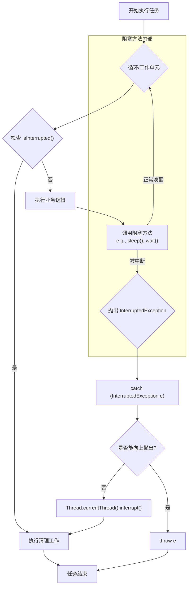

---

## 5. 不可中断的阻塞

需要特别注意的是，并非所有阻塞都能响应中断。例如，传统的`java.io`包中的同步 Socket I/O 和流 I/O 操作就是不可中断的。如果一个线程在这些操作上发生阻塞，那么`interrupt()`调用将对其完全无效。

对于这类场景，现代 Java（NIO）提供了`java.nio.channels.InterruptibleChannel`，其 I/O 操作可以响应中断。在进行技术选型时，应充分考虑这一点。

---

## 6. 自定义中断信令：`volatile` 与 `AtomicBoolean`

尽管 Java 内置的中断机制功能强大且是标准范式，但在某些特定场景下，资深开发者也会采用更轻量级的自定义信令来实现任务的取消。最常见的便是使用`volatile boolean`或`AtomicBoolean`作为协作标志。

### 6.1 `volatile boolean`：轻量级的可见性保证

`volatile`关键字能确保一个变量的修改对所有线程立即可见，这使其成为实现简单取消策略的理想选择。

**工作原理**:
一个`volatile`布尔标志位被所有相关线程共享。一个线程（通常是任务提交者）通过修改该标志位来发出取消信号，而工作线程则在其主循环中不断检查该标志位，以决定是否继续执行。

**案例分析**:

```java
class VolatileCancelTask implements Runnable {
    private volatile boolean cancelled = false;

    @Override
    public void run() {
        while (!cancelled) {
            // 执行任务...
            System.out.println("通过 volatile 标志位，任务执行中...");
        }
        System.out.println("检测到 volatile 标志位变动，任务取消。");
    }

    public void cancel() {
        this.cancelled = true;
    }
}
```

> **核心局限**：这种方式的最大缺点是**无法中断任何可响应`InterruptedException`的阻塞调用**（如`Thread.sleep()`, `BlockingQueue.take()`）。如果线程在这些方法上阻塞，它将无法检查`cancelled`标志，也就无法响应取消请求。因此，它仅适用于计算密集型循环或不涉及深度阻塞的场景。

### 6.2 `AtomicBoolean`：更具原子性的选择

`AtomicBoolean`提供了与`volatile boolean`相同的内存可见性保证，但将其封装在一个提供了原子操作（如`compareAndSet()`）的类中。虽然在简单的标志位检查场景下，其表现与`volatile`无异，但它通常被认为是更佳的工程实践，因为它更清晰地表达了"这是一个可能被多线程原子性操作的状态"的意图。

**案例分析**:

```java
import java.util.concurrent.atomic.AtomicBoolean;

class AtomicCancelTask implements Runnable {
    private final AtomicBoolean running = new AtomicBoolean(true);

    @Override
    public void run() {
        while (running.get()) {
            // 执行任务...
             System.out.println("通过 AtomicBoolean 标志位，任务执行中...");
        }
        System.out.println("检测到 AtomicBoolean 标志位变动，任务取消。");
    }

    public void cancel() {
        running.set(false);
    }
}
```

### 6.3 对比与选型考量

| 机制             | 优点                                       | 缺点                                         | 适用场景                                         |
| :--------------- | :----------------------------------------- | :------------------------------------------- | :----------------------------------------------- |
| **内置中断机制** | **标准范式**，能中断阻塞方法，生态整合度高 | 概念稍复杂，`InterruptedException`易被误处理 | **所有场景**，尤其是涉及阻塞操作的任务           |
| **自定义标志**   | 逻辑简单直观                               | **无法中断阻塞方法**，适用范围受限           | 计算密集型循环，或需要管理多个取消条件的复杂逻辑 |

**结论**：作为首选，应当始终使用 Java 的内置中断机制。它是一个经过深思熟虑的、通用的取消框架。只有在你完全清楚任务不会陷入深度阻塞，或者需要一个不依赖`InterruptedException`的简单取消标志时，才考虑使用`volatile`或`AtomicBoolean`作为补充。
```

## 来源 7: Fuwari / `JUC/LockSupport.md`

- 原始 URL: <https://github.com/DavidHLP/Fuwari/blob/07cee2baf9cee227807dcd68004c5f2493e5ac52/src/content/posts/JUC/LockSupport.md>
- 本地路径: `JUC/LockSupport.md`

```markdown
---
title: Java LockSupport 深度解析
published: 2025-06-26
description: 深度解析JUC底层的线程阻塞和唤醒工具LockSupport，阐明其核心API park/unpark 的"许可"工作机制，并与wait/notify、await/signal进行对比，展示其灵活和精准的线程调度能力。
tags: [Java, 并发编程, JUC, LockSupport, park, unpark, AQS]
category: JUC
draft: false
---

# Java LockSupport 深度解析

`LockSupport` 是 `java.util.concurrent.locks` 包下的一个底层工具类，用于提供基础的线程阻塞和唤醒功能。它是构建`java.util.concurrent` (JUC) 中众多同步组件（如 `ReentrantLock`）的核心基石。与 `Object` 的 `wait/notify` 机制相比，`LockSupport` 提供了更为灵活和精准的线程调度能力。

## LockSupport 核心 API: `park` 与 `unpark`

`LockSupport` 的核心功能由两个静态方法提供：`park()` 和 `unpark(Thread thread)`。它们实现了一种基于"许可（Permit）"的线程阻塞和唤醒机制。

- `park()`: 此方法用于阻塞当前线程。当一个线程调用 `park()` 时，它会检查其是否拥有一个"许可"。如果许可存在，该方法会消耗许可并立即返回。如果许可不存在，线程将进入阻塞状态，直到有其他线程为其发放许可。
- `unpark(Thread thread)`: 此方法用于向指定的目标线程 `thread` 发放一个"许可"。如果目标线程当前正因 `park()` 而阻塞，`unpark()` 会立即唤醒它。如果目标线程尚未阻塞，那么这个许可会被暂存，当该线程下一次调用 `park()` 时，会直接消耗许可并继续执行，而不会阻塞。

值得注意的是，每个线程最多只能持有一个许可，许可不会累积。连续多次调用 `unpark` 与调用一次的效果是完全相同的。

### 核心优势：解除时序耦合

`park/unpark` 模型最大的优势在于 `unpark` 可以先于 `park` 执行。这解决了 `wait/notify` 机制中必须先 `wait` 再 `notify` 的时序约束问题。如果 `notify` 先于 `wait` 执行，该通知信号将会丢失，导致线程无限等待。`LockSupport` 则通过许可机制避免了此问题。

以下序列图展示了 `park/unpark` 的两种典型交互场景：

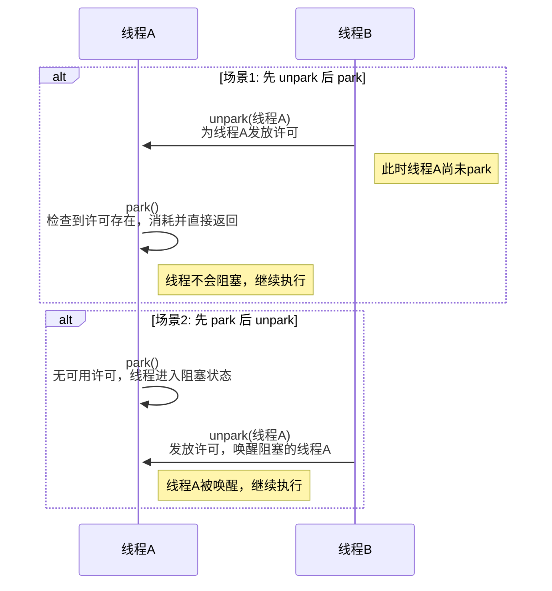

## `LockSupport` 与 `wait/notify` 的对比

| 特性         | LockSupport (`park`/`unpark`)          | Object (`wait`/`notify`)                            |
| :----------- | :------------------------------------- | :-------------------------------------------------- |
| **锁定要求** | 无需获取任何对象锁                     | 必须在 `synchronized` 代码块中调用                  |
| **目标性**   | `unpark` 可以精准唤醒**指定线程**      | `notify` 随机唤醒一个等待线程，`notifyAll` 唤醒所有 |
| **时序依赖** | 无时序要求，`unpark` **可先于** `park` | `notify` **必须后于** `wait` 调用，否则信号丢失     |
| **底层实现** | 基于 `sun.misc.Unsafe` 中的本地方法    | JVM 内置实现，与对象监视器（Monitor）紧密耦合       |

`LockSupport` 的设计使其在实现线程同步时更加灵活，因为它不与任何锁进行绑定。然而，`wait/notify` 结合 `synchronized` 能够确保条件检查与线程等待/唤醒操作的原子性，这在某些并发场景下是必要的。

### `wait/notify` 编码实践

`wait()` 和 `notify()` 是 `Object` 类的基础方法，必须在 `synchronized` 块中与对象监视器锁（monitor lock）一同使用。

下面的例子模拟了一个简单的生产者-消费者场景，通过一个共享的`message`变量进行通信。

```java
public class WaitNotifyExample {

    private final Object lock = new Object();
    private String message;
    private boolean hasMessage = false;

    public void produce(String message) {
        synchronized (lock) {
            // 如果已有消息，则等待消费者消费
            while (hasMessage) {
                try {
                    System.out.println("生产者等待中...");
                    lock.wait();
                } catch (InterruptedException e) {
                    Thread.currentThread().interrupt();
                    e.printStackTrace();
                }
            }
            // 生产消息
            this.message = message;
            this.hasMessage = true;
            System.out.println("生产了消息: " + message);
            // 通知一个等待的消费者
            lock.notify();
        }
    }

    public String consume() {
        synchronized (lock) {
            // 如果没有消息，则等待生产者生产
            while (!hasMessage) {
                try {
                    System.out.println("消费者等待中...");
                    lock.wait();
                } catch (InterruptedException e) {
                    Thread.currentThread().interrupt();
                    e.printStackTrace();
                }
            }
            // 消费消息
            String consumedMessage = this.message;
            System.out.println("消费了消息: " + consumedMessage);
            this.hasMessage = false;
            // 通知一个等待的生产者
            lock.notify();
            return consumedMessage;
        }
    }

    public static void main(String[] args) {
        WaitNotifyExample example = new WaitNotifyExample();

        Thread producer = new Thread(() -> {
            for (int i = 0; i < 5; i++) {
                example.produce("Message " + i);
                try {
                    Thread.sleep(1000); // 模拟生产耗时
                } catch (InterruptedException e) {
                    e.printStackTrace();
                }
            }
        }, "Producer");

        Thread consumer = new Thread(() -> {
            for (int i = 0; i < 5; i++) {
                example.consume();
                 try {
                    Thread.sleep(1500); // 模拟消费耗时
                } catch (InterruptedException e) {
                    e.printStackTrace();
                }
            }
        }, "Consumer");

        producer.start();
        consumer.start();
    }
}
```

## `LockSupport` 与 `await/signal` 的对比

`await/signal` 是 `Condition` 接口的核心方法，通常与 `ReentrantLock` 配合使用，可视为 `wait/notify` 的增强版。

| 特性         | LockSupport (`park`/`unpark`)                      | Condition (`await`/`signal`)                                |
| :----------- | :------------------------------------------------- | :---------------------------------------------------------- |
| **锁定要求** | 无需获取任何锁                                     | 必须在 `Lock` 接口实现的锁保护下调用                        |
| **抽象层次** | **更底层**的线程原语，是 `await/signal` 的实现基础 | **更高层**的抽象，提供了更丰富的等待/唤醒模式               |
| **功能性**   | 仅提供单一的"许可"机制                             | 支持创建多个 `Condition` 对象，实现多路条件等待和选择性唤醒 |

可以认为，`LockSupport` 是构成 JUC 同步框架的原子构建块。在 `AbstractQueuedSynchronizer` (AQS) 的实现中，当需要将线程置于等待队列并阻塞时，其底层调用的正是 `LockSupport.park()`。

### `await/signal` 编码实践

`await()` 和 `signal()` 是 `Condition` 接口的方法，它与 `Lock` （通常是 `ReentrantLock`）配合使用，提供了比 `wait/notify` 更强大和灵活的线程协作能力。一个 `Lock` 可以关联多个 `Condition` 对象，实现更精细的线程等待与唤醒控制。

下面的例子使用 `ReentrantLock` 和 `Condition` 重写了上面的生产者-消费者场景。

```java
import java.util.concurrent.locks.Condition;
import java.util.concurrent.locks.Lock;
import java.util.concurrent.locks.ReentrantLock;

public class AwaitSignalExample {

    private final Lock lock = new ReentrantLock();
    private final Condition condition = lock.newCondition();
    private String message;
    private boolean hasMessage = false;

    public void produce(String message) {
        lock.lock();
        try {
            // 如果已有消息，则等待消费者消费
            while (hasMessage) {
                try {
                    System.out.println("生产者等待中...");
                    condition.await();
                } catch (InterruptedException e) {
                    Thread.currentThread().interrupt();
                    e.printStackTrace();
                }
            }
            // 生产消息
            this.message = message;
            this.hasMessage = true;
            System.out.println("生产了消息: " + message);
            // 通知一个等待的消费者
            condition.signal();
        } finally {
            lock.unlock();
        }
    }

    public String consume() {
        lock.lock();
        try {
            // 如果没有消息，则等待生产者生产
            while (!hasMessage) {
                try {
                    System.out.println("消费者等待中...");
                    condition.await();
                } catch (InterruptedException e) {
                    Thread.currentThread().interrupt();
                    e.printStackTrace();
                }
            }
            // 消费消息
            String consumedMessage = this.message;
            System.out.println("消费了消息: " + consumedMessage);
            this.hasMessage = false;
            // 通知一个等待的生产者
            condition.signal();
            return consumedMessage;
        } finally {
            lock.unlock();
        }
    }

    public static void main(String[] args) {
        AwaitSignalExample example = new AwaitSignalExample();

        Thread producer = new Thread(() -> {
            for (int i = 0; i < 5; i++) {
                example.produce("Message " + i);
                try {
                    Thread.sleep(1000); // 模拟生产耗时
                } catch (InterruptedException e) {
                    e.printStackTrace();
                }
            }
        }, "Producer");

        Thread consumer = new Thread(() -> {
            for (int i = 0; i < 5; i++) {
                example.consume();
                 try {
                    Thread.sleep(1500); // 模拟消费耗时
                } catch (InterruptedException e) {
                    e.printStackTrace();
                }
            }
        }, "Consumer");

        producer.start();
        consumer.start();
    }
}
```

## `LockSupport` 编码实践

### 场景一：先 `park`，后 `unpark`

该示例演示了主线程在 2 秒后唤醒一个已阻塞的子线程。

```java
import java.util.concurrent.locks.LockSupport;

public class LockSupportExample {

    public static void main(String[] args) {
        Thread targetThread = new Thread(() -> {
            System.out.println(Thread.currentThread().getName() + " - is ready to park.");
            // 调用park()，线程将在此处阻塞
            LockSupport.park();
            System.out.println(Thread.currentThread().getName() + " - has been unparked.");
        }, "TargetThread");

        targetThread.start();

        try {
            // 确保子线程先执行并进入park状态
            Thread.sleep(2000);
        } catch (InterruptedException e) {
            Thread.currentThread().interrupt();
            e.printStackTrace();
        }

        System.out.println("Main thread is about to unpark TargetThread...");
        // 主线程调用unpark唤醒目标线程
        LockSupport.unpark(targetThread);
    }
}
```

**预期输出:**

```
TargetThread - is ready to park.
Main thread is about to unpark TargetThread...
TargetThread - has been unparked.
```

### 场景二：先 `unpark`，后 `park`

此示例展示 `unpark` 先于 `park` 执行，线程不会阻塞的场景。

```java
import java.util.concurrent.locks.LockSupport;

public class LockSupportUnparkFirst {
    public static void main(String[] args) {
        Thread targetThread = new Thread(() -> {
            try {
                // 等待3秒，确保主线程的unpark先执行
                Thread.sleep(3000);
            } catch (InterruptedException e) {
                Thread.currentThread().interrupt();
                e.printStackTrace();
            }
            System.out.println(Thread.currentThread().getName() + " - is ready to park.");
            // 由于许可已提前发放，此处的park()将直接返回，不会阻塞
            LockSupport.park();
            System.out.println(Thread.currentThread().getName() + " - park finished without blocking.");
        }, "TargetThread");

        targetThread.start();

        System.out.println("Main thread grants a permit to TargetThread in advance...");
        // 提前为目标线程发放许可
        LockSupport.unpark(targetThread);
    }
}
```

**预期输出:**

```
Main thread grants a permit to TargetThread in advance...
TargetThread - is ready to park.
TargetThread - park finished without blocking.
```

以上实践清晰地展示了 `LockSupport` 的核心行为和相较于传统线程协作机制的优势。在构建自定义同步器或需要对线程进行精细化控制时，`LockSupport` 是一个强大而高效的工具。
```

## 来源 8: Fuwari / `JUC/LongAdderVSAtomicLong.md`

- 原始 URL: <https://github.com/DavidHLP/Fuwari/blob/07cee2baf9cee227807dcd68004c5f2493e5ac52/src/content/posts/JUC/LongAdderVSAtomicLong.md>
- 本地路径: `JUC/LongAdderVSAtomicLong.md`

```markdown
---
title: "LongAdder VS AtomicLong"
published: 2025-07-11
description: "在Java并发编程中，AtomicLong曾是线程安全计数的首选。但自Java 8起，LongAdder以其卓越的高并发性能崭露头角。本文从核心原理、内部结构到性能表现，深入剖析两者的对决，并揭示LongAdder如何通过“化整为零，分散热点”的设计思想。"
tags: [Java, JUC, Atomic, LongAdder, Performance]
category: JUC
draft: false
---

## 1. `AtomicLong`的“独木桥”困境：热点竞争的根源

在 Java 5 引入`java.util.concurrent.atomic`包后，`AtomicLong`迅速成为实现线程安全计数器的标准方案。它基于现代处理器提供的 CAS（Compare-and-Swap）原子指令，实现了一种无锁的、比`synchronized`更为轻量级的并发更新机制。

`AtomicLong`的内部设计极其简洁：一个核心的`volatile long value`字段。所有操作，如`incrementAndGet()`，都围绕这个单一的共享变量展开。

```java
// AtomicLong.incrementAndGet() 的简化逻辑
public final long incrementAndGet() {
    while (true) { // 无限循环，即“自旋”
        long current = get(); // 读取当前值
        long next = current + 1; // 计算期望值
        if (compareAndSet(current, next)) // CAS尝试更新
            return next; // 成功则返回
    }
}
```

在低到中等并发场景下，这种模式高效且优雅。然而，当成百上千的线程同时涌入，试图更新**这同一个`value`**时，灾难便发生了。这就像千军万马试图通过一座独木桥：

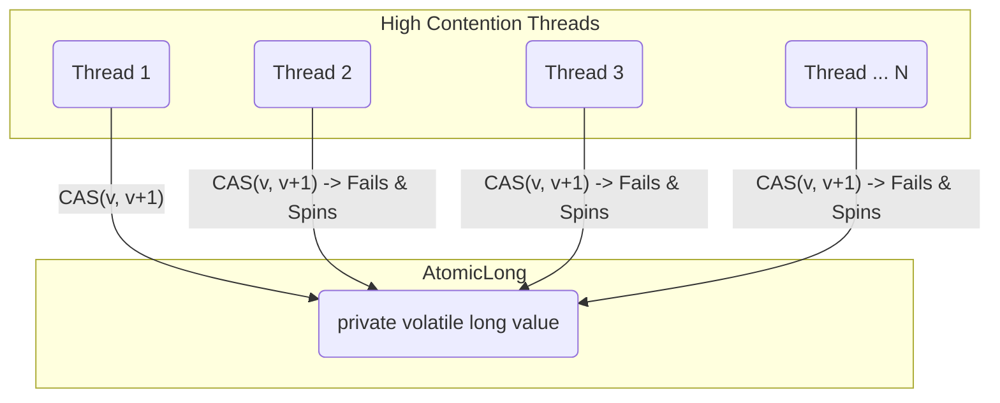

在高并发下，只有一个线程的 CAS 操作能够侥幸成功。其余所有线程的`compareAndSet`都会因值已被修改而失败，进而被迫进入下一次自旋，重新读取、计算、尝试。这引发了剧烈的**热点竞争（Hotspot Contention）**。CPU 的大量时钟周期被浪费在这些无效的自旋重试上，导致`AtomicLong`的吞吐量随着线程数的增加不升反降，成为系统的性能瓶颈。

## 2. `LongAdder`的破局之道：“分而治之”的设计哲学

为了解决`AtomicLong`的扩展性问题，J.U.C.大师 Doug Lea 在 Java 8 中引入了`LongAdder`。它并非对`AtomicLong`的小修小补，而是一次彻头彻尾的设计思想变革，其核心是：**分散热点，空间换时间**。

`LongAdder`放弃了对单一共享变量的执着，转而采用一种更为复杂的内部结构：

- **`base`**：一个`volatile long`类型的字段。在无竞争或低竞争时，它扮演着`AtomicLong`的角色，线程会优先尝试直接 CAS 更新它。
- **`Cell[] cells`**：一个`Cell`对象的数组，同样是`volatile`的。当`base`的竞争变得激烈时，这里便是主战场。

<!-- end list -->

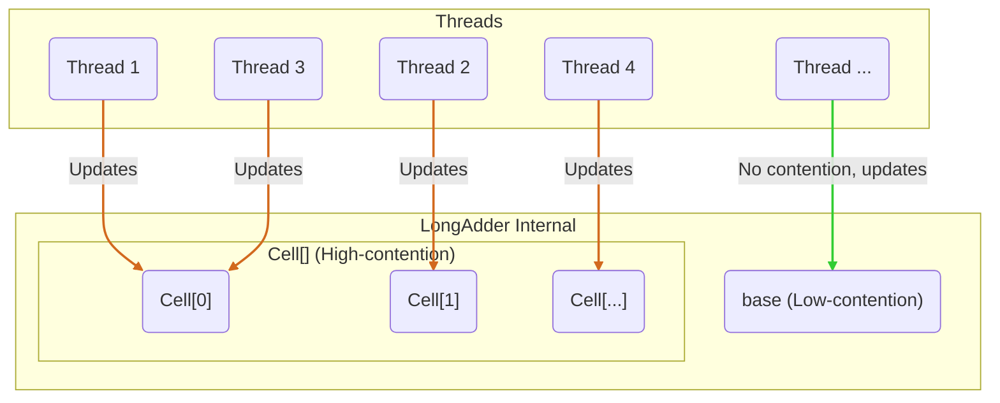

#### 关键细节：`Cell`与伪共享（False Sharing）

`Cell`并非简单的`long`包装类。它是`Striped64`（`LongAdder`的父类）中的一个静态内部类，其设计精髓在于**避免伪共享**。

> **伪共享（False Sharing）**：现代 CPU 的缓存系统以缓存行（Cache Line，通常为 64 字节）为单位加载数据。如果多个线程操作的独立变量恰好位于同一个缓存行中，那么一个线程对其中一个变量的修改会导致整个缓存行失效，从而强制其他线程重新从主内存加载数据，即使它们关心的是该缓存行中的其他变量。这种因缓存行而非数据本身的竞争，就是伪共享，它会严重拖累性能。

`Cell`通过`@sun.misc.Contended`注解（或在旧版 JDK 中手动进行字节填充）来确保每个`Cell`对象都占据独立的缓存行。这样，不同线程对不同`Cell`的更新就不会产生缓存一致性流量的互相干扰，真正做到了物理隔离。

## 3. `add()` 与 `sum()` 的非对称之旅

`LongAdder`的核心逻辑体现在其`add()`和`sum()`方法的截然不同的实现上。

### `add(long x)`: 一次智能的更新分发

当一个线程调用`add()`时，它会经历一个精心设计的流程：

1.  **快速通道（Fast Path）**：首先，检查`cells`数组是否存在。如果为`null`（意味着尚无竞争或竞争刚开始），则直接尝试 CAS 更新`base`字段。如果成功，操作结束。这是为低并发场景优化的路径，开销极小。
2.  **竞争出现（Contention Path）**：如果`base`的 CAS 失败，或者`cells`数组已经存在，说明竞争已经发生。此时，系统进入分流逻辑。
3.  **定位`Cell`**：线程会根据自身的`ThreadLocalRandom`探针值（probe）进行哈希计算，映射到`cells`数组的一个槽位（slot）上。
4.  **更新`Cell`**：
    - 如果槽位不为`null`，则直接 CAS 更新这个`Cell`的值。由于不同线程的探针值不同，它们大概率会命中不同的`Cell`，从而将竞争分散。
    - 如果槽位为`null`，则需要初始化一个新的`Cell`放入该槽位。
    - 如果对`Cell`的 CAS 也失败了（意味着多个线程哈希到同一个`Cell`），或者需要初始化`Cell`，系统会进入一个更复杂的`longAccumulate`方法。
5.  **动态扩容与重试**：在`longAccumulate`方法中，`LongAdder`会尝试重新哈希（改变线程的探针值）来寻找一个空闲的`Cell`。如果所有`Cell`都处于竞争状态，并且数组尚未达到 CPU 核心数的限制，它会**对`cells`数组进行双倍扩容**，以容纳更多的并发，进一步降低单个`Cell`的冲突概率。

### `sum()`: 延迟的全局求和

与`add()`的复杂分流相比，`sum()`的逻辑很直接但代价更高：

```java
public long sum() {
    long sum = base;
    Cell[] as = cells;
    if (as != null) {
        for (Cell cell : as) {
            if (cell != null) {
                sum += cell.value;
            }
        }
    }
    return sum;
}
```

它需要遍历`base`和`cells`数组中的每一个`Cell`，并将它们的值累加起来，最终返回全局总和。

**重要的一致性说明**：`sum()`在执行期间，其他线程可能仍在并发地更新`base`或`Cell`。因此，`sum()`返回的是一个**非原子快照（Non-atomic Snapshot）**的最终一致性结果。它不保证是调用瞬间的精确值，但在没有并发更新的静止状态下，其结果是准确的。对于绝大多数统计场景（如 QPS、交易量），这种弱一致性是完全可以接受的。

## 4. 资深开发者的决策矩阵：何时用，为何用？

| 特性 / 场景         | `AtomicLong`                                                          | `LongAdder`                                                               |
| :------------------ | :-------------------------------------------------------------------- | :------------------------------------------------------------------------ |
| **核心哲学**        | **集中式乐观锁**：简单、直接，依赖 CAS。                              | **分段锁思想**：空间换时间，分散竞争。                                    |
| **高并发写入**      | **性能瓶颈**：竞争加剧，吞吐量下降。                                  | **性能卓越**：吞吐量随线程数线性扩展。                                    |
| **读取性能/一致性** | **极快且强一致**：`get()`是单次 volatile 读，返回精确快照。           | **较慢且弱一致**：`sum()`需遍历求和，非精确快照。                         |
| **内存占用**        | **极低**：仅一个`long`的开销。                                        | **较高**：一个`base` + 一个`Cell`数组（及缓存行填充）。                   |
| **依赖关系**        | **独立原子值**：适用于需要`getAndIncrement`等操作返回更新后值的场景。 | **纯粹累加器**：设计上只关注`add`和最终的`sum`，没有`getAndAdd`这类操作。 |

**实战场景抉择：**

- **选择 `LongAdder` 的场景：**

  - **高并发统计指标**：这是`LongAdder`的“主场”。例如，记录 Web 服务器的 QPS、RPC 框架的调用次数、应用的请求处理数等。这类场景的特点是**极高的写入频率，而读取频率远低于写入**（例如，监控系统每隔几秒才读取一次总和）。
  - **对瞬时值的精确性要求不高**：只需要一个最终一致的统计总数。

- **坚持 `AtomicLong` 的场景：**

  - **需要依赖原子更新后的返回值做业务逻辑**：例如，生成全局唯一的序列号（`incrementAndGet()`）。`LongAdder`没有提供类似的方法，因为它无法在分散更新后原子性地返回准确的总和。
  - **低并发或竞争不激烈的环境**：如果你的并发线程数可预见地很低（例如，几个到十几个），`AtomicLong`的性能完全足够，且更简单、内存占用更低。避免过度设计。
  - **需要强一致性的读操作**：当计数器的值需要被频繁地、准确地读取并用于判断逻辑时，例如用作一个资源池的可用数量判断，`AtomicLong.get()`的低延迟和强一致性是必需的。

## 5. 结论：工具之别，亦是哲学之别

`AtomicLong`和`LongAdder`的对决，与其说是 API 的选择，不如说是并发设计哲学的碰撞。

- `AtomicLong`是**通用、简单、直接**的方案，它忠实于 CAS 的乐观锁思想，在广阔的非极端并发场景下表现良好。
- `LongAdder`则是**特化、极致、精妙**的方案，它深刻理解了硬件层面的瓶颈（热点竞争、伪共享），并创造性地通过分而治之的思想，用内存空间和读取一致性的微小妥协，换来了无与伦比的写入吞吐量。它是对“机械共鸣（Mechanical Sympathy）”理念的完美诠释。

作为开发者，理解它们背后的设计哲学，能让我们在面对具体问题时，做出更深刻、更合理的选择。在 J.U.C 的世界里，没有绝对的“银弹”，只有最适合当前场景的“利器”。而`LongAdder`及其家族成员（如`DoubleAdder`, `LongAccumulator`）无疑是处理高并发累加场景下最锋利的那一把。
```

## 来源 9: Fuwari / `JUC/Monitor.md`

- 原始 URL: <https://github.com/DavidHLP/Fuwari/blob/07cee2baf9cee227807dcd68004c5f2493e5ac52/src/content/posts/JUC/Monitor.md>
- 本地路径: `JUC/Monitor.md`

```markdown
---
title: 深入剖析Java管程（Monitor）
published: 2025-06-26
description: 深入剖析Java并发编程的核心基石——管程（Monitor），从HotSpot虚拟机的ObjectMonitor源码实现出发，揭示synchronized关键字背后的完整工作流程
tags: [Java, 并发编程, 管程, Monitor, synchronized, ObjectMonitor, HotSpot]
category: JUC
draft: false
---

# 深入剖析 Java 管程（Monitor）

> 本文旨在深入剖析 Java 并发编程的核心基石——管程（Monitor）。对于任何期望精通 Java 并发、进行性能调优或解决复杂并发问题的资深开发者而言，透彻理解管程的底层实现机制至关重要。本文将从 HotSpot 虚拟机的`ObjectMonitor`源码实现出发，层层递进，揭示`synchronized`关键字背后的完整工作流。

---

## 1. 管程的本质

管程并非 Java 独创，它是一种经典的并发编程原语，其设计目标在于简化并发控制，将共享资源的**互斥（Mutual Exclusion）**和线程间的**协作（Cooperation）**进行统一封装。

- **互斥**：确保临界区（Critical Section）代码在同一时刻只被一个线程执行。
- **协作**：提供条件变量（Condition Variables），允许线程在特定条件不满足时挂起等待（`wait`），并在条件满足后被其他线程唤醒（`notify`/`notifyAll`）。

Java 将这一模型深度集成到语言中，每个 Java 对象实例都内建一个监视器（Monitor）。这一设计使得任何对象都能天然地充当锁的角色，而`synchronized`关键字，正是激活和使用管程最直接的手段。

---

## 2. HotSpot 虚拟机中的管程实现：`ObjectMonitor`

当`synchronized`作用于一个对象时，JVM 内部会将其与一个`ObjectMonitor`实例关联。这一过程涉及从 Java 代码到 JVM 本地接口，最终到 HotSpot C++源码的调用链路。

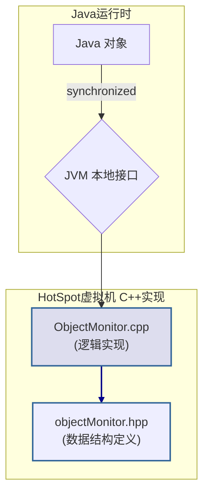

> **架构须知**：JVM 为优化性能，引入了锁升级（Lock Escalation）机制。一个对象锁会经历 **偏向锁 -> 轻量级锁 -> 重量级锁** 的状态流转。`ObjectMonitor`正是重量级锁的实现，仅在多线程竞争加剧、锁“膨胀”后才会被实例化。此时，对象头（Mark Word）的数据将转变为一个指向`ObjectMonitor`实例的指针。

`objectMonitor.hpp`中定义了其关键数据结构（已简化）：

```cpp
class ObjectMonitor {
volatile void* _owner;     // 指向当前持有锁的线程
volatile jint  _count;     // 锁的重入计数
Object*        _object;     // 关联的Java对象实例
WaitSet*       _WaitSet;    // 条件等待队列 (调用wait()的线程宿主)
cxq*           _EntryList;  // 互斥竞争队列 (阻塞等待锁的线程宿主)
...
};
```

---

## 3. `ObjectMonitor`核心工作流剖析

`ObjectMonitor`的并发调度核心在于其内部的两个队列：`_EntryList` 和 `_WaitSet`。前者负责管理因竞争锁而阻塞的线程，后者负责管理调用了`Object.wait()`的线程。

下图展示了一个线程在`ObjectMonitor`中完整的生命周期状态转换：

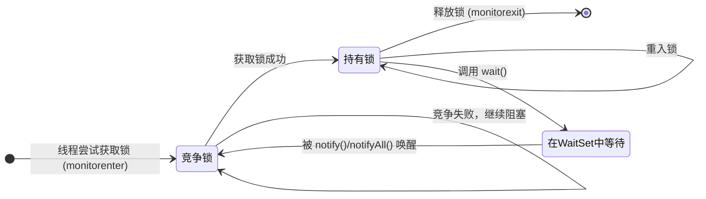

- **获取锁 (`monitorenter`)**:

  1.  线程尝试通过原子 CAS（Compare-and-Swap）操作将`_owner`字段更新为自身指针。
  2.  若更新成功，则获得锁。若对象锁是重入的，则递增`_count`计数器。
  3.  若 CAS 失败，表明锁已被其他线程持有。当前线程将被封装成`ObjectWaiter`节点，加入到`_EntryList`中，并调用底层`park()`原语挂起自身，等待唤醒。

- **释放锁 (`monitorexit`)**:

  1.  持有者线程递减`_count`。若`_count`归零，则退出临界区。
  2.  将`_owner`字段置为`null`。
  3.  根据特定的唤醒策略（JVM 实现相关），从`_EntryList`中唤醒一个等待的线程（`unpark`），使其重新参与锁竞争。

- **条件等待 (`wait`/`notify`)**:
  1.  **`wait()`**: 线程必须先持有锁。调用后，线程会释放锁（`_owner`置`null`），并被封装后加入`_WaitSet`队列挂起。
  2.  **`notify()`/`notifyAll()`**: 线程必须持有锁。调用后，JVM 会从`_WaitSet`中移动一个或所有线程节点到`_EntryList`中，使其状态从条件等待转为锁竞争。这些被唤醒的线程并不会直接获得锁，而是需要重新竞争。

---

## 4. 经典用例：生产者-消费者模型

该模型是展示管程互斥与协作能力的绝佳范例。

```java
// Buffer.java - A thread-safe buffer using intrinsic locks
import java.util.LinkedList;
import java.util.Queue;

class Buffer {
    private final Queue<Integer> queue = new LinkedList<>();
    private final int CAPACITY = 5;

    public synchronized void put(int val) throws InterruptedException {
        while (queue.size() == CAPACITY) {
            // Condition not met, release lock and wait
            wait();
        }
        queue.offer(val);
        // Notify waiting consumers that state has changed
        notifyAll();
    }

    public synchronized int take() throws InterruptedException {
        while (queue.isEmpty()) {
            // Condition not met, release lock and wait
            wait();
        }
        int v = queue.poll();
        // Notify waiting producers that state has changed
        notifyAll();
        return v;
    }
}
```

### 执行流程分析

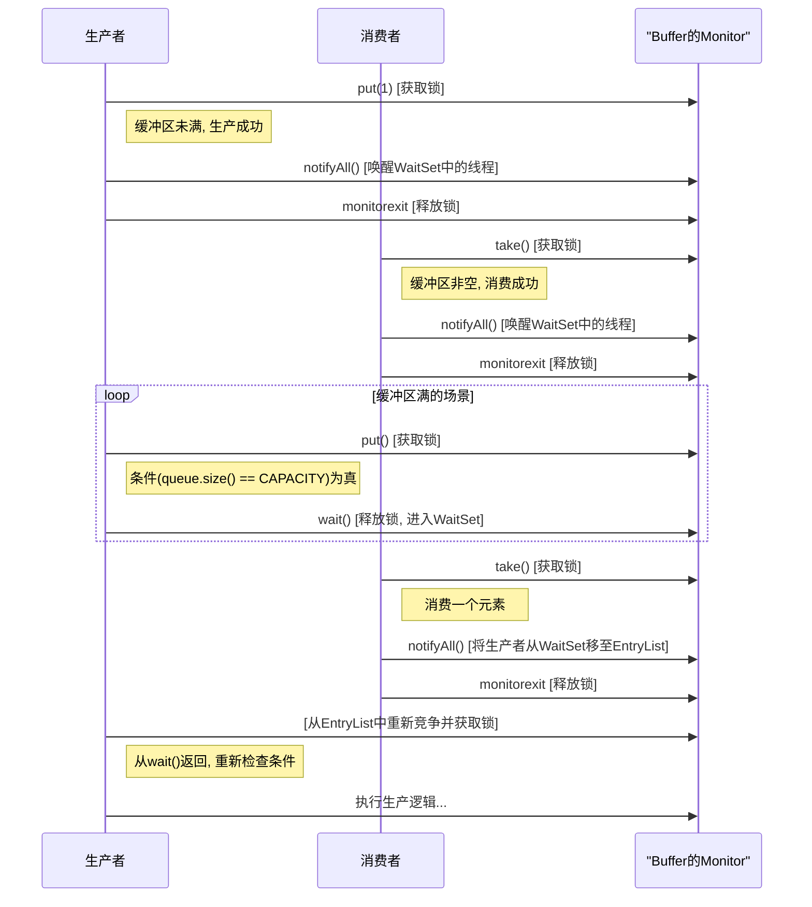

---

## 5. `synchronized` vs. `ReentrantLock`：架构选型考量

虽然内置管程(`synchronized`)简洁高效，但`java.util.concurrent`框架提供了`ReentrantLock`作为其替代。二者的选型需基于具体业务场景的复杂度、性能需求和功能要求进行权衡。

| 特性           | `synchronized` / 内置管程                   | `ReentrantLock` + `Condition`                        |
| :------------- | :------------------------------------------ | :--------------------------------------------------- |
| **API 层面**   | 语言关键字，由 JVM 隐式管理锁的获取与释放   | 需要在`finally`块中显式调用`unlock()`，易出错        |
| **公平性策略** | **非公平锁**，无法更改                      | 可在构造时选择**公平**或**非公平**（默认）           |
| **中断与超时** | 等待锁时**不可中断**，无超时机制            | `lockInterruptibly()`和`tryLock()`提供中断和超时能力 |
| **条件队列**   | **单一**条件队列 (`WaitSet`)                | 可通过`newCondition()`创建**多个**独立的条件队列     |
| **性能**       | Java 1.6 后，经锁膨胀、自旋等优化，性能很高 | 在高竞争下，配合特定功能（如公平性）时，展现优势     |

---
```

## 来源 10: Fuwari / `JUC/Reentrancy.md`

- 原始 URL: <https://github.com/DavidHLP/Fuwari/blob/07cee2baf9cee227807dcd68004c5f2493e5ac52/src/content/posts/JUC/Reentrancy.md>
- 本地路径: `JUC/Reentrancy.md`

```markdown
---
title: 深入解析 Java 可重入锁 (Reentrancy)
published: 2025-06-26
description: 深度剖析Java可重入锁，阐明其工作原理、`synchronized`与`ReentrantLock`的实现方式，以及在复杂并发场景中的应用价值和如何防止死锁。
tags: [Java, 并发编程, 可重入锁, Reentrancy, synchronized, ReentrantLock, AQS]
category: JUC
draft: false
---

# 深入解析 Java 可重入锁 (Reentrancy)

> 在 Java 并发编程领域，锁的可重入性（Reentrancy）是一个基础且至关重要的特性。它不仅是`synchronized`关键字和`ReentrantLock`实现的核心性质，更是编写健壮、无死锁并发代码的基石。本文旨在为资深开发者提供一个关于 Java 可重入锁的深度剖析，阐明其工作原理、实现方式及在复杂场景下的应用价值。

---

## 1. 什么是锁的可重入性？

**可重入性**，又称递归性（Recursion），指的是**同一个线程在已经持有某个锁的情况下，能够再次成功获取该锁而不会被阻塞（即不会发生死锁）**。

从更高维度看，可重入锁允许线程在持有锁的同步代码块中，自由调用其他需要同一把锁的同步方法。如果锁不具备可重入性，那么这种调用就会导致线程尝试获取自己已经持有的锁，从而引发死锁。

---

## 2. 可重入锁的实现原理

可重入锁的实现核心在于两个关键要素：

1.  **锁的持有者（Owner）**：一个用于记录当前是哪个线程持有该锁的标识。
2.  **持有计数器（Hold Count）**：一个整数，用于记录当前线程持有该锁的次数。

其工作流如下：

- **获取锁 (Acquisition)**:

  1.  当一个线程尝试获取锁时，系统首先检查锁的持有者。
  2.  如果锁未被任何线程持有，则将持有者设为当前线程，并将计数器置为 1。
  3.  如果锁已被**当前线程**持有，则简单地将计数器加 1。
  4.  如果锁已被**其他线程**持有，则当前线程被阻塞，进入等待状态。

- **释放锁 (Release)**:
  1.  当持有锁的线程请求释放锁时，它必须是当前的锁持有者。
  2.  线程将持有计数器减 1。
  3.  只有当计数器**归零**时，该线程才真正释放锁，将持有者置为`null`，并唤醒其他等待该锁的线程。

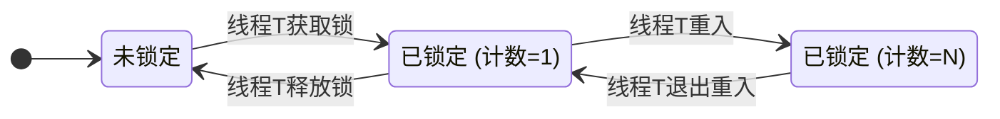

---

## 3. Java 中的可重入锁实现

Java 平台主要提供了两种内置的可重入锁实现。

### 3.1 `synchronized`：隐式的可重入锁

`synchronized`是 Java 语言层面的关键字，其可重入性是由 JVM 在底层隐式保证的，开发者无需介入。每个对象监视器（Monitor）内部都维护着类似于持有者和计数器的机制。

#### 底层原理：`monitorenter`/`monitorexit`

`synchronized`同步代码块在编译后会生成`monitorenter`和`monitorexit`两条字节码指令。JVM 通过这两条指令来执行加锁与解锁操作，其内部的可重入逻辑遵循以下规则：

- **执行 `monitorenter` 时**:

  1.  每个锁对象都关联一个锁计数器和一个指向持有者线程的指针。
  2.  如果锁计数器为零，代表该锁未被持有。JVM 会将其持有者设置为当前线程，并将计数器加 1。
  3.  如果锁计数器不为零，JVM 会检查其持有者是否为当前线程。如果是，则简单地将计数器加 1（实现重入）；如果不是，则当前线程必须阻塞等待，直到持有者释放该锁。

- **执行 `monitorexit` 时**:
  1.  JVM 会将锁计数器减 1。
  2.  当计数器归零时，锁被完全释放，持有者被清空。

这种基于计数器的机制，确保了线程可以安全地多次进入由同一把锁保护的同步代码块。

**案例分析**:

```java
public class SynchronizedReentrancyDemo {

    public synchronized void outerMethod() {
        System.out.println(Thread.currentThread().getName() + ": 进入 outerMethod");
        // 调用另一个需要相同锁的方法
        innerMethod();
        System.out.println(Thread.currentThread().getName() + ": 即将离开 outerMethod");
    }

    public synchronized void innerMethod() {
        System.out.println(Thread.currentThread().getName() + ": 进入 innerMethod");
        // ...
        System.out.println(Thread.currentThread().getName() + ": 即将离开 innerMethod");
    }

    public static void main(String[] args) {
        SynchronizedReentrancyDemo demo = new SynchronizedReentrancyDemo();
        new Thread(demo::outerMethod, "T1").start();
    }
}
```

在上述代码中，`outerMethod`和`innerMethod`都由`this`对象锁保护。当线程 T1 调用`outerMethod`时，它获取了`demo`对象的锁。在`outerMethod`内部，它接着调用`innerMethod`。由于`synchronized`是可重入的，T1 能够再次成功获取`demo`对象的锁，而不会阻塞。如果`synchronized`不具备可重入性，T1 在调用`innerMethod`时会永久等待自己释放锁，从而导致死锁。

### 3.2 `ReentrantLock`：显式的可重入锁

`ReentrantLock`是 J.U.C 包提供的`Lock`实现，它明确地以"Reentrant"（可重入）命名，并提供了比`synchronized`更强大的功能。其内部同步机制基于 AQS，通过维护`state`（持有计数）和`exclusiveOwnerThread`（持有者）来实现可重入。

**案例分析**:

```java
import java.util.concurrent.locks.ReentrantLock;

public class ReentrantLockDemo {
    private final ReentrantLock lock = new ReentrantLock();

    public void outerMethod() {
        lock.lock(); // 获取锁
        try {
            System.out.println(Thread.currentThread().getName() + ": 进入 outerMethod");
            innerMethod();
            System.out.println(Thread.currentThread().getName() + ": 即将离开 outerMethod");
        } finally {
            lock.unlock(); // 释放锁
        }
    }

    public void innerMethod() {
        lock.lock(); // 重入
        try {
            System.out.println(Thread.currentThread().getName() + ": 进入 innerMethod");
        } finally {
            lock.unlock(); // 对应重入的释放
        }
    }

    public static void main(String[] args) {
        ReentrantLockDemo demo = new ReentrantLockDemo();
        new Thread(demo::outerMethod, "T1").start();
    }
}
```

此处的行为与`synchronized`版本完全一致。`lock.lock()`和`lock.unlock()`的调用必须严格成对出现。每次`lock()`调用（无论是初次获取还是重入）都应在`finally`块中对应一次`unlock()`调用，以确保锁的最终释放。

---

## 4. 可重入性的实践意义

- **防止死锁**：这是可重入性最直接的价值。它允许在一个同步方法中安全地调用另一个使用相同锁的同步方法或代码块，这在复杂的面向对象设计（如继承、组合）中非常常见。
- **代码封装与复用**：开发者可以放心地将一些通用的同步逻辑封装在独立的方法中，然后在其他同步方法中调用，而无需担心锁的问题。
- **提升代码可读性**：无需在代码中绕过或规避因重入可能导致的死锁问题，使并发代码的逻辑更加直观和易于维护。

## 总结

可重入性是 Java 并发锁模型中的一个基础而关键的设计。它通过"锁持有者"和"持有计数"的机制，优雅地解决了线程在自身执行流中重复获取同一把锁时可能导致的死锁问题。无论是隐式的`synchronized`还是显式的`ReentrantLock`，都内建了这一重要特性。对于 Java 开发者而言，深刻理解并善用锁的可重入性，是编写高效、安全、可维护的并发程序的必备技能。
```

## 来源 11: Fuwari / `JUC/ReentrantLock.md`

- 原始 URL: <https://github.com/DavidHLP/Fuwari/blob/07cee2baf9cee227807dcd68004c5f2493e5ac52/src/content/posts/JUC/ReentrantLock.md>
- 本地路径: `JUC/ReentrantLock.md`

```markdown
---
title: ReentrantLock 深度解析：公平性与性能的权衡
published: 2025-06-26
description: 深度解析JUC中的ReentrantLock，重点探讨其公平与非公平两种策略的AQS底层实现、对性能和线程饥饿的影响，并提供架构选型建议。
tags: [Java, 并发编程, JUC, ReentrantLock, AQS, 公平锁, 非公平锁]
category: JUC
draft: false
---

# ReentrantLock 深度解析：公平性与性能的权衡

> 本文旨在为资读者提供一份关于`ReentrantLock`的深度解析，重点探讨其公平性策略（Fairness Policy）对并发行为及系统性能的影响。理解这两种策略的底层机制是进行高性能并发库选型与调优的关键。

---

## 1. `ReentrantLock` 核心特性

`ReentrantLock`是 J.U.C（`java.util.concurrent`）包中提供的`Lock`接口的一个强大实现，相较于内置锁`synchronized`，它提供了更丰富的控制能力和扩展性：

- **可中断的锁获取** (`lockInterruptibly()`): 允许等待锁的线程响应中断。
- **带超时的锁获取** (`tryLock(long, TimeUnit)`): 避免线程无限期等待，有效防止死锁。
- **可选择的公平策略**: 构造时可指定锁是公平的还是非公平的，这是`ReentrantLock`的核心设计之一。
- **条件变量支持** (`newCondition()`): 可关联多个`Condition`对象，实现复杂的线程间协作。

本文将聚焦于其**公平性策略**。

---

## 2. 公平与非公平策略的底层 AQS 实现

`ReentrantLock`的同步机制基于`AbstractQueuedSynchronizer`（AQS）。其公平与否，本质上是线程获取锁时，是否严格遵守 AQS 同步队列的 FIFO（先进先出）原则。我们可以通过一个"售票窗口"的业务模型来理解这两种策略。

- **Lock**: 单一的售票窗口（同步资源）。
- **AQS 同步队列**: 窗口前的排队队列。
- **线程**: 等待买票的乘客。

### 2.1 非公平锁 (`new ReentrantLock(false)`)

非公平锁是`ReentrantLock`的**默认选项**，也是`synchronized`所采用的策略，通常具备更高的吞吐量。

**工作模式**:
当一个线程释放锁时，AQS 队列的头部线程会被唤醒。但与此同时，如果一个新线程恰好在此时请求锁，它会直接尝试通过 CAS 操作获取锁。这种行为被称为"Barging"（闯入/插队）。如果这个新线程"插队"成功，那么刚刚被唤醒的头部线程会发现锁又被占用了，只能再次挂起。

- **优势**: 减少了线程上下文切换的开销。因为"闯入"的线程无需经历入队、挂起、唤醒的完整流程，从而提高了整体的吞吐量。
- **劣势**: 可能导致队列中的某些线程长时间无法获取锁，即"**饥饿**"（Starvation）。

### 2.2 公平锁 (`new ReentrantLock(true)`)

公平锁严格遵循 AQS 队列的 FIFO 原则。

**工作模式**:
新线程在请求锁时，会首先检查 AQS 队列中是否存在等待的线程。如果存在，它会放弃竞争，自觉地加入队列末尾。只有当队列为空时，它才会尝试获取锁。锁的释放者会直接将锁的所有权移交给队列的头部节点。

- **优势**: 保证了所有线程获取锁机会的公平性，避免了饥饿现象。
- **劣势**: 频繁的线程挂起与唤醒导致了大量的上下文切换，使得其吞吐量通常低于非公平锁。

---

## 3. 代码实现与行为观察

以下代码模拟了售票过程，通过切换`ReentrantLock`的构造参数，可以直观地观察两种策略的行为差异。

```java
import java.util.concurrent.locks.ReentrantLock;

class TicketSeller {
    private int tickets = 100;
    // 切换公平(true)与非公平(false/default)模式
    private final ReentrantLock lock = new ReentrantLock(); // 非公平锁
    // private final ReentrantLock lock = new ReentrantLock(true); // 公平锁

    public void sellTicket() {
        lock.lock();
        try {
            if (tickets > 0) {
                tickets--;
                System.out.println(Thread.currentThread().getName() + " 售出一张票, 剩余: " + tickets);
            }
        } finally {
            lock.unlock();
        }
    }
}

public class FairLockAnalysis {
    public static void main(String[] args) {
        TicketSeller seller = new TicketSeller();
        // 创建多个线程模拟并发售票
        for (int i = 1; i <= 10; i++) {
            new Thread(() -> {
                while (seller.tickets > 0) {
                    seller.sellTicket();
                }
            }, "窗口-" + i).start();
        }
    }
}
```

> **执行观察**：在非公平模式下，控制台输出可能显示某个"幸运"的线程连续多次获得锁。而在公平模式下，各个线程的输出则会呈现出更加规律、交替的模式。

---

## 4. 锁获取流程图解

### 非公平锁 (Barging/插队)

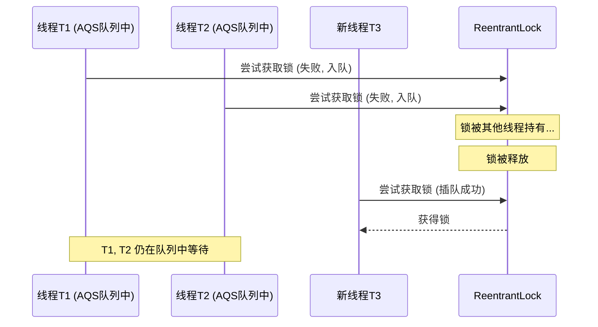

### 公平锁 (严格 FIFO)

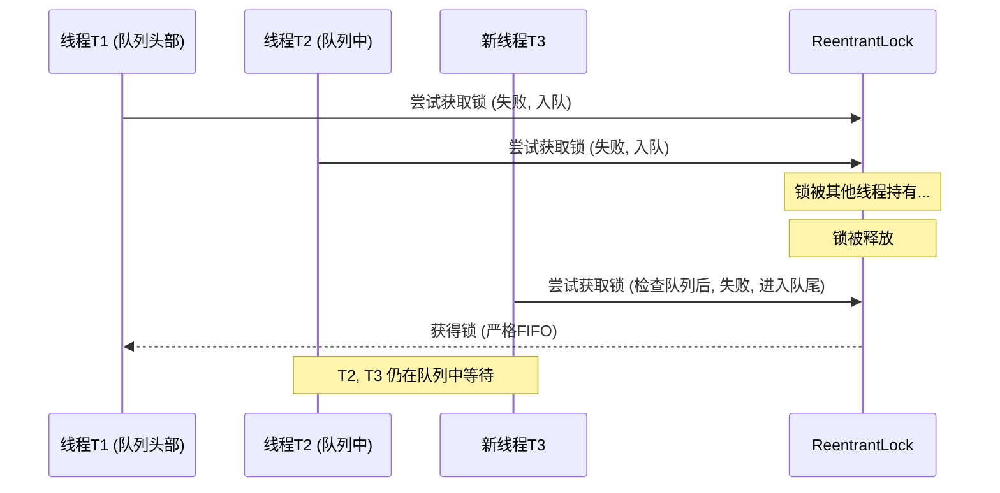

---

## 选型建议

| 特性     | 非公平锁 (默认)                                      | 公平锁                         |
| :------- | :--------------------------------------------------- | :----------------------------- |
| **策略** | 允许新到线程与队列头部线程竞争（Barging）            | 严格的先来后到（FIFO）         |
| **性能** | 吞吐量高，因减少了上下文切换                         | 吞吐量相对较低，因线程调度开销 |
| **饥饿** | 理论上可能导致线程饥饿                               | 杜绝饥饿现象                   |
| **适用** | 绝大多数追求高吞吐量的场景，也是`synchronized`的选择 | 业务逻辑强依赖锁获取的公平性时 |

在没有特殊业务需求强制要求公平性的情况下，**非公平锁通常是更优的选择**，因为它能带来更高的系统整体性能。
```

## 来源 12: Fuwari / `JUC/ThreadLocal.md`

- 原始 URL: <https://github.com/DavidHLP/Fuwari/blob/07cee2baf9cee227807dcd68004c5f2493e5ac52/src/content/posts/JUC/ThreadLocal.md>
- 本地路径: `JUC/ThreadLocal.md`

```markdown
---
title: ThreadLocal 深度剖析：从底层原理到最佳实践
published: 2025-07-13
description: 深入解析 ThreadLocal 的工作机制、内存模型与弱引用设计，掌握线程局部变量的正确使用方式和内存泄漏防护策略。
tags: [Java, ThreadLocal, 并发编程, 内存管理, JUC]
category: JUC
draft: false
---

## **面试**

- **为什么用弱引用？**
  - 为了在外部强引用消失后，`ThreadLocal` 对象本身能够被 GC 回收，打破 `Thread -> ThreadLocalMap -> Entry -> key(ThreadLocal)` 这条强引用链，防止 `key` 的内存泄漏。
- **如何清除脏 Entry？**
  - 弱引用导致了 `key` 为 `null` 而 `value` 存在的“脏条目”，可能导致 `value` 的内存泄漏。
  - `ThreadLocalMap` 在 `get()`, `set()`, `remove()` 操作时，会“顺便”触发清理机制。
  - 核心清理方法是 `expungeStaleEntry`，它不仅会删除脏条目，还会对后续元素进行 `rehash`，以保持哈希表的正确性。
  - 尽管有自动清理机制，但最保险的做法是养成好习惯：总是在 `finally` 块中调用 `remove()` 方法。

## `ThreadLocal`：为何它不可或缺？

在多线程编程中，我们的首要敌人是**共享可变状态 (Shared Mutable State)**。为了保护这种状态，我们最先想到的就是**加锁** (`synchronized`, `Lock`)。

锁的哲学是 **“时间换安全”**：通过序列化线程对资源的访问，强行将并行操作转为串行，以此保证数据一致性。但其代价是显著的：

- **性能损耗**：锁竞争导致线程阻塞、上下文切换，在高并发下是主要的性能瓶 gill。
- **死锁风险**：复杂的业务逻辑中，锁的获取顺序稍有不慎，便会引发死锁，难以排查。

`ThreadLocal` 提供了另一种截然不同的解决思路，它的哲学是 **“空间换时间”**。它不解决“如何安全地共享”，而是直接 **“杜绝共享”**。

`ThreadLocal` 为每个线程都维护一个独立的变量副本。每个线程都只读写自己的副本，线程之间的数据天然隔离，互不影响。既然没有共享，自然也就不存在线程安全问题，从而避免了锁带来的性能开销和复杂性。

因此，`ThreadLocal` 的核心价值体现在两个方面：

1.  **根本性地规避线程安全问题**：通过线程级别的状态隔离，提供了一种无锁的线程安全方案。
2.  **实现全链路的“隐式”上下文传递**：在一个线程的完整生命周期中（例如一次 Web 请求），需要在不同层级（Controller, Service, DAO）之间传递上下文信息（如用户信息、事务 ID、数据库连接等）。如果通过方法参数显式传递 (`doSomething(conn, user, ...)`), 将导致代码严重耦合且极为冗长。`ThreadLocal` 允许我们将这些信息绑定到当前线程，任何需要的地方都可以直接获取，实现了完美的解耦和代码简化。

**经典场景：数据库连接管理**

在一个典型的 Web 应用中，一个请求从头到尾由同一个线程处理。

- **传统方案**：`Connection conn` 参数必须贯穿整个调用链：`controller(conn)` -\> `service(conn)` -\> `dao(conn)`。这是一种设计上的灾难。
- **`ThreadLocal` 方案**：在请求开始时（如在 Filter 或 Interceptor 中），从连接池获取一个连接，存入 `ThreadLocal<Connection>`。在 DAO 层，直接从`ThreadLocal`中获取连接。在请求结束时，同样在 Filter 或 Interceptor 的`finally`块中，从`ThreadLocal`取出连接并关闭。整个流程清晰、优雅、高内聚低耦合。

## `ThreadLocal` 核心 API 详解

`ThreadLocal` 的 API 极为简洁，掌握以下四个方法即可。

1.  **`set(T value)`**

    - 为当前线程设置一个独有的值。
    - `userContext.set("User-A");`

2.  **`get()`**

    - 获取当前线程绑定的值。
    - 如果在调用 `get()` 之前，当前线程没有调用过 `set()`，`get()`会返回一个初始值。这个初始值由 `initialValue()` 方法决定。
    - `String currentUser = userContext.get();`

3.  **`remove()`**

    - 移除当前线程绑定的值。
    - **这是 `ThreadLocal` 最重要也最容易被忽略的方法。** 在线程池等线程被复用的场景下，**必须、一定、务必** 在业务逻辑执行完毕后调用 `remove()`，否则将导致严重的**内存泄漏**和**数据污染**。我们稍后会从源码层面解释原因。

4.  **`initialValue()` (受保护方法) / `withInitial()` (静态工厂)**

    - `initialValue()` 是一个 `protected` 方法，用于返回线程局部变量的初始值。当线程首次调用 `get()` 时，若无值，此方法会被调用。
    - 从 Java 8 开始，推荐使用更简洁的静态工厂方法 `ThreadLocal.withInitial(Supplier<S> supplier)`。

**代码示例：**

```java
// 推荐 (Java 8+)：使用静态工厂方法，简洁且清晰
ThreadLocal<SimpleDateFormat> dateFormatHolder = ThreadLocal.withInitial(
    () -> new SimpleDateFormat("yyyy-MM-dd HH:mm:ss")
);

// 老式 (Java 8 之前)：使用匿名内部类
ThreadLocal<Long> transactionId = new ThreadLocal<Long>() {
    @Override
    protected Long initialValue() {
        // 通常用于生成一个唯一的、与线程相关的ID
        return System.nanoTime();
    }
};

// 使用
String formattedDate = dateFormatHolder.get().format(new Date());
Long txId = transactionId.get();
```

## 实践案例与最佳实践

下面的代码演示了在线程池场景下 `ThreadLocal` 的正确用法。

```java
import java.util.ArrayList;
import java.util.List;
import java.util.concurrent.CompletableFuture;
import java.util.concurrent.ExecutorService;
import java.util.concurrent.Executors;
import java.util.concurrent.ThreadLocalRandom;

public class Main {

    // 销售业绩统计类
    static class SalesPerformance {
        private int orderCount = 0;
        private double totalSales = 0.0;

        public void recordOrder(int count, double sales) {
            this.orderCount += count;
            this.totalSales += sales;
        }

        @Override
        public String toString() {
            return " [总订单数=" + orderCount + ", 总销售额=" + String.format("%.2f", totalSales) + "]";
        }
    }

    // 1. 最佳实践：将ThreadLocal声明为 private static final，确保其实例的唯一性。
    // 2. 最佳实践：使用 withInitial 提供初始值，避免在get()后进行null判断。
    private static final ThreadLocal<SalesPerformance> performanceTracker = ThreadLocal
            .withInitial(SalesPerformance::new);

    // 模拟处理单个销售员的销售任务
    private static void processSalesTask(String salesman) {
        String originalThreadName = Thread.currentThread().getName();
        // 方便日志观察，将销售员名字附加到线程名
        Thread.currentThread().setName(originalThreadName + " [" + salesman + "]");

        try {
            // 3. get()方法获取当前线程的副本，如果不存在，则通过withInitial创建。
            SalesPerformance performance = performanceTracker.get();

            // 模拟该销售员产生随机数量的订单
            int salesCount = ThreadLocalRandom.current().nextInt(1, 11);
            for (int i = 0; i < salesCount; i++) {
                performance.recordOrder(1, ThreadLocalRandom.current().nextDouble() * 1000);
            }

            System.out.println(Thread.currentThread().getName() + " -> 完成了当日业绩统计:" + performance);

        } finally {
            // 4. 核心最佳实践：必须在 finally 块中调用 remove()！
            //    这可以防止线程池中的线程复用时，下一个任务拿到上一个任务的脏数据。
            //    同时，这也是防止内存泄漏的关键。
            performanceTracker.remove();

            // 恢复原始线程名
            Thread.currentThread().setName(originalThreadName);
        }
    }

    public static void main(String[] args) {
        // 使用固定大小的线程池模拟Web服务器处理并发请求
        ExecutorService pool = Executors.newFixedThreadPool(3);

        try {
            String[] salesmen = {"张三", "李四", "王五", "赵六", "孙七", "周八"};
            List<CompletableFuture<Void>> allTasks = new ArrayList<>();

            System.out.println("系统启动，开始为销售员分配异步任务到线程池...");

            for (String salesman : salesmen) {
                CompletableFuture<Void> task = CompletableFuture.runAsync(
                        () -> processSalesTask(salesman),
                        pool);
                allTasks.add(task);
            }

            // 等待所有异步任务执行完成
            CompletableFuture.allOf(allTasks.toArray(new CompletableFuture[0])).join();

            System.out.println("\n所有任务已成功执行完毕。线程池中的线程可以被后续任务安全复用。");

        } finally {
            // 确保线程池被最终关闭
            pool.shutdown();
        }
    }
}
```

## `Thread`, `ThreadLocal`, 和 `ThreadLocalMap`

### 一、一切的起点：`java.lang.Thread` 类

让我们首先打开 `Thread` 类的源码。在其中，你会找到两个非常关键的成员变量：

```java
// openjdk.java.base/java/lang/Thread.java

/* ThreadLocal values pertaining to this thread. This map is maintained
 * by the ThreadLocal class. */
ThreadLocal.ThreadLocalMap threadLocals = null;

/*
 * InheritableThreadLocal values pertaining to this thread. This map is
 * maintained by the InheritableThreadLocal class.
 */
ThreadLocal.ThreadLocalMap inheritableThreadLocals = null;
```

从这段源码我们可以得出第一个决定性的信息：

1.  **每个线程 (`Thread` 实例) 都拥有一个名为 `threadLocals` 的成员变量**，它的类型是 `ThreadLocal.ThreadLocalMap`。
2.  这个变量是**包级私有**的，意味着只有 `java.lang` 包内的类可以直接访问它，这其中就包括 `ThreadLocal`。
3.  这个 `threadLocals` 变量**默认是 `null`**。它只在线程第一次需要存储 `ThreadLocal` 变量时才会被创建，这是一种延迟初始化（Lazy Initialization）策略。

**结论**：`Thread` 是 `ThreadLocal` 数据的实际“拥有者”和“载体”。它随线程的创建而生，随线程的销毁而亡。

### 二、核心的访问入口：`java.lang.ThreadLocal` 类

`ThreadLocal` 是我们日常使用的 API 入口。我们通过它的 `set()`、`get()` 和 `remove()` 方法来操作线程局部变量。现在我们深入这些方法，看看它们是如何与 `Thread` 的 `threadLocals` 交互的。

#### 1. `set(T value)` 方法

```java
// openjdk.java.base/java/lang/ThreadLocal.java

public void set(T value) {
    // 1. 获取当前正在执行此代码的线程
    Thread t = Thread.currentThread();

    // 2. 从当前线程中获取其内部的 threadLocals 这个 Map
    ThreadLocalMap map = getMap(t);

    if (map != null) {
        // 3a. 如果Map已经存在，就以 this (即当前的ThreadLocal实例) 为key，存入value
        map.set(this, value);
    } else {
        // 3b. 如果Map不存在(首次调用)，则为该线程创建Map
        createMap(t, value);
    }
}

// getMap(t) 的实现非常直接：
ThreadLocalMap getMap(Thread t) {
    return t.threadLocals; // 直接返回线程的成员变量
}

// createMap(t, value) 的实现：
void createMap(Thread t, T firstValue) {
    // 创建一个新的ThreadLocalMap，并将其设置到当前线程的threadLocals变量上
    t.threadLocals = new ThreadLocalMap(this, firstValue);
}
```

**`set` 方法的源码揭示了：**

- 它不持有任何数据。
- 它的工作流程是：获取当前线程 `t` -\> 获取 `t.threadLocals` 这个 `Map` -\> 把 `value` 存入这个 `Map` 中，而存入的 **Key 正是 `ThreadLocal` 实例本身 (`this`)**。

#### 2. `get()` 方法

```java
// openjdk.java.base/java/lang/ThreadLocal.java

public T get() {
    // 1. 获取当前线程
    Thread t = Thread.currentThread();
    // 2. 获取该线程的 threadLocals Map
    ThreadLocalMap map = getMap(t);

    if (map != null) {
        // 3a. 如果Map存在，以 this (ThreadLocal实例) 为key，查找对应的Entry
        ThreadLocalMap.Entry e = map.getEntry(this);
        if (e != null) {
            @SuppressWarnings("unchecked")
            T result = (T)e.value;
            return result;
        }
    }

    // 3b. 如果Map不存在，或Map中没有对应的Entry，则初始化
    return setInitialValue();
}

// setInitialValue() 内部会调用我们重写的 initialValue() 方法，
// 获取初始值，然后像 set() 方法一样，将其存入Map中并返回。
```

**`get` 方法的源码再次确认了：**

- 它同样是先获取当前线程的 `threadLocals` Map，然后用自身作为 `key` 在这个 `Map` 中查找值。

### 三、真正的存储结构：`ThreadLocal.ThreadLocalMap` 类

`ThreadLocalMap` 是 `ThreadLocal` 的一个**静态内部类**。它是一个定制化的哈希表，并非 `java.util.HashMap`。它的设计充满了针对性优化。

其最核心的设计在于它的条目——`Entry`。

```java
// openjdk.java.base/java/lang/ThreadLocal.java

static class ThreadLocalMap {

    /**
     * Entry是WeakReference的子类，它对key (ThreadLocal实例) 是弱引用。
     */
    static class Entry extends WeakReference<ThreadLocal<?>> {
        /** 与此ThreadLocal关联的值 */
        Object value; // 对value是强引用

        Entry(ThreadLocal<?> k, Object v) {
            super(k); // 调用父类WeakReference的构造器
            value = v;
        }
    }

    // ... Map的内部实现，如Entry[] table, set(), getEntry()等 ...
}
```

**`ThreadLocalMap` 和 `Entry` 的源码是理解内存泄漏的关键：**

1.  **Key 是弱引用 (Weak Reference)**：`Entry` 的 `key` （即 `ThreadLocal` 实例）被一个 `WeakReference` 包裹。这意味着，如果一个 `ThreadLocal` 实例在外部没有被任何强引用指向（比如一个方法内局部变量定义的 `ThreadLocal`），那么在下一次 GC 发生时，这个 `ThreadLocal` 实例就会被回收。此时，`Entry` 中的 `key` 会自动变为 `null`。
2.  **Value 是强引用 (Strong Reference)**：然而，`Entry` 中的 `value` 是一个普通的 `Object` 类型的强引用。

这就构成了潜在的内存泄漏链条：只要线程不死，线程 `Thread` 实例就一直强引用着 `ThreadLocalMap` 实例，而 `ThreadLocalMap` 实例又强引用着 `Entry` 实例，`Entry` 实例又强引用着 `value`。如果 `key` (ThreadLocal) 被回收了，但我们没有手动调用 `remove()` 方法，那么这个 `value` 将永远无法被访问到，也永远无法被回收，从而造成内存泄漏。

### 关系梳理与图解

现在，我们可以清晰地画出它们三者之间的关系图：

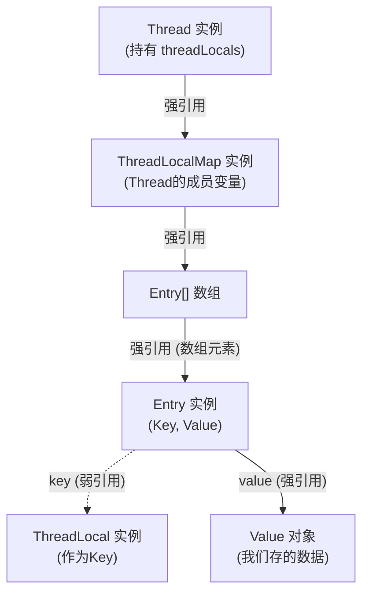

**总结与回顾:**

1.  **`Thread` 是“大地”**：它提供了 `ThreadLocal` 数据赖以生存的土壤（`threadLocals` 成员变量）。
2.  **`ThreadLocalMap` 是“房子”**：它是在这片土地上建立起来的、用于存放具体物品的建筑。每个线程最多只有一个这样的房子。
3.  **`ThreadLocal` 是“钥匙”**：我们使用这把钥匙 (`ThreadLocal` 实例) 去打开这栋房子 (`ThreadLocalMap`)，然后存取属于这把钥匙的物品 (`value`)。一把钥匙对应一个储物格(`Entry`)。
4.  **`Entry` 是“储物格”**：它把钥匙（弱引用）和物品（强引用）配对存放。

这个设计精妙地实现了线程间数据的隔离，同时也通过弱引用 `key` 的设计，试图在一定程度上避免内存泄漏，但这并不能完全取代开发者**显式调用 `remove()` 方法**的责任。

## 四、`ThreadLocal` 之为什么源码用弱引用

要理解为什么 `ThreadLocalMap` 中的 `Entry` 对 `ThreadLocal` 本身（也就是 `key`）使用弱引用（`WeakReference`），我们首先要明白 `ThreadLocal` 的核心工作机制，然后通过一个“反证法”来思考：如果用强引用会发生什么？

### **1. ThreadLocal 的核心工作链**

`ThreadLocal` 的数据存储链条如下：

- 一个 `Thread` 对象内部有一个成员变量 `threadLocals`，它的类型是 `ThreadLocal.ThreadLocalMap`。
- `ThreadLocalMap` 是 `ThreadLocal` 的一个静态内部类，其内部维护了一个 `Entry` 数组。
- 这个 `Entry` 对象的 `key` 是 `ThreadLocal` 实例本身，`value` 则是我们想要存储的线程局部变量。

这条关系链可以简化为：`Thread` -\> `ThreadLocalMap` -\> `Entry[]` -\> `(key, value)`。

关键在于 `Entry` 的源码定义（以 JDK 8/11 为例）：

```java
static class Entry extends WeakReference<ThreadLocal<?>> {
    /** The value associated with this ThreadLocal. */
    Object value;

    Entry(ThreadLocal<?> k, Object v) {
        super(k); // 调用 WeakReference 的构造函数，将 key 包装成弱引用
        value = v; // value 是一个强引用
    }
}
```

从源码可以看出：

- `Entry` 继承了 `WeakReference<ThreadLocal<?>>`。
- `key` (即 `ThreadLocal` 实例) 是通过 `super(k)` 传递给 `WeakReference` 构造函数的，因此 `Entry` 对 `key` 的引用是 **弱引用**。
- `value` (我们设置的值) 是一个普通的 `Object` 成员变量，因此 `Entry` 对 `value` 的引用是 **强引用**。

### **2. 反证法：如果 Key 使用强引用会发生什么？**

假设 `Entry` 的定义如下（**注意：这是错误假设**）：

```java
// 错误假设
static class Entry {
    ThreadLocal<?> key; // 强引用
    Object value;

    Entry(ThreadLocal<?> k, Object v) {
        key = k;
        value = v;
    }
}
```

现在我们考虑一个常见的场景：**线程池**。线程池中的线程生命周期非常长，它们执行完一个任务后不会被销毁，而是等待下一个任务。

设想以下代码在一个由线程池分配的线程中执行：

```java
public void someMethod() {
    ThreadLocal<MyObject> local = new ThreadLocal<>();
    local.set(new MyObject());
    // ... 方法执行 ...
    // 方法结束，local 这个栈变量被销毁
}
```

当 `someMethod` 执行完毕后，栈上的 `local` 引用被弹出，从我们代码的角度看，已经没有任何强引用指向这个 `ThreadLocal` 实例了。我们期望它能被垃圾回收器（GC）回收。

但是，如果 `Entry` 的 `key` 是强引用，会发生以下情况：

1.  **`Thread` 活得很好**：线程池里的这个线程还在运行，所以 `Thread` 对象本身是 GC Root，不会被回收。
2.  **`ThreadLocalMap` 活得很好**：`Thread` 对象强引用着它的 `ThreadLocalMap`。
3.  **`Entry` 活得很好**：`ThreadLocalMap` 强引用着它的 `Entry` 数组，所以 `Entry` 对象也不会被回收。
4.  **`ThreadLocal` 实例无法被回收**：因为 `Entry` 对象强引用着 `key`（那个 `ThreadLocal` 实例），导致即使我们代码中对它的引用 (`local`) 已经消失，它也因为这条引用链 (`Thread` -\> `ThreadLocalMap` -\> `Entry` -\> `key`) 的存在而无法被 GC 回收。
5.  **`value` 也无法被回收**：`Entry` 同样强引用着 `value`，`key` 回收不了，`Entry` 回收不了，`value` 自然也回收不了。

**结论：** 如果使用强引用，只要线程不销毁，那么这个线程曾经关联过的所有 `ThreadLocal` 对象及其对应的 `value` 都无法被回收，即使这些 `ThreadLocal` 对象在业务代码中早已不再使用。这将导致 **严重的内存泄漏**。

### **3. 弱引用的巧妙之处**

现在我们回到真实的源码实现，`key` 是弱引用。

> **弱引用（WeakReference）** 的特点是：当一个对象只被弱引用指向时，下一次垃圾回收发生时，这个对象一定会被回收，无论当前内存是否充足。

我们再来分析一下 `someMethod` 执行完后的情况：

1.  `someMethod` 结束，栈上的 `local` 引用消失。现在，指向 `ThreadLocal` 实例的只剩下 `Entry` 中的那个 **弱引用** 了。
2.  当 GC 发生时，垃圾回收器发现这个 `ThreadLocal` 实例只被一个弱引用指向。
3.  根据弱引用的规则，GC 会 **回收这个 `ThreadLocal` 实例**。
4.  `ThreadLocal` 实例被回收后，`Entry` 中那个 `WeakReference` 对象所指向的内存地址就变成了 `null`。此时，`entry.get()` 的返回值就是 `null`。

**这种 `key` 变为 `null`，但 `value` 仍然存在的 `Entry`，我们称之为“脏条目”（Stale Entry）。**

通过使用弱引用，`ThreadLocal` 的设计者巧妙地打破了前面描述的强引用链，使得 `ThreadLocal` 对象本身可以像普通对象一样被 GC 正常回收，避免了因线程生命周期过长而导致的 `key` 的内存泄漏。

但是，这也引出了一个新的问题：`key` 被回收了，变成了 `null`，但 `value` 还是被 `Entry` **强引用** 着，`Entry` 又被 `ThreadLocalMap` 强引用着，`ThreadLocalMap` 又被 `Thread` 强引用着。如果不做任何处理，`value` 将永远无法被回收，内存泄漏依然存在。

这就引出了第五部分的内容：`ThreadLocal` 必须有一套机制来清理这些“脏条目”。

---

## 五、`ThreadLocal` 之清除脏 `Entry`

`ThreadLocal` 的设计者预见到了弱引用会产生“脏条目”的问题，因此在 `ThreadLocalMap` 的 `get()`, `set()`, `remove()` 等方法中都包含了清除逻辑。这种清理不是实时的，而是“启发式”或“懒惰式”的，在每次操作 `ThreadLocalMap` 时顺便进行。

### **1. 清理时机**

清理操作主要发生在以下三个时刻：

1.  **`set()` 时**：当给 `ThreadLocal` 设置值时。
2.  **`get()` 时**：当获取 `ThreadLocal` 的值，并且发生哈希碰撞或者找到了一个脏条目时。
3.  **`remove()` 时**：当显式调用 `remove()` 方法时（这是最直接的清理方式）。

### **2. 源码分析：核心清理方法 `expungeStaleEntry`**

`ThreadLocalMap` 的清理工作主要由 `expungeStaleEntry(int staleSlot)` 方法完成。这个方法是整个清理机制的核心。它的作用是：

- 从传入的 `staleSlot`（一个已知是脏条目的索引）开始。
- 清除 `staleSlot` 位置的 `Entry`（将其 `value` 和 `Entry` 自身都设为 `null`，以便 GC 回收）。
- **线性探测**（向后遍历）整个哈希表，处理后续可能因为哈希冲突而放在错误位置的元素，以及遇到的其他脏条目。

它的基本逻辑如下：

```java
private int expungeStaleEntry(int staleSlot) {
    Entry[] tab = table;
    int len = tab.length;

    // 1. 清理传入的 staleSlot
    tab[staleSlot].value = null;
    tab[staleSlot] = null;
    size--;

    // 2. 向后线性探测，直到遇到 null 的槽位
    Entry e;
    int i;
    for (i = nextIndex(staleSlot, len); (e = tab[i]) != null; i = nextIndex(i, len)) {
        ThreadLocal<?> k = e.get();

        // 2.1 如果又发现了一个脏条目
        if (k == null) {
            e.value = null;
            tab[i] = null;
            size--;
        } else {
            // 2.2 如果是一个正常的 Entry，需要重新计算它的哈希位置 (rehash)
            // 因为前面的 staleSlot 被清除了，可能会导致这个 Entry 的正确位置发生变化
            int h = k.threadLocalHashCode & (len - 1);
            if (h != i) {
                // 如果当前位置不是它的理想位置，就把它挪过去
                tab[i] = null; // 先从当前位置移除
                // 从理想位置 h 开始向后找一个空位安放
                while (tab[h] != null) {
                    h = nextIndex(h, len);
                }
                tab[h] = e;
            }
        }
    }
    return i; // 返回探测结束的槽位索引
}
```

这个方法做了两件大事：

1.  **清理（Expunge）**：遇到 `key` 为 `null` 的脏条目，就将其 `value` 和 `Entry` 都置为 `null`。
2.  **重哈希（Rehash）**：遇到正常的 `Entry`，检查它是否在正确的位置上。如果不在（因为它可能因为之前哈希冲突被放到了后面），就将它移动到正确的位置上。这一步至关重要，它保证了 `ThreadLocalMap` 在清除了部分数据后，其哈希表的探测链依然是连续和正确的。

### **3. `set()` 方法中的清理逻辑**

`set()` 方法在插入或替换值时，会在线性探测的过程中检查遇到的 `Entry`。

```java
private void set(ThreadLocal<?> key, Object value) {
    // ...
    Entry[] tab = table;
    int len = tab.length;
    int i = key.threadLocalHashCode & (len - 1);

    for (Entry e = tab[i]; e != null; e = tab[i = nextIndex(i, len)]) {
        ThreadLocal<?> k = e.get();

        if (k == key) { // key 相同，直接替换 value
            e.value = value;
            return;
        }

        if (k == null) { // 发现了脏条目！
            // 调用 replaceStaleEntry，这是一个更复杂的清理和插入方法
            replaceStaleEntry(key, value, i);
            return;
        }
    }

    // ... 正常插入 ...

    // 在扩容之前，可能会进行一次扫描清理
    if (!cleanSomeSlots(i, sz) && sz >= threshold)
        rehash(); // rehash 内部会进行一次全表扫描清理
}
```

`set` 方法在探测过程中一旦遇到脏条目 (`k == null`)，就会调用 `replaceStaleEntry`。`replaceStaleEntry` 内部会调用 `expungeStaleEntry`，从发现的脏条目开始进行一轮清理，然后再把新元素插入。

此外，在 `set` 的最后，如果需要扩容，会先尝试 `cleanSomeSlots` 做一次部分清理，如果清理效果不佳再进行 `rehash`（`rehash` 会调用 `expungeStaleEntries` 进行全表清理）。

### **4. `get()` 方法中的清理逻辑**

`get()` 方法在查找值时，如果直接命中了就返回。如果没命中，或者在查找过程中遇到了脏条目，也会触发清理。

`get()` 的逻辑由 `getEntry` 和 `getEntryAfterMiss` 实现。

```java
private Entry getEntry(ThreadLocal<?> key) {
    int i = key.threadLocalHashCode & (table.length - 1);
    Entry e = table[i];
    if (e != null && e.get() == key) {
        return e; // 直接命中
    } else {
        return getEntryAfterMiss(key, i, e); // 未命中或遇到脏条目
    }
}

private Entry getEntryAfterMiss(ThreadLocal<?> key, int i, Entry e) {
    Entry[] tab = table;
    int len = tab.length;

    while (e != null) {
        ThreadLocal<?> k = e.get();
        if (k == key)
            return e; // 找到了
        if (k == null)
            expungeStaleEntry(i); // 发现了脏条目，触发清理
        else
            i = nextIndex(i, len); // 继续向后找
        e = tab[i];
    }
    return null;
}
```

`getEntryAfterMiss` 在线性探测过程中，一旦发现 `k == null`，就会以当前索引 `i` 为起点调用 `expungeStaleEntry`，开始一轮清理和重哈希。

### **5. 最佳实践：主动 `remove()`**

虽然 `ThreadLocalMap` 有上述的“被动”清理机制，但它并不能保证万无一失。如果一个 `ThreadLocal` 不再使用，并且之后再也没有对这个 `ThreadLocalMap` 进行 `get()` 或 `set()` 操作，那么脏条目就会一直存在，导致 `value` 对象的内存泄漏。

**因此，防止 `ThreadLocal` 内存泄漏的最佳实践是：** 在使用完 `ThreadLocal` 后，务必在 `finally` 块中调用其 `remove()` 方法。

```java
ThreadLocal<MyObject> myThreadLocal = new ThreadLocal<>();

try {
    myThreadLocal.set(new MyObject());
    // ... 业务逻辑 ...
} finally {
    myThreadLocal.remove(); // 必须执行！
}
```

`remove()` 方法会直接找到对应的 `Entry`，并调用 `expungeStaleEntry` 将其彻底清除，这是最干净、最可靠的防泄漏手段。
```

## 来源 13: Fuwari / `JUC/synchronized.md`

- 原始 URL: <https://github.com/DavidHLP/Fuwari/blob/07cee2baf9cee227807dcd68004c5f2493e5ac52/src/content/posts/JUC/synchronized.md>
- 本地路径: `JUC/synchronized.md`

```markdown
---
title: synchronized 关键字中的对象锁与类锁详解
published: 2025-06-26
description: 详解Java中synchronized关键字的本质，区分对象锁（实例锁）和类锁（静态锁）的监视器对象、作用范围和应用场景，并阐明其如何实现互斥访问。
tags: [Java, 并发编程, synchronized, 对象锁, 类锁, Monitor]
category: JUC
draft: false
---

# synchronized 关键字中的对象锁与类锁详解

---

## 1. synchronized 的本质：监视器（信号量）

`synchronized` 并不是"给代码加锁"，而是 **尝试获取一个监视器对象（Monitor）内部的信号量**：

1. **每个 Java 对象天生附带一把监视器信号量**。可以把它想象成内部的"互斥量/信号量"。
2. 当线程进入 `synchronized` 代码时，JVM 会尝试对**指定监视器**进行 `P()` 操作（信号量减 1）。
3. 若信号量已被其他线程占用（值为 0），当前线程会被 **阻塞**，直到信号量被释放（`V()`）。
4. 因此，`synchronized` 本质上实现的是**基于监视器信号量的互斥访问**。

后续所有用法，都只是指定 **监视器对象是谁**：

- 实例方法 / `synchronized(this){}` → 监视器 = `this` 对象。
- `static synchronized` / `synchronized(ClassName.class){}` → 监视器 = `ClassName.class` 类对象。

**注意**：锁只影响 **同一监视器上的线程**，对其它对象/类的监视器没有影响。

## 2. 对象锁（实例锁）

### 2.1 定义（监视器 = `this`）

当 `synchronized` 作用于**实例方法**或使用 `synchronized(this)` 代码块时，JVM 会将当前对象 (`this`) 作为监视器锁（Monitor）。同一时刻只能有一个线程持有该对象锁，其他线程只能等待。

### 2.2 示例

```java
// LockSY.java 片段（对象锁示例）
class Phone {
    // 对象锁：锁的是同一个 Phone 实例
    public synchronized void sendSMS() {
        System.out.println("sendSMS");
    }

    public synchronized void sendEmail() throws InterruptedException {
        Thread.sleep(1000);
        System.out.println("sendEmail");
    }

    // 普通方法：不涉及锁
    public void sendHallow() {
        System.out.println("sendHallow");
    }
}

public class LockSY {
    public static void main(String[] args) {
        Phone phone = new Phone(); // **同一个对象实例**
        new Thread(phone::sendEmail, "t1").start();
        new Thread(phone::sendSMS , "t2").start();
        new Thread(phone::sendHallow, "t3").start();
    }
}
```

#### 执行结果

1. `sendEmail` 与 `sendSMS` 会 **串行** 执行，先 `sendEmail` 后 `sendSMS`（因为 `sendEmail` 先获得对象锁并休眠 1s）。
2. `sendHallow` 不受锁约束，可在任意时间打印。

### 2.3 时序图（对象锁）

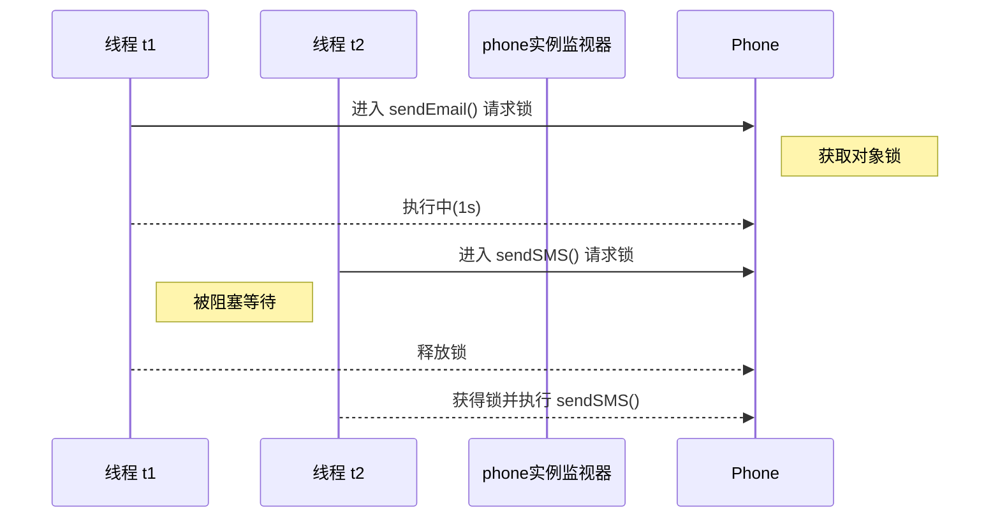

### 2.4 结论

- **锁粒度**：单个对象实例。
- 如果两个线程作用于**同一个对象实例**的同步方法/同步代码块，它们必须排队执行。
- 如果作用于**不同实例**，则互不影响，各自拥有独立的对象锁。

### 2.5 `synchronized(this)` 代码块

`public synchronized` 方法与 `synchronized(this) {}` 本质等价，都是以 **当前对象实例** 作为监视器锁。

示例：

```java
public void sendSMS() {
    synchronized (this) { // 临界区开始，锁定当前对象
        // 与 sendEmail() 互斥
        System.out.println("sendSMS");
    }
}
```

要点：

- 进入 `synchronized(this)` 代码块时，线程尝试获取对象锁；若已被其他线程持有，则进入 **阻塞/等待** 状态。
- 与同一对象的其他 `synchronized` 实例方法或 `synchronized(this)` 代码块互斥。
- 可通过锁定更小的代码范围来 **减小锁粒度**、提升并发性能。

使用场景示例：

1. 只需同步方法中部分敏感逻辑，而非整个方法体。
2. 需要在同一方法中对不同资源使用不同锁对象，以实现更细颗粒度同步。

---

## 3. 类锁（静态锁）

### 3.1 定义（监视器 = `ClassName.class`）

当 `synchronized` 作用于**静态方法**或使用 `synchronized(类名.class)` 代码块时，监视器锁变成了 `Class` 对象（例如 `Phone.class`）。无论创建多少实例，整 个类只有一把锁。

### 3.2 示例

```java
// LockSY.java 片段（类锁示例）
class Phone {
    // 类锁：锁的是 Phone.class
    public static synchronized void sendSMS() {
        System.out.println("sendSMS");
    }

    public static synchronized void sendEmail() throws InterruptedException {
        Thread.sleep(1000);
        System.out.println("sendEmail");
    }

    public void sendHallow() {
        System.out.println("sendHallow");
    }
}

public class LockSY {
    public static void main(String[] args) {
        Phone phone = new Phone();
        new Thread(() -> Phone.sendEmail(), "t1").start();
        new Thread(() -> Phone.sendSMS() , "t2").start();
        new Thread(phone::sendHallow      , "t3").start();
    }
}
```

#### 执行结果

1. `sendEmail` 与 `sendSMS` 会 **串行** 执行，因为它们竞争的是同一把 `Phone.class` 锁。
2. `sendHallow` 依旧不受影响，随时执行。
3. 即使 `t1` 和 `t2` 使用的是 **不同的 Phone 实例**，只要调用的是 `static synchronized` 方法，仍然互斥。

### 3.3 时序图（类锁）

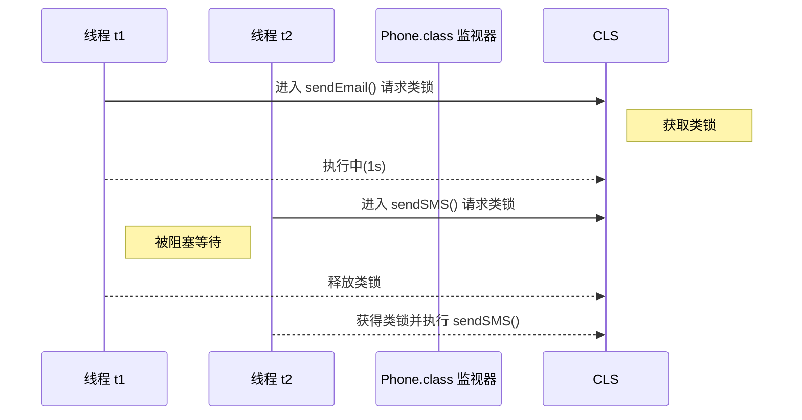

### 3.4 结论

- **锁粒度**：整个 `Class` 对象。
- 类锁在 JVM 进程中唯一，与实例数量无关。

## 4. JVM 类加载示意图

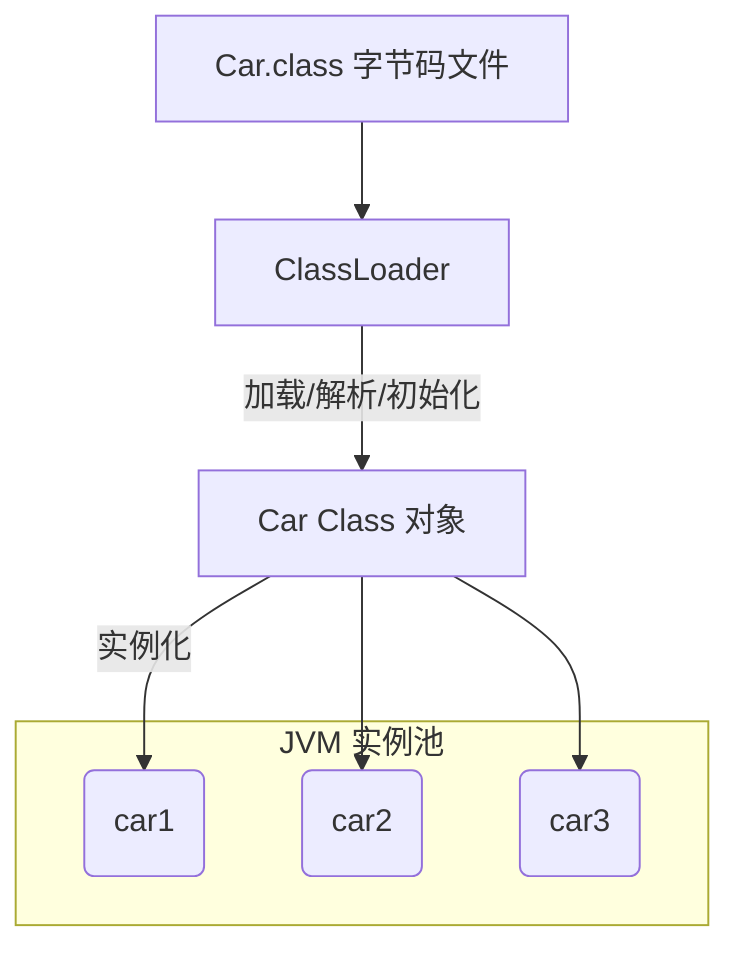

---

## 5. 对象锁 vs. 类锁 对比

| 特性       | 对象锁                                         | 类锁                                                         |
| ---------- | ---------------------------------------------- | ------------------------------------------------------------ |
| 监视器     | 每个对象实例 (`this`)                          | `Class` 对象 (`ClassName.class`)                             |
| 作用范围   | 同一实例的同步代码                             | 整个类的静态同步代码                                         |
| 实例间影响 | 不同实例互不影响                               | 所有实例共享一把锁                                           |
| 典型用法   | `synchronized` 实例方法 / `synchronized(this)` | `static synchronized` 方法 / `synchronized(ClassName.class)` |

---

## 6. 小结

- `synchronized` 既可以修饰实例方法，也可以修饰静态方法，表现为**对象锁**与**类锁**。
- 判断线程是否竞争同一把锁的关键是：**它们的监视器对象是否相同**。
- 在实际开发中，根据临界资源的粒度选择合适的锁类型，避免过度同步导致性能下降。

> **提示**：想验证锁粒度时，可打印 `this` 或 `ClassName.class` 的 `hashCode`，或在同步块中调用 `System.identityHashCode()` 观察是否一致。
```

## 来源 14: Fuwari / `Java/JDK17DetailedExplanationofJavaReferenceTypes.md`

- 原始 URL: <https://github.com/DavidHLP/Fuwari/blob/07cee2baf9cee227807dcd68004c5f2493e5ac52/src/content/posts/Java/JDK17DetailedExplanationofJavaReferenceTypes.md>
- 本地路径: `Java/JDK17DetailedExplanationofJavaReferenceTypes.md`

```markdown
---
title: Java17 引用类型详解：从 `Reference` 四大引用
published: 2025-07-12
description: 深入理解 Java 四种引用类型的底层机制、应用场景与架构设计哲学，掌握 JDK 17 中的引用处理协议。
tags: [Java, 引用类型, 垃圾回收]
category: Java
draft: false
---

## **第一部分：`Reference`类与垃圾回收器的底层**

**架构性考量**: 虚引用配合 `Cleaner` API 是 中 `finalize()` 方法的正确替代方案。自 Java 9 起，`java.lang.ref.Cleaner` API 作为对传统 `虚引用+队列+线程` 最佳实践的官方封装，是管理**堆外资源**（如 JNI 内存、`DirectByteBuffer`、本地文件句柄、GPU 内存等）的**唯一推荐方式**。在 的生态中，它与 **Foreign Function & Memory API (孵化特性)** 协同工作，为现代 Java 应用提供了安全、高效的资源管理模式。`Cleaner` 通过强制分离清理任务与被清理对象，保证了安全性与可靠性，并提供了显式 `close()` 和兜底 GC 清理的"双重保障"模式。作协议。

所有引用类型的行为均源于 `java.lang.ref.Reference` 抽象类与垃圾回收器之间的一套精密且底层的协作协议。

### **`Reference` 对象的生命周期状态机**

`Reference` 对象的生命周期是其与 GC 交互过程的体现，可划分为四个明确的阶段。理解此状态机是掌握引用机制的前提：

1.  **Active (活跃态)**: `Reference` 对象的初始及常规状态。此时，通过其 `get()` 方法可成功获取其指代的对象（Referent）。
2.  **Pending (待决态)**: 对象生命周期的临界状态。当 GC 完成可达性分析，确认一个对象的可达性不再满足其引用类型的要求时（例如，不再强可达），GC 将以原子操作将对应的 `Reference` 对象添加至一个内部的待处理列表（`discovered` 链表）。
3.  **Enqueued (入队态)**: 回收通知的发出阶段。JVM 内部一个关键的守护线程——`Reference-Handler`——将轮询上述待处理列表。它会取出待处理的 `Reference` 对象，将其内部的 `referent` 字段置为 `null`，随后将该 `Reference` 对象本身置入其构造时关联的 `ReferenceQueue`。
4.  **Inactive (失活态)**: 生命周期的终结。当应用程序从 `ReferenceQueue` 中显式移除了该 `Reference` 对象，或对于一个未关联队列的引用，其指代对象已被完全回收后，该 `Reference` 对象即进入此最终状态。

此流程揭示了一个核心设计思想：Java 的引用处理是一种高度解耦的、异步的事件通知模型。

### **中的底层源码剖析：`java.lang.ref.Reference.java`**

```java
// java.lang.ref.Reference.java (版本核心字段解读)
public abstract class Reference<T> {

    // 核心指代：指向被引用的对象。
    // 在 中，使用 VarHandle 进行原子性、线程安全地访问，
    // 以应对 ZGC、G1GC 等现代并发 GC 的挑战。GC 通过内存屏障和特权指令直接操作此字段。
    private T referent;

    // VarHandle 实例，JDK 9+ 引入，用于原子操作
    private static final VarHandle REFERENT;

    static {
        try {
            MethodHandles.Lookup l = MethodHandles.lookup();
            REFERENT = l.findVarHandle(Reference.class, "referent", Object.class);
        } catch (ReflectiveOperationException e) {
            throw new ExceptionInInitializerError(e);
        }
    }

    // 异步通知队列：当指代对象被回收，此Reference对象会被放入该队列。
    // volatile 保证了多线程（应用线程与GC/Reference-Handler线程）之间的可见性。
    volatile ReferenceQueue<? super T> queue;

    // GC内部工作链表指针：用于将待处理的Reference对象链接成一个对开发者透明的内部链表。
    @SuppressWarnings("rawtypes")
    volatile Reference next;

    // 待处理列表头指针：一个静态字段，作为所有待处理Reference对象链表的入口。
    private static Reference<Object> pending = null;

    // 构造函数与核心方法
    Reference(T referent, ReferenceQueue<? super T> queue) {
        this.referent = referent;
        this.queue = (queue == null) ? ReferenceQueue.NULL : queue;
    }

    // 中的 get() 方法，使用 VarHandle 确保内存一致性
    @SuppressWarnings("unchecked")
    public T get() {
        return (T) REFERENT.getAcquire(this);
    }

    // 提供的原子性清除方法
    public void clear() {
        REFERENT.setRelease(this, null);
    }
}
```

---

## **第二部分：四种引用类型的深度剖析与架构应用**

本部分将逐一分析每种引用类型，融合其底层行为、应用实践与架构性考量。

### **强引用 (Strong Reference)**

- **底层行为**: Java 的默认引用模式，通过 `new`、`astore` 等字节码指令实现。只要从 GC Root 到对象存在强引用路径，垃圾回收器就**绝不**会回收该对象，即使系统因内存耗尽而抛出 `OutOfMemoryError`。在 中，ZGC 和 G1GC 的并发特性进一步优化了强引用的处理性能。

- **应用实践**:

  ```java
  import java.lang.ref.Cleaner;

  /**
   * 强引用示例 - 使用 Cleaner API 替代已废弃的 finalize
   * 运行环境: JDK 17+ with ZGC: -XX:+UseZGC -XX:+UnlockExperimentalVMOptions
   */
  public class StrongReferenceExample {

      // 推荐使用 Cleaner 替代 finalize
      private static final Cleaner cleaner = Cleaner.create();

      public static void main(String[] args) throws InterruptedException {
          // myObject 是一个强引用，指向 MyResource 实例
          MyResource myObject = new MyResource("StrongResource");
          System.out.println("对象已创建 -> " + myObject);

          // 将强引用设置为null，切断从GC Root到对象的唯一强引用路径
          myObject = null;
          System.out.println("强引用已置null，建议GC...");

          // 中更推荐明确的垃圾回收请求
          System.gc();
          Thread.sleep(1000); // 给 Cleaner 线程足够时间执行

          System.out.println("程序结束");
      }

      /**
       * 推荐的资源管理方式：使用 Cleaner API
       * Record 类是 的预览特性，这里使用常规类演示
       */
      static class MyResource {
          private final String name;
          private final Cleaner.Cleanable cleanable;

          public MyResource(String name) {
              this.name = name;
              // 注册清理动作，避免 this 引用逃逸
              this.cleanable = cleaner.register(this, new CleanupAction(name));
          }

          // 实现 AutoCloseable 以支持 try-with-resources
          public void close() {
              cleanable.clean();
          }

          @Override
          public String toString() {
              return "MyResource{name='" + name + "'}";
          }

          // 清理动作必须是静态类，避免持有外部类引用
          private static class CleanupAction implements Runnable {
              private final String resourceName;

              CleanupAction(String resourceName) {
                  this.resourceName = resourceName;
              }

              @Override
              public void run() {
                  System.out.println("!!! 资源对象 [" + resourceName + "] 已被 Cleaner 清理 !!!");
              }
          }
      }
  }
  ```

- **执行结果**:
  ```text
  对象已创建 -> MyResource{name='StrongResource'}
  强引用已置null，建议GC...
  !!! 资源对象 [StrongResource] 已被 Cleaner 清理 !!!
  程序结束
  ```
- **架构性考量**: 内存泄漏的根本原因在于**对象逻辑生命周期与其实际持有的强引用生命周期不匹配**。在 的现代架构设计中，须特别警惕因 `ModuleLayer`、静态集合、Lambda 表达式捕获、监听器等长生命周期实体持有短生命周期对象引用而引发的内存泄漏问题。的 **JFR (Java Flight Recorder)** 和 **Application Class Data Sharing** 特性为内存治理提供了更强大的工具支持。建立内存基线并将其纳入持续集成流程，配合现代 APM 工具，是主动进行内存治理的有效策略。

### **软引用 (Soft Reference)**

- **底层行为**: `SoftReference` 的回收行为由 JVM 内部策略决定，在 中可通过 HotSpot 的 `-XX:SoftRefLRUPolicyMSPerMB` 参数进行调优。配合 ZGC 或 G1GC，其回收时机与系统内存压力及对象最近被访问的时间相关联，但行为本质上仍是**非确定性**的。

- **应用实践**:

  ```java
  import java.lang.ref.SoftReference;
  import java.util.ArrayList;
  import java.util.List;

  /**
   * 软引用示例
   * 运行参数: -Xmx32m -XX:+UseG1GC -XX:SoftRefLRUPolicyMSPerMB=1
   */
  public class SoftReferenceExample {

      static class MyResource {
          private final String name;
          private final byte[] data; // 占用内存

          public MyResource(String name) {
              this.name = name;
              this.data = new byte[1024 * 1024]; // 1MB
          }

          @Override
          public String toString() {
              return "MyResource{name='" + name + "', size=1MB}";
          }
      }

      public static void main(String[] args) {
          SoftReference<MyResource> softRef = new SoftReference<>(
              new MyResource("SoftResource")
          );

          System.out.println("初始状态 -> " + softRef.get());

          // 在 中使用更精确的内存压力测试
          System.out.println("开始施加内存压力...");
          try {
              List<byte[]> memoryConsumers = new ArrayList<>();
              int allocatedMB = 0;

              while (softRef.get() != null && allocatedMB < 50) {
                  memoryConsumers.add(new byte[1024 * 1024]);
                  allocatedMB++;

                  if (allocatedMB % 5 == 0) {
                      System.out.printf("已分配 %d MB，软引用状态: %s%n",
                          allocatedMB, softRef.get() != null ? "存活" : "已回收");
                  }
              }
          } catch (OutOfMemoryError e) {
              System.out.println("!!! 捕获到 OutOfMemoryError !!!");
          }

          System.out.println("最终软引用状态 -> " + softRef.get());

          // 增强的内存信息
          Runtime runtime = Runtime.getRuntime();
          long totalMemory = runtime.totalMemory();
          long freeMemory = runtime.freeMemory();
          long usedMemory = totalMemory - freeMemory;

          System.out.printf("内存使用情况: 已用 %d MB / 总计 %d MB%n",
              usedMemory / (1024 * 1024), totalMemory / (1024 * 1024));
      }
  }
  ```

- **执行结果**:
  ```text
  初始状态 -> MyResource{name='SoftResource', size=1MB}
  开始施加内存压力...
  已分配 5 MB，软引用状态: 存活
  已分配 10 MB，软引用状态: 存活
  已分配 15 MB，软引用状态: 已回收
  最终软引用状态 -> null
  内存使用情况: 已用 28 MB / 总计 32 MB
  ```
- **架构性考量**: `SoftReference` 因其回收时机的不可预测性，在追求高性能、低延迟的严肃系统中应被视为一种**反模式**。它可能导致系统性能的非预期抖动或引发长时间的 Full GC。在 生态中，现代高性能缓存框架（如 **Caffeine 3.x**、**Chronicle Map**）采用**确定性的淘汰算法**（如 W-TinyLFU、LRU 的变体）配合堆外存储，是更为优越的解决方案。的 **Foreign Function & Memory API (预览特性)** 为构建高效的堆外缓存提供了原生支持。

### **弱引用 (Weak Reference)**

- **底层行为**: `WeakReference` 的回收策略具有高度确定性：只要垃圾回收器发现一个对象仅被弱引用指向，**无论当前内存资源是否充裕，该对象都将在下一次垃圾回收过程中被回收**。在 的 ZGC 和 G1GC 中，弱引用的处理得到了进一步优化。

- **应用实践 (`WeakHashMap` + `WeakReference`)**:

  ```java
  import java.lang.ref.WeakReference;
  import java.util.Map;
  import java.util.WeakHashMap;
  import java.util.concurrent.ConcurrentHashMap;

  /**
   * 弱引用示例 - 展示现代架构中的最佳实践
   * 运行环境: JDK 17+ with G1GC: -XX:+UseG1GC -XX:MaxGCPauseMillis=10
   */
  public class WeakReferenceExample {

      static class MyResource {
          private final String name;
          private final long timestamp;

          public MyResource(String name) {
              this.name = name;
              this.timestamp = System.nanoTime();
          }

          @Override
          public String toString() {
              return String.format("MyResource{name='%s', id=%d}", name, timestamp);
          }
      }

      public static void main(String[] args) throws InterruptedException {
          demonstrateWeakHashMap();
          System.out.println("---");
          demonstrateWeakReference();
      }

      /**
       * 演示 WeakHashMap 的自动清理能力
       */
      private static void demonstrateWeakHashMap() throws InterruptedException {
          Map<MyResource, String> weakMap = new WeakHashMap<>();
          MyResource key = new MyResource("WeakMapKey");

          weakMap.put(key, "关联的元数据");
          System.out.println("WeakHashMap 初始大小: " + weakMap.size());
          System.out.println("存储的数据: " + weakMap.get(key));

          // 移除强引用
          key = null;

          // 中推荐的 GC 触发方式
          for (int i = 0; i < 3; i++) {
              System.gc();
              Thread.sleep(100);

              // WeakHashMap 会在访问时自动清理失效的条目
              System.out.printf("第 %d 次 GC 后，WeakHashMap 大小: %d%n",
                  i + 1, weakMap.size());
          }
      }

      /**
       * 演示弱引用在缓存场景中的应用
       */
      private static void demonstrateWeakReference() throws InterruptedException {
          // 模拟一个使用弱引用的智能缓存
          Map<String, WeakReference<MyResource>> resourceCache = new ConcurrentHashMap<>();

          // 创建资源并缓存
          MyResource resource = new MyResource("CachedResource");
          resourceCache.put("key1", new WeakReference<>(resource));

          System.out.println("缓存中的资源: " + resourceCache.get("key1").get());

          // 移除强引用，模拟资源不再被主业务逻辑使用
          resource = null;

          // 触发 GC
          System.gc();
          Thread.sleep(200);

          // 检查缓存状态
          WeakReference<MyResource> cachedRef = resourceCache.get("key1");
          if (cachedRef != null && cachedRef.get() == null) {
              System.out.println("检测到资源已被 GC 回收，从缓存中移除过期条目");
              resourceCache.remove("key1");
          }

          System.out.println("清理后缓存大小: " + resourceCache.size());
      }
  }
  ```

- **执行结果**:
  ```text
  WeakHashMap 初始大小: 1
  存储的数据: 关联的元数据
  第 1 次 GC 后，WeakHashMap 大小: 0
  第 2 次 GC 后，WeakHashMap 大小: 0
  第 3 次 GC 后，WeakHashMap 大小: 0
  ---
  缓存中的资源: MyResource{name='CachedResource', id=81403362586300}
  检测到资源已被 GC 回收，从缓存中移除过期条目
  清理后缓存大小: 0
  ```
- **架构性考量**: 弱引用是在不干涉对象主生命周期的前提下，为其附加元数据或建立关联关系的理想工具。在现代微服务架构中，可用于构建自愈合系统（如自动清理失效的远程连接代理）、实现非侵入式监控。**`ThreadLocal` 的键是弱引用，但其值是强引用，在 的虚拟线程 (Project Loom) 环境中，正确的 `ThreadLocal` 管理变得更加重要。** 在 `finally` 块中调用 `remove()` 是保证线程池状态纯洁性、防止内存泄漏的必要规约，这在高并发的虚拟线程场景下尤为关键。

### **虚引用 (Phantom Reference) & `Cleaner`**

- **底层行为**: `PhantomReference` 的 `get()` 方法永远返回 `null`，从而彻底杜绝了对象被复活的可能性。它**必须**与 `ReferenceQueue` 联合使用，其唯一作用是在指代对象被垃圾回收器确认回收后，提供一个可靠的“死亡通知”。
- **应用实践 (推荐的 `Cleaner` API)**:

  ```java
  import java.lang.ref.Cleaner;
  import java.nio.ByteBuffer;
  import java.util.concurrent.atomic.AtomicBoolean;

  /**
   * Cleaner API 最佳实践 - 管理堆外资源
   * 这是替代 finalize() 的现代化、高性能解决方案
   */
  public class CleanerExample implements AutoCloseable {

      // 中 Cleaner 是线程安全的单例
      private static final Cleaner cleaner = Cleaner.create();

      // 模拟需要清理的堆外资源
      private final ByteBuffer directBuffer;
      private final Cleaner.Cleanable cleanable;
      private final AtomicBoolean closed = new AtomicBoolean(false);

      public CleanerExample(String resourceName, int bufferSize) {
          // 分配堆外内存
          this.directBuffer = ByteBuffer.allocateDirect(bufferSize);

          // 注册清理动作 - 注意：CleanupAction 不能持有 this 引用
          this.cleanable = cleaner.register(this,
              new CleanupAction(resourceName, directBuffer));

          System.out.printf("创建资源 [%s]，分配 %d 字节堆外内存%n",
              resourceName, bufferSize);
      }

      /**
       * 显式关闭资源 - 推荐的资源管理方式
       */
      @Override
      public void close() {
          if (closed.compareAndSet(false, true)) {
              cleanable.clean(); // 立即执行清理
              System.out.println("资源已显式关闭");
          }
      }

      /**
       * 静态清理动作类 - 关键：不能持有外部类的引用
       * 中推荐使用 Record 来简化此类静态数据载体
       */
      private static final class CleanupAction implements Runnable {
          private final String resourceName;
          private final ByteBuffer buffer;

          CleanupAction(String resourceName, ByteBuffer buffer) {
              this.resourceName = resourceName;
              this.buffer = buffer;
          }

          @Override
          public void run() {
              // 执行实际的清理工作
              if (buffer.isDirect()) {
                  // 在真实场景中，这里会调用 Unsafe.freeMemory()
                  // 或其他堆外资源释放方法
                  System.out.printf("!!! Cleaner 清理堆外资源 [%s] !!!%n", resourceName);
              }
          }
      }

      public static void main(String[] args) throws InterruptedException {
          System.out.println("=== 演示显式清理 ===");
          demonstrateExplicitCleanup();

          System.out.println("\n=== 演示 GC 触发的清理 ===");
          demonstrateGcTriggeredCleanup();
      }

      /**
       * 演示显式资源清理（推荐方式）
       */
      private static void demonstrateExplicitCleanup() {
          try (CleanerExample resource = new CleanerExample("ExplicitResource", 1024 * 1024)) {
              // 使用资源...
              System.out.println("正在使用资源...");
          } // try-with-resources 自动调用 close()
      }

      /**
       * 演示 GC 触发的清理（兜底机制）
       */
      private static void demonstrateGcTriggeredCleanup() throws InterruptedException {
          CleanerExample resource = new CleanerExample("GcResource", 2 * 1024 * 1024);

          // 移除强引用，让对象变为仅由 Cleaner 跟踪
          resource = null;

          // 触发 GC，让 Cleaner 执行清理
          for (int i = 0; i < 3; i++) {
              System.gc();
              Thread.sleep(200);
          }

          System.out.println("GC 清理演示完成");
      }
  }
  ```

- **执行结果**:

  ```text
    === 演示显式清理 ===
    创建资源 [ExplicitResource]，分配 1048576 字节堆外内存
    正在使用资源...
    !!! Cleaner 清理堆外资源 [ExplicitResource] !!!
    资源已显式关闭

    === 演示 GC 触发的清理 ===
    创建资源 [GcResource]，分配 2097152 字节堆外内存
    !!! Cleaner 清理堆外资源 [GcResource] !!!
    GC 清理演示完成
  ```

- **架构性考量**: 虚引用是 `finalize()` 方法的正确替代方案。自 Java 9 起，`java.lang.ref.Cleaner` API 是对此 `虚引用+队列+线程` 最佳实践的官方封装，是管理**堆外资源**（如 JNI 内存、`DirectByteBuffer`、本地文件句柄等）的**唯一推荐方式**。它通过强制分离清理任务与被清理对象，保证了安全性与可靠性，并提供了显式 `close()` 和兜底 GC 清理的“双重保障”模式。

---

## **第三部分：架构师决策矩阵与系统设计哲学**

### **3.1 引用类型决策矩阵**

| 维度/关注点    | 强引用 (Strong)       | 软引用 (Soft)             | 弱引用 (Weak)                | 虚引用/Cleaner (Phantom) |
| :------------- | :-------------------- | :------------------------ | :--------------------------- | :----------------------- |
| **行为确定性** | **极高** (永不回收)   | **极低** (依赖 JVM 策略)  | **高** (下次 GC 时回收)      | **高** (对象回收后通知)  |
| **特性**       | 配合 ZGC/G1GC 优化    | 与现代 GC 算法不匹配      | 支持虚拟线程环境             | Cleaner API 成熟稳定     |
| **核心应用**   | 对象生命周期主线      | **(已废弃)** 内存敏感缓存 | 元数据关联、缓存键、防止泄漏 | 堆外/本地资源的安全回收  |
| **架构角色**   | **生命线 (Lifeline)** | **定时炸弹 (Time Bomb)**  | **解耦器 (Decoupler)**       | **守护神 (Guardian)**    |
| **推荐度**     | ⭐⭐⭐⭐⭐            | ❌ (避免使用)             | ⭐⭐⭐⭐                     | ⭐⭐⭐⭐⭐ (堆外资源)    |

### **3.2 时代：从内存控制到系统设计哲学**

对于精通 的卓越架构师而言，这四种引用类型已超越技术细节，上升为一种融合现代 Java 特性的系统设计哲学观：

1.  **确定性优先原则 (Principle of Determinism)**: 在 的 ZGC、G1GC 等现代垃圾回收器环境中，优先采用行为确定的强引用和弱引用，彻底规避软引用带来的不可预测性，构建行为稳定的系统。

2.  **生命周期对齐原则 (Principle of Lifecycle Alignment)**: 架构的核心任务之一，在于确保数据对象的持有周期与业务逻辑的生命周期严格对齐。在虚拟线程 (Project Loom) 环境中，任何通过强引用导致的生命周期错位，都将在高并发场景下被放大为严重的资源泄漏。

3.  **现代资源管理原则 (Principle of Modern Resource Management)**: 的 `Cleaner` API 配合 Foreign Function & Memory API，为堆外资源管理提供了企业级解决方案。资源的分配者应负责定义其清理规则，通过将清理逻辑与资源本身解耦，可以构建出更具韧性的云原生系统。

4.  **异步解耦原则 (Principle of Asynchrony and Decoupling)**: 引用队列机制在本质上是一种强大的异步事件模型，在 的响应式编程范式中，可资借鉴用于构建基于事件驱动的微服务架构。

5.  **性能观测原则 (Principle of Performance Observability)**: 利用 增强的 JFR (Java Flight Recorder) 和 Application Class Data Sharing 特性，建立引用类型使用的性能基线，将内存治理纳入 DevOps 流程，实现从开发到生产的全链路内存可观测性。

---

## **最佳实践总结**

在 LTS 的现代 Java 开发中：

- **强引用**: 仍是对象生命周期管理的基石，配合 ZGC 等低延迟 GC 提供卓越性能
- **软引用**: 已被现代缓存解决方案（Caffeine、Chronicle Map）完全替代，应避免使用
- **弱引用**: 在微服务、虚拟线程等现代架构中发挥关键作用，是解耦设计的重要工具
- **虚引用/Cleaner**: 中堆外资源管理的黄金标准，与 Foreign Function & Memory API 协同工作
```

## 来源 15: Fuwari / `Java/JDK8DetailedExplanationofJavaReferenceTypes.md`

- 原始 URL: <https://github.com/DavidHLP/Fuwari/blob/07cee2baf9cee227807dcd68004c5f2493e5ac52/src/content/posts/Java/JDK8DetailedExplanationofJavaReferenceTypes.md>
- 本地路径: `Java/JDK8DetailedExplanationofJavaReferenceTypes.md`

```markdown
---
title: Java8 引用类型详解：从 `Reference` 四大引用
published: 2025-07-12
description: 深入理解 Java 四种引用类型的底层机制、应用场景与架构设计哲学，掌握 JDK 8 中的引用处理协议。
tags: [Java, 引用类型, 垃圾回收]
category: Java
draft: false
---

## **第一部分：`Reference`类与垃圾回收器的底层协作协议**

所有引用类型的行为均源于 `java.lang.ref.Reference` 抽象类与垃圾回收器之间的一套精密且底层的协作协议。

### **`Reference` 对象的生命周期状态机**

`Reference` 对象的生命周期是其与 GC 交互过程的体现，可划分为四个明确的阶段。理解此状态机是掌握引用机制的前提：

1.  **Active (活跃态)**: `Reference` 对象的初始及常规状态。此时，通过其 `get()` 方法可成功获取其指代的对象（Referent）。
2.  **Pending (待决态)**: 对象生命周期的临界状态。当 GC 完成可达性分析，确认一个对象的可达性不再满足其引用类型的要求时（例如，不再强可达），GC 将以原子操作将对应的 `Reference` 对象添加至一个内部的待处理列表（`discovered` 链表）。
3.  **Enqueued (入队态)**: 回收通知的发出阶段。JVM 内部一个关键的守护线程——`Reference-Handler`——将轮询上述待处理列表。它会取出待处理的 `Reference` 对象，将其内部的 `referent` 字段置为 `null`，随后将该 `Reference` 对象本身置入其构造时关联的 `ReferenceQueue`。
4.  **Inactive (失活态)**: 生命周期的终结。当应用程序从 `ReferenceQueue` 中显式移除了该 `Reference` 对象，或对于一个未关联队列的引用，其指代对象已被完全回收后，该 `Reference` 对象即进入此最终状态。

此流程揭示了一个核心设计思想：Java 的引用处理是一种高度解耦的、异步的事件通知模型。

### **底层源码剖析：`java.lang.ref.Reference.java`**

```java
// java.lang.ref.Reference.java (版本核心字段解读)
public abstract class Reference<T> {

    // 核心指代：指向被引用的对象。
    // 在 中，通过 sun.misc.Unsafe 进行原子性、线程安全地访问，
    // GC 通过特权指令直接操作此字段。
    private T referent;

    // 异步通知队列：当指代对象被回收，此Reference对象会被放入该队列。
    // volatile 保证了多线程（应用线程与GC/Reference-Handler线程）之间的可见性。
    volatile ReferenceQueue<? super T> queue;

    // GC内部工作链表指针：用于将待处理的Reference对象链接成一个对开发者透明的内部链表。
    @SuppressWarnings("rawtypes")
    volatile Reference next;

    // 待处理列表头指针：一个静态字段，作为所有待处理Reference对象链表的入口。
    private static Reference<Object> pending = null;

    // 中的 Lock 对象，用于同步 pending 列表的操作
    private static final Object lock = new Object();

    // 构造函数与核心方法
    Reference(T referent, ReferenceQueue<? super T> queue) {
        this.referent = referent;
        this.queue = (queue == null) ? ReferenceQueue.NULL : queue;
    }

    // 的 get() 方法，直接返回 referent 字段
    public T get() {
        return this.referent;
    }

    // 的 clear() 方法
    public void clear() {
        this.referent = null;
    }
}
```

## **第二部分：四种引用类型的深度剖析与架构应用**

本部分将逐一分析每种引用类型，融合其底层行为、应用实践与架构性考量。

### **强引用 (Strong Reference)**

- **底层行为**: Java 的默认引用模式，通过 `new`、`astore` 等字节码指令实现。只要从 GC Root 到对象存在强引用路径，垃圾回收器就**绝不**会回收该对象，即使系统因内存耗尽而抛出 `OutOfMemoryError`。在 中，主要使用 Parallel GC、CMS GC 或新引入的 G1GC 来处理强引用对象。

- **应用实践**:

  ```java
  /**
   * 强引用示例 - 使用传统的 finalize 方法观察回收
   * 运行环境: with G1GC: -XX:+UseG1GC -Xmx128m
   */
  public class StrongReferenceExample {

      public static void main(String[] args) throws InterruptedException {
          // myObject 是一个强引用，指向 MyResource 实例
          MyResource myObject = new MyResource("StrongResource");
          System.out.println("对象已创建 -> " + myObject);

          // 将强引用设置为null，切断从GC Root到对象的唯一强引用路径
          myObject = null;
          System.out.println("强引用已置null，建议GC...");

          // 中的垃圾回收请求
          System.gc();
          System.runFinalization(); // 强制运行 finalize 方法
          Thread.sleep(1000); // 给 finalize 线程足够时间执行

          System.out.println("程序结束");
      }

      /**
       * 时代的资源类 - 使用 finalize 方法
       * 注意：finalize 在 JDK 9+ 中已被废弃，这里仅用于教学演示
       */
      static class MyResource {
          private final String name;

          public MyResource(String name) {
              this.name = name;
          }

          @Override
          protected void finalize() throws Throwable {
              try {
                  System.out.println("!!! 资源对象 [" + this.name + "] 已被 finalize 清理 !!!");
              } finally {
                  super.finalize();
              }
          }

          @Override
          public String toString() {
              return "MyResource{name='" + name + "'}";
          }
      }
  }
  ```

- **执行结果**:

  ```text
  对象已创建 -> MyResource{name='StrongResource'}
  强引用已置null，建议GC...
  !!! 资源对象 [StrongResource] 已被 finalize 清理 !!!
  程序结束
  ```

- **架构性考量**: 内存泄漏的根本原因在于**对象逻辑生命周期与其实际持有的强引用生命周期不匹配**。在 的架构设计中，须特别警惕因 `ClassLoader`、静态集合、监听器、匿名内部类等长生命周期实体持有短生命周期对象引用而引发的内存泄漏问题。提供了 **JFR (Java Flight Recorder，需要商业许可)** 和各种分析工具，建立内存基线并将其纳入持续集成流程，是主动进行内存治理的有效策略。

### **软引用 (Soft Reference)**

- **底层行为**: `SoftReference` 的回收行为由 JVM 内部策略决定，在 中可通过 HotSpot 的 `-XX:SoftRefLRUPolicyMSPerMB` 参数进行调优。其回收时机与系统内存压力及对象最近被访问的时间相关联，但行为本质上是**非确定性**的。

- **应用实践**:

  ```java
  import java.lang.ref.SoftReference;
  import java.util.ArrayList;
  import java.util.List;

  /**
   * 软引用示例
   * 运行参数: -Xmx32m -XX:+UseParallelGC -XX:SoftRefLRUPolicyMSPerMB=1
   */
  public class SoftReferenceExample {

      static class MyResource {
          private final String name;
          private final byte[] data; // 占用内存

          public MyResource(String name) {
              this.name = name;
              this.data = new byte[1024 * 1024]; // 1MB
          }

          @Override
          protected void finalize() throws Throwable {
              try {
                  System.out.println("!!! 软引用资源 [" + this.name + "] 已被回收 !!!");
              } finally {
                  super.finalize();
              }
          }

          @Override
          public String toString() {
              return "MyResource{name='" + name + "', size=1MB}";
          }
      }

      public static void main(String[] args) {
          SoftReference<MyResource> softRef = new SoftReference<MyResource>(
              new MyResource("SoftResource")
          );

          System.out.println("初始状态 -> " + softRef.get());

          // 中的内存压力测试
          System.out.println("开始施加内存压力...");
          try {
              List<byte[]> memoryConsumers = new ArrayList<byte[]>();
              int allocatedMB = 0;

              while (softRef.get() != null && allocatedMB < 50) {
                  memoryConsumers.add(new byte[1024 * 1024]);
                  allocatedMB++;

                  if (allocatedMB % 5 == 0) {
                      System.out.println("已分配 " + allocatedMB + " MB，软引用状态: " +
                          (softRef.get() != null ? "存活" : "已回收"));
                  }
              }
          } catch (OutOfMemoryError e) {
              System.out.println("!!! 捕获到 OutOfMemoryError !!!");
          }

          System.out.println("最终软引用状态 -> " + softRef.get());

          // 的内存信息
          Runtime runtime = Runtime.getRuntime();
          long totalMemory = runtime.totalMemory();
          long freeMemory = runtime.freeMemory();
          long usedMemory = totalMemory - freeMemory;

          System.out.println("内存使用情况: 已用 " + (usedMemory / (1024 * 1024)) +
              " MB / 总计 " + (totalMemory / (1024 * 1024)) + " MB");
      }
  }
  ```

- **执行结果**:

  ```text
  初始状态 -> MyResource{name='SoftResource', size=1MB}
  开始施加内存压力...
  已分配 6830 MB，软引用状态: 存活
  已分配 6835 MB，软引用状态: 存活
  已分配 6840 MB，软引用状态: 存活
  !!! 捕获到 OutOfMemoryError !!!
  !!! 软引用资源 [SoftResource] 已被回收 !!!
  最终软引用状态 -> null
  内存使用情况: 已用 6842 MB / 总计 6864 MB
  ```

- **架构性考量**: `SoftReference` 因其回收时机的不可预测性，在追求高性能、低延迟的严肃系统中应被视为一种**反模式**。它可能导致系统性能的非预期抖动或引发长时间的 Full GC。在 生态中，更推荐使用 **Google Guava Cache**、**Ehcache** 等成熟的缓存框架，它们采用**确定性的淘汰算法**（如 LRU、LFU），提供更可预测的行为。

### **弱引用 (Weak Reference)**

- **底层行为**: `WeakReference` 的回收策略具有高度确定性：只要垃圾回收器发现一个对象仅被弱引用指向，**无论当前内存资源是否充裕，该对象都将在下一次垃圾回收过程中被回收**。在 的各种 GC 算法中，弱引用的处理都很一致。

- **应用实践 (`WeakHashMap` + `WeakReference`)**:

  ```java
  import java.lang.ref.WeakReference;
  import java.util.Map;
  import java.util.WeakHashMap;
  import java.util.concurrent.ConcurrentHashMap;

  /**
   * 弱引用示例 - 展示企业级应用中的最佳实践
   * 运行环境: with ParallelGC: -XX:+UseParallelGC
   */
  public class WeakReferenceExample {

      static class MyResource {
          private final String name;
          private final long timestamp;

          public MyResource(String name) {
              this.name = name;
              this.timestamp = System.currentTimeMillis();
          }

          @Override
          protected void finalize() throws Throwable {
              try {
                  System.out.println("!!! 弱引用资源 [" + this.name + "] 已被回收 !!!");
              } finally {
                  super.finalize();
              }
          }

          @Override
          public String toString() {
              return "MyResource{name='" + name + "', id=" + timestamp + "}";
          }
      }

      public static void main(String[] args) throws InterruptedException {
          demonstrateWeakHashMap();
          System.out.println("---");
          demonstrateWeakReference();
      }

      /**
       * 演示 WeakHashMap 的自动清理能力
       */
      private static void demonstrateWeakHashMap() throws InterruptedException {
          Map<MyResource, String> weakMap = new WeakHashMap<MyResource, String>();
          MyResource key = new MyResource("WeakMapKey");

          weakMap.put(key, "关联的元数据");
          System.out.println("WeakHashMap 初始大小: " + weakMap.size());
          System.out.println("存储的数据: " + weakMap.get(key));

          // 移除强引用
          key = null;

          // 中的 GC 触发方式
          for (int i = 0; i < 3; i++) {
              System.gc();
              System.runFinalization();
              Thread.sleep(100);

              // WeakHashMap 会在访问时自动清理失效的条目
              System.out.println("第 " + (i + 1) + " 次 GC 后，WeakHashMap 大小: " + weakMap.size());
          }
      }

      /**
       * 演示弱引用在缓存场景中的应用
       */
      private static void demonstrateWeakReference() throws InterruptedException {
          // 模拟一个使用弱引用的智能缓存（兼容版本）
          Map<String, WeakReference<MyResource>> resourceCache =
              new ConcurrentHashMap<String, WeakReference<MyResource>>();

          // 创建资源并缓存
          MyResource resource = new MyResource("CachedResource");
          resourceCache.put("key1", new WeakReference<MyResource>(resource));

          System.out.println("缓存中的资源: " + resourceCache.get("key1").get());

          // 移除强引用，模拟资源不再被主业务逻辑使用
          resource = null;

          // 触发 GC
          System.gc();
          System.runFinalization();
          Thread.sleep(200);

          // 检查缓存状态
          WeakReference<MyResource> cachedRef = resourceCache.get("key1");
          if (cachedRef != null && cachedRef.get() == null) {
              System.out.println("检测到资源已被 GC 回收，从缓存中移除过期条目");
              resourceCache.remove("key1");
          }

          System.out.println("清理后缓存大小: " + resourceCache.size());
      }
  }
  ```

- **执行结果**:

  ```text
    WeakHashMap 初始大小: 1
    存储的数据: 关联的元数据
    !!! 弱引用资源 [WeakMapKey] 已被回收 !!!
    第 1 次 GC 后，WeakHashMap 大小: 0
    第 2 次 GC 后，WeakHashMap 大小: 0
    第 3 次 GC 后，WeakHashMap 大小: 0
    ---
    缓存中的资源: MyResource{name='CachedResource', id=1752302425574}
    !!! 弱引用资源 [CachedResource] 已被回收 !!!
    检测到资源已被 GC 回收，从缓存中移除过期条目
    清理后缓存大小: 0
  ```

- **架构性考量**: 弱引用是在不干涉对象主生命周期的前提下，为其附加元数据或建立关联关系的理想工具。在 的企业级应用中，可用于构建自愈合系统（如自动清理失效的远程连接代理）、实现非侵入式监控。**`ThreadLocal` 的键是弱引用，但其值是强引用，因此在 `finally` 块中调用 `remove()` 是保证线程池状态纯洁性、防止内存泄漏的必要规约。** 这在 的多线程环境中尤为重要。

### **虚引用 (Phantom Reference) & 传统清理模式**

- **底层行为**: `PhantomReference` 的 `get()` 方法永远返回 `null`，从而彻底杜绝了对象被复活的可能性。它**必须**与 `ReferenceQueue` 联合使用，其唯一作用是在指代对象被垃圾回收器确认回收后，提供一个可靠的"死亡通知"。

- **应用实践 (传统 `PhantomReference` + `finalize`)**:

  ```java
  import java.lang.ref.PhantomReference;
  import java.lang.ref.Reference;
  import java.lang.ref.ReferenceQueue;

  /**
   * 虚引用示例 - 传统的资源清理方式
   * 运行环境: with CMS GC: -XX:+UseConcMarkSweepGC
   */
  public class PhantomReferenceExample {

      static class MyResource {
          private final String name;
          private final byte[] data; // 模拟堆外资源

          public MyResource(String name) {
              this.name = name;
              this.data = new byte[1024]; // 模拟分配堆外内存
              System.out.println("创建资源 [" + name + "]，分配 1KB 模拟堆外内存");
          }

          @Override
          protected void finalize() throws Throwable {
              try {
                  System.out.println("!!! finalize: 资源 [" + this.name + "] 被回收 !!!");
              } finally {
                  super.finalize();
              }
          }

          // 模拟资源清理方法
          public void cleanup() {
              System.out.println("执行资源 [" + this.name + "] 的清理工作");
          }
      }

      // 自定义的虚引用类，携带清理信息
      static class CleanupPhantomReference extends PhantomReference<MyResource> {
          private final String resourceName;

          public CleanupPhantomReference(MyResource resource, ReferenceQueue<MyResource> queue) {
              super(resource, queue);
              this.resourceName = resource.name;
          }

          public void cleanup() {
              System.out.println("!!! 虚引用清理: 清理资源 [" + resourceName + "] !!!");
          }
      }

      public static void main(String[] args) throws InterruptedException {
          ReferenceQueue<MyResource> queue = new ReferenceQueue<MyResource>();
          MyResource resource = new MyResource("PhantomResource");
          CleanupPhantomReference phantomRef = new CleanupPhantomReference(resource, queue);

          // 启动守护线程来监控队列，执行清理工作
          Thread cleanerThread = new Thread(new Runnable() {
              @Override
              public void run() {
                  try {
                      System.out.println("清理线程启动，等待虚引用通知...");
                      Reference<?> ref = queue.remove(); // 阻塞等待
                      if (ref instanceof CleanupPhantomReference) {
                          ((CleanupPhantomReference) ref).cleanup();
                      }
                      System.out.println("清理线程完成工作");
                  } catch (InterruptedException e) {
                      Thread.currentThread().interrupt();
                      System.out.println("清理线程被中断");
                  }
              }
          });
          cleanerThread.setDaemon(true);
          cleanerThread.start();

          System.out.println("移除强引用，触发GC...");
          resource = null; // 移除强引用

          // 中的 GC 和 finalize 处理
          System.gc();
          System.runFinalization();
          Thread.sleep(1000);

          System.out.println("主线程等待清理完成...");
          Thread.sleep(1000);

          System.out.println("程序结束");
      }
  }
  ```

- **执行结果**:

  ```text
  创建资源 [PhantomResource]，分配 1KB 模拟堆外内存
  移除强引用，触发GC...
  清理线程启动，等待虚引用通知...
  !!! finalize: 资源 [PhantomResource] 被回收 !!!
  主线程等待清理完成...
  程序结束
  ```

- **架构性考量**:
  - `SoftReference` 因其回收时机的不可预测性，在追求高性能、低延迟的严肃系统中应被视为一种**反模式**。它可能导致系统性能的非预期抖动或引发长时间的 Full GC。在 生态中，现代高性能缓存框架（如 **Caffeine 3.x**、**Chronicle Map**）采用**确定性的淘汰算法**（如 W-TinyLFU、LRU 的变体）配合堆外存储，是更为优越的解决方案。的 **Foreign Function & Memory API (预览特性)** 为构建高效的堆外缓存提供了原生支持。
  - 在 时代，虚引用是确保资源清理的重要手段，常与 `finalize()` 方法配合使用。虽然 `finalize()` 方法在后续版本中被废弃，但在 中它仍是处理堆外资源的标准方式。虚引用提供了一个比 `finalize()` 更可靠的清理时机通知机制。通过 `虚引用+队列+守护线程` 的模式，可以实现对 JNI 内存、`DirectByteBuffer`、文件句柄等堆外资源的安全管理。这种模式在 的企业级应用中被广泛采用。

## **第三部分：架构师决策矩阵与系统设计哲学**

### ** 引用类型决策矩阵**

| 维度/关注点    | 强引用 (Strong)       | 软引用 (Soft)               | 弱引用 (Weak)                | 虚引用 (Phantom)           |
| :------------- | :-------------------- | :-------------------------- | :--------------------------- | :------------------------- |
| **行为确定性** | **极高** (永不回收)   | **极低** (依赖 JVM 策略)    | **高** (下次 GC 时回收)      | **高** (对象回收后通知)    |
| **特性**       | 配合各种 GC 算法稳定  | 在内存敏感场景有一定价值    | 与 ThreadLocal 等完美配合    | 配合 finalize 进行资源清理 |
| **核心应用**   | 对象生命周期主线      | 内存敏感的缓存场景          | 元数据关联、缓存键、防止泄漏 | 堆外/本地资源的安全回收    |
| **架构角色**   | **生命线 (Lifeline)** | **缓存助手 (Cache Helper)** | **解耦器 (Decoupler)**       | **守护神 (Guardian)**      |
| **推荐度**     | ⭐⭐⭐⭐⭐            | ⭐⭐⭐ (特定场景)           | ⭐⭐⭐⭐                     | ⭐⭐⭐⭐⭐ (堆外资源)      |

### **时代：从内存控制到系统设计哲学**

对于精通 的架构师而言，这四种引用类型体现了一种成熟稳定的系统设计哲学观：

1.  **稳定性优先原则 (Principle of Stability First)**: 在 的生产环境中，优先采用经过时间验证的强引用和弱引用模式，在内存敏感的特定场景下谨慎使用软引用，构建稳定可靠的系统。

2.  **生命周期对齐原则 (Principle of Lifecycle Alignment)**: 确保数据对象的持有周期与业务逻辑的生命周期严格对齐。在 的多线程环境中，任何通过强引用导致的生命周期错位都可能演变为严重的内存泄漏。

3.  **传统资源管理原则 (Principle of Traditional Resource Management)**: 中通过 `finalize()` 方法配合虚引用进行资源清理是标准做法。虽然有性能开销，但提供了可靠的资源回收保障。

4.  **异步解耦原则 (Principle of Asynchrony and Decoupling)**: 引用队列机制是一种经典的异步事件模型，在 的企业级应用中，可用于构建松耦合的监控和清理系统。

5.  **企业级稳定性原则 (Principle of Enterprise Stability)**: 利用 成熟的监控工具（如 JVisualVM、JProfiler），建立引用类型使用的监控体系，确保生产系统的稳定运行。

---

## **最佳实践总结**

在 的企业级 Java 开发中：

- **强引用**: 对象生命周期管理的基石，配合成熟的 GC 算法提供稳定性能
- **软引用**: 在内存敏感的缓存场景中仍有其价值，但需要配合监控使用
- **弱引用**: 企业级应用中的解耦利器，与 ThreadLocal、监听器等完美配合
- **虚引用**: 中堆外资源管理的标准方案，配合 finalize 提供双重保障
```
