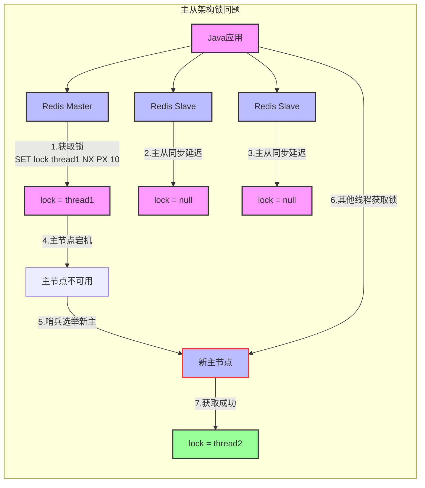
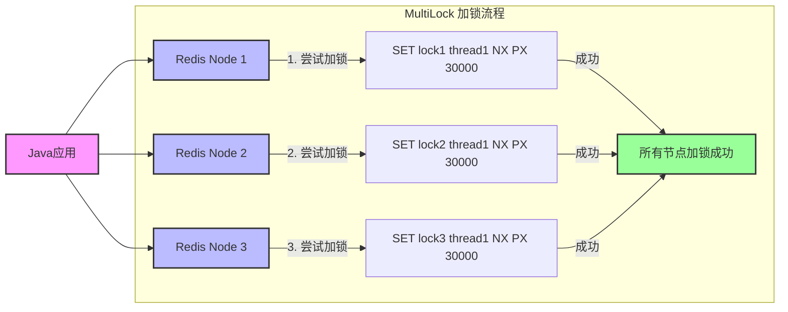
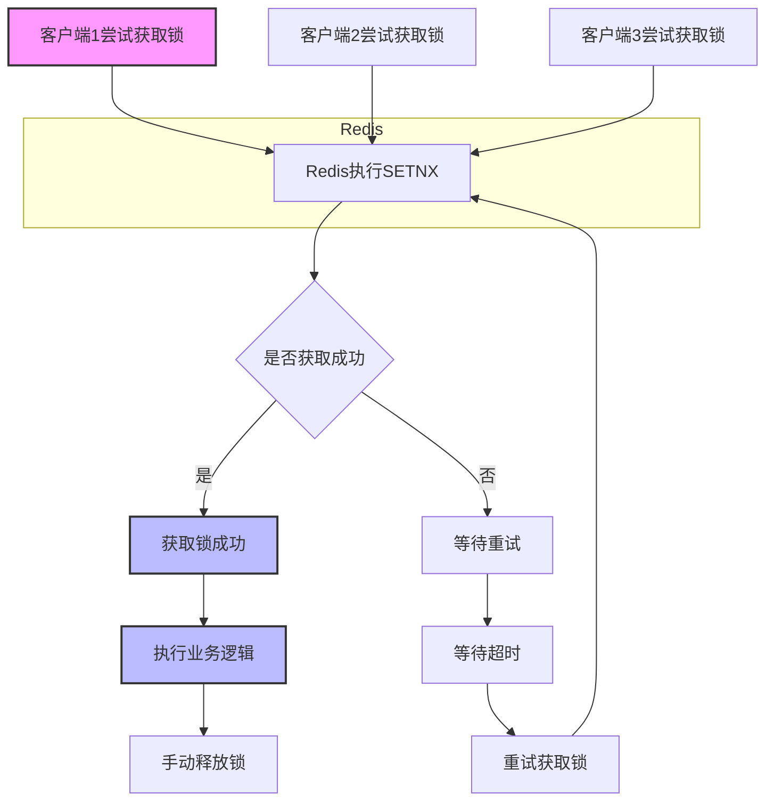
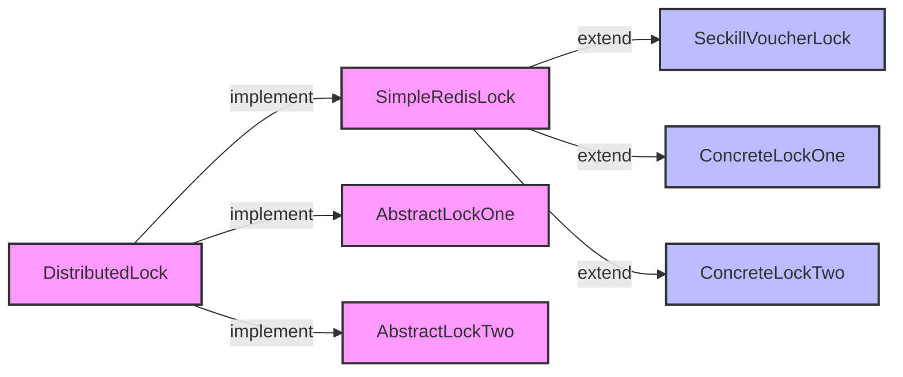
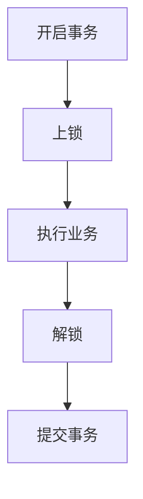
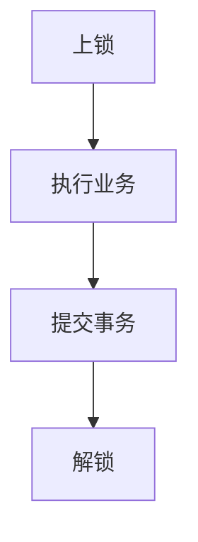

# Redis 业务模式聚合快照：缓存、分布式锁、消息队列、Feed 流与秒杀

本文件为聚合证据快照（immutable raw），按 LLM-Wiki 规范原样收录多篇来源原文，不改动正文，仅增加 provenance 头部与分隔。后续 wiki 页通过 `sources: ["{slug}"]` 引用本快照。

- raw slug: `ingest-redis-business`
- 对应 wiki: `redis-business-patterns`
- Personal-markdown-notes 固定提交: `bbb2126`（`https://github.com/DavidHLP/Personal-markdown-notes/tree/bbb21260029584d41d1c667f88c5c8e2b761aad9`）
- Fuwari 固定提交: `07cee2b`（`https://github.com/DavidHLP/Fuwari/tree/07cee2baf9cee227807dcd68004c5f2493e5ac52`）
- 捕获方式: `gh repo clone --depth 1` 后按路径分组，原样拼接，空文件与完全重复文件已标注但未删改内容

## 来源清单

| 序号 | 仓库 | 相对路径 | 大小 | 去重标注 |
| --- | --- | --- | --- | --- |
| 1 | Personal-markdown-notes | `redis/业务/Feed流设计模型.md` | 12076 |  |
| 2 | Personal-markdown-notes | `redis/业务/Redis代替session的业务.md` | 13463 |  |
| 3 | Personal-markdown-notes | `redis/业务/Redis工具类实现.md` | 23495 |  |
| 4 | Personal-markdown-notes | `redis/业务/Redis消息队列.md` | 7097 |  |
| 5 | Personal-markdown-notes | `redis/业务/Redi缓存模型和思路.md` | 9611 |  |
| 6 | Personal-markdown-notes | `redis/业务/乐观锁和悲观锁.md` | 4478 |  |
| 7 | Personal-markdown-notes | `redis/业务/分布式锁-redission.md` | 15849 |  |
| 8 | Personal-markdown-notes | `redis/业务/分布式锁.md` | 11532 |  |
| 9 | Personal-markdown-notes | `redis/业务/用户签到.md` | 13407 |  |
| 10 | Personal-markdown-notes | `redis/业务/秒杀任务.md` | 20551 |  |
| 11 | Fuwari | `redis/business/FeedFlowDesignModel.md` | 12384 |  |
| 12 | Fuwari | `redis/business/UserSignIn.md` | 13859 |  |
| 13 | Fuwari | `redis/principle/Distributed-Locks-with-Redis.md` | 11947 |  |
| 14 | Fuwari | `redis/principle/Distributed-lock-redisson.md` | 16285 |  |
| 15 | Fuwari | `redis/principle/OptimisticvsPessimisticLocking​.md` | 4874 |  |
| 16 | Fuwari | `redis/principle/Redis-Caching-Models.md` | 10002 |  |
| 17 | Fuwari | `redis/principle/Redis-Helper-Classes.md` | 23897 |  |
| 18 | Fuwari | `redis/principle/Redis-as-a-Message-Broker.md` | 7538 |  |
| 19 | Fuwari | `redis/principle/Replacing-Traditional-Sessions-with-Redis.md` | 13862 |  |
| 20 | Fuwari | `redis/principle/Seckill-System.md` | 20928 |  |

## 免责与边界

- 黑马课程、实战 156KB、Feed 流等笔记含课程截图、本地路径、未验证配置，未作可复现实验复核，仅作证据保存。
- Fuwari 部分文章含零宽度字符（如 `OptimisticvsPessimisticLocking​.md` 路径含 `\u200b`），已按原样保留文件名。
- 个人笔记中的 `redis/业务/事务的作用域.md` 为空文件（仅 1 字节换行），已保留记录。
- 本快照不改写任何原文；冲突或过时结论由 wiki 层显式标注。

---

## 来源 1: Personal-markdown-notes / `redis/业务/Feed流设计模型.md`

- 原始 URL: <https://github.com/DavidHLP/Personal-markdown-notes/blob/bbb21260029584d41d1c667f88c5c8e2b761aad9/redis/业务/Feed流设计模型.md>
- 本地路径: `redis/业务/Feed流设计模型.md`

```markdown
# Feed 流设计模型

## 概念解析

Feed 流（信息流）是一种内容分发模式，系统通过分析用户兴趣和行为，主动推送个性化内容，提供"沉浸式"的浏览体验。用户可以通过无限下拉刷新持续获取新内容，无需主动搜索。

## 传统模式与 Feed 流对比

### 传统内容获取模式

- 用户需主动通过搜索引擎或其他方式查找内容
- 获取过程耗时耗力，需要明确需求并进行搜索
- 内容获取效率较低

[image: 传统内容获取模式](image/Feed流设计模型/1653808641260.png)

### Feed 流模式

- 系统主动推送个性化内容
- 内容自动呈现，无需主动搜索
- 提供"无限滚动"的沉浸式体验
- 提升内容获取效率

[image: Feed流模式](image/Feed流设计模型/1653808993693.png)

## 应用场景

- 社交媒体动态（如微博、Twitter）
- 新闻资讯应用
- 短视频平台
- 电商推荐系统

## 实现模式

### 1. 时间线（Timeline）

按内容发布时间排序，不做个性化筛选，常见于朋友圈等社交场景。

- **优点**：信息全面，不会有缺失。并且实现也相对简单
- **缺点**：信息噪音较多，用户不一定感兴趣，内容获取效率低

### 2. 智能推荐

利用算法分析用户兴趣，推送个性化内容。

- **优点**：信息准确，用户粘度很高，容易沉迷
- **缺点**：如果算法不精准，可能起到反作用，用户体验不好

## 时间线（Timeline）实现

Timeline 的实现主要分为三种模式，各有其适用场景和优缺点。

### 1. 拉模式（读扩散）

- **工作原理**：
  - 用户发布的内容存储在各自的发件箱中
  - 当粉丝查看动态时，系统会实时拉取其关注的所有人的最新内容
  - 拉取的内容按时间排序后展示
    - **优点**：比较节约空间，因为赵六在读信息时，并没有重复读取，而且读取完之后可以把他的收件箱进行清楚。
    - **缺点**：比较延迟，当用户读取数据时才去关注的人里边去读取数据，假设用户关注了大量的用户，那么此时就会拉取海量的内容，对服务器压力巨大。

[image: 1653809450816](image/Feed流设计模型/1653809450816.png)

#### **伪代码实现**：

- **数据模型设计**

```java
// 用户实体
@Data
public class User {
    private Long id;
    private String username;
}

// Feed内容实体
@Data
public class FeedItem {
    private Long id;
    private Long userId;       // 发布者ID
    private String content;     // 内容
    private Date createTime;    // 创建时间
}

```

- **核心服务实现**

```java
@Service
public class PullFeedService {
    @Autowired
    private UserFollowMapper userFollowMapper;
    @Autowired
    private FeedItemMapper feedItemMapper;
    @Autowired
    private RedisTemplate<String, Object> redisTemplate;

    // 发布Feed
    public void publishFeed(FeedItem feedItem) {
        // 1. 保存到数据库
        feedItemMapper.insert(feedItem);

        // 2. 写入Redis发件箱 (使用Sorted Set存储，score为时间戳)
        String postKey = "user:post:" + feedItem.getUserId();
        redisTemplate.opsForZSet().add(
            postKey,
            feedItem.getId(),
            feedItem.getCreateTime().getTime()
        );
    }

    // 获取用户Feed流
    public List<FeedItem> getUserFeed(Long userId, int page, int pageSize) {
        List<FeedItem> result = new ArrayList<>();

        // 1. 获取用户关注列表
        List<Long> followingIds = userFollowMapper.selectFollowingIds(userId);

        // 2. 从Redis拉取所有关注人的最新动态
        Set<Object> feedIds = new TreeSet<>(Collections.reverseOrder());
        for (Long followingId : followingIds) {
            String postKey = "user:post:" + followingId;
            Set<Object> postIds = redisTemplate.opsForZSet().reverseRange(
                postKey, 0, pageSize - 1);
            if (postIds != null) {
                feedIds.addAll(postIds);
            }
        }

        // 3. 分页处理
        List<Object> paginatedIds = feedIds.stream()
            .skip((long) (page - 1) * pageSize)
            .limit(pageSize)
            .collect(Collectors.toList());

        // 4. 批量获取Feed内容
        if (!paginatedIds.isEmpty()) {
            result = feedItemMapper.selectBatchIds(paginatedIds);
        }

        return result;
    }
}
```

- **Redis Key 设计**

```bash
# 用户发件箱（拉模式）
user:post:{userId} -> SortedSet<postId, timestamp>

# 用户关注关系
user:following:{userId} -> Set<followingId>

# 用户信息缓存
user:info:{userId} -> Hash {
    id: 123,
    username: "example"
}
```

### 2. 推模式（写扩散）

**工作原理**：

- 用户发布内容时，立即推送给所有粉丝的收件箱
- 粉丝查看动态时直接读取自己的收件箱
- **优点**：时效快，不用临时拉取
- **缺点**：内存压力大，假设一个大 V 写信息，很多人关注他， 就会写很多分数据到粉丝那边去，

[image: 1653809875208](image/Feed流设计模型/1653809875208.png)

#### 伪代码实现

- **数据模型设计**

```java
// 用户实体
@Data
public class User {
    private Long id;
    private String username;
}

// Feed内容实体
@Data
public class FeedItem {
    private Long id;
    private Long userId;       // 发布者ID
    private String content;     // 内容
    private Date createTime;    // 创建时间
}
```

- **核心服务实现**

```java
@Service
public class PushFeedService {
    @Autowired
    private UserFollowMapper userFollowMapper;
    @Autowired
    private FeedItemMapper feedItemMapper;
    @Autowired
    private RedisTemplate<String, Object> redisTemplate;

    // 发布Feed
    public void publishFeed(FeedItem feedItem) {
        // 1. 保存到数据库
        feedItemMapper.insert(feedItem);

        // 2. 获取发布者的粉丝列表
        List<Long> followers = userFollowMapper.selectFollowerIds(feedItem.getUserId());

        // 3. 推送给所有粉丝的收件箱
        for (Long followerId : followers) {
            String inboxKey = "user:inbox:" + followerId;
            redisTemplate.opsForZSet().add(
                inboxKey,
                feedItem.getId(),
                feedItem.getCreateTime().getTime()
            );

            // 控制收件箱大小，避免无限增长
            redisTemplate.opsForZSet().removeRange(inboxKey, 0, -1000); // 保留最新的1000条
        }
    }

    // 获取用户Feed流
    public List<FeedItem> getUserFeed(Long userId, int page, int pageSize) {
        List<FeedItem> result = new ArrayList<>();

        // 从收件箱获取Feed ID列表
        String inboxKey = "user:inbox:" + userId;
        Set<Object> feedIds = redisTemplate.opsForZSet().reverseRange(
            inboxKey,
            (page - 1) * pageSize,
            page * pageSize - 1
        );

        // 批量获取Feed内容
        if (feedIds != null && !feedIds.isEmpty()) {
            result = feedItemMapper.selectBatchIds(feedIds);
        }

        return result;
    }
}
```

- **Redis Key 设计**

```
# 用户收件箱（推模式）
user:inbox:{userId} -> SortedSet<feedId, timestamp>

# 用户信息缓存
user:info:{userId} -> Hash {
    id: 123,
    username: "example"
}

# 用户关系缓存
user:followers:{userId} -> Set<followerId>
user:followings:{userId} -> Set<followingId>
```

### 3. 推拉结合模式（读写混合）

**工作原理**：

- 对普通用户：采用推模式，直接推送给粉丝
- 对大 V 用户：
  - 活跃粉丝：直接推送到收件箱
  - 非活跃粉丝：需要时从大 V 的发件箱拉取
- 对普通粉丝：直接接收所有内容
- 对非活跃粉丝：按需拉取大 V 内容
  - **优点**：兼具推和拉两种模式的优点
  - **缺点**：需要维护发件箱，增加了系统的复杂度

[image: 1653812346852](image/Feed流设计模型/1653812346852.png)

#### 伪代码实现

- **数据模型设计**

```java
// 用户实体
@Data
public class User {
    private Long id;
    private String username;
    private boolean isVip;      // 是否是大V
    private boolean isActive;   // 是否活跃用户
}

// Feed内容实体
@Data
public class FeedItem {
    private Long id;
    private Long userId;       // 发布者ID
    private String content;     // 内容
    private Date createTime;    // 创建时间
}
```

- **核心服务实现**

```java
@Service
public class FeedService {
    @Autowired
    private UserFollowMapper userFollowMapper;
    @Autowired
    private FeedItemMapper feedItemMapper;
    @Autowired
    private RedisTemplate<String, Object> redisTemplate;

    // 发布Feed
    public void publishFeed(FeedItem feedItem) {
        // 1. 保存到数据库
        feedItemMapper.insert(feedItem);

        // 2. 获取发布者的粉丝列表
        List<Long> followers = userFollowMapper.selectFollowerIds(feedItem.getUserId());

        // 3. 推送给粉丝
        for (Long followerId : followers) {
            User follower = getUserFromCacheOrDB(followerId);

            // 3.1 大V的活跃粉丝直接推送到收件箱
            if (isVipUser(feedItem.getUserId()) && follower.isActive()) {
                pushToInbox(followerId, feedItem);
            }
            // 3.2 普通用户直接推送给所有粉丝
            else if (!isVipUser(feedItem.getUserId())) {
                pushToInbox(followerId, feedItem);
            }
            // 3.3 大V的非活跃粉丝不推送，按需拉取
        }

        // 4. 将内容保存到大V的发件箱（如果是大V）
        if (isVipUser(feedItem.getUserId())) {
            String outboxKey = "user:outbox:" + feedItem.getUserId();
            redisTemplate.opsForZSet().add(outboxKey, feedItem.getId(),
                feedItem.getCreateTime().getTime());
        }
    }

    // 获取用户Feed流
    public List<FeedItem> getUserFeed(Long userId, int page, int pageSize) {
        List<FeedItem> result = new ArrayList<>();

        // 1. 从收件箱获取已推送的内容
        String inboxKey = "user:inbox:" + userId;
        Set<Object> feedIds = redisTemplate.opsForZSet().reverseRange(
            inboxKey, (page - 1) * pageSize, page * pageSize - 1);

        // 2. 如果收件箱不足，且用户关注了大V，则从大V的发件箱拉取
        if ((feedIds == null || feedIds.isEmpty()) && isFollowingVip(userId)) {
            List<Long> followingVips = userFollowMapper.selectVipFollowingIds(userId);
            for (Long vipId : followingVips) {
                String outboxKey = "user:outbox:" + vipId;
                Set<Object> vipFeedIds = redisTemplate.opsForZSet().reverseRange(
                    outboxKey, 0, pageSize - 1);
                if (vipFeedIds != null) {
                    feedIds.addAll(vipFeedIds);
                }
            }
        }

        // 3. 批量获取Feed内容
        if (feedIds != null && !feedIds.isEmpty()) {
            result = feedItemMapper.selectBatchIds(feedIds);
        }

        return result;
    }

    // 辅助方法：推送到用户收件箱
    private void pushToInbox(Long userId, FeedItem feedItem) {
        String inboxKey = "user:inbox:" + userId;
        redisTemplate.opsForZSet().add(
            inboxKey,
            feedItem.getId(),
            feedItem.getCreateTime().getTime()
        );
        // 控制收件箱大小，防止无限增长
        redisTemplate.opsForZSet().removeRange(inboxKey, 0, -1000);
    }

    // 其他辅助方法...
}
```

- **Redis Key 设计**

```
# 用户收件箱（推模式）
user:inbox:{userId} -> SortedSet<feedId, timestamp>

# 大V发件箱（拉模式）
user:outbox:{vipUserId} -> SortedSet<feedId, timestamp>

# 用户信息缓存
user:info:{userId} -> Hash {
    id: 123,
    username: "example",
    isVip: true,
    isActive: true
}

# 用户关系缓存
user:followers:{userId} -> Set<followerId>
user:followings:{userId} -> Set<followingId>
```
```

## 来源 2: Personal-markdown-notes / `redis/业务/Redis代替session的业务.md`

- 原始 URL: <https://github.com/DavidHLP/Personal-markdown-notes/blob/bbb21260029584d41d1c667f88c5c8e2b761aad9/redis/业务/Redis代替session的业务.md>
- 本地路径: `redis/业务/Redis代替session的业务.md`

```markdown
# Redis代替session的业务

## 业务场景

### 1. 用户登录认证
- **邮箱/手机号+密码登录**
  - 用户输入邮箱/手机号和密码进行登录
  - 服务端验证通过后，生成唯一token作为用户凭证
  - 将token作为key，用户信息作为value存入Redis
  - 设置合理的过期时间（如7天）

- **验证码登录**
  - 用户输入手机号/邮箱，请求发送验证码
  - 服务端生成6位验证码，以`login:code:{手机号/邮箱}`为key存入Redis
  - 设置5分钟过期时间
  - 用户提交验证码，服务端进行比对验证

### 2. 会话管理
- **用户信息缓存**
  - 用户登录后，将用户基本信息、权限等存入Redis
  - 使用Hash结构存储，key格式：`user:token:{token}`
  - 包含字段：userId, username, avatar, roles等

- **登录设备管理**
  - 支持多设备同时在线
  - 使用Set结构存储用户的所有登录设备token
  - 实现单点登录/登出功能

### 3. 安全控制
- **登录失败限制**
  - 记录登录失败次数，防止暴力破解
  - 使用`login:fail:{账号}`作为key，设置过期时间
  - 达到阈值后临时锁定账号

- **敏感操作验证**
  - 修改密码、更换绑定手机等操作需要二次验证
  - 生成临时token，短时间有效
  - 验证通过后方可执行敏感操作

## 数据结构设计

### 前端实践

- **request.d.ts**

>  定义请求接口

```typescript
declare module '@/utils/request' {
  interface RequestConfig {
    url: string;
    method: string;
    data?: Record<string, unknown>;
    // 其他配置项可以根据需要添加
  }

  export default function request(config: RequestConfig): Promise<unknown>;
}

// 通用响应接口
export interface Request<T> {
  code: number
  message: string
  data: T
}
```

- **request.ts**

> 前端使用axios进行http请求，使用service.interceptors进行请求拦截

```typescript
import axios from 'axios'
import type { Request } from '@/utils/request/request.d'

// 创建一个 axios 实例
const service = axios.create({
  baseURL: '后端地址',
  timeout: 5000,
  withCredentials: true,
  headers: {
    'Content-Type': 'application/json;charset=UTF-8'
  }
})

// 请求拦截器
service.interceptors.request.use(
  (config) => {
    // 排除登录和注册接口
    const publicPaths = ['登录', '注册'];
    const isPublicPath = publicPaths.some(path => config.url?.endsWith(path));

    const token = localStorage.getItem('token');

    // 如果不是公开路径且没有token，直接拒绝请求
    if (!isPublicPath && !token) {
      window.location.href = '前端登录页面地址';
      return Promise.reject('No token available');
    }

    // 添加token到请求头
    if (token && config.headers) {
      config.headers['Authorization'] = `Bearer ${token}`;
    }
    return config;
  },
  (error) => {
    console.error(error)
    return Promise.reject(error)
  },
)

// 响应拦截器
service.interceptors.response.use(
  (response) => {
    if (response.status === 200) {
      return response.data?.data ?? (response.data as Request<unknown>)
    } else {
      return Promise.reject({
        code: response.status,
        message: response.data?.message || '请求失败',
        data: response.data,
      })
    }
  },
  (error) => {
    if (error.response?.status === 401) {
      localStorage.removeItem('token')
      // 触发全局登出逻辑
      window.dispatchEvent(new CustomEvent('unauthorized'))
    }
    return Promise.reject({
      code: error.response?.status || 500,
      message: error.response?.data?.message || error.message,
      data: error.response?.data,
    })
  },
)
export default service
```

### 后端实践

- **LoginController**

```java
package com.david.hlp.web.system.auth;

import org.springframework.web.bind.annotation.PostMapping;
import org.springframework.web.bind.annotation.RequestBody;
import org.springframework.web.bind.annotation.RequestMapping;
import org.springframework.web.bind.annotation.RestController;

@RestController
@RequestMapping("/api/auth")
public class LoginController {

    private static final String Login_Token_KEY = "login:token:";

    /**
     * 用户登录
     *
     * @param request 登录请求信息
     * @return 登录令牌
     */
    @PostMapping("/login")
    public Result<Token> login(@RequestBody final LoginDTO request) {
        Objects.requireNonNull(request, "登录请求不能为空");
        if (Objects.isNull(request.getEmail()) || Objects.isNull(request.getPassword())) {
            log.warn("登录失败: 请求参数不完整, email={}", request.getEmail());
            throw new BusinessException(ResultCode.BAD_REQUEST);
        }
        try {
            final Token token = authService.login(request);
            HashMap<String, Object> map = new HashMap<>();
            map.put("userid", token.getUserId().toString());
            map.put("username", token.getUsername());
            map.put("avatar", token.getAvatar());
            map.put("roles", token.getRoles());
            map.put("permissions", token.getPermissions());
            redisCache.setCacheMap(Login_Token_KEY +token.getToken(), map, 18L, TimeUnit.HOURS);
            return Result.success(token);
        } catch (final Exception e) {
            log.error("用户登录异常: email={}, 错误={}", request.getEmail(), e.getMessage(), e);
            return Result.error(ResultCode.INTERNAL_ERROR, "登录失败: " + e.getMessage());
        }
    }

}
```

- **JwtAuthenticationFilter**

```java
package com.david.hlp.web.system.auth;

import jakarta.servlet.FilterChain;
import jakarta.servlet.ServletException;
import jakarta.servlet.http.HttpServletRequest;
import jakarta.servlet.http.HttpServletResponse;
import lombok.RequiredArgsConstructor;
import org.springframework.lang.NonNull;
import org.springframework.security.authentication.UsernamePasswordAuthenticationToken;
import org.springframework.security.core.context.SecurityContextHolder;
import org.springframework.security.core.userdetails.UserDetails;
import org.springframework.security.core.userdetails.UserDetailsService;
import org.springframework.security.web.authentication.WebAuthenticationDetailsSource;
import org.springframework.stereotype.Component;
import org.springframework.web.filter.OncePerRequestFilter;

import java.io.IOException;
import java.util.Arrays;
import lombok.extern.slf4j.Slf4j;
import org.springframework.beans.factory.annotation.Qualifier;
import org.springframework.util.Assert;

/**
 * JWT 认证过滤器。
 *
 * 该过滤器会在每次请求时运行一次，用于验证 JWT 并设置用户的认证信息到 Spring Security 的上下文中。
 */
@Slf4j
@Component
@RequiredArgsConstructor // 自动生成包含所有必需依赖项的构造函数
public class JwtAuthenticationFilter extends OncePerRequestFilter {

  // 用于处理 JWT 的服务类
  private final JwtService jwtService;

  // 用于加载用户详细信息
  @Qualifier("userDetailsService")
  private final UserDetailsService userDetailsService;

  private final String[] publicPaths = {
      "/api/auth/login",
      "/api/auth/register",
      "/api/auth/logout",
      "/api/auth/refresh-token",
      "/api/repeater/auth/login",
  };

  /**
   * 核心过滤逻辑。
   *
   * @param request     HTTP 请求对象
   * @param response    HTTP 响应对象
   * @param filterChain 过滤器链，用于继续执行后续过滤器
   * @throws ServletException 如果过滤过程中出现问题
   * @throws IOException      如果发生 I/O 错误
   */
  @Override
  protected void doFilterInternal(
      @NonNull HttpServletRequest request,
      @NonNull HttpServletResponse response,
      @NonNull FilterChain filterChain) throws ServletException, IOException {
    // 记录请求信息：IP、路径和HTTP方法，使用键值对格式方便日志分析
    String clientIP = request.getRemoteAddr();
    String path = request.getServletPath();
    String method = request.getMethod();
    String userAgent = request.getHeader("User-Agent");
    long timestamp = System.currentTimeMillis();

    // 使用键值对格式记录日志，便于后期数据分析
    log.info("ACCESS|ts={}|ip={}|path={}|method={}|ua={}",
        timestamp, clientIP, path, method, userAgent != null ? userAgent : "-");

    // 总是允许 OPTIONS 请求通过（CORS预检请求）
    if (request.getMethod().equals("OPTIONS")) {
      filterChain.doFilter(request, response);
      return;
    }

    // 1. 检查是否为公开路径
    boolean isPublicPath = Arrays.stream(publicPaths).anyMatch(path::startsWith);

    // 2. 检查Authorization头
    final String authHeader = request.getHeader("Authorization");

    // 3. 如果不是公开路径且没有有效token，直接返回401
    if (!isPublicPath && (authHeader == null || !authHeader.startsWith("Bearer "))) {
      log.warn("拒绝访问：路径 {} 需要授权但未提供有效token", path);
      response.setStatus(HttpServletResponse.SC_UNAUTHORIZED);
      return;
    }

    // 4. 如果是公开路径，允许通过
    if (isPublicPath) {
      filterChain.doFilter(request, response);
      return;
    }

    try {
      // 5. 处理正常的带token请求
      final String jwt = authHeader.substring(7);
      Assert.hasText(jwt, "Token不能为空");
      // 验证用户并设置认证信息
      if (SecurityContextHolder.getContext().getAuthentication() == null) {
        // 从 UserDetailsService 加载用户信息
        UserDetails userDetails;
        try {
          userDetails = this.userDetailsService.loadUserByUsername(jwt);
        } catch (Exception e) {
          log.error("加载用户信息失败: {}", e.getMessage());
          response.setStatus(HttpServletResponse.SC_UNAUTHORIZED);
          return;
        }

        // 直接从UserDetails获取权限
        UsernamePasswordAuthenticationToken authToken = new UsernamePasswordAuthenticationToken(
            userDetails,
            null,
            userDetails.getAuthorities());

        // 设置认证请求的详细信息
        authToken.setDetails(
            new WebAuthenticationDetailsSource().buildDetails(request));

        // 确保在认证成功后设置SecurityContext
        SecurityContextHolder.getContext().setAuthentication(authToken);
      }
    } catch (Exception e) {
      log.error("JWT认证过程发生错误: {}", e.getMessage());
      response.setStatus(HttpServletResponse.SC_UNAUTHORIZED);
      return;
    }

    filterChain.doFilter(request, response);
  }
}
```

- **UserDetailsServiceImpl**

```java
package com.david.hlp.web.system.service.imp;

// Java核心导入
import org.springframework.util.Assert;
// Spring框架导入
import org.springframework.security.core.userdetails.UserDetails;
import org.springframework.security.core.userdetails.UserDetailsService;
import org.springframework.security.core.userdetails.UsernameNotFoundException;
import org.springframework.stereotype.Service;

import com.david.hlp.web.common.util.RedisCache;
import com.david.hlp.web.system.entity.auth.AuthUser;

// Lombok导入
import lombok.RequiredArgsConstructor;
import lombok.extern.slf4j.Slf4j;

/**
 * 用户详情服务实现类
 * 实现Spring Security的UserDetailsService接口
 * 用于加载用户特定数据的核心接口
 *
 * @author david
 * @since 1.0
 */
@Slf4j
@Service("userDetailsService")
@RequiredArgsConstructor
public class UserDetailsServiceImpl implements UserDetailsService {

    private final RedisCache redisCache;
    private static final String Login_Token_KEY = "login:token:";

    /**
     * 根据用户邮箱加载用户详情
     *
     * @param Token 用户Token
     * @return UserDetails 用户详情
     * @throws UsernameNotFoundException 当用户不存在时抛出此异常
     */
    @Override
    public UserDetails loadUserByUsername(String Token) throws UsernameNotFoundException {
        Assert.hasText(Token, "Token不能为空");
        // 尝试通过邮箱查找用户
        AuthUser user = redisCache.getCacheObject(Login_Token_KEY + Token);
        if (user == null) {
            log.warn("User not found with Token: {}", Token);
            throw new UsernameNotFoundException("用户并未登录");
        }
        Assert.notNull(user.getRoleId(), "用户角色ID不能为空");
        Assert.notNull(user.getUserId(), "用户ID不能为空");
        Assert.notNull(user.getAuthorities(), "用户权限列表不能为空");
        return user;
    }
}
```

## 最佳实践

1. **合理设置过期时间**
   - 会话token：建议7-30天
   - 验证码：5-10分钟
   - 临时token：10-30分钟

2. **安全建议**
   - 使用HTTPS传输
   - Token设置httpOnly和Secure属性
   - 定期轮换密钥
   - 记录登录日志

3. **性能优化**
   - 使用Pipeline批量操作
   - 合理使用连接池
   - 避免大Key和热Key问题

4. **高可用**
   - 配置Redis主从复制
   - 开启持久化
   - 监控Redis性能指标

## 常见问题

1. **会话失效问题**
   - 实现token续期机制
   - 使用Redisson的看门狗机制

2. **分布式会话一致性**
   - 使用Redis Cluster保证数据分片
   - 配置合理的主从复制策略

3. **缓存击穿/穿透**
   - 对不存在的key设置空值
   - 使用布隆过滤器

4. **数据一致性**
   - 使用Redis事务
   - 实现最终一致性方案
```

## 来源 3: Personal-markdown-notes / `redis/业务/Redis工具类实现.md`

- 原始 URL: <https://github.com/DavidHLP/Personal-markdown-notes/blob/bbb21260029584d41d1c667f88c5c8e2b761aad9/redis/业务/Redis工具类实现.md>
- 本地路径: `redis/业务/Redis工具类实现.md`

```markdown
# Redis工具类实现

- `RedisCacheVo`

```java
import lombok.Data;
import lombok.NoArgsConstructor;

import java.io.Serializable;
import java.time.LocalDateTime;

import lombok.AllArgsConstructor;
import lombok.Builder;

@Data
@Builder
@AllArgsConstructor
@NoArgsConstructor
public class RedisCacheVo<T> implements Serializable {
    private T data;
    private LocalDateTime cacheExpireTime;
} private LocalDateTime cacheExpireTime;
}
```

- `RedisCache`

```java
import java.time.LocalDateTime;
import java.util.Collections;
import java.util.List;
import java.util.Map;
import java.util.Set;
import java.util.concurrent.ExecutorService;
import java.util.concurrent.Executors;
import java.util.concurrent.TimeUnit;
import java.util.stream.Collectors;

import org.redisson.api.RLock;
import org.redisson.api.RReadWriteLock;
import org.redisson.api.RedissonClient;
import org.springframework.core.io.ClassPathResource;
import org.springframework.data.redis.core.DefaultTypedTuple;
import org.springframework.data.redis.core.RedisTemplate;
import org.springframework.data.redis.core.ValueOperations;
import org.springframework.data.redis.core.ZSetOperations;
import org.springframework.data.redis.core.script.DefaultRedisScript;
import org.springframework.stereotype.Component;

import cn.hutool.core.lang.TypeReference;
import cn.hutool.core.util.StrUtil;
import cn.hutool.json.JSONUtil;
import lombok.RequiredArgsConstructor;
import lombok.extern.slf4j.Slf4j;

/**
 * Redis 工具类
 * 使用 RedissonClient 处理分布式锁
 * 使用 RedisTemplate 处理基础缓存操作
 */
@SuppressWarnings(value = { "unchecked", "rawtypes" })
@Slf4j
@Component
@RequiredArgsConstructor
public class RedisCache {
    private final RedisTemplate redisTemplate;
    private final RedissonClient redissonClient;

    // 锁的默认超时时间，单位：秒
    private static final long DEFAULT_LEASE_TIME = 30;
    private static final long DEFAULT_WAIT_TIME = 10;
    private static final long CACHE_NULL_TTL = 2L; // 缓存空值的过期时间,单位：分钟
    private static final ExecutorService CACHE_REBUILD_EXECUTOR = Executors.newFixedThreadPool(10);
    private static final DefaultRedisScript<Long> UNLOCK_SCRIPT;

    static {
        UNLOCK_SCRIPT = new DefaultRedisScript<>();
        UNLOCK_SCRIPT.setLocation(new ClassPathResource("unlock.lua"));
        UNLOCK_SCRIPT.setResultType(Long.class);
    }

    /**
     * 使用lua脚本删除
     */
    public void useLuaDelete(String key, String value) {
        redisTemplate.execute(
                UNLOCK_SCRIPT,
                Collections.singletonList(key),
                value);
    }

    /**
     * redis自增
     */
    public Long increment(String keyPrefix, String date) {
        return (Long) redisTemplate.opsForValue().increment("icr:" + keyPrefix + ":" + date);
    }

    // ==============================String=============================

    /**
     * 缓存基本的对象
     */
    public <T> void setCacheObject(final String key, final T value) {
        redisTemplate.opsForValue().set(key, value);
    }

    /**
     * 获取缓存的基本对象
     *
     * @param key 缓存的键
     * @return 缓存的对象
     */
    public <T> T getCacheObject(final String key) {
        ValueOperations<String, T> operation = redisTemplate.opsForValue();
        return operation.get(key);
    }

    /**
     * 缓存基本的对象（带过期时间）
     */
    public <T> Boolean setCacheObject(final String key, final T value, final long timeout, final TimeUnit timeUnit) {
        redisTemplate.opsForValue().set(key, value, timeout, timeUnit);
        return Boolean.TRUE;
    }

    /**
     * 删除缓存对象
     *
     * @param key 缓存的键
     * @return 是否删除成功
     */
    public Boolean deleteObject(final String key) {
        if (key == null) {
            return Boolean.FALSE;
        }
        return redisTemplate.delete(key);
    }

    // ==============================Hash=============================


    /**
     * 缓存Hash数据
     */
    public <T> void setCacheMap(final String key, final Map<String, T> dataMap) {
        if (dataMap != null && !dataMap.isEmpty()) {
            redisTemplate.opsForHash().putAll(key, dataMap);
        }
    }

    /**
     * 获取整个Hash缓存
     *
     * @param key 缓存的键
     * @return Hash对象
     */
    public <T> Map<String, T> getCacheMap(final String key) {
        return redisTemplate.<String, T>opsForHash().entries(key);
    }

    /**
     * 缓存Hash数据（带过期时间）
     */
    public <T> Boolean setCacheMap(final String key, final Map<String, T> dataMap, final long timeout, final TimeUnit timeUnit) {
        if (dataMap != null) {
            redisTemplate.opsForHash().putAll(key, dataMap);
            return expire(key, timeout, timeUnit);
        }
        return Boolean.FALSE;
    }

    /**
     * 删除Hash中的指定字段
     *
     * @param key   缓存的键
     * @param hKeys 要删除的字段数组
     * @return 删除的字段数量
     */
    public Long deleteHashKeys(final String key, final Object... hKeys) {
        if (key == null || hKeys == null || hKeys.length == 0) {
            return 0L;
        }
        return redisTemplate.opsForHash().delete(key, hKeys);
    }

    // ==============================List=============================


    /**
     * 缓存List数据
     */
    public <T> Long setCacheList(final String key, final List<T> dataList) {
        if (dataList != null && !dataList.isEmpty()) {
            return redisTemplate.opsForList().rightPushAll(key, dataList);
        }
        return 0L;
    }

    /**
     * 获取List缓存
     *
     * @param key 缓存的键
     * @return List对象
     */
    public <T> List<T> getCacheList(final String key) {
        return redisTemplate.opsForList().range(key, 0, -1);
    }

    /**
     * 缓存List数据（带过期时间）
     */
    public <T> Boolean setCacheList(final String key, final List<T> dataList, final long timeout, final TimeUnit timeUnit) {
        if (dataList != null && !dataList.isEmpty()) {
            redisTemplate.opsForList().rightPushAll(key, dataList);
            return expire(key, timeout, timeUnit);
        }
        return Boolean.FALSE;
    }

    /**
     * 删除List中的值
     *
     * @param key   缓存的键
     * @param count 要删除的数量
     * @param value 要删除的值
     * @return 删除的元素数量
     */
    public <T> Long deleteFromList(final String key, long count, T value) {
        if (key == null) {
            return 0L;
        }
        return redisTemplate.opsForList().remove(key, count, value);
    }

    /**
     * 裁剪List，只保留指定区间内的元素
     *
     * @param key   缓存的键
     * @param start 开始位置
     * @param end   结束位置
     */
    public void trimList(final String key, long start, long end) {
        if (key != null) {
            redisTemplate.opsForList().trim(key, start, end);
        }
    }

    // ==============================Set=============================


    /**
     * 缓存Set数据
     */
    public <T> Long setCacheSet(final String key, final Set<T> dataSet) {
        if (dataSet != null && !dataSet.isEmpty()) {
            return redisTemplate.opsForSet().add(key, dataSet.toArray());
        }
        return 0L;
    }

    /**
     * 获取Set缓存
     *
     * @param key 缓存的键
     * @return Set对象
     */
    public <T> Set<T> getCacheSet(final String key) {
        return redisTemplate.opsForSet().members(key);
    }

    /**
     * 缓存Set数据（带过期时间）
     */
    public <T> Boolean setCacheSet(final String key, final Set<T> dataSet, final long timeout, final TimeUnit timeUnit) {
        if (dataSet != null && !dataSet.isEmpty()) {
            redisTemplate.opsForSet().add(key, dataSet.toArray());
            return expire(key, timeout, timeUnit);
        }
        return Boolean.FALSE;
    }

    /**
     * 从Set中移除元素
     *
     * @param key    缓存的键
     * @param values 要移除的值数组
     * @return 移除的元素数量
     */
    public <T> Long removeFromSet(final String key, final Object... values) {
        if (key == null || values == null || values.length == 0) {
            return 0L;
        }
        return redisTemplate.opsForSet().remove(key, values);
    }

    /**
     * 从Set中随机移除并返回一个元素
     *
     * @param key 缓存的键
     * @return 被移除的元素
     */
    public <T> T popFromSet(final String key) {
        if (key == null) {
            return null;
        }
        return (T) redisTemplate.opsForSet().pop(key);
    }

    // ==============================ZSet=============================


    /**
     * 缓存ZSet数据
     */
    public <T> Boolean setCacheZSet(final String key, final Set<T> dataSet, final double score) {
        if (dataSet != null && !dataSet.isEmpty()) {
            Set<ZSetOperations.TypedTuple<T>> tuples = dataSet.stream()
                    .map(value -> new DefaultTypedTuple<>(value, score))
                    .collect(Collectors.toSet());
            Long result = redisTemplate.opsForZSet().add(key, tuples);
            return result != null && result > 0L;
        }
        return Boolean.FALSE;
    }

    /**
     * 获取ZSet缓存（按分数升序）
     *
     * @param key 缓存的键
     * @return Set对象
     */
    public <T> Set<T> getCacheZSet(final String key) {
        return (Set<T>) redisTemplate.opsForZSet().range(key, 0, -1);
    }

    /**
     * 获取ZSet缓存（按分数范围）
     *
     * @param key 缓存的键
     * @param min 最小分数
     * @param max 最大分数
     * @return Set对象
     */
    public <T> Set<T> getCacheZSetByScore(final String key, double min, double max) {
        return (Set<T>) redisTemplate.opsForZSet().rangeByScore(key, min, max);
    }

    /**
     * 缓存ZSet数据（带过期时间）
     */
    public <T> Boolean setCacheZSet(final String key, final Set<T> dataSet, final double score, final long timeout, final TimeUnit timeUnit) {
        if (dataSet != null && !dataSet.isEmpty()) {
            Set<ZSetOperations.TypedTuple<T>> tuples = dataSet.stream()
                    .map(value -> new DefaultTypedTuple<>(value, score))
                    .collect(Collectors.toSet());
            Long result = redisTemplate.opsForZSet().add(key, tuples);
            if (result != null && result > 0) {
                return expire(key, timeout, timeUnit);
            }
        }
        return Boolean.FALSE;
    }

    /**
     * 从ZSet中移除元素
     *
     * @param key    缓存的键
     * @param values 要移除的值数组
     * @return 移除的元素数量
     */
    public <T> Long removeFromZSet(final String key, final Object... values) {
        if (key == null || values == null || values.length == 0) {
            return 0L;
        }
        return redisTemplate.opsForZSet().remove(key, values);
    }

    /**
     * 移除ZSet中指定分数区间的元素
     *
     * @param key 缓存的键
     * @param min 最小分数
     * @param max 最大分数
     * @return 移除的元素数量
     */
    public Long removeFromZSetByScore(final String key, double min, double max) {
        if (key == null) {
            return 0L;
        }
        return redisTemplate.opsForZSet().removeRangeByScore(key, min, max);
    }

    /**
     * 移除ZSet中指定排名区间的元素
     *
     * @param key   缓存的键
     * @param start 开始排名
     * @param end   结束排名
     * @return 移除的元素数量
     */
    public Long removeFromZSetByRank(final String key, long start, long end) {
        if (key == null) {
            return 0L;
        }
        return redisTemplate.opsForZSet().removeRange(key, start, end);
    }

    // ==============================Other=============================

    /**
     * 设置有效时间
     */
    private boolean expire(final String key, final long timeout, final TimeUnit unit) {
        return Boolean.TRUE.equals(redisTemplate.expire(key, timeout, unit));
    }

    /**
     * 获取有效时间
     */
    public long getExpire(final String key) {
        return redisTemplate.getExpire(key);
    }

    /**
     * 判断 key是否存在
     */
    public Boolean hasKey(String key) {
        return redisTemplate.hasKey(key);
    }

    /**
     * 获取分布式锁
     */
    public boolean tryLock(String lockKey, long waitTime, long leaseTime, TimeUnit unit) {
        try {
            return redissonClient.getLock(lockKey).tryLock(waitTime, leaseTime, unit);
        } catch (InterruptedException e) {
            Thread.currentThread().interrupt();
            log.error("获取分布式锁[{}]失败：{}", lockKey, e.getMessage(), e);
            return false;
        } catch (Exception e) {
            log.error("获取分布式锁[{}]发生异常：{}", lockKey, e.getMessage(), e);
            return false;
        }
    }

    /**
     * 获取分布式锁（使用默认参数）
     */
    public boolean tryLock(String lockKey) {
        return tryLock(lockKey, DEFAULT_WAIT_TIME, DEFAULT_LEASE_TIME, TimeUnit.SECONDS);
    }

    /**
     * 释放分布式锁
     */
    public void unlock(String lockKey) {
        try {
            RLock lock = redissonClient.getLock(lockKey);
            if (lock.isHeldByCurrentThread()) {
                lock.unlock();
            }
        } catch (Exception e) {
            log.error("释放分布式锁[{}]发生异常：{}", lockKey, e.getMessage(), e);
        }
    }

    /**
     * 获取读锁
     */
    public boolean tryReadLock(String lockKey, long waitTime, long leaseTime, TimeUnit unit) {
        try {
            return redissonClient.getReadWriteLock(lockKey).readLock().tryLock(waitTime, leaseTime, unit);
        } catch (InterruptedException e) {
            Thread.currentThread().interrupt();
            log.error("获取读锁[{}]失败：{}", lockKey, e.getMessage(), e);
            return false;
        } catch (Exception e) {
            log.error("获取读锁[{}]发生异常：{}", lockKey, e.getMessage(), e);
            return false;
        }
    }

    /**
     * 获取读锁（使用默认参数）
     */
    public boolean tryReadLock(String lockKey) {
        return tryReadLock(lockKey, DEFAULT_WAIT_TIME, DEFAULT_LEASE_TIME, TimeUnit.SECONDS);
    }

    /**
     * 获取写锁
     */
    public boolean tryWriteLock(String lockKey, long waitTime, long leaseTime, TimeUnit unit) {
        try {
            return redissonClient.getReadWriteLock(lockKey).writeLock().tryLock(waitTime, leaseTime, unit);
        } catch (InterruptedException e) {
            Thread.currentThread().interrupt();
            log.error("获取写锁[{}]失败：{}", lockKey, e.getMessage(), e);
            return false;
        } catch (Exception e) {
            log.error("获取写锁[{}]发生异常：{}", lockKey, e.getMessage(), e);
            return false;
        }
    }

    /**
     * 获取写锁（使用默认参数）
     */
    public boolean tryWriteLock(String lockKey) {
        return tryWriteLock(lockKey, DEFAULT_WAIT_TIME, DEFAULT_LEASE_TIME, TimeUnit.SECONDS);
    }

    /**
     * 释放读写锁
     *
     * @param lockKey     锁的key
     * @param isWriteLock 是否是写锁
     */
    public void unlockReadWriteLock(String lockKey, boolean isWriteLock) {
        try {
            RReadWriteLock readWriteLock = redissonClient.getReadWriteLock(lockKey);
            if (isWriteLock) {
                RLock writeLock = readWriteLock.writeLock();
                if (writeLock.isHeldByCurrentThread()) {
                    writeLock.unlock();
                }
            } else {
                RLock readLock = readWriteLock.readLock();
                if (readLock.isHeldByCurrentThread()) {
                    readLock.unlock();
                }
            }
        } catch (Exception e) {
            log.error("释放{}锁[{}]发生异常：{}", isWriteLock ? "写" : "读", lockKey, e.getMessage(), e);
        }
    }

    /**
     * 设置带逻辑过期的缓存
     */
    public <T> void setWithLogicalExpire(String key, T value, Long time, TimeUnit unit) {
        RedisCacheVo<T> redisCacheVo = RedisCacheVo.<T>builder()
                .data(value)
                .cacheExpireTime(LocalDateTime.now().plusSeconds(unit.toSeconds(time)))
                .build();
        redisTemplate.opsForValue().set(key, JSONUtil.toJsonStr(redisCacheVo));
    }

    /**
     * 缓存加载函数式接口
     */
    @FunctionalInterface
    public interface CacheLoader<T> {
        T load();
        /**
         * 创建一个空的 T 类型实例
         * 子类可以覆盖此方法以提供特定的空实例
         */
        default T emptyInstance() {
            try {
                // 尝试通过反射创建实例
                return (T) new Object();
            } catch (Exception e) {
                return null;
            }
        }
    }

    /**
     * 使用 Redisson 分布式锁解决缓存击穿问题
     */
    public <T> T getWithMutex(final String key, final String lockKey,
                             final long waitTime, final long leaseTime,
                             final long cacheTimeout, final TimeUnit timeUnit,
                             final CacheLoader<T> loader) {
        // 1. 先查缓存
        T value = getCacheObject(key);
        if (value != null) {
            return value;
        }

        // 2. 缓存未命中，使用 Redisson 获取分布式锁
        try {
            // 尝试获取锁
            if (tryLock(lockKey, waitTime, leaseTime, timeUnit)) {
                try {
                    // 3. 获取锁成功,再次检查缓存(双重检查)
                    value = getCacheObject(key);
                    if (value != null) {
                        return value;
                    }

                    try {
                        // 4. 从数据源加载数据
                        value = loader.load();
                        // 5. 设置缓存,空数据也缓存,防止缓存穿透
                        T emptyValue = loader.emptyInstance();
                        setCacheObject(key, value != null ? value : emptyValue,
                                value != null ? cacheTimeout : CACHE_NULL_TTL,
                                timeUnit);
                        return value;
                    } catch (Exception e) {
                        log.error("从数据源加载数据时发生异常, key: {}", key, e);
                        throw new RuntimeException("加载数据失败", e);
                    }
                } finally {
                    // 释放锁
                    unlock(lockKey);
                }
            } else {
                // 6. 获取锁失败，直接返回空
                log.warn("获取分布式锁失败, 直接返回空, lockKey: {}", lockKey);
                return loader.emptyInstance();
            }
        } catch (Exception e) {
            log.error("获取缓存失败, key: {}", key, e);
            throw new RuntimeException("获取缓存失败", e);
        }
    }

    /**
     * 使用 Redisson 分布式锁解决缓存击穿问题（使用默认等待时间和租约时间）
     */
    public <T> T getWithMutex(final String key, final String lockKey,
                             final long cacheTimeout, final TimeUnit timeUnit,
                             final CacheLoader<T> loader) {
        return getWithMutex(key, lockKey, DEFAULT_WAIT_TIME, DEFAULT_LEASE_TIME,
                            cacheTimeout, timeUnit, loader);
    }

    /**
     * 使用逻辑过期时间获取缓存，适用于热点数据缓存重建
     */
    public <T> T getWithLogicalExpire(final String key, final String lockKey,
            final long waitTime, final long leaseTime, final long cacheTimeout,
            final TimeUnit timeUnit, final CacheLoader<T> loader) {
        // 1. 查询缓存
        String json = getCacheObject(key);
        if (StrUtil.isBlank(json)) {
            log.debug("缓存不存在, key: {}", key);
            return null;
        }

        // 2. 反序列化缓存数据
        RedisCacheVo<T> cacheVo = null;
        try {
            cacheVo = JSONUtil.toBean(json, new TypeReference<RedisCacheVo<T>>() {
            }, false);
            if (cacheVo == null || cacheVo.getData() == null) {
                log.warn("缓存数据为空, key: {}", key);
                return null;
            }

            // 3. 检查缓存是否过期
            if (cacheVo.getCacheExpireTime().isAfter(LocalDateTime.now())) {
                log.debug("缓存未过期, 直接返回, key: {}", key);
                return cacheVo.getData();
            }
        } catch (Exception e) {
            log.error("反序列化缓存数据异常, key: {}, json: {}", key, json, e);
            return null;
        }

        // 4. 缓存已过期,尝试获取分布式锁进行重建
        final T expiredData = cacheVo.getData();

        // 5. 尝试获取分布式锁
        if (!tryLock(lockKey, waitTime, leaseTime, timeUnit)) {
            log.debug("获取分布式锁失败, 返回过期数据, key: {}, lockKey: {}", key, lockKey);
            return expiredData; // 获取锁失败，返回旧数据
        }

        // 6. 获取锁成功,异步重建缓存
        asyncRebuildCache(key, lockKey, cacheTimeout, timeUnit, loader);

        // 7. 返回过期的数据
        return expiredData;
    }

    /**
     * 使用逻辑过期时间获取缓存（使用默认等待时间和租约时间）
     */
    public <T> T getWithLogicalExpire(final String key, final String lockKey,
                                     final long cacheTimeout, final TimeUnit timeUnit,
                                     final CacheLoader<T> loader) {
        return getWithLogicalExpire(key, lockKey, DEFAULT_WAIT_TIME, DEFAULT_LEASE_TIME,
                                  cacheTimeout, timeUnit, loader);
    }

    /**
     * 异步重建缓存
     */
    private <T> void asyncRebuildCache(String key, String lockKey,
                                      long cacheTimeout, TimeUnit timeUnit,
                                      CacheLoader<T> loader) {
        CACHE_REBUILD_EXECUTOR.submit(() -> {
            try {
                log.debug("开始异步重建缓存, key: {}", key);
                // 1. 加载新数据
                T newData = loader.load();

                // 2. 更新缓存
                if (newData != null) {
                    setWithLogicalExpire(key, newData, cacheTimeout, timeUnit);
                    log.debug("缓存重建成功, key: {}", key);
                } else {
                    log.warn("加载的数据为空,设置空值防止缓存穿透, key: {}", key);
                    setCacheObject(key, "", CACHE_NULL_TTL, TimeUnit.MINUTES);
                }
            } catch (Exception e) {
                log.error("缓存重建异常, key: {}", key, e);
            } finally {
                // 3. 释放锁
                unlock(lockKey);
                log.debug("释放分布式锁, lockKey: {}", lockKey);
            }
        });
    }
}

```
```

## 来源 4: Personal-markdown-notes / `redis/业务/Redis消息队列.md`

- 原始 URL: <https://github.com/DavidHLP/Personal-markdown-notes/blob/bbb21260029584d41d1c667f88c5c8e2b761aad9/redis/业务/Redis消息队列.md>
- 本地路径: `redis/业务/Redis消息队列.md`

```markdown
# Redis 消息队列

- 消息队列：存储和管理消息，也被称为消息代理（Message Broker）
- 生产者：发送消息到消息队列
- 消费者：从消息队列获取消息并处理消息

[image: 1653574849336](image/Redis消息队列/1653574849336.png)

## Redis 消息队列-基于 List 实现消息队列

Redis 的 List 数据结构是一个双向链表，非常适合用来模拟消息队列。通过将消息存储在 List 中，可以实现先进先出（FIFO）的消息处理机制。

1. **基础实现**：

   - 使用`LPUSH + RPOP`组合：从左侧入队，从右侧出队
   - 或使用`RPUSH + LPOP`组合：从右侧入队，从左侧出队

2. **阻塞式实现**：
   - 基础实现中，当队列为空时，`RPOP`/`LPOP`会立即返回`null`
   - 使用`BRPOP`/`BLPOP`命令可以实现阻塞式获取，当队列为空时会等待新消息

[image: 1653575176451](image/Redis消息队列/1653575176451.png)

**优点**：

- **内存管理**：利用 Redis 存储消息，不受 JVM 内存限制
- **数据安全**：支持 RDB 和 AOF 持久化，确保消息不丢失
- **消息顺序**：严格保证消息的先进先出顺序

**缺点**：

- **可靠性**：消费者处理消息失败时，消息会丢失（无确认机制）
- **扩展性**：一个消息只能被一个消费者处理（单消费者模型）

## Redis 消息队列-基于 PubSub 实现消息队列

Redis 的 PubSub（发布/订阅）是一种基于消息传递的通信模型，它允许消息的发送者（发布者）将消息发送到特定的频道，而订阅了该频道的所有接收者（订阅者）都会收到这些消息。

- 核心命令
  - `SUBSCRIBE channel`：订阅指定频道
  - `PUBLISH channel message`：向指定频道发布消息
  - `PSUBSCRIBE pattern`：使用模式匹配订阅多个频道
  - `UNSUBSCRIBE [channel]`：退订频道
  - `PUNSUBSCRIBE [pattern]`：退订模式匹配的频道

[image: 1653575506373](image/Redis消息队列/1653575506373.png)

**优势**：

- **发布/订阅模式**：天然支持一对多消息广播
- **实时性**：消息即时推送给所有订阅者
- **解耦性**：生产者和消费者完全解耦，互不感知对方存在

**局限性**：

- **可靠性**：
  - 不支持消息持久化，服务重启后消息会丢失
  - 没有消息确认机制，消息可能丢失
  - 消息缓冲区有大小限制，超出后旧消息会被丢弃
- **扩展性**：
  - 消费者无法回溯历史消息
  - 无法保证消息的有序性

## Redis 消息队列-基于 Stream 实现消息队列

Redis Stream 是 Redis 5.0 引入的一种新数据类型，它提供了完善的消息队列功能，解决了之前 List 和 PubSub 的诸多限制。

- 核心概念
  - **消息流**：一个持久的、仅追加的日志数据结构
  - **消息 ID**：由时间戳-序号组成的唯一标识符
  - **消费者组**：允许多个消费者协同消费同一个流

**1. 发送消息**
使用`XADD`命令向流中添加消息：

```
XADD stream_name * field1 value1 [field2 value2 ...]
```

[image: 1653577301737](image/Redis消息队列/1653577301737.png)

**2. 读取消息**
使用`XREAD`命令读取消息：

- 非阻塞模式：

  ```
  XREAD COUNT n STREAMS stream_name start_id
  ```

  [image: 1653577445413](image/Redis消息队列/1653577445413.png)

- 阻塞模式（等待新消息）：
  ```
  XREAD BLOCK ms STREAMS stream_name $
  ```
  [image: 1653577659166](image/Redis消息队列/1653577659166.png)

**3. 消费者组模式**

```
# 创建消费者组
XGROUP CREATE stream_name group_name start_id

# 消费者从组中读取消息
XREADGROUP GROUP group_name consumer_name COUNT n STREAMS stream_name >
```

**特点分析**

**优势**：

- **消息持久化**：所有消息都会被持久化存储
- **消息回溯**：支持按 ID 范围查询历史消息
- **多消费者支持**：
  - 支持多个消费者组独立消费
  - 支持消费者组内的负载均衡
- **消息确认机制**：消费者需要显式确认消息处理完成

**注意事项**：

- **消息 ID 选择**：
  - `$`表示最新消息
  - `0-0`表示从最开始读取
  - 指定具体 ID 可精确控制读取位置
- **消息漏读风险**：
  - 使用`$`作为起始 ID 时，如果处理消息期间有新消息到达，可能会漏读
  - 建议使用消费者组模式避免此问题
- **内存管理**：
  - 需要合理设置流的长度限制
  - 可以使用`XTRIM`命令手动清理旧消息

## Redis 消息队列-基于 Stream 的消息队列-消费者组模式

### 消费者组概念

消费者组（Consumer Group）允许多个消费者作为一个逻辑单元共同消费同一个流中的消息，主要特点包括：

- 消息在组内是负载均衡的
- 每个消息只会被组内的一个消费者处理
- 支持消息确认机制
- 提供未处理消息的追踪

[image: 1653577801668](image/Redis消息队列/1653577801668.png)

### 消费者组管理

**1. 创建消费者组**

```
XGROUP CREATE key groupname ID [MKSTREAM]
```

- `key`：流名称
- `groupname`：消费者组名称
- `ID`：起始消息 ID
  - `$`：从最新的消息开始消费
  - `0`：从最早的消息开始消费
- `MKSTREAM`：如果流不存在则自动创建

[image: 1653577984924](image/Redis消息队列/1653577984924.png)

**2. 管理消费者组**

- 删除消费者组：

  ```
  XGROUP DESTROY key groupname
  ```

- 添加消费者：

  ```
  XGROUP CREATECONSUMER key groupname consumername
  ```

- 删除消费者：
  ```
  XGROUP DELCONSUMER key groupname consumername
  ```

### 消费者消息处理

**1. 读取消息**

```
XREADGROUP GROUP groupname consumername [COUNT n] [BLOCK ms] [NOACK] STREAMS key [key ...] ID [ID ...]
```

**参数说明**：

- `groupname`：消费者组名称
- `consumername`：消费者名称（自动创建）
- `COUNT n`：每次读取的最大消息数
- `BLOCK ms`：阻塞等待时间（毫秒）
- `NOACK`：自动确认消息
- `ID`：消息 ID
  - `>`：读取未消费的新消息
  - `0`：从 pending-list 读取已消费未确认的消息

**2. 消息确认**

```
XACK key groupname ID [ID ...]
```

确认消息处理完成，从 pending-list 中移除。

### 消费者实现模式

**基本消费模式**：

```python
while True:
    # 读取新消息
    messages = XREADGROUP GROUP group1 consumer1 COUNT 1 BLOCK 2000 STREAMS mystream >

    if messages:
        # 处理消息
        process_message(messages[0])

        # 确认消息
        XACK mystream group1 messages[0].id
```

### 特点总结

**核心优势**：

- **消息可靠性**：
  - 支持消息确认机制（ACK）
  - 消息处理失败可重新投递
  - 避免消息丢失
- **负载均衡**：
  - 组内消费者自动分配消息
  - 水平扩展消费能力
- **消息回溯**：
  - 支持重新处理历史消息
  - 可查看未确认消息列表

**使用建议**：

- 合理设置消费者数量
- 及时确认处理完成的消息
- 监控 pending-list 长度
- 处理消费者故障转移

### 方案对比

[image: 1653578560691](image/Redis消息队列/1653578560691.png)
```

## 来源 5: Personal-markdown-notes / `redis/业务/Redi缓存模型和思路.md`

- 原始 URL: <https://github.com/DavidHLP/Personal-markdown-notes/blob/bbb21260029584d41d1c667f88c5c8e2b761aad9/redis/业务/Redi缓存模型和思路.md>
- 本地路径: `redis/业务/Redi缓存模型和思路.md`

```markdown
# Redis缓存模型和思路

> [!NOTE]
> Redis缓存模型和思路是将用户常查的数据缓存到Redis中，以减轻数据库的压力，解决硬盘和内存的速度不匹配的问题

[image: 1749010575049](image/Redi缓存模型和思路/1749010575049.png)

## 1. 缓存更新策略

1. 内存淘汰：redis自动进行，当redis内存达到咱们设定的max-memery的时候，会自动触发淘汰机制，淘汰掉一些不重要的数据(可以自己设置策略方式)
2. 超时剔除：当我们给redis设置了过期时间ttl之后，redis会将超时的数据进行删除，方便咱们继续使用缓存
3. 主动更新：我们可以手动调用方法把缓存删掉，通常用于解决缓存和数据库不一致问题

[image: 1749011282398](image/Redi缓存模型和思路/1653322506393.png)

- 业务场景：
  - 低一致性：使用内存淘汰策略，例如：职位类型信息缓存
  - 高一致性：使用主动更新策略，超时剔除兜底策略，例如：登录Token缓存，职位详细信息缓存

## 2. 数据库缓存不一致解决方案

由于我们的**缓存的数据源来自于数据库**,而数据库的**数据是会发生变化的**,因此,如果当数据库中**数据发生变化,而缓存却没有同步**,此时就会有**一致性问题存在**,其后果是:

用户使用缓存中的过时数据,就会产生类似多线程数据安全问题,从而影响业务,产品口碑等;怎么解决呢？有如下几种方案：

1. Cache Aside Pattern 人工编码方式
   - 缓存调用者在更新完数据库后再去更新缓存，也称之为双写方案
2. Read/Write Through Pattern
   - 由系统本身完成，数据库与缓存的问题交由系统本身去处理
3. Write Behind Caching Pattern
   - 调用者只操作缓存，其他线程去异步处理数据库，实现最终一致

[image: 1653322857620](image/Redi缓存模型和思路/1653322857620.png)

### 数据库和缓存不一致采用什么方案

> [!NOTE]
> 选择 Cache Aside Pattern 解决方案（强一致性），以解决缓存与数据库不一致的问题

#### 问题

操作缓存和数据库时有三个问题需要考虑：

1. 是否删除缓存还是更新缓存？
2. 如何保证缓存与数据库的操作的同时成功或失败？
3. 先操作缓存还是先操作数据库？

#### 选择

综合考虑使用 Cache Aside Pattern，但是方案一调用者如何处理呢？

- 删除缓存还是更新缓存？
  - 更新缓存：每次更新数据库都更新缓存，无效写操作较多
  - 删除缓存：更新数据库时让缓存失效，查询时再更新缓存
- 如何保证缓存与数据库的操作的同时成功或失败？
  - 单体系统，将缓存与数据库操作放在一个事务
  - 分布式系统，利用TCC等分布式事务方案
- 先操作缓存还是先操作数据库？
  - 先删除缓存，再操作数据库
  - 先操作数据库，再删除缓存

#### 选择理由

> [!NOTE]
> 设计原则 ， 先对数据库操作，再对缓存操作 ， 保证数据最终一致性 ， 缓存最终和数据库一致

我们选择的方案是 Cache Aside Pattern，先操作数据库，再删除缓存，原因在于，如果你选择第一种方案，在两个线程并发来访问时，假设线程1先来（先删除了缓存，但还没有更新数据库），他先把缓存删了，此时线程2过来，他查询缓存数据（已经被线程一删除）并不存在，此时他写入缓存，当他写入缓存后（由于线程一还没有更新数据，所以写入缓存的数据是从数据库中得到的旧数据），线程1再执行更新动作时，实际上写入的就是旧的数据，新的数据被旧数据覆盖了。

[image: 1653323595206](image/Redi缓存模型和思路/1653323595206.png)

## 3. 缓存穿透问题的解决思路

缓存穿透是指客户端请求的数据在缓存中和数据库中都不存在，这样缓存永远不会生效，这些请求都会打到数据库。

常见的解决方案有两种：

1. **缓存空对象**

   - 优点：实现简单，维护方便
   - 缺点：额外的内存消耗，可能造成短期的不一致
2. **布隆过滤**

   - 优点：内存占用较少，没有多余key
   - 缺点：实现复杂，存在误判可能

### 缓存空对象思路分析

当我们客户端访问不存在的数据时，先请求redis，但是此时redis中没有数据，此时会访问到数据库，但是数据库中也没有数据，这个数据穿透了缓存，直击数据库，我们都知道数据库能够承载的并发不如redis这么高，如果大量的请求同时过来访问这种不存在的数据，这些请求就都会访问到数据库，简单的解决方案就是哪怕这个数据在数据库中也不存在，我们也把这个数据存入到redis中去，这样，下次用户过来访问这个不存在的数据，那么在redis中也能找到这个数据就不会进入到缓存了

### 布隆过滤

布隆过滤器其实采用的是哈希思想来解决这个问题，通过一个庞大的二进制数组，走哈希思想去判断当前这个要查询的这个数据是否存在，如果布隆过滤器判断存在，则放行，这个请求会去访问redis，哪怕此时redis中的数据过期了，但是数据库中一定存在这个数据，在数据库中查询出来这个数据后，再将其放入到redis中，

假设布隆过滤器判断这个数据不存在，则直接返回

这种方式优点在于节约内存空间，存在误判，误判原因在于：布隆过滤器走的是哈希思想，只要哈希思想，就可能存在哈希冲突

[image: 1653326156516](image/Redi缓存模型和思路/1653326156516.png)

**缓存穿透的解决方案：**

- 缓存null值
- 布隆过滤器
- ~~增强id的复杂度，避免被猜测id规律~~
- 做好数据的基础格式校验
- 加强用户权限校验
- 做好热点参数的限流

## 缓存雪崩问题及解决思路

> [!NOTE]
> 缓存雪崩是指在同一时段大量的缓存key同时失效或者Redis服务宕机，导致大量请求到达数据库，带来巨大压力。

解决方案：

- 给不同的Key的TTL添加随机值
- 利用Redis集群提高服务的可用性
- 给缓存业务添加降级限流策略
- 给业务添加多级缓存

[image: 1653327884526](image/Redi缓存模型和思路/1653327884526.png)

## 缓存击穿问题及解决思路

> [!NOTE]
> 缓存击穿问题也叫热点Key问题，就是一个被高并发访问并且缓存重建业务较复杂的key突然失效了，无数的请求访问会在瞬间给数据库带来巨大的冲击。

常见的解决方案有两种：

- 互斥锁
- 逻辑过期

逻辑分析：假设线程1在查询缓存之后，本来应该去查询数据库，然后把这个数据重新加载到缓存的，此时只要线程1走完这个逻辑，其他线程就都能从缓存中加载这些数据了，但是假设在线程1没有走完的时候，后续的线程2，线程3，线程4同时过来访问当前这个方法， 那么这些线程都不能从缓存中查询到数据，那么他们就会同一时刻来访问查询缓存，都没查到，接着同一时间去访问数据库，同时的去执行数据库代码，对数据库访问压力过大

[image: 1653328022622](image/Redi缓存模型和思路/1653328022622.png)

### 解决方案一、使用锁来解决

因为锁能实现互斥性，假设线程过来，只能一个人一个人的来访问数据库，从而避免对于数据库访问压力过大。但这也会影响查询的性能，因为此时会让查询的性能从并行变成了串行。

我们可以采用tryLock方法 + double check来解决这样的问题。

[image: 1653328288627](image/Redi缓存模型和思路/1653328288627.png)

1. 线程1过来访问，他查询缓存没有命中，但是此时他获得到了锁的资源，那么线程1就会一个人去执行逻辑
2. 线程2过来，但是线程2在执行过程中，并没有获得到锁，那么线程2就可以进行到休眠，直到线程1把锁释放后，线程2获得到锁，然后再来执行逻辑
3. 此时就能够从缓存中拿到数据了

### 解决方案二、逻辑过期

方案分析：缓存击穿问题的根源在于设置了TTL，但是我们可以不设置TTL，但是这样会一直占用内存。我们可以使用逻辑过期方案，来实现缓存的过期。

我们可以把过期时间设置在value中，而不是在redis中设置TTL。这样我们可以在value中判断当前的数据是否过期，如果过期了，则去获得互斥锁，然后异步地去构建缓存。获得了锁的线程会开启一个新的线程来构建缓存，而其他线程会被阻塞，直到新开的线程完成构建缓存的逻辑后，才释放锁，其他线程才能走返回正确的数据。

这种方案的优点在于，异步地构建缓存，缺点在于，可能在构建完缓存之前，返回的都是脏数据。

[image: 1653328663897](image/Redi缓存模型和思路/1653328663897.png)

> [!NOTE]
>
> **互斥锁方案：**
>
> - 优点：数据一致，且实现简单，仅仅只需要加一把锁而已，也没其他的事情需要操心，所以没有额外的内存消耗
> - 缺点：有锁就有死锁问题的发生，且只能串行执行性能肯定受到影响
>
> **逻辑过期方案：**
>
> - 优点：线程读取过程中不需要等待，性能好，有一个额外的线程持有锁去进行重构数据
> - 缺点：在重构数据完成前，其他的线程只能返回之前的数据，且实现起来麻烦

[image: 1653357522914](image/Redi缓存模型和思路/1653357522914.png)
```

## 来源 6: Personal-markdown-notes / `redis/业务/乐观锁和悲观锁.md`

- 原始 URL: <https://github.com/DavidHLP/Personal-markdown-notes/blob/bbb21260029584d41d1c667f88c5c8e2b761aad9/redis/业务/乐观锁和悲观锁.md>
- 本地路径: `redis/业务/乐观锁和悲观锁.md`

```markdown
# 乐观锁和悲观锁

[image: 1653368335155](image/乐观锁和悲观锁/1653368335155.png)

在聊乐观锁和悲观锁之前，聊一个业务场景：

假设线程1过来查询库存，判断出来库存大于1，正准备去扣减库存，但是还没有来得及去扣减，此时线程2过来，线程2也去查询库存，发现这个数量一定也大于1，那么这两个线程都会去扣减库存，最终多个线程相当于一起去扣减库存，此时就会出现库存的超卖问题。

## 悲观锁

悲观锁可以实现对于数据的串行化执行，比如syn，和lock都是悲观锁的代表，同时，悲观锁中又可以再细分为公平锁，非公平锁，可重入锁，等等

## 乐观锁

乐观锁：会有一个版本号，每次操作数据会对版本号+1，再提交回数据时，会去校验是否比之前的版本大1 ，如果大1 ，则进行操作成功，这套机制的核心逻辑在于，如果在操作过程中，版本号只比原来大1 ，那么就意味着操作过程中没有人对他进行过修改，他的操作就是安全的，如果不大1，则数据被修改过，当然乐观锁还有一些变种的处理方式比如cas

- 乐观锁的典型代表：就是cas，利用cas进行无锁化机制加锁，var5 是操作前读取的内存值，while中的var1+var2 是预估值，如果预估值 == 内存值，则代表中间没有被人修改过，此时就将新值去替换 内存值
- 其中do while 是为了在操作失败时，再次进行自旋操作，即把之前的逻辑再操作一次。

```java
int var5;
do {
    var5 = this.getIntVolatile(var1, var2);
} while(!this.compareAndSwapInt(var1, var2, var5, var5 + var4));

return var5;
```

业务常见使用方式是没有像cas一样带自旋的操作，也没有对version的版本号+1 ，他的操作逻辑是在操作时，对版本号进行+1 操作，然后要求version 如果是1 的情况下，才能操作，那么第一个线程在操作后，数据库中的version变成了2，但是他自己满足version=1 ，所以没有问题，此时线程2执行，线程2 最后也需要加上条件version =1 ，但是现在由于线程1已经操作过了，所以线程2，操作时就不满足version=1 的条件了，所以线程2无法执行成功

[image: 1653369268550](image/乐观锁和悲观锁/1653369268550.png)

> [!tip]
> `stock` 没有实际意义，仅仅是库存的意思，方便举一个例子

这种逻辑的最常见的例子是将版本号 version 存放在数据库和 Redis 中，并在请求数据时带上 version 字段。然后在 SQL 获取逻辑中对 version 进行比较，最后完成后再对 version 进行 +/-1 操作。这时 version 字段可以是业务字段 例如：stock库存，或者只是作为乐观锁的版本号使用，建议只 + 不 -，防止版本号 < 0。

> [!note]
> - 如果你是库存逻辑，使用库存量作为乐观锁的使用，建议使用最后一致性逻辑，例如：将库存量作为乐观锁的使用，要求每一个请求的库存量都必须与数据库中的库存量一致，并发效果可以提高很多，例如：要求数据库仓库量>0即可运行操作，这种逻辑非常灵活并不固定位死的，可以根据业务去修改，库存这种最后一致性的可以使用，如果是强一致性的就不行。
> - 如果你是强一致性的逻辑，不建议添加太多逻辑，比如你是一个博客的系统，用户修改自己的博客，这种需要强一致性的。

**知识小扩展：**

在高并发场景下，使用CAS（Compare-And-Swap）操作可能导致严重的自旋问题，虽然这仍然比直接使用`synchronized`关键字要好。针对这个问题，Java 8 引入了`LongAdder`类作为`AtomicLong`的增强替代方案。

1. LongAdder 的核心优势：
    - **分段累加**：内部维护了一个`base`变量和`Cell[]`数组，将竞争分散到多个单元上
    - **减少竞争**：不同线程可以在不同的`Cell`上进行累加，最后合并结果
    - **高性能**：在高度竞争环境下性能显著优于`AtomicLong`

2. LongAdder 的工作原理：
    - 当获取当前值时，会将所有`Cell`数组中的值与`base`值相加返回
    - 更新操作会先尝试在`base`上更新，如果发生竞争则尝试在`Cell`数组中分配新的槽位
    - 这种设计有效减少了线程间的竞争，提高了并发性能

[image: 1653370271627](image/乐观锁和悲观锁/1653370271627.png)
```

## 来源 7: Personal-markdown-notes / `redis/业务/分布式锁-redission.md`

- 原始 URL: <https://github.com/DavidHLP/Personal-markdown-notes/blob/bbb21260029584d41d1c667f88c5c8e2b761aad9/redis/业务/分布式锁-redission.md>
- 本地路径: `redis/业务/分布式锁-redission.md`

```markdown
# 分布式锁-redission

基于Redis的SETNX命令实现的分布式锁存在以下几个关键问题：

1. 不可重入性
   **问题描述**：当前实现的锁不支持重入，即在持有锁的线程中无法再次获取同一把锁。
   **影响**：

- 在嵌套调用场景下会导致死锁
- 限制了代码的灵活性，增加了开发复杂度
  **对比**：
- Java内置的synchronized和ReentrantLock都支持可重入
- 可重入性是避免死锁的重要特性

2. 缺乏重试机制
   **问题描述**：当前实现在获取锁失败时直接返回失败，没有提供重试机制。
   **期望行为**：

- 在锁竞争时能够自动重试
- 支持配置最大重试次数和重试间隔
- 提供指数退避等重试策略

3. 锁超时释放的可靠性问题
   **问题描述**：虽然通过设置过期时间可以防止死锁，但仍然存在以下问题：
   **风险点**：

- 业务执行时间超过锁的超时时间，导致锁提前释放
- 虽然通过Lua脚本避免了误删其他线程的锁，但业务逻辑可能被重复执行
- 难以确定合理的超时时间设置

4. 主从一致性问题
   **问题描述**：在Redis主从架构下，主从同步存在延迟，可能导致锁状态不一致。
   **具体场景**：
5. 线程A在主节点获取锁成功
6. 主节点在同步数据给从节点前宕机
7. 从节点提升为新主节点
8. 线程B从新主节点获取到相同的锁

**后果**：同一把锁被两个线程同时持有，破坏了分布式锁的互斥性。

这些问题使得基于SETNX实现的分布式锁在生产环境中可能存在可靠性风险。

## Redisson概述

Redisson是一个在Redis的基础上实现的Java驻内存数据网格（In-Memory Data Grid）。它不仅提供了一系列的分布式的Java常用对象，还提供了许多分布式服务，其中就包含了各种分布式锁的实现。

Redission提供了分布式锁的多种多样的功能：

- 可重入锁（Reentrant Lock）
- 公平锁（Fair Lock）
- 联锁（MultiLock）
- 红锁（RedLock）
- 读写锁（ReadWriteLock）
- 信号量（Semaphore）
- 可过期性信号量（PermitExpirableSemaphore）
- 闭锁（CountDownLatch）

## Redisson分布式锁的实现

- 引入依赖

```xml
<dependency>
	<groupId>org.redisson</groupId>
	<artifactId>redisson</artifactId>
	<version>{根据你的Spring Boot 和 Java 版本选择}</version>
</dependency>
```

- 配置Redisson

```java
import org.redisson.Redisson;
import org.redisson.api.RedissonClient;
import org.redisson.config.Config;
import org.springframework.context.annotation.Bean;
import org.springframework.context.annotation.Configuration;

@Configuration
public class RedissonConfig {

    @Bean
    public RedissonClient redissonClient(){
        // 配置
        Config config = new Config();
        config.useSingleServer().setAddress("redis://127.0.0.1:6379")
            .setPassword("Alone117");
        // 创建RedissonClient对象
        return Redisson.create(config);
    }
}
```

- 使用分布式锁
  - 获取锁 `RLock lock = redissonClient.getLock(EKAY_LOCK_KEY + userId);`
  - 尝试获取锁 `if (!lock.tryLock(1, 10, TimeUnit.SECONDS))`
  - 获取锁成功，执行业务逻辑，最后释放锁 `finally {lock.unlock();}`
  - 获取锁失败，抛出异常 `throw new BusinessException(ResultCode.LOCK_BE_USED);`

```java
RLock lock = redissonClient.getLock(EKAY_LOCK_KEY + userId);
try {
	// 1.获取分布式锁
	if (!lock.tryLock(1, 10, TimeUnit.SECONDS)) {
	throw new BusinessException(ResultCode.LOCK_BE_USED);
	}
	SeckillVoucherServiceImpl proxImpl = (SeckillVoucherServiceImpl) AopContext.currentProxy();
	return proxImpl.createVoucherOrder(voucherId, userId);
} catch (InterruptedException e) {
	throw new BusinessException(ResultCode.INTERNAL_ERROR, e);
} finally {
	lock.unlock();
}
```

## 分布式锁-redission可重入锁原理

## Redission可重入锁实现原理

### 重入锁基础概念

在Java的 `Lock`接口实现中，通过底层的 `volatile`修饰的 `state`变量来记录锁的重入状态：

- 当 `state=0`时，表示锁未被任何线程持有
- 当 `state=1`时，表示锁被某个线程持有
- 同一个线程重复获取锁时，`state`会进行累加

`synchronized`的实现原理类似，在C++代码层面通过 `count`计数器实现，重入时+1，释放时-1，直到 `count=0`时完全释放锁。

### Redission分布式锁实现

Redission采用Redis的Hash结构存储锁信息：

- 大key（Hash的key）：表示锁的名称
- 小key（Hash的field）：表示持有锁的线程标识
- value：记录重入次数

### Lua脚本解析

Redission使用Lua脚本保证加锁的原子性，主要参数：

- `KEYS[1]`：锁的名称
- `ARGV[1]`：锁的过期时间
- `ARGV[2]`：线程唯一标识，格式为 `id:threadId`

#### 加锁流程

Redission使用Lua脚本来保证加锁操作的原子性，完整的加锁脚本如下：

[image: 1653548087334](image/分布式锁-redission/1653548087334.png)

```lua
-- 1. 检查锁是否存在
if (redis.call('exists', KEYS[1]) == 0) then
    -- 1.1 锁不存在，获取锁并设置过期时间
    redis.call('hset', KEYS[1], ARGV[2], 1);  -- 设置锁的持有者为当前线程，重入次数初始化为1
    redis.call('pexpire', KEYS[1], ARGV[1]);  -- 设置锁的过期时间
    return nil;  -- 返回nil表示加锁成功
end;

-- 2. 检查当前线程是否已经持有锁
if (redis.call('hexists', KEYS[1], ARGV[2]) == 1) then
    -- 2.1 当前线程已持有锁，重入次数+1
    redis.call('hincrby', KEYS[1], ARGV[2], 1);  -- 重入次数增加
    redis.call('pexpire', KEYS[1], ARGV[1]);     -- 更新锁的过期时间
    return nil;  -- 返回nil表示重入成功
end;

-- 3. 获取锁失败，返回锁的剩余生存时间(毫秒)
return redis.call('pttl', KEYS[1]);
```

##### 脚本执行流程说明：

1. **锁不存在**：

   - 创建Hash结构，Key为锁名称，Field为线程标识，Value为1（重入次数）
   - 设置锁的过期时间
   - 返回 `nil`表示加锁成功
2. **锁已存在且由当前线程持有**：

   - 将当前线程的重入次数+1
   - 更新锁的过期时间
   - 返回 `nil`表示重入成功
3. **锁被其他线程持有**：

   - 返回锁的剩余生存时间(PTTL)，单位毫秒
   - 客户端根据返回值决定是否重试获取锁

#### 锁获取结果处理

在Redission源码中，会根据Lua脚本的返回值进行处理：

- 返回 `null`：表示成功获取锁
- 返回非 `null`值（锁的剩余生存时间）：表示获取锁失败，会进入自旋重试逻辑

这种设计既保证了锁的可重入性，又通过Redis的过期机制避免了死锁问题。

## 分布式锁-redission锁重试和WatchDog机制

### 锁重试机制

Redission的 `lock()`方法在获取锁时，会通过 `tryAcquire`方法进行抢锁，其核心逻辑如下：

1. 检查锁是否存在，如果不存在则创建锁并返回 `null`
2. 如果锁已存在，检查是否由当前线程持有，如果是则返回 `null`
3. 如果以上条件都不满足，返回锁的剩余生存时间(TTL)

```java
long threadId = Thread.currentThread().getId();
Long ttl = tryAcquire(-1, leaseTime, unit, threadId);
// lock acquired
if (ttl == null) {
    return;
}
```

### 锁超时处理

Redission的 `lock`方法支持带超时参数和不带参数两种重载形式：

- 如果指定了 `leaseTime`参数，则使用指定的超时时间
- 如果未指定超时时间，则使用看门狗默认的超时时间

```java
if (leaseTime != -1) {
    return tryLockInnerAsync(waitTime, leaseTime, unit, threadId, RedisCommands.EVAL_LONG);
}
```

### WatchDog看门狗机制

当未指定锁的超时时间时，Redission会启动看门狗机制来自动续期锁。看门狗默认每10秒检查一次，如果锁仍然由当前线程持有，则将其过期时间重置为30秒。

```java
// 使用看门狗默认超时时间获取锁
RFuture<Long> ttlRemainingFuture = tryLockInnerAsync(
    waitTime,
    commandExecutor.getConnectionManager().getCfg().getLockWatchdogTimeout(),
    TimeUnit.MILLISECONDS,
    threadId,
    RedisCommands.EVAL_LONG
);

// 设置异步回调，在获取锁成功后启动看门狗
ttlRemainingFuture.onComplete((ttlRemaining, e) -> {
    if (e != null) {
        return;  // 发生异常，直接返回
    }

    // 获取锁成功，启动看门狗
    if (ttlRemaining == null) {
        scheduleExpirationRenewal(threadId);
    }
});
```

### 锁续期实现

看门狗的核心实现在 `renewExpiration`方法中，它通过定时任务实现锁的自动续期：

1. 从 `EXPIRATION_RENEWAL_MAP`中获取锁的续期记录
2. 创建一个定时任务，在锁过期时间的1/3处执行续期操作
3. 续期成功后，递归调用自身继续设置下一次续期

```java
private void renewExpiration() {
    // 1. 获取锁的续期记录
    ExpirationEntry ee = EXPIRATION_RENEWAL_MAP.get(getEntryName());
    if (ee == null) {
        return;  // 锁已释放，直接返回
    }

    // 2. 创建定时任务，在锁过期时间的1/3处执行续期
    Timeout task = commandExecutor.getConnectionManager().newTimeout(
        new TimerTask() {
            @Override
            public void run(Timeout timeout) throws Exception {
                // 2.1 检查锁是否仍然有效
                ExpirationEntry ent = EXPIRATION_RENEWAL_MAP.get(getEntryName());
                if (ent == null) {
                    return;  // 锁已释放
                }

                // 2.2 检查当前线程是否仍然持有锁
                Long threadId = ent.getFirstThreadId();
                if (threadId == null) {
                    return;  // 当前线程已释放锁
                }

                // 2.3 执行异步续期操作
                RFuture<Boolean> future = renewExpirationAsync(threadId);
                future.onComplete((res, e) -> {
                    if (e != null) {
                        log.error("Can't update lock " + getName() + " expiration", e);
                        return;

                    // 2.4 续期成功，递归调用设置下一次续期
                    if (res) {
                        renewExpiration();
                    }
                });
            }
        },
        internalLockLeaseTime / 3,  // 默认10秒后执行
        TimeUnit.MILLISECONDS
    );

    // 3. 更新续期任务
    ee.setTimeout(task);
}
```

### 看门狗机制的优势与注意事项

1. **自动续期**：避免业务执行时间超过锁的过期时间导致锁意外释放
2. **防止死锁**：当持有锁的JVM进程崩溃时，看门狗线程也会终止，锁最终会自动释放
3. **性能考虑**：
   - 看门狗默认每10秒续期一次
   - 每次续期将锁的过期时间重置为30秒
   - 这种设计在保证锁安全性的同时，避免了频繁的续期操作对Redis造成的压力

> **注意**：如果应用程序异常终止（如kill -9），看门狗线程也会被强制终止，此时锁会在达到过期时间后自动释放，这是Redis分布式锁的一种安全机制。

## 分布式锁-redission锁的MultiLock原理

### 主从架构下的锁安全问题

在Redis主从架构中，写操作首先在主节点执行，然后异步复制到从节点。这种机制可能导致以下问题：

1. 客户端在主节点成功获取锁
2. 锁信息尚未同步到从节点时，主节点宕机
3. 哨兵将某个从节点提升为新的主节点
4. 新主节点上没有之前的锁信息，导致锁状态丢失
5. 其他客户端可以获取相同的锁，破坏互斥性



### MultiLock解决方案



Redission的 `MultiLock`（联锁）通过以下方式解决上述问题：

1. **去中心化设计**：不再依赖主从架构，所有Redis节点地位平等
2. **多数派写入**：锁信息需要写入所有配置的Redis节点才算加锁成功
3. **强一致性**：只要有一个节点加锁失败，整个加锁操作就会失败
4. **容错性**：允许部分节点不可用，只要加锁成功的节点数达到要求即可

### MultiLock加锁流程

1. **初始化阶段**：

   - 创建多个 `RLock`对象，每个对象对应一个Redis节点
   - 将这些锁对象放入一个集合中
2. **加锁阶段**：

   - 计算总加锁超时时间：`加锁超时时间 = 锁数量 × 1500ms`（例如3个锁对应4500ms）
   - 使用 `while`循环尝试获取所有锁
   - 如果在超时时间内成功获取所有锁，则加锁成功
   - 如果超时或获取部分锁失败，则释放已获取的锁并重试
3. **锁续期**：

   - 使用看门狗机制为每个锁单独续期
   - 任何一个锁续期失败都会导致整个MultiLock续期失败

[image: 1653553093967](image/分布式锁-redission/1653553093967.png)

### 关键代码示例

```java
// 创建多个RLock实例
RLock lock1 = redissonClient1.getLock("lock1");
RLock lock2 = redissonClient2.getLock("lock2");
RLock lock3 = redissonClient3.getLock("lock3");

// 创建MultiLock
RLock multiLock = redissonClient.getMultiLock(lock1, lock2, lock3);

try {
    // 尝试加锁
    boolean isLocked = multiLock.tryLock(
        waitTime,  // 等待时间
        leaseTime,  // 锁持有时间
        TimeUnit.SECONDS
    );

    if (isLocked) {
        // 执行业务逻辑
    }
} finally {
    // 释放锁
    multiLock.unlock();
}
```

### 注意事项

1. **性能考虑**：

   - 由于需要与多个Redis节点通信，性能会有所下降
   - 建议将MultiLock的节点部署在同一个机房，减少网络延迟
2. **节点数量**：

   - 建议使用奇数个节点（如3个或5个）
   - 确保大多数节点可用即可保证服务可用性
3. **错误处理**：

   - 实现完善的错误处理和重试机制
   - 监控各个Redis节点的健康状况
4. **死锁预防**：

   - 设置合理的锁超时时间
   - 避免在持有锁时执行耗时操作

MultiLock通过牺牲部分性能换来了更高的可靠性和一致性，适合对数据一致性要求较高的场景。
```

## 来源 8: Personal-markdown-notes / `redis/业务/分布式锁.md`

- 原始 URL: <https://github.com/DavidHLP/Personal-markdown-notes/blob/bbb21260029584d41d1c667f88c5c8e2b761aad9/redis/业务/分布式锁.md>
- 本地路径: `redis/业务/分布式锁.md`

```markdown
# 分布式锁

## 分布式锁概述

分布式锁是在分布式系统中实现线程同步的关键机制，确保在集群环境下多个进程能够安全地访问共享资源。

分布式锁的核心思想是确保所有节点使用同一把锁，从而实现线程的串行执行。

## 分布式锁的关键特性

1. **可见性**
   - 确保多个进程能够感知到锁的状态变化
   - 不同于并发编程中的内存可见性概念
   - 保证跨进程的锁状态一致性

2. **互斥性**
   - 核心特性，确保同一时间只有一个进程持有锁
   - 防止并发访问导致的数据不一致

3. **高可用性**
   - 系统应具备良好的容错能力
   - 确保在节点故障时仍能正常工作

4. **高性能**
   - 尽量减少锁操作带来的性能开销
   - 优化加锁和解锁的效率

5. **安全性**
   - 防止锁被恶意获取或篡改
   - 确保锁操作的原子性和完整性

[image: 1653381992018](image/秒杀任务/1653381992018.png)

## 常见的分布式锁实现方案

1. **MySQL**
   - 利用数据库的锁机制实现
   - 性能相对较低，不常用作分布式锁
   - 主要用于数据一致性保证

2. **Redis**
   - 最常用的分布式锁实现方案
   - 使用`SETNX`命令实现锁的获取
   - 企业级开发首选方案
   - 优点：
     - 高性能
     - 简单易用
     - 支持锁的超时设置

3. **Zookeeper**
   - 另一种流行的分布式锁实现
   - 通过临时节点实现锁机制
   - 优点：
     - 强一致性
     - 自动失效机制
     - 会话管理能力
    P
    M
> [!IMPORTANT]
> - 在选择分布式锁实现时，应根据具体业务需求和系统规模来决定
> - 需要权衡性能、可用性和实现复杂度
> - 建议优先考虑Redis实现，除非有特殊需求需要Zookeeper的特性

## 分布式锁的实现

### Redis实现分布式锁

实现分布式锁时需要实现的两个基本方法：

- 获取锁：
  - 互斥：确保只能有一个线程获取锁
  - 非阻塞：尝试一次，成功返回true，失败返回false
- 释放锁：
  - 手动释放
  - 超时释放：获取锁时添加一个超时时间

核心思路：
- 我们可以使用Redis的`SETNX`命令来实现分布式锁的获取，如果有多个线程同时尝试获取锁，第一个线程会成功创建key，并返回1，表示他抢到了锁；其他线程则会返回0，表示他们没有抢到锁。抢到锁的线程可以继续执行业务逻辑，然后删除锁，退出锁逻辑；没有抢到锁的线程可以等待一定的时间后重试。



#### 实现分布式锁版本一

- 加锁逻辑:

- 锁的基本接口:`DistributedLock`

```java
public interface DistributedLock {
    boolean tryLock(String value);
    void unlock(String value);
}
```

- 锁的基本抽象实现:`SimpleRedisLock`

```java
import com.redis.api.redis.redisinterface.DistributedLock;
import com.redis.api.redis.utils.RedisCache;
import lombok.NonNull;
import java.util.Objects;
import java.util.concurrent.TimeUnit;

/**
 * 基于Redis的分布式锁实现基类
 */
public abstract class SimpleRedisLock implements DistributedLock {
    protected final String KEY_PREFIX;
    protected final int EXPIRE_TIME;
    protected final RedisCache redisCache;
    protected final TimeUnit timeUnit;

    /**
     * 构造方法
     *
     * @param redisCache Redis缓存操作实例
     * @param keyPrefix  锁的key前缀
     * @param expireTime 锁的过期时间
     * @param timeUnit   时间单位
     * @throws NullPointerException     如果任何参数为null
     * @throws IllegalArgumentException 如果expireTime小于等于0
     */
    protected SimpleRedisLock(@NonNull RedisCache redisCache,
            @NonNull String keyPrefix,
            int expireTime,
            @NonNull TimeUnit timeUnit) {
        if (expireTime <= 0) {
            throw new IllegalArgumentException("过期时间必须大于0");
        }
        this.redisCache = Objects.requireNonNull(redisCache, "RedisCache不能为null");
        this.KEY_PREFIX = Objects.requireNonNull(keyPrefix, "key前缀不能为null");
        this.EXPIRE_TIME = expireTime;
        this.timeUnit = Objects.requireNonNull(timeUnit, "时间单位不能为null");
    }

    @Override
    public boolean tryLock(String value) {
        Long currentThreadName = Thread.currentThread().getId();
        Boolean ac = redisCache.setCacheObject(KEY_PREFIX + value, currentThreadName.toString(), EXPIRE_TIME, timeUnit);
        return Boolean.TRUE.equals(ac);
    }

    @Override
    public void unlock(String value) {
        redisCache.deleteObject(KEY_PREFIX + value);
    }
}
```

- 锁的业务实现:`SeckillVoucherLock`

```java
import com.redis.api.redis.redisabstract.SimpleRedisLock;
import org.springframework.stereotype.Component;
import java.util.concurrent.TimeUnit;

/**
 * 秒杀优惠券分布式锁实现
 */
@Component
public class SeckillVoucherLock extends SimpleRedisLock {

    private static final String KEY_PREFIX = "seckill:voucher:";
    private static final int EXPIRE_TIME = 60;
    private static final TimeUnit TIME_UNIT = TimeUnit.SECONDS;

    /**
     * 使用默认配置创建秒杀优惠券分布式锁
     */
    public SeckillVoucherLock(RedisCache redisCache) {
        super(redisCache, KEY_PREFIX, EXPIRE_TIME, TIME_UNIT);
    }
}
```

这种设计模式是模板方法模式，优点是可以将锁的获取和释放逻辑抽象出来，脱离业务逻辑，提供更通用的锁实现。




## Redis分布式锁误删情况说明

逻辑说明：

持有锁的线程在锁的内部出现了阻塞，导致他的锁自动释放，这时其他线程，线程2来尝试获得锁，就拿到了这把锁，然后线程2在持有锁执行过程中，线程1反应过来，继续执行，而线程1执行过程中，走到了删除锁逻辑，此时就会把本应该属于线程2的锁进行删除，这就是误删别人锁的情况说明

解决方案：解决方案就是在每个线程释放锁的时候，去判断一下当前这把锁是否属于自己，如果属于自己，则不进行锁的删除，假设还是上边的情况，线程1卡顿，锁自动释放，线程2进入到锁的内部执行逻辑，此时线程1反应过来，然后删除锁，但是线程1，一看当前这把锁不是属于自己，于是不进行删除锁逻辑，当线程2走到删除锁逻辑时，如果没有卡过自动释放锁的时间点，则判断当前这把锁是属于自己的，于是删除这把锁。

[image: 1653385920025](image/分布式锁/1653385920025.png)

### 解决Redis分布式锁误删问题

[image: 1653387398820](image/分布式锁/1653387398820.png)

> 修改分布式锁的释放逻辑 ， 确保线程释放锁时，是自己持有的锁，否则不进行删除操作

```java
@Override
public void unlock(String value) {
    Long currentThreadId = Thread.currentThread().getId();
    String lockKey = KEY_PREFIX + value;
    String lockValue = redisCache.getCacheObject(lockKey);
    // 如果锁不存在，说明已经过期或已被释放
    if (lockValue == null) {
        return;
    }
    // 检查是否是当前线程持有的锁
    if (lockValue.equals(currentThreadId.toString())) {
        redisCache.deleteObject(lockKey);
    } else {
        // 如果不是当前线程的锁，抛出异常
        throw new BusinessException(ResultCode.LOCK_BE_CLEAR);
    }
}
```
> [!warning]
> - 这种方法的缺点是，如果线程卡顿，锁自动释放，线程2拿到了锁，线程1反应过来，然后删除锁，但是线程1，一看当前这把锁不是属于自己，于是不进行删除锁逻辑，当线程2走到删除锁逻辑时，如果没有卡过自动释放锁的时间点，则判断当前这把锁是属于自己的，于是删除这把锁。
> - 线程一的锁超时后，但是任务没有执行完，线程二拿到了锁，线程一继续执行业务逻辑，这种时候其实会运行俩次业务逻辑，这种情况需要去做业务处理，业务需要做保底处理，比如订单去重，防止重复下单。

## 分布式锁的原子性问题

**极端情况下的锁误删问题分析**

考虑以下场景：

1. 线程1持有锁并正在执行业务逻辑
2. 当线程1执行到判断锁归属的代码时，锁的过期时间到达
3. 此时线程2成功获取到同一个锁
4. 线程1继续执行删除锁的操作，由于之前的判断已经通过，会直接删除锁
5. 这导致线程2持有的锁被意外删除，破坏了锁的互斥性

这个问题的根源在于"判断锁归属"和"删除锁"这两个操作不是原子性的。虽然我们添加了锁归属的判断，但由于这两个操作之间的时间差，仍然可能导致锁被错误释放。

解决方案需要确保判断锁归属和删除锁这两个操作具有原子性，这可以通过Redis的Lua脚本来实现。

- `unlock.lua`

```lua
-- 比较线程标示与锁中的标示是否一致
if(redis.call('get', KEYS[1]) ==  ARGV[1]) then
    -- 释放锁 del key
    return redis.call('del', KEYS[1])
end
return 0
```

- Redis工具类

> 添加一个方法，使用lua脚本删除锁

```java
    private static final DefaultRedisScript<Long> UNLOCK_SCRIPT;
    static {
        UNLOCK_SCRIPT = new DefaultRedisScript<>();
        UNLOCK_SCRIPT.setLocation(new ClassPathResource("unlock.lua"));
        UNLOCK_SCRIPT.setResultType(Long.class);
    }

    /**
     * 使用lua脚本删除
     */
    public void useLuaDelete(String key, String value) {
        redisTemplate.execute(
            UNLOCK_SCRIPT,
            Collections.singletonList(key),
            value);
    }
```

- 修改分布式锁的释放逻辑

```java
    @Override
    public void unlock(String value) {
        Long currentThreadId = Thread.currentThread().getId();
        String lockKey = KEY_PREFIX + value;
        String lockValue = ID_PREFIX + currentThreadId.toString();
        // 检查是否是当前线程持有的锁
        if (lockValue.equals(lockValue)) {
            redisCache.useLuaDelete(lockKey, lockValue);
        } else {
            // 如果不是当前线程的锁，抛出异常
            throw new BusinessException(ResultCode.LOCK_BE_CLEAR);
        }
    }
```
> [!TIP]
> 可以直接使用useLuaDelete方法不需要判断锁是否属于自己，我是需要throw的业务异常所以还判断了一下。
```

## 来源 9: Personal-markdown-notes / `redis/业务/用户签到.md`

- 原始 URL: <https://github.com/DavidHLP/Personal-markdown-notes/blob/bbb21260029584d41d1c667f88c5c8e2b761aad9/redis/业务/用户签到.md>
- 本地路径: `redis/业务/用户签到.md`

```markdown
# 用户签到

- 业务背景：

用户签到系统优化方案：用户一次签到就是一条记录，假如有 1000 万用户，平均每人每年签到次数为 10 次，则这张表一年的数据量为 1 亿条。每签到一次需要使用（8 + 8 + 1 + 1 + 3 + 1）共 22 字节的内存，一个月则最多需要 600 多字节。

- 解决方案：

我们可以考虑参考小时候常见的卡片签到方案来优化，只需准备一张小卡片，签到时打上一个勾，最后只需看卡片就知道签到情况。我们可以按月统计用户签到信息，将签到记录标记为 1，未签到标记为 0，把每一个 bit 位对应当月的每一天，形成映射关系。用 0 和 1 标示业务状态的思路就称为位图（BitMap）。这样我们就用极小的空间，实现了大量数据的表示。

> [!NOTE]
> 位图（BitMap）：用 0 和 1 标示业务状态的思路就称为位图（BitMap）。

Redis 中是利用 string 类型数据结构实现 BitMap，因此最大上限是 512M，转换为 bit 则是 2^32 个 bit 位。


- BitMap 的操作命令有：
  - SETBIT：向指定位置（offset）存入一个 0 或 1
  - GETBIT：获取指定位置（offset）的 bit 值
  - BITCOUNT：统计 BitMap 中值为 1 的 bit 位的数量
  - BITFIELD：操作（查询、修改、自增）BitMap 中 bit 数组中的指定位置（offset）的值
  - BITFIELD_RO：获取 BitMap 中 bit 数组，并以十进制形式返回
  - BITOP：将多个 BitMap 的结果做位运算（与 、或、异或）
  - BITPOS：查找 bit 数组中指定范围内第一个 0 或 1 出现的位置

## 实现

### 1. 领域模型

#### 1.1 签到实体类 (CheckIn)

```java
import lombok.AllArgsConstructor;
import lombok.Data;
import lombok.NoArgsConstructor;
import lombok.experimental.SuperBuilder;
import jakarta.persistence.*;
import com.fasterxml.jackson.annotation.JsonFormat;
import com.redis.api.redis.converter.YearMonthDateConverter;
import java.time.YearMonth;
import java.time.LocalDateTime;
import java.io.Serializable;
import org.hibernate.annotations.CreationTimestamp;
import org.hibernate.annotations.UpdateTimestamp;

/**
 * 用户签到实体类
 * 使用位运算存储每月签到状态，每个bit位表示一天是否签到
 */
@Data
@SuperBuilder(toBuilder = true)
@AllArgsConstructor
@NoArgsConstructor
@Entity
@Table(name = "tb_check_in")
public class CheckIn implements Serializable {
    @Id
    @GeneratedValue(strategy = GenerationType.IDENTITY)
    private Long id;

    @Column(name = "user_id", nullable = false)
    private Long userId;  // 用户ID

    @Column(name = "check_in_status", nullable = false)
    private Integer checkInStatus;  // 签到状态（按位存储）

    @JsonFormat(pattern = "yyyy-MM")
    @Column(name = "check_in_time", nullable = false, columnDefinition = "DATE")
    @Convert(converter = YearMonthDateConverter.class)
    private YearMonth checkInTime;  // 签到时间（年月）

    @CreationTimestamp
    @Column(name = "created_time", nullable = false, updatable = false)
    private LocalDateTime createdTime;  // 创建时间

    @UpdateTimestamp
    @Column(name = "updated_time")
    private LocalDateTime updatedTime;  // 更新时间
}
```

#### 1.2 年月转换器 (YearMonthDateConverter)

```java
import jakarta.persistence.AttributeConverter;
import jakarta.persistence.Converter;
import java.time.YearMonth;
import java.time.LocalDate;
import java.util.Optional;

/**
 * YearMonth 与数据库 Date 类型转换器
 * 用于在Java的YearMonth和数据库的Date类型之间进行转换
 */
@Converter(autoApply = true)
public class YearMonthDateConverter implements AttributeConverter<YearMonth, LocalDate> {
    @Override
    public LocalDate convertToDatabaseColumn(YearMonth yearMonth) {
        return Optional.ofNullable(yearMonth)
                .map(ym -> ym.atDay(1))  // 转换为当月的第一天
                .orElse(null);
    }

    @Override
    public YearMonth convertToEntityAttribute(LocalDate dbData) {
        return Optional.ofNullable(dbData)
                .map(date -> YearMonth.of(date.getYear(), date.getMonth()))
                .orElse(null);
    }
}
```

### 2. 数据传输对象

#### 2.1 签到请求对象 (CheckInVo)

```java
import lombok.AllArgsConstructor;
import lombok.Builder;
import lombok.Data;
import lombok.NoArgsConstructor;
import lombok.Builder.Default;
import com.fasterxml.jackson.annotation.JsonFormat;
import javax.validation.constraints.NotNull;
import java.time.LocalDate;

/**
 * 签到请求参数对象
 */
@Data
@Builder
@AllArgsConstructor
@NoArgsConstructor
public class CheckInVo {
    @NotNull(message = "用户ID不能为空")
    private Long userId;  // 用户ID

    @Builder.Default
    @JsonFormat(shape = JsonFormat.Shape.STRING, pattern = "yyyy-MM-dd")
    private LocalDate checkInTime = LocalDate.now();  // 签到时间，默认当前时间
}
```

#### 2.2 签到响应对象 (CheckInRes)

```java
import java.time.YearMonth;
import com.redis.api.redis.entity.CheckIn;
import lombok.*;
import lombok.experimental.SuperBuilder;

/**
 * 签到记录响应对象
 */
@Data
@EqualsAndHashCode(callSuper = true)
@SuperBuilder(toBuilder = true)
@AllArgsConstructor
@NoArgsConstructor
public class CheckInRes extends CheckIn {
    private Long userId;  // 用户ID
    private Integer checkInNumber;  // 当月签到次数
    private Integer checkInStatus;  // 签到状态（按位存储）
    private YearMonth checkInTime;  // 签到时间
}
```

### 3. 数据访问层

#### 3.1 签到仓库接口 (CheckInRepository)

```java
import org.springframework.data.jpa.repository.JpaRepository;
import org.springframework.data.jpa.repository.Query;
import org.springframework.data.repository.query.Param;
import org.springframework.stereotype.Repository;
import com.redis.api.redis.entity.CheckIn;
import java.util.Optional;
import java.util.List;

/**
 * 签到数据访问接口
 */
@Repository
public interface CheckInRepository extends JpaRepository<CheckIn, Long> {
    /**
     * 根据用户ID和年月查询签到记录
     */
    @Query(value = "SELECT * FROM tb_check_in WHERE user_id = :userId AND YEAR(check_in_time) = :year AND MONTH(check_in_time) = :month",
           nativeQuery = true)
    Optional<CheckIn> findByUserIdAndYearMonth(
        @Param("userId") Long userId,
        @Param("year") int year,
        @Param("month") int month
    );

    /**
     * 查询用户所有签到记录
     */
    @Query("SELECT c FROM CheckIn c WHERE c.userId = :userId")
    Optional<List<CheckIn>> findByUserId(@Param("userId") Long userId);
}
```

### 4. 业务逻辑层

#### 4.1 签到服务实现 (CheckInServiceImp)

```java
import org.springframework.stereotype.Service;
import org.springframework.transaction.annotation.Transactional;
import com.redis.api.redis.entity.CheckIn;
import com.redis.api.redis.entity.Vo.CheckInVo;
import com.redis.api.redis.entity.response.CheckInRes;
import com.redis.api.redis.repository.CheckInRepository;
import com.redis.api.redis.utils.RedisCache;
import com.redis.api.redis.common.RedisKeyCommon;
import com.redis.api.redis.exception.BusinessException;
import lombok.RequiredArgsConstructor;
import lombok.extern.slf4j.Slf4j;
import java.time.YearMonth;
import java.time.LocalDate;
import java.util.ArrayList;
import java.util.List;
import java.util.stream.Collectors;

/**
 * 签到服务实现类
 */
@Service
@RequiredArgsConstructor
@Slf4j
public class CheckInServiceImp {
    private final CheckInRepository checkInRepository;
    private final RedisCache redisCache;

    /**
     * 用户签到
     * @param checkInVo 签到信息
     * @return 当月累计签到次数
     * @throws BusinessException 如果用户当天已签到
     */
    @Transactional
    public Integer checkIn(CheckInVo checkInVo) {
        LocalDate checkInDate = checkInVo.getCheckInTime();
        int checkDay = checkInDate.getDayOfMonth();

        // 查询或创建当月签到记录
        CheckIn checkIn = checkInRepository
            .findByUserIdAndYearMonth(
                checkInVo.getUserId(),
                checkInDate.getYear(),
                checkInDate.getMonthValue()
            )
            .orElseGet(() -> CheckIn.builder()
                .userId(checkInVo.getUserId())
                .checkInStatus(0)
                .checkInTime(YearMonth.from(checkInDate))
                .build());

        // 检查是否已签到
        if ((checkIn.getCheckInStatus() & (1 << (checkDay - 1))) != 0) {
            throw new BusinessException("今日已签到");
        }

        // 更新签到状态
        checkIn.setCheckInStatus(checkIn.getCheckInStatus() | (1 << (checkDay - 1)));
        checkInRepository.save(checkIn);

        // 清除缓存
        redisCache.deleteObject(RedisKeyCommon.EKAY_CHECK_IN_KEY.getKey() + checkInVo.getUserId());

        return Integer.bitCount(checkIn.getCheckInStatus());
    }

    /**
     * 获取用户签到记录（带缓存）
     * @param userId 用户ID
     * @return 签到记录列表
     */
    public List<CheckInRes> getCheckInList(Long userId) {
        List<CheckIn> checkInList = redisCache.getWithMutex(
            RedisKeyCommon.EKAY_CHECK_IN_LIST_KEY.getKey() + userId,
            RedisKeyCommon.EKAY_CHECK_IN_LIST_LOCK_KEY.getKey(),
            RedisKeyCommon.EKAY_CHECK_IN_LIST_KEY.getTimeout(),
            RedisKeyCommon.EKAY_CHECK_IN_LIST_KEY.getTimeUnit(),
            () -> checkInRepository.findByUserId(userId).orElseGet(ArrayList::new)
        );

        return convertToCheckInResList(checkInList);
    }

    /**
     * 获取用户签到记录（不带缓存）
     * @param userId 用户ID
     * @return 签到记录列表
     */
    public List<CheckInRes> getCheckInListNoCache(Long userId) {
        List<CheckIn> checkInList = checkInRepository.findByUserId(userId)
            .orElseGet(ArrayList::new);
        return convertToCheckInResList(checkInList);
    }

    // 转换为响应对象列表
    private List<CheckInRes> convertToCheckInResList(List<CheckIn> checkInList) {
        return checkInList.stream()
            .map(checkIn -> CheckInRes.builder()
                .id(checkIn.getId())
                .userId(checkIn.getUserId())
                .checkInNumber(Integer.bitCount(checkIn.getCheckInStatus()))
                .checkInStatus(checkIn.getCheckInStatus())
                .checkInTime(YearMonth.from(checkIn.getCheckInTime()))
                .createdTime(checkIn.getCreatedTime())
                .updatedTime(checkIn.getUpdatedTime())
                .build())
            .collect(Collectors.toList());
    }
}
```

### 5. 控制层

#### 5.1 签到控制器 (CheckInController)

```java
import org.springframework.web.bind.annotation.*;
import com.redis.api.redis.entity.Vo.CheckInVo;
import com.redis.api.redis.service.CheckInServiceImp;
import com.redis.api.redis.utils.Result;
import com.redis.api.redis.entity.response.CheckInRes;
import io.swagger.annotations.Api;
import io.swagger.annotations.ApiOperation;
import lombok.RequiredArgsConstructor;
import org.springframework.validation.annotation.Validated;
import javax.validation.Valid;
import javax.validation.constraints.NotNull;
import java.util.List;

/**
 * 用户签到API接口
 */
@RestController
@RequestMapping("/checkin")
@RequiredArgsConstructor
@Validated
@Api(tags = "用户签到管理")
public class CheckInController {
    private final CheckInServiceImp checkInService;

    @PostMapping("/check")
    @ApiOperation("用户签到")
    public Result<Integer> checkIn(@Valid @RequestBody CheckInVo checkInVo) {
        return Result.success(checkInService.checkIn(checkInVo));
    }

    @GetMapping("/list")
    @ApiOperation("获取用户签到记录（带缓存）")
    public Result<List<CheckInRes>> getCheckInList(
            @RequestParam @NotNull(message = "用户ID不能为空") Long userId) {
        return Result.success(checkInService.getCheckInList(userId));
    }

    @GetMapping("/list-no-cache")
    @ApiOperation("获取用户签到记录（不带缓存）")
    public Result<List<CheckInRes>> getCheckInListNoCache(
            @RequestParam @NotNull(message = "用户ID不能为空") Long userId) {
        return Result.success(checkInService.getCheckInListNoCache(userId));
    }
}
```

## 性能对比

- 测试工具：ApiFox
- 测试场景：50轮随机读取操作
- 并发线程数：2线程
- 测试数据：随机用户ID

- **有Redis缓存**

[image: 1749639698630](image/用户签到/1749639698630.png)

- **无Redis缓存**

[image: 1749639742341](image/用户签到/1749639742341.png)

- **性能对比**

| 测试场景 | 平均响应时间(ms) |
|---------|----------------|
| 带Redis缓存 | 34ms |
| 无Redis缓存 | 84ms |
```

## 来源 10: Personal-markdown-notes / `redis/业务/秒杀任务.md`

- 原始 URL: <https://github.com/DavidHLP/Personal-markdown-notes/blob/bbb21260029584d41d1c667f88c5c8e2b761aad9/redis/业务/秒杀任务.md>
- 本地路径: `redis/业务/秒杀任务.md`

```markdown
# 秒杀任务

## 全局唯一ID

当用户抢购时，就会生成订单并保存到tb_voucher_order这张表中，而订单表如果使用数据库自增ID就存在一些问题：

- id的规律性太明显
- 受单表数据量的限制

场景分析：

- 如果我们的id具有太明显的规则，用户或者说商业对手很容易猜测出来我们的一些敏感信息，比如商城在一天时间内，卖出了多少单，这明显不合适。
- 随着我们商城规模越来越大，mysql的单表的容量不宜超过500W，数据量过大之后，我们要进行拆库拆表，但拆分表了之后，他们从逻辑上讲他们是同一张表，所以他们的id是不能一样的， 于是乎我们需要保证id的唯一性。

**全局ID生成器**，是一种在分布式系统下用来生成全局唯一ID的工具，一般要满足下列特性：

[image: 1653363100502](image/秒杀任务/1653363100502.png)

为了增加ID的安全性，我们可以不直接使用Redis自增的数值，而是拼接一些其它信息：

[image: 1653363172079](image/秒杀任务/1653363172079.png)

- ID的组成部分：
  - 符号位：1bit，永远为0
  - 时间戳：31bit，以秒为单位，可以使用69年
  - 序列号：32bit，秒内的计数器，支持每秒产生$2^{32}$个不同ID

## 优惠券秒杀-一人一单(单机锁)

优惠卷是为了引流，但是目前的情况是，一个人可以无限制的抢这个优惠卷，所以我们应当增加一层逻辑，让一个用户只能下一个单，而不是让一个用户下多个单。

[image: 1653371854389](image/秒杀任务/1653371854389.png)

- `SeckillVoucherController`

```java
import org.springframework.web.bind.annotation.RequestMapping;
import org.springframework.web.bind.annotation.PostMapping;
import org.springframework.web.bind.annotation.RestController;
import org.springframework.web.bind.annotation.RequestBody;

import com.redis.api.redis.entity.Vo.VoucherVo;
import com.redis.api.redis.service.SeckillVoucherServiceImpl;
import com.redis.api.redis.utils.Result;
import com.redis.api.redis.utils.BusinessException;

import lombok.RequiredArgsConstructor;

@RequestMapping("/seckillvoucher")
@RestController
@RequiredArgsConstructor
public class SeckillVoucherController {
    private final SeckillVoucherServiceImpl seckillVoucherService;
    @PostMapping("/useWhenHasStock")
    public Result<Void> useWhenHasStock(@RequestBody VoucherVo voucherVo) {
        try {
            seckillVoucherService.useWhenHasStock(voucherVo.getVoucherId(), voucherVo.getUserId());
            return Result.success();
        } catch (BusinessException e) {
            return Result.error(e.getResultCode());
        }
    }
}
```

- `SeckillVoucherServiceImpl`

```java
import java.time.LocalDateTime;

import org.springframework.stereotype.Service;
import lombok.RequiredArgsConstructor;
import org.springframework.transaction.annotation.Transactional;

import com.redis.api.redis.entity.SeckillVoucher;
import com.redis.api.redis.entity.VoucherOrder;
import com.redis.api.redis.repository.SeckillVoucherRepository;
import com.redis.api.redis.repository.VoucherOrderRepository;
import com.redis.api.redis.utils.IdFactoryUtil;
import com.redis.api.redis.utils.ResultCode;
import com.redis.api.redis.utils.BusinessException;

@Service
@RequiredArgsConstructor
public class SeckillVoucherServiceImpl {
  private final SeckillVoucherRepository seckillVoucherRepository;
  private final VoucherOrderRepository voucherOrderRepository;
  private final IdFactoryUtil idFactoryUtil;

  public Long useWhenHasStock(Long voucherId, Long userId) {
    SeckillVoucher voucher = seckillVoucherRepository.findById(voucherId).orElseThrow(() -> {
      throw new BusinessException(ResultCode.VOUCHER_NOT_EXIST);
    });

    if(voucherOrderRepository.findByUserIdAndVoucherIdCount(userId,voucherId) > 0){
      throw new BusinessException(ResultCode.USER_ALREADY_PURCHASED);
    }

    if (voucher.getBeginTime().isAfter(LocalDateTime.now())) {
      throw new BusinessException(ResultCode.SECKILL_NOT_STARTED);
    }

    if (voucher.getEndTime().isBefore(LocalDateTime.now())) {
      throw new BusinessException(ResultCode.SECKILL_ENDED);
    }

    if (voucher.getStock() <= 0) {
      throw new BusinessException(ResultCode.STOCK_NOT_ENOUGH);
    }
    synchronized (voucherId.toString().intern()) {
      SeckillVoucherServiceImpl proxImpl  = (SeckillVoucherServiceImpl) AopContext.currentProxy();
      return proxImpl.createVoucherOrder(voucherId, userId);
    }
  }

  @Transactional
  private Long createVoucherOrder(Long voucherId, Long userId) {
    int rowsAffected = seckillVoucherRepository.updateStock(voucherId);

    if (rowsAffected <= 0) {
      throw new BusinessException(ResultCode.STOCK_NOT_ENOUGH);
    }

    VoucherOrder voucherOrder = VoucherOrder.builder()
        .id(idFactoryUtil.getId("voucherOrder"))
        .userId(userId)
        .voucherId(voucherId)
        .payType(1) // Default to balance payment
        .status(1)  // Default to unpaid status
        .build();
    voucherOrderRepository.save(voucherOrder);
    return voucherOrder.getId();
  }
}
```

> [!NOTE]
>
> - 通过 `synchronized`关键字，我们确保了在秒杀过程中，同一时间只有一个线程可以为特定用户创建订单，从而保证了线程安全。这种锁机制是基于用户维度的，而不是方法级别的。

> [!TIP]
>
> - 为什么将锁放在 `createVoucherOrder`方法外部而不是直接在方法上？这涉及到Spring事务和锁的执行顺序问题：



如果我们将 `synchronized`放在方法上，执行流程会变成：



这样虽然锁的顺序正确，但事务却会失效。原因在于：

1. Spring事务依赖于代理对象调用
2. 直接在方法上加锁会导致使用 `this`调用，而不是通过Spring代理对象
3. 这在CGLIB或JDK动态代理中尤为重要

解决方案：

1. 使用AOP代理
2. 将方法提取到单独的类中，通过Spring代理对象调用

我们选择了AOP代理方案：

```java
import org.springframework.aop.framework.AopContext;

synchronized (voucherId.toString().intern()) {
    SeckillVoucherServiceImpl proxyImpl = (SeckillVoucherServiceImpl) AopContext.currentProxy();
    return proxyImpl.createVoucherOrder(voucherId, userId);
}
```

这样既保证了事务的正确性，又确保了锁的顺序正确。

## 优惠券秒杀-一人一单(分布式锁)

### 基本原理和实现方式对比

> 单机锁性问题，在分布式高并发环境下，单机锁无法保证线程安全，不同的jvm的锁是独立的。

[image: 1653374296906](image/秒杀任务/1653374296906.png)

### 分布式锁的实现方式

- 使用Redis实现分布式锁
- 接口定义

```java
public interface DistributedLock {

    boolean tryLock(String value);
    void unlock(String value);
}
```

- 抽象实现

```java
/**
 * 基于Redis的分布式锁实现基类
 */
public abstract class SimpleRedisLock implements DistributedLock {
    protected final String KEY_PREFIX;
    protected final int EXPIRE_TIME;
    protected final RedisCache redisCache;
    protected final TimeUnit timeUnit;
    private static final String ID_PREFIX = UUID.randomUUID().toString() + "-";

    /**
     * 构造方法
     *
     * @param redisCache Redis缓存操作实例
     * @param keyPrefix  锁的key前缀
     * @param expireTime 锁的过期时间
     * @param timeUnit   时间单位
     * @throws NullPointerException     如果任何参数为null
     * @throws IllegalArgumentException 如果expireTime小于等于0
     */
    protected SimpleRedisLock(@NonNull RedisCache redisCache,
            @NonNull String keyPrefix,
            int expireTime,
            @NonNull TimeUnit timeUnit) {
        if (expireTime <= 0) {
            throw new IllegalArgumentException("过期时间必须大于0");
        }
        this.redisCache = Objects.requireNonNull(redisCache, "RedisCache不能为null");
        this.KEY_PREFIX = Objects.requireNonNull(keyPrefix, "key前缀不能为null");
        this.EXPIRE_TIME = expireTime;
        this.timeUnit = Objects.requireNonNull(timeUnit, "时间单位不能为null");
    }

    @Override
    public boolean tryLock(String value) {
        Long currentThreadName = Thread.currentThread().getId();
        Boolean ac = redisCache.setCacheObject(KEY_PREFIX + value, ID_PREFIX + currentThreadName.toString(), EXPIRE_TIME, timeUnit);
        return Boolean.TRUE.equals(ac);
    }

    @Override
    public void unlock(String value) {
        Long currentThreadId = Thread.currentThread().getId();
        String lockKey = KEY_PREFIX + value;
        String lockValue = ID_PREFIX + currentThreadId.toString();
        // 检查是否是当前线程持有的锁
        if (lockValue.equals(lockValue)) {
            redisCache.useLuaDelete(lockKey, lockValue);
        } else {
            // 如果不是当前线程的锁，抛出异常
            throw new BusinessException(ResultCode.LOCK_BE_CLEAR);
        }
    }
}
```

- 实现类

```java
/**
 * 秒杀优惠券分布式锁实现
 */
@Component
public class SeckillVoucherLock extends SimpleRedisLock {

    private static final String KEY_PREFIX = "seckill:voucher:";
    private static final int EXPIRE_TIME = 1;
    private static final TimeUnit TIME_UNIT = TimeUnit.SECONDS;

    /**
     * 使用默认配置创建秒杀优惠券分布式锁
     */
    public SeckillVoucherLock(RedisCache redisCache) {
        super(redisCache, KEY_PREFIX, EXPIRE_TIME, TIME_UNIT);
    }
}
```

- 使用

```java
  try {
    if (!seckillVoucherLock.tryLock(voucherId.toString())) {
      throw new BusinessException(ResultCode.LOCK_BE_USED);
    }
    SeckillVoucherServiceImpl proxImpl  = (SeckillVoucherServiceImpl) AopContext.currentProxy();
    return proxImpl.createVoucherOrder(voucherId, userId);
  }finally {
    seckillVoucherLock.unlock(voucherId.toString());
  }
```

## 秒杀优化-异步秒杀思路

- 我们在业务中如何判断这个订单是否可以创建
  1. 判断秒杀是否开始
  2. 判断秒杀是否结束
  3. 判断库存是否充足
  4. 判断用户是否已经购买过

> [!NOTE]
>
> 异步任务最核心的点是，定时同步数据，保证数据的一致性。
> 核心数据做保底机制，保证数据的准确性。

[image: 1653561657295](image/秒杀任务/1653561657295.png)

- 业务流程
- `AsyncSeckillVoucherServiceImpl`

```java
package com.redis.api.redis.service;

import org.springframework.context.ApplicationContext;
import org.springframework.stereotype.Service;
import org.springframework.transaction.annotation.Transactional;
import jakarta.annotation.PostConstruct;
import java.util.concurrent.TimeUnit;

import com.redis.api.redis.utils.RedisCache;
import com.redis.api.redis.utils.ResultCode;
import lombok.RequiredArgsConstructor;
import lombok.extern.slf4j.Slf4j;

import com.redis.api.redis.utils.BusinessException;
import com.redis.api.redis.utils.IdFactoryUtil;
import org.redisson.api.RLock;
import org.redisson.api.RedissonClient;
import com.redis.api.redis.entity.SeckillVoucher;
import com.redis.api.redis.entity.VoucherOrder;
import com.redis.api.redis.repository.SeckillVoucherRepository;
import com.redis.api.redis.repository.VoucherOrderRepository;

import java.time.LocalDateTime;
import java.util.concurrent.ArrayBlockingQueue;
import java.util.concurrent.BlockingQueue;
import java.util.concurrent.ExecutorService;
import java.util.concurrent.Executors;
import com.redis.api.redis.common.RedisKeyCommon;

@Slf4j
@Service
@RequiredArgsConstructor
public class AsyncSeckillVoucherServiceImpl {
    private final ApplicationContext applicationContext;
    private final RedisCache redisCache;
    // 订单处理队列，使用有界队列防止内存溢出
    private final SeckillVoucherRepository seckillVoucherRepository;
    private final VoucherOrderRepository voucherOrderRepository;
    private final IdFactoryUtil idFactoryUtil;
    private final RedissonClient redissonClient;
    private final BlockingQueue<VoucherOrder> orderTasks = new ArrayBlockingQueue<>(10000);
    private static final String ORDER_PROCESSOR_THREAD_NAME = "voucher-order-processor";
    private static final int MAX_QUEUE_SIZE = 1000;
    private static final long OFFER_TIMEOUT_MS = 1;

    // 使用单线程处理订单，保证顺序性
    private final ExecutorService orderProcessor = Executors.newSingleThreadExecutor(r -> {
        Thread t = new Thread(r, ORDER_PROCESSOR_THREAD_NAME);
        t.setDaemon(true);
        return t;
    });

    @PostConstruct
    public void init() {
        orderProcessor.submit(this::processOrderTask);
    }

    /**
     * 秒杀下单
     *
     * @param voucherId 优惠券ID
     * @param userId    用户ID
     * @return 订单ID
     */
    /**
     * 秒杀下单
     * 1. 快速失败检查
     * 2. 创建订单任务
     * 3. 异步处理订单
     */
    public Long useWhenHasStock(Long voucherId, Long userId) {
        // 1. 快速失败检查
        if (!checkStockValue(voucherId)) {
            throw new BusinessException(ResultCode.STOCK_NOT_ENOUGH);
        }

        if (!checkUserVoucherOrder(userId, voucherId)) {
            throw new BusinessException(ResultCode.USER_ALREADY_PURCHASED);
        }

        // 3. 创建订单对象（不保存到数据库）
        VoucherOrder voucherOrder = VoucherOrder.builder()
                .id(idFactoryUtil.getId("voucherOrder"))
                .userId(userId)
                .voucherId(voucherId)
                .payType(1)
                .status(1)
                .build();

        // 4. 尝试加入处理队列
        try {
            if (orderTasks.size() >= MAX_QUEUE_SIZE) {
                log.warn("订单队列已满，当前队列大小：{}", orderTasks.size());
                throw new BusinessException(ResultCode.INTERNAL_ERROR);
            }

            boolean success = orderTasks.offer(voucherOrder, OFFER_TIMEOUT_MS, TimeUnit.SECONDS);
            if (!success) {
                log.warn("添加订单到队列超时，voucherId:{}, userId:{}", voucherId, userId);
                throw new BusinessException(ResultCode.INTERNAL_ERROR);
            }
            // 5. 订单缓存
            redisCache.setCacheObject(RedisKeyCommon.EKAY_STOCK_ORDER_KEY.getKey() + userId + ":" + voucherId,
                    voucherOrder,
                    RedisKeyCommon.EKAY_STOCK_ORDER_KEY.getTimeout(),
                    RedisKeyCommon.EKAY_STOCK_ORDER_KEY.getTimeUnit());
            // 6. 商品库存缓存
            SeckillVoucher stock = redisCache.getCacheObject(RedisKeyCommon.EKAY_STOCK_KEY.getKey() + voucherId);
            stock.setStock(stock.getStock() - 1);
            redisCache.setCacheObject(RedisKeyCommon.EKAY_STOCK_KEY.getKey() + voucherId,
                    stock,
                    RedisKeyCommon.EKAY_STOCK_KEY.getTimeout(),
                    RedisKeyCommon.EKAY_STOCK_KEY.getTimeUnit());

            return voucherOrder.getId();
        } catch (InterruptedException e) {
            Thread.currentThread().interrupt();
            log.error("订单处理被中断", e);
            throw new BusinessException(ResultCode.INTERNAL_ERROR);
        }
    }

    /**
     * 创建订单
     *
     * @param voucherId 优惠券ID
     * @param userId    用户ID
     * @return 订单ID
     */
    /**
     * 创建订单
     * 1. 扣减库存
     * 2. 创建订单
     * 3. 更新缓存
     */
    @Transactional(rollbackFor = Exception.class)
    public Long createVoucherOrder(Long voucherId, Long userId) {
        // 1. 扣减库存（使用乐观锁）
        int rowsAffected = seckillVoucherRepository.updateStock(voucherId);
        if (rowsAffected <= 0) {
            // 库存不足，记录告警
            log.warn("库存扣减失败，可能库存不足，voucherId:{}, userId:{}", voucherId, userId);
            throw new BusinessException(ResultCode.STOCK_NOT_ENOUGH);
        }

        try {
            // 2. 创建并保存订单
            VoucherOrder voucherOrder = VoucherOrder.builder()
                    .id(idFactoryUtil.getId("voucherOrder"))
                    .userId(userId)
                    .voucherId(voucherId)
                    .payType(1)
                    .status(1)
                    .build();

            voucherOrderRepository.save(voucherOrder);
            // 3. 用户订单缓存
            redisCache.setCacheObject(RedisKeyCommon.EKAY_STOCK_ORDER_KEY.getKey() + userId, voucherOrder);
            // 4. 商品库存缓存
            SeckillVoucher stock = seckillVoucherRepository.findById(voucherId)
                .orElseThrow(() -> new BusinessException(ResultCode.STOCK_NOT_ENOUGH));
            redisCache.setCacheObject(RedisKeyCommon.EKAY_STOCK_KEY.getKey() + voucherId,
                    stock,
                    RedisKeyCommon.EKAY_STOCK_KEY.getTimeout(),
                    RedisKeyCommon.EKAY_STOCK_KEY.getTimeUnit());
            return voucherOrder.getId();
        } catch (Exception e) {
            log.error("创建订单异常，voucherId:{}, userId:{}", voucherId, userId, e);
            throw new BusinessException(ResultCode.INTERNAL_ERROR);
        }
    }

    private Boolean checkUserVoucherOrder(Long userId, Long voucherId) {
        String stockKey = RedisKeyCommon.EKAY_STOCK_ORDER_KEY.getKey() + userId + ":" + voucherId;
        VoucherOrder voucherOrder = redisCache.getWithMutex(stockKey,
                RedisKeyCommon.EKAY_ONLY_ONE_STOCK_LOCK_KEY.getKey() + voucherId,
                RedisKeyCommon.EKAY_STOCK_ORDER_KEY.getTimeout(),
                RedisKeyCommon.EKAY_STOCK_ORDER_KEY.getTimeUnit(),
                () -> voucherOrderRepository.findByUserIdAndVoucherId(userId, voucherId)
                        .orElse(VoucherOrder.builder().id(null).build()));
        return voucherOrder.getId() == null;
    }

    /**
     * 检查库存
     * 1. 先查Redis缓存
     * 2. 缓存未命中查数据库
     */
    private boolean checkStockValue(Long voucherId) {
        String stockKey = RedisKeyCommon.EKAY_STOCK_KEY.getKey() + voucherId;
        SeckillVoucher stock = redisCache.getWithMutex(stockKey,
                RedisKeyCommon.EKAY_ONLY_ONE_STOCK_LOCK_KEY.getKey() + voucherId,
                RedisKeyCommon.EKAY_STOCK_KEY.getTimeout(),
                RedisKeyCommon.EKAY_STOCK_KEY.getTimeUnit(),
                () -> seckillVoucherRepository.findById(voucherId)
                        .orElse(SeckillVoucher.builder().voucherId(voucherId).stock(0).beginTime(LocalDateTime.now())
                                .endTime(LocalDateTime.now()).build()));
        return stock.getStock() > 0;
    }

    /**
     * 处理订单任务
     */
    private void processOrderTask() {
        while (!Thread.currentThread().isInterrupted()) {
            try {
                // 1. 获取订单，如果队列为空会阻塞
                VoucherOrder voucherOrder = orderTasks.take();
                RLock lock = redissonClient.getLock(RedisKeyCommon.EKAY_ORDER_TASK_KEY.getKey()
                        + voucherOrder.getUserId() + ":" + voucherOrder.getVoucherId());
                try {
                    if (!lock.tryLock(5, 10, RedisKeyCommon.EKAY_ORDER_TASK_KEY.getTimeUnit())) {
                        return;
                    }
                    AsyncSeckillVoucherServiceImpl proxy = applicationContext
                            .getBean(AsyncSeckillVoucherServiceImpl.class);
                    proxy.createVoucherOrder(voucherOrder.getVoucherId(), voucherOrder.getUserId());
                } catch (BusinessException e) {
                    // 业务异常记录日志，继续处理下个订单
                    log.warn("处理订单失败: {}", e.getMessage());
                } catch (Exception e) {
                    log.error("处理订单异常", e);
                } finally {
                    lock.unlock();
                }
            } catch (InterruptedException e) {
                Thread.currentThread().interrupt();
                log.warn("订单处理线程被中断");
                break;
            }
        }
    }
}
```

- 有效控制秒杀商品的并发

[image: 1749374505858](image/秒杀任务/1749374505858.png)
```

## 来源 11: Fuwari / `redis/business/FeedFlowDesignModel.md`

- 原始 URL: <https://github.com/DavidHLP/Fuwari/blob/07cee2baf9cee227807dcd68004c5f2493e5ac52/src/content/posts/redis/business/FeedFlowDesignModel.md>
- 本地路径: `redis/business/FeedFlowDesignModel.md`

```markdown
---
title: Feed 流设计模型
published: 2025-06-10
tags: [Redis, Feed Flow]
category: 模型设计
description: 深入解析基于Redis的Feed流设计模型，包括时间线、推模式、拉模式、推拉结合模式等实现原理，帮助开发者构建高可用的Feed流机制。
draft: false
---
# Feed 流设计模型

## 概念解析

Feed 流（信息流）是一种内容分发模式，系统通过分析用户兴趣和行为，主动推送个性化内容，提供"沉浸式"的浏览体验。用户可以通过无限下拉刷新持续获取新内容，无需主动搜索。

## 传统模式与 Feed 流对比

### 传统内容获取模式

- 用户需主动通过搜索引擎或其他方式查找内容
- 获取过程耗时耗力，需要明确需求并进行搜索
- 内容获取效率较低

[image: 传统内容获取模式](image/Feed流设计模型/1653808641260.png)

### Feed 流模式

- 系统主动推送个性化内容
- 内容自动呈现，无需主动搜索
- 提供"无限滚动"的沉浸式体验
- 提升内容获取效率

[image: Feed流模式](image/Feed流设计模型/1653808993693.png)

## 应用场景

- 社交媒体动态（如微博、Twitter）
- 新闻资讯应用
- 短视频平台
- 电商推荐系统

## 实现模式

### 1. 时间线（Timeline）

按内容发布时间排序，不做个性化筛选，常见于朋友圈等社交场景。

- **优点**：信息全面，不会有缺失。并且实现也相对简单
- **缺点**：信息噪音较多，用户不一定感兴趣，内容获取效率低

### 2. 智能推荐

利用算法分析用户兴趣，推送个性化内容。

- **优点**：信息准确，用户粘度很高，容易沉迷
- **缺点**：如果算法不精准，可能起到反作用，用户体验不好

## 时间线（Timeline）实现

Timeline 的实现主要分为三种模式，各有其适用场景和优缺点。

### 1. 拉模式（读扩散）

- **工作原理**：
  - 用户发布的内容存储在各自的发件箱中
  - 当粉丝查看动态时，系统会实时拉取其关注的所有人的最新内容
  - 拉取的内容按时间排序后展示
    - **优点**：比较节约空间，因为赵六在读信息时，并没有重复读取，而且读取完之后可以把他的收件箱进行清楚。
    - **缺点**：比较延迟，当用户读取数据时才去关注的人里边去读取数据，假设用户关注了大量的用户，那么此时就会拉取海量的内容，对服务器压力巨大。

[image: 1653809450816](image/Feed流设计模型/1653809450816.png)

#### **伪代码实现**：

- **数据模型设计**

```java
// 用户实体
@Data
public class User {
    private Long id;
    private String username;
}

// Feed内容实体
@Data
public class FeedItem {
    private Long id;
    private Long userId;       // 发布者ID
    private String content;     // 内容
    private Date createTime;    // 创建时间
}

```

- **核心服务实现**

```java
@Service
public class PullFeedService {
    @Autowired
    private UserFollowMapper userFollowMapper;
    @Autowired
    private FeedItemMapper feedItemMapper;
    @Autowired
    private RedisTemplate<String, Object> redisTemplate;

    // 发布Feed
    public void publishFeed(FeedItem feedItem) {
        // 1. 保存到数据库
        feedItemMapper.insert(feedItem);

        // 2. 写入Redis发件箱 (使用Sorted Set存储，score为时间戳)
        String postKey = "user:post:" + feedItem.getUserId();
        redisTemplate.opsForZSet().add(
            postKey,
            feedItem.getId(),
            feedItem.getCreateTime().getTime()
        );
    }

    // 获取用户Feed流
    public List<FeedItem> getUserFeed(Long userId, int page, int pageSize) {
        List<FeedItem> result = new ArrayList<>();

        // 1. 获取用户关注列表
        List<Long> followingIds = userFollowMapper.selectFollowingIds(userId);

        // 2. 从Redis拉取所有关注人的最新动态
        Set<Object> feedIds = new TreeSet<>(Collections.reverseOrder());
        for (Long followingId : followingIds) {
            String postKey = "user:post:" + followingId;
            Set<Object> postIds = redisTemplate.opsForZSet().reverseRange(
                postKey, 0, pageSize - 1);
            if (postIds != null) {
                feedIds.addAll(postIds);
            }
        }

        // 3. 分页处理
        List<Object> paginatedIds = feedIds.stream()
            .skip((long) (page - 1) * pageSize)
            .limit(pageSize)
            .collect(Collectors.toList());

        // 4. 批量获取Feed内容
        if (!paginatedIds.isEmpty()) {
            result = feedItemMapper.selectBatchIds(paginatedIds);
        }

        return result;
    }
}
```

- **Redis Key 设计**

```bash
# 用户发件箱（拉模式）
user:post:{userId} -> SortedSet<postId, timestamp>

# 用户关注关系
user:following:{userId} -> Set<followingId>

# 用户信息缓存
user:info:{userId} -> Hash {
    id: 123,
    username: "example"
}
```

### 2. 推模式（写扩散）

**工作原理**：

- 用户发布内容时，立即推送给所有粉丝的收件箱
- 粉丝查看动态时直接读取自己的收件箱
- **优点**：时效快，不用临时拉取
- **缺点**：内存压力大，假设一个大 V 写信息，很多人关注他， 就会写很多分数据到粉丝那边去，

[image: 1653809875208](image/Feed流设计模型/1653809875208.png)

#### 伪代码实现

- **数据模型设计**

```java
// 用户实体
@Data
public class User {
    private Long id;
    private String username;
}

// Feed内容实体
@Data
public class FeedItem {
    private Long id;
    private Long userId;       // 发布者ID
    private String content;     // 内容
    private Date createTime;    // 创建时间
}
```

- **核心服务实现**

```java
@Service
public class PushFeedService {
    @Autowired
    private UserFollowMapper userFollowMapper;
    @Autowired
    private FeedItemMapper feedItemMapper;
    @Autowired
    private RedisTemplate<String, Object> redisTemplate;

    // 发布Feed
    public void publishFeed(FeedItem feedItem) {
        // 1. 保存到数据库
        feedItemMapper.insert(feedItem);

        // 2. 获取发布者的粉丝列表
        List<Long> followers = userFollowMapper.selectFollowerIds(feedItem.getUserId());

        // 3. 推送给所有粉丝的收件箱
        for (Long followerId : followers) {
            String inboxKey = "user:inbox:" + followerId;
            redisTemplate.opsForZSet().add(
                inboxKey,
                feedItem.getId(),
                feedItem.getCreateTime().getTime()
            );

            // 控制收件箱大小，避免无限增长
            redisTemplate.opsForZSet().removeRange(inboxKey, 0, -1000); // 保留最新的1000条
        }
    }

    // 获取用户Feed流
    public List<FeedItem> getUserFeed(Long userId, int page, int pageSize) {
        List<FeedItem> result = new ArrayList<>();

        // 从收件箱获取Feed ID列表
        String inboxKey = "user:inbox:" + userId;
        Set<Object> feedIds = redisTemplate.opsForZSet().reverseRange(
            inboxKey,
            (page - 1) * pageSize,
            page * pageSize - 1
        );

        // 批量获取Feed内容
        if (feedIds != null && !feedIds.isEmpty()) {
            result = feedItemMapper.selectBatchIds(feedIds);
        }

        return result;
    }
}
```

- **Redis Key 设计**

```
# 用户收件箱（推模式）
user:inbox:{userId} -> SortedSet<feedId, timestamp>

# 用户信息缓存
user:info:{userId} -> Hash {
    id: 123,
    username: "example"
}

# 用户关系缓存
user:followers:{userId} -> Set<followerId>
user:followings:{userId} -> Set<followingId>
```

### 3. 推拉结合模式（读写混合）

**工作原理**：

- 对普通用户：采用推模式，直接推送给粉丝
- 对大 V 用户：
  - 活跃粉丝：直接推送到收件箱
  - 非活跃粉丝：需要时从大 V 的发件箱拉取
- 对普通粉丝：直接接收所有内容
- 对非活跃粉丝：按需拉取大 V 内容
  - **优点**：兼具推和拉两种模式的优点
  - **缺点**：需要维护发件箱，增加了系统的复杂度

[image: 1653812346852](image/Feed流设计模型/1653812346852.png)

#### 伪代码实现

- **数据模型设计**

```java
// 用户实体
@Data
public class User {
    private Long id;
    private String username;
    private boolean isVip;      // 是否是大V
    private boolean isActive;   // 是否活跃用户
}

// Feed内容实体
@Data
public class FeedItem {
    private Long id;
    private Long userId;       // 发布者ID
    private String content;     // 内容
    private Date createTime;    // 创建时间
}
```

- **核心服务实现**

```java
@Service
public class FeedService {
    @Autowired
    private UserFollowMapper userFollowMapper;
    @Autowired
    private FeedItemMapper feedItemMapper;
    @Autowired
    private RedisTemplate<String, Object> redisTemplate;

    // 发布Feed
    public void publishFeed(FeedItem feedItem) {
        // 1. 保存到数据库
        feedItemMapper.insert(feedItem);

        // 2. 获取发布者的粉丝列表
        List<Long> followers = userFollowMapper.selectFollowerIds(feedItem.getUserId());

        // 3. 推送给粉丝
        for (Long followerId : followers) {
            User follower = getUserFromCacheOrDB(followerId);

            // 3.1 大V的活跃粉丝直接推送到收件箱
            if (isVipUser(feedItem.getUserId()) && follower.isActive()) {
                pushToInbox(followerId, feedItem);
            }
            // 3.2 普通用户直接推送给所有粉丝
            else if (!isVipUser(feedItem.getUserId())) {
                pushToInbox(followerId, feedItem);
            }
            // 3.3 大V的非活跃粉丝不推送，按需拉取
        }

        // 4. 将内容保存到大V的发件箱（如果是大V）
        if (isVipUser(feedItem.getUserId())) {
            String outboxKey = "user:outbox:" + feedItem.getUserId();
            redisTemplate.opsForZSet().add(outboxKey, feedItem.getId(),
                feedItem.getCreateTime().getTime());
        }
    }

    // 获取用户Feed流
    public List<FeedItem> getUserFeed(Long userId, int page, int pageSize) {
        List<FeedItem> result = new ArrayList<>();

        // 1. 从收件箱获取已推送的内容
        String inboxKey = "user:inbox:" + userId;
        Set<Object> feedIds = redisTemplate.opsForZSet().reverseRange(
            inboxKey, (page - 1) * pageSize, page * pageSize - 1);

        // 2. 如果收件箱不足，且用户关注了大V，则从大V的发件箱拉取
        if ((feedIds == null || feedIds.isEmpty()) && isFollowingVip(userId)) {
            List<Long> followingVips = userFollowMapper.selectVipFollowingIds(userId);
            for (Long vipId : followingVips) {
                String outboxKey = "user:outbox:" + vipId;
                Set<Object> vipFeedIds = redisTemplate.opsForZSet().reverseRange(
                    outboxKey, 0, pageSize - 1);
                if (vipFeedIds != null) {
                    feedIds.addAll(vipFeedIds);
                }
            }
        }

        // 3. 批量获取Feed内容
        if (feedIds != null && !feedIds.isEmpty()) {
            result = feedItemMapper.selectBatchIds(feedIds);
        }

        return result;
    }

    // 辅助方法：推送到用户收件箱
    private void pushToInbox(Long userId, FeedItem feedItem) {
        String inboxKey = "user:inbox:" + userId;
        redisTemplate.opsForZSet().add(
            inboxKey,
            feedItem.getId(),
            feedItem.getCreateTime().getTime()
        );
        // 控制收件箱大小，防止无限增长
        redisTemplate.opsForZSet().removeRange(inboxKey, 0, -1000);
    }

    // 其他辅助方法...
}
```

- **Redis Key 设计**

```
# 用户收件箱（推模式）
user:inbox:{userId} -> SortedSet<feedId, timestamp>

# 大V发件箱（拉模式）
user:outbox:{vipUserId} -> SortedSet<feedId, timestamp>

# 用户信息缓存
user:info:{userId} -> Hash {
    id: 123,
    username: "example",
    isVip: true,
    isActive: true
}

# 用户关系缓存
user:followers:{userId} -> Set<followerId>
user:followings:{userId} -> Set<followingId>
```
```

## 来源 12: Fuwari / `redis/business/UserSignIn.md`

- 原始 URL: <https://github.com/DavidHLP/Fuwari/blob/07cee2baf9cee227807dcd68004c5f2493e5ac52/src/content/posts/redis/business/UserSignIn.md>
- 本地路径: `redis/business/UserSignIn.md`

```markdown
---
title: 用户签到
published: 2025-06-11
tags: [Redis, Java, 业务]
category: 业务
draft: false
description: 本文介绍如何利用Redis位图(BitMap)实现高效的用户签到系统。通过将用户签到状态压缩为位图，我们成功将传统关系型数据库中的亿级数据量优化为仅需几百字节的内存占用，同时保持高性能的读写操作。文章包含完整的Java实现代码和性能测试结果。
---

# 用户签到

- 业务背景：

用户签到系统优化方案：用户一次签到就是一条记录，假如有 1000 万用户，平均每人每年签到次数为 10 次，则这张表一年的数据量为 1 亿条。每签到一次需要使用（8 + 8 + 1 + 1 + 3 + 1）共 22 字节的内存，一个月则最多需要 600 多字节。

- 解决方案：

我们可以考虑参考小时候常见的卡片签到方案来优化，只需准备一张小卡片，签到时打上一个勾，最后只需看卡片就知道签到情况。我们可以按月统计用户签到信息，将签到记录标记为 1，未签到标记为 0，把每一个 bit 位对应当月的每一天，形成映射关系。用 0 和 1 标示业务状态的思路就称为位图（BitMap）。这样我们就用极小的空间，实现了大量数据的表示。

> [!NOTE]
> 位图（BitMap）：用 0 和 1 标示业务状态的思路就称为位图（BitMap）。

Redis 中是利用 string 类型数据结构实现 BitMap，因此最大上限是 512M，转换为 bit 则是 2^32 个 bit 位。


- BitMap 的操作命令有：
  - SETBIT：向指定位置（offset）存入一个 0 或 1
  - GETBIT：获取指定位置（offset）的 bit 值
  - BITCOUNT：统计 BitMap 中值为 1 的 bit 位的数量
  - BITFIELD：操作（查询、修改、自增）BitMap 中 bit 数组中的指定位置（offset）的值
  - BITFIELD_RO：获取 BitMap 中 bit 数组，并以十进制形式返回
  - BITOP：将多个 BitMap 的结果做位运算（与 、或、异或）
  - BITPOS：查找 bit 数组中指定范围内第一个 0 或 1 出现的位置

## 实现

### 1. 领域模型

#### 1.1 签到实体类 (CheckIn)

```java
import lombok.AllArgsConstructor;
import lombok.Data;
import lombok.NoArgsConstructor;
import lombok.experimental.SuperBuilder;
import jakarta.persistence.*;
import com.fasterxml.jackson.annotation.JsonFormat;
import com.redis.api.redis.converter.YearMonthDateConverter;
import java.time.YearMonth;
import java.time.LocalDateTime;
import java.io.Serializable;
import org.hibernate.annotations.CreationTimestamp;
import org.hibernate.annotations.UpdateTimestamp;

/**
 * 用户签到实体类
 * 使用位运算存储每月签到状态，每个bit位表示一天是否签到
 */
@Data
@SuperBuilder(toBuilder = true)
@AllArgsConstructor
@NoArgsConstructor
@Entity
@Table(name = "tb_check_in")
public class CheckIn implements Serializable {
    @Id
    @GeneratedValue(strategy = GenerationType.IDENTITY)
    private Long id;

    @Column(name = "user_id", nullable = false)
    private Long userId;  // 用户ID

    @Column(name = "check_in_status", nullable = false)
    private Integer checkInStatus;  // 签到状态（按位存储）

    @JsonFormat(pattern = "yyyy-MM")
    @Column(name = "check_in_time", nullable = false, columnDefinition = "DATE")
    @Convert(converter = YearMonthDateConverter.class)
    private YearMonth checkInTime;  // 签到时间（年月）

    @CreationTimestamp
    @Column(name = "created_time", nullable = false, updatable = false)
    private LocalDateTime createdTime;  // 创建时间

    @UpdateTimestamp
    @Column(name = "updated_time")
    private LocalDateTime updatedTime;  // 更新时间
}
```

#### 1.2 年月转换器 (YearMonthDateConverter)

```java
import jakarta.persistence.AttributeConverter;
import jakarta.persistence.Converter;
import java.time.YearMonth;
import java.time.LocalDate;
import java.util.Optional;

/**
 * YearMonth 与数据库 Date 类型转换器
 * 用于在Java的YearMonth和数据库的Date类型之间进行转换
 */
@Converter(autoApply = true)
public class YearMonthDateConverter implements AttributeConverter<YearMonth, LocalDate> {
    @Override
    public LocalDate convertToDatabaseColumn(YearMonth yearMonth) {
        return Optional.ofNullable(yearMonth)
                .map(ym -> ym.atDay(1))  // 转换为当月的第一天
                .orElse(null);
    }

    @Override
    public YearMonth convertToEntityAttribute(LocalDate dbData) {
        return Optional.ofNullable(dbData)
                .map(date -> YearMonth.of(date.getYear(), date.getMonth()))
                .orElse(null);
    }
}
```

### 2. 数据传输对象

#### 2.1 签到请求对象 (CheckInVo)

```java
import lombok.AllArgsConstructor;
import lombok.Builder;
import lombok.Data;
import lombok.NoArgsConstructor;
import lombok.Builder.Default;
import com.fasterxml.jackson.annotation.JsonFormat;
import javax.validation.constraints.NotNull;
import java.time.LocalDate;

/**
 * 签到请求参数对象
 */
@Data
@Builder
@AllArgsConstructor
@NoArgsConstructor
public class CheckInVo {
    @NotNull(message = "用户ID不能为空")
    private Long userId;  // 用户ID

    @Builder.Default
    @JsonFormat(shape = JsonFormat.Shape.STRING, pattern = "yyyy-MM-dd")
    private LocalDate checkInTime = LocalDate.now();  // 签到时间，默认当前时间
}
```

#### 2.2 签到响应对象 (CheckInRes)

```java
import java.time.YearMonth;
import com.redis.api.redis.entity.CheckIn;
import lombok.*;
import lombok.experimental.SuperBuilder;

/**
 * 签到记录响应对象
 */
@Data
@EqualsAndHashCode(callSuper = true)
@SuperBuilder(toBuilder = true)
@AllArgsConstructor
@NoArgsConstructor
public class CheckInRes extends CheckIn {
    private Long userId;  // 用户ID
    private Integer checkInNumber;  // 当月签到次数
    private Integer checkInStatus;  // 签到状态（按位存储）
    private YearMonth checkInTime;  // 签到时间
}
```

### 3. 数据访问层

#### 3.1 签到仓库接口 (CheckInRepository)

```java
import org.springframework.data.jpa.repository.JpaRepository;
import org.springframework.data.jpa.repository.Query;
import org.springframework.data.repository.query.Param;
import org.springframework.stereotype.Repository;
import com.redis.api.redis.entity.CheckIn;
import java.util.Optional;
import java.util.List;

/**
 * 签到数据访问接口
 */
@Repository
public interface CheckInRepository extends JpaRepository<CheckIn, Long> {
    /**
     * 根据用户ID和年月查询签到记录
     */
    @Query(value = "SELECT * FROM tb_check_in WHERE user_id = :userId AND YEAR(check_in_time) = :year AND MONTH(check_in_time) = :month",
           nativeQuery = true)
    Optional<CheckIn> findByUserIdAndYearMonth(
        @Param("userId") Long userId,
        @Param("year") int year,
        @Param("month") int month
    );

    /**
     * 查询用户所有签到记录
     */
    @Query("SELECT c FROM CheckIn c WHERE c.userId = :userId")
    Optional<List<CheckIn>> findByUserId(@Param("userId") Long userId);
}
```

### 4. 业务逻辑层

#### 4.1 签到服务实现 (CheckInServiceImp)

```java
import org.springframework.stereotype.Service;
import org.springframework.transaction.annotation.Transactional;
import com.redis.api.redis.entity.CheckIn;
import com.redis.api.redis.entity.Vo.CheckInVo;
import com.redis.api.redis.entity.response.CheckInRes;
import com.redis.api.redis.repository.CheckInRepository;
import com.redis.api.redis.utils.RedisCache;
import com.redis.api.redis.common.RedisKeyCommon;
import com.redis.api.redis.exception.BusinessException;
import lombok.RequiredArgsConstructor;
import lombok.extern.slf4j.Slf4j;
import java.time.YearMonth;
import java.time.LocalDate;
import java.util.ArrayList;
import java.util.List;
import java.util.stream.Collectors;

/**
 * 签到服务实现类
 */
@Service
@RequiredArgsConstructor
@Slf4j
public class CheckInServiceImp {
    private final CheckInRepository checkInRepository;
    private final RedisCache redisCache;

    /**
     * 用户签到
     * @param checkInVo 签到信息
     * @return 当月累计签到次数
     * @throws BusinessException 如果用户当天已签到
     */
    @Transactional
    public Integer checkIn(CheckInVo checkInVo) {
        LocalDate checkInDate = checkInVo.getCheckInTime();
        int checkDay = checkInDate.getDayOfMonth();

        // 查询或创建当月签到记录
        CheckIn checkIn = checkInRepository
            .findByUserIdAndYearMonth(
                checkInVo.getUserId(),
                checkInDate.getYear(),
                checkInDate.getMonthValue()
            )
            .orElseGet(() -> CheckIn.builder()
                .userId(checkInVo.getUserId())
                .checkInStatus(0)
                .checkInTime(YearMonth.from(checkInDate))
                .build());

        // 检查是否已签到
        if ((checkIn.getCheckInStatus() & (1 << (checkDay - 1))) != 0) {
            throw new BusinessException("今日已签到");
        }

        // 更新签到状态
        checkIn.setCheckInStatus(checkIn.getCheckInStatus() | (1 << (checkDay - 1)));
        checkInRepository.save(checkIn);

        // 清除缓存
        redisCache.deleteObject(RedisKeyCommon.EKAY_CHECK_IN_KEY.getKey() + checkInVo.getUserId());

        return Integer.bitCount(checkIn.getCheckInStatus());
    }

    /**
     * 获取用户签到记录（带缓存）
     * @param userId 用户ID
     * @return 签到记录列表
     */
    public List<CheckInRes> getCheckInList(Long userId) {
        List<CheckIn> checkInList = redisCache.getWithMutex(
            RedisKeyCommon.EKAY_CHECK_IN_LIST_KEY.getKey() + userId,
            RedisKeyCommon.EKAY_CHECK_IN_LIST_LOCK_KEY.getKey(),
            RedisKeyCommon.EKAY_CHECK_IN_LIST_KEY.getTimeout(),
            RedisKeyCommon.EKAY_CHECK_IN_LIST_KEY.getTimeUnit(),
            () -> checkInRepository.findByUserId(userId).orElseGet(ArrayList::new)
        );

        return convertToCheckInResList(checkInList);
    }

    /**
     * 获取用户签到记录（不带缓存）
     * @param userId 用户ID
     * @return 签到记录列表
     */
    public List<CheckInRes> getCheckInListNoCache(Long userId) {
        List<CheckIn> checkInList = checkInRepository.findByUserId(userId)
            .orElseGet(ArrayList::new);
        return convertToCheckInResList(checkInList);
    }

    // 转换为响应对象列表
    private List<CheckInRes> convertToCheckInResList(List<CheckIn> checkInList) {
        return checkInList.stream()
            .map(checkIn -> CheckInRes.builder()
                .id(checkIn.getId())
                .userId(checkIn.getUserId())
                .checkInNumber(Integer.bitCount(checkIn.getCheckInStatus()))
                .checkInStatus(checkIn.getCheckInStatus())
                .checkInTime(YearMonth.from(checkIn.getCheckInTime()))
                .createdTime(checkIn.getCreatedTime())
                .updatedTime(checkIn.getUpdatedTime())
                .build())
            .collect(Collectors.toList());
    }
}
```

### 5. 控制层

#### 5.1 签到控制器 (CheckInController)

```java
import org.springframework.web.bind.annotation.*;
import com.redis.api.redis.entity.Vo.CheckInVo;
import com.redis.api.redis.service.CheckInServiceImp;
import com.redis.api.redis.utils.Result;
import com.redis.api.redis.entity.response.CheckInRes;
import io.swagger.annotations.Api;
import io.swagger.annotations.ApiOperation;
import lombok.RequiredArgsConstructor;
import org.springframework.validation.annotation.Validated;
import javax.validation.Valid;
import javax.validation.constraints.NotNull;
import java.util.List;

/**
 * 用户签到API接口
 */
@RestController
@RequestMapping("/checkin")
@RequiredArgsConstructor
@Validated
@Api(tags = "用户签到管理")
public class CheckInController {
    private final CheckInServiceImp checkInService;

    @PostMapping("/check")
    @ApiOperation("用户签到")
    public Result<Integer> checkIn(@Valid @RequestBody CheckInVo checkInVo) {
        return Result.success(checkInService.checkIn(checkInVo));
    }

    @GetMapping("/list")
    @ApiOperation("获取用户签到记录（带缓存）")
    public Result<List<CheckInRes>> getCheckInList(
            @RequestParam @NotNull(message = "用户ID不能为空") Long userId) {
        return Result.success(checkInService.getCheckInList(userId));
    }

    @GetMapping("/list-no-cache")
    @ApiOperation("获取用户签到记录（不带缓存）")
    public Result<List<CheckInRes>> getCheckInListNoCache(
            @RequestParam @NotNull(message = "用户ID不能为空") Long userId) {
        return Result.success(checkInService.getCheckInListNoCache(userId));
    }
}
```

## 性能对比

- 测试工具：ApiFox
- 测试场景：50轮随机读取操作
- 并发线程数：2线程
- 测试数据：随机用户ID

- **有Redis缓存**

[image: 1749639698630](image/用户签到/1749639698630.png)

- **无Redis缓存**

[image: 1749639742341](image/用户签到/1749639742341.png)

- **性能对比**

| 测试场景 | 平均响应时间(ms) |
|---------|----------------|
| 带Redis缓存 | 34ms |
| 无Redis缓存 | 84ms |
```

## 来源 13: Fuwari / `redis/principle/Distributed-Locks-with-Redis.md`

- 原始 URL: <https://github.com/DavidHLP/Fuwari/blob/07cee2baf9cee227807dcd68004c5f2493e5ac52/src/content/posts/redis/principle/Distributed-Locks-with-Redis.md>
- 本地路径: `redis/principle/Distributed-Locks-with-Redis.md`

```markdown
---
title: 分布式锁
published: 2025-06-09
tags: [Redis, Lock, Java]
category: Redis
image: ./images/f0375368-1382-4a10-85bc-acbcad593169.png
description: 深入解析基于Redis的分布式锁实现原理，包括SETNX命令的使用、锁误删问题的解决方案、Lua脚本保证原子性操作等核心知识点，帮助开发者构建高可用的分布式锁机制。
draft: false
---
# 分布式锁

## 分布式锁概述

分布式锁是在分布式系统中实现线程同步的关键机制，确保在集群环境下多个进程能够安全地访问共享资源。

分布式锁的核心思想是确保所有节点使用同一把锁，从而实现线程的串行执行。

## 分布式锁的关键特性

1. **可见性**

   - 确保多个进程能够感知到锁的状态变化
   - 不同于并发编程中的内存可见性概念
   - 保证跨进程的锁状态一致性
2. **互斥性**

   - 核心特性，确保同一时间只有一个进程持有锁
   - 防止并发访问导致的数据不一致
3. **高可用性**

   - 系统应具备良好的容错能力
   - 确保在节点故障时仍能正常工作
4. **高性能**

   - 尽量减少锁操作带来的性能开销
   - 优化加锁和解锁的效率
5. **安全性**

   - 防止锁被恶意获取或篡改
   - 确保锁操作的原子性和完整性

[image: 1653381992018](images/秒杀任务/1653381992018.png)

## 常见的分布式锁实现方案

1. **MySQL**

   - 利用数据库的锁机制实现
   - 性能相对较低，不常用作分布式锁
   - 主要用于数据一致性保证
2. **Redis**

   - 最常用的分布式锁实现方案
   - 使用 `SETNX`命令实现锁的获取
   - 企业级开发首选方案
   - 优点：
     - 高性能
     - 简单易用
     - 支持锁的超时设置
3. **Zookeeper**

   - 另一种流行的分布式锁实现
   - 通过临时节点实现锁机制
   - 优点：
     - 强一致性
     - 自动失效机制
     - 会话管理能力
       P
       M

> [!IMPORTANT]
>
> - 在选择分布式锁实现时，应根据具体业务需求和系统规模来决定
> - 需要权衡性能、可用性和实现复杂度
> - 建议优先考虑Redis实现，除非有特殊需求需要Zookeeper的特性

## 分布式锁的实现

### Redis实现分布式锁

实现分布式锁时需要实现的两个基本方法：

- 获取锁：
  - 互斥：确保只能有一个线程获取锁
  - 非阻塞：尝试一次，成功返回true，失败返回false
- 释放锁：
  - 手动释放
  - 超时释放：获取锁时添加一个超时时间

核心思路：

- 我们可以使用Redis的 `SETNX`命令来实现分布式锁的获取，如果有多个线程同时尝试获取锁，第一个线程会成功创建key，并返回1，表示他抢到了锁；其他线程则会返回0，表示他们没有抢到锁。抢到锁的线程可以继续执行业务逻辑，然后删除锁，退出锁逻辑；没有抢到锁的线程可以等待一定的时间后重试。


#### 实现分布式锁版本一

- 加锁逻辑:
- 锁的基本接口:`DistributedLock`

```java
public interface DistributedLock {
    boolean tryLock(String value);
    void unlock(String value);
}
```

- 锁的基本抽象实现:`SimpleRedisLock`

```java
import com.redis.api.redis.redisinterface.DistributedLock;
import com.redis.api.redis.utils.RedisCache;
import lombok.NonNull;
import java.util.Objects;
import java.util.concurrent.TimeUnit;

/**
 * 基于Redis的分布式锁实现基类
 */
public abstract class SimpleRedisLock implements DistributedLock {
    protected final String KEY_PREFIX;
    protected final int EXPIRE_TIME;
    protected final RedisCache redisCache;
    protected final TimeUnit timeUnit;

    /**
     * 构造方法
     *
     * @param redisCache Redis缓存操作实例
     * @param keyPrefix  锁的key前缀
     * @param expireTime 锁的过期时间
     * @param timeUnit   时间单位
     * @throws NullPointerException     如果任何参数为null
     * @throws IllegalArgumentException 如果expireTime小于等于0
     */
    protected SimpleRedisLock(@NonNull RedisCache redisCache,
            @NonNull String keyPrefix,
            int expireTime,
            @NonNull TimeUnit timeUnit) {
        if (expireTime <= 0) {
            throw new IllegalArgumentException("过期时间必须大于0");
        }
        this.redisCache = Objects.requireNonNull(redisCache, "RedisCache不能为null");
        this.KEY_PREFIX = Objects.requireNonNull(keyPrefix, "key前缀不能为null");
        this.EXPIRE_TIME = expireTime;
        this.timeUnit = Objects.requireNonNull(timeUnit, "时间单位不能为null");
    }

    @Override
    public boolean tryLock(String value) {
        Long currentThreadName = Thread.currentThread().getId();
        Boolean ac = redisCache.setCacheObject(KEY_PREFIX + value, currentThreadName.toString(), EXPIRE_TIME, timeUnit);
        return Boolean.TRUE.equals(ac);
    }

    @Override
    public void unlock(String value) {
        redisCache.deleteObject(KEY_PREFIX + value);
    }
}
```

- 锁的业务实现:`SeckillVoucherLock`

```java
import com.redis.api.redis.redisabstract.SimpleRedisLock;
import org.springframework.stereotype.Component;
import java.util.concurrent.TimeUnit;

/**
 * 秒杀优惠券分布式锁实现
 */
@Component
public class SeckillVoucherLock extends SimpleRedisLock {

    private static final String KEY_PREFIX = "seckill:voucher:";
    private static final int EXPIRE_TIME = 60;
    private static final TimeUnit TIME_UNIT = TimeUnit.SECONDS;

    /**
     * 使用默认配置创建秒杀优惠券分布式锁
     */
    public SeckillVoucherLock(RedisCache redisCache) {
        super(redisCache, KEY_PREFIX, EXPIRE_TIME, TIME_UNIT);
    }
}
```

这种设计模式是模板方法模式，优点是可以将锁的获取和释放逻辑抽象出来，脱离业务逻辑，提供更通用的锁实现。


## Redis分布式锁误删情况说明

逻辑说明：

持有锁的线程在锁的内部出现了阻塞，导致他的锁自动释放，这时其他线程，线程2来尝试获得锁，就拿到了这把锁，然后线程2在持有锁执行过程中，线程1反应过来，继续执行，而线程1执行过程中，走到了删除锁逻辑，此时就会把本应该属于线程2的锁进行删除，这就是误删别人锁的情况说明

解决方案：解决方案就是在每个线程释放锁的时候，去判断一下当前这把锁是否属于自己，如果属于自己，则不进行锁的删除，假设还是上边的情况，线程1卡顿，锁自动释放，线程2进入到锁的内部执行逻辑，此时线程1反应过来，然后删除锁，但是线程1，一看当前这把锁不是属于自己，于是不进行删除锁逻辑，当线程2走到删除锁逻辑时，如果没有卡过自动释放锁的时间点，则判断当前这把锁是属于自己的，于是删除这把锁。

[image: 1653385920025](images/分布式锁/1653385920025.png)

### 解决Redis分布式锁误删问题

[image: 1653387398820](images/分布式锁/1653387398820.png)

> 修改分布式锁的释放逻辑 ， 确保线程释放锁时，是自己持有的锁，否则不进行删除操作

```java
@Override
public void unlock(String value) {
    Long currentThreadId = Thread.currentThread().getId();
    String lockKey = KEY_PREFIX + value;
    String lockValue = redisCache.getCacheObject(lockKey);
    // 如果锁不存在，说明已经过期或已被释放
    if (lockValue == null) {
        return;
    }
    // 检查是否是当前线程持有的锁
    if (lockValue.equals(currentThreadId.toString())) {
        redisCache.deleteObject(lockKey);
    } else {
        // 如果不是当前线程的锁，抛出异常
        throw new BusinessException(ResultCode.LOCK_BE_CLEAR);
    }
}
```

> [!warning]
>
> - 这种方法的缺点是，如果线程卡顿，锁自动释放，线程2拿到了锁，线程1反应过来，然后删除锁，但是线程1，一看当前这把锁不是属于自己，于是不进行删除锁逻辑，当线程2走到删除锁逻辑时，如果没有卡过自动释放锁的时间点，则判断当前这把锁是属于自己的，于是删除这把锁。
> - 线程一的锁超时后，但是任务没有执行完，线程二拿到了锁，线程一继续执行业务逻辑，这种时候其实会运行俩次业务逻辑，这种情况需要去做业务处理，业务需要做保底处理，比如订单去重，防止重复下单。

## 分布式锁的原子性问题

**极端情况下的锁误删问题分析**

考虑以下场景：

1. 线程1持有锁并正在执行业务逻辑
2. 当线程1执行到判断锁归属的代码时，锁的过期时间到达
3. 此时线程2成功获取到同一个锁
4. 线程1继续执行删除锁的操作，由于之前的判断已经通过，会直接删除锁
5. 这导致线程2持有的锁被意外删除，破坏了锁的互斥性

这个问题的根源在于"判断锁归属"和"删除锁"这两个操作不是原子性的。虽然我们添加了锁归属的判断，但由于这两个操作之间的时间差，仍然可能导致锁被错误释放。

解决方案需要确保判断锁归属和删除锁这两个操作具有原子性，这可以通过Redis的Lua脚本来实现。

- `unlock.lua`

```lua
-- 比较线程标示与锁中的标示是否一致
if(redis.call('get', KEYS[1]) ==  ARGV[1]) then
    -- 释放锁 del key
    return redis.call('del', KEYS[1])
end
return 0
```

- Redis工具类

> 添加一个方法，使用lua脚本删除锁

```java
    private static final DefaultRedisScript<Long> UNLOCK_SCRIPT;
    static {
        UNLOCK_SCRIPT = new DefaultRedisScript<>();
        UNLOCK_SCRIPT.setLocation(new ClassPathResource("unlock.lua"));
        UNLOCK_SCRIPT.setResultType(Long.class);
    }

    /**
     * 使用lua脚本删除
     */
    public void useLuaDelete(String key, String value) {
        redisTemplate.execute(
            UNLOCK_SCRIPT,
            Collections.singletonList(key),
            value);
    }
```

- 修改分布式锁的释放逻辑

```java
    @Override
    public void unlock(String value) {
        Long currentThreadId = Thread.currentThread().getId();
        String lockKey = KEY_PREFIX + value;
        String lockValue = ID_PREFIX + currentThreadId.toString();
        // 检查是否是当前线程持有的锁
        if (lockValue.equals(lockValue)) {
            redisCache.useLuaDelete(lockKey, lockValue);
        } else {
            // 如果不是当前线程的锁，抛出异常
            throw new BusinessException(ResultCode.LOCK_BE_CLEAR);
        }
    }
```

> [!TIP]
> 可以直接使用useLuaDelete方法不需要判断锁是否属于自己，我是需要throw的业务异常所以还判断了一下。
```

## 来源 14: Fuwari / `redis/principle/Distributed-lock-redisson.md`

- 原始 URL: <https://github.com/DavidHLP/Fuwari/blob/07cee2baf9cee227807dcd68004c5f2493e5ac52/src/content/posts/redis/principle/Distributed-lock-redisson.md>
- 本地路径: `redis/principle/Distributed-lock-redisson.md`

```markdown
---
title: 分布式锁-redission
published: 2025-06-09
tags: [Redis, Lock, Redission, Java]
category: Redis
image: ./images/f0375368-1382-4a10-85bc-acbcad593169.png
description: 深入解析Redission分布式锁的实现原理，包括可重入锁、WatchDog自动续期机制以及MultiLock多节点锁的实现方式，帮助开发者理解并正确使用Redission解决分布式环境下的并发控制问题。
draft: false
---

# 分布式锁-redission

基于Redis的SETNX命令实现的分布式锁存在以下几个关键问题：

1. 不可重入性
   **问题描述**：当前实现的锁不支持重入，即在持有锁的线程中无法再次获取同一把锁。
   **影响**：

- 在嵌套调用场景下会导致死锁
- 限制了代码的灵活性，增加了开发复杂度
  **对比**：
- Java内置的synchronized和ReentrantLock都支持可重入
- 可重入性是避免死锁的重要特性

2. 缺乏重试机制
   **问题描述**：当前实现在获取锁失败时直接返回失败，没有提供重试机制。
   **期望行为**：

- 在锁竞争时能够自动重试
- 支持配置最大重试次数和重试间隔
- 提供指数退避等重试策略

3. 锁超时释放的可靠性问题
   **问题描述**：虽然通过设置过期时间可以防止死锁，但仍然存在以下问题：
   **风险点**：

- 业务执行时间超过锁的超时时间，导致锁提前释放
- 虽然通过Lua脚本避免了误删其他线程的锁，但业务逻辑可能被重复执行
- 难以确定合理的超时时间设置

4. 主从一致性问题
   **问题描述**：在Redis主从架构下，主从同步存在延迟，可能导致锁状态不一致。
   **具体场景**：
5. 线程A在主节点获取锁成功
6. 主节点在同步数据给从节点前宕机
7. 从节点提升为新主节点
8. 线程B从新主节点获取到相同的锁

**后果**：同一把锁被两个线程同时持有，破坏了分布式锁的互斥性。

这些问题使得基于SETNX实现的分布式锁在生产环境中可能存在可靠性风险。

## Redisson概述

Redisson是一个在Redis的基础上实现的Java驻内存数据网格（In-Memory Data Grid）。它不仅提供了一系列的分布式的Java常用对象，还提供了许多分布式服务，其中就包含了各种分布式锁的实现。

Redission提供了分布式锁的多种多样的功能：

- 可重入锁（Reentrant Lock）
- 公平锁（Fair Lock）
- 联锁（MultiLock）
- 红锁（RedLock）
- 读写锁（ReadWriteLock）
- 信号量（Semaphore）
- 可过期性信号量（PermitExpirableSemaphore）
- 闭锁（CountDownLatch）

## Redisson分布式锁的实现

- 引入依赖

```xml
<dependency>
	<groupId>org.redisson</groupId>
	<artifactId>redisson</artifactId>
	<version>{根据你的Spring Boot 和 Java 版本选择}</version>
</dependency>
```

- 配置Redisson

```java
import org.redisson.Redisson;
import org.redisson.api.RedissonClient;
import org.redisson.config.Config;
import org.springframework.context.annotation.Bean;
import org.springframework.context.annotation.Configuration;

@Configuration
public class RedissonConfig {

    @Bean
    public RedissonClient redissonClient(){
        // 配置
        Config config = new Config();
        config.useSingleServer().setAddress("redis://127.0.0.1:6379")
            .setPassword("Alone117");
        // 创建RedissonClient对象
        return Redisson.create(config);
    }
}
```

- 使用分布式锁
  - 获取锁 `RLock lock = redissonClient.getLock(EKAY_LOCK_KEY + userId);`
  - 尝试获取锁 `if (!lock.tryLock(1, 10, TimeUnit.SECONDS))`
  - 获取锁成功，执行业务逻辑，最后释放锁 `finally {lock.unlock();}`
  - 获取锁失败，抛出异常 `throw new BusinessException(ResultCode.LOCK_BE_USED);`

```java
RLock lock = redissonClient.getLock(EKAY_LOCK_KEY + userId);
try {
	// 1.获取分布式锁
	if (!lock.tryLock(1, 10, TimeUnit.SECONDS)) {
	throw new BusinessException(ResultCode.LOCK_BE_USED);
	}
	SeckillVoucherServiceImpl proxImpl = (SeckillVoucherServiceImpl) AopContext.currentProxy();
	return proxImpl.createVoucherOrder(voucherId, userId);
} catch (InterruptedException e) {
	throw new BusinessException(ResultCode.INTERNAL_ERROR, e);
} finally {
	lock.unlock();
}
```

## 分布式锁-redission可重入锁原理

## Redission可重入锁实现原理

### 重入锁基础概念

在Java的 `Lock`接口实现中，通过底层的 `volatile`修饰的 `state`变量来记录锁的重入状态：

- 当 `state=0`时，表示锁未被任何线程持有
- 当 `state=1`时，表示锁被某个线程持有
- 同一个线程重复获取锁时，`state`会进行累加

`synchronized`的实现原理类似，在C++代码层面通过 `count`计数器实现，重入时+1，释放时-1，直到 `count=0`时完全释放锁。

### Redission分布式锁实现

Redission采用Redis的Hash结构存储锁信息：

- 大key（Hash的key）：表示锁的名称
- 小key（Hash的field）：表示持有锁的线程标识
- value：记录重入次数

### Lua脚本解析

Redission使用Lua脚本保证加锁的原子性，主要参数：

- `KEYS[1]`：锁的名称
- `ARGV[1]`：锁的过期时间
- `ARGV[2]`：线程唯一标识，格式为 `id:threadId`

#### 加锁流程

Redission使用Lua脚本来保证加锁操作的原子性，完整的加锁脚本如下：

[image: 1653548087334](images/分布式锁-redission/1653548087334.png)

```lua
-- 1. 检查锁是否存在
if (redis.call('exists', KEYS[1]) == 0) then
    -- 1.1 锁不存在，获取锁并设置过期时间
    redis.call('hset', KEYS[1], ARGV[2], 1);  -- 设置锁的持有者为当前线程，重入次数初始化为1
    redis.call('pexpire', KEYS[1], ARGV[1]);  -- 设置锁的过期时间
    return nil;  -- 返回nil表示加锁成功
end;

-- 2. 检查当前线程是否已经持有锁
if (redis.call('hexists', KEYS[1], ARGV[2]) == 1) then
    -- 2.1 当前线程已持有锁，重入次数+1
    redis.call('hincrby', KEYS[1], ARGV[2], 1);  -- 重入次数增加
    redis.call('pexpire', KEYS[1], ARGV[1]);     -- 更新锁的过期时间
    return nil;  -- 返回nil表示重入成功
end;

-- 3. 获取锁失败，返回锁的剩余生存时间(毫秒)
return redis.call('pttl', KEYS[1]);
```

##### 脚本执行流程说明：

1. **锁不存在**：

   - 创建Hash结构，Key为锁名称，Field为线程标识，Value为1（重入次数）
   - 设置锁的过期时间
   - 返回 `nil`表示加锁成功
2. **锁已存在且由当前线程持有**：

   - 将当前线程的重入次数+1
   - 更新锁的过期时间
   - 返回 `nil`表示重入成功
3. **锁被其他线程持有**：

   - 返回锁的剩余生存时间(PTTL)，单位毫秒
   - 客户端根据返回值决定是否重试获取锁

#### 锁获取结果处理

在Redission源码中，会根据Lua脚本的返回值进行处理：

- 返回 `null`：表示成功获取锁
- 返回非 `null`值（锁的剩余生存时间）：表示获取锁失败，会进入自旋重试逻辑

这种设计既保证了锁的可重入性，又通过Redis的过期机制避免了死锁问题。

## 分布式锁-redission锁重试和WatchDog机制

### 锁重试机制

Redission的 `lock()`方法在获取锁时，会通过 `tryAcquire`方法进行抢锁，其核心逻辑如下：

1. 检查锁是否存在，如果不存在则创建锁并返回 `null`
2. 如果锁已存在，检查是否由当前线程持有，如果是则返回 `null`
3. 如果以上条件都不满足，返回锁的剩余生存时间(TTL)

```java
long threadId = Thread.currentThread().getId();
Long ttl = tryAcquire(-1, leaseTime, unit, threadId);
// lock acquired
if (ttl == null) {
    return;
}
```

### 锁超时处理

Redission的 `lock`方法支持带超时参数和不带参数两种重载形式：

- 如果指定了 `leaseTime`参数，则使用指定的超时时间
- 如果未指定超时时间，则使用看门狗默认的超时时间

```java
if (leaseTime != -1) {
    return tryLockInnerAsync(waitTime, leaseTime, unit, threadId, RedisCommands.EVAL_LONG);
}
```

### WatchDog看门狗机制

当未指定锁的超时时间时，Redission会启动看门狗机制来自动续期锁。看门狗默认每10秒检查一次，如果锁仍然由当前线程持有，则将其过期时间重置为30秒。

```java
// 使用看门狗默认超时时间获取锁
RFuture<Long> ttlRemainingFuture = tryLockInnerAsync(
    waitTime,
    commandExecutor.getConnectionManager().getCfg().getLockWatchdogTimeout(),
    TimeUnit.MILLISECONDS,
    threadId,
    RedisCommands.EVAL_LONG
);

// 设置异步回调，在获取锁成功后启动看门狗
ttlRemainingFuture.onComplete((ttlRemaining, e) -> {
    if (e != null) {
        return;  // 发生异常，直接返回
    }

    // 获取锁成功，启动看门狗
    if (ttlRemaining == null) {
        scheduleExpirationRenewal(threadId);
    }
});
```

### 锁续期实现

看门狗的核心实现在 `renewExpiration`方法中，它通过定时任务实现锁的自动续期：

1. 从 `EXPIRATION_RENEWAL_MAP`中获取锁的续期记录
2. 创建一个定时任务，在锁过期时间的1/3处执行续期操作
3. 续期成功后，递归调用自身继续设置下一次续期

```java
private void renewExpiration() {
    // 1. 获取锁的续期记录
    ExpirationEntry ee = EXPIRATION_RENEWAL_MAP.get(getEntryName());
    if (ee == null) {
        return;  // 锁已释放，直接返回
    }

    // 2. 创建定时任务，在锁过期时间的1/3处执行续期
    Timeout task = commandExecutor.getConnectionManager().newTimeout(
        new TimerTask() {
            @Override
            public void run(Timeout timeout) throws Exception {
                // 2.1 检查锁是否仍然有效
                ExpirationEntry ent = EXPIRATION_RENEWAL_MAP.get(getEntryName());
                if (ent == null) {
                    return;  // 锁已释放
                }

                // 2.2 检查当前线程是否仍然持有锁
                Long threadId = ent.getFirstThreadId();
                if (threadId == null) {
                    return;  // 当前线程已释放锁
                }

                // 2.3 执行异步续期操作
                RFuture<Boolean> future = renewExpirationAsync(threadId);
                future.onComplete((res, e) -> {
                    if (e != null) {
                        log.error("Can't update lock " + getName() + " expiration", e);
                        return;

                    // 2.4 续期成功，递归调用设置下一次续期
                    if (res) {
                        renewExpiration();
                    }
                });
            }
        },
        internalLockLeaseTime / 3,  // 默认10秒后执行
        TimeUnit.MILLISECONDS
    );

    // 3. 更新续期任务
    ee.setTimeout(task);
}
```

### 看门狗机制的优势与注意事项

1. **自动续期**：避免业务执行时间超过锁的过期时间导致锁意外释放
2. **防止死锁**：当持有锁的JVM进程崩溃时，看门狗线程也会终止，锁最终会自动释放
3. **性能考虑**：
   - 看门狗默认每10秒续期一次
   - 每次续期将锁的过期时间重置为30秒
   - 这种设计在保证锁安全性的同时，避免了频繁的续期操作对Redis造成的压力

> **注意**：如果应用程序异常终止（如kill -9），看门狗线程也会被强制终止，此时锁会在达到过期时间后自动释放，这是Redis分布式锁的一种安全机制。

## 分布式锁-redission锁的MultiLock原理

### 主从架构下的锁安全问题

在Redis主从架构中，写操作首先在主节点执行，然后异步复制到从节点。这种机制可能导致以下问题：

1. 客户端在主节点成功获取锁
2. 锁信息尚未同步到从节点时，主节点宕机
3. 哨兵将某个从节点提升为新的主节点
4. 新主节点上没有之前的锁信息，导致锁状态丢失
5. 其他客户端可以获取相同的锁，破坏互斥性


### MultiLock解决方案


Redission的 `MultiLock`（联锁）通过以下方式解决上述问题：

1. **去中心化设计**：不再依赖主从架构，所有Redis节点地位平等
2. **多数派写入**：锁信息需要写入所有配置的Redis节点才算加锁成功
3. **强一致性**：只要有一个节点加锁失败，整个加锁操作就会失败
4. **容错性**：允许部分节点不可用，只要加锁成功的节点数达到要求即可

### MultiLock加锁流程

1. **初始化阶段**：

   - 创建多个 `RLock`对象，每个对象对应一个Redis节点
   - 将这些锁对象放入一个集合中
2. **加锁阶段**：

   - 计算总加锁超时时间：`加锁超时时间 = 锁数量 × 1500ms`（例如3个锁对应4500ms）
   - 使用 `while`循环尝试获取所有锁
   - 如果在超时时间内成功获取所有锁，则加锁成功
   - 如果超时或获取部分锁失败，则释放已获取的锁并重试
3. **锁续期**：

   - 使用看门狗机制为每个锁单独续期
   - 任何一个锁续期失败都会导致整个MultiLock续期失败

[image: 1653553093967](images/分布式锁-redission/1653553093967.png)

### 关键代码示例

```java
// 创建多个RLock实例
RLock lock1 = redissonClient1.getLock("lock1");
RLock lock2 = redissonClient2.getLock("lock2");
RLock lock3 = redissonClient3.getLock("lock3");

// 创建MultiLock
RLock multiLock = redissonClient.getMultiLock(lock1, lock2, lock3);

try {
    // 尝试加锁
    boolean isLocked = multiLock.tryLock(
        waitTime,  // 等待时间
        leaseTime,  // 锁持有时间
        TimeUnit.SECONDS
    );

    if (isLocked) {
        // 执行业务逻辑
    }
} finally {
    // 释放锁
    multiLock.unlock();
}
```

### 注意事项

1. **性能考虑**：

   - 由于需要与多个Redis节点通信，性能会有所下降
   - 建议将MultiLock的节点部署在同一个机房，减少网络延迟
2. **节点数量**：

   - 建议使用奇数个节点（如3个或5个）
   - 确保大多数节点可用即可保证服务可用性
3. **错误处理**：

   - 实现完善的错误处理和重试机制
   - 监控各个Redis节点的健康状况
4. **死锁预防**：

   - 设置合理的锁超时时间
   - 避免在持有锁时执行耗时操作

MultiLock通过牺牲部分性能换来了更高的可靠性和一致性，适合对数据一致性要求较高的场景。
```

## 来源 15: Fuwari / `redis/principle/OptimisticvsPessimisticLocking​.md`

- 原始 URL: <https://github.com/DavidHLP/Fuwari/blob/07cee2baf9cee227807dcd68004c5f2493e5ac52/src/content/posts/redis/principle/OptimisticvsPessimisticLocking​.md>
- 本地路径: `redis/principle/OptimisticvsPessimisticLocking​.md`

```markdown
---
title: 乐观锁和悲观锁
published: 2025-06-09
tags: [Java]
category: Java
image: ./images/f0375368-1382-4a10-85bc-acbcad593169.png
description: 深入解析乐观锁与悲观锁的核心概念、实现原理及适用场景，包括CAS操作、版本号控制等关键机制，以及在高并发环境下如何选择合适的锁策略来优化系统性能。
draft: false
---
# 乐观锁和悲观锁

[image: 1653368335155](images/乐观锁和悲观锁/1653368335155.png)

在聊乐观锁和悲观锁之前，聊一个业务场景：

假设线程1过来查询库存，判断出来库存大于1，正准备去扣减库存，但是还没有来得及去扣减，此时线程2过来，线程2也去查询库存，发现这个数量一定也大于1，那么这两个线程都会去扣减库存，最终多个线程相当于一起去扣减库存，此时就会出现库存的超卖问题。

## 悲观锁

悲观锁可以实现对于数据的串行化执行，比如syn，和lock都是悲观锁的代表，同时，悲观锁中又可以再细分为公平锁，非公平锁，可重入锁，等等

## 乐观锁

乐观锁：会有一个版本号，每次操作数据会对版本号+1，再提交回数据时，会去校验是否比之前的版本大1 ，如果大1 ，则进行操作成功，这套机制的核心逻辑在于，如果在操作过程中，版本号只比原来大1 ，那么就意味着操作过程中没有人对他进行过修改，他的操作就是安全的，如果不大1，则数据被修改过，当然乐观锁还有一些变种的处理方式比如cas

- 乐观锁的典型代表：就是cas，利用cas进行无锁化机制加锁，var5 是操作前读取的内存值，while中的var1+var2 是预估值，如果预估值 == 内存值，则代表中间没有被人修改过，此时就将新值去替换 内存值
- 其中do while 是为了在操作失败时，再次进行自旋操作，即把之前的逻辑再操作一次。

```java
int var5;
do {
    var5 = this.getIntVolatile(var1, var2);
} while(!this.compareAndSwapInt(var1, var2, var5, var5 + var4));

return var5;
```

业务常见使用方式是没有像cas一样带自旋的操作，也没有对version的版本号+1 ，他的操作逻辑是在操作时，对版本号进行+1 操作，然后要求version 如果是1 的情况下，才能操作，那么第一个线程在操作后，数据库中的version变成了2，但是他自己满足version=1 ，所以没有问题，此时线程2执行，线程2 最后也需要加上条件version =1 ，但是现在由于线程1已经操作过了，所以线程2，操作时就不满足version=1 的条件了，所以线程2无法执行成功

[image: 1653369268550](images/乐观锁和悲观锁/1653369268550.png)

> [!tip]
> `stock` 没有实际意义，仅仅是库存的意思，方便举一个例子

这种逻辑的最常见的例子是将版本号 version 存放在数据库和 Redis 中，并在请求数据时带上 version 字段。然后在 SQL 获取逻辑中对 version 进行比较，最后完成后再对 version 进行 +/-1 操作。这时 version 字段可以是业务字段 例如：stock库存，或者只是作为乐观锁的版本号使用，建议只 + 不 -，防止版本号 < 0。

> [!note]
>
> - 如果你是库存逻辑，使用库存量作为乐观锁的使用，建议使用最后一致性逻辑，例如：将库存量作为乐观锁的使用，要求每一个请求的库存量都必须与数据库中的库存量一致，并发效果可以提高很多，例如：要求数据库仓库量>0即可运行操作，这种逻辑非常灵活并不固定位死的，可以根据业务去修改，库存这种最后一致性的可以使用，如果是强一致性的就不行。
> - 如果你是强一致性的逻辑，不建议添加太多逻辑，比如你是一个博客的系统，用户修改自己的博客，这种需要强一致性的。

**知识小扩展：**

在高并发场景下，使用CAS（Compare-And-Swap）操作可能导致严重的自旋问题，虽然这仍然比直接使用 `synchronized`关键字要好。针对这个问题，Java 8 引入了 `LongAdder`类作为 `AtomicLong`的增强替代方案。

1. LongAdder 的核心优势：

   - **分段累加**：内部维护了一个 `base`变量和 `Cell[]`数组，将竞争分散到多个单元上
   - **减少竞争**：不同线程可以在不同的 `Cell`上进行累加，最后合并结果
   - **高性能**：在高度竞争环境下性能显著优于 `AtomicLong`
2. LongAdder 的工作原理：

   - 当获取当前值时，会将所有 `Cell`数组中的值与 `base`值相加返回
   - 更新操作会先尝试在 `base`上更新，如果发生竞争则尝试在 `Cell`数组中分配新的槽位
   - 这种设计有效减少了线程间的竞争，提高了并发性能

[image: 1653370271627](images/乐观锁和悲观锁/1653370271627.png)
```

## 来源 16: Fuwari / `redis/principle/Redis-Caching-Models.md`

- 原始 URL: <https://github.com/DavidHLP/Fuwari/blob/07cee2baf9cee227807dcd68004c5f2493e5ac52/src/content/posts/redis/principle/Redis-Caching-Models.md>
- 本地路径: `redis/principle/Redis-Caching-Models.md`

```markdown
---
title: Redis缓存模型和思路
published: 2025-06-09
tags: [Redis, Java]
category: Redis
image: ./images/f0375368-1382-4a10-85bc-acbcad593169.png
description: 深入解析Redis缓存模型的核心概念，包括缓存更新策略、数据库缓存一致性解决方案，以及缓存穿透、雪崩、击穿等常见问题的处理思路和最佳实践。
draft: false
---
# Redis缓存模型和思路

> [!NOTE]
> Redis缓存模型和思路是将用户常查的数据缓存到Redis中，以减轻数据库的压力，解决硬盘和内存的速度不匹配的问题

[image: 1749010575049](images/Redi缓存模型和思路/1749010575049.png)

## 1. 缓存更新策略

1. 内存淘汰：redis自动进行，当redis内存达到咱们设定的max-memery的时候，会自动触发淘汰机制，淘汰掉一些不重要的数据(可以自己设置策略方式)
2. 超时剔除：当我们给redis设置了过期时间ttl之后，redis会将超时的数据进行删除，方便咱们继续使用缓存
3. 主动更新：我们可以手动调用方法把缓存删掉，通常用于解决缓存和数据库不一致问题

[image: 1749011282398](images/Redi缓存模型和思路/1653322506393.png)

- 业务场景：
  - 低一致性：使用内存淘汰策略，例如：职位类型信息缓存
  - 高一致性：使用主动更新策略，超时剔除兜底策略，例如：登录Token缓存，职位详细信息缓存

## 2. 数据库缓存不一致解决方案

由于我们的**缓存的数据源来自于数据库**,而数据库的**数据是会发生变化的**,因此,如果当数据库中**数据发生变化,而缓存却没有同步**,此时就会有**一致性问题存在**,其后果是:

用户使用缓存中的过时数据,就会产生类似多线程数据安全问题,从而影响业务,产品口碑等;怎么解决呢？有如下几种方案：

1. Cache Aside Pattern 人工编码方式
   - 缓存调用者在更新完数据库后再去更新缓存，也称之为双写方案
2. Read/Write Through Pattern
   - 由系统本身完成，数据库与缓存的问题交由系统本身去处理
3. Write Behind Caching Pattern
   - 调用者只操作缓存，其他线程去异步处理数据库，实现最终一致

[image: 1653322857620](images/Redi缓存模型和思路/1653322857620.png)

### 数据库和缓存不一致采用什么方案

> [!NOTE]
> 选择 Cache Aside Pattern 解决方案（强一致性），以解决缓存与数据库不一致的问题

#### 问题

操作缓存和数据库时有三个问题需要考虑：

1. 是否删除缓存还是更新缓存？
2. 如何保证缓存与数据库的操作的同时成功或失败？
3. 先操作缓存还是先操作数据库？

#### 选择

综合考虑使用 Cache Aside Pattern，但是方案一调用者如何处理呢？

- 删除缓存还是更新缓存？
  - 更新缓存：每次更新数据库都更新缓存，无效写操作较多
  - 删除缓存：更新数据库时让缓存失效，查询时再更新缓存
- 如何保证缓存与数据库的操作的同时成功或失败？
  - 单体系统，将缓存与数据库操作放在一个事务
  - 分布式系统，利用TCC等分布式事务方案
- 先操作缓存还是先操作数据库？
  - 先删除缓存，再操作数据库
  - 先操作数据库，再删除缓存

#### 选择理由

> [!NOTE]
> 设计原则 ， 先对数据库操作，再对缓存操作 ， 保证数据最终一致性 ， 缓存最终和数据库一致

我们选择的方案是 Cache Aside Pattern，先操作数据库，再删除缓存，原因在于，如果你选择第一种方案，在两个线程并发来访问时，假设线程1先来（先删除了缓存，但还没有更新数据库），他先把缓存删了，此时线程2过来，他查询缓存数据（已经被线程一删除）并不存在，此时他写入缓存，当他写入缓存后（由于线程一还没有更新数据，所以写入缓存的数据是从数据库中得到的旧数据），线程1再执行更新动作时，实际上写入的就是旧的数据，新的数据被旧数据覆盖了。

[image: 1653323595206](images/Redi缓存模型和思路/1653323595206.png)

## 3. 缓存穿透问题的解决思路

缓存穿透是指客户端请求的数据在缓存中和数据库中都不存在，这样缓存永远不会生效，这些请求都会打到数据库。

常见的解决方案有两种：

1. **缓存空对象**

   - 优点：实现简单，维护方便
   - 缺点：额外的内存消耗，可能造成短期的不一致
2. **布隆过滤**

   - 优点：内存占用较少，没有多余key
   - 缺点：实现复杂，存在误判可能

### 缓存空对象思路分析

当我们客户端访问不存在的数据时，先请求redis，但是此时redis中没有数据，此时会访问到数据库，但是数据库中也没有数据，这个数据穿透了缓存，直击数据库，我们都知道数据库能够承载的并发不如redis这么高，如果大量的请求同时过来访问这种不存在的数据，这些请求就都会访问到数据库，简单的解决方案就是哪怕这个数据在数据库中也不存在，我们也把这个数据存入到redis中去，这样，下次用户过来访问这个不存在的数据，那么在redis中也能找到这个数据就不会进入到缓存了

### 布隆过滤

布隆过滤器其实采用的是哈希思想来解决这个问题，通过一个庞大的二进制数组，走哈希思想去判断当前这个要查询的这个数据是否存在，如果布隆过滤器判断存在，则放行，这个请求会去访问redis，哪怕此时redis中的数据过期了，但是数据库中一定存在这个数据，在数据库中查询出来这个数据后，再将其放入到redis中，

假设布隆过滤器判断这个数据不存在，则直接返回

这种方式优点在于节约内存空间，存在误判，误判原因在于：布隆过滤器走的是哈希思想，只要哈希思想，就可能存在哈希冲突

[image: 1653326156516](images/Redi缓存模型和思路/1653326156516.png)

**缓存穿透的解决方案：**

- 缓存null值
- 布隆过滤器
- ~~增强id的复杂度，避免被猜测id规律~~
- 做好数据的基础格式校验
- 加强用户权限校验
- 做好热点参数的限流

## 缓存雪崩问题及解决思路

> [!NOTE]
> 缓存雪崩是指在同一时段大量的缓存key同时失效或者Redis服务宕机，导致大量请求到达数据库，带来巨大压力。

解决方案：

- 给不同的Key的TTL添加随机值
- 利用Redis集群提高服务的可用性
- 给缓存业务添加降级限流策略
- 给业务添加多级缓存

[image: 1653327884526](images/Redi缓存模型和思路/1653327884526.png)

## 缓存击穿问题及解决思路

> [!NOTE]
> 缓存击穿问题也叫热点Key问题，就是一个被高并发访问并且缓存重建业务较复杂的key突然失效了，无数的请求访问会在瞬间给数据库带来巨大的冲击。

常见的解决方案有两种：

- 互斥锁
- 逻辑过期

逻辑分析：假设线程1在查询缓存之后，本来应该去查询数据库，然后把这个数据重新加载到缓存的，此时只要线程1走完这个逻辑，其他线程就都能从缓存中加载这些数据了，但是假设在线程1没有走完的时候，后续的线程2，线程3，线程4同时过来访问当前这个方法， 那么这些线程都不能从缓存中查询到数据，那么他们就会同一时刻来访问查询缓存，都没查到，接着同一时间去访问数据库，同时的去执行数据库代码，对数据库访问压力过大

[image: 1653328022622](images/Redi缓存模型和思路/1653328022622.png)

### 解决方案一、使用锁来解决

因为锁能实现互斥性，假设线程过来，只能一个人一个人的来访问数据库，从而避免对于数据库访问压力过大。但这也会影响查询的性能，因为此时会让查询的性能从并行变成了串行。

我们可以采用tryLock方法 + double check来解决这样的问题。

[image: 1653328288627](images/Redi缓存模型和思路/1653328288627.png)

1. 线程1过来访问，他查询缓存没有命中，但是此时他获得到了锁的资源，那么线程1就会一个人去执行逻辑
2. 线程2过来，但是线程2在执行过程中，并没有获得到锁，那么线程2就可以进行到休眠，直到线程1把锁释放后，线程2获得到锁，然后再来执行逻辑
3. 此时就能够从缓存中拿到数据了

### 解决方案二、逻辑过期

方案分析：缓存击穿问题的根源在于设置了TTL，但是我们可以不设置TTL，但是这样会一直占用内存。我们可以使用逻辑过期方案，来实现缓存的过期。

我们可以把过期时间设置在value中，而不是在redis中设置TTL。这样我们可以在value中判断当前的数据是否过期，如果过期了，则去获得互斥锁，然后异步地去构建缓存。获得了锁的线程会开启一个新的线程来构建缓存，而其他线程会被阻塞，直到新开的线程完成构建缓存的逻辑后，才释放锁，其他线程才能走返回正确的数据。

这种方案的优点在于，异步地构建缓存，缺点在于，可能在构建完缓存之前，返回的都是脏数据。

[image: 1653328663897](images/Redi缓存模型和思路/1653328663897.png)

> [!NOTE]
>
> **互斥锁方案：**
>
> - 优点：数据一致，且实现简单，仅仅只需要加一把锁而已，也没其他的事情需要操心，所以没有额外的内存消耗
> - 缺点：有锁就有死锁问题的发生，且只能串行执行性能肯定受到影响
>
> **逻辑过期方案：**
>
> - 优点：线程读取过程中不需要等待，性能好，有一个额外的线程持有锁去进行重构数据
> - 缺点：在重构数据完成前，其他的线程只能返回之前的数据，且实现起来麻烦

[image: 1653357522914](images/Redi缓存模型和思路/1653357522914.png)
```

## 来源 17: Fuwari / `redis/principle/Redis-Helper-Classes.md`

- 原始 URL: <https://github.com/DavidHLP/Fuwari/blob/07cee2baf9cee227807dcd68004c5f2493e5ac52/src/content/posts/redis/principle/Redis-Helper-Classes.md>
- 本地路径: `redis/principle/Redis-Helper-Classes.md`

```markdown
---
title: Redis工具类实现
published: 2025-06-09
tags: [Redis, Java]
category: Redis
image: ./images/f0375368-1382-4a10-85bc-acbcad593169.png
description: 一个功能全面的Redis工具类实现，包含分布式锁、缓存管理、集合操作等常用功能，支持缓存穿透、击穿、雪崩等常见问题的解决方案，基于Redisson和Spring RedisTemplate封装。
draft: false
---
# Redis工具类实现

- `RedisCacheVo`

```java
import lombok.Data;
import lombok.NoArgsConstructor;

import java.io.Serializable;
import java.time.LocalDateTime;

import lombok.AllArgsConstructor;
import lombok.Builder;

@Data
@Builder
@AllArgsConstructor
@NoArgsConstructor
public class RedisCacheVo<T> implements Serializable {
    private T data;
    private LocalDateTime cacheExpireTime;
} private LocalDateTime cacheExpireTime;
}
```

- `RedisCache`

```java
import java.time.LocalDateTime;
import java.util.Collections;
import java.util.List;
import java.util.Map;
import java.util.Set;
import java.util.concurrent.ExecutorService;
import java.util.concurrent.Executors;
import java.util.concurrent.TimeUnit;
import java.util.stream.Collectors;

import org.redisson.api.RLock;
import org.redisson.api.RReadWriteLock;
import org.redisson.api.RedissonClient;
import org.springframework.core.io.ClassPathResource;
import org.springframework.data.redis.core.DefaultTypedTuple;
import org.springframework.data.redis.core.RedisTemplate;
import org.springframework.data.redis.core.ValueOperations;
import org.springframework.data.redis.core.ZSetOperations;
import org.springframework.data.redis.core.script.DefaultRedisScript;
import org.springframework.stereotype.Component;

import cn.hutool.core.lang.TypeReference;
import cn.hutool.core.util.StrUtil;
import cn.hutool.json.JSONUtil;
import lombok.RequiredArgsConstructor;
import lombok.extern.slf4j.Slf4j;

/**
 * Redis 工具类
 * 使用 RedissonClient 处理分布式锁
 * 使用 RedisTemplate 处理基础缓存操作
 */
@SuppressWarnings(value = { "unchecked", "rawtypes" })
@Slf4j
@Component
@RequiredArgsConstructor
public class RedisCache {
    private final RedisTemplate redisTemplate;
    private final RedissonClient redissonClient;

    // 锁的默认超时时间，单位：秒
    private static final long DEFAULT_LEASE_TIME = 30;
    private static final long DEFAULT_WAIT_TIME = 10;
    private static final long CACHE_NULL_TTL = 2L; // 缓存空值的过期时间,单位：分钟
    private static final ExecutorService CACHE_REBUILD_EXECUTOR = Executors.newFixedThreadPool(10);
    private static final DefaultRedisScript<Long> UNLOCK_SCRIPT;

    static {
        UNLOCK_SCRIPT = new DefaultRedisScript<>();
        UNLOCK_SCRIPT.setLocation(new ClassPathResource("unlock.lua"));
        UNLOCK_SCRIPT.setResultType(Long.class);
    }

    /**
     * 使用lua脚本删除
     */
    public void useLuaDelete(String key, String value) {
        redisTemplate.execute(
                UNLOCK_SCRIPT,
                Collections.singletonList(key),
                value);
    }

    /**
     * redis自增
     */
    public Long increment(String keyPrefix, String date) {
        return (Long) redisTemplate.opsForValue().increment("icr:" + keyPrefix + ":" + date);
    }

    // ==============================String=============================

    /**
     * 缓存基本的对象
     */
    public <T> void setCacheObject(final String key, final T value) {
        redisTemplate.opsForValue().set(key, value);
    }

    /**
     * 获取缓存的基本对象
     *
     * @param key 缓存的键
     * @return 缓存的对象
     */
    public <T> T getCacheObject(final String key) {
        ValueOperations<String, T> operation = redisTemplate.opsForValue();
        return operation.get(key);
    }

    /**
     * 缓存基本的对象（带过期时间）
     */
    public <T> Boolean setCacheObject(final String key, final T value, final long timeout, final TimeUnit timeUnit) {
        redisTemplate.opsForValue().set(key, value, timeout, timeUnit);
        return Boolean.TRUE;
    }

    /**
     * 删除缓存对象
     *
     * @param key 缓存的键
     * @return 是否删除成功
     */
    public Boolean deleteObject(final String key) {
        if (key == null) {
            return Boolean.FALSE;
        }
        return redisTemplate.delete(key);
    }

    // ==============================Hash=============================


    /**
     * 缓存Hash数据
     */
    public <T> void setCacheMap(final String key, final Map<String, T> dataMap) {
        if (dataMap != null && !dataMap.isEmpty()) {
            redisTemplate.opsForHash().putAll(key, dataMap);
        }
    }

    /**
     * 获取整个Hash缓存
     *
     * @param key 缓存的键
     * @return Hash对象
     */
    public <T> Map<String, T> getCacheMap(final String key) {
        return redisTemplate.<String, T>opsForHash().entries(key);
    }

    /**
     * 缓存Hash数据（带过期时间）
     */
    public <T> Boolean setCacheMap(final String key, final Map<String, T> dataMap, final long timeout, final TimeUnit timeUnit) {
        if (dataMap != null) {
            redisTemplate.opsForHash().putAll(key, dataMap);
            return expire(key, timeout, timeUnit);
        }
        return Boolean.FALSE;
    }

    /**
     * 删除Hash中的指定字段
     *
     * @param key   缓存的键
     * @param hKeys 要删除的字段数组
     * @return 删除的字段数量
     */
    public Long deleteHashKeys(final String key, final Object... hKeys) {
        if (key == null || hKeys == null || hKeys.length == 0) {
            return 0L;
        }
        return redisTemplate.opsForHash().delete(key, hKeys);
    }

    // ==============================List=============================


    /**
     * 缓存List数据
     */
    public <T> Long setCacheList(final String key, final List<T> dataList) {
        if (dataList != null && !dataList.isEmpty()) {
            return redisTemplate.opsForList().rightPushAll(key, dataList);
        }
        return 0L;
    }

    /**
     * 获取List缓存
     *
     * @param key 缓存的键
     * @return List对象
     */
    public <T> List<T> getCacheList(final String key) {
        return redisTemplate.opsForList().range(key, 0, -1);
    }

    /**
     * 缓存List数据（带过期时间）
     */
    public <T> Boolean setCacheList(final String key, final List<T> dataList, final long timeout, final TimeUnit timeUnit) {
        if (dataList != null && !dataList.isEmpty()) {
            redisTemplate.opsForList().rightPushAll(key, dataList);
            return expire(key, timeout, timeUnit);
        }
        return Boolean.FALSE;
    }

    /**
     * 删除List中的值
     *
     * @param key   缓存的键
     * @param count 要删除的数量
     * @param value 要删除的值
     * @return 删除的元素数量
     */
    public <T> Long deleteFromList(final String key, long count, T value) {
        if (key == null) {
            return 0L;
        }
        return redisTemplate.opsForList().remove(key, count, value);
    }

    /**
     * 裁剪List，只保留指定区间内的元素
     *
     * @param key   缓存的键
     * @param start 开始位置
     * @param end   结束位置
     */
    public void trimList(final String key, long start, long end) {
        if (key != null) {
            redisTemplate.opsForList().trim(key, start, end);
        }
    }

    // ==============================Set=============================


    /**
     * 缓存Set数据
     */
    public <T> Long setCacheSet(final String key, final Set<T> dataSet) {
        if (dataSet != null && !dataSet.isEmpty()) {
            return redisTemplate.opsForSet().add(key, dataSet.toArray());
        }
        return 0L;
    }

    /**
     * 获取Set缓存
     *
     * @param key 缓存的键
     * @return Set对象
     */
    public <T> Set<T> getCacheSet(final String key) {
        return redisTemplate.opsForSet().members(key);
    }

    /**
     * 缓存Set数据（带过期时间）
     */
    public <T> Boolean setCacheSet(final String key, final Set<T> dataSet, final long timeout, final TimeUnit timeUnit) {
        if (dataSet != null && !dataSet.isEmpty()) {
            redisTemplate.opsForSet().add(key, dataSet.toArray());
            return expire(key, timeout, timeUnit);
        }
        return Boolean.FALSE;
    }

    /**
     * 从Set中移除元素
     *
     * @param key    缓存的键
     * @param values 要移除的值数组
     * @return 移除的元素数量
     */
    public <T> Long removeFromSet(final String key, final Object... values) {
        if (key == null || values == null || values.length == 0) {
            return 0L;
        }
        return redisTemplate.opsForSet().remove(key, values);
    }

    /**
     * 从Set中随机移除并返回一个元素
     *
     * @param key 缓存的键
     * @return 被移除的元素
     */
    public <T> T popFromSet(final String key) {
        if (key == null) {
            return null;
        }
        return (T) redisTemplate.opsForSet().pop(key);
    }

    // ==============================ZSet=============================


    /**
     * 缓存ZSet数据
     */
    public <T> Boolean setCacheZSet(final String key, final Set<T> dataSet, final double score) {
        if (dataSet != null && !dataSet.isEmpty()) {
            Set<ZSetOperations.TypedTuple<T>> tuples = dataSet.stream()
                    .map(value -> new DefaultTypedTuple<>(value, score))
                    .collect(Collectors.toSet());
            Long result = redisTemplate.opsForZSet().add(key, tuples);
            return result != null && result > 0L;
        }
        return Boolean.FALSE;
    }

    /**
     * 获取ZSet缓存（按分数升序）
     *
     * @param key 缓存的键
     * @return Set对象
     */
    public <T> Set<T> getCacheZSet(final String key) {
        return (Set<T>) redisTemplate.opsForZSet().range(key, 0, -1);
    }

    /**
     * 获取ZSet缓存（按分数范围）
     *
     * @param key 缓存的键
     * @param min 最小分数
     * @param max 最大分数
     * @return Set对象
     */
    public <T> Set<T> getCacheZSetByScore(final String key, double min, double max) {
        return (Set<T>) redisTemplate.opsForZSet().rangeByScore(key, min, max);
    }

    /**
     * 缓存ZSet数据（带过期时间）
     */
    public <T> Boolean setCacheZSet(final String key, final Set<T> dataSet, final double score, final long timeout, final TimeUnit timeUnit) {
        if (dataSet != null && !dataSet.isEmpty()) {
            Set<ZSetOperations.TypedTuple<T>> tuples = dataSet.stream()
                    .map(value -> new DefaultTypedTuple<>(value, score))
                    .collect(Collectors.toSet());
            Long result = redisTemplate.opsForZSet().add(key, tuples);
            if (result != null && result > 0) {
                return expire(key, timeout, timeUnit);
            }
        }
        return Boolean.FALSE;
    }

    /**
     * 从ZSet中移除元素
     *
     * @param key    缓存的键
     * @param values 要移除的值数组
     * @return 移除的元素数量
     */
    public <T> Long removeFromZSet(final String key, final Object... values) {
        if (key == null || values == null || values.length == 0) {
            return 0L;
        }
        return redisTemplate.opsForZSet().remove(key, values);
    }

    /**
     * 移除ZSet中指定分数区间的元素
     *
     * @param key 缓存的键
     * @param min 最小分数
     * @param max 最大分数
     * @return 移除的元素数量
     */
    public Long removeFromZSetByScore(final String key, double min, double max) {
        if (key == null) {
            return 0L;
        }
        return redisTemplate.opsForZSet().removeRangeByScore(key, min, max);
    }

    /**
     * 移除ZSet中指定排名区间的元素
     *
     * @param key   缓存的键
     * @param start 开始排名
     * @param end   结束排名
     * @return 移除的元素数量
     */
    public Long removeFromZSetByRank(final String key, long start, long end) {
        if (key == null) {
            return 0L;
        }
        return redisTemplate.opsForZSet().removeRange(key, start, end);
    }

    // ==============================Other=============================

    /**
     * 设置有效时间
     */
    private boolean expire(final String key, final long timeout, final TimeUnit unit) {
        return Boolean.TRUE.equals(redisTemplate.expire(key, timeout, unit));
    }

    /**
     * 获取有效时间
     */
    public long getExpire(final String key) {
        return redisTemplate.getExpire(key);
    }

    /**
     * 判断 key是否存在
     */
    public Boolean hasKey(String key) {
        return redisTemplate.hasKey(key);
    }

    /**
     * 获取分布式锁
     */
    public boolean tryLock(String lockKey, long waitTime, long leaseTime, TimeUnit unit) {
        try {
            return redissonClient.getLock(lockKey).tryLock(waitTime, leaseTime, unit);
        } catch (InterruptedException e) {
            Thread.currentThread().interrupt();
            log.error("获取分布式锁[{}]失败：{}", lockKey, e.getMessage(), e);
            return false;
        } catch (Exception e) {
            log.error("获取分布式锁[{}]发生异常：{}", lockKey, e.getMessage(), e);
            return false;
        }
    }

    /**
     * 获取分布式锁（使用默认参数）
     */
    public boolean tryLock(String lockKey) {
        return tryLock(lockKey, DEFAULT_WAIT_TIME, DEFAULT_LEASE_TIME, TimeUnit.SECONDS);
    }

    /**
     * 释放分布式锁
     */
    public void unlock(String lockKey) {
        try {
            RLock lock = redissonClient.getLock(lockKey);
            if (lock.isHeldByCurrentThread()) {
                lock.unlock();
            }
        } catch (Exception e) {
            log.error("释放分布式锁[{}]发生异常：{}", lockKey, e.getMessage(), e);
        }
    }

    /**
     * 获取读锁
     */
    public boolean tryReadLock(String lockKey, long waitTime, long leaseTime, TimeUnit unit) {
        try {
            return redissonClient.getReadWriteLock(lockKey).readLock().tryLock(waitTime, leaseTime, unit);
        } catch (InterruptedException e) {
            Thread.currentThread().interrupt();
            log.error("获取读锁[{}]失败：{}", lockKey, e.getMessage(), e);
            return false;
        } catch (Exception e) {
            log.error("获取读锁[{}]发生异常：{}", lockKey, e.getMessage(), e);
            return false;
        }
    }

    /**
     * 获取读锁（使用默认参数）
     */
    public boolean tryReadLock(String lockKey) {
        return tryReadLock(lockKey, DEFAULT_WAIT_TIME, DEFAULT_LEASE_TIME, TimeUnit.SECONDS);
    }

    /**
     * 获取写锁
     */
    public boolean tryWriteLock(String lockKey, long waitTime, long leaseTime, TimeUnit unit) {
        try {
            return redissonClient.getReadWriteLock(lockKey).writeLock().tryLock(waitTime, leaseTime, unit);
        } catch (InterruptedException e) {
            Thread.currentThread().interrupt();
            log.error("获取写锁[{}]失败：{}", lockKey, e.getMessage(), e);
            return false;
        } catch (Exception e) {
            log.error("获取写锁[{}]发生异常：{}", lockKey, e.getMessage(), e);
            return false;
        }
    }

    /**
     * 获取写锁（使用默认参数）
     */
    public boolean tryWriteLock(String lockKey) {
        return tryWriteLock(lockKey, DEFAULT_WAIT_TIME, DEFAULT_LEASE_TIME, TimeUnit.SECONDS);
    }

    /**
     * 释放读写锁
     *
     * @param lockKey     锁的key
     * @param isWriteLock 是否是写锁
     */
    public void unlockReadWriteLock(String lockKey, boolean isWriteLock) {
        try {
            RReadWriteLock readWriteLock = redissonClient.getReadWriteLock(lockKey);
            if (isWriteLock) {
                RLock writeLock = readWriteLock.writeLock();
                if (writeLock.isHeldByCurrentThread()) {
                    writeLock.unlock();
                }
            } else {
                RLock readLock = readWriteLock.readLock();
                if (readLock.isHeldByCurrentThread()) {
                    readLock.unlock();
                }
            }
        } catch (Exception e) {
            log.error("释放{}锁[{}]发生异常：{}", isWriteLock ? "写" : "读", lockKey, e.getMessage(), e);
        }
    }

    /**
     * 设置带逻辑过期的缓存
     */
    public <T> void setWithLogicalExpire(String key, T value, Long time, TimeUnit unit) {
        RedisCacheVo<T> redisCacheVo = RedisCacheVo.<T>builder()
                .data(value)
                .cacheExpireTime(LocalDateTime.now().plusSeconds(unit.toSeconds(time)))
                .build();
        redisTemplate.opsForValue().set(key, JSONUtil.toJsonStr(redisCacheVo));
    }

    /**
     * 缓存加载函数式接口
     */
    @FunctionalInterface
    public interface CacheLoader<T> {
        T load();
        /**
         * 创建一个空的 T 类型实例
         * 子类可以覆盖此方法以提供特定的空实例
         */
        default T emptyInstance() {
            try {
                // 尝试通过反射创建实例
                return (T) new Object();
            } catch (Exception e) {
                return null;
            }
        }
    }

    /**
     * 使用 Redisson 分布式锁解决缓存击穿问题
     */
    public <T> T getWithMutex(final String key, final String lockKey,
                             final long waitTime, final long leaseTime,
                             final long cacheTimeout, final TimeUnit timeUnit,
                             final CacheLoader<T> loader) {
        // 1. 先查缓存
        T value = getCacheObject(key);
        if (value != null) {
            return value;
        }

        // 2. 缓存未命中，使用 Redisson 获取分布式锁
        try {
            // 尝试获取锁
            if (tryLock(lockKey, waitTime, leaseTime, timeUnit)) {
                try {
                    // 3. 获取锁成功,再次检查缓存(双重检查)
                    value = getCacheObject(key);
                    if (value != null) {
                        return value;
                    }

                    try {
                        // 4. 从数据源加载数据
                        value = loader.load();
                        // 5. 设置缓存,空数据也缓存,防止缓存穿透
                        T emptyValue = loader.emptyInstance();
                        setCacheObject(key, value != null ? value : emptyValue,
                                value != null ? cacheTimeout : CACHE_NULL_TTL,
                                timeUnit);
                        return value;
                    } catch (Exception e) {
                        log.error("从数据源加载数据时发生异常, key: {}", key, e);
                        throw new RuntimeException("加载数据失败", e);
                    }
                } finally {
                    // 释放锁
                    unlock(lockKey);
                }
            } else {
                // 6. 获取锁失败，直接返回空
                log.warn("获取分布式锁失败, 直接返回空, lockKey: {}", lockKey);
                return loader.emptyInstance();
            }
        } catch (Exception e) {
            log.error("获取缓存失败, key: {}", key, e);
            throw new RuntimeException("获取缓存失败", e);
        }
    }

    /**
     * 使用 Redisson 分布式锁解决缓存击穿问题（使用默认等待时间和租约时间）
     */
    public <T> T getWithMutex(final String key, final String lockKey,
                             final long cacheTimeout, final TimeUnit timeUnit,
                             final CacheLoader<T> loader) {
        return getWithMutex(key, lockKey, DEFAULT_WAIT_TIME, DEFAULT_LEASE_TIME,
                            cacheTimeout, timeUnit, loader);
    }

    /**
     * 使用逻辑过期时间获取缓存，适用于热点数据缓存重建
     */
    public <T> T getWithLogicalExpire(final String key, final String lockKey,
            final long waitTime, final long leaseTime, final long cacheTimeout,
            final TimeUnit timeUnit, final CacheLoader<T> loader) {
        // 1. 查询缓存
        String json = getCacheObject(key);
        if (StrUtil.isBlank(json)) {
            log.debug("缓存不存在, key: {}", key);
            return null;
        }

        // 2. 反序列化缓存数据
        RedisCacheVo<T> cacheVo = null;
        try {
            cacheVo = JSONUtil.toBean(json, new TypeReference<RedisCacheVo<T>>() {
            }, false);
            if (cacheVo == null || cacheVo.getData() == null) {
                log.warn("缓存数据为空, key: {}", key);
                return null;
            }

            // 3. 检查缓存是否过期
            if (cacheVo.getCacheExpireTime().isAfter(LocalDateTime.now())) {
                log.debug("缓存未过期, 直接返回, key: {}", key);
                return cacheVo.getData();
            }
        } catch (Exception e) {
            log.error("反序列化缓存数据异常, key: {}, json: {}", key, json, e);
            return null;
        }

        // 4. 缓存已过期,尝试获取分布式锁进行重建
        final T expiredData = cacheVo.getData();

        // 5. 尝试获取分布式锁
        if (!tryLock(lockKey, waitTime, leaseTime, timeUnit)) {
            log.debug("获取分布式锁失败, 返回过期数据, key: {}, lockKey: {}", key, lockKey);
            return expiredData; // 获取锁失败，返回旧数据
        }

        // 6. 获取锁成功,异步重建缓存
        asyncRebuildCache(key, lockKey, cacheTimeout, timeUnit, loader);

        // 7. 返回过期的数据
        return expiredData;
    }

    /**
     * 使用逻辑过期时间获取缓存（使用默认等待时间和租约时间）
     */
    public <T> T getWithLogicalExpire(final String key, final String lockKey,
                                     final long cacheTimeout, final TimeUnit timeUnit,
                                     final CacheLoader<T> loader) {
        return getWithLogicalExpire(key, lockKey, DEFAULT_WAIT_TIME, DEFAULT_LEASE_TIME,
                                  cacheTimeout, timeUnit, loader);
    }

    /**
     * 异步重建缓存
     */
    private <T> void asyncRebuildCache(String key, String lockKey,
                                      long cacheTimeout, TimeUnit timeUnit,
                                      CacheLoader<T> loader) {
        CACHE_REBUILD_EXECUTOR.submit(() -> {
            try {
                log.debug("开始异步重建缓存, key: {}", key);
                // 1. 加载新数据
                T newData = loader.load();

                // 2. 更新缓存
                if (newData != null) {
                    setWithLogicalExpire(key, newData, cacheTimeout, timeUnit);
                    log.debug("缓存重建成功, key: {}", key);
                } else {
                    log.warn("加载的数据为空,设置空值防止缓存穿透, key: {}", key);
                    setCacheObject(key, "", CACHE_NULL_TTL, TimeUnit.MINUTES);
                }
            } catch (Exception e) {
                log.error("缓存重建异常, key: {}", key, e);
            } finally {
                // 3. 释放锁
                unlock(lockKey);
                log.debug("释放分布式锁, lockKey: {}", lockKey);
            }
        });
    }
}
```
```

## 来源 18: Fuwari / `redis/principle/Redis-as-a-Message-Broker.md`

- 原始 URL: <https://github.com/DavidHLP/Fuwari/blob/07cee2baf9cee227807dcd68004c5f2493e5ac52/src/content/posts/redis/principle/Redis-as-a-Message-Broker.md>
- 本地路径: `redis/principle/Redis-as-a-Message-Broker.md`

```markdown
---
title: Redis消息队列
published: 2025-06-09
tags: [Redis, Java]
category: Redis
image: ./images/f0375368-1382-4a10-85bc-acbcad593169.png
description: 深入解析Redis作为消息队列的三种实现方式：基于List的简单队列、基于Pub/Sub的发布订阅模式，以及基于Stream的完整消息队列解决方案，帮助开发者根据业务需求选择最合适的消息队列实现。
draft: false
---

# Redis 消息队列

- 消息队列：存储和管理消息，也被称为消息代理（Message Broker）
- 生产者：发送消息到消息队列
- 消费者：从消息队列获取消息并处理消息

[image: 1653574849336](images/Redis消息队列/1653574849336.png)

## Redis 消息队列-基于 List 实现消息队列

Redis 的 List 数据结构是一个双向链表，非常适合用来模拟消息队列。通过将消息存储在 List 中，可以实现先进先出（FIFO）的消息处理机制。

1. **基础实现**：

   - 使用 `LPUSH + RPOP`组合：从左侧入队，从右侧出队
   - 或使用 `RPUSH + LPOP`组合：从右侧入队，从左侧出队

2. **阻塞式实现**：

   - 基础实现中，当队列为空时，`RPOP`/`LPOP`会立即返回 `null`
   - 使用 `BRPOP`/`BLPOP`命令可以实现阻塞式获取，当队列为空时会等待新消息

[image: 1653575176451](images/Redis消息队列/1653575176451.png)

**优点**：

- **内存管理**：利用 Redis 存储消息，不受 JVM 内存限制
- **数据安全**：支持 RDB 和 AOF 持久化，确保消息不丢失
- **消息顺序**：严格保证消息的先进先出顺序

**缺点**：

- **可靠性**：消费者处理消息失败时，消息会丢失（无确认机制）
- **扩展性**：一个消息只能被一个消费者处理（单消费者模型）

## Redis 消息队列-基于 PubSub 实现消息队列

Redis 的 PubSub（发布/订阅）是一种基于消息传递的通信模型，它允许消息的发送者（发布者）将消息发送到特定的频道，而订阅了该频道的所有接收者（订阅者）都会收到这些消息。

- 核心命令
  - `SUBSCRIBE channel`：订阅指定频道
  - `PUBLISH channel message`：向指定频道发布消息
  - `PSUBSCRIBE pattern`：使用模式匹配订阅多个频道
  - `UNSUBSCRIBE [channel]`：退订频道
  - `PUNSUBSCRIBE [pattern]`：退订模式匹配的频道

[image: 1653575506373](images/Redis消息队列/1653575506373.png)

**优势**：

- **发布/订阅模式**：天然支持一对多消息广播
- **实时性**：消息即时推送给所有订阅者
- **解耦性**：生产者和消费者完全解耦，互不感知对方存在

**局限性**：

- **可靠性**：
  - 不支持消息持久化，服务重启后消息会丢失
  - 没有消息确认机制，消息可能丢失
  - 消息缓冲区有大小限制，超出后旧消息会被丢弃
- **扩展性**：
  - 消费者无法回溯历史消息
  - 无法保证消息的有序性

## Redis 消息队列-基于 Stream 实现消息队列

Redis Stream 是 Redis 5.0 引入的一种新数据类型，它提供了完善的消息队列功能，解决了之前 List 和 PubSub 的诸多限制。

- 核心概念
  - **消息流**：一个持久的、仅追加的日志数据结构
  - **消息 ID**：由时间戳-序号组成的唯一标识符
  - **消费者组**：允许多个消费者协同消费同一个流

**1. 发送消息**
使用 `XADD`命令向流中添加消息：

```
XADD stream_name * field1 value1 [field2 value2 ...]
```

[image: 1653577301737](images/Redis消息队列/1653577301737.png)

**2. 读取消息**
使用 `XREAD`命令读取消息：

- 非阻塞模式：

  ```
  XREAD COUNT n STREAMS stream_name start_id
  ```

  [image: 1653577445413](images/Redis消息队列/1653577445413.png)

- 阻塞模式（等待新消息）：

  ```
  XREAD BLOCK ms STREAMS stream_name $
  ```

  [image: 1653577659166](images/Redis消息队列/1653577659166.png)

**3. 消费者组模式**

```
# 创建消费者组
XGROUP CREATE stream_name group_name start_id

# 消费者从组中读取消息
XREADGROUP GROUP group_name consumer_name COUNT n STREAMS stream_name >
```

**特点分析**

**优势**：

- **消息持久化**：所有消息都会被持久化存储
- **消息回溯**：支持按 ID 范围查询历史消息
- **多消费者支持**：
  - 支持多个消费者组独立消费
  - 支持消费者组内的负载均衡
- **消息确认机制**：消费者需要显式确认消息处理完成

**注意事项**：

- **消息 ID 选择**：
  - `$`表示最新消息
  - `0-0`表示从最开始读取
  - 指定具体 ID 可精确控制读取位置
- **消息漏读风险**：
  - 使用 `$`作为起始 ID 时，如果处理消息期间有新消息到达，可能会漏读
  - 建议使用消费者组模式避免此问题
- **内存管理**：
  - 需要合理设置流的长度限制
  - 可以使用 `XTRIM`命令手动清理旧消息

## Redis 消息队列-基于 Stream 的消息队列-消费者组模式

### 消费者组概念

消费者组（Consumer Group）允许多个消费者作为一个逻辑单元共同消费同一个流中的消息，主要特点包括：

- 消息在组内是负载均衡的
- 每个消息只会被组内的一个消费者处理
- 支持消息确认机制
- 提供未处理消息的追踪

[image: 1653577801668](images/Redis消息队列/1653577801668.png)

### 消费者组管理

**1. 创建消费者组**

```
XGROUP CREATE key groupname ID [MKSTREAM]
```

- `key`：流名称
- `groupname`：消费者组名称
- `ID`：起始消息 ID
  - `$`：从最新的消息开始消费
  - `0`：从最早的消息开始消费
- `MKSTREAM`：如果流不存在则自动创建

[image: 1653577984924](images/Redis消息队列/1653577984924.png)

**2. 管理消费者组**

- 删除消费者组：

  ```
  XGROUP DESTROY key groupname
  ```

- 添加消费者：

  ```
  XGROUP CREATECONSUMER key groupname consumername
  ```

- 删除消费者：

  ```
  XGROUP DELCONSUMER key groupname consumername
  ```

### 消费者消息处理

**1. 读取消息**

```
XREADGROUP GROUP groupname consumername [COUNT n] [BLOCK ms] [NOACK] STREAMS key [key ...] ID [ID ...]
```

**参数说明**：

- `groupname`：消费者组名称
- `consumername`：消费者名称（自动创建）
- `COUNT n`：每次读取的最大消息数
- `BLOCK ms`：阻塞等待时间（毫秒）
- `NOACK`：自动确认消息
- `ID`：消息 ID
  - `>`：读取未消费的新消息
  - `0`：从 pending-list 读取已消费未确认的消息

**2. 消息确认**

```
XACK key groupname ID [ID ...]
```

确认消息处理完成，从 pending-list 中移除。

### 消费者实现模式

**基本消费模式**：

```python
while True:
    # 读取新消息
    messages = XREADGROUP GROUP group1 consumer1 COUNT 1 BLOCK 2000 STREAMS mystream >

    if messages:
        # 处理消息
        process_message(messages[0])

        # 确认消息
        XACK mystream group1 messages[0].id
```

### 特点

**核心优势**：

- **消息可靠性**：
  - 支持消息确认机制（ACK）
  - 消息处理失败可重新投递
  - 避免消息丢失
- **负载均衡**：
  - 组内消费者自动分配消息
  - 水平扩展消费能力
- **消息回溯**：
  - 支持重新处理历史消息
  - 可查看未确认消息列表

**使用建议**：

- 合理设置消费者数量
- 及时确认处理完成的消息
- 监控 pending-list 长度
- 处理消费者故障转移

### 方案对比

[image: 1653578560691](images/Redis消息队列/1653578560691.png)
```

## 来源 19: Fuwari / `redis/principle/Replacing-Traditional-Sessions-with-Redis.md`

- 原始 URL: <https://github.com/DavidHLP/Fuwari/blob/07cee2baf9cee227807dcd68004c5f2493e5ac52/src/content/posts/redis/principle/Replacing-Traditional-Sessions-with-Redis.md>
- 本地路径: `redis/principle/Replacing-Traditional-Sessions-with-Redis.md`

```markdown
---
title: Redis代替session的业务
published: 2025-06-09
tags: [Redis, Session, Java]
category: Redis
image: ./images/f0375368-1382-4a10-85bc-acbcad593169.png
description: 详细介绍如何使用Redis替代传统Session实现分布式会话管理，包括登录认证、会话管理、安全控制等核心场景，提供前后端完整实现方案和最佳实践。
draft: false
---
# Redis代替session的业务

## 业务场景

### 1. 用户登录认证

- **邮箱/手机号+密码登录**

  - 用户输入邮箱/手机号和密码进行登录
  - 服务端验证通过后，生成唯一token作为用户凭证
  - 将token作为key，用户信息作为value存入Redis
  - 设置合理的过期时间（如7天）
- **验证码登录**

  - 用户输入手机号/邮箱，请求发送验证码
  - 服务端生成6位验证码，以 `login:code:{手机号/邮箱}`为key存入Redis
  - 设置5分钟过期时间
  - 用户提交验证码，服务端进行比对验证

### 2. 会话管理

- **用户信息缓存**

  - 用户登录后，将用户基本信息、权限等存入Redis
  - 使用Hash结构存储，key格式：`user:token:{token}`
  - 包含字段：userId, username, avatar, roles等
- **登录设备管理**

  - 支持多设备同时在线
  - 使用Set结构存储用户的所有登录设备token
  - 实现单点登录/登出功能

### 3. 安全控制

- **登录失败限制**

  - 记录登录失败次数，防止暴力破解
  - 使用 `login:fail:{账号}`作为key，设置过期时间
  - 达到阈值后临时锁定账号
- **敏感操作验证**

  - 修改密码、更换绑定手机等操作需要二次验证
  - 生成临时token，短时间有效
  - 验证通过后方可执行敏感操作

## 数据结构设计

### 前端实践

- **request.d.ts**

> 定义请求接口

```typescript
declare module '@/utils/request' {
  interface RequestConfig {
    url: string;
    method: string;
    data?: Record<string, unknown>;
    // 其他配置项可以根据需要添加
  }

  export default function request(config: RequestConfig): Promise<unknown>;
}

// 通用响应接口
export interface Request<T> {
  code: number
  message: string
  data: T
}
```

- **request.ts**

> 前端使用axios进行http请求，使用service.interceptors进行请求拦截

```typescript
import axios from 'axios'
import type { Request } from '@/utils/request/request.d'

// 创建一个 axios 实例
const service = axios.create({
  baseURL: '后端地址',
  timeout: 5000,
  withCredentials: true,
  headers: {
    'Content-Type': 'application/json;charset=UTF-8'
  }
})

// 请求拦截器
service.interceptors.request.use(
  (config) => {
    // 排除登录和注册接口
    const publicPaths = ['登录', '注册'];
    const isPublicPath = publicPaths.some(path => config.url?.endsWith(path));

    const token = localStorage.getItem('token');

    // 如果不是公开路径且没有token，直接拒绝请求
    if (!isPublicPath && !token) {
      window.location.href = '前端登录页面地址';
      return Promise.reject('No token available');
    }

    // 添加token到请求头
    if (token && config.headers) {
      config.headers['Authorization'] = `Bearer ${token}`;
    }
    return config;
  },
  (error) => {
    console.error(error)
    return Promise.reject(error)
  },
)

// 响应拦截器
service.interceptors.response.use(
  (response) => {
    if (response.status === 200) {
      return response.data?.data ?? (response.data as Request<unknown>)
    } else {
      return Promise.reject({
        code: response.status,
        message: response.data?.message || '请求失败',
        data: response.data,
      })
    }
  },
  (error) => {
    if (error.response?.status === 401) {
      localStorage.removeItem('token')
      // 触发全局登出逻辑
      window.dispatchEvent(new CustomEvent('unauthorized'))
    }
    return Promise.reject({
      code: error.response?.status || 500,
      message: error.response?.data?.message || error.message,
      data: error.response?.data,
    })
  },
)
export default service
```

### 后端实践

- **LoginController**

```java
package com.david.hlp.web.system.auth;

import org.springframework.web.bind.annotation.PostMapping;
import org.springframework.web.bind.annotation.RequestBody;
import org.springframework.web.bind.annotation.RequestMapping;
import org.springframework.web.bind.annotation.RestController;

@RestController
@RequestMapping("/api/auth")
public class LoginController {

    private static final String Login_Token_KEY = "login:token:";

    /**
     * 用户登录
     *
     * @param request 登录请求信息
     * @return 登录令牌
     */
    @PostMapping("/login")
    public Result<Token> login(@RequestBody final LoginDTO request) {
        Objects.requireNonNull(request, "登录请求不能为空");
        if (Objects.isNull(request.getEmail()) || Objects.isNull(request.getPassword())) {
            log.warn("登录失败: 请求参数不完整, email={}", request.getEmail());
            throw new BusinessException(ResultCode.BAD_REQUEST);
        }
        try {
            final Token token = authService.login(request);
            HashMap<String, Object> map = new HashMap<>();
            map.put("userid", token.getUserId().toString());
            map.put("username", token.getUsername());
            map.put("avatar", token.getAvatar());
            map.put("roles", token.getRoles());
            map.put("permissions", token.getPermissions());
            redisCache.setCacheMap(Login_Token_KEY +token.getToken(), map, 18L, TimeUnit.HOURS);
            return Result.success(token);
        } catch (final Exception e) {
            log.error("用户登录异常: email={}, 错误={}", request.getEmail(), e.getMessage(), e);
            return Result.error(ResultCode.INTERNAL_ERROR, "登录失败: " + e.getMessage());
        }
    }

}
```

- **JwtAuthenticationFilter**

```java
package com.david.hlp.web.system.auth;

import jakarta.servlet.FilterChain;
import jakarta.servlet.ServletException;
import jakarta.servlet.http.HttpServletRequest;
import jakarta.servlet.http.HttpServletResponse;
import lombok.RequiredArgsConstructor;
import org.springframework.lang.NonNull;
import org.springframework.security.authentication.UsernamePasswordAuthenticationToken;
import org.springframework.security.core.context.SecurityContextHolder;
import org.springframework.security.core.userdetails.UserDetails;
import org.springframework.security.core.userdetails.UserDetailsService;
import org.springframework.security.web.authentication.WebAuthenticationDetailsSource;
import org.springframework.stereotype.Component;
import org.springframework.web.filter.OncePerRequestFilter;

import java.io.IOException;
import java.util.Arrays;
import lombok.extern.slf4j.Slf4j;
import org.springframework.beans.factory.annotation.Qualifier;
import org.springframework.util.Assert;

/**
 * JWT 认证过滤器。
 *
 * 该过滤器会在每次请求时运行一次，用于验证 JWT 并设置用户的认证信息到 Spring Security 的上下文中。
 */
@Slf4j
@Component
@RequiredArgsConstructor // 自动生成包含所有必需依赖项的构造函数
public class JwtAuthenticationFilter extends OncePerRequestFilter {

  // 用于处理 JWT 的服务类
  private final JwtService jwtService;

  // 用于加载用户详细信息
  @Qualifier("userDetailsService")
  private final UserDetailsService userDetailsService;

  private final String[] publicPaths = {
      "/api/auth/login",
      "/api/auth/register",
      "/api/auth/logout",
      "/api/auth/refresh-token",
      "/api/repeater/auth/login",
  };

  /**
   * 核心过滤逻辑。
   *
   * @param request     HTTP 请求对象
   * @param response    HTTP 响应对象
   * @param filterChain 过滤器链，用于继续执行后续过滤器
   * @throws ServletException 如果过滤过程中出现问题
   * @throws IOException      如果发生 I/O 错误
   */
  @Override
  protected void doFilterInternal(
      @NonNull HttpServletRequest request,
      @NonNull HttpServletResponse response,
      @NonNull FilterChain filterChain) throws ServletException, IOException {
    // 记录请求信息：IP、路径和HTTP方法，使用键值对格式方便日志分析
    String clientIP = request.getRemoteAddr();
    String path = request.getServletPath();
    String method = request.getMethod();
    String userAgent = request.getHeader("User-Agent");
    long timestamp = System.currentTimeMillis();

    // 使用键值对格式记录日志，便于后期数据分析
    log.info("ACCESS|ts={}|ip={}|path={}|method={}|ua={}",
        timestamp, clientIP, path, method, userAgent != null ? userAgent : "-");

    // 总是允许 OPTIONS 请求通过（CORS预检请求）
    if (request.getMethod().equals("OPTIONS")) {
      filterChain.doFilter(request, response);
      return;
    }

    // 1. 检查是否为公开路径
    boolean isPublicPath = Arrays.stream(publicPaths).anyMatch(path::startsWith);

    // 2. 检查Authorization头
    final String authHeader = request.getHeader("Authorization");

    // 3. 如果不是公开路径且没有有效token，直接返回401
    if (!isPublicPath && (authHeader == null || !authHeader.startsWith("Bearer "))) {
      log.warn("拒绝访问：路径 {} 需要授权但未提供有效token", path);
      response.setStatus(HttpServletResponse.SC_UNAUTHORIZED);
      return;
    }

    // 4. 如果是公开路径，允许通过
    if (isPublicPath) {
      filterChain.doFilter(request, response);
      return;
    }

    try {
      // 5. 处理正常的带token请求
      final String jwt = authHeader.substring(7);
      Assert.hasText(jwt, "Token不能为空");
      // 验证用户并设置认证信息
      if (SecurityContextHolder.getContext().getAuthentication() == null) {
        // 从 UserDetailsService 加载用户信息
        UserDetails userDetails;
        try {
          userDetails = this.userDetailsService.loadUserByUsername(jwt);
        } catch (Exception e) {
          log.error("加载用户信息失败: {}", e.getMessage());
          response.setStatus(HttpServletResponse.SC_UNAUTHORIZED);
          return;
        }

        // 直接从UserDetails获取权限
        UsernamePasswordAuthenticationToken authToken = new UsernamePasswordAuthenticationToken(
            userDetails,
            null,
            userDetails.getAuthorities());

        // 设置认证请求的详细信息
        authToken.setDetails(
            new WebAuthenticationDetailsSource().buildDetails(request));

        // 确保在认证成功后设置SecurityContext
        SecurityContextHolder.getContext().setAuthentication(authToken);
      }
    } catch (Exception e) {
      log.error("JWT认证过程发生错误: {}", e.getMessage());
      response.setStatus(HttpServletResponse.SC_UNAUTHORIZED);
      return;
    }

    filterChain.doFilter(request, response);
  }
}
```

- **UserDetailsServiceImpl**

```java
package com.david.hlp.web.system.service.imp;

// Java核心导入
import org.springframework.util.Assert;
// Spring框架导入
import org.springframework.security.core.userdetails.UserDetails;
import org.springframework.security.core.userdetails.UserDetailsService;
import org.springframework.security.core.userdetails.UsernameNotFoundException;
import org.springframework.stereotype.Service;

import com.david.hlp.web.common.util.RedisCache;
import com.david.hlp.web.system.entity.auth.AuthUser;

// Lombok导入
import lombok.RequiredArgsConstructor;
import lombok.extern.slf4j.Slf4j;

/**
 * 用户详情服务实现类
 * 实现Spring Security的UserDetailsService接口
 * 用于加载用户特定数据的核心接口
 *
 * @author david
 * @since 1.0
 */
@Slf4j
@Service("userDetailsService")
@RequiredArgsConstructor
public class UserDetailsServiceImpl implements UserDetailsService {

    private final RedisCache redisCache;
    private static final String Login_Token_KEY = "login:token:";

    /**
     * 根据用户邮箱加载用户详情
     *
     * @param Token 用户Token
     * @return UserDetails 用户详情
     * @throws UsernameNotFoundException 当用户不存在时抛出此异常
     */
    @Override
    public UserDetails loadUserByUsername(String Token) throws UsernameNotFoundException {
        Assert.hasText(Token, "Token不能为空");
        // 尝试通过邮箱查找用户
        AuthUser user = redisCache.getCacheObject(Login_Token_KEY + Token);
        if (user == null) {
            log.warn("User not found with Token: {}", Token);
            throw new UsernameNotFoundException("用户并未登录");
        }
        Assert.notNull(user.getRoleId(), "用户角色ID不能为空");
        Assert.notNull(user.getUserId(), "用户ID不能为空");
        Assert.notNull(user.getAuthorities(), "用户权限列表不能为空");
        return user;
    }
}
```

## 最佳实践

1. **合理设置过期时间**

   - 会话token：建议7-30天
   - 验证码：5-10分钟
   - 临时token：10-30分钟
2. **安全建议**

   - 使用HTTPS传输
   - Token设置httpOnly和Secure属性
   - 定期轮换密钥
   - 记录登录日志
3. **性能优化**

   - 使用Pipeline批量操作
   - 合理使用连接池
   - 避免大Key和热Key问题
4. **高可用**

   - 配置Redis主从复制
   - 开启持久化
   - 监控Redis性能指标

## 常见问题

1. **会话失效问题**

   - 实现token续期机制
   - 使用Redisson的看门狗机制
2. **分布式会话一致性**

   - 使用Redis Cluster保证数据分片
   - 配置合理的主从复制策略
3. **缓存击穿/穿透**

   - 对不存在的key设置空值
   - 使用布隆过滤器
4. **数据一致性**

   - 使用Redis事务
   - 实现最终一致性方案
```

## 来源 20: Fuwari / `redis/principle/Seckill-System.md`

- 原始 URL: <https://github.com/DavidHLP/Fuwari/blob/07cee2baf9cee227807dcd68004c5f2493e5ac52/src/content/posts/redis/principle/Seckill-System.md>
- 本地路径: `redis/principle/Seckill-System.md`

```markdown
---
title: 秒杀任务
published: 2025-06-09
tags: [Redis, 秒杀, Java]
category: Redis
image: ./images/f0375368-1382-4a10-85bc-acbcad593169.png
description: 深入解析基于Redis的高并发秒杀系统实现，涵盖全局唯一ID生成、分布式锁实现、异步下单处理等核心功能，提供完整的代码实现和性能优化方案。
draft: false
---
# 秒杀任务

## 全局唯一ID

当用户抢购时，就会生成订单并保存到tb_voucher_order这张表中，而订单表如果使用数据库自增ID就存在一些问题：

- id的规律性太明显
- 受单表数据量的限制

场景分析：

- 如果我们的id具有太明显的规则，用户或者说商业对手很容易猜测出来我们的一些敏感信息，比如商城在一天时间内，卖出了多少单，这明显不合适。
- 随着我们商城规模越来越大，mysql的单表的容量不宜超过500W，数据量过大之后，我们要进行拆库拆表，但拆分表了之后，他们从逻辑上讲他们是同一张表，所以他们的id是不能一样的， 于是乎我们需要保证id的唯一性。

**全局ID生成器**，是一种在分布式系统下用来生成全局唯一ID的工具，一般要满足下列特性：

[image: 1653363100502](images/秒杀任务/1653363100502.png)

为了增加ID的安全性，我们可以不直接使用Redis自增的数值，而是拼接一些其它信息：

[image: 1653363172079](images/秒杀任务/1653363172079.png)

- ID的组成部分：
  - 符号位：1bit，永远为0
  - 时间戳：31bit，以秒为单位，可以使用69年
  - 序列号：32bit，秒内的计数器，支持每秒产生$2^{32}$个不同ID

## 优惠券秒杀-一人一单(单机锁)

优惠卷是为了引流，但是目前的情况是，一个人可以无限制的抢这个优惠卷，所以我们应当增加一层逻辑，让一个用户只能下一个单，而不是让一个用户下多个单。

[image: 1653371854389](images/秒杀任务/1653371854389.png)

- `SeckillVoucherController`

```java
import org.springframework.web.bind.annotation.RequestMapping;
import org.springframework.web.bind.annotation.PostMapping;
import org.springframework.web.bind.annotation.RestController;
import org.springframework.web.bind.annotation.RequestBody;

import com.redis.api.redis.entity.Vo.VoucherVo;
import com.redis.api.redis.service.SeckillVoucherServiceImpl;
import com.redis.api.redis.utils.Result;
import com.redis.api.redis.utils.BusinessException;

import lombok.RequiredArgsConstructor;

@RequestMapping("/seckillvoucher")
@RestController
@RequiredArgsConstructor
public class SeckillVoucherController {
    private final SeckillVoucherServiceImpl seckillVoucherService;
    @PostMapping("/useWhenHasStock")
    public Result<Void> useWhenHasStock(@RequestBody VoucherVo voucherVo) {
        try {
            seckillVoucherService.useWhenHasStock(voucherVo.getVoucherId(), voucherVo.getUserId());
            return Result.success();
        } catch (BusinessException e) {
            return Result.error(e.getResultCode());
        }
    }
}
```

- `SeckillVoucherServiceImpl`

```java
import java.time.LocalDateTime;

import org.springframework.stereotype.Service;
import lombok.RequiredArgsConstructor;
import org.springframework.transaction.annotation.Transactional;

import com.redis.api.redis.entity.SeckillVoucher;
import com.redis.api.redis.entity.VoucherOrder;
import com.redis.api.redis.repository.SeckillVoucherRepository;
import com.redis.api.redis.repository.VoucherOrderRepository;
import com.redis.api.redis.utils.IdFactoryUtil;
import com.redis.api.redis.utils.ResultCode;
import com.redis.api.redis.utils.BusinessException;

@Service
@RequiredArgsConstructor
public class SeckillVoucherServiceImpl {
  private final SeckillVoucherRepository seckillVoucherRepository;
  private final VoucherOrderRepository voucherOrderRepository;
  private final IdFactoryUtil idFactoryUtil;

  public Long useWhenHasStock(Long voucherId, Long userId) {
    SeckillVoucher voucher = seckillVoucherRepository.findById(voucherId).orElseThrow(() -> {
      throw new BusinessException(ResultCode.VOUCHER_NOT_EXIST);
    });

    if(voucherOrderRepository.findByUserIdAndVoucherIdCount(userId,voucherId) > 0){
      throw new BusinessException(ResultCode.USER_ALREADY_PURCHASED);
    }

    if (voucher.getBeginTime().isAfter(LocalDateTime.now())) {
      throw new BusinessException(ResultCode.SECKILL_NOT_STARTED);
    }

    if (voucher.getEndTime().isBefore(LocalDateTime.now())) {
      throw new BusinessException(ResultCode.SECKILL_ENDED);
    }

    if (voucher.getStock() <= 0) {
      throw new BusinessException(ResultCode.STOCK_NOT_ENOUGH);
    }
    synchronized (voucherId.toString().intern()) {
      SeckillVoucherServiceImpl proxImpl  = (SeckillVoucherServiceImpl) AopContext.currentProxy();
      return proxImpl.createVoucherOrder(voucherId, userId);
    }
  }

  @Transactional
  private Long createVoucherOrder(Long voucherId, Long userId) {
    int rowsAffected = seckillVoucherRepository.updateStock(voucherId);

    if (rowsAffected <= 0) {
      throw new BusinessException(ResultCode.STOCK_NOT_ENOUGH);
    }

    VoucherOrder voucherOrder = VoucherOrder.builder()
        .id(idFactoryUtil.getId("voucherOrder"))
        .userId(userId)
        .voucherId(voucherId)
        .payType(1) // Default to balance payment
        .status(1)  // Default to unpaid status
        .build();
    voucherOrderRepository.save(voucherOrder);
    return voucherOrder.getId();
  }
}
```

> [!NOTE]
>
> - 通过 `synchronized`关键字，我们确保了在秒杀过程中，同一时间只有一个线程可以为特定用户创建订单，从而保证了线程安全。这种锁机制是基于用户维度的，而不是方法级别的。

> [!TIP]
>
> - 为什么将锁放在 `createVoucherOrder`方法外部而不是直接在方法上？这涉及到Spring事务和锁的执行顺序问题：


如果我们将 `synchronized`放在方法上，执行流程会变成：


这样虽然锁的顺序正确，但事务却会失效。原因在于：

1. Spring事务依赖于代理对象调用
2. 直接在方法上加锁会导致使用 `this`调用，而不是通过Spring代理对象
3. 这在CGLIB或JDK动态代理中尤为重要

解决方案：

1. 使用AOP代理
2. 将方法提取到单独的类中，通过Spring代理对象调用

我们选择了AOP代理方案：

```java
import org.springframework.aop.framework.AopContext;

synchronized (voucherId.toString().intern()) {
    SeckillVoucherServiceImpl proxyImpl = (SeckillVoucherServiceImpl) AopContext.currentProxy();
    return proxyImpl.createVoucherOrder(voucherId, userId);
}
```

这样既保证了事务的正确性，又确保了锁的顺序正确。

## 优惠券秒杀-一人一单(分布式锁)

### 基本原理和实现方式对比

> 单机锁性问题，在分布式高并发环境下，单机锁无法保证线程安全，不同的jvm的锁是独立的。

[image: 1653374296906](images/秒杀任务/1653374296906.png)

### 分布式锁的实现方式

- 使用Redis实现分布式锁
- 接口定义

```java
public interface DistributedLock {

    boolean tryLock(String value);
    void unlock(String value);
}
```

- 抽象实现

```java
/**
 * 基于Redis的分布式锁实现基类
 */
public abstract class SimpleRedisLock implements DistributedLock {
    protected final String KEY_PREFIX;
    protected final int EXPIRE_TIME;
    protected final RedisCache redisCache;
    protected final TimeUnit timeUnit;
    private static final String ID_PREFIX = UUID.randomUUID().toString() + "-";

    /**
     * 构造方法
     *
     * @param redisCache Redis缓存操作实例
     * @param keyPrefix  锁的key前缀
     * @param expireTime 锁的过期时间
     * @param timeUnit   时间单位
     * @throws NullPointerException     如果任何参数为null
     * @throws IllegalArgumentException 如果expireTime小于等于0
     */
    protected SimpleRedisLock(@NonNull RedisCache redisCache,
            @NonNull String keyPrefix,
            int expireTime,
            @NonNull TimeUnit timeUnit) {
        if (expireTime <= 0) {
            throw new IllegalArgumentException("过期时间必须大于0");
        }
        this.redisCache = Objects.requireNonNull(redisCache, "RedisCache不能为null");
        this.KEY_PREFIX = Objects.requireNonNull(keyPrefix, "key前缀不能为null");
        this.EXPIRE_TIME = expireTime;
        this.timeUnit = Objects.requireNonNull(timeUnit, "时间单位不能为null");
    }

    @Override
    public boolean tryLock(String value) {
        Long currentThreadName = Thread.currentThread().getId();
        Boolean ac = redisCache.setCacheObject(KEY_PREFIX + value, ID_PREFIX + currentThreadName.toString(), EXPIRE_TIME, timeUnit);
        return Boolean.TRUE.equals(ac);
    }

    @Override
    public void unlock(String value) {
        Long currentThreadId = Thread.currentThread().getId();
        String lockKey = KEY_PREFIX + value;
        String lockValue = ID_PREFIX + currentThreadId.toString();
        // 检查是否是当前线程持有的锁
        if (lockValue.equals(lockValue)) {
            redisCache.useLuaDelete(lockKey, lockValue);
        } else {
            // 如果不是当前线程的锁，抛出异常
            throw new BusinessException(ResultCode.LOCK_BE_CLEAR);
        }
    }
}
```

- 实现类

```java
/**
 * 秒杀优惠券分布式锁实现
 */
@Component
public class SeckillVoucherLock extends SimpleRedisLock {

    private static final String KEY_PREFIX = "seckill:voucher:";
    private static final int EXPIRE_TIME = 1;
    private static final TimeUnit TIME_UNIT = TimeUnit.SECONDS;

    /**
     * 使用默认配置创建秒杀优惠券分布式锁
     */
    public SeckillVoucherLock(RedisCache redisCache) {
        super(redisCache, KEY_PREFIX, EXPIRE_TIME, TIME_UNIT);
    }
}
```

- 使用

```java
  try {
    if (!seckillVoucherLock.tryLock(voucherId.toString())) {
      throw new BusinessException(ResultCode.LOCK_BE_USED);
    }
    SeckillVoucherServiceImpl proxImpl  = (SeckillVoucherServiceImpl) AopContext.currentProxy();
    return proxImpl.createVoucherOrder(voucherId, userId);
  }finally {
    seckillVoucherLock.unlock(voucherId.toString());
  }
```

## 秒杀优化-异步秒杀思路

- 我们在业务中如何判断这个订单是否可以创建
  1. 判断秒杀是否开始
  2. 判断秒杀是否结束
  3. 判断库存是否充足
  4. 判断用户是否已经购买过

> [!NOTE]
>
> 异步任务最核心的点是，定时同步数据，保证数据的一致性。
> 核心数据做保底机制，保证数据的准确性。

[image: 1653561657295](images/秒杀任务/1653561657295.png)

- 业务流程
- `AsyncSeckillVoucherServiceImpl`

```java
package com.redis.api.redis.service;

import org.springframework.context.ApplicationContext;
import org.springframework.stereotype.Service;
import org.springframework.transaction.annotation.Transactional;
import jakarta.annotation.PostConstruct;
import java.util.concurrent.TimeUnit;

import com.redis.api.redis.utils.RedisCache;
import com.redis.api.redis.utils.ResultCode;
import lombok.RequiredArgsConstructor;
import lombok.extern.slf4j.Slf4j;

import com.redis.api.redis.utils.BusinessException;
import com.redis.api.redis.utils.IdFactoryUtil;
import org.redisson.api.RLock;
import org.redisson.api.RedissonClient;
import com.redis.api.redis.entity.SeckillVoucher;
import com.redis.api.redis.entity.VoucherOrder;
import com.redis.api.redis.repository.SeckillVoucherRepository;
import com.redis.api.redis.repository.VoucherOrderRepository;

import java.time.LocalDateTime;
import java.util.concurrent.ArrayBlockingQueue;
import java.util.concurrent.BlockingQueue;
import java.util.concurrent.ExecutorService;
import java.util.concurrent.Executors;
import com.redis.api.redis.common.RedisKeyCommon;

@Slf4j
@Service
@RequiredArgsConstructor
public class AsyncSeckillVoucherServiceImpl {
    private final ApplicationContext applicationContext;
    private final RedisCache redisCache;
    // 订单处理队列，使用有界队列防止内存溢出
    private final SeckillVoucherRepository seckillVoucherRepository;
    private final VoucherOrderRepository voucherOrderRepository;
    private final IdFactoryUtil idFactoryUtil;
    private final RedissonClient redissonClient;
    private final BlockingQueue<VoucherOrder> orderTasks = new ArrayBlockingQueue<>(10000);
    private static final String ORDER_PROCESSOR_THREAD_NAME = "voucher-order-processor";
    private static final int MAX_QUEUE_SIZE = 1000;
    private static final long OFFER_TIMEOUT_MS = 1;

    // 使用单线程处理订单，保证顺序性
    private final ExecutorService orderProcessor = Executors.newSingleThreadExecutor(r -> {
        Thread t = new Thread(r, ORDER_PROCESSOR_THREAD_NAME);
        t.setDaemon(true);
        return t;
    });

    @PostConstruct
    public void init() {
        orderProcessor.submit(this::processOrderTask);
    }

    /**
     * 秒杀下单
     *
     * @param voucherId 优惠券ID
     * @param userId    用户ID
     * @return 订单ID
     */
    /**
     * 秒杀下单
     * 1. 快速失败检查
     * 2. 创建订单任务
     * 3. 异步处理订单
     */
    public Long useWhenHasStock(Long voucherId, Long userId) {
        // 1. 快速失败检查
        if (!checkStockValue(voucherId)) {
            throw new BusinessException(ResultCode.STOCK_NOT_ENOUGH);
        }

        if (!checkUserVoucherOrder(userId, voucherId)) {
            throw new BusinessException(ResultCode.USER_ALREADY_PURCHASED);
        }

        // 3. 创建订单对象（不保存到数据库）
        VoucherOrder voucherOrder = VoucherOrder.builder()
                .id(idFactoryUtil.getId("voucherOrder"))
                .userId(userId)
                .voucherId(voucherId)
                .payType(1)
                .status(1)
                .build();

        // 4. 尝试加入处理队列
        try {
            if (orderTasks.size() >= MAX_QUEUE_SIZE) {
                log.warn("订单队列已满，当前队列大小：{}", orderTasks.size());
                throw new BusinessException(ResultCode.INTERNAL_ERROR);
            }

            boolean success = orderTasks.offer(voucherOrder, OFFER_TIMEOUT_MS, TimeUnit.SECONDS);
            if (!success) {
                log.warn("添加订单到队列超时，voucherId:{}, userId:{}", voucherId, userId);
                throw new BusinessException(ResultCode.INTERNAL_ERROR);
            }
            // 5. 订单缓存
            redisCache.setCacheObject(RedisKeyCommon.EKAY_STOCK_ORDER_KEY.getKey() + userId + ":" + voucherId,
                    voucherOrder,
                    RedisKeyCommon.EKAY_STOCK_ORDER_KEY.getTimeout(),
                    RedisKeyCommon.EKAY_STOCK_ORDER_KEY.getTimeUnit());
            // 6. 商品库存缓存
            SeckillVoucher stock = redisCache.getCacheObject(RedisKeyCommon.EKAY_STOCK_KEY.getKey() + voucherId);
            stock.setStock(stock.getStock() - 1);
            redisCache.setCacheObject(RedisKeyCommon.EKAY_STOCK_KEY.getKey() + voucherId,
                    stock,
                    RedisKeyCommon.EKAY_STOCK_KEY.getTimeout(),
                    RedisKeyCommon.EKAY_STOCK_KEY.getTimeUnit());

            return voucherOrder.getId();
        } catch (InterruptedException e) {
            Thread.currentThread().interrupt();
            log.error("订单处理被中断", e);
            throw new BusinessException(ResultCode.INTERNAL_ERROR);
        }
    }

    /**
     * 创建订单
     *
     * @param voucherId 优惠券ID
     * @param userId    用户ID
     * @return 订单ID
     */
    /**
     * 创建订单
     * 1. 扣减库存
     * 2. 创建订单
     * 3. 更新缓存
     */
    @Transactional(rollbackFor = Exception.class)
    public Long createVoucherOrder(Long voucherId, Long userId) {
        // 1. 扣减库存（使用乐观锁）
        int rowsAffected = seckillVoucherRepository.updateStock(voucherId);
        if (rowsAffected <= 0) {
            // 库存不足，记录告警
            log.warn("库存扣减失败，可能库存不足，voucherId:{}, userId:{}", voucherId, userId);
            throw new BusinessException(ResultCode.STOCK_NOT_ENOUGH);
        }

        try {
            // 2. 创建并保存订单
            VoucherOrder voucherOrder = VoucherOrder.builder()
                    .id(idFactoryUtil.getId("voucherOrder"))
                    .userId(userId)
                    .voucherId(voucherId)
                    .payType(1)
                    .status(1)
                    .build();

            voucherOrderRepository.save(voucherOrder);
            // 3. 用户订单缓存
            redisCache.setCacheObject(RedisKeyCommon.EKAY_STOCK_ORDER_KEY.getKey() + userId, voucherOrder);
            // 4. 商品库存缓存
            SeckillVoucher stock = seckillVoucherRepository.findById(voucherId)
                .orElseThrow(() -> new BusinessException(ResultCode.STOCK_NOT_ENOUGH));
            redisCache.setCacheObject(RedisKeyCommon.EKAY_STOCK_KEY.getKey() + voucherId,
                    stock,
                    RedisKeyCommon.EKAY_STOCK_KEY.getTimeout(),
                    RedisKeyCommon.EKAY_STOCK_KEY.getTimeUnit());
            return voucherOrder.getId();
        } catch (Exception e) {
            log.error("创建订单异常，voucherId:{}, userId:{}", voucherId, userId, e);
            throw new BusinessException(ResultCode.INTERNAL_ERROR);
        }
    }

    private Boolean checkUserVoucherOrder(Long userId, Long voucherId) {
        String stockKey = RedisKeyCommon.EKAY_STOCK_ORDER_KEY.getKey() + userId + ":" + voucherId;
        VoucherOrder voucherOrder = redisCache.getWithMutex(stockKey,
                RedisKeyCommon.EKAY_ONLY_ONE_STOCK_LOCK_KEY.getKey() + voucherId,
                RedisKeyCommon.EKAY_STOCK_ORDER_KEY.getTimeout(),
                RedisKeyCommon.EKAY_STOCK_ORDER_KEY.getTimeUnit(),
                () -> voucherOrderRepository.findByUserIdAndVoucherId(userId, voucherId)
                        .orElse(VoucherOrder.builder().id(null).build()));
        return voucherOrder.getId() == null;
    }

    /**
     * 检查库存
     * 1. 先查Redis缓存
     * 2. 缓存未命中查数据库
     */
    private boolean checkStockValue(Long voucherId) {
        String stockKey = RedisKeyCommon.EKAY_STOCK_KEY.getKey() + voucherId;
        SeckillVoucher stock = redisCache.getWithMutex(stockKey,
                RedisKeyCommon.EKAY_ONLY_ONE_STOCK_LOCK_KEY.getKey() + voucherId,
                RedisKeyCommon.EKAY_STOCK_KEY.getTimeout(),
                RedisKeyCommon.EKAY_STOCK_KEY.getTimeUnit(),
                () -> seckillVoucherRepository.findById(voucherId)
                        .orElse(SeckillVoucher.builder().voucherId(voucherId).stock(0).beginTime(LocalDateTime.now())
                                .endTime(LocalDateTime.now()).build()));
        return stock.getStock() > 0;
    }

    /**
     * 处理订单任务
     */
    private void processOrderTask() {
        while (!Thread.currentThread().isInterrupted()) {
            try {
                // 1. 获取订单，如果队列为空会阻塞
                VoucherOrder voucherOrder = orderTasks.take();
                RLock lock = redissonClient.getLock(RedisKeyCommon.EKAY_ORDER_TASK_KEY.getKey()
                        + voucherOrder.getUserId() + ":" + voucherOrder.getVoucherId());
                try {
                    if (!lock.tryLock(5, 10, RedisKeyCommon.EKAY_ORDER_TASK_KEY.getTimeUnit())) {
                        return;
                    }
                    AsyncSeckillVoucherServiceImpl proxy = applicationContext
                            .getBean(AsyncSeckillVoucherServiceImpl.class);
                    proxy.createVoucherOrder(voucherOrder.getVoucherId(), voucherOrder.getUserId());
                } catch (BusinessException e) {
                    // 业务异常记录日志，继续处理下个订单
                    log.warn("处理订单失败: {}", e.getMessage());
                } catch (Exception e) {
                    log.error("处理订单异常", e);
                } finally {
                    lock.unlock();
                }
            } catch (InterruptedException e) {
                Thread.currentThread().interrupt();
                log.warn("订单处理线程被中断");
                break;
            }
        }
    }
}
```

- 有效控制秒杀商品的并发

[image: 1749374505858](images/秒杀任务/1749374505858.png)
```
