# Spark 与大数据生态聚合快照：Hadoop、HBase、Spark 运行模式与集群

本文件为聚合证据快照（immutable raw），按 LLM-Wiki 规范原样收录多篇来源原文，不改动正文，仅增加 provenance 头部与分隔。后续 wiki 页通过 `sources: ["{slug}"]` 引用本快照。

- raw slug: `ingest-spark-ecosystem`
- 对应 wiki: `spark-bigdata-ecosystem`
- Personal-markdown-notes 固定提交: `bbb2126`（`https://github.com/DavidHLP/Personal-markdown-notes/tree/bbb21260029584d41d1c667f88c5c8e2b761aad9`）
- Fuwari 固定提交: `07cee2b`（`https://github.com/DavidHLP/Fuwari/tree/07cee2baf9cee227807dcd68004c5f2493e5ac52`）
- 捕获方式: `gh repo clone --depth 1` 后按路径分组，原样拼接，空文件与完全重复文件已标注但未删改内容

## 来源清单

| 序号 | 仓库 | 相对路径 | 大小 | 去重标注 |
| --- | --- | --- | --- | --- |
| 1 | Personal-markdown-notes | `spark/Spark基础/Spark概述.md` | 29576 |  |
| 2 | Personal-markdown-notes | `spark/Spark基础/Spark运行模式整理.md` | 19093 |  |
| 3 | Personal-markdown-notes | `spark/Spark基础/分布式计算引擎框架概述.md` | 14179 |  |
| 4 | Personal-markdown-notes | `hadoop-hbase-spark/README-hadoop-init.md` | 3910 |  |
| 5 | Fuwari | `spark/OverviewOfTheGlobalComputingEngineFramework.md` | 13995 |  |
| 6 | Fuwari | `spark/SparkOperatingMode.md` | 19450 |  |
| 7 | Fuwari | `spark/SparkOverview.md` | 30088 |  |

## 免责与边界

- 黑马课程、实战 156KB、Feed 流等笔记含课程截图、本地路径、未验证配置，未作可复现实验复核，仅作证据保存。
- Fuwari 部分文章含零宽度字符（如 `OptimisticvsPessimisticLocking​.md` 路径含 `\u200b`），已按原样保留文件名。
- 个人笔记中的 `redis/业务/事务的作用域.md` 为空文件（仅 1 字节换行），已保留记录。
- 本快照不改写任何原文；冲突或过时结论由 wiki 层显式标注。

---

## 来源 1: Personal-markdown-notes / `spark/Spark基础/Spark概述.md`

- 原始 URL: <https://github.com/DavidHLP/Personal-markdown-notes/blob/bbb21260029584d41d1c667f88c5c8e2b761aad9/spark/Spark基础/Spark概述.md>
- 本地路径: `spark/Spark基础/Spark概述.md`

```markdown
# Spark 概述：从入门到精通

## 第一层：理解大数据处理的基本需求

### 1.1 数据时代的挑战

在当今数字化时代，数据正以前所未有的速度增长。据统计，全球每天产生超过 2.5 亿字节的数据，这些数据来自：

- **互联网活动**：搜索、社交媒体、电子商务
- **移动设备**：GPS 定位、传感器数据、应用使用记录
- **企业系统**：交易记录、日志文件、客户行为数据
- **物联网设备**：智能家居、工业传感器、车联网

> [!NOTE]
> 数据增长速度：预计到2025年，全球数据量将达到175ZB（泽字节），相当于每天产生约480EB的新数据。这种指数级增长使传统数据处理方式面临严峻挑战。

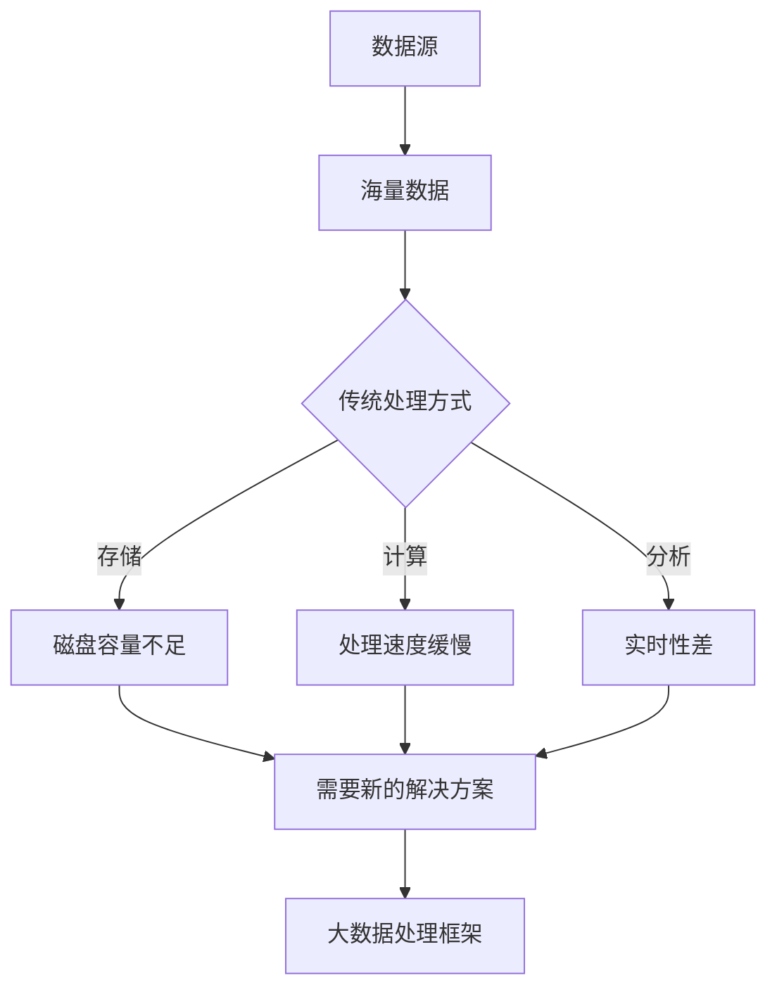
```mermaid
graph TB
    A[数据源] --> B[海量数据]
    B --> C{传统处理方式}
    C -->|存储| D[磁盘容量不足]
    C -->|计算| E[处理速度缓慢]
    C -->|分析| F[实时性差]
    D --> G[需要新的解决方案]
    E --> G
    F --> G
    G --> H[大数据处理框架]
```

**图表解读**：

- **数据源多样化**：现代企业面临来自多个渠道的数据汇聚
- **传统处理方式的三大瓶颈**：存储、计算、分析能力都无法满足大数据需求
- **解决方案导向**：这些痛点推动了分布式大数据处理框架的诞生
- **技术演进必然性**：从单机处理到分布式处理的技术变革

### 1.2 传统数据处理的局限性

传统的数据处理方式面临以下挑战：

1. **存储限制**：单机存储容量无法满足海量数据需求
2. **计算瓶颈**：单机计算能力有限，处理时间过长
3. **可扩展性差**：系统难以随着数据量增长而扩展
4. **实时性不足**：批处理模式无法满足实时分析需求

### 1.3 大数据处理框架的演进历程

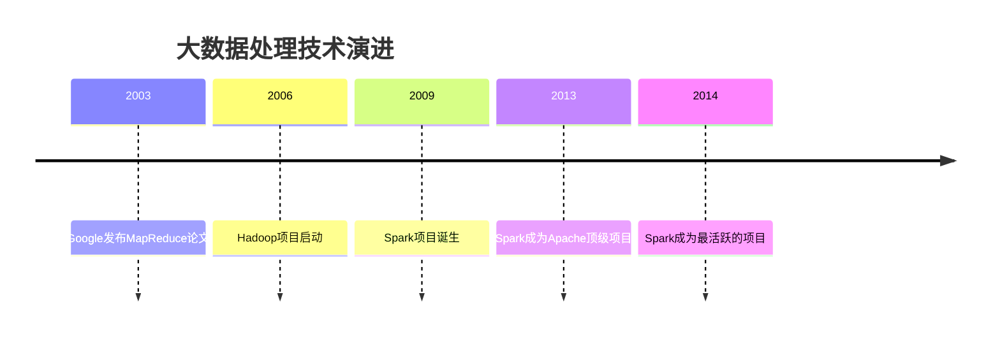
```mermaid
timeline
    title 大数据处理技术演进
    2003 : Google发布MapReduce论文
    2006 : Hadoop项目启动
    2009 : Spark项目诞生
    2013 : Spark成为Apache顶级项目
    2014 : Spark成为最活跃的项目
```

**技术演进关键节点分析**：

- **2003年**：Google的MapReduce论文奠定了分布式计算的理论基础
- **2006年**：Hadoop开源项目启动，将Google的理念普及到企业级应用
- **2009年**：Spark在Berkeley诞生，专注解决Hadoop的性能瓶颈
- **2013年**：Spark项目成熟，成为Apache基金会顶级项目
- **2014年**：Spark超越Hadoop，成为最活跃的大数据项目，标志着内存计算时代的到来

## 第二层：深入理解 Spark 的诞生与核心理念

### 2.1 Spark 的诞生背景

#### 2.1.1 Hadoop MapReduce 的限制

虽然 Hadoop 解决了大数据存储和基础处理问题，但其 MapReduce 计算模型存在明显缺陷：

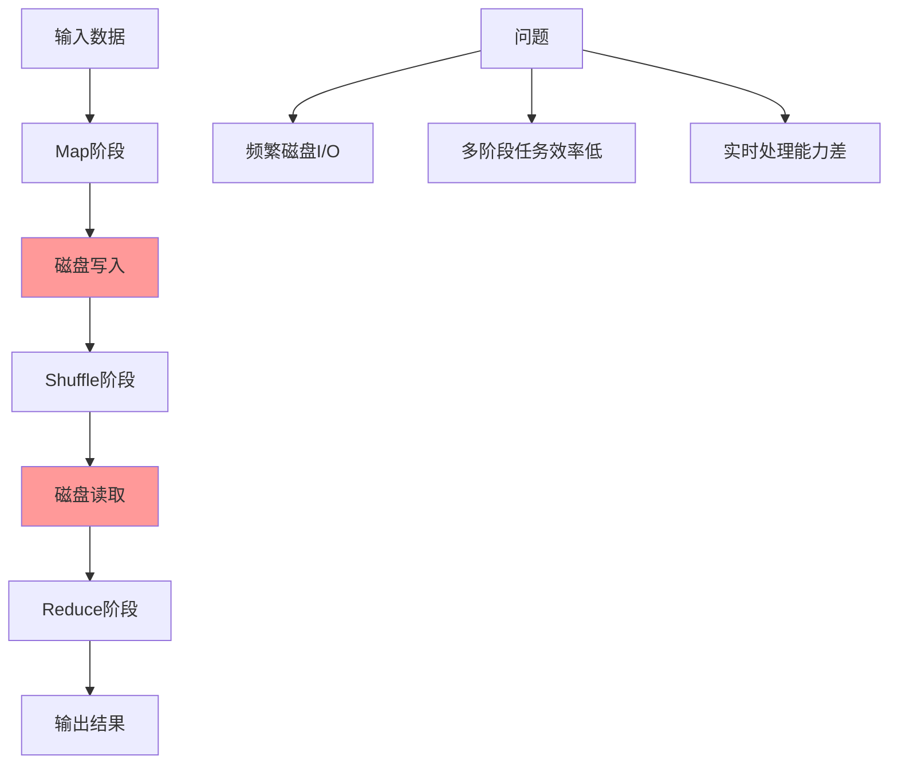
```mermaid
graph TD
    A[输入数据] --> B[Map阶段]
    B --> C[磁盘写入]
    C --> D[Shuffle阶段]
    D --> E[磁盘读取]
    E --> F[Reduce阶段]
    F --> G[输出结果]
  
    style C fill:#ff9999
    style E fill:#ff9999
  
    H[问题] --> I[频繁磁盘I/O]
    H --> J[多阶段任务效率低]
    H --> K[实时处理能力差]
```

**MapReduce性能瓶颈分析**：

- **红色标注部分**：频繁的磁盘I/O操作是最大性能杀手
- **多阶段处理**：每个Map-Reduce任务都需要完整的磁盘读写周期
- **中间结果存储**：所有中间数据都必须写入磁盘，即使后续马上要用
- **实时性限制**：批处理模式无法支持交互式查询和实时分析
- **资源利用低**：大量时间浪费在等待I/O操作上，CPU和内存资源闲置

> [!IMPORTANT]
> 磁盘I/O是传统大数据处理的最大瓶颈！磁盘读写速度通常比内存慢100-1000倍，这是MapReduce性能受限的根本原因。Spark通过内存计算彻底解决了这个问题。

#### 2.1.2 Spark 的创新理念

**内存计算优先**：Spark 将数据尽可能保存在内存中，大大减少磁盘 I/O 操作。

**统一计算模型**：提供一个统一的编程模型来处理批处理、流处理、机器学习等不同类型的工作负载。

**惰性求值**：采用惰性求值策略，只有在真正需要结果时才执行计算，提高效率。

### 2.2 Spark 的核心设计哲学

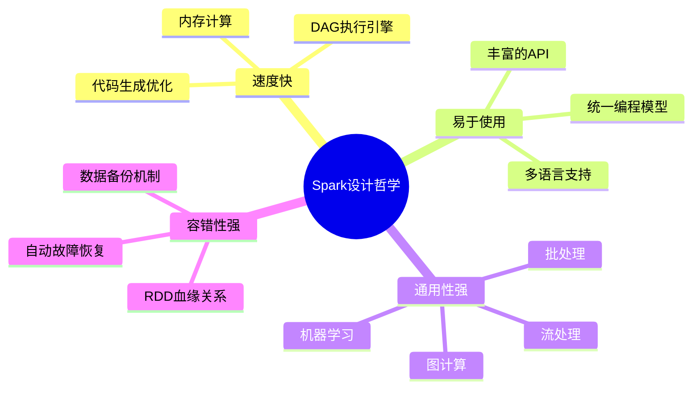
```mermaid
mindmap
  root((Spark设计哲学))
    速度快
      内存计算
      DAG执行引擎
      代码生成优化
    易于使用
      丰富的API
      多语言支持
      统一编程模型
    通用性强
      批处理
      流处理
      机器学习
      图计算
    容错性强
      RDD血缘关系
      自动故障恢复
      数据备份机制
```

**设计哲学深度解析**：

**🚀 速度快 - 性能为王**

- **内存计算**：数据尽可能保存在内存中，避免磁盘I/O瓶颈
- **DAG执行引擎**：将复杂任务优化为有向无环图，减少不必要的中间步骤
- **代码生成优化**：运行时生成优化的Java字节码，提升执行效率

**🎯 易于使用 - 降低门槛**

- **丰富的API**：提供高级抽象，简化复杂的分布式编程
- **多语言支持**：Scala、Java、Python、R、SQL，照顾不同背景开发者
- **统一编程模型**：相同的概念和API风格，学会一个组件即可快速掌握其他

**🔧 通用性强 - 一站式平台**

- **批处理**：传统的大数据ETL处理
- **流处理**：实时数据流分析
- **机器学习**：内置MLlib算法库
- **图计算**：GraphX支持复杂网络分析

**🛡️ 容错性强 - 企业级可靠性**

- **RDD血缘关系**：记录数据转换链路，支持失败后重算
- **自动故障恢复**：节点失败时自动迁移任务到其他节点
- **数据备份机制**：关键数据多副本存储，确保数据安全

## 第三层：掌握 Spark 的核心概念与架构

### 3.1 RDD：Spark 的核心抽象

#### 3.1.1 什么是 RDD

RDD（Resilient Distributed Dataset，弹性分布式数据集）是 Spark 的基础数据结构，具有以下特性：

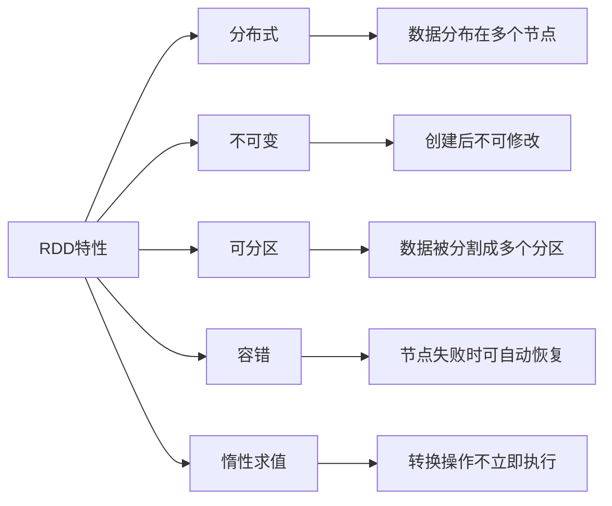
```mermaid
graph LR
    A[RDD特性] --> B[分布式]
    A --> C[不可变]
    A --> D[可分区]
    A --> E[容错]
    A --> F[惰性求值]
  
    B --> B1[数据分布在多个节点]
    C --> C1[创建后不可修改]
    D --> D1[数据被分割成多个分区]
    E --> E1[节点失败时可自动恢复]
    F --> F1[转换操作不立即执行]
```

**RDD核心特性详解**：

**📡 分布式（Distributed）**

- 数据自动分布在集群的多个节点上
- 支持并行计算，充分利用集群资源
- 对用户透明，无需关心数据在哪个节点

**🔒 不可变（Immutable）**

- 一旦创建就不能修改，保证数据一致性
- 避免并发修改导致的数据竞争问题
- 支持函数式编程范式，代码更可靠

**🧩 可分区（Partitioned）**

- 数据被智能分割成多个分区（Partition）
- 每个分区可以独立并行处理
- 分区策略可以自定义优化性能

**🛠️ 容错（Resilient）**

- 通过血缘关系（Lineage）记录数据来源
- 节点失败时可以从源头重新计算
- 无需复杂的数据复制机制

**⏰ 惰性求值（Lazy Evaluation）**

- 转换操作（Transformation）不会立即执行
- 只有遇到行动操作（Action）时才开始计算
- 允许Spark优化整个计算链路

> [!TIP]
> 惰性求值是Spark性能优化的关键！它允许Spark分析整个计算链路，消除不必要的计算步骤，合并相邻操作，大幅提升执行效率。

#### 3.1.2 RDD 的操作类型

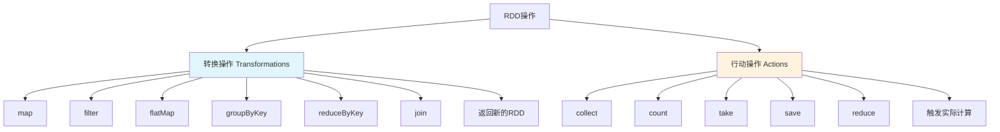
```mermaid
graph TD
    A[RDD操作] --> B[转换操作 Transformations]
    A --> C[行动操作 Actions]
  
    B --> B1[map]
    B --> B2[filter]
    B --> B3[flatMap]
    B --> B4[groupByKey]
    B --> B5[reduceByKey]
    B --> B6[join]
  
    C --> C1[collect]
    C --> C2[count]
    C --> C3[take]
    C --> C4[save]
    C --> C5[reduce]
  
    B --> D[返回新的RDD]
    C --> E[触发实际计算]
  
    style B fill:#e1f5fe
    style C fill:#fff3e0
```

**RDD操作分类详解**：

**🔄 转换操作（Transformations）- 蓝色区域**

- **特点**：惰性执行，返回新的RDD，不会立即计算
- **map**：对每个元素应用函数进行转换
- **filter**：根据条件过滤数据，保留满足条件的元素
- **flatMap**：先map再flatten，将嵌套结构展平
- **groupByKey**：按键分组，相同key的值聚合到一起
- **reduceByKey**：按键聚合，对相同key的值进行reduce操作
- **join**：连接两个RDD，类似SQL的JOIN操作

**⚡ 行动操作（Actions）- 橙色区域**

- **特点**：触发实际计算，返回结果到Driver程序或写入存储
- **collect**：将RDD所有元素收集到Driver程序中
- **count**：计算RDD中元素的总数
- **take(n)**：取RDD前n个元素
- **save**：将RDD保存到文件系统（HDFS、本地文件等）
- **reduce**：使用函数对RDD元素进行聚合计算

**💡 设计理念**：

- **惰性求值优势**：Spark可以分析整个转换链，进行全局优化
- **流水线优化**：多个转换操作可以合并为一个stage执行
- **内存重用**：中间结果可以缓存在内存中，避免重复计算

#### 3.1.3 RDD 的血缘关系与容错机制

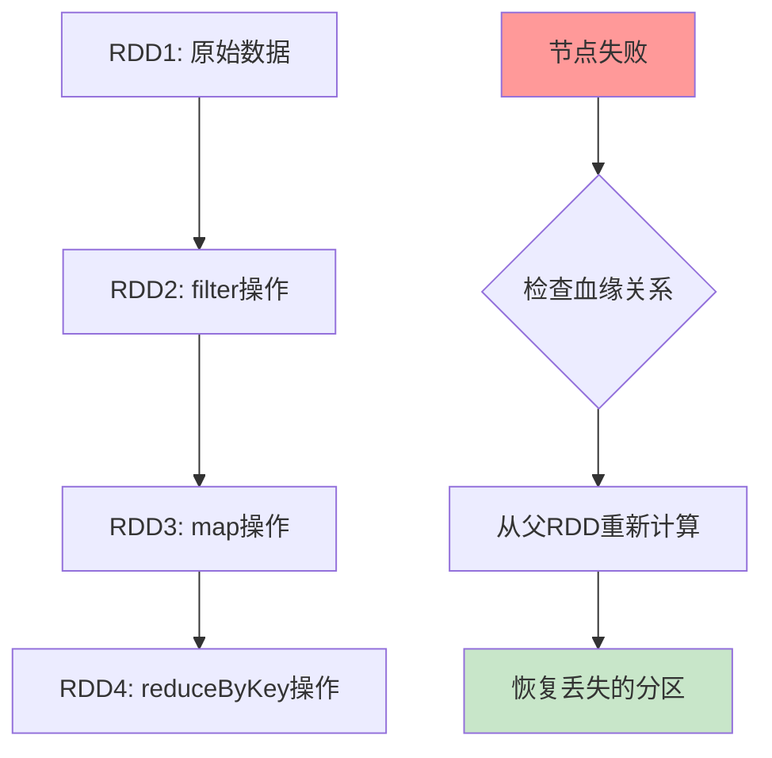
```mermaid
graph TB
    A[RDD1: 原始数据] --> B[RDD2: filter操作]
    B --> C[RDD3: map操作]
    C --> D[RDD4: reduceByKey操作]
  
    E[节点失败] --> F{检查血缘关系}
    F --> G[从父RDD重新计算]
    G --> H[恢复丢失的分区]
  
    style E fill:#ff9999
    style H fill:#c8e6c9
```

**血缘关系与容错机制详解**：

**📋 血缘关系（Lineage）的作用**

- **记录转换历史**：每个RDD都知道自己是如何从父RDD转换而来
- **依赖关系图**：形成有向无环图（DAG），记录完整的数据流
- **轻量级元数据**：只记录转换操作，不复制实际数据

**🚨 故障发生时的处理流程**

1. **检测故障**：系统发现某个节点或分区丢失（红色标注）
2. **分析血缘**：查找丢失分区的父RDD和转换操作
3. **重新计算**：从最近的可用父RDD开始重新执行转换
4. **恢复完成**：重新生成丢失的分区数据（绿色标注）

**💪 容错机制的优势**

- **无需数据复制**：不像传统系统需要维护多个数据副本
- **精确恢复**：只重算丢失的分区，不影响其他分区
- **成本低**：存储开销小，只需记录转换操作
- **可扩展**：支持大规模集群的容错需求

**⚠️ 注意事项**

- **长血缘链风险**：转换链太长时重算成本高
- **检查点机制**：可以通过checkpoint截断血缘链
- **缓存策略**：关键中间结果可以缓存到内存或磁盘

> [!WARNING]
> 长血缘链风险：当RDD转换链过长时，节点失败后的重算成本会非常高。建议在长链路中间设置检查点（checkpoint）来截断血缘关系，避免从头重算整个链路。

> [!CAUTION]
> 内存不足风险：过度依赖内存计算可能导致内存溢出。需要合理设置缓存策略，对于不经常使用的数据应及时释放内存空间。

### 3.2 Spark 的整体架构

#### 3.2.1 集群架构概览

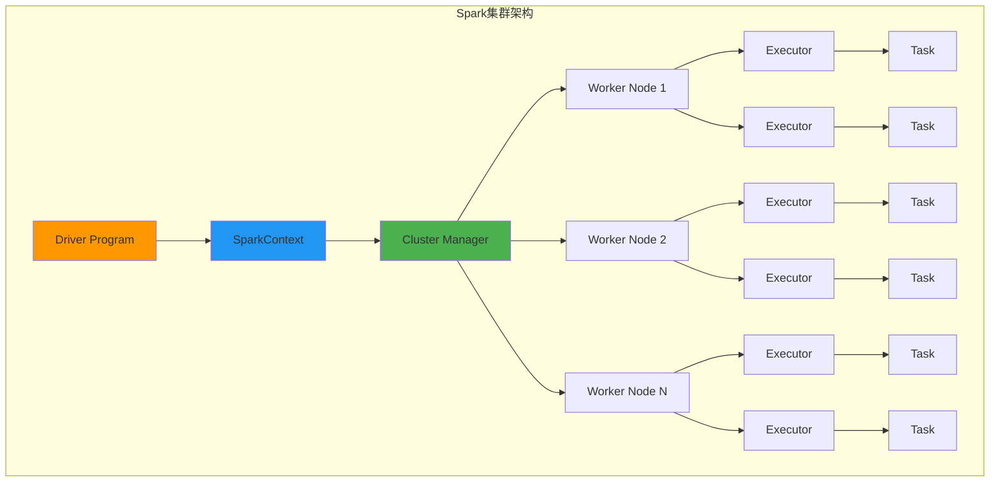
```mermaid
graph TB
    subgraph "Spark集群架构"
        A[Driver Program] --> B[SparkContext]
        B --> C[Cluster Manager]
      
        C --> D[Worker Node 1]
        C --> E[Worker Node 2]
        C --> F[Worker Node N]
      
        D --> D1[Executor]
        D --> D2[Executor]
        E --> E1[Executor]
        E --> E2[Executor]
        F --> F1[Executor]
        F --> F2[Executor]
      
        D1 --> D1T[Task]
        D2 --> D2T[Task]
        E1 --> E1T[Task]
        E2 --> E2T[Task]
        F1 --> F1T[Task]
        F2 --> F2T[Task]
    end
  
    style A fill:#ff9800
    style B fill:#2196f3
    style C fill:#4caf50
```

**Spark集群架构层次解析**：

**🎯 Driver层（橙色）- 应用程序入口**

- **职责**：应用程序的"大脑"，负责整体协调和控制
- **功能**：编写Spark应用代码的地方，包含main函数
- **位置**：可以运行在集群内部或外部的客户端

**💼 SparkContext层（蓝色）- 核心上下文**

- **职责**：Spark应用的入口点和协调中心
- **功能**：创建RDD、管理分布式变量、与集群管理器通信
- **重要性**：一个Spark应用只有一个SparkContext实例

**🏗️ 集群管理层（绿色）- 资源调度**

- **职责**：负责集群资源的分配和管理
- **支持模式**：
  - Standalone：Spark自带的集群管理器
  - YARN：Hadoop生态的资源管理器
  - Mesos：通用的集群资源管理器
  - Kubernetes：容器化集群管理器

**⚙️ 执行层 - 分布式计算**

- **Worker Node**：集群中的物理/虚拟机节点
- **Executor**：运行在Worker节点上的JVM进程，真正执行任务
- **Task**：最小的执行单元，处理一个RDD分区的数据

**🔄 工作流程**：

1. Driver创建SparkContext
2. SparkContext向集群管理器申请资源
3. 集群管理器在Worker节点上启动Executor
4. Driver将应用代码发送给Executor
5. Executor执行Task并返回结果给Driver

> [!IMPORTANT]
> Driver程序是Spark应用的大脑和控制中心！Driver失败会导致整个应用终止，因此需要确保Driver运行在稳定的环境中，并考虑启用Driver的高可用配置。

#### 3.2.2 核心组件详解

**Driver Program（驱动程序）**

- 包含应用程序的主函数
- 创建 SparkContext
- 将应用程序转换为任务
- 调度任务到各个 Executor

**SparkContext（Spark 上下文）**

- Spark 应用程序的入口点
- 负责与集群管理器通信
- 创建 RDD 和广播变量

**Cluster Manager（集群管理器）**

- 负责资源分配和管理
- 支持 Standalone、YARN、Mesos、Kubernetes

**Executor（执行器）**

- 运行在 Worker 节点上的进程
- 执行具体的计算任务
- 管理计算节点的数据存储

### 3.3 DAG 执行引擎

#### 3.3.1 从 RDD 到 DAG

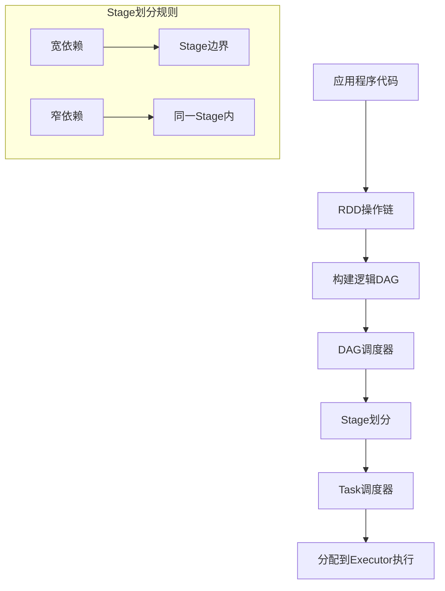
```mermaid
graph TD
    A[应用程序代码] --> B[RDD操作链]
    B --> C[构建逻辑DAG]
    C --> D[DAG调度器]
    D --> E[Stage划分]
    E --> F[Task调度器]
    F --> G[分配到Executor执行]
  
    subgraph "Stage划分规则"
        H[宽依赖] --> I[Stage边界]
        J[窄依赖] --> K[同一Stage内]
    end
```

**DAG执行引擎工作机制详解**：

**📝 从代码到执行的转换过程**

1. **应用程序代码**：用户编写的Spark程序，包含RDD转换和行动操作
2. **RDD操作链**：Spark将代码中的RDD操作串联成逻辑链路
3. **构建逻辑DAG**：将操作链转换为有向无环图表示
4. **DAG调度器**：分析DAG并进行优化，划分为执行阶段
5. **Stage划分**：根据依赖关系将DAG切分为多个Stage
6. **Task调度器**：将Stage转换为具体的Task并分配资源
7. **Executor执行**：在集群节点上并行执行Task

**🔗 依赖关系与Stage划分**

- **窄依赖（Narrow Dependency）**：

  - 父RDD的每个分区最多被子RDD的一个分区使用
  - 例如：map、filter、union操作
  - 可以流水线执行，放在同一个Stage内
- **宽依赖（Wide Dependency）**：

  - 父RDD的一个分区被子RDD的多个分区使用
  - 例如：groupByKey、reduceByKey、join操作
  - 需要Shuffle操作，形成Stage边界

**🚀 DAG优化优势**

- **全局优化**：可以看到整个计算流程，进行全局优化
- **流水线执行**：连续的窄依赖操作可以合并执行
- **减少Shuffle**：尽可能减少需要数据重新分布的操作
- **容错恢复**：失败时可以重新执行特定的Stage而不是整个任务

#### 3.3.2 Stage 和 Task 的概念

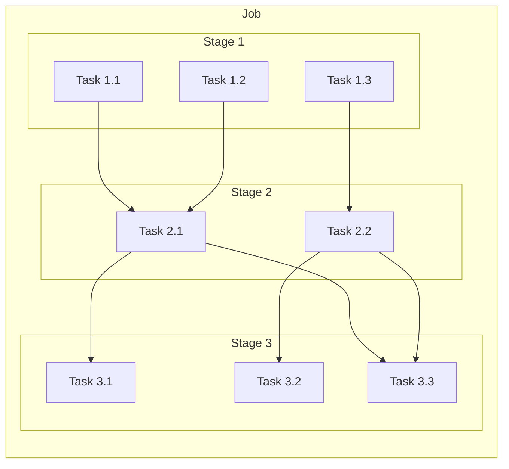
```mermaid
graph LR
    subgraph "Job"
        subgraph "Stage 1"
            A[Task 1.1] 
            B[Task 1.2]
            C[Task 1.3]
        end
      
        subgraph "Stage 2"
            D[Task 2.1]
            E[Task 2.2]
        end
      
        subgraph "Stage 3"
            F[Task 3.1]
            G[Task 3.2]
            H[Task 3.3]
        end
    end
  
    A --> D
    B --> D
    C --> E
    D --> F
    E --> G
    D --> H
    E --> H
```

**Stage与Task层次结构详解**：

**🎯 Job（作业）- 最高层抽象**

- **定义**：由一个行动操作（Action）触发的完整计算任务
- **范围**：从数据输入到结果输出的完整流程
- **特点**：一个Spark应用可以包含多个Job

**🏭 Stage（阶段）- 中间层抽象**

- **定义**：可以并行执行的任务集合，由宽依赖操作分隔
- **划分原则**：
  - 同一Stage内的操作都是窄依赖
  - 遇到宽依赖操作时会产生新的Stage
- **执行特点**：Stage之间有依赖关系，必须按顺序执行

**⚙️ Task（任务）- 最小执行单元**

- **定义**：处理一个RDD分区数据的最小工作单元
- **数量关系**：Task数量 = RDD分区数量
- **执行位置**：每个Task运行在一个Executor线程中

**🔄 执行流程分析**：

1. **Stage 1**：3个Task并行处理3个分区的数据
2. **Stage 1 → Stage 2**：需要Shuffle操作，数据重新分布
3. **Stage 2**：2个Task处理重新分布后的数据
4. **Stage 2 → Stage 3**：再次Shuffle，最终汇聚结果
5. **Stage 3**：3个Task产生最终输出

**💡 性能优化考虑**：

- **并行度**：Task数量决定了并行执行的程度
- **数据本地性**：尽量让Task在数据所在节点执行
- **负载均衡**：确保各个Task的工作量相对均衡
- **资源利用**：Task数量应该与集群资源相匹配

> [!TIP]
> 并行度设置建议：Task数量通常设置为CPU核心数的2-4倍是比较合理的。过少会导致资源浪费，过多会增加调度开销。可以通过spark.default.parallelism参数调整。

## 第四层：探索 Spark 的生态系统与组件

### 4.1 Spark 生态系统全景图

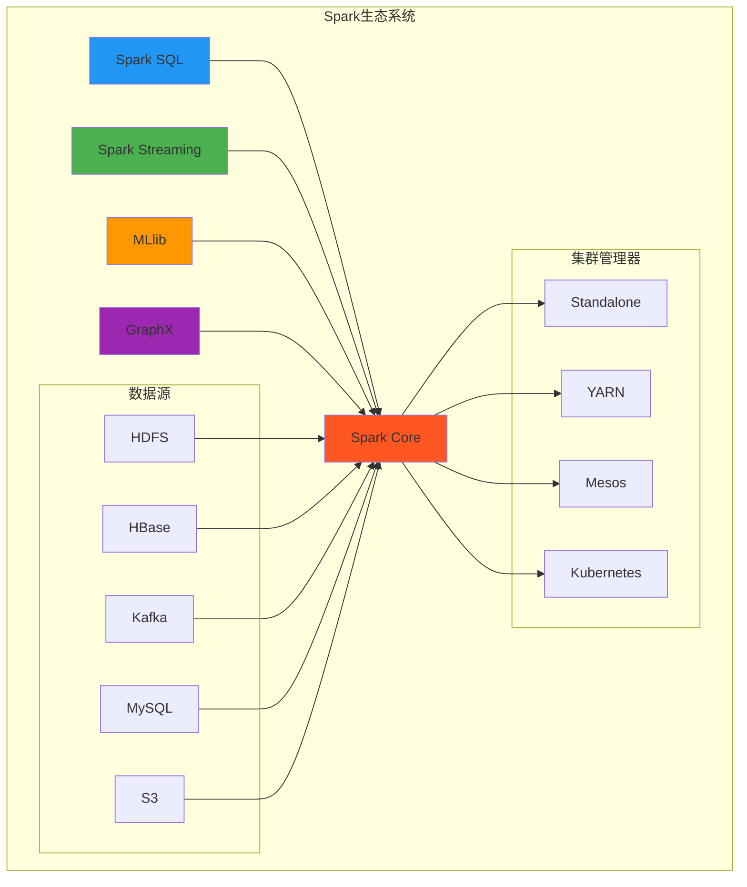
```mermaid
graph TB
    subgraph "Spark生态系统"
        A[Spark Core]

        B[Spark SQL] --> A
        C[Spark Streaming] --> A
        D[MLlib] --> A
        E[GraphX] --> A

        subgraph "数据源"
            F[HDFS]
            G[HBase]
            H[Kafka]
            I[MySQL]
            J[S3]
        end

        subgraph "集群管理器"
            K[Standalone]
            L[YARN]
            M[Mesos]
            N[Kubernetes]
        end

        F --> A
        G --> A
        H --> A
        I --> A
        J --> A

        A --> K
        A --> L
        A --> M
        A --> N
    end

    style A fill:#ff5722
    style B fill:#2196f3
    style C fill:#4caf50
    style D fill:#ff9800
    style E fill:#9c27b0
```

### 4.2 Spark Core：基础计算引擎

#### 4.2.1 核心功能

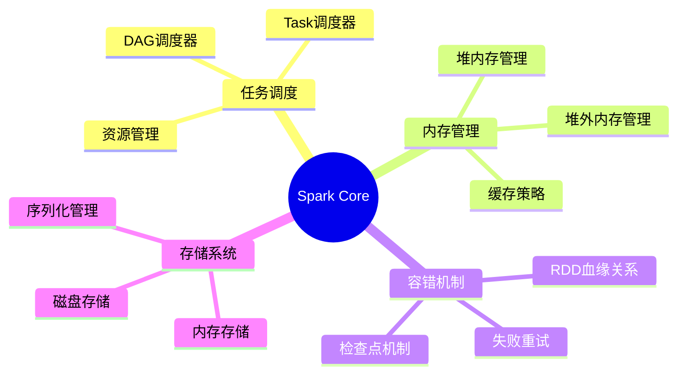
```mermaid
mindmap
  root((Spark Core))
    任务调度
      DAG调度器
      Task调度器
      资源管理
    内存管理
      堆内存管理
      堆外内存管理
      缓存策略
    容错机制
      RDD血缘关系
      检查点机制
      失败重试
    存储系统
      内存存储
      磁盘存储
      序列化管理
```

#### 4.2.2 RDD API 示例

**转换操作流程：**


```mermaid
graph LR
    A[原始数据集] --> B[map: 数据转换]
    B --> C[filter: 数据过滤]
    C --> D[groupByKey: 分组]
    D --> E[mapValues: 值转换]
    E --> F[cache: 缓存结果]
    F --> G[count: 行动操作]

    style G fill:#ff5722
```

### 4.3 Spark SQL：结构化数据处理

#### 4.3.1 Spark SQL 架构

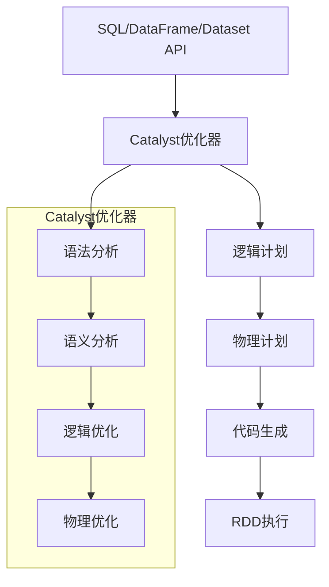
```mermaid
graph TB
    A[SQL/DataFrame/Dataset API] --> B[Catalyst优化器]
    B --> C[逻辑计划]
    C --> D[物理计划]
    D --> E[代码生成]
    E --> F[RDD执行]

    subgraph "Catalyst优化器"
        G[语法分析]
        H[语义分析]
        I[逻辑优化]
        J[物理优化]
    end

    B --> G
    G --> H
    H --> I
    I --> J
```

#### 4.3.2 数据抽象层次

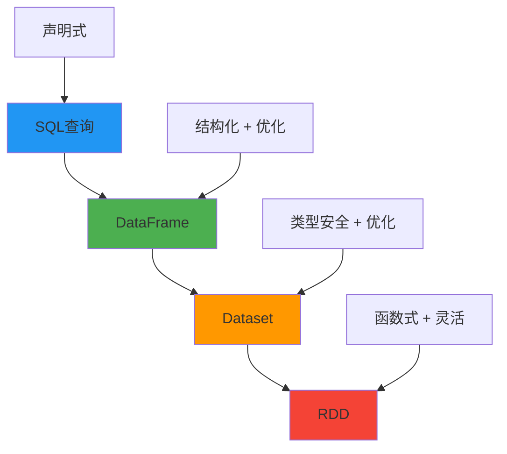
```mermaid
graph TD
    A[SQL查询] --> B[DataFrame]
    B --> C[Dataset]
    C --> D[RDD]

    A1[声明式] --> A
    B1[结构化 + 优化] --> B
    C1[类型安全 + 优化] --> C
    D1[函数式 + 灵活] --> D

    style A fill:#2196f3
    style B fill:#4caf50
    style C fill:#ff9800
    style D fill:#f44336
```

### 4.4 Spark Streaming：实时流处理

#### 4.4.1 Spark Streaming 工作原理

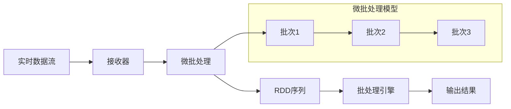
```mermaid
graph LR
    A[实时数据流] --> B[接收器]
    B --> C[微批处理]
    C --> D[RDD序列]
    D --> E[批处理引擎]
    E --> F[输出结果]

    subgraph "微批处理模型"
        G[批次1] --> H[批次2] --> I[批次3]
    end

    C --> G
```

#### 4.4.2 DStream 操作

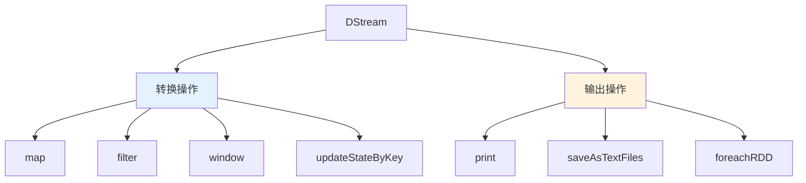
```mermaid
graph TD
    A[DStream] --> B[转换操作]
    A --> C[输出操作]

    B --> B1[map]
    B --> B2[filter]
    B --> B3[window]
    B --> B4[updateStateByKey]

    C --> C1[print]
    C --> C2[saveAsTextFiles]
    C --> C3[foreachRDD]

    style B fill:#e3f2fd
    style C fill:#fff3e0
```

### 4.5 MLlib：机器学习库

#### 4.5.1 MLlib 功能模块

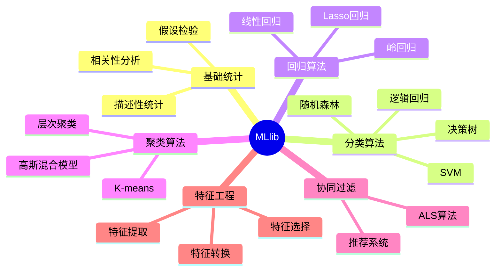
```mermaid
mindmap
  root((MLlib))
    基础统计
      描述性统计
      相关性分析
      假设检验
    分类算法
      逻辑回归
      决策树
      随机森林
      SVM
    回归算法
      线性回归
      岭回归
      Lasso回归
    聚类算法
      K-means
      高斯混合模型
      层次聚类
    协同过滤
      ALS算法
      推荐系统
    特征工程
      特征提取
      特征选择
      特征转换
```

#### 4.5.2 机器学习管道

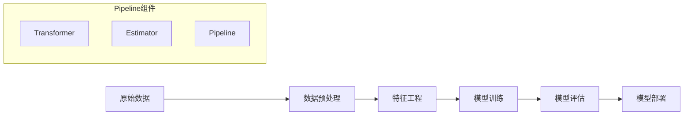
```mermaid
graph LR
    A[原始数据] --> B[数据预处理]
    B --> C[特征工程]
    C --> D[模型训练]
    D --> E[模型评估]
    E --> F[模型部署]

    subgraph "Pipeline组件"
        G[Transformer]
        H[Estimator]
        I[Pipeline]
    end
```

### 4.6 GraphX：图计算

#### 4.6.1 图数据模型

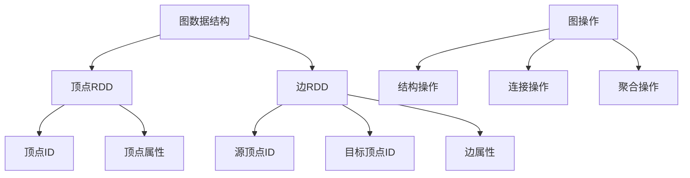
```mermaid
graph TD
    A[图数据结构] --> B[顶点RDD]
    A --> C[边RDD]

    B --> B1[顶点ID]
    B --> B2[顶点属性]

    C --> C1[源顶点ID]
    C --> C2[目标顶点ID]
    C --> C3[边属性]

    D[图操作] --> D1[结构操作]
    D --> D2[连接操作]
    D --> D3[聚合操作]
```

## 第五层：分析 Spark 的技术优势与特点

### 5.1 性能优势对比

#### 5.1.1 Spark vs Hadoop MapReduce

```mermaid
graph TD
    subgraph "Hadoop MapReduce"
        A1[数据] --> B1[Map]
        B1 --> C1[磁盘写入]
        C1 --> D1[Shuffle]
        D1 --> E1[磁盘读取]
        E1 --> F1[Reduce]
        F1 --> G1[结果]
    end

    subgraph "Spark"
        A2[数据] --> B2[转换操作链]
        B2 --> C2[内存计算]
        C2 --> D2[DAG优化]
        D2 --> E2[结果]
    end

    H[性能对比] --> I[内存中快100倍]
    H --> J[磁盘上快10倍]

    style C1 fill:#ff9999
    style E1 fill:#ff9999
    style C2 fill:#c8e6c9
```

> [!IMPORTANT]
> 性能提升并非魔法：Spark的性能优势主要体现在迭代计算和交互式查询场景。对于简单的一次性ETL作业，性能提升可能不如预期。选择技术时要根据具体场景需求。

#### 5.1.2 内存计算优势

```mermaid
pie title Spark性能提升来源
    "内存计算" : 60
    "DAG优化" : 25
    "代码生成" : 10
    "其他优化" : 5
```

### 5.2 易用性特点

#### 5.2.1 多语言支持

```mermaid
graph TB
    A[Spark Core] --> B[Scala API]
    A --> C[Java API]
    A --> D[Python API]
    A --> E[R API]
    A --> F[SQL API]

    G[统一编程模型] --> H[相同概念]
    G --> I[一致API]
    G --> J[共享数据结构]
```

#### 5.2.2 丰富的 API 层次

```mermaid
graph TD
    A[高级API] --> A1[SQL]
    A --> A2[DataFrame]
    A --> A3[Dataset]

    B[中级API] --> B1[RDD]

    C[底层API] --> C1[分布式变量]
    C --> C2[自定义分区器]

    D[易用性递增] --> A
    E[灵活性递增] --> C
```

### 5.3 通用性分析

#### 5.3.1 统一的大数据处理平台

```mermaid
graph LR
    A[单一Spark平台] --> B[批处理]
    A --> C[流处理]
    A --> D[交互式查询]
    A --> E[机器学习]
    A --> F[图计算]

    G[传统方案] --> H[Hadoop MapReduce]
    G --> I[Storm/Kafka]
    G --> J[Impala/Presto]
    G --> K[Mahout/Weka]
    G --> L[Giraph/Neo4j]

    style A fill:#4caf50
    style G fill:#ff5722
```

> [!NOTE]
> 架构统一的价值：使用单一平台处理多种工作负载，可以减少技术栈复杂性，降低运维成本，提高开发效率，并且数据可以在不同组件间无缝流转。

## 第六层：实际应用场景与案例分析

### 6.1 应用场景分类

```mermaid
mindmap
  root((Spark应用场景))
    数据处理
      ETL处理
      数据清洗
      数据集成
      数据转换
    实时分析
      实时监控
      异常检测
      实时推荐
      实时报表
    机器学习
      预测分析
      用户画像
      风险评估
      个性化推荐
    图分析
      社交网络分析
      欺诈检测
      路径优化
      知识图谱
```

### 6.2 行业应用案例

#### 6.2.1 电商行业应用架构

```mermaid
graph TD
    subgraph "数据源"
        A[用户行为日志]
        B[交易数据]
        C[商品信息]
        D[用户画像]
    end

    subgraph "Spark处理层"
        E[Spark Streaming] --> F[实时推荐]
        G[Spark SQL] --> H[数据仓库]
        I[MLlib] --> J[机器学习模型]
    end

    subgraph "应用服务"
        K[个性化推荐]
        L[用户分析]
        M[销售预测]
        N[库存优化]
    end

    A --> E
    B --> G
    C --> G
    D --> I

    F --> K
    H --> L
    J --> M
    J --> N
```

#### 6.2.2 金融行业风控系统

```mermaid
graph LR
    A[交易数据] --> B[Spark Streaming]
    B --> C[实时风控规则]
    C --> D{风险评估}
    D -->|高风险| E[阻断交易]
    D -->|低风险| F[正常通过]

    G[历史数据] --> H[MLlib训练]
    H --> I[风控模型]
    I --> C

    style E fill:#ff5722
    style F fill:#4caf50
```

### 6.3 性能调优实践

#### 6.3.1 Spark 调优策略

```mermaid
graph TB
    A[Spark性能调优] --> B[资源配置优化]
    A --> C[代码层面优化]
    A --> D[存储优化]
    A --> E[序列化优化]

    B --> B1[合理设置Executor数量]
    B --> B2[优化内存分配]
    B --> B3[调整并行度]

    C --> C1[减少数据倾斜]
    C --> C2[使用广播变量]
    C --> C3[避免Shuffle操作]

    D --> D1[选择合适存储级别]
    D --> D2[使用缓存策略]

    E --> E1[使用Kryo序列化]
    E --> E2[注册自定义类]
```

> [!TIP]
> 性能调优经验：80%的性能问题来自于数据倾斜和过多的Shuffle操作。优先解决这两个问题，通常能获得显著的性能提升。

> [!CAUTION]
> 调优需要测试：性能调优参数因数据集和集群环境而异，不要盲目复制他人的配置。建议在测试环境中验证调优效果后再应用到生产环境。

## 第七层：Spark 的未来发展与总结

### 7.1 技术发展趋势

```mermaid
timeline
    title Spark未来发展路线图
    2024 : Spark 4.0发布
         : 性能进一步提升
    2025 : 云原生集成深化
         : Kubernetes支持增强
    2026 : AI集成更加紧密
         : 深度学习框架整合
    2027 : 流批一体化
         : 统一计算模型
```

### 7.2 与其他技术的协同发展

```mermaid
graph TB
    A[Spark] --> B[云计算]
    A --> C[人工智能]
    A --> D[边缘计算]
    A --> E[容器化技术]

    B --> B1[AWS EMR]
    B --> B2[Azure HDInsight]
    B --> B3[Google Dataproc]

    C --> C1[TensorFlow]
    C --> C2[PyTorch]
    C --> C3[深度学习]

    D --> D1[边缘AI]
    D --> D2[IoT处理]

    E --> E1[Docker]
    E --> E2[Kubernetes]
```

### 7.3 学习建议与路径

```mermaid
graph TD
    A[Spark学习路径] --> B[基础阶段]
    A --> C[进阶阶段]
    A --> D[高级阶段]
    A --> E[专家阶段]

    B --> B1[理解大数据概念]
    B --> B2[掌握Scala/Python基础]
    B --> B3[学习RDD操作]

    C --> C1[深入理解Spark架构]
    C --> C2[掌握各组件使用]
    C --> C3[实践项目开发]

    D --> D1[性能调优技巧]
    D --> D2[集群部署管理]
    D --> D3[源码阅读理解]

    E --> E1[架构设计能力]
    E --> E2[技术选型决策]
    E --> E3[团队技术指导]
```

## 总结

Spark 作为新一代大数据处理框架，通过内存计算、统一编程模型、丰富的生态系统等核心优势，已经成为大数据处理领域的事实标准。它不仅解决了传统批处理的效率问题，还提供了流处理、机器学习、图计算等多种能力，真正实现了"一站式"大数据处理平台的目标。

**核心价值总结：**

1. **技术价值**：内存计算带来的性能飞跃，DAG 执行引擎的优化能力
2. **生态价值**：统一的编程模型，丰富的组件生态
3. **商业价值**：降低大数据处理门槛，加速企业数字化转型
4. **发展价值**：持续的技术创新，与云计算、AI 等新技术的深度融合

随着数据量的持续增长和实时处理需求的提升，Spark 将继续在大数据处理领域发挥重要作用，成为构建现代数据平台的核心技术。

> [!NOTE]
> 学习建议：Spark生态系统庞大且持续发展，建议采用"深度优先"的学习策略：先深入掌握核心概念和一个主要组件，再横向扩展到其他组件，这样能更好地理解整体架构。

> [!TIP]
> 实践出真知：理论学习很重要，但Spark的精髓在于实践。建议通过实际项目来加深理解，从小数据集开始，逐步过渡到真实的大数据场景。
```

## 来源 2: Personal-markdown-notes / `spark/Spark基础/Spark运行模式整理.md`

- 原始 URL: <https://github.com/DavidHLP/Personal-markdown-notes/blob/bbb21260029584d41d1c667f88c5c8e2b761aad9/spark/Spark基础/Spark运行模式整理.md>
- 本地路径: `spark/Spark基础/Spark运行模式整理.md`

```markdown
# Spark 运行模式深度解析

## 第一层：基础概念理解

### 1.1 什么是 Spark 运行模式

Spark 运行模式是指 Spark 应用程序在不同环境中的部署和执行方式。它决定了：

- **资源如何分配**：CPU、内存、存储等计算资源的管理方式
- **任务如何调度**：作业分解、任务分发、执行监控的机制
- **故障如何处理**：容错、恢复、重试的策略

### 1.2 为什么需要不同的运行模式

不同的应用场景需要不同的资源管理策略：

```mermaid
graph TD
    A[应用场景] --> B[开发调试]
    A --> C[小规模测试]
    A --> D[大规模生产]

    B --> E[Local模式]
    C --> F[Standalone模式]
    D --> G[YARN/K8s模式]
```

- **开发阶段**：需要快速启动、简单配置、便于调试
- **测试阶段**：需要模拟分布式环境、控制资源使用
- **生产阶段**：需要高可用、高扩展性、资源共享

### 1.3 运行模式的核心要素

每种运行模式都包含以下核心组件：

| 组件类型                   | 功能描述                 | 实现方式                       |
| -------------------------- | ------------------------ | ------------------------------ |
| **资源管理器**       | 负责集群资源的分配和调度 | 本地进程/独立调度器/外部管理器 |
| **驱动程序(Driver)** | 应用程序的主控制器       | 运行在本地/集群不同节点        |
| **执行器(Executor)** | 实际执行任务的工作进程   | 线程/进程/容器                 |
| **集群管理器**       | 协调整个集群的运行       | 内置/外部集群管理系统          |

## 第二层：运行模式分类体系

### 2.1 按部署规模分类

#### 单机模式

- **特点**：所有组件运行在单个 JVM 进程中
- **适用场景**：开发、调试、小数据量处理
- **优势**：配置简单、启动快速、便于调试
- **劣势**：资源受限、无法处理大数据

#### 集群模式

- **特点**：组件分布在多个节点上运行
- **适用场景**：生产环境、大数据处理
- **优势**：资源丰富、高可用、高扩展性
- **劣势**：配置复杂、部署成本高

### 2.2 按资源管理器分类

```mermaid
graph LR
    A[Spark运行模式] --> B[自管理模式]
    A --> C[外部管理模式]

    B --> D[Local模式]
    B --> E[Standalone模式]

    C --> F[YARN模式]
    C --> G[Mesos模式]
    C --> H[Kubernetes模式]
```

#### 自管理模式

- **Local 模式**：Spark 自己管理单机资源
- **Standalone 模式**：Spark 自带的集群管理器

#### 外部管理模式

- **YARN 模式**：依赖 Hadoop YARN 进行资源管理
- **Mesos 模式**：依赖 Apache Mesos 进行资源管理
- **Kubernetes 模式**：依赖 Kubernetes 进行容器化管理

## 第三层：具体模式深度解析

### 3.1 Local 模式详解

#### 3.1.1 基本原理

Local 模式是 Spark 最简单的运行方式，所有的 Spark 组件都运行在单个 JVM 进程中。

```mermaid
graph TB
    subgraph "JVM进程"
        subgraph "Driver"
            D[SparkContext<br/>任务调度]
        end
        subgraph "Executor"
            T1[Task 1]
            T2[Task 2]
            T3[Task N]
        end
    end

    D --> T1
    D --> T2
    D --> T3

    style D fill:#e1f5fe
    style T1 fill:#f3e5f5
    style T2 fill:#f3e5f5
    style T3 fill:#f3e5f5
```

#### 3.1.2 配置方式

```scala
val spark = SparkSession.builder()
  .appName("LocalApp")
  .master("local")      // 单线程
  .master("local[2]")   // 2个线程
  .master("local[*]")   // 使用所有可用CPU核心
  .getOrCreate()
```

#### 3.1.3 适用场景

- **开发调试**：快速验证代码逻辑
- **算法原型**：小数据集上的算法测试
- **教学演示**：无需复杂环境配置

#### 3.1.4 性能特点

- **优势**：启动速度快、调试方便、无网络开销
- **限制**：内存受限、无容错机制、不支持分布式特性

> [!WARNING]
> Local模式仅适用于开发和测试环境！在生产环境中使用会导致严重的性能瓶颈和单点故障风险。

> [!CAUTION]
> Local模式下的资源限制可能导致大数据集处理时出现内存溢出(OOM)错误，建议处理数据量不超过本机内存的50%。

### 3.2 Standalone 模式详解

#### 3.2.1 架构原理

Standalone 是 Spark 自带的集群管理器，提供简单的分布式资源管理。

```mermaid
graph TD
    M[Master<br/>资源管理]

    subgraph "Worker节点1"
        W1[Worker]
        E1[Executor]
        W1 --> E1
    end

    subgraph "Worker节点2"
        W2[Worker]
        E2[Executor]
        W2 --> E2
    end

    subgraph "Worker节点3"
        W3[Worker]
        E3[Executor]
        W3 --> E3
    end

    M --> W1
    M --> W2
    M --> W3

    style M fill:#e8f5e8
    style W1 fill:#fff3e0
    style W2 fill:#fff3e0
    style W3 fill:#fff3e0
    style E1 fill:#f3e5f5
    style E2 fill:#f3e5f5
    style E3 fill:#f3e5f5
```

#### 3.2.2 核心组件

- **Master 节点**：集群资源管理，应用调度，健康监控
- **Worker 节点**：接收 Master 指令，管理本地资源，启动 Executor
- **Executor 进程**：运行具体任务，向 Driver 汇报状态

#### 3.2.3 部署配置

```bash
# 启动Master
$SPARK_HOME/sbin/start-master.sh

# 启动Worker (连接到Master)
$SPARK_HOME/sbin/start-worker.sh spark://master-host:7077

# 提交应用
spark-submit --master spark://master-host:7077 \
  --class MyApp \
  my-app.jar
```

#### 3.2.4 优势与限制

**优势**：

- 配置简单，无外部依赖
- 完整的 Web UI 监控
- 支持多种资源调度策略

**限制**：

- 功能相对简单
- 缺乏企业级特性（如资源队列、细粒度权限控制）
- 在大规模集群中管理复杂

> [!NOTE]
> Standalone模式最适合中小规模团队和简单的大数据处理场景。对于企业级应用，建议考虑YARN或Kubernetes模式。

### 3.3 YARN 模式详解

#### 3.3.1 YARN 架构回顾

YARN (Yet Another Resource Negotiator) 是 Hadoop 2.x 引入的资源管理框架。

```mermaid
graph TB
    subgraph "YARN集群"
        RM[ResourceManager<br/>全局资源管理]

        subgraph "NodeManager1"
            NM1[NodeManager<br/>节点资源管理]
            AM[ApplicationMaster<br/>应用管理]
            NM1 -.-> AM
        end

        subgraph "NodeManager2"
            NM2[NodeManager<br/>节点资源管理]
            C1[Container<br/>资源容器]
            NM2 -.-> C1
        end

        subgraph "NodeManager3"
            NM3[NodeManager<br/>节点资源管理]
            C2[Container<br/>资源容器]
            NM3 -.-> C2
        end
    end

    RM --> NM1
    RM --> NM2
    RM --> NM3
    AM --> C1
    AM --> C2

    style RM fill:#e8f5e8
    style NM1 fill:#fff3e0
    style NM2 fill:#fff3e0
    style NM3 fill:#fff3e0
    style AM fill:#e1f5fe
    style C1 fill:#f3e5f5
    style C2 fill:#f3e5f5
```

#### 3.3.2 Spark on YARN 的两种模式

##### Cluster 模式

Driver 运行在集群中的 ApplicationMaster 内：

```mermaid
graph LR
    subgraph "NodeManager1"
        subgraph "ApplicationMaster"
            D[Driver<br/>应用驱动]
        end
    end

    subgraph "NodeManager2"
        subgraph "Container1"
            E1[Executor<br/>执行器]
        end
    end

    subgraph "NodeManager3"
        subgraph "Container2"
            E2[Executor<br/>执行器]
        end
    end

    D --> E1
    D --> E2

    style D fill:#e1f5fe
    style E1 fill:#f3e5f5
    style E2 fill:#f3e5f5
```

**特点**：

- Driver 运行在集群内，减少网络传输
- 适合生产环境，无需客户端长期连接
- 日志查看需要通过 YARN 界面

##### Client 模式

Driver 运行在提交作业的客户端：

```mermaid
graph LR
    subgraph "Client Machine"
        D[Driver<br/>应用驱动]
    end

    subgraph "NodeManager1"
        AM[ApplicationMaster<br/>资源协调]
    end

    subgraph "NodeManager2"
        subgraph "Container"
            E1[Executor<br/>执行器]
        end
    end

    D <--> AM
    D <--> E1
    AM --> E1

    style D fill:#e1f5fe
    style AM fill:#fff3e0
    style E1 fill:#f3e5f5
```

**特点**：

- Driver 在客户端，便于调试和日志查看
- 适合交互式作业和开发环境
- 需要客户端与集群保持连接

> [!IMPORTANT]
> 选择Client模式还是Cluster模式对应用性能和稳定性有重大影响：
> - **生产环境推荐Cluster模式**：避免客户端网络中断导致作业失败
> - **开发调试推荐Client模式**：便于实时查看日志和调试信息

#### 3.3.3 配置实例

```bash
# Cluster模式提交
spark-submit \
  --master yarn \
  --deploy-mode cluster \
  --num-executors 3 \
  --executor-memory 2g \
  --executor-cores 2 \
  --class MyApp \
  my-app.jar

# Client模式提交
spark-submit \
  --master yarn \
  --deploy-mode client \
  --num-executors 3 \
  --executor-memory 2g \
  --executor-cores 2 \
  --class MyApp \
  my-app.jar
```

#### 3.3.4 YARN 模式优势

- **资源共享**：与其他 Hadoop 生态组件共享集群资源
- **资源隔离**：队列机制实现多租户资源隔离
- **高可用**：ResourceManager HA 保证集群高可用
- **资源调度**：支持容量调度器、公平调度器等
- **安全性**：集成 Kerberos 认证，支持细粒度权限控制

### 3.4 Kubernetes 模式详解

#### 3.4.1 容器化趋势

随着云原生技术的发展，Kubernetes 成为容器编排的标准平台。

```mermaid
graph TB
    subgraph "Kubernetes集群"
        KM[Kubernetes Master<br/>API Server]

        subgraph "Node1"
            subgraph "Driver Pod"
                DC[Driver Container<br/>Spark Driver]
            end
        end

        subgraph "Node2"
            subgraph "Executor Pod1"
                EC1[Executor Container<br/>Spark Executor]
            end
        end

        subgraph "Node3"
            subgraph "Executor Pod2"
                EC2[Executor Container<br/>Spark Executor]
            end
        end
    end

    KM --> DC
    KM --> EC1
    KM --> EC2
    DC --> EC1
    DC --> EC2

    style KM fill:#e8f5e8
    style DC fill:#e1f5fe
    style EC1 fill:#f3e5f5
    style EC2 fill:#f3e5f5
```

#### 3.4.2 Spark on Kubernetes 特点

- **动态资源分配**：根据作业需求动态创建/销毁 Pod
- **资源隔离**：基于命名空间和资源配额
- **服务发现**：利用 K8s 原生服务发现机制
- **存储集成**：支持多种存储卷类型

#### 3.4.3 配置示例

```bash
spark-submit \
  --master k8s://https://kubernetes-api-server:6443 \
  --deploy-mode cluster \
  --name spark-pi \
  --conf spark.executor.instances=3 \
  --conf spark.kubernetes.container.image=spark:latest \
  --conf spark.kubernetes.namespace=spark-jobs \
  local:///path/to/examples.jar
```

> [!TIP]
> Kubernetes模式的最佳实践：
> - 使用专用的命名空间隔离Spark作业
> - 配置适当的资源限制和请求
> - 使用持久化卷存储检查点数据
> - 启用动态分配以优化资源使用

### 3.5 Mesos 模式

#### 3.5.1 Mesos 架构

```mermaid
graph TB
    subgraph "Mesos集群"
        MM[Mesos Master<br/>资源调度]

        subgraph "Agent1"
            subgraph "Framework1"
                SF1[Spark Framework<br/>任务管理]
            end
        end

        subgraph "Agent2"
            subgraph "Framework2"
                SF2[Spark Framework<br/>任务执行]
            end
        end

        subgraph "Agent3"
            OTH[Other Frameworks<br/>Marathon/Chronos]
        end
    end

    MM --> SF1
    MM --> SF2
    MM --> OTH
    SF1 --> SF2

    style MM fill:#e8f5e8
    style SF1 fill:#e1f5fe
    style SF2 fill:#f3e5f5
    style OTH fill:#fff3e0
```

#### 3.5.2 特点

- **双级调度**：Mesos 提供资源，Framework 决定如何使用
- **资源抽象**：统一管理 CPU、内存、磁盘、网络
- **多框架支持**：同时运行 Spark、Marathon、Chronos 等

## 第四层：架构角色深度分析

### 4.1 YARN 架构角色详解

#### 4.1.1 角色层次结构

```
资源管理层：
├── ResourceManager (集群级别)
│   ├── 调度器(Scheduler)
│   ├── 应用管理器(ApplicationsManager)
│   └── 资源追踪器(ResourceTracker)
└── NodeManager (节点级别)
    ├── 容器监控器(ContainerMonitor)
    ├── 节点健康检查器(NodeHealthChecker)
    └── 本地化服务(LocalizationService)

应用管理层：
├── ApplicationMaster (应用级别)
│   ├── 资源协商器(ResourceNegotiator)
│   ├── 任务调度器(TaskScheduler)
│   └── 进度跟踪器(ProgressTracker)
└── Container (任务级别)
    └── 任务执行环境
```

#### 4.1.2 工作流程

1. **应用提交**：客户端向 ResourceManager 提交应用
2. **AM 启动**：ResourceManager 为应用分配容器启动 ApplicationMaster
3. **资源申请**：ApplicationMaster 向 ResourceManager 申请资源
4. **容器分配**：ResourceManager 分配容器给 ApplicationMaster
5. **任务执行**：ApplicationMaster 在容器中启动任务
6. **状态汇报**：任务状态通过 AM 汇报给 ResourceManager

### 4.2 Spark 架构角色详解

#### 4.2.1 角色层次结构

```
资源管理层：
├── Master (集群级别)
│   ├── 集群状态管理器(ClusterStateManager)
│   ├── 应用调度器(ApplicationScheduler)
│   └── 资源分配器(ResourceAllocator)
└── Worker (节点级别)
    ├── 执行器管理器(ExecutorManager)
    ├── 资源监控器(ResourceMonitor)
    └── 心跳服务(HeartbeatService)

应用管理层：
├── Driver (应用级别)
│   ├── SparkContext
│   ├── 任务调度器(TaskScheduler)
│   ├── DAG调度器(DAGScheduler)
│   └── 块管理器(BlockManager)
└── Executor (执行级别)
    ├── 任务运行器(TaskRunner)
    ├── 内存管理器(MemoryManager)
    ├── 洗牌管理器(ShuffleManager)
    └── 存储管理器(StorageManager)
```

#### 4.2.2 不同模式下的角色分工

| 运行模式             | Driver 位置 | Executor 管理 | 资源调度     | 故障恢复       |
| -------------------- | ----------- | ------------- | ------------ | -------------- |
| **Local**      | 本地 JVM    | 本地线程      | 操作系统     | 无             |
| **Standalone** | 客户端/集群 | Spark Worker  | Spark Master | 简单重启       |
| **YARN**       | 客户端/AM   | YARN 容器     | YARN RM      | AM 重启        |
| **Kubernetes** | Pod         | Pod           | K8s 调度器   | Pod 重建       |
| **Mesos**      | 客户端/集群 | Mesos 任务    | Mesos Master | Framework 重启 |

## 第五层：生产环境选择策略

### 5.1 选择决策矩阵

#### 5.1.1 技术维度对比

| 维度                 | Local | Standalone | YARN       | Kubernetes | Mesos      |
| -------------------- | ----- | ---------- | ---------- | ---------- | ---------- |
| **部署复杂度** | ⭐    | ⭐⭐       | ⭐⭐⭐     | ⭐⭐⭐⭐   | ⭐⭐⭐⭐   |
| **资源管理**   | ⭐    | ⭐⭐⭐     | ⭐⭐⭐⭐⭐ | ⭐⭐⭐⭐⭐ | ⭐⭐⭐⭐⭐ |
| **扩展性**     | ⭐    | ⭐⭐⭐     | ⭐⭐⭐⭐⭐ | ⭐⭐⭐⭐⭐ | ⭐⭐⭐⭐⭐ |
| **高可用**     | ⭐    | ⭐⭐       | ⭐⭐⭐⭐⭐ | ⭐⭐⭐⭐⭐ | ⭐⭐⭐⭐⭐ |
| **生态集成**   | ⭐    | ⭐⭐       | ⭐⭐⭐⭐⭐ | ⭐⭐⭐⭐   | ⭐⭐⭐     |
| **监控运维**   | ⭐⭐  | ⭐⭐⭐     | ⭐⭐⭐⭐⭐ | ⭐⭐⭐⭐   | ⭐⭐⭐     |

#### 5.1.2 场景适用性

```mermaid
graph TD
    A[使用场景] --> B{数据规模}

    B -->|小于1GB| C[Local模式]
    B -->|1GB-100GB| D{集群环境}
    B -->|大于100GB| E{企业环境}

    D -->|无现有集群| F[Standalone模式]
    D -->|有Hadoop集群| G[YARN模式]

    E -->|传统企业| H[YARN模式]
    E -->|云原生企业| I[Kubernetes模式]
    E -->|多框架需求| J[Mesos模式]
```

### 5.2 性能基准测试

> [!IMPORTANT]
> 性能基准测试结果仅供参考，实际性能会因硬件配置、网络环境、数据特征等因素而有显著差异。建议在目标环境中进行实际测试。

#### 5.2.1 启动时间对比

```mermaid
gantt
    title 启动时间对比(3节点集群，每节点8核16GB内存)
    dateFormat X
    axisFormat %s秒

    section 运行模式
    Local模式        :2, 2
    Standalone模式   :8, 8
    YARN模式         :12, 12
    Kubernetes模式   :16, 16
```

#### 5.2.2 吞吐量对比

```mermaid
xychart-beta
    title "吞吐量对比(WordCount处理10GB数据)"
    x-axis ["Standalone", "YARN", "Kubernetes"]
    y-axis "吞吐量(MB/s)" 0 --> 200
    bar [120, 160, 140]
```

### 5.3 企业级选择建议

#### 5.3.1 传统企业(已有 Hadoop 生态)

**推荐：YARN 模式**

- **理由**：
  - 充分利用现有 Hadoop 投资
  - 与 HDFS、HBase 等无缝集成
  - 成熟的运维体系和人才储备
  - 丰富的企业级特性

**配置建议**：

```yaml
资源配置：
- 队列隔离：按部门/项目划分资源队列
- 资源限制：设置最大资源使用量
- 优先级：重要作业优先调度

安全配置：
- Kerberos认证
- YARN队列权限控制
- HDFS目录权限管理

监控配置：
- Spark History Server
- YARN Resource Manager UI
- Grafana + Prometheus监控
```

> [!WARNING]
> 在YARN环境中务必注意以下安全配置：
> - 启用Kerberos认证防止未授权访问
> - 配置SSL加密保护数据传输
> - 设置合适的文件权限防止数据泄露

#### 5.3.2 云原生企业

**推荐：Kubernetes 模式**

- **理由**：
  - 统一的容器化平台
  - 弹性扩缩容能力
  - 多云部署支持
  - DevOps 友好

**配置建议**：

```yaml
资源配置：
- Namespace隔离
- ResourceQuota限制
- HPA自动扩缩容
- 多可用区部署

存储配置：
- PersistentVolume for checkpoints
- 对象存储(S3/OSS)集成
- 缓存层优化

网络配置：
- Service Mesh集成
- Ingress暴露服务
- NetworkPolicy安全策略
```

> [!TIP]
> 云原生部署的性能优化建议：
> - 使用SSD存储提升I/O性能
> - 配置亲和性规则优化Pod调度
> - 启用水平自动扩缩容(HPA)
> - 使用本地SSD作为临时存储

#### 5.3.3 小规模企业/团队

**推荐：Standalone 模式**

- **理由**：
  - 部署简单，维护成本低
  - 功能满足基本需求
  - 无需额外学习成本

**配置建议**：

```bash
# 集群配置
export SPARK_MASTER_HOST=master-node
export SPARK_MASTER_PORT=7077
export SPARK_WORKER_MEMORY=4g
export SPARK_WORKER_CORES=2

# 高可用配置(可选)
export SPARK_DAEMON_JAVA_OPTS="-Dspark.deploy.recoveryMode=ZOOKEEPER"
```

> [!NOTE]
> Standalone模式虽然配置简单，但在高可用性要求较高的场景下，建议：
> - 配置ZooKeeper实现Master高可用
> - 定期备份应用程序和数据
> - 监控集群健康状态和资源使用情况
```

## 来源 3: Personal-markdown-notes / `spark/Spark基础/分布式计算引擎框架概述.md`

- 原始 URL: <https://github.com/DavidHLP/Personal-markdown-notes/blob/bbb21260029584d41d1c667f88c5c8e2b761aad9/spark/Spark基础/分布式计算引擎框架概述.md>
- 本地路径: `spark/Spark基础/分布式计算引擎框架概述.md`

```markdown
# Spark：分布式计算引擎框架深度解析

> [!NOTE]
> 本文档将深入探讨从单机计算到分布式计算的演进历程，重点分析Spark框架的核心优势和架构设计。

## 第一章：从单机到分布式计算的演进之路

### 1.1 计算的本质理解

在深入了解分布式计算之前，我们首先需要理解计算的本质。计算是对数据进行处理、变换和分析的过程，目标是从原始数据中提取有价值的信息。随着数据量的爆炸式增长，传统的单机计算模式面临着前所未有的挑战。

### 1.2 单机计算模式的局限性

```mermaid
graph TD
    A[原始数据] --> B[单个CPU处理器]
    B --> C[内存RAM]
    B --> D[本地存储]
    D --> E[处理结果]

    style A fill:#e1f5fe
    style B fill:#ffecb3
    style C fill:#f3e5f5
    style D fill:#e8f5e8
    style E fill:#fce4ec
```

**单机计算模式特点分析：**

> [!WARNING]
> 单机计算模式在处理大规模数据时存在严重瓶颈，可能导致系统性能急剧下降甚至崩溃。

1. **处理能力有限**：受制于单个处理器的计算能力，无法并行处理
2. **内存容量限制**：单机内存有上限，无法处理超大规模数据集
3. **存储空间约束**：本地存储容量有限，大数据存储成本高
4. **容错能力弱**：单点故障会导致整个系统崩溃
5. **扩展性差**：硬件升级成本高，性能提升有瓶颈

### 1.3 分布式计算的革命性突破

```mermaid
graph TB
    subgraph "分布式计算集群"
        A[Master节点<br/>任务协调] --> B[Worker节点1<br/>CPU+内存+存储]
        A --> C[Worker节点2<br/>CPU+内存+存储]
        A --> D[Worker节点3<br/>CPU+内存+存储]
        A --> E[Worker节点N<br/>CPU+内存+存储]
    end

    F[大规模数据] --> A
    B --> G[并行处理结果]
    C --> G
    D --> G
    E --> G

    style A fill:#ff9999
    style B fill:#99ccff
    style C fill:#99ccff
    style D fill:#99ccff
    style E fill:#99ccff
    style F fill:#ffcc99
    style G fill:#99ff99
```

**分布式计算的核心优势：**

> [!IMPORTANT]
> 分布式计算通过水平扩展和并行处理，能够有效解决单机计算的性能瓶颈，是处理大数据的关键技术。

1. **水平扩展**：通过增加节点数量线性提升处理能力
2. **并行处理**：多个节点同时处理不同数据块，显著提升效率
3. **容错机制**：单个节点故障不影响整体系统运行
4. **资源共享**：集群内资源动态分配，提高利用率
5. **成本效益**：使用普通硬件构建高性能计算集群

## 第二章：分布式系统的核心架构原理

### 2.1 分布式系统的三大支柱

```mermaid
graph LR
    subgraph "分布式系统核心组件"
        A[分布式存储<br/>Data Storage]
        B[分布式计算<br/>Computing]
        C[分布式通信<br/>Communication]
    end

    A <--> B
    B <--> C
    C <--> A

    style A fill:#e3f2fd
    style B fill:#f3e5f5
    style C fill:#e8f5e8
```

#### 2.1.1 分布式存储详解

**核心概念：**

> [!NOTE]
> 分布式存储通过数据分片和副本机制，实现了数据的高可用性和可靠性保证。

- **数据分片（Sharding）**：将大数据集切分成小块，分布存储在多个节点
- **副本机制（Replication）**：为每个数据块创建多个副本，提高可靠性
- **一致性保证**：确保分布式环境下数据的一致性和完整性

```mermaid
graph TD
    A[原始大文件 1GB] --> B[分片1: 256MB]
    A --> C[分片2: 256MB]
    A --> D[分片3: 256MB]
    A --> E[分片4: 256MB]

    B --> F[节点1副本]
    B --> G[节点2副本]
    C --> H[节点2副本]
    C --> I[节点3副本]
    D --> J[节点3副本]
    D --> K[节点4副本]
    E --> L[节点4副本]
    E --> M[节点1副本]

    style A fill:#ffcccc
    style B fill:#ccffcc
    style C fill:#ccffcc
    style D fill:#ccffcc
    style E fill:#ccffcc
```

#### 2.1.2 分布式计算模型

**Map-Reduce 计算范式：**

```mermaid
sequenceDiagram
    participant Client as 客户端
    participant Master as 主节点
    participant Worker1 as 工作节点1
    participant Worker2 as 工作节点2
    participant Worker3 as 工作节点3

    Client->>Master: 提交计算任务
    Master->>Worker1: 分配Map任务
    Master->>Worker2: 分配Map任务
    Master->>Worker3: 分配Map任务

    Worker1->>Worker1: 执行Map操作
    Worker2->>Worker2: 执行Map操作
    Worker3->>Worker3: 执行Map操作

    Worker1->>Master: 返回中间结果
    Worker2->>Master: 返回中间结果
    Worker3->>Master: 返回中间结果

    Master->>Worker1: 分配Reduce任务
    Worker1->>Worker1: 聚合处理
    Worker1->>Master: 返回最终结果
    Master->>Client: 返回计算结果
```

### 2.2 集群架构模式对比

#### 2.2.1 中心化架构

```mermaid
graph TD
    A[Master主节点<br/>- 资源管理<br/>- 任务调度<br/>- 状态监控]
    A --> B[Worker节点1]
    A --> C[Worker节点2]
    A --> D[Worker节点3]
    A --> E[Worker节点4]

    B --> F[执行任务]
    C --> G[执行任务]
    D --> H[执行任务]
    E --> I[执行任务]

    style A fill:#ff9999
    style B fill:#99ccff
    style C fill:#99ccff
    style D fill:#99ccff
    style E fill:#99ccff
```

**中心化架构特点：**

> [!CAUTION]
> 中心化架构虽然管理简单，但存在单点故障风险，主节点故障可能导致整个系统不可用。

- ✅ **优势**：统一管理，调度高效，资源可视化强
- ❌ **劣势**：单点故障风险，主节点成为性能瓶颈

#### 2.2.2 去中心化架构

```mermaid
graph LR
    A[节点1] <--> B[节点2]
    B <--> C[节点3]
    C <--> D[节点4]
    D <--> E[节点5]
    E <--> A
    A <--> C
    B <--> D
    C <--> E
    D <--> A
    E <--> B

    style A fill:#99ccff
    style B fill:#99ccff
    style C fill:#99ccff
    style D fill:#99ccff
    style E fill:#99ccff
```

**去中心化架构特点：**

- ✅ **优势**：高可用性，无单点故障，扩展性强
- ❌ **劣势**：一致性维护复杂，管理难度大

## 第三章：从 MapReduce 到 Spark 的技术演进

### 3.1 Hadoop MapReduce 的工作机制

```mermaid
graph TB
    subgraph "MapReduce处理流程"
        A[输入数据] --> B[数据分片]
        B --> C[Map阶段]
        C --> D[中间结果<br/>写入磁盘]
        D --> E[Shuffle阶段]
        E --> F[Reduce阶段]
        F --> G[最终结果<br/>写入磁盘]
    end

    subgraph "存储层"
        H[HDFS分布式文件系统]
        D -.-> H
        G -.-> H
    end

    style D fill:#ffcccc
    style G fill:#ffcccc
    style H fill:#ccffcc
```

**MapReduce 的局限性分析：**

> [!CAUTION]
> MapReduce频繁的磁盘I/O操作严重影响性能，尤其在迭代计算场景下，效率极其低下。

1. **磁盘 I/O 瓶颈**：中间结果频繁读写磁盘，性能低下
2. **编程模型单一**：只支持 Map-Reduce 范式，灵活性差
3. **迭代计算效率低**：每次迭代都要重新读取数据
4. **启动开销大**：每个任务都需要 JVM 启动时间
5. **实时性差**：不适合流式处理和交互式查询

### 3.2 Spark 的革命性改进

```mermaid
graph TB
    subgraph "Spark内存计算架构"
        A[输入数据] --> B[RDD创建]
        B --> C[Transformation<br/>转换操作]
        C --> D[内存缓存]
        D --> E[Action<br/>执行操作]
        E --> F[结果输出]

        D -.-> C
        style D fill:#99ff99
    end

    subgraph "传统MapReduce"
        G[数据] --> H[处理] --> I[磁盘] --> J[处理] --> K[磁盘]
        style I fill:#ffcccc
        style K fill:#ffcccc
    end
```

**Spark 的核心优势：**

> [!IMPORTANT]
> Spark通过内存计算和RDD抽象，实现了比MapReduce快10-100倍的处理速度，是大数据处理的重大突破。

1. **内存计算**：中间结果保存在内存中，避免磁盘 I/O
2. **RDD 抽象**：弹性分布式数据集，支持丰富的数据操作
3. **懒惰执行**：只有遇到 Action 操作才真正执行计算
4. **DAG 优化**：有向无环图优化执行计划
5. **多语言支持**：Scala、Java、Python、R 等

### 3.3 性能对比分析

```mermaid
%%{init: {"xyChart": {"width": 900, "height": 600}}}%%
xychart-beta
    title "Spark vs MapReduce 性能对比"
    x-axis ["迭代1", "迭代2", "迭代3", "迭代4", "迭代5"]
    y-axis "执行时间(秒)" 0 --> 100
    bar "MapReduce" [20, 40, 60, 80, 100]
    bar "Spark" [15, 18, 21, 24, 27]
```

**性能提升的关键因素：**

> [!TIP]
> 合理利用Spark的内存缓存机制，可以显著提升重复计算任务的性能，建议将频繁访问的数据集缓存到内存中。

- **内存计算**：相比磁盘 I/O，内存访问速度快 100-1000 倍
- **缓存机制**：重复使用的数据可以缓存在内存中
- **优化引擎**：Catalyst 优化器和 Tungsten 执行引擎

## 第四章：Spark 核心架构与组件详解

### 4.1 Spark 运行架构

```mermaid
graph TB
    subgraph "Spark集群架构"
        A[Driver Program<br/>- 创建SparkContext<br/>- 构建RDD<br/>- 定义操作]

        subgraph "Cluster Manager"
            B[资源管理器<br/>YARN/Mesos/Standalone]
        end

        subgraph "Worker Nodes"
            C[Executor1<br/>- 运行Task<br/>- 缓存数据]
            D[Executor2<br/>- 运行Task<br/>- 缓存数据]
            E[Executor3<br/>- 运行Task<br/>- 缓存数据]
        end
    end

    A <--> B
    B --> C
    B --> D
    B --> E
    A -.-> C
    A -.-> D
    A -.-> E

    style A fill:#ff9999
    style B fill:#ffcc99
    style C fill:#99ccff
    style D fill:#99ccff
    style E fill:#99ccff
```

### 4.2 Spark 生态系统组件

```mermaid
graph LR
    subgraph "Spark生态系统"
        A[Spark Core<br/>核心引擎]

        B[Spark SQL<br/>结构化数据处理]
        C[Spark Streaming<br/>流式处理]
        D[MLlib<br/>机器学习]
        E[GraphX<br/>图计算]

        A --> B
        A --> C
        A --> D
        A --> E
    end

    style A fill:#ff9999
    style B fill:#99ccff
    style C fill:#99ff99
    style D fill:#ffcc99
    style E fill:#cc99ff
```

#### 4.2.1 各组件详细功能

> [!NOTE]
> Spark生态系统提供了完整的大数据处理解决方案，可以在单一平台上完成批处理、流处理、机器学习和图计算等多种任务。

**Spark Core：**

- RDD 抽象和操作
- 任务调度和内存管理
- 容错机制实现

**Spark SQL：**

- DataFrame 和 Dataset API
- SQL 查询支持
- 多种数据源连接

**Spark Streaming：**

- 微批处理模式
- 实时数据流处理
- 与 Kafka 等消息队列集成

**MLlib：**

- 分布式机器学习算法
- 特征工程工具
- 模型训练和评估

**GraphX：**

- 图数据结构支持
- 图算法库
- 社交网络分析

### 4.3 RDD 核心概念深度解析

```mermaid
graph TD
    subgraph "RDD特性"
        A[Resilient<br/>容错性]
        B[Distributed<br/>分布式]
        C[Dataset<br/>数据集]
    end

    subgraph "RDD操作类型"
        D[Transformation<br/>转换操作<br/>- map<br/>- filter<br/>- join]
        E[Action<br/>行动操作<br/>- count<br/>- collect<br/>- save]
    end

    A --> F[RDD抽象]
    B --> F
    C --> F
    F --> D
    F --> E

    style F fill:#ff9999
    style D fill:#99ccff
    style E fill:#99ff99
```

## 第五章：Spark 应用场景与最佳实践

### 5.1 典型应用场景

```mermaid
mindmap
  root((Spark应用场景))
    批处理
      ETL数据处理
      报表生成
      数据清洗
    流处理
      实时监控
      在线推荐
      风险控制
    机器学习
      特征工程
      模型训练
      预测分析
    图计算
      社交网络分析
      推荐系统
      知识图谱
```

### 5.2 性能优化策略

```mermaid
graph LR
    subgraph "Spark性能优化"
        A[数据优化<br/>- 数据格式选择<br/>- 分区策略<br/>- 缓存策略]
        B[资源优化<br/>- 内存配置<br/>- CPU分配<br/>- 并行度调整]
        C[代码优化<br/>- 算子选择<br/>- 广播变量<br/>- 累加器使用]
        D[集群优化<br/>- 硬件配置<br/>- 网络优化<br/>- 存储优化]
    end

    A --> E[整体性能提升]
    B --> E
    C --> E
    D --> E

    style E fill:#99ff99
```

> [!TIP]
> Spark性能优化需要综合考虑数据、资源、代码和集群四个方面，建议从数据分区和缓存策略开始优化。

> [!IMPORTANT]
> 正确配置Spark的内存参数和并行度是获得最佳性能的关键，需要根据具体的数据量和集群资源进行调整。

## 第六章：分布式计算的未来展望

### 6.1 技术发展趋势

```mermaid
timeline
    title 分布式计算发展时间线
    2003 : MapReduce论文发表
    2006 : Hadoop项目启动
    2009 : Spark项目诞生
    2014 : Spark成为Apache顶级项目
    2016 : Structured Streaming发布
    2020 : Spark 3.0发布
    2024 : AI与大数据深度融合
    未来 : 边缘计算与云原生
```

### 6.2 新兴技术方向

> [!NOTE]
> 分布式计算正在向云原生、边缘计算和AI融合的方向发展，Spark也在不断适应这些新趋势。

1. **云原生计算**：容器化部署，Kubernetes 编排
2. **边缘计算**：数据处理向边缘设备扩展
3. **AI 集成**：深度学习与大数据处理融合
4. **实时计算**：低延迟流处理技术发展
5. **量子计算**：探索量子优势在大数据处理中的应用

## 总结

> [!IMPORTANT]
> Spark作为新一代分布式计算引擎，通过内存计算、RDD抽象、统一的编程模型等创新，解决了传统MapReduce的性能瓶颈，为大数据处理提供了更高效、更灵活的解决方案。

Spark 作为新一代分布式计算引擎，通过内存计算、RDD 抽象、统一的编程模型等创新，解决了传统 MapReduce 的性能瓶颈，为大数据处理提供了更高效、更灵活的解决方案。随着技术的不断发展，Spark 将在人工智能、实时计算、边缘计算等领域发挥更重要的作用。
```

## 来源 4: Personal-markdown-notes / `hadoop-hbase-spark/README-hadoop-init.md`

- 原始 URL: <https://github.com/DavidHLP/Personal-markdown-notes/blob/bbb21260029584d41d1c667f88c5c8e2b761aad9/hadoop-hbase-spark/README-hadoop-init.md>
- 本地路径: `hadoop-hbase-spark/README-hadoop-init.md`

```markdown
# Hadoop HA集群初始化脚本使用指南

## 📋 脚本概述

`hadoop-init.sh` 是一个用于初始化Hadoop高可用(HA)集群的自动化脚本。该脚本提供了友好的用户界面，包括彩色日志输出、进度提示和状态检查。

## 🚀 功能特性

- ✅ **彩色日志输出** - 不同级别的日志使用不同颜色显示
- ✅ **进度跟踪** - 清晰的步骤划分和进度提示
- ✅ **状态检查** - 自动检查容器状态和命令执行结果
- ✅ **错误处理** - 详细的错误信息和失败时的退出机制
- ✅ **时间戳** - 每个操作都有准确的时间记录
- ✅ **ASCII艺术** - 友好的启动界面

## 🛠️ 使用方法

### 前提条件

确保满足以下条件：
- Docker和Docker Compose已安装并正常运行
- 当前目录下存在 `hadoop-compose.yml` 文件
- 具有执行Docker命令的权限

**注意**：脚本会自动启动以下容器，无需手动启动：
- `hadoop-master1`
- `hadoop-master2` 
- `hadoop-master3`
- `hadoop-worker1`
- `hadoop-worker2`
- `hadoop-worker3`

### 运行脚本

```bash
# 进入脚本目录
cd hadoop-hbase-spark

# 执行初始化脚本
./hadoop-init.sh
```

## 📊 脚本执行步骤

| 步骤 | 描述 | 操作内容 |
|------|------|----------|
| 0 | 启动Hadoop集群容器 | 使用docker-compose启动所有容器 |
| 1 | 检查Docker容器状态 | 验证所有必需容器是否运行 |
| 2 | 检查SSH免密登录配置 | 配置集群节点间的SSH连接 |
| 3 | 启动JournalNode服务 | 在所有节点启动JournalNode |
| 4 | 初始化主NameNode | 格式化并启动主NameNode |
| 5 | 配置备用NameNode | 设置Standby NameNode |
| 6 | 停止DFS服务 | 为重新配置做准备 |
| 7 | 初始化ZooKeeper故障切换控制器 | 格式化ZK中的HA状态信息 |
| 8 | 启动Hadoop服务 | 启动ZKFC、DFS和YARN |
| 9 | 验证服务状态 | 检查NameNode HA状态 |

## 🎨 日志级别说明

- 🔵 **[INFO]** - 一般信息提示 (蓝色)
- ✅ **[SUCCESS]** - 操作成功 (绿色)
- ⚠️ **[WARNING]** - 警告信息 (黄色)
- ❌ **[ERROR]** - 错误信息 (红色)

## 🌐 访问地址

脚本完成后，可以通过以下地址访问Hadoop Web界面：

- **NameNode Web UI**: http://localhost:9870
- **ResourceManager Web UI**: http://localhost:8088  
- **DataNode Web UI**: http://localhost:9864

## 🔧 常用管理命令

```bash
# 检查集群状态
docker exec hadoop-master1 /opt/hadoop/bin/hdfs dfsadmin -report

# 检查NameNode HA状态
docker exec hadoop-master1 /opt/hadoop/bin/hdfs haadmin -getServiceState nn1
docker exec hadoop-master1 /opt/hadoop/bin/hdfs haadmin -getServiceState nn2

# 手动切换NameNode
docker exec hadoop-master1 /opt/hadoop/bin/hdfs haadmin -transitionToActive nn2

# 检查YARN节点状态  
docker exec hadoop-master1 /opt/hadoop/bin/yarn node -list
```

## 🛑 停止服务

如需停止Hadoop服务，请依次运行：

```bash
docker exec hadoop-master1 /opt/hadoop/sbin/stop-yarn.sh
docker exec hadoop-master1 /opt/hadoop/sbin/stop-dfs.sh  
docker exec hadoop-master1 /opt/hadoop/bin/hdfs --daemon stop zkfc
```

## ⚠️ 注意事项

1. 确保在运行脚本前所有Docker容器都已启动
2. 脚本会自动格式化NameNode，这会清除现有数据
3. 如果出现错误，请检查容器日志进行排查
4. 建议在测试环境中先验证脚本功能

## 🐛 故障排除

### 常见问题

1. **容器未运行错误**
   - 检查Docker容器状态：`docker ps`
   - 启动相关容器后重新运行脚本

2. **SSH连接失败**
   - 检查容器间网络连通性
   - 验证SSH密钥配置

3. **NameNode格式化失败**
   - 检查磁盘空间
   - 查看容器日志：`docker logs hadoop-master1`

4. **ZooKeeper连接问题**
   - 确认ZooKeeper服务正常运行
   - 检查网络配置

---

**作者**: DavidHLP  
**版本**: 1.0  
**更新日期**: $(date '+%Y-%m-%d')
```

## 来源 5: Fuwari / `spark/OverviewOfTheGlobalComputingEngineFramework.md`

- 原始 URL: <https://github.com/DavidHLP/Fuwari/blob/07cee2baf9cee227807dcd68004c5f2493e5ac52/src/content/posts/spark/OverviewOfTheGlobalComputingEngineFramework.md>
- 本地路径: `spark/OverviewOfTheGlobalComputingEngineFramework.md`

```markdown
---
title: Spark：分布式计算引擎框架深度解析
published: 2025-06-11
tags: [Spark, 大数据]
category: Spark
description: 全面解析Apache Spark分布式计算引擎的架构设计与实现原理，包括RDD抽象、内存计算、DAG调度等核心概念，帮助开发者深入理解Spark的高性能计算模型及其在大数据处理中的应用。
draft: false
---

# Spark：分布式计算引擎框架深度解析

> [!NOTE]
> 本文档将深入探讨从单机计算到分布式计算的演进历程，重点分析 Spark 框架的核心优势和架构设计。

## 第一章：从单机到分布式计算的演进之路

### 1.1 计算的本质理解

在深入了解分布式计算之前，我们首先需要理解计算的本质。计算是对数据进行处理、变换和分析的过程，目标是从原始数据中提取有价值的信息。随着数据量的爆炸式增长，传统的单机计算模式面临着前所未有的挑战。

### 1.2 单机计算模式的局限性

```mermaid
graph TD
    A[原始数据] --> B[单个CPU处理器]
    B --> C[内存RAM]
    B --> D[本地存储]
    D --> E[处理结果]

    style A fill:#e1f5fe
    style B fill:#ffecb3
    style C fill:#f3e5f5
    style D fill:#e8f5e8
    style E fill:#fce4ec
```

**单机计算模式特点分析：**

> [!WARNING]
> 单机计算模式在处理大规模数据时存在严重瓶颈，可能导致系统性能急剧下降甚至崩溃。

1. **处理能力有限**：受制于单个处理器的计算能力，无法并行处理
2. **内存容量限制**：单机内存有上限，无法处理超大规模数据集
3. **存储空间约束**：本地存储容量有限，大数据存储成本高
4. **容错能力弱**：单点故障会导致整个系统崩溃
5. **扩展性差**：硬件升级成本高，性能提升有瓶颈

### 1.3 分布式计算的革命性突破

```mermaid
graph TB
    subgraph "分布式计算集群"
        A[Master节点<br/>任务协调] --> B[Worker节点1<br/>CPU+内存+存储]
        A --> C[Worker节点2<br/>CPU+内存+存储]
        A --> D[Worker节点3<br/>CPU+内存+存储]
        A --> E[Worker节点N<br/>CPU+内存+存储]
    end

    F[大规模数据] --> A
    B --> G[并行处理结果]
    C --> G
    D --> G
    E --> G

    style A fill:#ff9999
    style B fill:#99ccff
    style C fill:#99ccff
    style D fill:#99ccff
    style E fill:#99ccff
    style F fill:#ffcc99
    style G fill:#99ff99
```

**分布式计算的核心优势：**

> [!IMPORTANT]
> 分布式计算通过水平扩展和并行处理，能够有效解决单机计算的性能瓶颈，是处理大数据的关键技术。

1. **水平扩展**：通过增加节点数量线性提升处理能力
2. **并行处理**：多个节点同时处理不同数据块，显著提升效率
3. **容错机制**：单个节点故障不影响整体系统运行
4. **资源共享**：集群内资源动态分配，提高利用率
5. **成本效益**：使用普通硬件构建高性能计算集群

## 第二章：分布式系统的核心架构原理

### 2.1 分布式系统的三大支柱

```mermaid
graph LR
    subgraph "分布式系统核心组件"
        A[分布式存储<br/>Data Storage]
        B[分布式计算<br/>Computing]
        C[分布式通信<br/>Communication]
    end

    A <--> B
    B <--> C
    C <--> A

    style A fill:#e3f2fd
    style B fill:#f3e5f5
    style C fill:#e8f5e8
```

#### 2.1.1 分布式存储详解

**核心概念：**

> [!NOTE]
> 分布式存储通过数据分片和副本机制，实现了数据的高可用性和可靠性保证。

- **数据分片（Sharding）**：将大数据集切分成小块，分布存储在多个节点
- **副本机制（Replication）**：为每个数据块创建多个副本，提高可靠性
- **一致性保证**：确保分布式环境下数据的一致性和完整性

```mermaid
graph TD
    A[原始大文件 1GB] --> B[分片1: 256MB]
    A --> C[分片2: 256MB]
    A --> D[分片3: 256MB]
    A --> E[分片4: 256MB]

    B --> F[节点1副本]
    B --> G[节点2副本]
    C --> H[节点2副本]
    C --> I[节点3副本]
    D --> J[节点3副本]
    D --> K[节点4副本]
    E --> L[节点4副本]
    E --> M[节点1副本]

    style A fill:#ffcccc
    style B fill:#ccffcc
    style C fill:#ccffcc
    style D fill:#ccffcc
    style E fill:#ccffcc
```

#### 2.1.2 分布式计算模型

**Map-Reduce 计算范式：**

```mermaid
sequenceDiagram
    participant Client as 客户端
    participant Master as 主节点
    participant Worker1 as 工作节点1
    participant Worker2 as 工作节点2
    participant Worker3 as 工作节点3

    Client->>Master: 提交计算任务
    Master->>Worker1: 分配Map任务
    Master->>Worker2: 分配Map任务
    Master->>Worker3: 分配Map任务

    Worker1->>Worker1: 执行Map操作
    Worker2->>Worker2: 执行Map操作
    Worker3->>Worker3: 执行Map操作

    Worker1->>Master: 返回中间结果
    Worker2->>Master: 返回中间结果
    Worker3->>Master: 返回中间结果

    Master->>Worker1: 分配Reduce任务
    Worker1->>Worker1: 聚合处理
    Worker1->>Master: 返回最终结果
    Master->>Client: 返回计算结果
```

### 2.2 集群架构模式对比

#### 2.2.1 中心化架构

```mermaid
graph TD
    A[Master主节点<br/>- 资源管理<br/>- 任务调度<br/>- 状态监控]
    A --> B[Worker节点1]
    A --> C[Worker节点2]
    A --> D[Worker节点3]
    A --> E[Worker节点4]

    B --> F[执行任务]
    C --> G[执行任务]
    D --> H[执行任务]
    E --> I[执行任务]

    style A fill:#ff9999
    style B fill:#99ccff
    style C fill:#99ccff
    style D fill:#99ccff
    style E fill:#99ccff
```

**中心化架构特点：**

> [!CAUTION]
> 中心化架构虽然管理简单，但存在单点故障风险，主节点故障可能导致整个系统不可用。

- ✅ **优势**：统一管理，调度高效，资源可视化强
- ❌ **劣势**：单点故障风险，主节点成为性能瓶颈

#### 2.2.2 去中心化架构

```mermaid
graph LR
    A[节点1] <--> B[节点2]
    B <--> C[节点3]
    C <--> D[节点4]
    D <--> E[节点5]
    E <--> A
    A <--> C
    B <--> D
    C <--> E
    D <--> A
    E <--> B

    style A fill:#99ccff
    style B fill:#99ccff
    style C fill:#99ccff
    style D fill:#99ccff
    style E fill:#99ccff
```

**去中心化架构特点：**

- ✅ **优势**：高可用性，无单点故障，扩展性强
- ❌ **劣势**：一致性维护复杂，管理难度大

## 第三章：从 MapReduce 到 Spark 的技术演进

### 3.1 Hadoop MapReduce 的工作机制

```mermaid
graph TB
    subgraph "MapReduce处理流程"
        A[输入数据] --> B[数据分片]
        B --> C[Map阶段]
        C --> D[中间结果<br/>写入磁盘]
        D --> E[Shuffle阶段]
        E --> F[Reduce阶段]
        F --> G[最终结果<br/>写入磁盘]
    end

    subgraph "存储层"
        H[HDFS分布式文件系统]
        D -.-> H
        G -.-> H
    end

    style D fill:#ffcccc
    style G fill:#ffcccc
    style H fill:#ccffcc
```

**MapReduce 的局限性分析：**

> [!CAUTION]
> MapReduce 频繁的磁盘 I/O 操作严重影响性能，尤其在迭代计算场景下，效率极其低下。

1. **磁盘 I/O 瓶颈**：中间结果频繁读写磁盘，性能低下
2. **编程模型单一**：只支持 Map-Reduce 范式，灵活性差
3. **迭代计算效率低**：每次迭代都要重新读取数据
4. **启动开销大**：每个任务都需要 JVM 启动时间
5. **实时性差**：不适合流式处理和交互式查询

### 3.2 Spark 的革命性改进

```mermaid
graph TB
    subgraph "Spark内存计算架构"
        A[输入数据] --> B[RDD创建]
        B --> C[Transformation<br/>转换操作]
        C --> D[内存缓存]
        D --> E[Action<br/>执行操作]
        E --> F[结果输出]

        D -.-> C
        style D fill:#99ff99
    end

    subgraph "传统MapReduce"
        G[数据] --> H[处理] --> I[磁盘] --> J[处理] --> K[磁盘]
        style I fill:#ffcccc
        style K fill:#ffcccc
    end
```

**Spark 的核心优势：**

> [!IMPORTANT]
> Spark 通过内存计算和 RDD 抽象，实现了比 MapReduce 快 10-100 倍的处理速度，是大数据处理的重大突破。

1. **内存计算**：中间结果保存在内存中，避免磁盘 I/O
2. **RDD 抽象**：弹性分布式数据集，支持丰富的数据操作
3. **懒惰执行**：只有遇到 Action 操作才真正执行计算
4. **DAG 优化**：有向无环图优化执行计划
5. **多语言支持**：Scala、Java、Python、R 等

### 3.3 性能对比分析

```mermaid
%%{init: {"xyChart": {"width": 900, "height": 600}}}%%
xychart-beta
    title "Spark vs MapReduce 性能对比"
    x-axis ["迭代1", "迭代2", "迭代3", "迭代4", "迭代5"]
    y-axis "执行时间(秒)" 0 --> 100
    bar "MapReduce" [20, 40, 60, 80, 100]
    bar "Spark" [15, 18, 21, 24, 27]
```

**性能提升的关键因素：**

> [!TIP]
> 合理利用 Spark 的内存缓存机制，可以显著提升重复计算任务的性能，建议将频繁访问的数据集缓存到内存中。

- **内存计算**：相比磁盘 I/O，内存访问速度快 100-1000 倍
- **缓存机制**：重复使用的数据可以缓存在内存中
- **优化引擎**：Catalyst 优化器和 Tungsten 执行引擎

## 第四章：Spark 核心架构与组件详解

### 4.1 Spark 运行架构

```mermaid
graph TB
    subgraph "Spark集群架构"
        A[Driver Program<br/>- 创建SparkContext<br/>- 构建RDD<br/>- 定义操作]

        subgraph "Cluster Manager"
            B[资源管理器<br/>YARN/Mesos/Standalone]
        end

        subgraph "Worker Nodes"
            C[Executor1<br/>- 运行Task<br/>- 缓存数据]
            D[Executor2<br/>- 运行Task<br/>- 缓存数据]
            E[Executor3<br/>- 运行Task<br/>- 缓存数据]
        end
    end

    A <--> B
    B --> C
    B --> D
    B --> E
    A -.-> C
    A -.-> D
    A -.-> E

    style A fill:#ff9999
    style B fill:#ffcc99
    style C fill:#99ccff
    style D fill:#99ccff
    style E fill:#99ccff
```

### 4.2 Spark 生态系统组件

```mermaid
graph LR
    subgraph "Spark生态系统"
        A[Spark Core<br/>核心引擎]

        B[Spark SQL<br/>结构化数据处理]
        C[Spark Streaming<br/>流式处理]
        D[MLlib<br/>机器学习]
        E[GraphX<br/>图计算]

        A --> B
        A --> C
        A --> D
        A --> E
    end

    style A fill:#ff9999
    style B fill:#99ccff
    style C fill:#99ff99
    style D fill:#ffcc99
    style E fill:#cc99ff
```

#### 4.2.1 各组件详细功能

> [!NOTE]
> Spark 生态系统提供了完整的大数据处理解决方案，可以在单一平台上完成批处理、流处理、机器学习和图计算等多种任务。

**Spark Core：**

- RDD 抽象和操作
- 任务调度和内存管理
- 容错机制实现

**Spark SQL：**

- DataFrame 和 Dataset API
- SQL 查询支持
- 多种数据源连接

**Spark Streaming：**

- 微批处理模式
- 实时数据流处理
- 与 Kafka 等消息队列集成

**MLlib：**

- 分布式机器学习算法
- 特征工程工具
- 模型训练和评估

**GraphX：**

- 图数据结构支持
- 图算法库
- 社交网络分析

### 4.3 RDD 核心概念深度解析

```mermaid
graph TD
    subgraph "RDD特性"
        A[Resilient<br/>容错性]
        B[Distributed<br/>分布式]
        C[Dataset<br/>数据集]
    end

    subgraph "RDD操作类型"
        D[Transformation<br/>转换操作<br/>- map<br/>- filter<br/>- join]
        E[Action<br/>行动操作<br/>- count<br/>- collect<br/>- save]
    end

    A --> F[RDD抽象]
    B --> F
    C --> F
    F --> D
    F --> E

    style F fill:#ff9999
    style D fill:#99ccff
    style E fill:#99ff99
```

## 第五章：Spark 应用场景与最佳实践

### 5.1 典型应用场景

```mermaid
mindmap
  root((Spark应用场景))
    批处理
      ETL数据处理
      报表生成
      数据清洗
    流处理
      实时监控
      在线推荐
      风险控制
    机器学习
      特征工程
      模型训练
      预测分析
    图计算
      社交网络分析
      推荐系统
      知识图谱
```

### 5.2 性能优化策略

```mermaid
graph LR
    subgraph "Spark性能优化"
        A[数据优化<br/>- 数据格式选择<br/>- 分区策略<br/>- 缓存策略]
        B[资源优化<br/>- 内存配置<br/>- CPU分配<br/>- 并行度调整]
        C[代码优化<br/>- 算子选择<br/>- 广播变量<br/>- 累加器使用]
        D[集群优化<br/>- 硬件配置<br/>- 网络优化<br/>- 存储优化]
    end

    A --> E[整体性能提升]
    B --> E
    C --> E
    D --> E

    style E fill:#99ff99
```

> [!TIP]
> Spark 性能优化需要综合考虑数据、资源、代码和集群四个方面，建议从数据分区和缓存策略开始优化。

> [!IMPORTANT]
> 正确配置 Spark 的内存参数和并行度是获得最佳性能的关键，需要根据具体的数据量和集群资源进行调整。

## 第六章：分布式计算的未来展望

### 6.1 技术发展趋势

```mermaid
timeline
    title 分布式计算发展时间线
    2003 : MapReduce论文发表
    2006 : Hadoop项目启动
    2009 : Spark项目诞生
    2014 : Spark成为Apache顶级项目
    2016 : Structured Streaming发布
    2020 : Spark 3.0发布
    2024 : AI与大数据深度融合
    未来 : 边缘计算与云原生
```

### 6.2 新兴技术方向

> [!NOTE]
> 分布式计算正在向云原生、边缘计算和 AI 融合的方向发展，Spark 也在不断适应这些新趋势。

1. **云原生计算**：容器化部署，Kubernetes 编排
2. **边缘计算**：数据处理向边缘设备扩展
3. **AI 集成**：深度学习与大数据处理融合
4. **实时计算**：低延迟流处理技术发展
5. **量子计算**：探索量子优势在大数据处理中的应用
```

## 来源 6: Fuwari / `spark/SparkOperatingMode.md`

- 原始 URL: <https://github.com/DavidHLP/Fuwari/blob/07cee2baf9cee227807dcd68004c5f2493e5ac52/src/content/posts/spark/SparkOperatingMode.md>
- 本地路径: `spark/SparkOperatingMode.md`

```markdown
---
title: Spark运行模式
published: 2025-06-11
tags: [Spark, 大数据]
category: Spark
description: 全面解析Apache Spark分布式计算引擎的架构设计与实现原理，包括RDD抽象、内存计算、DAG调度等核心概念，帮助开发者深入理解Spark的高性能计算模型及其在大数据处理中的应用。
draft: false
---

# Spark 运行模式深度解析

## 第一层：基础概念理解

### 1.1 什么是 Spark 运行模式

Spark 运行模式是指 Spark 应用程序在不同环境中的部署和执行方式。它决定了：

- **资源如何分配**：CPU、内存、存储等计算资源的管理方式
- **任务如何调度**：作业分解、任务分发、执行监控的机制
- **故障如何处理**：容错、恢复、重试的策略

### 1.2 为什么需要不同的运行模式

不同的应用场景需要不同的资源管理策略：

```mermaid
graph TD
    A[应用场景] --> B[开发调试]
    A --> C[小规模测试]
    A --> D[大规模生产]

    B --> E[Local模式]
    C --> F[Standalone模式]
    D --> G[YARN/K8s模式]
```

- **开发阶段**：需要快速启动、简单配置、便于调试
- **测试阶段**：需要模拟分布式环境、控制资源使用
- **生产阶段**：需要高可用、高扩展性、资源共享

### 1.3 运行模式的核心要素

每种运行模式都包含以下核心组件：

| 组件类型                   | 功能描述                 | 实现方式                       |
| -------------------------- | ------------------------ | ------------------------------ |
| **资源管理器**       | 负责集群资源的分配和调度 | 本地进程/独立调度器/外部管理器 |
| **驱动程序(Driver)** | 应用程序的主控制器       | 运行在本地/集群不同节点        |
| **执行器(Executor)** | 实际执行任务的工作进程   | 线程/进程/容器                 |
| **集群管理器**       | 协调整个集群的运行       | 内置/外部集群管理系统          |

## 第二层：运行模式分类体系

### 2.1 按部署规模分类

#### 单机模式

- **特点**：所有组件运行在单个 JVM 进程中
- **适用场景**：开发、调试、小数据量处理
- **优势**：配置简单、启动快速、便于调试
- **劣势**：资源受限、无法处理大数据

#### 集群模式

- **特点**：组件分布在多个节点上运行
- **适用场景**：生产环境、大数据处理
- **优势**：资源丰富、高可用、高扩展性
- **劣势**：配置复杂、部署成本高

### 2.2 按资源管理器分类

```mermaid
graph LR
    A[Spark运行模式] --> B[自管理模式]
    A --> C[外部管理模式]

    B --> D[Local模式]
    B --> E[Standalone模式]

    C --> F[YARN模式]
    C --> G[Mesos模式]
    C --> H[Kubernetes模式]
```

#### 自管理模式

- **Local 模式**：Spark 自己管理单机资源
- **Standalone 模式**：Spark 自带的集群管理器

#### 外部管理模式

- **YARN 模式**：依赖 Hadoop YARN 进行资源管理
- **Mesos 模式**：依赖 Apache Mesos 进行资源管理
- **Kubernetes 模式**：依赖 Kubernetes 进行容器化管理

## 第三层：具体模式深度解析

### 3.1 Local 模式详解

#### 3.1.1 基本原理

Local 模式是 Spark 最简单的运行方式，所有的 Spark 组件都运行在单个 JVM 进程中。

```mermaid
graph TB
    subgraph "JVM进程"
        subgraph "Driver"
            D[SparkContext<br/>任务调度]
        end
        subgraph "Executor"
            T1[Task 1]
            T2[Task 2]
            T3[Task N]
        end
    end

    D --> T1
    D --> T2
    D --> T3

    style D fill:#e1f5fe
    style T1 fill:#f3e5f5
    style T2 fill:#f3e5f5
    style T3 fill:#f3e5f5
```

#### 3.1.2 配置方式

```scala
val spark = SparkSession.builder()
  .appName("LocalApp")
  .master("local")      // 单线程
  .master("local[2]")   // 2个线程
  .master("local[*]")   // 使用所有可用CPU核心
  .getOrCreate()
```

#### 3.1.3 适用场景

- **开发调试**：快速验证代码逻辑
- **算法原型**：小数据集上的算法测试
- **教学演示**：无需复杂环境配置

#### 3.1.4 性能特点

- **优势**：启动速度快、调试方便、无网络开销
- **限制**：内存受限、无容错机制、不支持分布式特性

> [!WARNING]
> Local模式仅适用于开发和测试环境！在生产环境中使用会导致严重的性能瓶颈和单点故障风险。

> [!CAUTION]
> Local模式下的资源限制可能导致大数据集处理时出现内存溢出(OOM)错误，建议处理数据量不超过本机内存的50%。

### 3.2 Standalone 模式详解

#### 3.2.1 架构原理

Standalone 是 Spark 自带的集群管理器，提供简单的分布式资源管理。

```mermaid
graph TD
    M[Master<br/>资源管理]

    subgraph "Worker节点1"
        W1[Worker]
        E1[Executor]
        W1 --> E1
    end

    subgraph "Worker节点2"
        W2[Worker]
        E2[Executor]
        W2 --> E2
    end

    subgraph "Worker节点3"
        W3[Worker]
        E3[Executor]
        W3 --> E3
    end

    M --> W1
    M --> W2
    M --> W3

    style M fill:#e8f5e8
    style W1 fill:#fff3e0
    style W2 fill:#fff3e0
    style W3 fill:#fff3e0
    style E1 fill:#f3e5f5
    style E2 fill:#f3e5f5
    style E3 fill:#f3e5f5
```

#### 3.2.2 核心组件

- **Master 节点**：集群资源管理，应用调度，健康监控
- **Worker 节点**：接收 Master 指令，管理本地资源，启动 Executor
- **Executor 进程**：运行具体任务，向 Driver 汇报状态

#### 3.2.3 部署配置

```bash
# 启动Master
$SPARK_HOME/sbin/start-master.sh

# 启动Worker (连接到Master)
$SPARK_HOME/sbin/start-worker.sh spark://master-host:7077

# 提交应用
spark-submit --master spark://master-host:7077 \
  --class MyApp \
  my-app.jar
```

#### 3.2.4 优势与限制

**优势**：

- 配置简单，无外部依赖
- 完整的 Web UI 监控
- 支持多种资源调度策略

**限制**：

- 功能相对简单
- 缺乏企业级特性（如资源队列、细粒度权限控制）
- 在大规模集群中管理复杂

> [!NOTE]
> Standalone模式最适合中小规模团队和简单的大数据处理场景。对于企业级应用，建议考虑YARN或Kubernetes模式。

### 3.3 YARN 模式详解

#### 3.3.1 YARN 架构回顾

YARN (Yet Another Resource Negotiator) 是 Hadoop 2.x 引入的资源管理框架。

```mermaid
graph TB
    subgraph "YARN集群"
        RM[ResourceManager<br/>全局资源管理]

        subgraph "NodeManager1"
            NM1[NodeManager<br/>节点资源管理]
            AM[ApplicationMaster<br/>应用管理]
            NM1 -.-> AM
        end

        subgraph "NodeManager2"
            NM2[NodeManager<br/>节点资源管理]
            C1[Container<br/>资源容器]
            NM2 -.-> C1
        end

        subgraph "NodeManager3"
            NM3[NodeManager<br/>节点资源管理]
            C2[Container<br/>资源容器]
            NM3 -.-> C2
        end
    end

    RM --> NM1
    RM --> NM2
    RM --> NM3
    AM --> C1
    AM --> C2

    style RM fill:#e8f5e8
    style NM1 fill:#fff3e0
    style NM2 fill:#fff3e0
    style NM3 fill:#fff3e0
    style AM fill:#e1f5fe
    style C1 fill:#f3e5f5
    style C2 fill:#f3e5f5
```

#### 3.3.2 Spark on YARN 的两种模式

##### Cluster 模式

Driver 运行在集群中的 ApplicationMaster 内：

```mermaid
graph LR
    subgraph "NodeManager1"
        subgraph "ApplicationMaster"
            D[Driver<br/>应用驱动]
        end
    end

    subgraph "NodeManager2"
        subgraph "Container1"
            E1[Executor<br/>执行器]
        end
    end

    subgraph "NodeManager3"
        subgraph "Container2"
            E2[Executor<br/>执行器]
        end
    end

    D --> E1
    D --> E2

    style D fill:#e1f5fe
    style E1 fill:#f3e5f5
    style E2 fill:#f3e5f5
```

**特点**：

- Driver 运行在集群内，减少网络传输
- 适合生产环境，无需客户端长期连接
- 日志查看需要通过 YARN 界面

##### Client 模式

Driver 运行在提交作业的客户端：

```mermaid
graph LR
    subgraph "Client Machine"
        D[Driver<br/>应用驱动]
    end

    subgraph "NodeManager1"
        AM[ApplicationMaster<br/>资源协调]
    end

    subgraph "NodeManager2"
        subgraph "Container"
            E1[Executor<br/>执行器]
        end
    end

    D <--> AM
    D <--> E1
    AM --> E1

    style D fill:#e1f5fe
    style AM fill:#fff3e0
    style E1 fill:#f3e5f5
```

**特点**：

- Driver 在客户端，便于调试和日志查看
- 适合交互式作业和开发环境
- 需要客户端与集群保持连接

> [!IMPORTANT]
> 选择Client模式还是Cluster模式对应用性能和稳定性有重大影响：
> - **生产环境推荐Cluster模式**：避免客户端网络中断导致作业失败
> - **开发调试推荐Client模式**：便于实时查看日志和调试信息

#### 3.3.3 配置实例

```bash
# Cluster模式提交
spark-submit \
  --master yarn \
  --deploy-mode cluster \
  --num-executors 3 \
  --executor-memory 2g \
  --executor-cores 2 \
  --class MyApp \
  my-app.jar

# Client模式提交
spark-submit \
  --master yarn \
  --deploy-mode client \
  --num-executors 3 \
  --executor-memory 2g \
  --executor-cores 2 \
  --class MyApp \
  my-app.jar
```

#### 3.3.4 YARN 模式优势

- **资源共享**：与其他 Hadoop 生态组件共享集群资源
- **资源隔离**：队列机制实现多租户资源隔离
- **高可用**：ResourceManager HA 保证集群高可用
- **资源调度**：支持容量调度器、公平调度器等
- **安全性**：集成 Kerberos 认证，支持细粒度权限控制

### 3.4 Kubernetes 模式详解

#### 3.4.1 容器化趋势

随着云原生技术的发展，Kubernetes 成为容器编排的标准平台。

```mermaid
graph TB
    subgraph "Kubernetes集群"
        KM[Kubernetes Master<br/>API Server]

        subgraph "Node1"
            subgraph "Driver Pod"
                DC[Driver Container<br/>Spark Driver]
            end
        end

        subgraph "Node2"
            subgraph "Executor Pod1"
                EC1[Executor Container<br/>Spark Executor]
            end
        end

        subgraph "Node3"
            subgraph "Executor Pod2"
                EC2[Executor Container<br/>Spark Executor]
            end
        end
    end

    KM --> DC
    KM --> EC1
    KM --> EC2
    DC --> EC1
    DC --> EC2

    style KM fill:#e8f5e8
    style DC fill:#e1f5fe
    style EC1 fill:#f3e5f5
    style EC2 fill:#f3e5f5
```

#### 3.4.2 Spark on Kubernetes 特点

- **动态资源分配**：根据作业需求动态创建/销毁 Pod
- **资源隔离**：基于命名空间和资源配额
- **服务发现**：利用 K8s 原生服务发现机制
- **存储集成**：支持多种存储卷类型

#### 3.4.3 配置示例

```bash
spark-submit \
  --master k8s://https://kubernetes-api-server:6443 \
  --deploy-mode cluster \
  --name spark-pi \
  --conf spark.executor.instances=3 \
  --conf spark.kubernetes.container.image=spark:latest \
  --conf spark.kubernetes.namespace=spark-jobs \
  local:///path/to/examples.jar
```

> [!TIP]
> Kubernetes模式的最佳实践：
> - 使用专用的命名空间隔离Spark作业
> - 配置适当的资源限制和请求
> - 使用持久化卷存储检查点数据
> - 启用动态分配以优化资源使用

### 3.5 Mesos 模式

#### 3.5.1 Mesos 架构

```mermaid
graph TB
    subgraph "Mesos集群"
        MM[Mesos Master<br/>资源调度]

        subgraph "Agent1"
            subgraph "Framework1"
                SF1[Spark Framework<br/>任务管理]
            end
        end

        subgraph "Agent2"
            subgraph "Framework2"
                SF2[Spark Framework<br/>任务执行]
            end
        end

        subgraph "Agent3"
            OTH[Other Frameworks<br/>Marathon/Chronos]
        end
    end

    MM --> SF1
    MM --> SF2
    MM --> OTH
    SF1 --> SF2

    style MM fill:#e8f5e8
    style SF1 fill:#e1f5fe
    style SF2 fill:#f3e5f5
    style OTH fill:#fff3e0
```

#### 3.5.2 特点

- **双级调度**：Mesos 提供资源，Framework 决定如何使用
- **资源抽象**：统一管理 CPU、内存、磁盘、网络
- **多框架支持**：同时运行 Spark、Marathon、Chronos 等

## 第四层：架构角色深度分析

### 4.1 YARN 架构角色详解

#### 4.1.1 角色层次结构

```
资源管理层：
├── ResourceManager (集群级别)
│   ├── 调度器(Scheduler)
│   ├── 应用管理器(ApplicationsManager)
│   └── 资源追踪器(ResourceTracker)
└── NodeManager (节点级别)
    ├── 容器监控器(ContainerMonitor)
    ├── 节点健康检查器(NodeHealthChecker)
    └── 本地化服务(LocalizationService)

应用管理层：
├── ApplicationMaster (应用级别)
│   ├── 资源协商器(ResourceNegotiator)
│   ├── 任务调度器(TaskScheduler)
│   └── 进度跟踪器(ProgressTracker)
└── Container (任务级别)
    └── 任务执行环境
```

#### 4.1.2 工作流程

1. **应用提交**：客户端向 ResourceManager 提交应用
2. **AM 启动**：ResourceManager 为应用分配容器启动 ApplicationMaster
3. **资源申请**：ApplicationMaster 向 ResourceManager 申请资源
4. **容器分配**：ResourceManager 分配容器给 ApplicationMaster
5. **任务执行**：ApplicationMaster 在容器中启动任务
6. **状态汇报**：任务状态通过 AM 汇报给 ResourceManager

### 4.2 Spark 架构角色详解

#### 4.2.1 角色层次结构

```
资源管理层：
├── Master (集群级别)
│   ├── 集群状态管理器(ClusterStateManager)
│   ├── 应用调度器(ApplicationScheduler)
│   └── 资源分配器(ResourceAllocator)
└── Worker (节点级别)
    ├── 执行器管理器(ExecutorManager)
    ├── 资源监控器(ResourceMonitor)
    └── 心跳服务(HeartbeatService)

应用管理层：
├── Driver (应用级别)
│   ├── SparkContext
│   ├── 任务调度器(TaskScheduler)
│   ├── DAG调度器(DAGScheduler)
│   └── 块管理器(BlockManager)
└── Executor (执行级别)
    ├── 任务运行器(TaskRunner)
    ├── 内存管理器(MemoryManager)
    ├── 洗牌管理器(ShuffleManager)
    └── 存储管理器(StorageManager)
```

#### 4.2.2 不同模式下的角色分工

| 运行模式             | Driver 位置 | Executor 管理 | 资源调度     | 故障恢复       |
| -------------------- | ----------- | ------------- | ------------ | -------------- |
| **Local**      | 本地 JVM    | 本地线程      | 操作系统     | 无             |
| **Standalone** | 客户端/集群 | Spark Worker  | Spark Master | 简单重启       |
| **YARN**       | 客户端/AM   | YARN 容器     | YARN RM      | AM 重启        |
| **Kubernetes** | Pod         | Pod           | K8s 调度器   | Pod 重建       |
| **Mesos**      | 客户端/集群 | Mesos 任务    | Mesos Master | Framework 重启 |

## 第五层：生产环境选择策略

### 5.1 选择决策矩阵

#### 5.1.1 技术维度对比

| 维度                 | Local | Standalone | YARN       | Kubernetes | Mesos      |
| -------------------- | ----- | ---------- | ---------- | ---------- | ---------- |
| **部署复杂度** | ⭐    | ⭐⭐       | ⭐⭐⭐     | ⭐⭐⭐⭐   | ⭐⭐⭐⭐   |
| **资源管理**   | ⭐    | ⭐⭐⭐     | ⭐⭐⭐⭐⭐ | ⭐⭐⭐⭐⭐ | ⭐⭐⭐⭐⭐ |
| **扩展性**     | ⭐    | ⭐⭐⭐     | ⭐⭐⭐⭐⭐ | ⭐⭐⭐⭐⭐ | ⭐⭐⭐⭐⭐ |
| **高可用**     | ⭐    | ⭐⭐       | ⭐⭐⭐⭐⭐ | ⭐⭐⭐⭐⭐ | ⭐⭐⭐⭐⭐ |
| **生态集成**   | ⭐    | ⭐⭐       | ⭐⭐⭐⭐⭐ | ⭐⭐⭐⭐   | ⭐⭐⭐     |
| **监控运维**   | ⭐⭐  | ⭐⭐⭐     | ⭐⭐⭐⭐⭐ | ⭐⭐⭐⭐   | ⭐⭐⭐     |

#### 5.1.2 场景适用性

```mermaid
graph TD
    A[使用场景] --> B{数据规模}

    B -->|小于1GB| C[Local模式]
    B -->|1GB-100GB| D{集群环境}
    B -->|大于100GB| E{企业环境}

    D -->|无现有集群| F[Standalone模式]
    D -->|有Hadoop集群| G[YARN模式]

    E -->|传统企业| H[YARN模式]
    E -->|云原生企业| I[Kubernetes模式]
    E -->|多框架需求| J[Mesos模式]
```

### 5.2 性能基准测试

> [!IMPORTANT]
> 性能基准测试结果仅供参考，实际性能会因硬件配置、网络环境、数据特征等因素而有显著差异。建议在目标环境中进行实际测试。

#### 5.2.1 启动时间对比

```mermaid
gantt
    title 启动时间对比(3节点集群，每节点8核16GB内存)
    dateFormat X
    axisFormat %s秒

    section 运行模式
    Local模式        :2, 2
    Standalone模式   :8, 8
    YARN模式         :12, 12
    Kubernetes模式   :16, 16
```

#### 5.2.2 吞吐量对比

```mermaid
xychart-beta
    title "吞吐量对比(WordCount处理10GB数据)"
    x-axis ["Standalone", "YARN", "Kubernetes"]
    y-axis "吞吐量(MB/s)" 0 --> 200
    bar [120, 160, 140]
```

### 5.3 企业级选择建议

#### 5.3.1 传统企业(已有 Hadoop 生态)

**推荐：YARN 模式**

- **理由**：
  - 充分利用现有 Hadoop 投资
  - 与 HDFS、HBase 等无缝集成
  - 成熟的运维体系和人才储备
  - 丰富的企业级特性

**配置建议**：

```yaml
资源配置：
- 队列隔离：按部门/项目划分资源队列
- 资源限制：设置最大资源使用量
- 优先级：重要作业优先调度

安全配置：
- Kerberos认证
- YARN队列权限控制
- HDFS目录权限管理

监控配置：
- Spark History Server
- YARN Resource Manager UI
- Grafana + Prometheus监控
```

> [!WARNING]
> 在YARN环境中务必注意以下安全配置：
> - 启用Kerberos认证防止未授权访问
> - 配置SSL加密保护数据传输
> - 设置合适的文件权限防止数据泄露

#### 5.3.2 云原生企业

**推荐：Kubernetes 模式**

- **理由**：
  - 统一的容器化平台
  - 弹性扩缩容能力
  - 多云部署支持
  - DevOps 友好

**配置建议**：

```yaml
资源配置：
- Namespace隔离
- ResourceQuota限制
- HPA自动扩缩容
- 多可用区部署

存储配置：
- PersistentVolume for checkpoints
- 对象存储(S3/OSS)集成
- 缓存层优化

网络配置：
- Service Mesh集成
- Ingress暴露服务
- NetworkPolicy安全策略
```

> [!TIP]
> 云原生部署的性能优化建议：
> - 使用SSD存储提升I/O性能
> - 配置亲和性规则优化Pod调度
> - 启用水平自动扩缩容(HPA)
> - 使用本地SSD作为临时存储

#### 5.3.3 小规模企业/团队

**推荐：Standalone 模式**

- **理由**：
  - 部署简单，维护成本低
  - 功能满足基本需求
  - 无需额外学习成本

**配置建议**：

```bash
# 集群配置
export SPARK_MASTER_HOST=master-node
export SPARK_MASTER_PORT=7077
export SPARK_WORKER_MEMORY=4g
export SPARK_WORKER_CORES=2

# 高可用配置(可选)
export SPARK_DAEMON_JAVA_OPTS="-Dspark.deploy.recoveryMode=ZOOKEEPER"
```

> [!NOTE]
> Standalone模式虽然配置简单，但在高可用性要求较高的场景下，建议：
> - 配置ZooKeeper实现Master高可用
> - 定期备份应用程序和数据
> - 监控集群健康状态和资源使用情况
```

## 来源 7: Fuwari / `spark/SparkOverview.md`

- 原始 URL: <https://github.com/DavidHLP/Fuwari/blob/07cee2baf9cee227807dcd68004c5f2493e5ac52/src/content/posts/spark/SparkOverview.md>
- 本地路径: `spark/SparkOverview.md`

```markdown
---
title: Spark 概述
published: 2025-06-11
tags: [Spark, 大数据]
category: Spark
description: 深入浅出地介绍Apache Spark的核心概念、架构设计及实战应用，涵盖RDD、DataFrame、Spark SQL等关键组件，帮助开发者快速掌握这一强大的大数据处理框架。
draft: false
---

# Spark 概述：从入门到精通

## 第一层：理解大数据处理的基本需求

### 1.1 数据时代的挑战

在当今数字化时代，数据正以前所未有的速度增长。据统计，全球每天产生超过 2.5 亿字节的数据，这些数据来自：

- **互联网活动**：搜索、社交媒体、电子商务
- **移动设备**：GPS 定位、传感器数据、应用使用记录
- **企业系统**：交易记录、日志文件、客户行为数据
- **物联网设备**：智能家居、工业传感器、车联网

> [!NOTE]
> 数据增长速度：预计到 2025 年，全球数据量将达到 175ZB（泽字节），相当于每天产生约 480EB 的新数据。这种指数级增长使传统数据处理方式面临严峻挑战。

```mermaid
graph TB
    A[数据源] --> B[海量数据]
    B --> C{传统处理方式}
    C -->|存储| D[磁盘容量不足]
    C -->|计算| E[处理速度缓慢]
    C -->|分析| F[实时性差]
    D --> G[需要新的解决方案]
    E --> G
    F --> G
    G --> H[大数据处理框架]
```

**图表解读**：

- **数据源多样化**：现代企业面临来自多个渠道的数据汇聚
- **传统处理方式的三大瓶颈**：存储、计算、分析能力都无法满足大数据需求
- **解决方案导向**：这些痛点推动了分布式大数据处理框架的诞生
- **技术演进必然性**：从单机处理到分布式处理的技术变革

### 1.2 传统数据处理的局限性

传统的数据处理方式面临以下挑战：

1. **存储限制**：单机存储容量无法满足海量数据需求
2. **计算瓶颈**：单机计算能力有限，处理时间过长
3. **可扩展性差**：系统难以随着数据量增长而扩展
4. **实时性不足**：批处理模式无法满足实时分析需求

### 1.3 大数据处理框架的演进历程

```mermaid
timeline
    title 大数据处理技术演进
    2003 : Google发布MapReduce论文
    2006 : Hadoop项目启动
    2009 : Spark项目诞生
    2013 : Spark成为Apache顶级项目
    2014 : Spark成为最活跃的项目
```

**技术演进关键节点分析**：

- **2003 年**：Google 的 MapReduce 论文奠定了分布式计算的理论基础
- **2006 年**：Hadoop 开源项目启动，将 Google 的理念普及到企业级应用
- **2009 年**：Spark 在 Berkeley 诞生，专注解决 Hadoop 的性能瓶颈
- **2013 年**：Spark 项目成熟，成为 Apache 基金会顶级项目
- **2014 年**：Spark 超越 Hadoop，成为最活跃的大数据项目，标志着内存计算时代的到来

## 第二层：深入理解 Spark 的诞生与核心理念

### 2.1 Spark 的诞生背景

#### 2.1.1 Hadoop MapReduce 的限制

虽然 Hadoop 解决了大数据存储和基础处理问题，但其 MapReduce 计算模型存在明显缺陷：

```mermaid
graph TD
    A[输入数据] --> B[Map阶段]
    B --> C[磁盘写入]
    C --> D[Shuffle阶段]
    D --> E[磁盘读取]
    E --> F[Reduce阶段]
    F --> G[输出结果]

    style C fill:#ff9999
    style E fill:#ff9999

    H[问题] --> I[频繁磁盘I/O]
    H --> J[多阶段任务效率低]
    H --> K[实时处理能力差]
```

**MapReduce 性能瓶颈分析**：

- **红色标注部分**：频繁的磁盘 I/O 操作是最大性能杀手
- **多阶段处理**：每个 Map-Reduce 任务都需要完整的磁盘读写周期
- **中间结果存储**：所有中间数据都必须写入磁盘，即使后续马上要用
- **实时性限制**：批处理模式无法支持交互式查询和实时分析
- **资源利用低**：大量时间浪费在等待 I/O 操作上，CPU 和内存资源闲置

> [!IMPORTANT]
> 磁盘 I/O 是传统大数据处理的最大瓶颈！磁盘读写速度通常比内存慢 100-1000 倍，这是 MapReduce 性能受限的根本原因。Spark 通过内存计算彻底解决了这个问题。

#### 2.1.2 Spark 的创新理念

**内存计算优先**：Spark 将数据尽可能保存在内存中，大大减少磁盘 I/O 操作。

**统一计算模型**：提供一个统一的编程模型来处理批处理、流处理、机器学习等不同类型的工作负载。

**惰性求值**：采用惰性求值策略，只有在真正需要结果时才执行计算，提高效率。

### 2.2 Spark 的核心设计哲学

```mermaid
mindmap
  root((Spark设计哲学))
    速度快
      内存计算
      DAG执行引擎
      代码生成优化
    易于使用
      丰富的API
      多语言支持
      统一编程模型
    通用性强
      批处理
      流处理
      机器学习
      图计算
    容错性强
      RDD血缘关系
      自动故障恢复
      数据备份机制
```

**设计哲学深度解析**：

**🚀 速度快 - 性能为王**

- **内存计算**：数据尽可能保存在内存中，避免磁盘 I/O 瓶颈
- **DAG 执行引擎**：将复杂任务优化为有向无环图，减少不必要的中间步骤
- **代码生成优化**：运行时生成优化的 Java 字节码，提升执行效率

**🎯 易于使用 - 降低门槛**

- **丰富的 API**：提供高级抽象，简化复杂的分布式编程
- **多语言支持**：Scala、Java、Python、R、SQL，照顾不同背景开发者
- **统一编程模型**：相同的概念和 API 风格，学会一个组件即可快速掌握其他

**🔧 通用性强 - 一站式平台**

- **批处理**：传统的大数据 ETL 处理
- **流处理**：实时数据流分析
- **机器学习**：内置 MLlib 算法库
- **图计算**：GraphX 支持复杂网络分析

**🛡️ 容错性强 - 企业级可靠性**

- **RDD 血缘关系**：记录数据转换链路，支持失败后重算
- **自动故障恢复**：节点失败时自动迁移任务到其他节点
- **数据备份机制**：关键数据多副本存储，确保数据安全

## 第三层：掌握 Spark 的核心概念与架构

### 3.1 RDD：Spark 的核心抽象

#### 3.1.1 什么是 RDD

RDD（Resilient Distributed Dataset，弹性分布式数据集）是 Spark 的基础数据结构，具有以下特性：

```mermaid
graph LR
    A[RDD特性] --> B[分布式]
    A --> C[不可变]
    A --> D[可分区]
    A --> E[容错]
    A --> F[惰性求值]

    B --> B1[数据分布在多个节点]
    C --> C1[创建后不可修改]
    D --> D1[数据被分割成多个分区]
    E --> E1[节点失败时可自动恢复]
    F --> F1[转换操作不立即执行]
```

**RDD 核心特性详解**：

**📡 分布式（Distributed）**

- 数据自动分布在集群的多个节点上
- 支持并行计算，充分利用集群资源
- 对用户透明，无需关心数据在哪个节点

**🔒 不可变（Immutable）**

- 一旦创建就不能修改，保证数据一致性
- 避免并发修改导致的数据竞争问题
- 支持函数式编程范式，代码更可靠

**🧩 可分区（Partitioned）**

- 数据被智能分割成多个分区（Partition）
- 每个分区可以独立并行处理
- 分区策略可以自定义优化性能

**🛠️ 容错（Resilient）**

- 通过血缘关系（Lineage）记录数据来源
- 节点失败时可以从源头重新计算
- 无需复杂的数据复制机制

**⏰ 惰性求值（Lazy Evaluation）**

- 转换操作（Transformation）不会立即执行
- 只有遇到行动操作（Action）时才开始计算
- 允许 Spark 优化整个计算链路

> [!TIP]
> 惰性求值是 Spark 性能优化的关键！它允许 Spark 分析整个计算链路，消除不必要的计算步骤，合并相邻操作，大幅提升执行效率。

#### 3.1.2 RDD 的操作类型

```mermaid
graph TD
    A[RDD操作] --> B[转换操作 Transformations]
    A --> C[行动操作 Actions]

    B --> B1[map]
    B --> B2[filter]
    B --> B3[flatMap]
    B --> B4[groupByKey]
    B --> B5[reduceByKey]
    B --> B6[join]

    C --> C1[collect]
    C --> C2[count]
    C --> C3[take]
    C --> C4[save]
    C --> C5[reduce]

    B --> D[返回新的RDD]
    C --> E[触发实际计算]

    style B fill:#e1f5fe
    style C fill:#fff3e0
```

**RDD 操作分类详解**：

**🔄 转换操作（Transformations）- 蓝色区域**

- **特点**：惰性执行，返回新的 RDD，不会立即计算
- **map**：对每个元素应用函数进行转换
- **filter**：根据条件过滤数据，保留满足条件的元素
- **flatMap**：先 map 再 flatten，将嵌套结构展平
- **groupByKey**：按键分组，相同 key 的值聚合到一起
- **reduceByKey**：按键聚合，对相同 key 的值进行 reduce 操作
- **join**：连接两个 RDD，类似 SQL 的 JOIN 操作

**⚡ 行动操作（Actions）- 橙色区域**

- **特点**：触发实际计算，返回结果到 Driver 程序或写入存储
- **collect**：将 RDD 所有元素收集到 Driver 程序中
- **count**：计算 RDD 中元素的总数
- **take(n)**：取 RDD 前 n 个元素
- **save**：将 RDD 保存到文件系统（HDFS、本地文件等）
- **reduce**：使用函数对 RDD 元素进行聚合计算

**💡 设计理念**：

- **惰性求值优势**：Spark 可以分析整个转换链，进行全局优化
- **流水线优化**：多个转换操作可以合并为一个 stage 执行
- **内存重用**：中间结果可以缓存在内存中，避免重复计算

#### 3.1.3 RDD 的血缘关系与容错机制

```mermaid
graph TB
    A[RDD1: 原始数据] --> B[RDD2: filter操作]
    B --> C[RDD3: map操作]
    C --> D[RDD4: reduceByKey操作]

    E[节点失败] --> F{检查血缘关系}
    F --> G[从父RDD重新计算]
    G --> H[恢复丢失的分区]

    style E fill:#ff9999
    style H fill:#c8e6c9
```

**血缘关系与容错机制详解**：

**📋 血缘关系（Lineage）的作用**

- **记录转换历史**：每个 RDD 都知道自己是如何从父 RDD 转换而来
- **依赖关系图**：形成有向无环图（DAG），记录完整的数据流
- **轻量级元数据**：只记录转换操作，不复制实际数据

**🚨 故障发生时的处理流程**

1. **检测故障**：系统发现某个节点或分区丢失（红色标注）
2. **分析血缘**：查找丢失分区的父 RDD 和转换操作
3. **重新计算**：从最近的可用父 RDD 开始重新执行转换
4. **恢复完成**：重新生成丢失的分区数据（绿色标注）

**💪 容错机制的优势**

- **无需数据复制**：不像传统系统需要维护多个数据副本
- **精确恢复**：只重算丢失的分区，不影响其他分区
- **成本低**：存储开销小，只需记录转换操作
- **可扩展**：支持大规模集群的容错需求

**⚠️ 注意事项**

- **长血缘链风险**：转换链太长时重算成本高
- **检查点机制**：可以通过 checkpoint 截断血缘链
- **缓存策略**：关键中间结果可以缓存到内存或磁盘

> [!WARNING]
> 长血缘链风险：当 RDD 转换链过长时，节点失败后的重算成本会非常高。建议在长链路中间设置检查点（checkpoint）来截断血缘关系，避免从头重算整个链路。

> [!CAUTION]
> 内存不足风险：过度依赖内存计算可能导致内存溢出。需要合理设置缓存策略，对于不经常使用的数据应及时释放内存空间。

### 3.2 Spark 的整体架构

#### 3.2.1 集群架构概览

```mermaid
graph TB
    subgraph "Spark集群架构"
        A[Driver Program] --> B[SparkContext]
        B --> C[Cluster Manager]

        C --> D[Worker Node 1]
        C --> E[Worker Node 2]
        C --> F[Worker Node N]

        D --> D1[Executor]
        D --> D2[Executor]
        E --> E1[Executor]
        E --> E2[Executor]
        F --> F1[Executor]
        F --> F2[Executor]

        D1 --> D1T[Task]
        D2 --> D2T[Task]
        E1 --> E1T[Task]
        E2 --> E2T[Task]
        F1 --> F1T[Task]
        F2 --> F2T[Task]
    end

    style A fill:#ff9800
    style B fill:#2196f3
    style C fill:#4caf50
```

**Spark 集群架构层次解析**：

**🎯 Driver 层（橙色）- 应用程序入口**

- **职责**：应用程序的"大脑"，负责整体协调和控制
- **功能**：编写 Spark 应用代码的地方，包含 main 函数
- **位置**：可以运行在集群内部或外部的客户端

**💼 SparkContext 层（蓝色）- 核心上下文**

- **职责**：Spark 应用的入口点和协调中心
- **功能**：创建 RDD、管理分布式变量、与集群管理器通信
- **重要性**：一个 Spark 应用只有一个 SparkContext 实例

**🏗️ 集群管理层（绿色）- 资源调度**

- **职责**：负责集群资源的分配和管理
- **支持模式**：
  - Standalone：Spark 自带的集群管理器
  - YARN：Hadoop 生态的资源管理器
  - Mesos：通用的集群资源管理器
  - Kubernetes：容器化集群管理器

**⚙️ 执行层 - 分布式计算**

- **Worker Node**：集群中的物理/虚拟机节点
- **Executor**：运行在 Worker 节点上的 JVM 进程，真正执行任务
- **Task**：最小的执行单元，处理一个 RDD 分区的数据

**🔄 工作流程**：

1. Driver 创建 SparkContext
2. SparkContext 向集群管理器申请资源
3. 集群管理器在 Worker 节点上启动 Executor
4. Driver 将应用代码发送给 Executor
5. Executor 执行 Task 并返回结果给 Driver

> [!IMPORTANT]
> Driver 程序是 Spark 应用的大脑和控制中心！Driver 失败会导致整个应用终止，因此需要确保 Driver 运行在稳定的环境中，并考虑启用 Driver 的高可用配置。

#### 3.2.2 核心组件详解

**Driver Program（驱动程序）**

- 包含应用程序的主函数
- 创建 SparkContext
- 将应用程序转换为任务
- 调度任务到各个 Executor

**SparkContext（Spark 上下文）**

- Spark 应用程序的入口点
- 负责与集群管理器通信
- 创建 RDD 和广播变量

**Cluster Manager（集群管理器）**

- 负责资源分配和管理
- 支持 Standalone、YARN、Mesos、Kubernetes

**Executor（执行器）**

- 运行在 Worker 节点上的进程
- 执行具体的计算任务
- 管理计算节点的数据存储

### 3.3 DAG 执行引擎

#### 3.3.1 从 RDD 到 DAG

```mermaid
graph TD
    A[应用程序代码] --> B[RDD操作链]
    B --> C[构建逻辑DAG]
    C --> D[DAG调度器]
    D --> E[Stage划分]
    E --> F[Task调度器]
    F --> G[分配到Executor执行]

    subgraph "Stage划分规则"
        H[宽依赖] --> I[Stage边界]
        J[窄依赖] --> K[同一Stage内]
    end
```

**DAG 执行引擎工作机制详解**：

**📝 从代码到执行的转换过程**

1. **应用程序代码**：用户编写的 Spark 程序，包含 RDD 转换和行动操作
2. **RDD 操作链**：Spark 将代码中的 RDD 操作串联成逻辑链路
3. **构建逻辑 DAG**：将操作链转换为有向无环图表示
4. **DAG 调度器**：分析 DAG 并进行优化，划分为执行阶段
5. **Stage 划分**：根据依赖关系将 DAG 切分为多个 Stage
6. **Task 调度器**：将 Stage 转换为具体的 Task 并分配资源
7. **Executor 执行**：在集群节点上并行执行 Task

**🔗 依赖关系与 Stage 划分**

- **窄依赖（Narrow Dependency）**：

  - 父 RDD 的每个分区最多被子 RDD 的一个分区使用
  - 例如：map、filter、union 操作
  - 可以流水线执行，放在同一个 Stage 内

- **宽依赖（Wide Dependency）**：

  - 父 RDD 的一个分区被子 RDD 的多个分区使用
  - 例如：groupByKey、reduceByKey、join 操作
  - 需要 Shuffle 操作，形成 Stage 边界

**🚀 DAG 优化优势**

- **全局优化**：可以看到整个计算流程，进行全局优化
- **流水线执行**：连续的窄依赖操作可以合并执行
- **减少 Shuffle**：尽可能减少需要数据重新分布的操作
- **容错恢复**：失败时可以重新执行特定的 Stage 而不是整个任务

#### 3.3.2 Stage 和 Task 的概念

```mermaid
graph LR
    subgraph "Job"
        subgraph "Stage 1"
            A[Task 1.1]
            B[Task 1.2]
            C[Task 1.3]
        end

        subgraph "Stage 2"
            D[Task 2.1]
            E[Task 2.2]
        end

        subgraph "Stage 3"
            F[Task 3.1]
            G[Task 3.2]
            H[Task 3.3]
        end
    end

    A --> D
    B --> D
    C --> E
    D --> F
    E --> G
    D --> H
    E --> H
```

**Stage 与 Task 层次结构详解**：

**🎯 Job（作业）- 最高层抽象**

- **定义**：由一个行动操作（Action）触发的完整计算任务
- **范围**：从数据输入到结果输出的完整流程
- **特点**：一个 Spark 应用可以包含多个 Job

**🏭 Stage（阶段）- 中间层抽象**

- **定义**：可以并行执行的任务集合，由宽依赖操作分隔
- **划分原则**：
  - 同一 Stage 内的操作都是窄依赖
  - 遇到宽依赖操作时会产生新的 Stage
- **执行特点**：Stage 之间有依赖关系，必须按顺序执行

**⚙️ Task（任务）- 最小执行单元**

- **定义**：处理一个 RDD 分区数据的最小工作单元
- **数量关系**：Task 数量 = RDD 分区数量
- **执行位置**：每个 Task 运行在一个 Executor 线程中

**🔄 执行流程分析**：

1. **Stage 1**：3 个 Task 并行处理 3 个分区的数据
2. **Stage 1 → Stage 2**：需要 Shuffle 操作，数据重新分布
3. **Stage 2**：2 个 Task 处理重新分布后的数据
4. **Stage 2 → Stage 3**：再次 Shuffle，最终汇聚结果
5. **Stage 3**：3 个 Task 产生最终输出

**💡 性能优化考虑**：

- **并行度**：Task 数量决定了并行执行的程度
- **数据本地性**：尽量让 Task 在数据所在节点执行
- **负载均衡**：确保各个 Task 的工作量相对均衡
- **资源利用**：Task 数量应该与集群资源相匹配

> [!TIP]
> 并行度设置建议：Task 数量通常设置为 CPU 核心数的 2-4 倍是比较合理的。过少会导致资源浪费，过多会增加调度开销。可以通过 spark.default.parallelism 参数调整。

## 第四层：探索 Spark 的生态系统与组件

### 4.1 Spark 生态系统全景图

```mermaid
graph TB
    subgraph "Spark生态系统"
        A[Spark Core]

        B[Spark SQL] --> A
        C[Spark Streaming] --> A
        D[MLlib] --> A
        E[GraphX] --> A

        subgraph "数据源"
            F[HDFS]
            G[HBase]
            H[Kafka]
            I[MySQL]
            J[S3]
        end

        subgraph "集群管理器"
            K[Standalone]
            L[YARN]
            M[Mesos]
            N[Kubernetes]
        end

        F --> A
        G --> A
        H --> A
        I --> A
        J --> A

        A --> K
        A --> L
        A --> M
        A --> N
    end

    style A fill:#ff5722
    style B fill:#2196f3
    style C fill:#4caf50
    style D fill:#ff9800
    style E fill:#9c27b0
```

### 4.2 Spark Core：基础计算引擎

#### 4.2.1 核心功能

```mermaid
mindmap
  root((Spark Core))
    任务调度
      DAG调度器
      Task调度器
      资源管理
    内存管理
      堆内存管理
      堆外内存管理
      缓存策略
    容错机制
      RDD血缘关系
      检查点机制
      失败重试
    存储系统
      内存存储
      磁盘存储
      序列化管理
```

#### 4.2.2 RDD API 示例

**转换操作流程：**

```mermaid
graph LR
    A[原始数据集] --> B[map: 数据转换]
    B --> C[filter: 数据过滤]
    C --> D[groupByKey: 分组]
    D --> E[mapValues: 值转换]
    E --> F[cache: 缓存结果]
    F --> G[count: 行动操作]

    style G fill:#ff5722
```

### 4.3 Spark SQL：结构化数据处理

#### 4.3.1 Spark SQL 架构

```mermaid
graph TB
    A[SQL/DataFrame/Dataset API] --> B[Catalyst优化器]
    B --> C[逻辑计划]
    C --> D[物理计划]
    D --> E[代码生成]
    E --> F[RDD执行]

    subgraph "Catalyst优化器"
        G[语法分析]
        H[语义分析]
        I[逻辑优化]
        J[物理优化]
    end

    B --> G
    G --> H
    H --> I
    I --> J
```

#### 4.3.2 数据抽象层次

```mermaid
graph TD
    A[SQL查询] --> B[DataFrame]
    B --> C[Dataset]
    C --> D[RDD]

    A1[声明式] --> A
    B1[结构化 + 优化] --> B
    C1[类型安全 + 优化] --> C
    D1[函数式 + 灵活] --> D

    style A fill:#2196f3
    style B fill:#4caf50
    style C fill:#ff9800
    style D fill:#f44336
```

### 4.4 Spark Streaming：实时流处理

#### 4.4.1 Spark Streaming 工作原理

```mermaid
graph LR
    A[实时数据流] --> B[接收器]
    B --> C[微批处理]
    C --> D[RDD序列]
    D --> E[批处理引擎]
    E --> F[输出结果]

    subgraph "微批处理模型"
        G[批次1] --> H[批次2] --> I[批次3]
    end

    C --> G
```

#### 4.4.2 DStream 操作

```mermaid
graph TD
    A[DStream] --> B[转换操作]
    A --> C[输出操作]

    B --> B1[map]
    B --> B2[filter]
    B --> B3[window]
    B --> B4[updateStateByKey]

    C --> C1[print]
    C --> C2[saveAsTextFiles]
    C --> C3[foreachRDD]

    style B fill:#e3f2fd
    style C fill:#fff3e0
```

### 4.5 MLlib：机器学习库

#### 4.5.1 MLlib 功能模块

```mermaid
mindmap
  root((MLlib))
    基础统计
      描述性统计
      相关性分析
      假设检验
    分类算法
      逻辑回归
      决策树
      随机森林
      SVM
    回归算法
      线性回归
      岭回归
      Lasso回归
    聚类算法
      K-means
      高斯混合模型
      层次聚类
    协同过滤
      ALS算法
      推荐系统
    特征工程
      特征提取
      特征选择
      特征转换
```

#### 4.5.2 机器学习管道

```mermaid
graph LR
    A[原始数据] --> B[数据预处理]
    B --> C[特征工程]
    C --> D[模型训练]
    D --> E[模型评估]
    E --> F[模型部署]

    subgraph "Pipeline组件"
        G[Transformer]
        H[Estimator]
        I[Pipeline]
    end
```

### 4.6 GraphX：图计算

#### 4.6.1 图数据模型

```mermaid
graph TD
    A[图数据结构] --> B[顶点RDD]
    A --> C[边RDD]

    B --> B1[顶点ID]
    B --> B2[顶点属性]

    C --> C1[源顶点ID]
    C --> C2[目标顶点ID]
    C --> C3[边属性]

    D[图操作] --> D1[结构操作]
    D --> D2[连接操作]
    D --> D3[聚合操作]
```

## 第五层：分析 Spark 的技术优势与特点

### 5.1 性能优势对比

#### 5.1.1 Spark vs Hadoop MapReduce

```mermaid
graph TD
    subgraph "Hadoop MapReduce"
        A1[数据] --> B1[Map]
        B1 --> C1[磁盘写入]
        C1 --> D1[Shuffle]
        D1 --> E1[磁盘读取]
        E1 --> F1[Reduce]
        F1 --> G1[结果]
    end

    subgraph "Spark"
        A2[数据] --> B2[转换操作链]
        B2 --> C2[内存计算]
        C2 --> D2[DAG优化]
        D2 --> E2[结果]
    end

    H[性能对比] --> I[内存中快100倍]
    H --> J[磁盘上快10倍]

    style C1 fill:#ff9999
    style E1 fill:#ff9999
    style C2 fill:#c8e6c9
```

> [!IMPORTANT]
> 性能提升并非魔法：Spark 的性能优势主要体现在迭代计算和交互式查询场景。对于简单的一次性 ETL 作业，性能提升可能不如预期。选择技术时要根据具体场景需求。

#### 5.1.2 内存计算优势

```mermaid
pie title Spark性能提升来源
    "内存计算" : 60
    "DAG优化" : 25
    "代码生成" : 10
    "其他优化" : 5
```

### 5.2 易用性特点

#### 5.2.1 多语言支持

```mermaid
graph TB
    A[Spark Core] --> B[Scala API]
    A --> C[Java API]
    A --> D[Python API]
    A --> E[R API]
    A --> F[SQL API]

    G[统一编程模型] --> H[相同概念]
    G --> I[一致API]
    G --> J[共享数据结构]
```

#### 5.2.2 丰富的 API 层次

```mermaid
graph TD
    A[高级API] --> A1[SQL]
    A --> A2[DataFrame]
    A --> A3[Dataset]

    B[中级API] --> B1[RDD]

    C[底层API] --> C1[分布式变量]
    C --> C2[自定义分区器]

    D[易用性递增] --> A
    E[灵活性递增] --> C
```

### 5.3 通用性分析

#### 5.3.1 统一的大数据处理平台

```mermaid
graph LR
    A[单一Spark平台] --> B[批处理]
    A --> C[流处理]
    A --> D[交互式查询]
    A --> E[机器学习]
    A --> F[图计算]

    G[传统方案] --> H[Hadoop MapReduce]
    G --> I[Storm/Kafka]
    G --> J[Impala/Presto]
    G --> K[Mahout/Weka]
    G --> L[Giraph/Neo4j]

    style A fill:#4caf50
    style G fill:#ff5722
```

> [!NOTE]
> 架构统一的价值：使用单一平台处理多种工作负载，可以减少技术栈复杂性，降低运维成本，提高开发效率，并且数据可以在不同组件间无缝流转。

## 第六层：实际应用场景与案例分析

### 6.1 应用场景分类

```mermaid
mindmap
  root((Spark应用场景))
    数据处理
      ETL处理
      数据清洗
      数据集成
      数据转换
    实时分析
      实时监控
      异常检测
      实时推荐
      实时报表
    机器学习
      预测分析
      用户画像
      风险评估
      个性化推荐
    图分析
      社交网络分析
      欺诈检测
      路径优化
      知识图谱
```

### 6.2 行业应用案例

#### 6.2.1 电商行业应用架构

```mermaid
graph TD
    subgraph "数据源"
        A[用户行为日志]
        B[交易数据]
        C[商品信息]
        D[用户画像]
    end

    subgraph "Spark处理层"
        E[Spark Streaming] --> F[实时推荐]
        G[Spark SQL] --> H[数据仓库]
        I[MLlib] --> J[机器学习模型]
    end

    subgraph "应用服务"
        K[个性化推荐]
        L[用户分析]
        M[销售预测]
        N[库存优化]
    end

    A --> E
    B --> G
    C --> G
    D --> I

    F --> K
    H --> L
    J --> M
    J --> N
```

#### 6.2.2 金融行业风控系统

```mermaid
graph LR
    A[交易数据] --> B[Spark Streaming]
    B --> C[实时风控规则]
    C --> D{风险评估}
    D -->|高风险| E[阻断交易]
    D -->|低风险| F[正常通过]

    G[历史数据] --> H[MLlib训练]
    H --> I[风控模型]
    I --> C

    style E fill:#ff5722
    style F fill:#4caf50
```

### 6.3 性能调优实践

#### 6.3.1 Spark 调优策略

```mermaid
graph TB
    A[Spark性能调优] --> B[资源配置优化]
    A --> C[代码层面优化]
    A --> D[存储优化]
    A --> E[序列化优化]

    B --> B1[合理设置Executor数量]
    B --> B2[优化内存分配]
    B --> B3[调整并行度]

    C --> C1[减少数据倾斜]
    C --> C2[使用广播变量]
    C --> C3[避免Shuffle操作]

    D --> D1[选择合适存储级别]
    D --> D2[使用缓存策略]

    E --> E1[使用Kryo序列化]
    E --> E2[注册自定义类]
```

> [!TIP]
> 性能调优经验：80%的性能问题来自于数据倾斜和过多的 Shuffle 操作。优先解决这两个问题，通常能获得显著的性能提升。

> [!CAUTION]
> 调优需要测试：性能调优参数因数据集和集群环境而异，不要盲目复制他人的配置。建议在测试环境中验证调优效果后再应用到生产环境。

## 第七层：Spark 的未来发展与总结

### 7.1 技术发展趋势

```mermaid
timeline
    title Spark未来发展路线图
    2024 : Spark 4.0发布
         : 性能进一步提升
    2025 : 云原生集成深化
         : Kubernetes支持增强
    2026 : AI集成更加紧密
         : 深度学习框架整合
    2027 : 流批一体化
         : 统一计算模型
```

### 7.2 与其他技术的协同发展

```mermaid
graph TB
    A[Spark] --> B[云计算]
    A --> C[人工智能]
    A --> D[边缘计算]
    A --> E[容器化技术]

    B --> B1[AWS EMR]
    B --> B2[Azure HDInsight]
    B --> B3[Google Dataproc]

    C --> C1[TensorFlow]
    C --> C2[PyTorch]
    C --> C3[深度学习]

    D --> D1[边缘AI]
    D --> D2[IoT处理]

    E --> E1[Docker]
    E --> E2[Kubernetes]
```

### 7.3 学习建议与路径

```mermaid
graph TD
    A[Spark学习路径] --> B[基础阶段]
    A --> C[进阶阶段]
    A --> D[高级阶段]
    A --> E[专家阶段]

    B --> B1[理解大数据概念]
    B --> B2[掌握Scala/Python基础]
    B --> B3[学习RDD操作]

    C --> C1[深入理解Spark架构]
    C --> C2[掌握各组件使用]
    C --> C3[实践项目开发]

    D --> D1[性能调优技巧]
    D --> D2[集群部署管理]
    D --> D3[源码阅读理解]

    E --> E1[架构设计能力]
    E --> E2[技术选型决策]
    E --> E3[团队技术指导]
```

## 总结

Spark 作为新一代大数据处理框架，通过内存计算、统一编程模型、丰富的生态系统等核心优势，已经成为大数据处理领域的事实标准。它不仅解决了传统批处理的效率问题，还提供了流处理、机器学习、图计算等多种能力，真正实现了"一站式"大数据处理平台的目标。

**核心价值总结：**

1. **技术价值**：内存计算带来的性能飞跃，DAG 执行引擎的优化能力
2. **生态价值**：统一的编程模型，丰富的组件生态
3. **商业价值**：降低大数据处理门槛，加速企业数字化转型
4. **发展价值**：持续的技术创新，与云计算、AI 等新技术的深度融合

随着数据量的持续增长和实时处理需求的提升，Spark 将继续在大数据处理领域发挥重要作用，成为构建现代数据平台的核心技术。

> [!NOTE]
> 学习建议：Spark 生态系统庞大且持续发展，建议采用"深度优先"的学习策略：先深入掌握核心概念和一个主要组件，再横向扩展到其他组件，这样能更好地理解整体架构。

> [!TIP]
> 实践出真知：理论学习很重要，但 Spark 的精髓在于实践。建议通过实际项目来加深理解，从小数据集开始，逐步过渡到真实的大数据场景。
```
