# Spring Boot 与 Spring Cloud 聚合快照：自动装配、事务、注册发现、网关与可观测性

本文件为聚合证据快照（immutable raw），按 LLM-Wiki 规范原样收录多篇来源原文，不改动正文，仅增加 provenance 头部与分隔。后续 wiki 页通过 `sources: ["{slug}"]` 引用本快照。

- raw slug: `ingest-spring-cloud`
- 对应 wiki: `spring-cloud-and-boot`
- Personal-markdown-notes 固定提交: `bbb2126`（`https://github.com/DavidHLP/Personal-markdown-notes/tree/bbb21260029584d41d1c667f88c5c8e2b761aad9`）
- Fuwari 固定提交: `07cee2b`（`https://github.com/DavidHLP/Fuwari/tree/07cee2baf9cee227807dcd68004c5f2493e5ac52`）
- 捕获方式: `gh repo clone --depth 1` 后按路径分组，原样拼接，空文件与完全重复文件已标注但未删改内容

## 来源清单

| 序号 | 仓库 | 相对路径 | 大小 | 去重标注 |
| --- | --- | --- | --- | --- |
| 1 | Fuwari | `springboot/SpringBootAuto-configuration.md` | 12531 |  |
| 2 | Fuwari | `springboot/SpringBootStartupProcess.md` | 1157 |  |
| 3 | Fuwari | `springboot/SpringTransactions.md` | 34250 |  |
| 4 | Fuwari | `springcloud/BulkHeadBasics​.md` | 56880 |  |
| 5 | Fuwari | `springcloud/CircuitBreakerPatterns​​.md` | 33881 |  |
| 6 | Fuwari | `springcloud/ConsulServiceRegistrationandDiscovery.md` | 28502 |  |
| 7 | Fuwari | `springcloud/LoadBalancer.md` | 17572 |  |
| 8 | Fuwari | `springcloud/Nacos.md` | 13018 |  |
| 9 | Fuwari | `springcloud/OpenFeign.md` | 18934 |  |
| 10 | Fuwari | `springcloud/Sentinel.md` | 9063 |  |
| 11 | Fuwari | `springcloud/SetupofMicrometerandZipkinTracing.md` | 7298 |  |
| 12 | Fuwari | `springcloud/SpringCloudGateway.md` | 25541 |  |
| 13 | Fuwari | `springcloud/SpringSecurityAndCloudPermissionService.md` | 42060 |  |

## 免责与边界

- 黑马课程、实战 156KB、Feed 流等笔记含课程截图、本地路径、未验证配置，未作可复现实验复核，仅作证据保存。
- Fuwari 部分文章含零宽度字符（如 `OptimisticvsPessimisticLocking​.md` 路径含 `\u200b`），已按原样保留文件名。
- 个人笔记中的 `redis/业务/事务的作用域.md` 为空文件（仅 1 字节换行），已保留记录。
- 本快照不改写任何原文；冲突或过时结论由 wiki 层显式标注。

---

## 来源 1: Fuwari / `springboot/SpringBootAuto-configuration.md`

- 原始 URL: <https://github.com/DavidHLP/Fuwari/blob/07cee2baf9cee227807dcd68004c5f2493e5ac52/src/content/posts/springboot/SpringBootAuto-configuration.md>
- 本地路径: `springboot/SpringBootAuto-configuration.md`

```markdown
---
title: Spring Boot 自动配置机制深度解析
published: 2025-01-14
tags: [Spring Boot, 自动配置, 条件注解, 源码解析, Java, 企业级开发, 面试]
category: Spring Boot
description: 深入解析Spring Boot自动配置的核心机制，包括@EnableAutoConfiguration注解、条件化配置、META-INF配置文件机制等。详细介绍自定义自动配置的实现方法，配合丰富的代码示例和最佳实践，助力企业级开发和面试准备
draft: false
---

## 面试

“Spring Boot 自动配置是其核心特性之一，它**极大地简化了 Spring 应用的配置工作**。简单来说，Spring Boot 会根据我们项目所引入的 JAR 依赖，**智能地推断出我们可能需要哪些配置，并自动为我们完成这些配置，从而实现‘开箱即用’**。”

“其核心机制主要有以下几点：”

1.  **`@EnableAutoConfiguration` 注解**：

    - “这是自动配置的**入口**，通常它包含在`@SpringBootApplication`中。它会触发一个机制，去寻找所有可用的自动配置类。”
    - “它内部会通过 `AutoConfigurationImportSelector` 去扫描 `META-INF/spring/org.springframework.boot.autoconfigure.AutoConfiguration.imports` (或旧版本的 `spring.factories`) 文件，这些文件列出了所有自动配置类的全限定名。”

2.  **条件化注解 (`@Conditional`)**：

    - “自动配置类并不是无条件加载的。它们大量使用了像 `@ConditionalOnClass`（判断类是否存在）、`@ConditionalOnMissingBean`（判断某个 Bean 是否已存在）等条件注解。”
    - “这些条件注解是自动配置**智能判断和按需加载**的关键，确保只在满足特定条件时才应用相应的配置。”

3.  **`META-INF/spring/org.springframework.boot.autoconfigure.AutoConfiguration.imports` (或 `spring.factories`) 文件**：
    - “这是**自动配置类的清单**。Spring Boot 启动时会读取这些文件，来发现所有的自动配置类。”

“如果我们需要禁用某些自动配置，可以在 `application.properties` 或 `application.yml` 中使用 `spring.autoconfigure.exclude` 属性，或者直接在 `@SpringBootApplication` 注解的 `exclude` 属性中指定。”

“同时，我们也可以**自定义自动配置**。只需创建带有 `@Configuration` 和适当 `@Conditional` 注解的配置类，并在 `META-INF/spring/org.springframework.boot.autoconfigure.AutoConfiguration.imports` 文件中注册它，Spring Boot 就能发现并加载我们的自定义配置，从而实现配置的扩展和覆盖。”

“总的来说，自动配置的意义在于**减少了大量繁琐的样板代码和手动配置**，让开发者可以更专注于业务逻辑的实现。”

### 回答要点总结：

- **核心理念**：简化配置，开箱即用，智能推断。
- **入口**：`@EnableAutoConfiguration`（包含在`@SpringBootApplication`中）。
- **发现机制**：扫描 `META-INF/spring/org.springframework.boot.autoconfigure.AutoConfiguration.imports` (或 `spring.factories`) 文件。
- **智能判断**：通过 `@ConditionalOnClass`, `@ConditionalOnMissingBean` 等条件注解按需加载。
- **禁用方式**：`spring.autoconfigure.exclude` 属性或 `@SpringBootApplication` 的 `exclude`。
- **自定义方式**：创建 `@Configuration` 和 `@Conditional` 注解的类，并在 `META-INF/spring/org.springframework.boot.autoconfigure.AutoConfiguration.imports` 中注册。
- **价值**：提高开发效率，减少样板代码，专注于业务。

## 1. 自动配置的核心机制

Spring Boot 自动配置的实现主要依赖于以下几个核心机制：

### 1.1 `@EnableAutoConfiguration` 注解

`@EnableAutoConfiguration` 是 Spring Boot 自动配置的核心驱动注解。它通常与 `@SpringBootApplication` 注解一起使用（实际上 `@SpringBootApplication` 内部已经包含了它）。

```java
@Target(ElementType.TYPE)
@Retention(RetentionPolicy.RUNTIME)
@Documented
@Inherited
@AutoConfigurationPackage
@Import({AutoConfigurationImportSelector.class})
public @interface EnableAutoConfiguration {
    String ENABLED_OVERRIDE_PROPERTY = "spring.boot.enableautoconfiguration";

    Class<?>[] exclude() default {};

    String[] excludeName() default {};
}
```

- **`@AutoConfigurationPackage`**: 这个注解会扫描当前应用程序主类所在的包及其子包，并将它们注册为自动配置包。这意味着这些包下的组件将有机会被自动配置发现和处理。
- **`@Import({AutoConfigurationImportSelector.class})`**: 这是实现自动配置的关键。`AutoConfigurationImportSelector` 会负责加载所有可用的自动配置类。它会通过扫描 `META-INF/spring/org.springframework.boot.autoconfigure.AutoConfiguration.imports` 文件（Spring Boot 2.7+）或 `META-INF/spring.factories` 文件（Spring Boot 2.x 及更早版本）来找到所有候选的自动配置类，并根据条件化注解（如 `@ConditionalOnClass`、`@ConditionalOnMissingBean` 等）决定哪些自动配置类应该被加载。

### 1.2 (Spring Boot 2.7+) `META-INF/spring/org.springframework.boot.autoconfigure.AutoConfiguration.imports` 文件

在 Spring Boot 2.7 及更高版本中，自动配置的发现机制已经迁移到 `META-INF/spring/org.springframework.boot.autoconfigure.AutoConfiguration.imports` 文件。这个文件中列出了所有自动配置类的全限定名，每行一个。当 Spring Boot 启动时，它会读取这个文件，并根据条件加载这些自动配置类。

例如，一个典型的 `META-INF/spring/org.springframework.boot.autoconfigure.AutoConfiguration.imports` 文件内容可能如下：

```
org.springframework.boot.autoconfigure.EnableAutoConfiguration
org.springframework.boot.autoconfigure.jdbc.DataSourceAutoConfiguration
org.springframework.boot.autoconfigure.orm.jpa.HibernateJpaAutoConfiguration
org.springframework.boot.autoconfigure.web.servlet.WebMvcAutoConfiguration
```

**注意：** Spring Boot 3.x 废弃了 `spring.factories` 文件用于自动配置的发现，转而使用 `META-INF/spring/org.springframework.boot.autoconfigure.AutoConfiguration.imports`。

### 1.3 (Spring Boot 2.x 及更早版本) `META-INF/spring.factories` 文件

在 Spring Boot 2.x 及更早的版本中，自动配置的发现依赖于 `META-INF/spring.factories` 文件。这个文件中，`org.springframework.boot.autoconfigure.EnableAutoConfiguration` 键对应的值列出了所有自动配置类的全限定名。

```properties
# Auto Configure
org.springframework.boot.autoconfigure.EnableAutoConfiguration=\
org.springframework.boot.autoconfigure.jdbc.DataSourceAutoConfiguration,\
org.springframework.boot.autoconfigure.orm.jpa.HibernateJpaAutoConfiguration,\
org.springframework.boot.autoconfigure.web.servlet.WebMvcAutoConfiguration
```

### 1.4 条件注解 (Conditional)

自动配置类通常会使用各种 `@Conditional` 注解来控制它们的加载。这些注解允许 Spring Boot 根据特定条件来加载配置，例如：

- **`@ConditionalOnClass`**: 当 classpath 中存在指定的类时，加载配置。
- **`@ConditionalOnMissingBean`**: 当 Spring 容器中不存在指定类型的 Bean 时，加载配置。
- **`@ConditionalOnProperty`**: 当指定的配置属性存在且值符合预期时，加载配置。
- **`@ConditionalOnWebApplication`**: 当应用程序是 web 应用程序时，加载配置。
- **`@ConditionalOnNotWebApplication`**: 当应用程序不是 web 应用程序时，加载配置。

**示例：**

```java
@Configuration
public class MyAutoConfiguration {

    @Bean
    @ConditionalOnClass(DataSource.class) // 只有当 DataSource 类在 classpath 中时才生效
    public DataSource dataSource() {
        return new HikariDataSource(); // 默认使用 HikariCP
    }

    @Bean
    @ConditionalOnMissingBean // 如果没有自定义 DataSource，则使用默认配置
    public JdbcTemplate jdbcTemplate(DataSource dataSource) {
        return new JdbcTemplate(dataSource);
    }
}
```

## 2. 自动配置的优先级

Spring Boot 提供了控制自动配置顺序的机制。可以通过 `@AutoConfigureBefore` 和 `@AutoConfigureAfter` 注解，指定自动配置类的加载顺序：

- **`@AutoConfigureBefore`**: 让当前配置类在指定的配置类之前加载。
- **`@AutoConfigureAfter`**: 让当前配置类在指定的配置类之后加载。

**示例：**

```java
@Configuration
@AutoConfigureBefore(DataSourceAutoConfiguration.class) // 在 DataSourceAutoConfiguration 之前加载
public class MyDataSourceAutoConfiguration {
    // 自定义的数据库源配置
}
```

## 3. 禁用特定的自动配置

在某些情况下，Spring Boot 的默认配置可能与业务需求不符，可以通过以下方式禁用不需要的自动配置类：

### 3.1 在 `application.properties` 或 `application.yml` 中禁用

这是最常用的禁用方式，通过 `spring.autoconfigure.exclude` 属性来指定要排除的自动配置类。

**`application.properties` 示例：**

```properties
spring.autoconfigure.exclude=org.springframework.boot.autoconfigure.jdbc.DataSourceAutoConfiguration
```

**`application.yml` 示例：**

```yaml
spring:
  autoconfigure:
    exclude:
      - org.springframework.boot.autoconfigure.jdbc.DataSourceAutoConfiguration
```

### 3.2 使用 `@SpringBootApplication` 注解的 `exclude` 属性

可以在 `@SpringBootApplication` 注解上使用 `exclude` 属性，直接指定要排除的自动配置类。

```java
import org.springframework.boot.autoconfigure.SpringBootApplication;
import org.springframework.boot.autoconfigure.jdbc.DataSourceAutoConfiguration;

@SpringBootApplication(exclude = {DataSourceAutoConfiguration.class})
public class MyApplication {
    public static void main(String[] args) {
        SpringApplication.run(MyApplication.class, args);
    }
}
```

### 3.3 使用 `@EnableAutoConfiguration` 注解的 `exclude` 或 `excludeName` 属性

如果不是在主应用类上，而是自定义的配置类上需要禁用特定的自动配置，可以使用 `@EnableAutoConfiguration` 的 `exclude` 或 `excludeName` 属性。

```java
import org.springframework.boot.autoconfigure.EnableAutoConfiguration;
import org.springframework.boot.autoconfigure.jdbc.DataSourceAutoConfiguration;

@Configuration
@EnableAutoConfiguration(exclude = {DataSourceAutoConfiguration.class})
public class MyCustomConfiguration {
    // ...
}
```

## 4. 如何自定义自动配置

当 Spring Boot 的默认自动配置无法满足需求时，可以自定义自动配置来提供特定的 Bean 或覆盖现有配置。

### 4.1 创建自定义自动配置类

自定义自动配置类需要标注 `@Configuration` 注解，同时可以使用各种条件注解来控制配置的加载。

**示例：**

```java
import org.springframework.boot.autoconfigure.condition.ConditionalOnClass;
import org.springframework.boot.autoconfigure.condition.ConditionalOnMissingBean;
import org.springframework.context.annotation.Bean;
import org.springframework.context.annotation.Configuration;

@Configuration
@ConditionalOnClass(MyCustomService.class) // 只有当 MyCustomService 类在 classpath 中时才加载此配置
public class MyCustomAutoConfiguration {

    @Bean
    @ConditionalOnMissingBean // 如果没有其他 MyCustomService 的 Bean，则创建此 Bean
    public MyCustomService myCustomService() {
        return new MyCustomServiceImpl();
    }
}
```

### 4.2 配置 `META-INF/spring/org.springframework.boot.autoconfigure.AutoConfiguration.imports` 文件 (Spring Boot 2.7+)

在 `src/main/resources/META-INF/` 目录下创建 `spring/org.springframework.boot.autoconfigure.AutoConfiguration.imports` 文件，并将自定义的自动配置类全限定名添加到其中。

```
com.example.config.MyCustomAutoConfiguration
```

### 4.3 配置 `META-INF/spring.factories` 文件 (Spring Boot 2.x 及更早版本)

在 `src/main/resources/META-INF/` 目录下创建 `spring.factories` 文件（如果不存在），并在 `org.springframework.boot.autoconfigure.EnableAutoConfiguration` 键下添加自定义的自动配置类全限定名。

```properties
org.springframework.boot.autoconfigure.EnableAutoConfiguration=\
com.example.config.MyCustomAutoConfiguration
```

### 4.4 打包并发布

自定义的自动配置可以随应用一起打包，也可以打包成库提供给其他应用使用。当这个库被引入到其他 Spring Boot 应用时，自动配置就会生效。
```

## 来源 2: Fuwari / `springboot/SpringBootStartupProcess.md`

- 原始 URL: <https://github.com/DavidHLP/Fuwari/blob/07cee2baf9cee227807dcd68004c5f2493e5ac52/src/content/posts/springboot/SpringBootStartupProcess.md>
- 本地路径: `springboot/SpringBootStartupProcess.md`

```markdown
---
title: Spring Boot 的 启动流程
published: 2025-07-09
description: Spring Boot 的 启动流程
tags: [Spring Boot, 面试]
category: 面试
draft: false
---

# Spring Boot 的 启动流程

1. 从 main 方法启动，调用 SpringApplication.run()方法
2. 先会创建 SpringApplication 对象，创建的时候会推断应用类型(判断是 servlet 应用，还是 reactive 应用，或者不是 web 应用)，设置启动监听器
3. 创建完 SpringAplitcation 之后，调用该对象的 run 方法，通过 ConfiqurableEnvironment 准备环境，这一步会读取配置文件，例如 aplication.preperties
4. 创建应用上下文，这一步会加载所有配置类和自动配置类
5. 刷新应用上下文，这一步会进行 bean 的创建和初始化，包括开发者自定义的 bean 以及自动注入的 bean
6. 对于 web 应用，刷新应用上下文的最后，会自动启动嵌入式 web 服务器
7. 服务器启动完成会发送应用己启动的事件
8. 接着调用实现了 CommandLineRunner 或者 ApplicationRunner 接囗的 bean，执行一些初始化逻辑
9. 发送 ApplicationReadyEvent，应用启动完成
```

## 来源 3: Fuwari / `springboot/SpringTransactions.md`

- 原始 URL: <https://github.com/DavidHLP/Fuwari/blob/07cee2baf9cee227807dcd68004c5f2493e5ac52/src/content/posts/springboot/SpringTransactions.md>
- 本地路径: `springboot/SpringTransactions.md`

```markdown
---
title: "Spring Boot 事务管理深度解析"
published: 2025-07-11
description: "本文从Spring事务的实现原理、隔离级别、传播行为、失效场景等多个维度，为Java开发者提供了一份全面而深入的事务管理指南。无论你是应对面试还是解决实际问题，本文都将是你不可或缺的参考。"
tags: [Java, Spring Boot, Transaction, Database, 面试]
category: Spring Boot
draft: false
---

## 面试

### Spring 事务隔离级别

- `DEFAULT`(默认):使用底层数据库的默认隔离级别。如果数据库没有特定的设置，通常默认为 READ_CONMITTED 。
- `READ_UNCOMMITTED`(读未提交):最低的隔离级别，允许事务读取尚未提交的数据，可能会导致脏读、不可重复读和幻读。
- `READ_COMMITTED`(读已提交):仅允许读取已经提交的数据，避免了脏读，但可能会出现不可重复读和幻读问题。
- `REPEATABLE_READ`(可重复读):确保在同一个事务内的多次读取结果一致，避免脏读和不可重复读，但可能会有幻读问题。
- `SERIALIZABLE`(可串行化):最高的隔离级别，通过强制事务按顺序执行，完全避免脏读、不可重复读和幻读，代价是性能显著下降

### Spring 有哪几种事务传播行为

- **`PROPAGATION_REQUIRED`** (默认): 如果当前存在事务，则用当前事务；如果没有事务，则新起一个事务。
- **`PROPAGATION_SUPPORTS`**: 支持当前事务，如果不存在，则以非事务方式执行。
- **`PROPAGATION_MANDATORY`**: 支持当前事务，如果不存在，则抛出异常。
- **`PROPAGATION_REQUIRES_NEW`**: 创建一个新事务，如果存在当前事务，则挂起当前事务。
- **`PROPAGATION_NOT_SUPPORTED`**: 不支持当前事务，始终以非事务方式执行。
- **`PROPAGATION_NEVER`**: 不支持当前事务，如果当前存在事务，则抛出异常。
- **`PROPAGATION_NESTED`**: 如果当前事务存在，则在嵌套事务中执行。内层事务依赖外层事务，如果外层失败，则会回滚内层；内层失败不影响外层。

### Spring 事务传播行为有什么用

- 主要作用是定义和管理事务边界，尤其是一个事务方法调用另一个事务方法时，事务如何传播的问题，它解决了多个事务方法嵌套执行时，是否要开启新事务、复用现有事务或者挂起事务等复杂情况。

  1. **控制事务的传播和嵌套**:根据具体业务需求，可以指定是否使用现有事务或开启新的事务，解决事务的传播问题。
  2. **确保独立操作的事务隔离**:某些操作(如日志记录、发送通知)应当独立于主事务执行，即使主事务失败，这些操作也可以成功完成
  3. **控制事务的边界和一致性**:不同的业务场景可能需要不同的事务边界，例如强制某个方法必须在事务中执行，或者确保某个方法永远不在事务中运行，

### Spring 事务的超时时间

1.  **作用**：它是一个重要的保护机制，用于防止事务因执行时间过长而长时间占用数据库连接和锁，避免拖垮整个系统。

2.  **配置与行为**：我们可以在`@Transactional`注解里通过`timeout`属性来设置，单位是秒。例如，`@Transactional(timeout = 10)`就意味着如果这个事务从开始到结束超过了 10 秒，事务管理器就会强制它回滚。

3.  **关键注意事项**：
    - 首先，这个功能需要底层事务管理器的支持，不过主流的管理器（如 DataSourceTransactionManager）通常都支持。
    - 其次，也是很重要的一点，`timeout`设置只对开启新事务的方法生效（比如传播级别为`REQUIRED`或`REQUIRES_NEW`）。如果一个方法只是加入已有的事务，那么它自身的`timeout`配置是无效的，会沿用外部事务的设置。

### Spring 事务的是否只读

**1. 核心作用：**
`readOnly=true`是一个重要的**性能优化**提示。它告诉 Spring 和数据库，这个事务内不涉及任何数据的写操作，只进行查询。

**2. 主要优化点：**
它的价值主要体现在三个方面：

- **数据库层面**：数据库可以优化执行，例如不记录用于回滚的 undo log，从而减少开销。
- **框架层面**：对于 Hibernate 这样的 ORM 框架，它可以关闭“脏检查”（Dirty Checking），避免了检测实体变化的性能消耗。
- **架构层面**：在读写分离的架构中，`readOnly=true`是实现请求路由的关键依据。AOP 可以根据这个标识，将查询请求自动转发到**只读数据库**，从而减轻主库的压力。

**3. 关键注意事项：**

- `readOnly`是一个**提示性**而非强制性的配置。如果你在只读事务里执行了写操作，结果取决于底层数据库，它可能会成功，也可能报错。
- 这个设置只对开启新事务的方法有意义（如`REQUIRED`传播级别）。如果方法是加入到一个已有的非只读事务中，`readOnly`的设置会被忽略掉。

### Spring 事务的回滚规则

**1. 默认规则：**
Spring 事务默认只在遇到**`RuntimeException`（运行时异常）**和**`Error`**时才会自动回滚。对于**受检异常（Checked Exception）**，它默认是**不回滚**的。

**2. 精确控制：**
我们可以通过`@Transactional`注解的两个属性来打破这个默认规则：

- **`rollbackFor`**：这个属性可以指定哪些异常需要**强制回滚**。最常见的用法就是让受检异常也触发回滚，例如 `@Transactional(rollbackFor = IOException.class)`。
- **`noRollbackFor`**：这个属性的作用正好相反，它可以指定哪些异常**不回滚**。比如，我们有一个自定义的`InsufficientStockException`（库存不足异常），它虽然是`RuntimeException`，但在业务上我们不希望它回滚整个事务，就可以使用 `@Transactional(noRollbackFor = InsufficientStockException.class)`。

**3. 总结：**
总的来说，Spring 提供了一套“默认回滚运行时异常，不回滚受检异常”的基准规则，同时通过`rollbackFor`和`noRollbackFor`属性赋予了我们根据具体业务场景灵活定义回滚策略的能力，从而精确地保障数据的一致性。

## Spring 支持的事务管理类型

> [!TIP]
>
> **了解即可**
> Spring 提供了灵活的事务管理模型，开发者可以根据项目的复杂度和需求选择最合适的方式。

Spring 主要支持以下三种事务管理类型：

- **编程式事务管理**:

  - **描述**: 在业务代码中通过注入`PlatformTransactionManager`或使用`TransactionTemplate`，显式地调用`getTransaction`, `commit`, `rollback`等方法来控制事务。
  - **优缺点**: 提供了最精细的事务控制能力，但与业务代码高度耦合，不推荐在常规业务中使用。

- **声明式事务管理 (基于 XML)**:

  - **描述**: 通过 XML 配置，利用 Spring AOP 技术，将事务切面织入到业务方法中，使业务代码与事务代码解耦。
  - **优缺点**: 实现了关注点分离，但 XML 配置较为繁琐，已不常用。

- **声明式事务管理 (基于注解)**:
  - **描述**: 这是目前最主流、最推荐的方式。通过在方法上添加`@Transactional`注解，以非侵入的方式管理事务。
  - **优缺点**: 简单、直观、开发效率高，是声明式事务管理的最佳实践。

## Spring 的事务实现原理

> [!TIP]
>
> **了解即可**
> Spring 事务管理的核心是**“平台无关性”**和**AOP**。它通过一套统一的 API，适配了多种底层事务技术（如 JDBC, JTA, Hibernate），并通过 AOP 代理将事务逻辑无缝织入到业务代码中。

### 核心组件

Spring 事务管理抽象了三个核心接口：

1.  **`PlatformTransactionManager` (平台事务管理器)**:
    - 这是 Spring 事务管理的**核心接口**，定义了获取事务(`getTransaction`)、提交(`commit`)和回滚(`rollback`)的基本操作。
    - Spring 会根据配置（如 JDBC, JTA）提供具体的实现类，如`DataSourceTransactionManager`。开发者只需面向这个接口编程，无需关心底层细节。
2.  **`TransactionDefinition` (事务定义)**:
    - 定义了事务的元数据，包括**隔离级别**、**传播行为**、**超时时间**、**是否只读**等。`@Transactional`注解中的所有属性，最终都会被封装成一个`TransactionDefinition`对象。
3.  **`TransactionStatus` (事务状态)**:
    - 描述了一个特定事务在运行时的状态信息，例如是否是一个新事务、是否已被标记为只能回滚等。事务管理器通过它来控制事务的执行。

### 实现原理：AOP + ThreadLocal

Spring 声明式事务的实现原理可以概括为：

1.  **AOP 代理**:
    - 在应用启动时，Spring 会扫描所有`@Transactional`注解。
    - 对于标注了该注解的 Bean，Spring 会使用 AOP 技术（默认为 CGLIB）为其创建一个**代理对象**。
    - 这个代理对象包装了原始的 Bean 实例，并包含了一个**事务拦截器**（`TransactionInterceptor`）。
2.  **方法拦截**:
    - 当客户端代码调用 Bean 的方法时，实际调用的是这个代理对象的方法。
    - 事务拦截器会**拦截**这个调用。
3.  **事务处理**:
    - **方法调用前**: 拦截器根据方法的`@Transactional`注解信息（即`TransactionDefinition`），通过`PlatformTransactionManager`**开启事务**。
    - **绑定上下文**: 开启的事务信息（如数据库连接、事务状态）会被保存到`ThreadLocal`变量中，确保了事务在当前线程中的唯一性和隔离性。
    - **执行业务方法**: 拦截器调用原始 Bean 实例的业务方法。
    - **方法调用后**:
      - 如果业务方法**正常执行完毕**，拦截器会通过`PlatformTransactionManager`**提交事务**。
      - 如果业务方法**抛出异常**，拦截器会根据回滚规则，通过`PlatformTransactionManager`**回滚事务**。
    - **清理上下文**: 无论成功或失败，最后都会清理`ThreadLocal`中的事务信息。

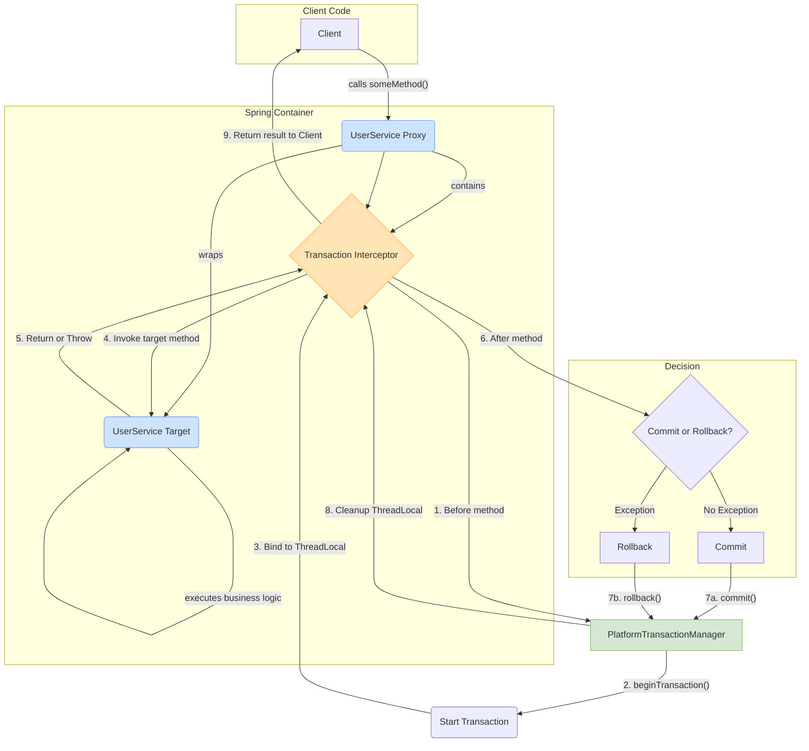

通过这个流程，事务管理的逻辑被完全从业务代码中分离出来，实现了非侵入式的声明式事务管理。

## Spring 事务隔离级别

> [!TIP]
>
> - `DEFAULT`(默认):使用底层数据库的默认隔离级别。如果数据库没有特定的设置，通常默认为 READ_CONMITTED 。
> - `READ_UNCOMMITTED`(读未提交):最低的隔离级别，允许事务读取尚未提交的数据，可能会导致脏读、不可重复读和幻读。
> - `READ_COMMITTED`(读已提交):仅允许读取已经提交的数据，避免了脏读，但可能会出现不可重复读和幻读问题。
> - `REPEATABLE_READ`(可重复读):确保在同一个事务内的多次读取结果一致，避免脏读和不可重复读，但可能会有幻读问题。
> - `SERIALIZABLE`(可串行化):最高的隔离级别，通过强制事务按顺序执行，完全避免脏读、不可重复读和幻读，代价是性能显著下降

> [!NOTE]
>
> - 脏读(Dirty Read):一个事务读取了另一个尚未提交的事务的数据，如果该事务回滚，则数据是不一致的。
> - 不可重复读 (Non-repeatable Read):在同一事务内的多次读取，前后数据不一致，因为其他事务修改了该数据并提交。
> - 幻读(Phantom Read):在一个事务内的多次查询，查询结果集不同，因为其他事务插入或删除了数据。

| 隔离级别           | 脏读 | 不可重复读 | 幻读 |
| :----------------- | :--- | :--------- | :--- |
| `READ_UNCOMMITTED` | 是   | 是         | 是   |
| `READ_COMMITTED`   | 否   | 是         | 是   |
| `REPEATABLE_READ`  | 否   | 否         | 是   |
| `SERIALIZABLE`     | 否   | 否         | 否   |

### 隔离级别与性能之间的权衡

- 选择隔离级别需要根据应用的具体需求进行权衡:
  - 低隔离级别(READ UNCOMMITTED 和 READCOMMITTED):性能高，但可能存在并发问题，适合数据一致性要求不高的场景。
  - 高隔离级别(REPEATABLE READ 和 SERIALIZABLE):数据一致性强，但性能较差，适合高数据一致性要求的场景。

### Spring 中的事务隔离级别设置

> [!NOTE]
>
> - 在 Spring 中，使用 @Transactional 注解可以方便地设置事务的隔离级别。
> - 通过 isolation 属性，开发者可以灵活地指定每个事务的隔离级别。

```java
@Transactional(isolation = Isolation.REPEATABLE_READ)
public void processTransaction() {
    // 事务逻辑
}
```

## Spring 有哪几种事务传播行为

> [!TIP]
>
> - **`PROPAGATION_REQUIRED`** (默认): 如果当前存在事务，则用当前事务；如果没有事务，则新起一个事务。
> - **`PROPAGATION_SUPPORTS`**: 支持当前事务，如果不存在，则以非事务方式执行。
> - **`PROPAGATION_MANDATORY`**: 支持当前事务，如果不存在，则抛出异常。
> - **`PROPAGATION_REQUIRES_NEW`**: 创建一个新事务，如果存在当前事务，则挂起当前事务。
> - **`PROPAGATION_NOT_SUPPORTED`**: 不支持当前事务，始终以非事务方式执行。
> - **`PROPAGATION_NEVER`**: 不支持当前事务，如果当前存在事务，则抛出异常。
> - **`PROPAGATION_NESTED`**: 如果当前事务存在，则在嵌套事务中执行。内层事务依赖外层事务，如果外层失败，则会回滚内层；内层失败不影响外层。

### 应用场景详解

> [!NOTE]
> 每种传播行为都有其独特的适用场景，理解它们有助于设计出健壮、高效的业务系统。

#### `PROPAGATION_REQUIRED`

- **应用场景**: 最常见的业务逻辑调用。比如，在订单创建时调用库存减少的方法，它们都应该共享同一个事务。
- **优点**: 事务复用，性能开销较小，适用于绝大多数业务逻辑。

#### `PROPAGATION_REQUIRES_NEW`

- **应用场景**: 需要独立提交的辅助业务，如日志记录、审计、发送通知等。即使主事务失败回滚，这些操作也应成功提交。
- **优点**: 事务隔离，防止主事务的失败影响到辅助操作，保证了核心业务与非核心业务的解耦。

#### `PROPAGATION_SUPPORTS`

- **应用场景**: 可选的事务支持。比如，一个通用的查询方法，它既可能被一个带事务的业务方法调用，也可能被一个无事务的后台任务调用。
- **优点**: 灵活，能适应不同的调用上下文。

#### `PROPAGATION_NOT_SUPPORTED`

- **应用场景**: 需要明确禁止在事务中执行的场景，比如某些数据库的特定监控查询或配置读取，这些操作不应被任何外部事务锁定或影响。
- **优点**: 避免不必要的事务开销和潜在的锁问题。

#### `PROPAGATION_MANDATORY`

- **应用场景**: 用于实现一些必须在特定事务上下文中执行的工具类或内部方法。常用于确保方法调用链的事务一致性。
- **优点**: 强制性的事务检查，能防止方法被错误地在无事务环境中使用。
- **缺点**: 强依赖外部事务，如果没有事务，则会失败，降低了方法的通用性。

#### `PROPAGATION_NEVER`

- **应用场景**: 与`MANDATORY`相反，用于确保方法绝对不在任何事务中执行。
- **优点**: 提供了一种强校验机制，防止敏感操作被意外卷入事务。
- **缺点**: 依赖于没有事务的调用环境。

#### `PROPAGATION_NESTED`

- **应用场景**: 复杂的业务流程中，需要支持部分回滚的场景。比如，一个包含多个步骤的批量操作，其中某个步骤失败后，你只想回滚该步骤，而不是整个批量操作。
- **优点**: 提供了比`REQUIRES_NEW`更细粒度的事务控制，它依赖于 JDBC 的 Savepoint 机制，可以实现子事务的回滚而不影响父事务。
- **注意**: 并非所有数据库和事务管理器都支持`NESTED`传播行为。

### 事务传播行为使用示例

> [!NOTE]
> 为了清晰地展示传播行为，下面的例子将围绕两个 Service 展开：`UserService`（主业务）和`LogService`（日志记录等辅助业务）。

#### `PROPAGATION_REQUIRED` (默认)

**场景**: `UserService`的`register`方法是一个事务，它调用`LogService`的`log`方法。`log`方法使用`REQUIRED`，它会加入到`register`方法的现有事务中。

```java
@Service
public class UserService {
    @Autowired
    private LogService logService;

    @Transactional(propagation = Propagation.REQUIRED)
    public void register(String username) {
        // 1. 数据库操作：创建用户
        System.out.println(username + " a registered.");

        // 2. 调用log方法，它会加入当前事务
        logService.log("User registered: " + username);

        // 3. 如果这里发生异常，用户创建和日志记录都会被回滚
        if ("test_rollback".equals(username)) {
            throw new RuntimeException("Rollback required.");
        }
    }
}

@Service
public class LogService {
    @Transactional(propagation = Propagation.REQUIRED)
    public void log(String message) {
        // 数据库操作：记录日志
        System.out.println("Log: " + message);
    }
}
```

**结果**: `logService.log`和`userService.register`在同一个事务中。`register`方法回滚，`log`方法的操作也会一并回滚。

---

#### `PROPAGATION_REQUIRES_NEW`

**场景**: 无论`register`事务是否成功，都需要**独立地**记录一条操作日志。`log`方法使用`REQUIRES_NEW`，它会挂起`register`的事务，并开启一个自己的新事务。

```java
// UserService中的register方法不变

@Service
public class LogService {
    @Transactional(propagation = Propagation.REQUIRES_NEW)
    public void log(String message) {
        // 这个操作在一个全新的、独立的事务中执行
        System.out.println("Log (in new transaction): " + message);
    }
}
```

**结果**: `register`方法的回滚**不会**影响到`log`方法。日志会成功提交到数据库，即使用户注册失败了。

---

#### `PROPAGATION_SUPPORTS`

**场景**: `log`方法可以支持事务，也可以不支持。

- 如果被一个带事务的方法（如`register`）调用，它就加入该事务。
- 如果被一个不带事务的方法调用，它就以非事务方式执行。

```java
@Service
public class LogService {
    @Transactional(propagation = Propagation.SUPPORTS)
    public void log(String message) {
        System.out.println("Log (supports transaction): " + message);
    }
}
```

**结果**: 行为取决于调用方。被`register`调用时，行为同`REQUIRED`；如果被一个无`@Transactional`注解的方法调用，则`log`方法自身不会开启事务。

---

#### `PROPAGATION_NOT_SUPPORTED`

**场景**: `log`方法明确表示不希望在事务中运行。如果它被一个带事务的方法（如`register`）调用，那么调用方的事务会被挂起，`log`方法以非事务方式执行。

```java
@Service
public class LogService {
    @Transactional(propagation = Propagation.NOT_SUPPORTED)
    public void log(String message) {
        // 该方法运行时，外层事务会被挂起
        System.out.println("Log (not in transaction): " + message);
    }
}
```

**结果**: `log`方法的操作会立即提交，因为它不在任何事务中。即使`register`方法后续失败并回滚，日志记录也不会受影响。

---

#### `PROPAGATION_MANDATORY`

**场景**: `log`方法**强制要求**必须在一个已存在的事务中调用，否则就报错。这常用于核心业务的子流程，确保其原子性。

```java
@Service
public class LogService {
    @Transactional(propagation = Propagation.MANDATORY)
    public void log(String message) {
        System.out.println("Log (must be in transaction): " + message);
    }
}
```

**结果**:

- `userService.register`调用它时，正常执行。
- 如果一个没有`@Transactional`的方法直接调用`logService.log()`，会抛出`IllegalTransactionStateException`异常。

---

#### `PROPAGATION_NEVER`

**场景**: `log`方法**强制要求**不能在任何事务中调用。

```java
@Service
public class LogService {
    @Transactional(propagation = Propagation.NEVER)
    public void log(String message) {
        System.out.println("Log (must not be in transaction): " + message);
    }
}
```

**结果**:

- `userService.register`调用它时，会抛出`IllegalTransactionStateException`异常。
- 只有在没有事务的上下文中调用它，才能正常执行。

---

#### `PROPAGATION_NESTED`

**场景**: `register`方法调用`log`，`log`希望拥有一个可以独立回滚的“子事务”。如果`log`失败，只回滚它自己，不影响`register`继续执行。但如果`register`失败，`log`的操作也必须回滚。

```java
@Service
public class LogService {
    @Transactional(propagation = Propagation.NESTED)
    public void log(String message) {
        // 该方法在嵌套事务中执行
        System.out.println("Log (in nested transaction): " + message);
        // 如果这里发生异常，只有这个嵌套事务会回滚
    }
}
```

**结果**: `NESTED`使用数据库的保存点（Savepoint）机制。`log`方法可以独立于`register`方法回滚，但它最终的提交依赖于`register`方法的成功提交。
**(注意: 并非所有数据库都支持保存点)**

## Spring 事务传播行为有什么用

> [!TIP]
>
> - 主要作用是定义和管理事务边界，尤其是一个事务方法调用另一个事务方法时，事务如何传播的问题，它解决了多个事务方法嵌套执行时，是否要开启新事务、复用现有事务或者挂起事务等复杂情况。
>
> 1. **控制事务的传播和嵌套**:根据具体业务需求，可以指定是否使用现有事务或开启新的事务，解决事务的传播问题。
> 2. **确保独立操作的事务隔离**:某些操作(如日志记录、发送通知)应当独立于主事务执行，即使主事务失败，这些操作也可以成功完成
> 3. **控制事务的边界和一致性**:不同的业务场景可能需要不同的事务边界，例如强制某个方法必须在事务中执行，或者确保某个方法永远不在事务中运行，

## Spring 事务在什么情况下会失效

### 面试

> [!TIP]
> 面试：

> [!WARNING]
> 大多数`@Transactional`注解导致的“事务失效”问题，其根源都与 Spring 的 AOP（面向切面编程）代理机制有关。理解这一点是排查问题的关键。

以下是几种常见的事务失效场景：

1.  **`rollbackFor` 属性设置不当**

    - **原因**: Spring 的`@Transactional`默认只对`RuntimeException`和`Error`进行回滚。如果方法抛出的是一个受检异常（Checked Exception，如 `IOException`, `SQLException`），而你没有配置`rollbackFor`属性，事务将不会回滚。
    - **解决方案**: 明确指定需要回滚的异常类型。
      ```java
      @Transactional(rollbackFor = Exception.class) // 对所有Exception都回滚
      public void performAction() throws IOException {
          // ...
          throw new IOException("File not found");
      }
      ```

2.  **异常被 `try-catch` 块捕获**

    - **原因**: 如果你在事务方法内部用`try-catch`捕获了异常，并且没有在`catch`块中重新抛出，那么 Spring 的事务 AOP 切面将无法感知到异常的发生，自然不会触发回滚。
    - **错误示例**:
      ```java
      @Transactional
      public void performAction() {
          try {
              // ... 执行数据库操作 ...
              throw new RuntimeException("Something went wrong");
          } catch (Exception e) {
              // 异常被“吞掉”了，事务AOP不知道，导致事务正常提交
              log.error("An error occurred but was handled.", e);
          }
      }
      ```

3.  **方法访问权限问题 (非 `public` 方法)**

    - **原因**: Spring AOP 代理默认只拦截`public`方法。如果你将`@Transactional`注解用在`protected`、`private`或包级私有的方法上，事务将不会生效。
    - **源码佐证**: 在 Spring 的`TransactionAttributeSource`实现中，有类似`Modifier.isPublic(method.getModifiers())`的检查逻辑。

4.  **同一个类中的方法调用 (this 调用)**

    - **原因**: 这是最常见也最隐蔽的失效场景。当一个类中的方法 A 调用同一个类中的方法 B（`this.methodB()`）时，这个调用是对象内部的直接调用，**没有经过 Spring 的代理对象**。因此，即使方法 B 上标注了`@Transactional`，其事务切面也无法被执行。
    - **示例**:

      ```java
      @Service
      public class OrderService {
          public void createOrder() {
              // 错误调用：this.insertOrder() 不会经过代理，事务失效
              this.insertOrder();
          }

          @Transactional
          public void insertOrder() {
              // ... 数据库操作 ...
          }
      }
      ```

    - **解决方案**: 将事务方法移到另一个 Bean 中，通过注入的 Bean 实例来调用；或者通过`AopContext.currentProxy()`获取当前代理对象来调用。

5.  **方法被 `final` 或 `static` 修饰**

    - **原因**: Spring AOP 的默认实现（CGLIB）是通过动态创建子类来作为代理的。`final`方法无法被子类重写，`static`方法属于类而不是实例。因此，AOP 无法代理这两类方法，`@Transactional`自然也无法生效。

6.  **事务传播行为配置错误**

    - **原因**: 不恰当的传播行为会导致事务逻辑与预期不符。例如，一个主方法调用一个子方法，如果子方法被配置为`PROPAGATION_REQUIRES_NEW`，它会开启一个全新的、独立的事务。如果子方法提交后，主方法发生异常并回滚，子方法的操作**不会**被回滚，这可能破坏了业务的整体原子性。

      ```java
      // 主方法
      @Transactional
      public void mainOperation() {
          subOperation(); // 开启新事务并已提交
          throw new RuntimeException("Main failed!"); // 主事务回滚，但subOperation不回滚
      }

      // 子方法
      @Transactional(propagation = Propagation.REQUIRES_NEW)
      public void subOperation() {
          // ...
      }
      ```

7.  **在多线程环境下调用**

    - **原因**: Spring 的事务上下文是基于`ThreadLocal`来存储的，这意味着事务信息与当前线程绑定。如果在事务方法中开启一个新的线程去执行数据库操作，新线程将**不持有**原线程的事务上下文，导致操作在事务之外执行。

8.  **数据库引擎不支持事务**
    - **原因**: 这是最根本的问题。如果你的数据库表使用的是不支持事务的存储引擎（例如 MySQL 的 MyISAM），那么 Spring 即使配置了事务管理，也无法生效，因为底层就不支持。
    - **解决方案**: 确保你的数据库和表都使用支持事务的引擎，如 InnoDB。

## Spring 事务的超时时间

> [!NOTE]
> 事务超时是一个重要的保护机制，可以防止因某个事务长时间持有数据库连接或锁，而导致整个系统性能下降或资源耗尽。

- **定义**: 超时时间定义了事务从开始到结束所允许的最大时长。如果一个事务的执行时间超过了这个设定的值，事务管理器将强制其回滚。

- **配置**: 超时时间通过 `@Transactional` 注解的 `timeout` 属性进行设置，单位为**秒**。

- **代码示例**:

  ```java
  /**
   * 该方法执行时间如果超过10秒，将被强制回滚。
   */
  @Transactional(timeout = 10)
  public void longRunningOperation() {
      try {
          // 模拟一个长时间运行的任务
          Thread.sleep(15000);
      } catch (InterruptedException e) {
          // ...
      }
      // ... 其他数据库操作 ...
  }
  ```

- **注意事项**:
  - `timeout` 属性的生效依赖于底层事务管理器的支持。大多数主流的事务管理器（如 JTA、DataSourceTransactionManager）都支持超时设置。
  - 超时配置仅对新开启的事务有效（即传播行为为 `REQUIRED`, `REQUIRES_NEW`, `NESTED`）。如果一个方法加入到一个已存在的事务中（如`SUPPORTS`），它自己的`timeout`设置将被忽略，沿用外部事务的超时配置。

## Spring 事务的回滚规则

> [!NOTE]
> 精确地控制哪些异常触发回滚，是保证业务逻辑正确性的重要一环。Spring 通过`@Transactional`注解的`rollbackFor`和`noRollbackFor`属性，提供了这种细粒度的控制能力。

- **默认行为**:

  - 当方法中抛出`RuntimeException`或`Error`时，Spring 事务会**自动回滚**。
  - 当方法中抛出**受检异常** (Checked Exception，即非`RuntimeException`) 时，Spring 事务**不会**自动回滚。

- **`rollbackFor`**:

  - **作用**: 告诉 Spring，除了默认的`RuntimeException`和`Error`外，当指定的**其他异常**被抛出时，**也需要回滚事务**。
  - **应用场景**: 最常见的场景就是让事务在遇到受检异常（如`IOException`, `SQLException`）时也能回滚。
  - **示例**:
    ```java
    // 指定当发生IOException时，事务也需要回滚
    @Transactional(rollbackFor = IOException.class)
    public void processFile(String filePath) throws IOException {
        // ... 数据库操作 ...
        if (!new File(filePath).exists()) {
            throw new IOException("文件不存在，需要回滚数据库操作");
        }
    }
    ```

- **`noRollbackFor`**:

  - **作用**: 告诉 Spring，即使发生了某些默认会触发回滚的异常（通常是`RuntimeException`的子类），**也不要回滚事务**。
  - **应用场景**: 当业务中某些特定的运行时异常不代表业务失败，而是一种正常的业务流程分支时。例如，一个库存不足的异常，你可能希望记录这个状态但不回滚整个订单创建流程。
  - **示例**:

    ```java
    // 自定义一个库存不足的异常
    public class InsufficientStockException extends RuntimeException {
        public InsufficientStockException(String message) {
            super(message);
        }
    }

    // 即使发生InsufficientStockException（它是RuntimeException），也不要回滚事务
    @Transactional(noRollbackFor = InsufficientStockException.class)
    public void createOrder(Product product) {
        // ... 其他数据库操作 ...
        if (product.getStock() <= 0) {
            // 抛出异常，但事务不会回滚
            throw new InsufficientStockException("库存不足，操作不回滚");
        }
    }
    ```

> [!TIP] > **最佳实践**:
>
> - 通常建议将所有业务异常定义为继承自`RuntimeException`的非受检异常。
> - 在需要全局处理受检异常回滚的场景下，可以统一配置`@Transactional(rollbackFor = Exception.class)`。
> - `noRollbackFor`的使用场景相对较少，需谨慎评估，确保不会破坏数据一致性。

## Spring 事务的是否只读

> [!NOTE]
> 将事务设置为只读（Read-Only）是一个重要的性能优化手段，它向数据库和 Spring 事务管理器提供了一个明确的信号：这个事务内不会有任何写操作。

- **定义**: `readOnly`属性用于声明一个事务是否为只读事务。默认值为`false`。

- **配置**: 通过`@Transactional`注解的`readOnly`属性进行设置。

  ```java
  @Transactional(readOnly = true)
  public User findUserById(Long id) {
      return userRepository.findById(id);
  }
  ```

- **核心价值与优化原理**:

  1.  **数据库层面的优化**: 当数据库接收到这是一个只读事务的信号时，它可能会启用一些优化措施。例如，它可能不会为这个事务分配和维护用于回滚的 undo log，从而减少了数据库的开销。
  2.  **避免脏检查**: 在某些 ORM 框架（如 Hibernate）中，将事务设置为只读可以避免对实体进行“脏检查”（Dirty Checking），即跳过检测实体自加载以来是否有变化的步骤，从而提高性能。
  3.  **实现读写分离**: 在读写分离的架构中，`readOnly=true`是一个关键的路由依据。数据源路由 AOP 可以根据这个属性，将事务中的所有查询请求路由到负载较低的**只读数据库副本**（Read Replica）上，从而减轻主数据库（Master）的压力。

- **注意事项**:
  - `readOnly`属性是一个**提示性**的配置，而非强制性约束。如果你在一个标记为`readOnly=true`的事务中执行了写操作（INSERT, UPDATE, DELETE），其结果取决于底层的事务管理器和数据库。有些数据库可能会抛出异常，而有些则可能忽略这个提示并成功执行写操作。
  - 这个属性只对开启一个新事务的传播行为（如`REQUIRED`, `REQUIRES_NEW`）有意义。如果事务是加入一个已存在的、非只读的事务，那么`readOnly`设置会被忽略。
```

## 来源 4: Fuwari / `springcloud/BulkHeadBasics​.md`

- 原始 URL: <https://github.com/DavidHLP/Fuwari/blob/07cee2baf9cee227807dcd68004c5f2493e5ac52/src/content/posts/springcloud/BulkHeadBasics​.md>
- 本地路径: `springcloud/BulkHeadBasics​.md`

```markdown
---
title: BulkHead 舱壁模式详解 - SpringCloud微服务容错实战
published: 2025-07-14
tags: [SpringCloud, Resilience4j, 微服务, 容错, 舱壁模式, 限流]
category: SpringCloud
description: 详解BulkHead舱壁模式的核心原理与实现方式，包括信号量隔离和线程池隔离两种策略。结合Resilience4j框架，通过实战案例展示如何在SpringCloud微服务架构中实现系统保护、防止故障扩散，并深入讲解限流算法的选型与最佳实践
draft: false
---

## **什么是 BulkHead 舱壁模式？**

BulkHead（舱壁模式）是一种重要的系统保护机制，主要用于**防止单个组件或服务的故障扩散到整个系统**，从而提高系统的稳定性和可靠性。通过**限制并发执行**的数量，BulkHead 模式可以有效防止系统过载。

## **BulkHead 的实现方式**

### 1. **线程池隔离**

- **工作原理**：为每个服务或组件分配独立的线程池资源
- **优势**：
  - 防止单个服务过载影响整个系统
  - 即使某个服务超出其线程池容量，其他服务仍能正常工作
- **适用场景**：服务之间相对独立且并发量较高的微服务架构

### 2. **信号量隔离**

- **工作原理**：通过信号量限制并发请求数量
- **优势**：
  - 更精细的资源使用控制
  - 相比线程池隔离，资源开销更小
- **适用场景**：资源消耗较高或需要严格控制的场景（如数据库连接池、外部 API 调用）

## **实体类定义**

在实现 BulkHead 舱壁模式之前，我们需要定义相关的实体类和数据传输对象。这些类为我们的示例代码提供了基础结构。

### **用户相关实体类**

````java
// UserDetailsResponse.java
// 用户详情响应
@Data
@Builder
@NoArgsConstructor
@AllArgsConstructor
public class UserDetailsResponse {
    private String userId;
    private String username;
    private String email;
    private LocalDateTime createTime;
    private String status;
    private String phone;
    private String avatar;

    // 扩展字段
    private ConcurrentHashMap<String, Object> extraInfo;
}
```

```java
// BatchUserRequest.java
// 批量用户查询请求
@Data
@Builder
@NoArgsConstructor
@AllArgsConstructor
public class BatchUserRequest {
    @NotEmpty(message = "用户ID列表不能为空")
    private CopyOnWriteArrayList<String> userIds;

    private boolean includeInactive; // 是否包含非活跃用户
    private CopyOnWriteArraySet<String> fields; // 需要返回的字段
}
````

### **订单相关实体类**

```java
// CreateOrderRequest.java
// 创建订单请求
@Data
@Builder
@NoArgsConstructor
@AllArgsConstructor
public class CreateOrderRequest {
    @NotBlank(message = "订单ID不能为空")
    private String orderId;

    @NotBlank(message = "用户ID不能为空")
    private String userId;

    @NotNull(message = "订单金额不能为空")
    @DecimalMin(value = "0.01", message = "订单金额必须大于0")
    private BigDecimal amount;

    @NotEmpty(message = "商品列表不能为空")
    private CopyOnWriteArrayList<String> items;

    private String couponCode; // 优惠券码
    private String remark; // 订单备注
    private ConcurrentHashMap<String, Object> metadata; // 扩展元数据
}
```

```java
// OrderResponse.java
// 订单响应
@Data
@Builder
@NoArgsConstructor
@AllArgsConstructor
public class OrderResponse {
    private boolean success;
    private Order order;
    private String message;
    private String errorCode;
    private boolean needVerification; // 是否需要验证
    private LocalDateTime responseTime;
}
```

```java
// Order.java
// 订单实体
@Data
@Builder
@NoArgsConstructor
@AllArgsConstructor
public class Order {
    private String orderId;
    private String userId;
    private BigDecimal amount;
    private CopyOnWriteArrayList<OrderItem> items;
    private String status; // CREATED, PENDING_VERIFICATION, CONFIRMED, CANCELLED
    private LocalDateTime createTime;
    private LocalDateTime updateTime;
    private String couponCode;
    private BigDecimal discountAmount;
    private BigDecimal finalAmount;
    private String remark;
    private ConcurrentHashMap<String, Object> metadata;
}
```

```java
// OrderItem.java
// 订单项
@Data
@Builder
@NoArgsConstructor
@AllArgsConstructor
public class OrderItem {
    private String itemId;
    private String itemName;
    private BigDecimal price;
    private Integer quantity;
    private BigDecimal totalPrice;
    private String category;
}
```

```java
// BatchOrderRequest.java
// 批量订单请求
@Data
@Builder
@NoArgsConstructor
@AllArgsConstructor
public class BatchOrderRequest {
    @NotEmpty(message = "订单列表不能为空")
    @Size(max = 100, message = "批量处理订单数量不能超过100")
    private CopyOnWriteArrayList<CreateOrderRequest> orders;

    private boolean validateUser; // 是否验证用户
    private boolean allowPartialSuccess; // 是否允许部分成功
}
```

```java
// BatchOrderResponse.java
// 批量订单响应
@Data
@Builder
@NoArgsConstructor
@AllArgsConstructor
public class BatchOrderResponse {
    private boolean success;
    private CopyOnWriteArrayList<Order> orders;
    private CopyOnWriteArrayList<String> failedOrderIds;
    private int processedCount;
    private int successCount;
    private int failedCount;
    private String message;
    private ConcurrentHashMap<String, String> errors; // orderId -> errorMessage
}
```

### **支付相关实体类**

```java
// PaymentRequest.java
// 支付请求
@Data
@Builder
@NoArgsConstructor
@AllArgsConstructor
public class PaymentRequest {
    @NotBlank(message = "订单ID不能为空")
    private String orderId;

    @NotBlank(message = "用户ID不能为空")
    private String userId;

    @NotNull(message = "支付金额不能为空")
    @DecimalMin(value = "0.01", message = "支付金额必须大于0")
    private BigDecimal amount;

    @NotBlank(message = "支付方式不能为空")
    private String paymentMethod; // CREDIT_CARD, ALIPAY, WECHAT, BANK_TRANSFER

    private String bankCard; // 银行卡号（脱敏）
    private String currency; // 货币类型，默认CNY
    private String callbackUrl; // 回调地址
    private ConcurrentHashMap<String, String> extraParams; // 额外参数
}
```

```java
// PaymentResponse.java
// 支付响应
@Data
@Builder
@NoArgsConstructor
@AllArgsConstructor
public class PaymentResponse {
    private boolean success;
    private String orderId;
    private String paymentId;
    private String transactionId; // 第三方交易ID
    private BigDecimal amount;
    private String status; // PENDING, SUCCESS, FAILED, CANCELLED
    private String message;
    private String errorCode;
    private LocalDateTime processTime;
    private LocalDateTime completedTime;
    private ConcurrentHashMap<String, Object> paymentDetails;
}
```

```java
// PaymentException.java
// 支付异常
public class PaymentException extends RuntimeException {
    private String errorCode;
    private String orderId;

    public PaymentException(String message) {
        super(message);
    }

    public PaymentException(String message, String errorCode) {
        super(message);
        this.errorCode = errorCode;
    }

    public PaymentException(String message, String errorCode, String orderId) {
        super(message);
        this.errorCode = errorCode;
        this.orderId = orderId;
    }

    // getters and setters
    public String getErrorCode() { return errorCode; }
    public void setErrorCode(String errorCode) { this.errorCode = errorCode; }
    public String getOrderId() { return orderId; }
    public void setOrderId(String orderId) { this.orderId = orderId; }
}
```

### **通知相关实体类**

```java
// NotificationRequest.java
// 通知请求
@Data
@Builder
@NoArgsConstructor
@AllArgsConstructor
public class NotificationRequest {
    @NotBlank(message = "用户ID不能为空")
    private String userId;

    @NotBlank(message = "通知类型不能为空")
    private String type; // EMAIL, SMS, PUSH, PAYMENT_SUCCESS, ORDER_UPDATE

    @NotBlank(message = "通知内容不能为空")
    private String content;

    private String title; // 通知标题
    private String orderId; // 关联订单ID
    private String templateId; // 模板ID
    private ConcurrentHashMap<String, Object> templateParams; // 模板参数
    private CopyOnWriteArrayList<String> channels; // 通知渠道：email, sms, push
    private Integer priority; // 优先级：1-5，5最高
    private LocalDateTime scheduledTime; // 定时发送时间
}
```

```java
// NotificationResponse.java
// 通知响应
@Data
@Builder
@NoArgsConstructor
@AllArgsConstructor
public class NotificationResponse {
    private boolean success;
    private String notificationId;
    private String userId;
    private String message;
    private String errorCode;
    private LocalDateTime sentTime;
    private CopyOnWriteArrayList<String> successChannels; // 成功发送的渠道
    private CopyOnWriteArrayList<String> failedChannels; // 失败的渠道
    private ConcurrentHashMap<String, String> channelResults; // 各渠道详细结果
}
```

### **组合处理相关实体类**

```java
// CompleteOrderRequest.java
// 完整订单处理请求
@Data
@Builder
@NoArgsConstructor
@AllArgsConstructor
public class CompleteOrderRequest {
    @NotBlank(message = "订单ID不能为空")
    private String orderId;

    @NotNull(message = "支付请求不能为空")
    private PaymentRequest paymentRequest;

    @NotNull(message = "通知请求不能为空")
    private NotificationRequest notificationRequest;

    private boolean requirePaymentSuccess; // 是否要求支付成功
    private boolean allowAsyncNotification; // 是否允许异步通知
    private Integer timeoutSeconds; // 超时时间（秒）
}
```

```java
// CompleteOrderResponse.java
// 完整订单处理响应
@Data
@Builder
@NoArgsConstructor
@AllArgsConstructor
public class CompleteOrderResponse {
    private String orderId;
    private boolean paymentSuccess;
    private boolean notificationSent;
    private PaymentResponse paymentResponse;
    private NotificationResponse notificationResponse;
    private LocalDateTime completedTime;
    private String message;
    private String status; // SUCCESS, PARTIAL_SUCCESS, FAILED
    private CopyOnWriteArrayList<String> warnings; // 警告信息
    private ConcurrentHashMap<String, Object> additionalInfo;
}
```

### **用户信息相关类**

```java
// UserInfo.java
// 用户信息实体
@Data
@Builder
@NoArgsConstructor
@AllArgsConstructor
public class UserInfo {
    private String userId;
    private String username;
    private String email;
    private String phone;
    private String status; // ACTIVE, INACTIVE, SUSPENDED
    private UserProfile profile;
    private UserPermissions permissions;
    private LocalDateTime createTime;
    private LocalDateTime lastLoginTime;
    private ConcurrentHashMap<String, Object> metadata;
}
```

```java
// UserProfile.java
// 户档案
@Data
@Builder
@NoArgsConstructor
@AllArgsConstructor
public class UserProfile {
    private String nickname;
    private String avatar;
    private String gender;
    private LocalDate birthday;
    private String address;
    private String occupation;
    private CopyOnWriteArrayList<String> interests;
}
```

```java
// UserPermissions.java
// 用户权限
@Data
@Builder
@NoArgsConstructor
@AllArgsConstructor
public class UserPermissions {
    private CopyOnWriteArrayList<String> roles;
    private CopyOnWriteArrayList<String> permissions;
    private ConcurrentHashMap<String, Object> resourceLimits; // 资源限制
    private LocalDateTime permissionUpdateTime;
}
```

### **配置和枚举类**

```java
// BulkheadType.java
// 舱壁类型枚举
public enum BulkheadType {
    SEConcurrentHashMapHORE("信号量舱壁"),
    THREAD_POOL("线程池舱壁");

    private final String description;

    BulkheadType(String description) {
        this.description = description;
    }

    public String getDescription() {
        return description;
    }
}
```

```java
// ServiceStatus.java
// 服务状态枚举
public enum ServiceStatus {
    HEALTHY("健康"),
    DEGRADED("降级"),
    UNHEALTHY("不健康"),
    CIRCUIT_OPEN("熔断开启"),
    BULKHEAD_FULL("舱壁满载");

    private final String description;

    ServiceStatus(String description) {
        this.description = description;
    }

    public String getDescription() {
        return description;
    }
}
```

```java
// PaymentMethod.java
// 支付方式枚举
public enum PaymentMethod {
    CREDIT_CARD("信用卡"),
    DEBIT_CARD("借记卡"),
    ALIPAY("支付宝"),
    WECHAT("微信支付"),
    BANK_TRANSFER("银行转账"),
    DIGITAL_WALLET("数字钱包");

    private final String description;

    PaymentMethod(String description) {
        this.description = description;
    }

    public String getDescription() {
        return description;
    }
}
```

```java
// NotificationType.java
// 通知类型枚举
public enum NotificationType {
    EMAIL("邮件通知"),
    SMS("短信通知"),
    PUSH("推送通知"),
    PAYMENT_SUCCESS("支付成功通知"),
    ORDER_UPDATE("订单更新通知"),
    SYSTEM_ALERT("系统告警");

    private final String description;

    NotificationType(String description) {
        this.description = description;
    }

    public String getDescription() {
        return description;
    }
}
```

### **异常处理类**

```java
// BulkheadException.java
// 舱壁异常
public class BulkheadException extends RuntimeException {
    private String serviceName;
    private BulkheadType bulkheadType;
    private String errorCode;

    public BulkheadException(String message) {
        super(message);
    }

    public BulkheadException(String message, String serviceName, BulkheadType bulkheadType) {
        super(message);
        this.serviceName = serviceName;
        this.bulkheadType = bulkheadType;
    }

    public BulkheadException(String message, Throwable cause) {
        super(message, cause);
    }

    // getters and setters
    public String getServiceName() { return serviceName; }
    public void setServiceName(String serviceName) { this.serviceName = serviceName; }
    public BulkheadType getBulkheadType() { return bulkheadType; }
    public void setBulkheadType(BulkheadType bulkheadType) { this.bulkheadType = bulkheadType; }
    public String getErrorCode() { return errorCode; }
    public void setErrorCode(String errorCode) { this.errorCode = errorCode; }
}
```

```java
// ServiceUnavailableException.java
// 服务不可用异常
public class ServiceUnavailableException extends RuntimeException {
    private String serviceName;
    private ServiceStatus serviceStatus;
    private LocalDateTime timestamp;

    public ServiceUnavailableException(String message, String serviceName) {
        super(message);
        this.serviceName = serviceName;
        this.timestamp = LocalDateTime.now();
    }

    public ServiceUnavailableException(String message, String serviceName, ServiceStatus serviceStatus) {
        super(message);
        this.serviceName = serviceName;
        this.serviceStatus = serviceStatus;
        this.timestamp = LocalDateTime.now();
    }

    // getters and setters
    public String getServiceName() { return serviceName; }
    public void setServiceName(String serviceName) { this.serviceName = serviceName; }
    public ServiceStatus getServiceStatus() { return serviceStatus; }
    public void setServiceStatus(ServiceStatus serviceStatus) { this.serviceStatus = serviceStatus; }
    public LocalDateTime getTimestamp() { return timestamp; }
    public void setTimestamp(LocalDateTime timestamp) { this.timestamp = timestamp; }
}
```

### **工具类**

```java
// IdGenerator.java
// ID生成工具
@Component
public class IdGenerator {
    private static final String ORDER_PREFIX = "ORD";
    private static final String PAYMENT_PREFIX = "PAY";
    private static final String NOTIFICATION_PREFIX = "NOT";

    public String generateOrderId() {
        return ORDER_PREFIX + System.currentTimeMillis() +
               String.format("%04d", new Random().nextInt(10000));
    }

    public String generatePaymentId() {
        return PAYMENT_PREFIX + System.currentTimeMillis() +
               String.format("%04d", new Random().nextInt(10000));
    }

    public String generateNotificationId() {
        return NOTIFICATION_PREFIX + System.currentTimeMillis() +
               String.format("%04d", new Random().nextInt(10000));
    }

    public String generateTempOrderId() {
        return "TEMP_" + generateOrderId();
    }
}
```

```java
// ValidationUtils.java
// 验证工具类
@Component
public class ValidationUtils {

    public boolean isValidUserId(String userId) {
        return userId != null && userId.trim().length() > 0 &&
               userId.matches("^[a-zA-Z0-9_]{3,32}$");
    }

    public boolean isValidAmount(BigDecimal amount) {
        return amount != null && amount.compareTo(BigDecimal.ZERO) > 0 &&
               amount.compareTo(BigDecimal.valueOf(1000000)) <= 0;
    }

    public boolean isValidOrderId(String orderId) {
        return orderId != null && orderId.trim().length() > 0 &&
               orderId.matches("^[A-Z0-9_]{6,50}$");
    }

    public boolean isValidEmail(String email) {
        return email != null &&
               email.matches("^[A-Za-z0-9+_.-]+@([A-Za-z0-9.-]+\\.[A-Za-z]{2,})$");
    }

    public boolean isValidPhoneNumber(String phone) {
        return phone != null &&
               phone.matches("^1[3-9]\\d{9}$");
    }
}
```

## **实现 SeConcurrentHashMaphoreBulkhead（信号量舱壁）**

BulkHead 模式在 Resilience4j 中提供了两种实现方式：信号量舱壁（SeConcurrentHashMaphoreBulkhead）和固定线程池舱壁（FixedThreadPoolBulkhead）。下面我们分别实现这两种方式。

> [!NOTE]
> 信号量舱壁通过控制同时访问资源的线程数量来实现隔离，适用于轻量级的资源控制场景。

### **order-service 依赖配置**

```xml
<dependency>
    <groupId>org.springframework.cloud</groupId>
    <artifactId>spring-cloud-starter-circuitbreaker-resilience4j</artifactId>
</dependency>
<dependency>
    <groupId>io.github.resilience4j</groupId>
    <artifactId>resilience4j-bulkhead</artifactId>
</dependency>
<dependency>
    <groupId>org.springframework.boot</groupId>
    <artifactId>spring-boot-starter-aop</artifactId>
</dependency>
```

### **order-service 配置文件**

```yaml
// application.yml
spring:
  application:
    name: order-service
  cloud:
    consul:
      host: localhost
      port: 8500
      discovery:
        service-name: ${spring.application.name}
    openfeign:
      client:
        config:
          default:
            connect-timeout: 3000 # 连接超时时间
            read-timeout: 3000 # 读取超时时间
      circuitbreaker:
        enabled: false
        group:
          enabled: false
      httpclient:
        hc5:
          enabled: true

resilience4j:
  bulkhead:
    configs:
      default:
        # 信号量舱壁配置
        maxConcurrentCalls: 3 # 最大并发调用数
        maxWaitDuration: 4s # 最大等待时间
    instances:
      # 用户服务信号量舱壁
      user-service:
        baseConfig: default
        maxConcurrentCalls: 2 # 用户服务限制更严格
        maxWaitDuration: 2s # 最大等待时间
  timelimiter:
    instances:
      user-service: # 实例名称，需要和熔断器配置的实例名对应
        timeoutDuration: 3s # 超时时间

# 启用监控端点
management:
  endpoints:
    web:
      exposure:
        include: health,info,metrics,bulkheads
  endpoint:
    health:
      show-details: always
```

### **order-service 实现**

```java
// orderServiceMain.java
@SpringBootApplication
@EnableDiscoveryClient
@EnableFeignClients
public class orderServiceMain {
    public static void main(String[] args) {
        SpringApplication.run(orderServiceMain.class, args);
    }
}
```

```java
// WebClientConfig.java
@Configuration
public class WebClientConfig {

    @Bean
    @LoadBalanced
    public WebClient.Builder loadBalancedWebClientBuilder() {
        return WebClient.builder();
    }
}
```

```java
// UserFeignClient.java
@FeignClient(name = "user-service", path = "/api/user")
public interface UserFeignClient {

    @GetMapping("/details/{userId}")
    ResponseResult<UserDetailsResponse> getUserDetails(@PathVariable("userId") String userId);
}
```

```java
// OrderController.java
@Slf4j
@RequestMapping("/api/order")
@RequiredArgsConstructor
@RestController
public class OrderController {

        private final UserFeignClient userFeignClient;

        private final OrderService orderService;

        /**
         * 创建订单 - 使用信号量舱壁保护用户服务调用
         */
        @PostMapping("/create")
        @Bulkhead(name = "user-service", type = Bulkhead.Type.SEMAPHORE, fallbackMethod = "createOrderFallback")
        public ResponseResult<OrderResponse> createOrder(@RequestBody CreateOrderRequest request) {
                log.info("开始创建订单: {}", request.getOrderId());

                try {
                        // 1. 验证用户信息（受信号量保护）
                        UserDetailsResponse user = userFeignClient.getUserDetails(request.getUserId()).getData();
                        log.info("用户验证成功: {}", user.getUsername());

                        // 2. 创建订单
                        Order order = orderService.createOrder(request, user);

                        return ResponseResult.success(OrderResponse.builder()
                                        .success(true)
                                        .order(order)
                                        .message("订单创建成功")
                                        .build());

                } catch (Exception e) {
                        log.error("创建订单失败: {}", e.getMessage(), e);
                        throw e; // 触发舱壁降级
                }
        }
        // ================ 降级方法 ================

        /**
         * 创建订单降级方法
         */
        public ResponseResult<OrderResponse> createOrderFallback(CreateOrderRequest request, Exception ex) {
                log.warn("用户服务调用受限，订单创建降级. 订单ID: {}, 异常: {}",
                                request.getOrderId(), ex.getMessage());

                // 创建临时订单，等待后续处理
                Order tempOrder = orderService.createTemporaryOrder(request);

                return ResponseResult.success(OrderResponse.builder()
                                .success(true)
                                .order(tempOrder)
                                .message("系统繁忙，订单已创建但需要稍后验证用户信息")
                                .needVerification(true)
                                .build());
        }
}
```

```java
// OrderService.java
@Slf4j
@Service
public class OrderService {

    private final Random random = new Random();

    // 模拟商品数据
    private final Map<String, OrderItem> mockItems = Map.of(
            "item001",
            OrderItem.builder().itemId("item001").itemName("笔记本电脑").price(new BigDecimal("5999.00")).category("电子产品")
                    .build(),
            "item002",
            OrderItem.builder().itemId("item002").itemName("无线鼠标").price(new BigDecimal("199.00")).category("电子产品")
                    .build(),
            "item003",
            OrderItem.builder().itemId("item003").itemName("机械键盘").price(new BigDecimal("399.00")).category("电子产品")
                    .build(),
            "item004",
            OrderItem.builder().itemId("item004").itemName("显示器").price(new BigDecimal("1299.00")).category("电子产品")
                    .build(),
            "item005", OrderItem.builder().itemId("item005").itemName("手机").price(new BigDecimal("3999.00"))
                    .category("电子产品").build());

    /**
     * 创建订单
     */
    public Order createOrder(CreateOrderRequest request, UserDetailsResponse user) {
        log.info("开始创建订单，订单ID: {}, 用户: {}", request.getOrderId(), user.getUsername());

        // 构建订单商品列表
        List<OrderItem> orderItems = buildOrderItems(request.getItems());

        // 计算订单总金额
        BigDecimal calculatedAmount = calculateTotalAmount(orderItems);

        // 应用优惠券折扣
        BigDecimal discountAmount = applyDiscount(request.getCouponCode(), calculatedAmount);
        BigDecimal finalAmount = calculatedAmount.subtract(discountAmount);

        // 构建订单
        Order order = Order.builder()
                .orderId(request.getOrderId())
                .userId(request.getUserId())
                .amount(calculatedAmount)
                .items(orderItems)
                .status("CONFIRMED")
                .createTime(LocalDateTime.now())
                .updateTime(LocalDateTime.now())
                .couponCode(request.getCouponCode())
                .discountAmount(discountAmount)
                .finalAmount(finalAmount)
                .remark(request.getRemark())
                .metadata(request.getMetadata() != null ? request.getMetadata() : new ConcurrentHashMap<>())
                .build();

        // 添加一些元数据
        order.getMetadata().put("createdBy", user.getUsername());
        order.getMetadata().put("userStatus", user.getStatus());
        order.getMetadata().put("processTime", System.currentTimeMillis());

        log.info("订单创建成功，订单ID: {}, 最终金额: {}", order.getOrderId(), order.getFinalAmount());
        return order;
    }

    /**
     * 批量创建订单
     */
    public List<Order> batchCreateOrders(List<CreateOrderRequest> requests,
            List<UserDetailsResponse> users) {
        log.info("开始批量创建订单，数量: {}", requests.size());

        List<Order> orders = new CopyOnWriteArrayList<>();

        // 创建用户ID到用户信息的映射
        Map<String, UserDetailsResponse> userMap = new ConcurrentHashMap<>();
        users.forEach(user -> userMap.put(user.getUserId(), user));

        for (CreateOrderRequest request : requests) {
            try {
                UserDetailsResponse user = userMap.get(request.getUserId());
                if (user != null) {
                    Order order = createOrder(request, user);
                    orders.add(order);
                } else {
                    log.warn("用户信息不存在，跳过订单创建: {}", request.getOrderId());
                }
            } catch (Exception e) {
                log.error("创建订单失败，订单ID: {}, 错误: {}", request.getOrderId(), e.getMessage());
            }
        }

        log.info("批量订单创建完成，成功数量: {}", orders.size());
        return orders;
    }

    /**
     * 创建临时订单（降级时使用）
     */
    public Order createTemporaryOrder(CreateOrderRequest request) {
        log.info("创建临时订单，订单ID: {}", request.getOrderId());

        // 构建订单商品列表
        List<OrderItem> orderItems = buildOrderItems(request.getItems());

        // 计算订单总金额
        BigDecimal calculatedAmount = calculateTotalAmount(orderItems);

        // 应用优惠券折扣
        BigDecimal discountAmount = applyDiscount(request.getCouponCode(), calculatedAmount);
        BigDecimal finalAmount = calculatedAmount.subtract(discountAmount);

        // 构建临时订单
        Order order = Order.builder()
                .orderId(request.getOrderId())
                .userId(request.getUserId())
                .amount(calculatedAmount)
                .items(orderItems)
                .status("PENDING_VERIFICATION") // 临时订单状态
                .createTime(LocalDateTime.now())
                .updateTime(LocalDateTime.now())
                .couponCode(request.getCouponCode())
                .discountAmount(discountAmount)
                .finalAmount(finalAmount)
                .remark(request.getRemark())
                .metadata(request.getMetadata() != null ? request.getMetadata() : new ConcurrentHashMap<>())
                .build();

        // 添加临时订单标识
        order.getMetadata().put("isTemporary", true);
        order.getMetadata().put("needVerification", true);
        order.getMetadata().put("processTime", System.currentTimeMillis());

        log.info("临时订单创建成功，订单ID: {}, 状态: {}", order.getOrderId(), order.getStatus());
        return order;
    }

    /**
     * 构建订单商品列表
     */
    private List<OrderItem> buildOrderItems(List<String> itemIds) {
        List<OrderItem> orderItems = new CopyOnWriteArrayList<>();

        for (String itemId : itemIds) {
            OrderItem mockItem = mockItems.get(itemId);
            if (mockItem != null) {
                // 模拟随机数量
                int quantity = random.nextInt(3) + 1; // 1-3个

                OrderItem orderItem = OrderItem.builder()
                        .itemId(mockItem.getItemId())
                        .itemName(mockItem.getItemName())
                        .price(mockItem.getPrice())
                        .quantity(quantity)
                        .totalPrice(mockItem.getPrice().multiply(BigDecimal.valueOf(quantity)))
                        .category(mockItem.getCategory())
                        .build();

                orderItems.add(orderItem);
            } else {
                // 创建默认商品
                int quantity = random.nextInt(2) + 1;
                BigDecimal price = new BigDecimal("99.00");

                OrderItem defaultItem = OrderItem.builder()
                        .itemId(itemId)
                        .itemName("商品-" + itemId)
                        .price(price)
                        .quantity(quantity)
                        .totalPrice(price.multiply(BigDecimal.valueOf(quantity)))
                        .category("默认分类")
                        .build();

                orderItems.add(defaultItem);
            }
        }

        return orderItems;
    }

    /**
     * 计算订单总金额
     */
    private BigDecimal calculateTotalAmount(List<OrderItem> items) {
        return items.stream()
                .map(OrderItem::getTotalPrice)
                .reduce(BigDecimal.ZERO, BigDecimal::add);
    }

    /**
     * 应用优惠券折扣
     */
    private BigDecimal applyDiscount(String couponCode, BigDecimal amount) {
        if (couponCode == null || couponCode.trim().isEmpty()) {
            return BigDecimal.ZERO;
        }

        // 模拟不同优惠券
        return switch (couponCode.toUpperCase()) {
            case "VIP10" -> amount.multiply(new BigDecimal("0.1")); // 9折
            case "NEW20" -> amount.multiply(new BigDecimal("0.2")); // 8折
            case "SAVE50" -> new BigDecimal("50.00"); // 立减50元
            case "SAVE100" -> new BigDecimal("100.00"); // 立减100元
            default -> BigDecimal.ZERO; // 无效优惠券
        };
    }
}
```

### **user-service 配置文件**

```yml
// application.yml
spring:
  application:
    name: user-service
  cloud:
    consul:
      host: localhost
      port: 8500
      discovery:
        service-name: ${spring.application.name}
```

### **user-service 实现**

```java
// UserServiceMain.java
@SpringBootApplication
@EnableDiscoveryClient
@RefreshScope
public class UserServiceMain {
    public static void main(String[] args) {
        SpringApplication.run(UserServiceMain.class, args);
    }
}
```

```java
// UserServiceMain.java
@RestController
@RequestMapping("/api/user")
@Slf4j
public class UserController {

    /**
     * 获取用户详情 - 模拟耗时操作
     */
    @GetMapping("/details/{userId}")
    public ResponseResult<UserDetailsResponse> getUserDetails(@PathVariable("userId") String userId) {
        log.info("开始获取用户详情: {}", userId);

        // 模拟不同的处理时间
        if (userId.contains("slow")) {
            try {
                TimeUnit.SECONDS.sleep(2); // 模拟慢查询
                log.info("慢查询完成: {}", userId);
            } catch (InterruptedException e) {
                Thread.currentThread().interrupt();
                throw new RuntimeException("查询被中断", e);
            }
        }

        if (userId.contains("error")) {
            throw new RuntimeException("用户服务内部错误");
        }

        // 正常处理
        return ResponseResult.success(UserDetailsResponse.builder()
                .userId(userId)
                .username("user_" + userId)
                .email(userId + "@example.com")
                .createTime(LocalDateTime.now())
                .status("ACTIVE")
                .build());
    }
}
```

### **信号量舱壁测试**

#### **并发测试脚本**

[image: pfHd2OXcN8RgFwt4MBzm0](./images/BulkHeadBasics​/pfHd2OXcN8RgFwt4MBzm0.png)

[image: pfHd2OXcN8RgFwt4MBzm1](./images/BulkHeadBasics​/pfHd2OXcN8RgFwt4MBzm1.png)

#### **期望测试结果**

- 失败：仓璧降级调用
- 成功：正常处理

[image: pfHd2OXcN8RgFwt4MBzm1](./images/BulkHeadBasics​/pfHd2OXcN8RgFwt4MBzm2.png)

## **实现 FixedThreadPoolBulkhead（固定线程池舱壁）**

固定线程池舱壁使用独立的线程池来执行受保护的操作，提供更强的隔离性，适用于 I/O 密集型或长时间运行的操作。

### **order-service 依赖配置**

```xml
<dependency>
    <groupId>org.springframework.cloud</groupId>
    <artifactId>spring-cloud-starter-circuitbreaker-resilience4j</artifactId>
</dependency>
<dependency>
    <groupId>io.github.resilience4j</groupId>
    <artifactId>resilience4j-bulkhead</artifactId>
</dependency>
<dependency>
    <groupId>org.springframework.boot</groupId>
    <artifactId>spring-boot-starter-aop</artifactId>
</dependency>
```

### **order-service 配置文件**

```yaml
// application.yml
spring:
  application:
    name: order-service
  cloud:
    consul:
      host: localhost
      port: 8500
      discovery:
        service-name: ${spring.application.name}
    openfeign:
      client:
        config:
          default:
            connect-timeout: 5000 # 连接超时时间
            read-timeout: 5000 # 读取超时时间
      circuitbreaker:
        enabled: false
        group:
          enabled: false
      httpclient:
        hc5:
          enabled: true

resilience4j:
  thread-pool-bulkhead:
    instances:
      # 支付服务线程池舱壁
      payment-service:
        maxThreadPoolSize: 1
        coreThreadPoolSize: 1
        queueCapacity: 1
      # 通知服务线程池舱壁
  timelimiter:
    instances:
      payment-service: # 实例名称，需要和熔断器配置的实例名对应
        timeoutDuration: 5s # 超时时间

# 启用监控端点
management:
  endpoints:
    web:
      exposure:
        include: health,info,metrics,bulkheads
  endpoint:
    health:
      show-details: always
```

### **Order-service 实现**

```java
// OrderMain.java
@SpringBootApplication
@EnableDiscoveryClient
@EnableFeignClients
public class OrderMain
{
    public static void main(String[] args)
    {
        SpringApplication.run(OrderMain.class,args);
    }
}
```

```java
// PaymentFeignClient.java
@FeignClient(name = "payment-service", path = "/api/payment")
public interface PaymentFeignClient {

    @PostMapping("/process")
    PaymentResponse processPayment(@RequestBody PaymentRequest request);
}
```

```java
// OrderAsyncController.java
@Slf4j
@RestController
@RequestMapping("/api/order/async")
@RequiredArgsConstructor
public class OrderAsyncController {
    private final PaymentFeignClient paymentFeignClient;

    /**
     * 异步处理支付 - 使用线程池舱壁
     */
    @PostMapping("/process-payment")
    @Bulkhead(name = "payment-service", type = Bulkhead.Type.THREADPOOL,
            fallbackMethod = "processPaymentFallback")
    public CompletableFuture<PaymentResponse> processPaymentAsync(@RequestBody PaymentRequest request) {
        return CompletableFuture.supplyAsync(() -> {
            try {
                log.info("异步处理支付开始: {} {}", request.getOrderId(), Thread.currentThread().getName());
                PaymentResponse response = paymentFeignClient.processPayment(request);
                log.info("支付处理完成: {}", request.getOrderId());
                return response;
            } catch (Exception e) {
                log.error("支付处理异常: {}", e.getMessage(), e);
                throw new RuntimeException("支付处理失败", e);
            }
        });
    }

    // ================ 降级方法 ================

    /**
     * 支付处理降级方法
     */
    public CompletableFuture<PaymentResponse> processPaymentFallback(PaymentRequest request, Throwable ex) {
        log.warn("支付服务线程池满载，降级处理. 订单: {}, 异常: {}",
                request.getOrderId(), ex.getMessage());

        return CompletableFuture.completedFuture(
                PaymentResponse.builder()
                        .success(false)
                        .orderId(request.getOrderId())
                        .message("支付服务繁忙，请稍后重试")
                        .errorCode("THREAD_POOL_EXHAUSTED")
                        .build()
        );
    }
}
```

```java
// WebClientConfig.java
@Configuration
public class WebClientConfig {

    @Bean
    @LoadBalanced
    public WebClient.Builder loadBalancedWebClientBuilder() {
        return WebClient.builder();
    }
}
```

### **PaymentC-service 配置文件**

```yml
// application.yml
spring:
  application:
    name: payment-service
  cloud:
    consul:
      host: localhost
      port: 8500
      discovery:
        service-name: ${spring.application.name}
```

### **Payment-service 实现**

```java
// PaymentMain.java
@SpringBootApplication
@EnableDiscoveryClient
public class PaymentMain
{
    public static void main(String[] args)
    {
        SpringApplication.run(PaymentMain.class,args);
    }
}
```

```java
// PaymentService.java
@Service
public class PaymentService {

    public PaymentResponse processPayment(PaymentRequest request) {
        PaymentMethod paymentMethod;
        try {
            paymentMethod = PaymentMethod.valueOf(request.getPaymentMethod().toUpperCase());
        } catch (IllegalArgumentException e) {
            throw new RuntimeException("无效的支付方式: " + request.getPaymentMethod(), e);
        }

        // 模拟支付处理逻辑
        return PaymentResponse.builder()
                .success(true)
                .orderId(request.getOrderId())
                .paymentId("PAY123456")
                .transactionId("TRANS7890")
                .amount(request.getAmount())
                .status("SUCCESS")
                .message(paymentMethod.getDescription() + "支付成功")
                .processTime(LocalDateTime.now())
                .completedTime(LocalDateTime.now().plusMinutes(1))
                .paymentDetails(Collections.singletonMap("method", paymentMethod.getDescription()))
                .build();
    }
}
```

```java
// PaymentController.java
@Slf4j
@RestController
@RequestMapping("/api/payment")
@RequiredArgsConstructor
public class PaymentController {

    private final PaymentService paymentService;

    /**
     * 处理支付 - 模拟I/O密集型操作
     */
    @PostMapping("/process")
    public PaymentResponse processPayment(@RequestBody PaymentRequest request) {
        log.info("开始处理支付: {}", request.getOrderId());

        // 模拟不同的支付场景
        if (request.getAmount().compareTo(BigDecimal.valueOf(10000)) > 0) {
            // 大额支付需要更长处理时间
            try {
                Thread.sleep(4000);
            } catch (InterruptedException e) {
                Thread.currentThread().interrupt();
                throw new RuntimeException("支付处理被中断", e);
            }
        }

        if (request.getOrderId().contains("fail")) {
            throw new PaymentException("支付处理失败");
        }

        // 正常支付处理
        return paymentService.processPayment(request);
    }
}
```

### **线程池舱壁测试**

#### **并发测试脚本**

[image: b9458502-9fa7-452a-844c-602043064f34](./images/BulkHeadBasics​/b9458502-9fa7-452a-844c-602043064f34.png)

[image: b9458502-9fa7-452a-844c-602043064f33](./images/BulkHeadBasics​/b9458502-9fa7-452a-844c-602043064f33.png)

#### **期望测试结果**

- 失败：仓璧降级调用
- 成功：正常处理

[image: b9458502-9fa7-452a-844c-602043064f32](./images/BulkHeadBasics​/b9458502-9fa7-452a-844c-602043064f32.png)

## 限流(RateLimiter)

### **一、限流的战略意义（为什么必须限流？）**

从架构层面看，限流的核心战略价值体现在四个方面：

1.  **保障核心服务稳定**：这是首要目标。任何服务的资源（CPU、内存、I/O、数据库连接）都存在上限。限流确保了进入系统的请求速率永远在服务处理能力的“甜点区”，防止因过载导致响应延迟、服务崩溃。
2.  **防御恶意流量**：有效抵御 DDoS 攻击、API 滥刷、密码爆破等消耗性攻击，是安全体系的重要组成部分。
3.  **保障服务质量（QoS）**：在多租户或开放平台（Open API）场景下，限流是实现公平调度的关键。它能防止某个“野蛮”租户耗尽所有资源，从而保证所有消费者的基本服务体验。
4.  **成本控制**：当系统依赖按量付费的第三方服务时（如云服务、短信网关、AI 模型调用），精确的限流等同于预算控制，避免意外流量带来失控的账单。

### **二、四大核心限流算法的架构审视**

接下来，我们深入剖析四种主流限流算法，并从架构师的视角审视其原理、优劣、实现模式与适用场景。

#### **1. 漏斗算法 (Leaky Bucket)**

**工作原理**：
该算法强制将流入的请求（水滴）放入一个固定容量的队列（漏斗）中，并以一个恒定的速率处理（漏出）。若请求涌入过快导致队列溢出，则直接拒绝。其核心在于“强制平滑化”。

**图解：**

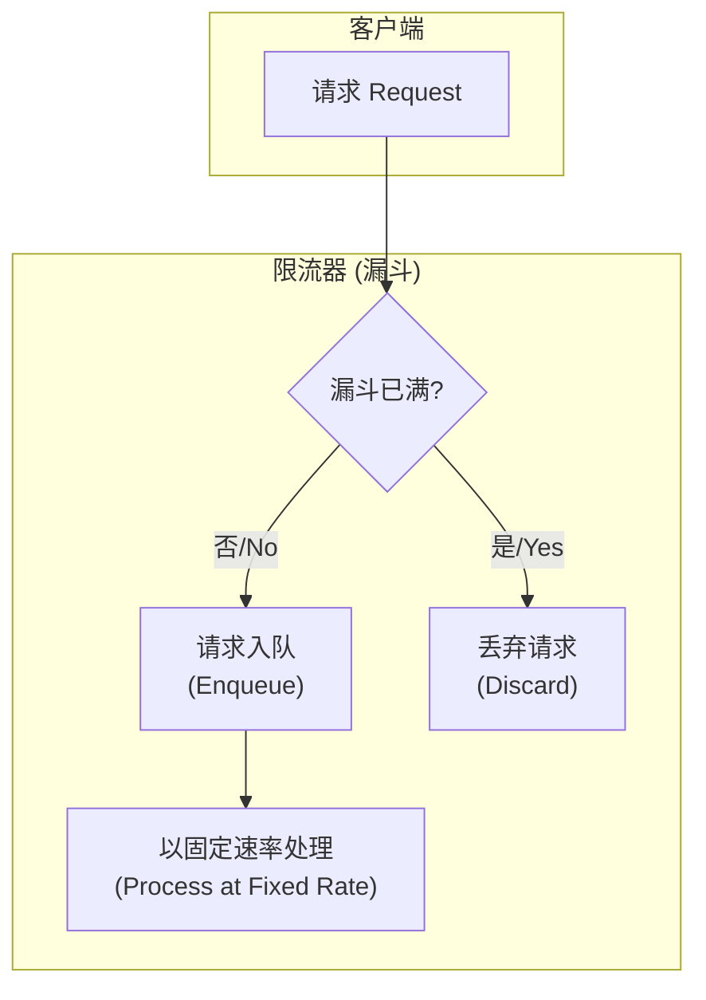

**架构师视角**：

- **优点**：具备强大的\*\*流量整形（Traffic Shaping）\*\*能力。无论上游流量如何抖动，到达下游服务的速率永远是平稳的。
- **缺点**：**吞吐量不友好，无法应对突发流量**。即使系统资源有大量空闲，也必须遵循固定的、通常是保守的处理速率，这在追求高性能的互联网场景下是致命的。所有请求都需要排队，增加了响应延迟。
- **实现模式**：通常基于\*\*消息队列（MQ）\*\*或语言内的`BlockingQueue`实现。
- **适用场景**：非常明确，即**严格保护下游、需要强制平滑流量**的场景。例如：
  - 与有严格 QPS 限制的第三方 API 对接。
  - 向 MQ 或数据库写日志/消息，需要平滑写入以避免冲击下游消费者或 DB。

#### **2. 令牌桶算法 (Token Bucket)**

**工作原理**：
系统以恒定速率向一个固定容量的桶中生成令牌（Token）。每个请求到达时，必须先获取一个令牌才能被处理。若桶中无令牌，则请求被拒绝或等待。如果桶未满，令牌会随时间累积，直至桶满。

**图解：**

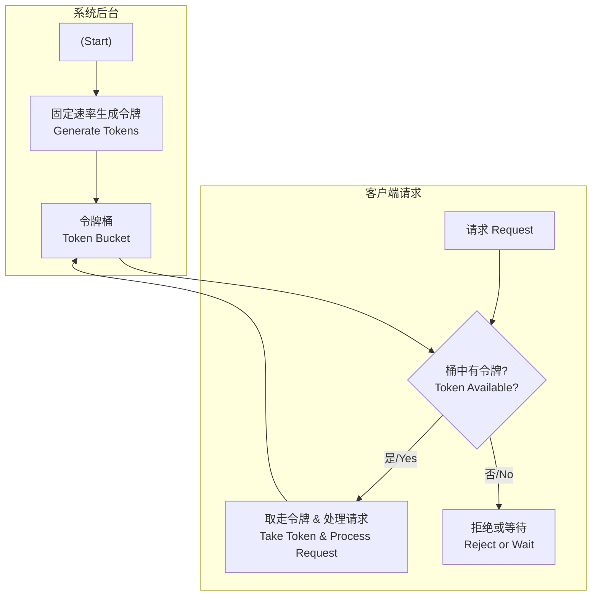

**架构师视角**：

- **优点**：**既能控制平均速率，又能有效应对突发流量**。积攒的令牌（即桶的容量）为系统提供了一个可控的“缓冲池”，允许在短时间内处理超过平均速率的请求。这是其相比漏斗算法的最大优势。
- **缺点**：允许的突发流量（桶容量配置过大时）可能会形成一个“流量尖刺”，若下游服务对此没有预期和保护，依然有被压垮的风险。
- **实现模式**：无需真实队列，仅需记录上次发令牌的时间和当前令牌数即可。**Google Guava 的`RateLimiter`是业界的标杆实现**。在 Spring Cloud 生态中，**Spring Cloud Gateway 内置的`RequestRateLimiter`过滤器默认就是基于令牌桶算法实现的（使用 Redis）**。
- **适用场景**：**应用最广泛，是绝大多数互联网应用场景的首选**。
  - API 网关的入口流量总控。
  - 保护核心服务（如商品、订单服务）或资源（如数据库、缓存）。
  - 电商秒杀、抢购等高并发场景的入口保护。

#### **3. 固定时间窗口算法 (Fixed Time Window)**

**工作原理**：
将时间划分为固定的窗口（如每秒、每分钟），在每个窗口内维护一个请求计数器。当请求到来时，若当前窗口计数未超限，则计数加一并处理请求；若超限，则拒绝。窗口切换时，计数器清零。

**图解：“临界问题”可视化**
此算法最大的缺陷在于窗口切换的临界点，可能导致实际流量翻倍。

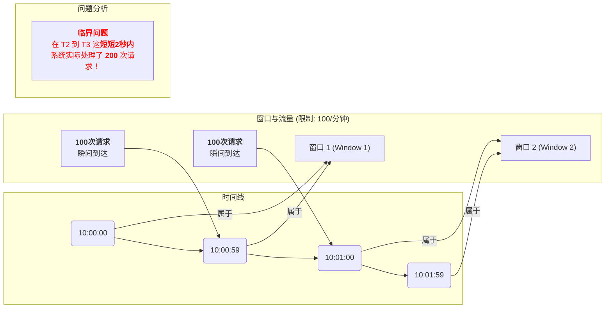

**架构师视角**：

- **优点**：实现极其简单，理解和开发成本低。
- **缺点**：存在致命的\*\*“临界问题”或“边界问题”\*\*。如上图所示，攻击者可利用窗口切换的瞬间，发送双倍于限流阈值的请求，可能导致系统瞬时过载。
- **实现模式**：通常使用**Redis 的`INCR`和`EXPIRE`命令**组合即可快速实现。
- **适用场景**：仅适用于**对限流精度要求不高、能容忍临界毛刺**的场景，或作为一种粗粒度的保护。

#### **4. 滑动时间窗口算法 (Sliding Time Window)**

**工作原理**：
它是固定窗口的改进版。它将一个大窗口（如 1 分钟）分割成多个更小的子窗口（如 6 个 10 秒的子窗口）。请求计数被记录在对应的子窗口中。统计总请求数时，会累加当前时间点前一个大窗口周期内所有子窗口的计数值。随着时间流逝，窗口会平滑地“滑动”，不断包含新的子窗口，丢弃旧的子窗口。

**图解：窗口的“滑动”**

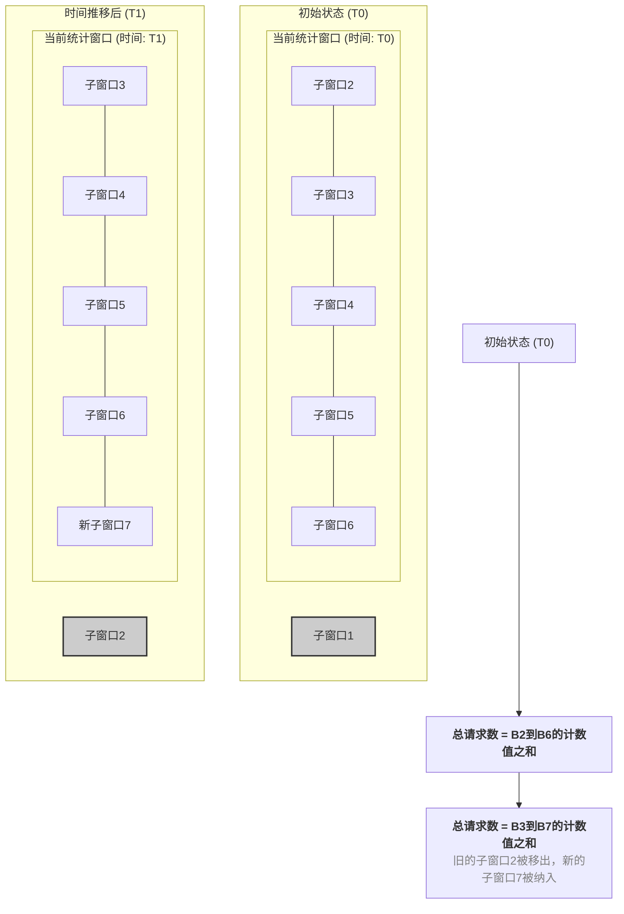

- **优点**：完美解决了固定窗口的临界问题，限流控制**非常平滑且精确**。
- **缺点**：实现相对复杂，且需要存储每个子窗口的计数值，当流量巨大且子窗口划分很细时，**存储开销会变大**。
- **实现模式**：**Redis 的`ZSET`（有序集合）是实现滑动窗口的绝佳数据结构**。通过将请求时间戳作为`score`存入`ZSET`，可以高效地完成添加新请求、移除过期请求、统计窗口内请求总数这三个核心操作。
- **适用场景**：适用于**对限流精度和稳定性要求极高**的场景。
  - 金融交易、支付、反作弊等核心业务接口。
  - 需要进行精细化、无毛刺流量控制的开放平台 API。

### **三、横向对比与架构选型建议**

| 算法           | 核心思想                           | 允许突发          | 流量平滑度           | 实现复杂度   | 关键场景               |
| :------------- | :--------------------------------- | :---------------- | :------------------- | :----------- | :--------------------- |
| **漏斗算法**   | 以固定速率流出，强制平滑           | 否                | **非常平滑**         | 简单         | 流量整形、保护下游     |
| **令牌桶算法** | 以固定速率存入令牌，有令牌即可通过 | **是**            | 平均速率可控         | 中等         | **通用，应对突发流量** |
| **固定窗口**   | 按固定时间片计数，到点清零         | 否 (但有临界风险) | 差，有临界问题       | **非常简单** | 粗粒度、要求不高的场景 |
| **滑动窗口**   | 维护一个动态滑动的时间窗口         | 否                | **平滑，无临界问题** | 复杂         | **精细化控制、高精度** |

**架构选型建议：**

- **首选令牌桶（Token Bucket）**：对于绝大多数 Web 应用和 API 网关，令牌桶是最佳选择。它在控制平均速率和应对突发之间取得了完美的平衡，是事实上的工业标准。
- **需要流量整形时选漏斗（Leaky Bucket）**：当你的目标不是承载最大吞吐量，而是以平稳的速率滋养下游脆弱的服务时，漏斗算法是唯一正确的选择。
- **对精度要求极高时选滑动窗口（Sliding Window）**：在金融、支付等不容许任何临界问题的场景，应不惜增加复杂度和存储成本，选择滑动窗口。
- **谨慎使用固定窗口（Fixed Window）**：除非是内部非核心接口或对限流精度完全不敏感的场景，否则不推荐使用。它的简单性背后是可用性的隐患。

### **四、限流的实现**

```xml
<!--resilience4j-ratelimiter-->
<dependency>
    <groupId>org.springframework.cloud</groupId>
    <artifactId>spring-cloud-starter-circuitbreaker-resilience4j</artifactId>
</dependency>
<dependency>
    <groupId>io.github.resilience4j</groupId>
    <artifactId>resilience4j-ratelimiter</artifactId>
</dependency>
```

```yml
// application.yml
resilience4j:
  ratelimiter:
    configs:
      default:
        limitForPeriod: 2 #在一次刷新周期内，允许执行的最大请求数
        limitRefreshPeriod: 1s # 限流器每隔limitRefreshPeriod刷新一次，将允许处理的最大请求数量重置为limitForPeriod
        timeout-duration: 1 # 线程等待权限的默认等待时间
```

```java
@PostMapping("/process-payment")
@Bulkhead(name = "payment-service", type = Bulkhead.Type.THREADPOOL,
        fallbackMethod = "processPaymentFallback")
@RateLimiter(name = "payment-service",fallbackMethod = "processPaymentRateLimiterFallback")
public CompletableFuture<PaymentResponse> processPaymentAsync(@RequestBody PaymentRequest request) {
    return CompletableFuture.supplyAsync(() -> {
        try {
            log.info("异步处理支付开始: {} {}", request.getOrderId(), Thread.currentThread().getName());
            PaymentResponse response = paymentFeignClient.processPayment(request);
            log.info("支付处理完成: {}", request.getOrderId());
            return response;
        } catch (Exception e) {
            log.error("支付处理异常: {}", e.getMessage(), e);
            throw new RuntimeException("支付处理失败", e);
        }
    });
}
```

```java
public CompletableFuture<PaymentResponse> processPaymentRateLimiterFallback(PaymentRequest request, Throwable ex) {
    log.warn("支付服务限流，降级处理. 订单: {}, 异常: {}",
            request.getOrderId(), ex.getMessage());

    return CompletableFuture.completedFuture(
            PaymentResponse.builder()
                    .success(false)
                    .orderId(request.getOrderId())
                    .message("支付服务繁忙，请稍后重试")
                    .errorCode("THREAD_POOL_EXHAUSTED")
                    .build()
    );
}
```

## **最佳实践与注意事项**

### **信号量舱壁适用场景**

- **轻量级操作**：CPU 密集型任务，内存查询等
- **低延迟要求**：需要快速响应的场景
- **资源占用小**：不涉及长时间 I/O 等待的操作
- **同步调用**：不需要异步处理的业务逻辑

```java
// 适合信号量舱壁的场景示例
@Bulkhead(name = "cache-service", type = Bulkhead.Type.SEConcurrentHashMapHORE)
public UserInfo getUserFromCache(String userId) {
    // 内存缓存查询，快速返回
    return cacheManager.get("user:" + userId);
}
```

### **线程池舱壁适用场景**

- **I/O 密集型操作**：数据库查询、文件操作、网络调用
- **长时间运行**：复杂计算、批处理任务
- **异步处理需求**：需要异步执行的业务逻辑
- **完全隔离**：需要严格隔离的关键服务

```java
// 适合线程池舱壁的场景示例
@Bulkhead(name = "external-api", type = Bulkhead.Type.THREADPOOL)
@TimeLimiter(name = "external-api")
public CompletableFuture<String> callExternalApi(String request) {
    return CompletableFuture.supplyAsync(() -> {
        // 调用外部API，可能耗时较长
        return externalApiClient.call(request);
    });
}
```

## **常见问题与解决方案**

### **问题 1：舱壁参数设置不当**

```
症状：频繁触发降级或系统响应缓慢
原因：maxConcurrentCalls设置过小或过大
解决方案：
1. 监控实际并发数和响应时间
2. 逐步调整参数进行压测
3. 使用公式：并发数 = QPS × 平均响应时间
```

### **问题 2：降级方法设计不当**

```
症状：降级方法执行时间过长或资源消耗过大
原因：降级方法中包含复杂逻辑或外部依赖
解决方案：
1. 降级方法应快速返回
2. 避免在降级方法中调用其他远程服务
3. 使用本地缓存或静态数据
4. 设计多级降级策略
```

### **问题 3：线程池配置不合理**

```
症状：线程池队列满载或线程创建过多
原因：线程池大小和队列容量配置不当
解决方案：
1. I/O密集型：线程数 = CPU核心数 × (1 + 等待时间/计算时间)
2. CPU密集型：线程数 = CPU核心数 + 1
3. 队列容量设为线程池大小的5-10倍
4. 合理设置keepAliveDuration避免频繁创建销毁
```

### **问题 4：监控告警配置缺失**

```
症状：系统问题无法及时发现
原因：缺少关键指标监控和告警
解决方案：
1. 配置舱壁使用率告警（>80%）
2. 监控降级触发频率（>5%）
3. 设置响应时间告警
4. 建立舱壁状态仪表板
```

### **问题 5：项目如果不触发降级**

缺少依赖

```xml
<dependency>
    <groupId>io.github.resilience4j</groupId>
    <artifactId>resilience4j-bulkhead</artifactId>
</dependency>
<dependency>
    <groupId>io.github.resilience4j</groupId>
    <artifactId>resilience4j-ratelimiter</artifactId>
</dependency>
```
```

## 来源 5: Fuwari / `springcloud/CircuitBreakerPatterns​​.md`

- 原始 URL: <https://github.com/DavidHLP/Fuwari/blob/07cee2baf9cee227807dcd68004c5f2493e5ac52/src/content/posts/springcloud/CircuitBreakerPatterns​​.md>
- 本地路径: `springcloud/CircuitBreakerPatterns​​.md`

```markdown
---
title: CircuitBreaker的原理解析与Resilience4j实现
published: 2025-07-13
tags: [SpringCloud, Resilience4j]
category: SpringCloud
description: 全面解析CircuitBreaker熔断器模式原理，包括其如何通过CLOSED、OPEN、HALF_OPEN三种状态转换防止雪崩效应，并结合Resilience4j框架在SpringCloud微服务中的实现细节与测试案例
draft: false
---

## **一、 问题背景：为何需要熔断器？**

在现代分布式系统，特别是微服务架构中，服务之间相互依赖、相互调用是常态。一个用户请求的背后，可能是一条由多个微服务构成的复杂调用链。这种设计在提升系统灵活性和可扩展性的同时，也引入了新的风险——**级联故障（Cascading Failures）**，通常被称为“雪崩效应”。

### **雪崩效应的根源**

想象一个典型的“扇出”调用场景：微服务 A 依赖于微服务 B 和 C，而 B 和 C 又各自依赖于其他服务。

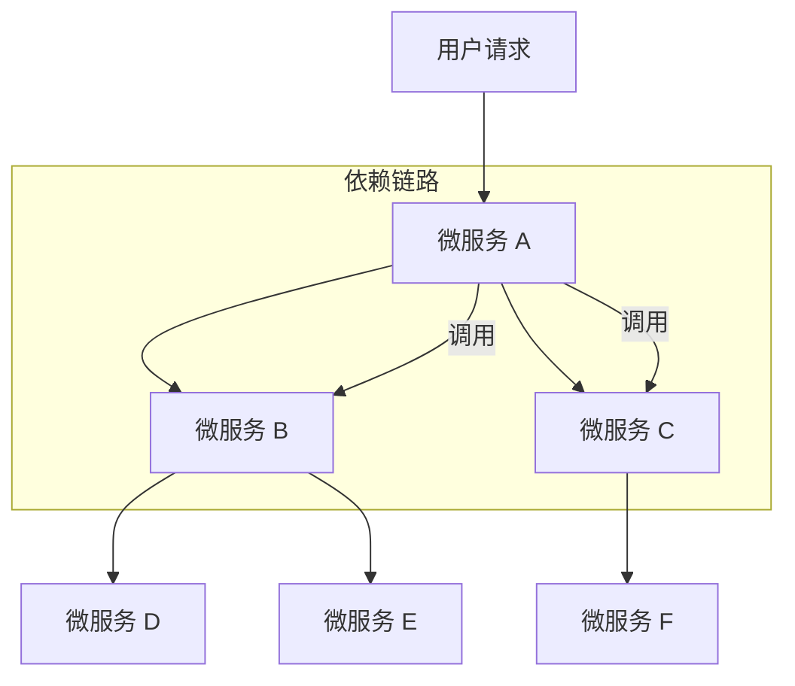

如果链路末端的某个服务（如 `SVC_D`）因为高负载、程序 Bug 或网络问题，出现响应缓慢或无响应，那么对它的调用请求就会开始堆积。调用方 `SVC_B` 的线程池、连接池等资源将被这些等待的请求迅速占满。很快，`SVC_B` 自身也会变得不稳定，无法响应来自 `SVC_A` 的请求。

这个故障会像雪球一样，沿着调用链逆向传递，最终导致入口处的 `SVC_A` 也因资源耗尽而崩溃。此时，整个系统对外表现为大面积瘫痪，这就是毁灭性的**雪崩效应**。

在高流量场景下，单个节点的微小延迟都可能被放大，并迅速传导至整个系统，造成灾难性后果。因此，我们必须实现一种**快速失败（Fail-Fast）和故障隔离**的机制，确保单个依赖的故障不会拖垮整个系统。**Circuit Breaker（熔断器）模式**正是为此而生。

## **二、 核心原理：熔断器模式详解**

Circuit Breaker 的设计灵感来源于现实世界中的电路保险丝。它在服务调用方和服务提供方之间引入了一个代理层，通过监控调用的成功与失败，动态地改变自身状态，从而实现对下游服务的保护和自动恢复。

其核心是一个有限状态机，包含三个主要状态：

1.  **`CLOSED` (闭合状态)**：

    - **行为**：这是熔断器的默认和正常状态。所有请求都会直接穿过熔断器，到达下游服务。
    - **逻辑**：在此状态下，熔断器会持续计算近期请求的失败率。如果失败率低于预设的阈值，它将保持`CLOSED`状态。
    - **状态转换**：当失败率在指定的时间窗口内（或指定请求次数内）超过阈值时，熔断器会从`CLOSED`切换到`OPEN`状态。

2.  **`OPEN` (断开状态)**：

    - **行为**：熔断器已“跳闸”。所有进入该熔断器的请求都会立即失败，直接返回一个错误响应（如执行降级逻辑），而不会去调用下游服务。
    - **逻辑**：这是一种保护机制，通过阻止流量涌向下游已经出问题的服务，给予其恢复的时间，同时也避免了调用方因无谓的等待而耗尽资源。
    - **状态转换**：在`OPEN`状态下停留一段预设的时间（`waitDurationInOpenState`）后，熔断器会自动切换到`HALF_OPEN`状态，尝试进行恢复探测。

3.  **`HALF_OPEN` (半开状态)**：

    - **行为**：熔断器会允许一小部分“探针”请求通过，去调用下游服务。
    - **逻辑**：这是从故障中恢复的试探阶段。熔断器会根据这些探针请求的结果来判断下游服务是否已经恢复。
    - **状态转换**：
      - **如果探针请求的失败率仍然高于阈值**，说明下游服务尚未恢复。熔断器会立刻切换回`OPEN`状态，重新开始等待计时。
      - **如果探针请求的成功率达到标准**，说明下游服务已恢复。熔断器则会切换到`CLOSED`状态，恢复正常链路。

此外，还有两个用于管理和干预的特殊状态：

- **`DISABLED` (禁用状态)**：熔断器功能被完全关闭，所有请求都将通过。
- **`FORCED_OPEN` (强制开启状态)**：手动将熔断器置于`OPEN`状态，拒绝所有请求。常用于计划内维护或紧急故障处理。

### **状态转换流程图**

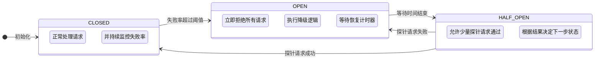

## **三、 实战：基于 Resilience4j 的熔断实现**

Hystrix 进入维护模式后，**Resilience4j** 已成为 Java 生态中熔断、限流等弹性能力实现的首选。它是一个轻量级、函数式的容错库，无外部依赖，与 Spring Cloud 生态无缝集成。

### **1. 引入依赖**

```xml
<!--resilience4j-circuitbreaker-->
<dependency>
    <groupId>org.springframework.cloud</groupId>
    <artifactId>spring-cloud-starter-circuitbreaker-resilience4j</artifactId>
</dependency>
<!-- 由于断路保护等需要AOP实现，所以必须导入AOP包 -->
<dependency>
    <groupId>org.springframework.boot</groupId>
    <artifactId>spring-boot-starter-aop</artifactId>
</dependency>
```

### **1. 核心配置 (application.yml)**

我们将熔断相关的配置集中在`application.yml`或其环境特定文件中。

```yaml
# application.yml
resilience4j:
  circuitbreaker:
    configs:
      # 定义一个可复用的默认配置模板
      default:
        failureRateThreshold: 60 # 失败率阈值(%)。当失败率达到60%时，熔断器将打开
        slidingWindowType: TIME_BASED # 滑动窗口类型。推荐使用基于时间的窗口
        slidingWindowSize: 10 # 滑动窗口大小。统计最近10秒内的调用情况
        minimumNumberOfCalls: 5 # 最小调用次数。至少需要5次调用才开始计算失败率
        automaticTransitionFromOpenToHalfOpenEnabled: true # 自动从OPEN转换到HALF_OPEN
        waitDurationInOpenState: 10s # 在OPEN状态下等待10秒后，转换为HALF_OPEN
        permittedNumberOfCallsInHalfOpenState: 3 # 在HALF_OPEN状态下，允许3个探针请求
        slowCallRateThreshold: 80 # 慢调用率阈值(%)
        slowCallDurationThreshold: 2s # 超过2秒的调用被视为慢调用
        recordExceptions: # 将哪些异常记录为失败
          - java.lang.Exception
          - java.util.concurrent.TimeoutException
          - feign.FeignException
        ignoreExceptions: # 忽略哪些异常（不计入失败统计）
          - java.lang.IllegalArgumentException
    instances:
      # 支付服务熔断器配置
      payment-service:
        baseConfig: default
        failureRateThreshold: 50 # 支付服务要求更严格，50%失败率就熔断
        minimumNumberOfCalls: 10 # 支付服务调用频率高，需要更多样本
      # 用户服务熔断器配置
      user-service:
        baseConfig: default
        slowCallDurationThreshold: 1s # 用户查询要求更快响应
      # 通知服务熔断器配置（容错性更高）
      notification-service:
        baseConfig: default
        failureRateThreshold: 80 # 通知服务允许更高的失败率
        waitDurationInOpenState: 30s # 通知服务恢复时间更长
```

**关键配置参数解析:**

| 参数                                    | 解释                                                                                           |
| --------------------------------------- | ---------------------------------------------------------------------------------------------- |
| `failureRateThreshold`                  | **失败率阈值**：触发熔断的核心条件。                                                           |
| `slidingWindowType`                     | **滑动窗口类型**：`COUNT_BASED`（基于次数）或 `TIME_BASED`（基于时间）。                       |
| `slidingWindowSize`                     | **滑动窗口大小**：在`CLOSED`状态下，统计失败率的样本范围（次数或秒数）。                       |
| `minimumNumberOfCalls`                  | **最小调用次数**：防止因偶然的少量失败就触发熔断。只有当调用次数达到该值后，才开始计算失败率。 |
| `waitDurationInOpenState`               | **开启状态持续时间**：熔断器在`OPEN`状态下停留的时间，之后会自动转为`HALF_OPEN`。              |
| `permittedNumberOfCallsInHalfOpenState` | **半开状态探测次数**：在`HALF_OPEN`状态下，允许多少个请求去探测下游服务是否恢复。              |
| `recordExceptions`                      | **记录为失败的异常**：定义哪些异常发生时，应被计为一次“失败”调用。                             |

### **2. 服务提供方 (Producer)**

为了模拟真实的业务场景，我们在支付服务中创建多个端点来测试不同的故障情况。

```java
// PaymentController.java
@RestController
@RequestMapping("/api/payment")
@Slf4j
public class PaymentController {

    @Autowired
    private PaymentService paymentService;

    /**
     * 处理支付请求 - 核心业务接口
     */
    @PostMapping("/process")
    public PaymentResponse processPayment(@RequestBody PaymentRequest request) {
        log.info("处理支付请求: {}", request.getOrderId());

        // 模拟不同的业务场景
        if (request.getAmount().compareTo(BigDecimal.ZERO) <= 0) {
            throw new IllegalArgumentException("支付金额必须大于0");
        }

        // 模拟支付处理时间和可能的失败
        if (request.getOrderId().contains("timeout")) {
            // 模拟超时场景
            try {
                Thread.sleep(3000); // 3秒超时
            } catch (InterruptedException e) {
                Thread.currentThread().interrupt();
            }
        }

        if (request.getOrderId().contains("fail")) {
            // 模拟支付失败
            throw new PaymentException("支付处理失败，请稍后重试");
        }

        // 正常支付处理
        return paymentService.processPayment(request);
    }

    /**
     * 查询支付状态 - 查询类接口
     */
    @GetMapping("/status/{orderId}")
    public PaymentStatus getPaymentStatus(@PathVariable String orderId) {
        log.info("查询支付状态: {}", orderId);

        // 模拟查询延迟
        if (orderId.contains("slow")) {
            try {
                Thread.sleep(1500); // 1.5秒延迟
            } catch (InterruptedException e) {
                Thread.currentThread().interrupt();
            }
        }

        return paymentService.getPaymentStatus(orderId);
    }

    /**
     * 健康检查端点
     */
    @GetMapping("/health")
    public Map<String, String> healthCheck() {
        Map<String, String> status = new HashMap<>();
        status.put("status", "UP");
        status.put("timestamp", LocalDateTime.now().toString());
        return status;
    }
}
```

```java
// PaymentException.java
// 自定义异常类
@ResponseStatus(HttpStatus.INTERNAL_SERVER_ERROR)
public class PaymentException extends RuntimeException {
    public PaymentException(String message) {
        super(message);
    }
}
```

### **3. 服务调用方 (Consumer)**

在订单服务中，我们通过 Feign 客户端调用支付服务，并使用`@CircuitBreaker`注解实现熔断保护。

**Feign 接口定义:**

```java
// PaymentFeignClient.java
@FeignClient(
    name = "payment-service",
    path = "/api/payment",
    configuration = PaymentFeignConfig.class
)
public interface PaymentFeignClient {

    @PostMapping("/process")
    PaymentResponse processPayment(@RequestBody PaymentRequest request);

    @GetMapping("/status/{orderId}")
    PaymentStatus getPaymentStatus(@PathVariable("orderId") String orderId);

    @GetMapping("/health")
    Map<String, String> healthCheck();
}
```

```java
// PaymentFeignConfig.java
// Feign 配置类
@Configuration
public class PaymentFeignConfig {

    @Bean
    public Request.Options requestOptions() {
        // 连接超时1秒，读取超时2秒
        return new Request.Options(1000, 2000);
    }

    @Bean
    public Logger.Level feignLoggerLevel() {
        return Logger.Level.BASIC;
    }
}
```

**订单服务 Controller 层:**

```java
// OrderController.java
@RestController
@RequestMapping("/api/order")
@Slf4j
public class OrderController {

    @Autowired
    private PaymentFeignClient paymentFeignClient;

    @Autowired
    private OrderService orderService;

    /**
     * 创建订单并处理支付
     */
    @PostMapping("/create")
    @CircuitBreaker(name = "payment-service", fallbackMethod = "createOrderFallback")
    public OrderResponse createOrder(@RequestBody OrderRequest request) {
        log.info("创建订单: {}", request.getOrderId());

        try {
            // 1. 创建订单
            Order order = orderService.createOrder(request);

            // 2. 调用支付服务
            PaymentRequest paymentRequest = PaymentRequest.builder()
                .orderId(order.getOrderId())
                .amount(order.getTotalAmount())
                .userId(order.getUserId())
                .build();

            PaymentResponse paymentResponse = paymentFeignClient.processPayment(paymentRequest);

            // 3. 更新订单状态
            if (paymentResponse.isSuccess()) {
                orderService.updateOrderStatus(order.getOrderId(), OrderStatus.PAID);
                return OrderResponse.success(order, "订单创建并支付成功");
            } else {
                orderService.updateOrderStatus(order.getOrderId(), OrderStatus.PAYMENT_FAILED);
                return OrderResponse.failed(order, "支付失败: " + paymentResponse.getMessage());
            }

        } catch (Exception e) {
            log.error("创建订单异常: {}", e.getMessage(), e);
            throw e; // 让熔断器捕获异常
        }
    }

    /**
     * 查询订单支付状态
     */
    @GetMapping("/{orderId}/payment-status")
    @CircuitBreaker(name = "payment-service", fallbackMethod = "getPaymentStatusFallback")
    public PaymentStatusResponse getOrderPaymentStatus(@PathVariable String orderId) {
        log.info("查询订单支付状态: {}", orderId);

        PaymentStatus status = paymentFeignClient.getPaymentStatus(orderId);
        return PaymentStatusResponse.builder()
            .orderId(orderId)
            .status(status)
            .queryTime(LocalDateTime.now())
            .build();
    }

    // ================== 降级方法 (Fallback Methods) ==================

    /**
     * 创建订单的降级方法
     */
    public OrderResponse createOrderFallback(OrderRequest request, Exception ex) {
        log.warn("支付服务不可用，订单创建降级处理. 订单ID: {}, 异常: {}",
                request.getOrderId(), ex.getMessage());

        // 创建订单但标记为待支付状态
        Order order = orderService.createOrder(request);
        orderService.updateOrderStatus(order.getOrderId(), OrderStatus.PENDING_PAYMENT);

        return OrderResponse.builder()
            .success(true)
            .order(order)
            .message("订单创建成功，支付服务暂时不可用，请稍后完成支付")
            .needRetryPayment(true)
            .build();
    }

    /**
     * 支付状态查询的降级方法
     */
    public PaymentStatusResponse getPaymentStatusFallback(String orderId, Exception ex) {
        log.warn("支付服务不可用，无法查询支付状态. 订单ID: {}, 异常: {}",
                orderId, ex.getMessage());

        return PaymentStatusResponse.builder()
            .orderId(orderId)
            .status(PaymentStatus.UNKNOWN)
            .message("支付服务暂时不可用，请稍后查询")
            .queryTime(LocalDateTime.now())
            .available(false)
            .build();
    }
}
```

## **四、 熔断测试与状态验证**

现在，我们通过模拟真实的业务场景来观察熔断器的状态转换。

**测试场景:** 根据我们的配置 (`slidingWindowSize: 10s`, `failureRateThreshold: 60%`, `minimumNumberOfCalls: 5`)，在 10 秒窗口内，至少需要 5 次调用，且失败率超过 60%时，熔断器会开启。

### **测试步骤详解**

**Step 1: 正常业务调用 (状态: `CLOSED`)**

模拟正常的订单创建和支付流程：

```bash
# 创建正常订单
curl -X POST http://localhost:8080/api/order/create \
  -H "Content-Type: application/json" \
  -d '{
    "orderId": "ORDER_20250713_001",
    "userId": "user_123",
    "items": [{"productId": "PROD_001", "quantity": 2, "price": 99.99}],
    "totalAmount": 199.98
  }'

# 查询支付状态
curl http://localhost:8080/api/order/ORDER_20250713_001/payment-status
```

- **结果**：所有请求正常返回，订单创建成功，支付处理完成
- **熔断器状态**：`CLOSED`
- **日志输出**：显示正常的业务处理流程

**Step 2: 触发故障场景 (状态: `CLOSED` → `OPEN`)**

模拟支付服务出现故障：

```bash
# 连续创建包含 "fail" 标识的订单（模拟支付失败）
for i in {1..4}; do
  curl -X POST http://localhost:8080/api/order/create \
    -H "Content-Type: application/json" \
    -d '{
      "orderId": "ORDER_fail_'$i'",
      "userId": "user_456",
      "items": [{"productId": "PROD_002", "quantity": 1, "price": 50.00}],
      "totalAmount": 50.00
    }'
  sleep 1
done

# 第5次调用，触发熔断
curl -X POST http://localhost:8080/api/order/create \
  -H "Content-Type: application/json" \
  -d '{
    "orderId": "ORDER_fail_5",
    "userId": "user_789",
    "items": [{"productId": "PROD_003", "quantity": 1, "price": 75.00}],
    "totalAmount": 75.00
  }'
```

- **前 4 次调用结果**：支付服务返回异常，但订单仍然创建，状态为支付失败
- **第 5 次调用及后续**：熔断器开启，直接执行降级逻辑
- **熔断器状态**：从 `CLOSED` 切换到 `OPEN`
- **降级响应**：
  ```json
  {
    "success": true,
    "order": {...},
    "message": "订单创建成功，支付服务暂时不可用，请稍后完成支付",
    "needRetryPayment": true
  }
  ```

**Step 3: 熔断期间的表现 (状态: `OPEN`)**

在熔断器开启后的 10 秒内，继续发送请求：

```bash
# 尝试创建正常订单
curl -X POST http://localhost:8080/api/order/create \
  -H "Content-Type: application/json" \
  -d '{
    "orderId": "ORDER_normal_after_break",
    "userId": "user_111",
    "items": [{"productId": "PROD_001", "quantity": 1, "price": 99.99}],
    "totalAmount": 99.99
  }'

# 尝试查询支付状态
curl http://localhost:8080/api/order/ORDER_20250713_001/payment-status
```

- **结果**：所有请求都不会调用支付服务，直接返回降级响应
- **响应时间**：毫秒级返回，实现快速失败
- **熔断器状态**：`OPEN`
- **业务影响**：订单仍能创建，但支付状态查询返回"服务不可用"
- **熔断器状态**：`CLOSED`。

**Step 2: 触发熔断 (状态: `CLOSED` -\> `OPEN`)**

- 连续 3 次或以上访问 `http://localhost:9988/feign/pay/circuit/-1`。
- **结果**：
  - 前几次请求，你会看到服务端的 `RuntimeException` 错误栈（如果全局异常处理器没有捕获）。
  - 当失败次数达到阈值（本例中为 3 次失败 / 6 次总调用），熔断器“跳闸”。
  - 此时再次访问，无论是 `.../circuit/-1` 还是正常的 `.../circuit/1`，都会**立即**返回降级信息：`"myCircuitFallback: 系统繁忙..."`。
- **熔断器状态**：从 `CLOSED` 切换到 `OPEN`。

**Step 3: 熔断期间 (状态: `OPEN`)**

- 在熔断器开启后的 5 秒内，持续访问 `http://localhost:9988/feign/pay/circuit/1`。
- **结果**：每次调用都**不会**请求下游服务，而是毫秒级地返回降级响应。这完美地实现了故障隔离和快速失败。
- **熔断器状态**：`OPEN`。

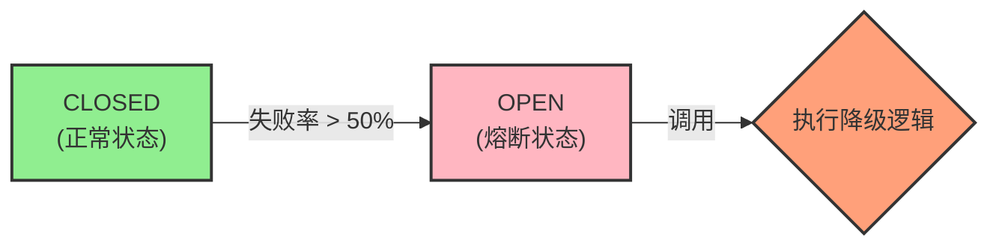

**Step 4: 自动恢复探测 (状态: `OPEN` → `HALF_OPEN`)**

等待 `waitDurationInOpenState`（配置的 10 秒）后：

- **自动转换**：熔断器自动进入 `HALF_OPEN` 状态
- **日志输出**：`CircuitBreaker 'payment-service' changed state from OPEN to HALF_OPEN`
- **准备探测**：允许少量请求通过进行健康探测

**Step 5: 服务恢复验证 (状态: `HALF_OPEN` → `CLOSED` 或 `OPEN`)**

在 `HALF_OPEN` 状态下，有 3 次探针机会（`permittedNumberOfCallsInHalfOpenState: 3`）：

**场景一：服务已恢复**

```bash
# 发送正常订单创建请求
curl -X POST http://localhost:8080/api/order/create \
  -H "Content-Type: application/json" \
  -d '{
    "orderId": "ORDER_recovery_test",
    "userId": "user_recovery",
    "items": [{"productId": "PROD_001", "quantity": 1, "price": 99.99}],
    "totalAmount": 99.99
  }'
```

- **结果**：请求被放行，支付服务正常响应，订单创建和支付成功
- **熔断器状态**：立即从 `HALF_OPEN` 切换回 `CLOSED`
- **后续请求**：恢复正常处理

**场景二：服务仍有问题**

```bash
# 发送会导致支付失败的请求
curl -X POST http://localhost:8080/api/order/create \
  -H "Content-Type: application/json" \
  -d '{
    "orderId": "ORDER_still_fail",
    "userId": "user_fail",
    "items": [{"productId": "PROD_001", "quantity": 1, "price": 99.99}],
    "totalAmount": 99.99
  }'
```

- **结果**：探针请求失败，支付服务仍然有问题
- **熔断器状态**：立即从 `HALF_OPEN` 切换回 `OPEN`
- **等待周期**：重新开始 10 秒的等待计时

### **监控和观察**

**应用日志观察：**

```log
2025-07-13 10:15:23.456 INFO  OrderController - 创建订单: ORDER_20250713_001
2025-07-13 10:15:23.789 INFO  OrderController - 订单创建并支付成功
2025-07-13 10:16:45.123 WARN  OrderController - 支付服务不可用，订单创建降级处理
2025-07-13 10:16:45.124 INFO  CircuitBreakerEventConsumer - CircuitBreaker 'payment-service' changed state from CLOSED to OPEN
```

**Actuator 端点监控：**

```bash
# 查看熔断器状态
curl http://localhost:8080/actuator/circuitbreakers

# 查看详细指标
curl http://localhost:8080/actuator/circuitbreakerevents
```

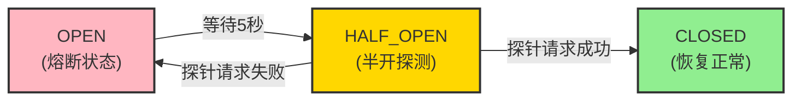

### **五、 滑动窗口策略**

在微服务架构中，熔断器是保障服务韧性的核心组件。它通过监控对下游服务的调用情况，在服务出现故障时快速失败（Fail-Fast），防止故障的连锁扩散。而这一切决策的核心依据，便是滑动窗口策略。滑动窗口负责收集和统计最近一段时间的请求数据，为熔断器的状态转换（CLOSED, OPEN, HALF-OPEN）提供决策依据。

熔断器的实现可以基于不同的滑动窗口策略，主要有以下两种：

- **COUNT-BASED (基于计数的滑动窗口)**：通过统计最近 N 次请求的成功和失败次数来判断是否触发熔断。
- **TIME-BASED (基于时间的滑动窗口)**：通过设定一个时间窗口，在窗口时间内统计请求的成功和失败情况。

下面，我们来深入剖析这两种策略的内部机制、优缺点以及在现代框架中的应用。

### **1. COUNT-BASED (基于计数的滑动窗口)**

这是最简单直观的一种实现方式。

#### **工作机制**

它在内存中维护一个固定大小的“环形数组”（Ring Buffer）或队列，长度为 N。每当一个新的请求发生（无论成功、失败或超时），它都会被记录下来并放入这个数组。如果数组已满，最老的一条记录将被挤出。

熔断器的决策逻辑（例如，计算失败率）始终基于这最近的 N 次请求。

为了更直观地展示这个过程，可以参考下面的序列图：

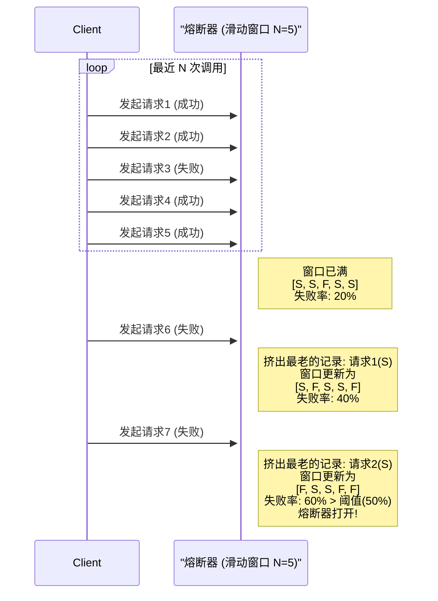

#### **举例说明：**

假设我们配置 `sliding-window-type: count` 并且 `sliding-window-size: 100`。
这意味着熔断器会持续监控最近的 100 次调用。当第 101 次调用发生时，它会替换掉第 1 次调用的记录。熔断决策（如失败率是否超过 50%）将基于这 100 个样本进行计算。

#### **优点**

- **实现简单**：逻辑清晰，内存占用固定且可预测。
- **资源消耗低**：不需要额外的时间线程来管理窗口的滑动。

#### **缺点**

- **无法应对流量毛刺（Bursty Traffic）问题**：这是其最致命的缺陷。如果一个服务在很长一段时间内没有被调用，窗口中可能充满了很久以前的“成功”记录。此时，即使连续出现几次失败的调用，也可能因为被大量旧的成功记录“稀释”，导致失败率无法达到阈值，熔断器不会及时打开。
- **时间敏感性差**：它只关心“次数”，不关心这些次数发生在多长的时间内。例如，1 分钟内发生 100 次调用和 1 天内发生 100 次调用，对于 COUNT-BASED 窗口来说是等价的，但这在现实场景中显然代表了完全不同的负载情况。

#### **适用场景**

由于其明显的缺点，纯粹的 COUNT-BASED 滑动窗口在现代复杂的微服务环境中已非常罕见。它可能仅适用于那些调用频率非常稳定、可预测且对时间不敏感的特殊场景。

### **2. TIME-BASED (基于时间的滑动窗口)**

这是目前业界主流且推荐的策略，被 Resilience4j 等现代熔断器库作为默认实现。

#### **工作机制**

TIME-BASED 窗口不再关注固定数量的请求，而是关注一个固定的时间周期（例如，最近的 60 秒）。为了平滑地滑动并高效计算，它通常会把整个时间窗口分割成多个更小的“桶”（Bucket）。

下面的甘特图清晰地展示了分桶和窗口滑动的机制：

```mermaid
flowchart TD
    subgraph "时间窗口示例 (60秒窗口, 6个桶)"
        A["Bucket1 (0-10s)"] --> B["Bucket2 (10-20s)"]
        B --> C["Bucket3 (20-30s)"]
        C --> D["Bucket4 (30-40s)"]
        D --> E["Bucket5 (40-50s)"]
        E --> F["Bucket6 (50-60s)"]
    end

    subgraph "窗口滑动过程"
        G["T=61s: Bucket1过期"] --> H["创建Bucket7 (60-70s)"]
        H --> I["新窗口: Bucket2-7"]
    end

    subgraph "数据聚合"
        J["聚合所有活动桶的数据"]
        J --> K["计算失败率和慢调用率"]
    end

    style A fill:#87CEEB,stroke:#333,stroke-width:2px
    style F fill:#FFB6C1,stroke:#333,stroke-width:2px
    style H fill:#90EE90,stroke:#333,stroke-width:2px
```

#### **举例说明（Resilience4j 的实现方式）：**

假设我们配置 `sliding-window-type: time`，`sliding-window-size: 60` (秒)，并且内部默认或配置了 10 个桶。

- **分桶 (Bucketing)**：整个 60 秒的时间窗口被划分为 10 个桶，每个桶负责记录 6 秒内的调用数据（成功数、失败数、慢调用数等）。
- **数据记录**：当请求发生时，其结果会被记录在当前时间所在的桶内。例如，在第 13 秒发生的调用，其结果会记录在第 3 个桶里（12s-18s）。
- **窗口滑动**：时间是向前流逝的。当第 61 秒到来时，第一个桶（0s-6s）的数据就会过期，被丢弃。同时一个新的桶被创建出来，用于记录 60s-66s 的数据。这样，整个窗口就向前“滑动”了。
- **指标聚合**：在任何时刻，熔断器需要决策时，它会聚合当前所有有效桶（在此例中是 10 个桶）的数据，计算出在整个时间窗口（60 秒）内的总请求数、失败率、慢调用率等核心指标。

#### **优点**

- **时间敏感，更符合直觉**：它统计的是“最近一段时间内”的系统健康状况，完美解决了 COUNT-BASED 的流量毛刺问题。无论流量如何波动，它始终能反映出最近一个时间周期内的真实表现。
- **数据更平滑**：通过分桶机制，避免了在窗口边界发生数据突变的问题，统计结果更加平滑和准确。
- **灵活性高**：可以配置窗口大小和桶的数量，以适应不同服务的特性。

#### **缺点**

- **实现相对复杂**：需要管理桶的创建、过期和数据聚合。
- **内存占用稍高**：需要为多个桶分配内存来存储统计数据。但在大多数应用中，这点开销是完全可以接受的，并且对于保障系统稳定性来说是值得的。

### **总结与最佳实践：现代熔断器的混合模型**

在 Spring Cloud 生态中，我们现在主要使用 Resilience4j。值得注意的是，Resilience4j 的配置虽然区分了 `time-based` 和 `count-based`，但其决策过程通常是一个混合模型。

**即便是选择了 time-based 窗口，我们依然会配置一个基于计数的阈值，这才是最完善的实践。**

来看一个典型的 Resilience4j 配置：

```yaml
resilience4j:
  circuitbreaker:
    instances:
      myApiService:
        # 1. 选择基于时间的滑动窗口
        sliding-window-type: time-based
        # 2. 设置时间窗口大小为60秒
        sliding-window-size: 60
        # 3. 核心！设置窗口内触发计算的最小调用次数
        minimum-number-of-calls: 20
        # 4. 设置失败率阈值
        failure-rate-threshold: 50
        # 5. 设置慢调用率阈值
        slow-call-rate-threshold: 80
        # 6. 定义慢调用的耗时
        slow-call-duration-threshold: 5000 # 5秒
```

#### **解读这段配置：**

熔断器首先采用一个 60 秒的时间窗口来收集数据 (`time-based`)。

但是，它并不会在只有一两次调用的情况下就草率地计算失败率。`minimum-number-of-calls: 20` 这个计数阈值规定了：**只有当 60 秒窗口内的总调用次数达到 20 次时**，熔断器才会开始计算失败率。

一旦调用次数超过 20 次，熔断器就会检查失败率是否超过了 50%。如果超过，则熔断器打开。

这种 **“时间窗口 + 最小请求数阈值”** 的混合模型，其决策流程可以可视化为：

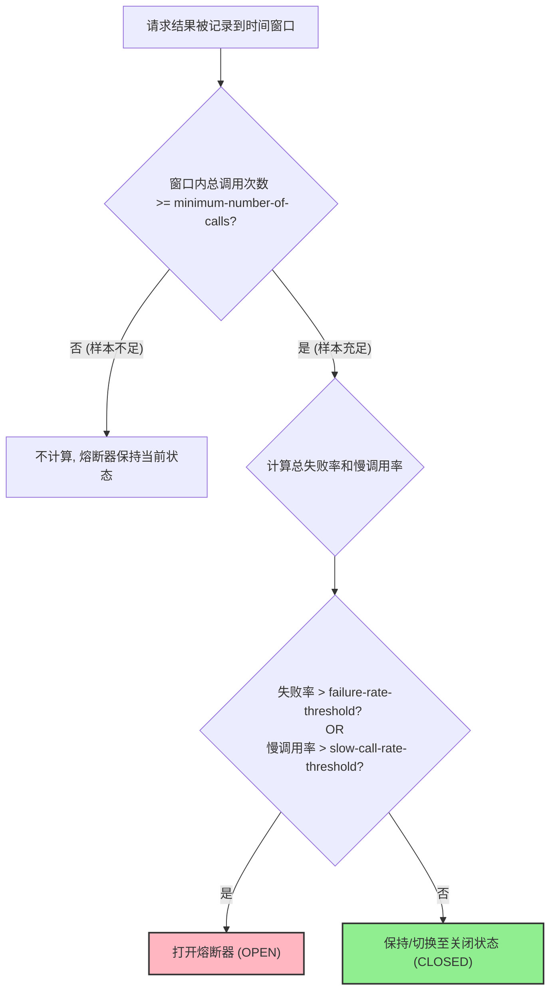

该模型结合了两者的优点：

- **确保了统计的及时性（基于时间）**。
- **避免了因样本量过小而导致的误判（基于计数）**。例如，如果窗口内只有 2 次调用，其中 1 次失败，失败率高达 50%，但这种情况下熔断显然是不合理的。

1.  **首选并默认使用 `TIME-BASED` 滑动窗口**，因为它能更准确地反映服务在“最近”一段时间的健康状况。
2.  **务必配置 `minimum-number-of-calls`**，为熔断决策提供一个有统计意义的最小样本量，防止在低流量时发生误判。
3.  根据服务的 QPS、重要性和网络状况，仔细调优 `sliding-window-size`, `failure-rate-threshold` 和 `slow-call-rate-threshold` 等参数，以达到最佳的保护效果。
4.  纯粹的 `COUNT-BASED` 策略在理论上存在，但在追求高可用的现代分布式系统中，已经基本被功能更强大、表现更稳健的 **TIME-BASED 混合模型**所取代。
```

## 来源 6: Fuwari / `springcloud/ConsulServiceRegistrationandDiscovery.md`

- 原始 URL: <https://github.com/DavidHLP/Fuwari/blob/07cee2baf9cee227807dcd68004c5f2493e5ac52/src/content/posts/springcloud/ConsulServiceRegistrationandDiscovery.md>
- 本地路径: `springcloud/ConsulServiceRegistrationandDiscovery.md`

```markdown
---
title: Spring Cloud Consul 服务注册与发现深度实践指南
published: 2025-07-13
tags: [Spring Cloud, Consul, 微服务, 服务注册, 服务发现, 分布式配置]
category: Spring Cloud
description: 深入探讨 Spring Cloud 与 Consul 集成实现微服务注册发现、负载均衡、分布式配置管理，以及生产环境高可用集群部署的完整实践指南
draft: false
image: ./images/Gemini_Generated_Image_goodjvgoodjvgood.png
---

在现代微服务架构中，服务间的通信是构建系统的核心。传统地，我们可能会在配置文件中硬编码依赖服务的 IP 地址和端口号。这种看似简单的方式，在动态和复杂的微服务环境中会迅速演变成一场噩梦，主要体现在以下几个方面：

1.  **脆弱性与变更困难**：一旦某个服务的实例地址或端口发生变动（例如因故障重启、迁移或扩缩容），所有依赖它的服务都必须手动修改配置并重新部署，这在快速迭代的环境中是不可接受的。
2.  **缺乏弹性与负载均衡**：当一个服务为了提升处理能力而部署多个实例时，硬编码的方式无法实现请求的动态分发和负载均衡，导致资源利用率低下，也无法通过增加实例来水平扩展。
3.  **运维复杂度激增**：在拥有数十甚至上百个微服务的系统中，手动管理这张静态的服务依赖网络，其复杂度和出错率会随着系统的增长而呈指数级上升。

为了应对这些挑战，引入一套完善的服务治理机制至关重要。以 **Spring Cloud** 为代表的微服务框架，通过整合 **Consul**、Eureka 等组件，为我们提供了优雅的解决方案，旨在实现：

- **动态服务注册与发现**：服务实例启动时自动向注册中心注册自身信息，下线时自动注销。其他服务则通过注册中心动态发现依赖服务的可用实例列表。
- **智能负载均衡**：结合 Ribbon 或 Spring Cloud LoadBalancer，客户端可以在多个可用实例之间智能地分发请求，提升系统的吞吐量和容错能力。
- **集中化与动态配置**：使用 Consul KV 或 Spring Cloud Config，实现配置的统一管理和实时更新，无需重启服务即可应用新配置。

本文将聚焦于服务治理的核心组件之一 —— **HashiCorp Consul**，深入探讨其核心功能以及如何在 Spring Cloud 项目中进行深度集成和实践。

## Consul 核心能力解析

Consul 是一个功能强大、易于使用的服务网格解决方案，它提供了构建现代化、高弹性微服务架构所需的一系列关键能力：

- **服务发现 (Service Discovery)**：Consul 的核心功能。客户端应用可以向 Consul Agent 注册一个服务（如 `payment-service`），并可选地提供 IP、端口、标签等元数据。其他应用可以通过 Consul 的 DNS 接口或 HTTP API 查询并获取该服务的健康实例列表。

- **健康检查 (Health Checking)**：Consul Agent 可以定期对服务实例或节点本身执行健康检查。检查类型多样，可以是简单的 TCP 连接检查、HTTP 状态码检查，甚至是执行本地脚本。服务发现会**自动过滤掉健康检查失败的实例**，确保流量只会流向健康的服务提供者，从而实现服务调用的高可用。

- **键/值存储 (Key/Value Store)**：Consul 提供了一个层级化的键/值存储系统。开发者可以利用它来存储动态配置、进行特性开关（Feature Toggling）、实现分布式锁、执行领导者选举等高级协调任务。它提供了一个简单易用的 HTTP API。

- **安全服务通信 (Secure Service Communication)**：通过 **Consul Connect**，Consul 能为服务自动生成和分发 TLS 证书，轻松建立起服务间的 mTLS (双向 TLS)加密通信。通过定义 **Intention**（意图），可以精细化地控制哪些服务之间允许通信，从而在应用层实现零信任网络安全模型。

- **多数据中心 (Multi-Datacenter)**：Consul 在设计之初就原生支持跨数据中心部署。这使得构建异地多活、灾备恢复的分布式系统变得简单，无需在应用层面构建复杂的跨区域服务发现逻辑。

- **Web UI 界面**：Consul 自带一个美观且功能强大的 Web UI（默认端口 `8500`），管理员可以通过它直观地查看服务状态、节点信息、健康检查结果以及管理 K/V 存储，极大地简化了日常运维工作。

## Spring Cloud 集成 Consul：服务注册与发现实战

将 Spring Cloud 应用接入 Consul 非常直接，主要涉及依赖管理、配置和代码启用三个步骤。

### 1. 依赖管理 (Dependency Management)

首先，在你的 `pom.xml` 文件中添加必要的 Spring Cloud Consul 依赖。

**最佳实践**是使用 `spring-cloud-dependencies` BOM (Bill of Materials) 来统一管理版本，避免不同组件间的版本冲突。

```xml
    <dependency>
        <groupId>org.springframework.cloud</groupId>
        <artifactId>spring-cloud-starter-consul-discovery</artifactId>
    </dependency>

    <dependency>
        <groupId>org.springframework.cloud</groupId>
        <artifactId>spring-cloud-starter-consul-config</artifactId>
    </dependency>

    <dependency>
        <groupId>org.springframework.cloud</groupId>
        <artifactId>spring-cloud-starter-bootstrap</artifactId>
    </dependency>

    <dependency>
        <groupId>org.springframework.boot</groupId>
        <artifactId>spring-boot-starter-actuator</artifactId>
    </dependency>
```

### 2. 核心配置 (`bootstrap.yml`)

为了让应用在启动时就能从 Consul 获取配置并注册自己，我们需要在 `src/main/resources` 目录下创建 `bootstrap.yml` 文件。

> **为什么是 `bootstrap.yml` 而不是 `application.yml`?**
> Spring Cloud 引入了一个 "Bootstrap Context" 的概念。这个上下文在主 `ApplicationContext` 启动之前被创建，专门用于加载外部配置源（如 Consul KV 或 Config Server）。因此，所有与服务发现和远程配置相关的属性都应放在 `bootstrap.yml` 中，以确保它们在应用生命周期的早期阶段就被正确加载。

```yaml
spring:
  application:
    # 服务名称，将作为注册到Consul的Service ID
    name: payment-service
  cloud:
    consul:
      # Consul Agent的地址和端口
      host: localhost
      port: 8500
      # 服务发现相关配置
      discovery:
        # 优先使用服务的IP地址进行注册，而不是主机名
        prefer-ip-address: true
        # 自定义注册到Consul的服务名，默认为 ${spring.application.name}
        service-name: ${spring.application.name}
        # 开启健康检查
        health-check-enabled: true
        # 健康检查的URL，与Actuator端点集成
        health-check-path: /actuator/health
        # 健康检查的频率，例如每15秒检查一次
        health-check-interval: 15s
      # 分布式配置相关
      config:
        # 启用Consul作为配置中心
        enabled: true
        # 在Consul KV中的配置路径前缀
        prefix: config
        # 指定配置文件的格式
        format: YAML
        # 默认上下文的分隔符，通常用于区分不同的profile
        profile-separator: "-"
        # 存放配置内容的键，最终路径为: prefix/service-name/data-key
        data-key: data
```

### 3. 启用服务发现

在你的 Spring Boot 应用主类上，添加 `@EnableDiscoveryClient` 注解。这个注解会触发 Spring Cloud 的自动配置，激活服务注册与发现的客户端逻辑。

```java
import org.springframework.boot.SpringApplication;
import org.springframework.boot.autoconfigure.SpringBootApplication;
import org.springframework.cloud.client.discovery.EnableDiscoveryClient;

@SpringBootApplication
@EnableDiscoveryClient // 启用服务发现客户端功能
public class PaymentServiceApplication {
    public static void main(String[] args) {
        SpringApplication.run(PaymentServiceApplication.class, args);
    }
}
```

> **注意**: 在较新版本的 Spring Cloud 中，如果 `spring-cloud-starter-consul-discovery` 在 classpath 上，`@EnableDiscoveryClient` 注解是可选的，系统会自动启用服务发现。但显式声明是一种良好的编码习惯。

至此，启动该应用，它将自动完成以下流程：

1.  **加载 Bootstrap 配置**：读取 `bootstrap.yml` 中的 Consul 连接信息。
2.  **初始化 Consul 客户端**：Spring Cloud auto-configuration 创建一个与 Consul Agent 通信的客户端。
3.  **构建注册信息**：根据配置，组装包含服务名、IP、端口、健康检查端点等信息的服务实例数据。
4.  **发送注册请求**：通过 HTTP API 将服务实例信息发送到 Consul Agent。
5.  **启动健康检查**：Consul Server 会根据注册信息，定期轮询应用的 `/actuator/health` 端点来监控其健康状态。

## Spring Cloud Consul 进阶功能

### 1. 健康检查集成

Consul 的健康检查是其服务发现机制的基石。当与 Spring Boot Actuator 集成时，Consul 会周期性地访问 `/actuator/health` 端点。

- 如果端点返回 HTTP `200 OK` 并且响应体中的 `status` 字段为 `UP`，则认为该实例健康。
- 如果端点无响应、返回非 `200` 状态码或 `status` 为 `DOWN`，则实例被标记为不健康。

**正常状态**:
在 Consul UI 中，服务实例旁边会有一个绿色的对勾，表示所有健康检查通过。

[image: 66a49d4147dcd](./images/Consul/66a49d4147dcd.png)

**异常状态**:
当服务实例出现问题（例如数据库连接断开），Actuator 的健康状态会变为 `DOWN`。Consul 检测到后，会立即将该实例标记为 `critical` 状态，并从服务发现结果中剔除。

[image: 66a4a2c57b886](./images/Consul/66a4a2c57b886.png)

### 2. 分布式配置中心

利用 Consul 的 K/V Store，我们可以实现配置的集中化和动态刷新。

根据我们之前的 `bootstrap.yml` 配置，应用 `payment-service` 会在启动时尝试从 Consul K/V 中读取以下路径的配置：

`config/payment-service/data`

你可以在 Consul UI 的 Key/Value 面板中创建这个键，并以 YAML 格式存入你的配置，例如：

```yaml
# 在 Consul K/V 中，键为 config/payment-service/data 的值
cloud-payment-service:
  info: welcome to Spring Cloud development
```

应用启动时会加载这些配置，并将其合并到 Spring 的 `Environment` 中。这意味着你可以在代码中通过 `@Value` 或 `@ConfigurationProperties` 直接注入这些值。更强大的是，结合 Spring Cloud Bus，你可以实现修改 Consul 中的配置后，无需重启服务即可动态刷新应用中的配置值。

#### 多环境与多版本配置管理

在企业级开发中，为不同环境维护独立的配置文件是标准实践。Spring 通过 `profiles` 的概念来支持这一点。我们可以通过在 `application.yml` 或启动参数中设置 `spring.profiles.active` 来激活一个或多个 `profile`。

例如，在开发环境中，我们配置：

```yaml
# application.yml
spring:
  profiles:
    active: dev
```

Spring Cloud Consul 会根据激活的 `profile`，按照特定顺序从 Consul K/V 中查找并加载配置。根据我们 `bootstrap.yml` 的设置 (`prefix: config`, `profile-separator: '-'`, `data-key: data`)，加载顺序如下：

1.  **加载通用配置**：

    - 路径: `config/application/data`
    - 作用：存放所有服务、所有环境共享的全局配置。

2.  **加载特定服务通用配置**：

    - 路径: `config/payment-service/data`
    - 作用：存放 `payment-service` 在所有环境下都通用的配置。**此处的配置会覆盖 `config/application/data` 中的同名配置。**

3.  **加载特定环境通用配置**：

    - 路径: `config/application-dev/data`
    - 作用：存放所有服务在 `dev` 环境下共享的配置。

4.  **加载特定服务特定环境配置**：

    - 路径: `config/payment-service-dev/data`
    - 作用：存放 `payment-service` 在 `dev` 环境下的专属配置。**这是最高优先级的配置，会覆盖前面所有同名配置。**

**配置示例：**

假设我们有 `dev` 和 `prod` 两个环境。

**1. 创建通用配置 (K/V Store)**

- **Key**: `config/payment-service/data`
- **Value**:
  ```yaml
  # 一个通用的信息
  service:
    info: "This is a generic payment service configuration."
  ```

**2. 创建开发环境配置 (K/V Store)**

- **Key**: `config/payment-service-dev/data`
- **Value**:
  ```yaml
  # dev环境专属配置，会覆盖通用配置
  service:
    info: "Welcome to Spring Cloud [DEV] environment."
  ```

**3. 创建生产环境配置 (K/V Store)**

- **Key**: `config/payment-service-prod/data`
- **Value**:
  ```yaml
  # prod环境专属配置，会覆盖通用配置
  service:
    info: "Welcome to Spring Cloud [PROD] environment."
  ```

**结果**：

- 当应用以 `spring.profiles.active=dev` 启动时，它会加载通用配置和开发环境配置。最终 `service.info` 的值是 `"Welcome to Spring Cloud [DEV] environment."`，并且会获得 `dev` 环境的数据库 URL。
- 当以 `spring.profiles.active=prod` 启动时，`service.info` 的值将是 `"Welcome to Spring Cloud [PROD] environment."`，并配置了生产数据库和更严格的日志级别。

> 通过这种分层、覆盖的机制，我们可以非常灵活且清晰地管理复杂的多环境配置，同时最大限度地实现配置复用。结合 Spring Cloud Bus，甚至可以实现配置的动态刷新，而无需重启服务。

好的，作为一名资深的 Spring Cloud 架构师，我将对您提供的这部分内容进行重构和深化。原始文档准确地展示了如何使用`RestTemplate`进行基础的服务调用，但从架构师的视角来看，我们可以提供更全面的视图，对比不同的技术选型，并强烈推荐当前业界的主流最佳实践。

以下是优化和补充后的版本：

---

## 微服务架构下的服务间通信：从`RestTemplate`到`OpenFeign`的演进

在服务被成功注册到 Consul 之后，下一步的核心任务就是实现服务之间的通信。Spring Cloud 生态提供了多种强大的工具来完成这项工作。让我们从经典的方式开始，并逐步演进到更现代化、更优雅的解决方案。

### **前置条件**

确保您已经拥有：

1.  一个正在运行的 Consul 实例。
2.  至少两个 Spring Boot 应用（一个服务提供者，一个服务消费者）。
3.  两个应用都已集成`spring-cloud-starter-consul-discovery`，并成功将自己注册到 Consul。

---

### 方式一：使用 `RestTemplate` (经典方式)

`RestTemplate`是 Spring 框架提供的用于访问 RESTful 服务的传统 HTTP 客户端。结合 Spring Cloud 的`@LoadBalanced`注解，它可以轻松地实现基于服务名的客户端负载均衡。

#### 1. 架构解读：`@LoadBalanced` 的背后

当您在一个`RestTemplate`的 Bean 上标注`@LoadBalanced`时，Spring Cloud 会启用一个拦截器。这个拦截器会：

- **拦截请求**：捕获所有通过该`RestTemplate`实例发出的 HTTP 请求。
- **解析服务名**：识别 URL 中的主机名部分（例如`cloud-payment-service`），并将其理解为一个服务 ID，而非真实的域名。
- **服务发现**：向 Consul 查询该服务 ID 下所有健康的实例列表。
- **负载均衡**：从实例列表中，根据负载均衡策略（默认为轮询`Round-Robin`）选择一个具体的 `IP:端口`。
- **重写 URL 并发送请求**：将原始 URL 中的服务名替换为选定实例的`IP:端口`，然后发送实际的 HTTP 请求。

这个过程对开发者是透明的，极大地简化了服务调用。

#### 2. 配置 `RestTemplate`.

在您的服务消费者应用中，创建一个配置类来提供`RestTemplate`的 Bean。

```java
import org.springframework.cloud.client.loadbalancer.LoadBalanced;
import org.springframework.context.annotation.Bean;
import org.springframework.context.annotation.Configuration;
import org.springframework.web.client.RestTemplate;

@Configuration
public class RestTemplateConfig {

    @Bean
    @LoadBalanced // 核心注解，激活基于服务发现的负载均衡能力
    public RestTemplate restTemplate() {
        return new RestTemplate();
    }
}
```

- **注意**：您提供的原始代码中包含了很多`org.springframework.cloud.loadbalancer`下的导入，这些对于基础的`@LoadBalanced`功能而言是不必要的，会自动配置。保持代码的简洁性是良好实践。

#### 3. 编写服务提供者 (Provider)

提供一个简单的 REST 端点供其他服务调用。

```java
import org.springframework.web.bind.annotation.GetMapping;
import org.springframework.web.bind.annotation.RestController;

@RestController
public class PaymentProviderController {

    @GetMapping("/rest/test")
    public String provideRestTest() {
        // 为了清晰，可以返回更具体的信息
        return "Response from [PaymentProviderController]: Consul and RestTemplate test success!";
    }
}
```

#### 4. 编写服务消费者 (Consumer)

使用注入的`RestTemplate`来调用提供者。

```java
import jakarta.annotation.Resource;
import lombok.extern.slf4j.Slf4j;
import org.springframework.web.bind.annotation.GetMapping;
import org.springframework.web.bind.annotation.RestController;
import org.springframework.web.client.RestTemplate;

@Slf4j
@RestController
public class OrderConsumerController {

    @Resource
    private RestTemplate restTemplate;

    // 最佳实践：将服务名定义为常量，便于维护
    public static final String PAYMENT_SERVICE_URL = "http://cloud-payment-service";

    @GetMapping("/consumer/rest/test")
    public String consumeRestTest() {
        log.info("Consumer is calling provider...");
        // 使用服务名进行调用
        return restTemplate.getForObject(PAYMENT_SERVICE_URL + "/rest/test", String.class);
    }
}
```

- **关键点**：`PAYMENT_SERVICE_URL`中的`cloud-payment-service`必须与提供者在`application.yml`中`spring.application.name`的值完全一致。

#### 5. 测试

启动 Consul、服务提供者和服务消费者。访问消费者的`http://<consumer-host>:<port>/consumer/rest/test`端点，您应该能成功获取到提供者返回的字符串 `Response from [PaymentProviderController]: Consul and RestTemplate test success!`。

---

### 方式二：使用 `OpenFeign`

尽管`RestTemplate`行之有效，但它存在一些缺点：

- **代码冗余**：需要手动拼接 URL。
- **非类型安全**：URL 是硬编码的字符串，容易出错，且返回值需要手动转换为期望的类型。
- **可读性差**：业务代码与 HTTP 调用逻辑混杂在一起。

**OpenFeign** 是一个声明式的 HTTP 客户端，它将上述问题优雅地解决了。通过创建一个 Java 接口并使用注解，您可以像调用本地方法一样调用远程 HTTP 服务。

#### 1. 架构优势

- **声明式**：将 HTTP API 的定义抽象为 Java 接口，完全分离了调用方业务逻辑和远程 API 的定义。
- **类型安全**：所有请求参数和返回值都是强类型的 Java 对象，编译期即可发现错误。
- **高度集成**：无缝集成了 Ribbon/Spring Cloud LoadBalancer 进行负载均衡，集成了 Hystrix/Sentinel 进行服务熔断。
- **代码简洁**：极大地减少了样板代码，提升了开发效率和代码可维护性。

#### 2. 添加依赖

确保消费者的`pom.xml`中已添加`spring-cloud-starter-openfeign`依赖。

#### 3. 启用 OpenFeign

在消费者的主启动类上添加`@EnableFeignClients`注解。

```java
import org.springframework.boot.SpringApplication;
import org.springframework.boot.autoconfigure.SpringBootApplication;
import org.springframework.cloud.client.discovery.EnableDiscoveryClient;
import org.springframework.cloud.openfeign.EnableFeignClients;

@SpringBootApplication
@EnableDiscoveryClient
@EnableFeignClients // 启用 Feign 功能
public class OrderConsumerApplication {
    public static void main(String[] args) {
        SpringApplication.run(OrderConsumerApplication.class, args);
    }
}
```

#### 4. 创建 Feign 客户端接口

在消费者项目中，创建一个接口来定义对`cloud-payment-service`的调用。

```java
import org.springframework.cloud.openfeign.FeignClient;
import org.springframework.web.bind.annotation.GetMapping;

// value/name 属性指向要调用的微服务在Consul上的注册名
@FeignClient(value = "cloud-payment-service")
public interface PaymentFeignClient {

    // 接口方法的签名要与服务提供者的Controller方法完全匹配
    // 包括请求路径、方法类型(GET/POST)、参数等
    @GetMapping("/rest/test")
    String provideRestTest();
}
```

#### 5. 在消费者中使用 Feign 客户端

现在，您可以像注入任何其他 Spring Bean 一样注入并使用`PaymentFeignClient`。

```java
import jakarta.annotation.Resource;
import lombok.extern.slf4j.Slf4j;
import org.springframework.web.bind.annotation.GetMapping;
import org.springframework.web.bind.annotation.RestController;

@Slf4j
@RestController
public class OrderConsumerController {

    @Resource
    private PaymentFeignClient paymentFeignClient; // 直接注入 Feign 客户端

    @GetMapping("/consumer/feign/test")
    public String consumeWithFeign() {
        log.info("Consumer is calling provider via OpenFeign...");
        // 调用远程服务就像调用本地方法一样简单
        return paymentFeignClient.provideRestTest();
    }
}
```

#### 6. 测试

启动所有服务，访问消费者的`/consumer/feign/test`端点，您会得到与`RestTemplate`方式相同的结果，但实现过程显然更加优雅和健壮。

## **生产环境下的 Consul：从持久化到高可用集群**

在任何严肃的生产环境中，依赖一个默认配置（内存存储、单节点）的 Consul 都是极具风险的。当 Consul 节点发生重启或宕机，所有服务注册信息、配置数据都将丢失，导致整个微服务体系瘫痪。为了构建一个健壮、可靠的服务治理基石，我们必须解决两个核心问题：

1.  **数据持久性 (Durability)**：确保 Consul 在**重启**后能够恢复其状态。
2.  **高可用性 (High Availability)**：确保在部分节点**宕机**后，Consul 集群依然能够正常服务。

本节将深入探讨如何实现这两点。

---

### 一、 数据持久化

默认情况下，Consul Agent 将其状态信息存储在内存中。为了让数据在重启后得以保留，我们必须为其配置一个持久化存储目录。

#### 1. 为何必须持久化？

- **状态恢复**：持久化是 Consul 在重启后能恢复其服务目录、K/V 存储、会话信息、ACLs 等所有状态数据的前提。
- **Raft 协议基础**：在集群模式下，Raft 一致性协议的日志也必须持久化到磁盘，以保证数据一致性和选举的正确性。
- **避免数据丢失**：这是最直接的原因，防止因意外关闭或计划内维护导致的所有配置信息的丢失。

#### 2. 如何实现？

通过在 Consul 的启动配置中指定`data_dir`参数即可。Consul 会将所有需要持久化的数据写入此目录。

**推荐方式：使用配置文件**

创建一个`consul.json`配置文件。这种方式比冗长的命令行参数更易于管理和版本控制。

**示例：一个用于开发的单节点持久化配置 (`consul-dev.json`)**

```json
{
  "bootstrap_expect": 1,
  "server": true,
  "node_name": "consul-server",
  "datacenter": "dc1",
  "data_dir": "/usr/local/consul/Repository",
  "log_level": "INFO",
  "enable_syslog": true,
  "bootstrap_expect": 1,
  "bind_addr": "127.0.0.1",
  "advertise_addr": "127.0.0.1",
  "client_addr": "0.0.0.0",
  "ui": true
}
```

- `"server": true"`：表明这是一个 Server 角色的节点，它会参与 Raft 协议并存储数据。
- `"bootstrap_expect": 1"`：表示这是一个单节点的集群，启动后它自己就是 Leader。**此配置仅适用于开发或测试环境。**
- `"data_dir": "/usr/local/consul/Repository"`：**核心配置**。指定数据存储目录。请确保 Consul 进程对该目录有读写权限。

**启动命令：**

```bash
# 确保目录存在
mkdir -p /usr/local/consul/Repository

# 使用配置文件启动
consul agent -config-file=consul-dev.json
```

---

### 二、 高可用集群

解决了持久化问题后，我们来应对更严峻的挑战：单点故障。一个持久化的单节点 Consul，如果其所在服务器宕机，整个服务治理体系依然会崩溃。**在生产环境中，部署一个高可用的 Consul 集群是强制性要求。**

#### 1. 架构原理：Raft 一致性协议

Consul Server 集群使用 [Raft 协议](https://raft.github.io/) 来保证数据在多个节点间的强一致性。其核心思想是：

- 集群选举一个**Leader**节点，所有写操作都必须通过 Leader 执行。
- 写操作日志会被复制到大多数(**Quorum**)的**Follower**节点上。
- 只有当操作被确认写入到大多数节点后，才算成功。这个“大多数”通常是 `(N/2) + 1`，其中 N 是集群中的 Server 节点数。

#### 2. 集群规模：为何总是奇数？

根据 Raft 的原理，为了能容忍`F`个节点故障，集群至少需要 `2F + 1` 个节点。

- **3 节点集群**：可容忍 1 个节点故障。(`(3/2)+1 = 2`个节点存活即可)
- **5 节点集群**：可容忍 2 个节点故障。(`(5/2)+1 = 3`个节点存活即可)
- **4 节点集群呢？** 同样只能容忍 1 个节点故障(`(4/2)+1 = 3`个节点存活)，但成本更高。因此，**生产环境的 Server 集群节点数总是奇数（推荐 3 或 5）**。

#### 3. 如何配置集群？

假设我们部署一个 3 节点的集群，IP 分别为 `10.0.0.1`, `10.0.0.2`, `10.0.0.3`。

**示例：生产环境的 3 节点集群配置 (`consul-prod.json`)**
这个配置文件可以在 3 台服务器上通用。

```json
{
  "bootstrap_expect": 1,
  "server": true,
  "node_name": "consul-server",
  "datacenter": "dc1",
  "data_dir": "/usr/local/consul/Repository",
  "log_level": "INFO",
  "enable_syslog": true,
  "bootstrap_expect": 1,
  "bind_addr": "127.0.0.1",
  "advertise_addr": "127.0.0.1",
  "client_addr": "0.0.0.0",
  "ui": true,
  "bootstrap_expect": 3,
  "retry_join": ["10.0.0.1", "10.0.0.2", "10.0.0.3"]
}
```

**关键集群配置：**

- `"bootstrap_expect": 3"`：**核心配置**。通知每个 Server 节点，期望有 3 个 Server 加入集群后才开始选举 Leader 并对外提供服务。
- `"retry_join": [...]"`：**核心配置**。提供了其他集群成员的地址列表。节点启动后会尝试连接这些地址以加入集群。

在 3 台服务器上分别调整`node_name`后，使用相同的命令启动，它们会自动发现彼此并组成一个高可用的集群。

---

### 三、 存储与管理 K/V 数据

一旦您的 Consul 后端（无论是单点持久化还是高可用集群）部署完毕，您就可以放心地使用其 K/V 存储功能了。

- **存储数据**：
  ```bash
  # 将本地的 a.yml 文件内容存入 Consul K/V
  consul kv put config/payment-service/data -f a.yml
  ```
- **获取数据**：
  ```bash
  consul kv get config/payment-service/data
  ```

这些数据现在被安全地存储在 Consul 的持久化目录中，并通过 Raft 协议在集群节点间同步，您的 Spring Cloud 应用可以像之前一样通过`bootstrap.yml`的配置来加载它们，无需关心后端是单点还是集群。

### 生产环境配置

- `consul.service` 文件解析

> 存储于 /etc/systemd/system/consul.service

```ini
[Unit]
Description=Consul Service
Documentation=https://www.consul.io/
Requires=network-online.target
After=network-online.target

[Service]
Environment="GOMAXPROCS=2"
ExecStart=/usr/bin/consul agent -config-dir=/usr/local/consul/conf
ExecReload=/bin/kill -HUP $MAINPID
KillMode=process
Restart=on-failure
LimitNOFILE=65536

[Install]
WantedBy=multi-user.target
```

- 启动服务： `sudo systemctl start consul`
- 停止服务： `sudo systemctl stop consul`
- 重启服务： `sudo systemctl restart consul`
- 查看服务状态： `sudo systemctl status consul`
- 设置开机自启： `sudo systemctl enable consul`
```

## 来源 7: Fuwari / `springcloud/LoadBalancer.md`

- 原始 URL: <https://github.com/DavidHLP/Fuwari/blob/07cee2baf9cee227807dcd68004c5f2493e5ac52/src/content/posts/springcloud/LoadBalancer.md>
- 本地路径: `springcloud/LoadBalancer.md`

```markdown
---
title: Spring Cloud LoadBalancer 负载均衡深度解析与实战指南
published: 2025-07-13
tags:
  [
    Spring Cloud,
    LoadBalancer,
    负载均衡,
    微服务,
    RestTemplate,
    WebClient,
    响应式编程,
  ]
category: Spring Cloud
description: 深入剖析 Spring Cloud LoadBalancer 的架构原理、核心组件和工作流程，涵盖从基础配置到高级定制的完整实践，包括粘性会话、重试机制、区域感知等企业级负载均衡解决方案
draft: false
image: ./images/Gemini_Generated_Image_6r28di6r28di6r28.png
---

在现代微服务架构中，服务之间的相互调用是常态。为了确保系统的可伸缩性（Scalability）和高可用性（High Availability），通常我们会为同一个服务部署多个实例。这时，客户端在发起请求时就需要一个机制来决定到底调用哪一个服务实例，这个机制就是“负载均衡”。

Spring Cloud LoadBalancer 是 Spring Cloud 全家桶中用于实现客户端负载均衡的核心组件。它旨在替代进入维护模式的 Netflix Ribbon，并以其轻量级、非阻塞、与 Spring WebFlux 深度集成等特性，成为现代响应式微服务架构下的首选方案。

## 一、 什么是 Spring Cloud LoadBalancer？

Spring Cloud LoadBalancer 提供了一种抽象，允许你在客户端代码中通过逻辑服务名（Service ID）来调用服务，而无需硬编码具体的服务实例地址（IP:Port）。它会自动从服务注册中心（如 Eureka, Consul, Nacos）获取可用服务实例列表，并根据设定的负载均衡策略（如轮询、随机）选择一个实例来处理请求。

**核心目标：**

1.  **解耦**：客户端代码与服务实例的具体位置解耦。
2.  **高可用**：当某个服务实例宕机时，负载均衡器能自动将其从可用列表中剔除，将请求转发到其他健康实例，避免单点故障。
3.  **伸缩性**：当服务集群动态扩容或缩容时，负载均衡器能自动感知变化，将请求分发到新的实例上或停止向已下线的实例分发请求。

**与 Netflix Ribbon 的关系：**

Netflix Ribbon 是 Spring Cloud 初期默认的客户端负载均衡器。但随着响应式编程模型（Reactive Programming）的兴起，Ribbon 基于阻塞式 I/O 的设计成为了瓶颈。因此，Spring 团队开发了 Spring Cloud LoadBalancer，它基于 Project Reactor 构建，是一个完全非阻塞的解决方案，更适合与 Spring WebFlux 等响应式框架配合使用。从 Spring Cloud 2020.0.0 (codenamed Ilford) 版本开始，Netflix Ribbon 已被正式移除，Spring Cloud LoadBalancer 成为了唯一的官方选择。

## 二、 核心架构与关键组件

Spring Cloud LoadBalancer 的设计非常模块化，其核心由以下几个关键接口和类构成：

1.  **`LoadBalancerClient`**:

    - 这是最核心的阻塞式客户端接口。它提供了两个关键方法：
      - `execute(String serviceId, LoadBalancerRequest<T> request)`: 允许你传入一个 `serviceId` 和一个包含具体业务逻辑的 `LoadBalancerRequest` 回调，负载均衡器会选择一个 `ServiceInstance` 并执行该回调。
      - `reconstructURI(ServiceInstance instance, URI original)`: 用于根据选择的服务实例信息（IP 和端口）来重建原始的、基于逻辑服务名的 URI。

2.  **`ReactiveLoadBalancer<T>`**:

    - 这是响应式的核心接口，专为非阻塞场景设计。它返回一个 `Mono<Response<T>>`。
    - `choose(Request request)`: 这是它的核心方法，用于选择一个服务实例。它返回一个 `Mono<Response<ServiceInstance>>`，`Response` 对象中包含了所选的 `ServiceInstance`。如果找不到可用的实例，则返回一个 `EmptyResponse`。

3.  **`ServiceInstanceListSupplier`**:

    - **职责**：服务实例列表的提供者。这是负载均衡过程的起点，负责从某个源头获取指定 `serviceId` 的所有可用服务实例。
    - **实现**：Spring Cloud 会根据你的依赖自动配置不同的实现。
      - `DiscoveryClientServiceInstanceListSupplier`: 与服务发现客户端（如 Eureka, Consul）集成，通过 `DiscoveryClient` 获取实例列表。这是最常用的实现。
      - `ZonePreferenceServiceInstanceListSupplier`: 在获取的实例列表中，优先选择与客户端处于同一区域（Zone）的实例。
      - `HealthCheckServiceInstanceListSupplier`: 对 `ServiceInstanceListSupplier` 委托返回的实例列表进行健康检查，过滤掉不健康的实例。
      - `CachingServiceInstanceListSupplier`: 增加了缓存层，避免每次请求都去服务注册中心拉取列表，提升性能。

4.  **`ServiceInstanceChooser`**:

    - **职责**：服务实例选择器。它定义了具体的负载均衡算法。
    - `choose(String serviceId)`: 从 `ServiceInstanceListSupplier` 提供的实例列表中，根据特定策略选择一个 `ServiceInstance`。
    - **内置实现**：
      - `RoundRobinLoadBalancer` (默认): 轮询负载均衡器。它实现了 `ReactorLoadBalancer<ServiceInstance>` 接口，内部维护一个原子计数器，通过取模运算（`position % instanceList.size()`）来实现依次选择。
      - `RandomLoadBalancer`: 随机选择一个实例。

## 三、 工作流程解析

无论是使用阻塞的 `RestTemplate` 还是响应式的 `WebClient`，其背后的工作流程都遵循相似的逻辑。我们以 `WebClient` 为例，因为它能更好地体现其非阻塞特性。

当一个被 `@LoadBalanced` 注解的 `WebClient.Builder` 创建的 `WebClient` 发起一个请求时（例如 `http://user-service/users/1`）：

1.  **请求拦截**: `LoadBalancerClientFilter` 是一个 `ExchangeFilterFunction`，它会拦截这个请求。这是整个负载均衡流程的入口。

2.  **获取 `ReactiveLoadBalancer`**: `LoadBalancerClientFilter` 会从 Spring 应用上下文中获取一个与 `serviceId`（此例中为 "user-service"）关联的 `ReactiveLoadBalancer` 实例。如果没有为该服务定制，则使用默认的全局配置。

3.  **选择服务实例 (`choose`)**: `LoadBalancerClientFilter` 调用 `ReactiveLoadBalancer` 的 `choose()` 方法。

    - `choose()` 方法内部首先会调用 `ServiceInstanceListSupplier` 链。
    - **缓存检查**: `CachingServiceInstanceListSupplier` 首先检查是否有缓存的、未过期的实例列表。如果有，直接返回。
    - **服务发现**: 如果没有缓存，`DiscoveryClientServiceInstanceListSupplier` 会调用 `DiscoveryClient.getInstances("user-service")` 从服务注册中心（如 Eureka）拉取实例列表。
    - **健康检查**: `HealthCheckServiceInstanceListSupplier` (如果启用) 会对拉取到的列表进行健康检查，移除那些被标记为 `DOWN` 或 `OUT_OF_SERVICE` 的实例。
    - **返回可用列表**: 最终，一个健康的、可用的服务实例列表被返回给 `RoundRobinLoadBalancer` (默认策略)。

4.  **执行负载均衡策略**: `RoundRobinLoadBalancer` 从可用实例列表中，根据其内部的原子计数器选择一个 `ServiceInstance` 对象。这个对象包含了该实例的 `host` 和 `port`。

5.  **重建请求 URI**: `LoadBalancerClientFilter` 拿到选定的 `ServiceInstance` 后，会将原始请求中的主机名（`user-service`）替换为实例的实际地址（如 `192.168.1.101:8080`）。请求 URI 从 `http://user-service/users/1` 变成了 `http://192.168.1.101:8080/users/1`。

6.  **转发请求**: `LoadBalancerClientFilter` 将修改后的请求交给过滤器链中的下一个组件，最终由 HTTP 客户端（如 Reactor Netty）向目标实例的物理地址发起真正的网络调用。

7.  **处理响应**: 收到响应后，沿着过滤器链返回给调用方。

整个过程是完全异步和非阻塞的，非常高效。

## 四、 基础与高级配置

### 1. 添加依赖

首先，你需要确保项目中包含了 Spring Cloud LoadBalancer 的启动器。

```xml
<dependency>
    <groupId>org.springframework.cloud</groupId>
    <artifactId>spring-cloud-starter-loadbalancer</artifactId>
</dependency>
```

### 2. 启用负载均衡

对于 `RestTemplate` 和 `WebClient`，启用方式非常简单，只需在它们的 `Bean` 定义上添加 `@LoadBalanced` 注解。

**RestTemplate (传统阻塞式)**:

```java
// AppConfig.java
import org.springframework.cloud.client.loadbalancer.LoadBalanced;
import org.springframework.context.annotation.Bean;
import org.springframework.context.annotation.Configuration;
import org.springframework.web.client.RestTemplate;

@Configuration
public class AppConfig {

    @Bean
    @LoadBalanced
    public RestTemplate restTemplate() {
        return new RestTemplate();
    }
}
```

**WebClient (现代响应式)**:

```xml
<dependency>
    <groupId>org.springframework.boot</groupId>
    <artifactId>spring-boot-starter-webflux</artifactId>
    <version>${spring.boot.version}</version>
</dependency>
```

```java
// WebClientConfig.java
import org.springframework.cloud.client.loadbalancer.LoadBalanced;
import org.springframework.context.annotation.Bean;
import org.springframework.context.annotation.Configuration;
import org.springframework.web.reactive.function.client.WebClient;

@Configuration
public class WebClientConfig {

    @Bean
    @LoadBalanced
    public WebClient.Builder loadBalancedWebClientBuilder() {
        return WebClient.builder();
    }
}
```

### 3. 全局配置 (application.yml)

你可以通过 `application.yml` 文件对所有服务进行全局配置。

```yaml
// application.yml
spring:
  cloud:
    loadbalancer:
      # 负载均衡缓存配置
      cache:
        enabled: true
        ttl: 15s # 缓存存活时间
        capacity: 256 # 缓存容量
      # 健康检查配置
      health-check:
        enabled: true
        initial-delay: 5s # 首次检查延迟
        interval: 30s # 检查间隔
        path: # 可以指定对每个服务的哪个端点进行健康检查
          user-service: /actuator/health
      # 提示信息配置
      hint:
        enabled: true # 启用基于 hint 的路由
        default: "zone-a" # 默认 hint 值
      # 区域感知负载均衡
      zone: "zone-a"
```

### 4. 定制化配置（按服务）

Spring Cloud LoadBalancer 提供了强大的定制能力，允许你为不同的服务（`serviceId`）应用不同的负载均衡配置。这通过 `@LoadBalancerClient` 和 `@LoadBalancerClients` 注解实现。

**步骤：**

1.  **创建配置类**：创建一个 Java Configuration 类，但**不要**用 `@Configuration` 注解，以避免被主应用上下文扫描，从而成为全局配置。
2.  **定义 Bean**: 在这个类中定义你想要覆盖的 Bean，例如一个不同的 `ReactorLoadBalancer` 实现。
3.  **应用配置**: 在你的主配置类或启动类上，使用 `@LoadBalancerClient` 注解，将其指向你刚创建的配置类。

**示例：为 `user-service` 使用随机负载均衡策略**

**第一步：创建负载均衡配置类**

> [!NOTE]
> 负载均衡配置类不能被 @ComponentScan 扫描到
> 只需要一个负载均衡的 Bean 即可，多个 Bean 会导致冲突。

```java
// CustomLoadBalancerConfiguration.java
// 注意：这个类不能被 @ComponentScan 扫描到
public class CustomLoadBalancerConfiguration {

    // 定义一个随机负载均衡器 Bean
    @Bean
    ReactorLoadBalancer<ServiceInstance> randomLoadBalancer(Environment environment,
            LoadBalancerClientFactory loadBalancerClientFactory) {
        String name = environment.getProperty(LoadBalancerClientFactory.PROPERTY_NAME);
        // 使用框架提供的工厂来创建 ServiceInstanceListSupplier
        return new RandomLoadBalancer(loadBalancerClientFactory
                .getLazyProvider(name, ServiceInstanceListSupplier.class),
                name);
    }

    // 定义一个轮询负载均衡器 Bean
    // 二选一即可
    // 注意：这个 Bean 只会在没有其他负载均衡器时使用
    @Bean
    ReactorLoadBalancer<ServiceInstance> roundRobinLoadBalancer(Environment environment,
            LoadBalancerClientFactory loadBalancerClientFactory) {
        String name = environment.getProperty(LoadBalancerClientFactory.PROPERTY_NAME);
        return new RoundRobinLoadBalancer(loadBalancerClientFactory
                .getLazyProvider(name, ServiceInstanceListSupplier.class),
                name);
    }
}
```

**第二步：在主配置中应用该配置**

```java
// MainApplication.java
import org.springframework.boot.SpringApplication;
import org.springframework.boot.autoconfigure.SpringBootApplication;
import org.springframework.cloud.loadbalancer.annotation.LoadBalancerClient;

@SpringBootApplication
// 将 CustomLoadBalancerConfiguration 配置应用到 "user-service"
@LoadBalancerClient(name = "user-service", configuration = CustomLoadBalancerConfiguration.class)
public class MainApplication {

    public static void main(String[] args) {
        SpringApplication.run(MainApplication.class, args);
    }
}
```

现在，所有发往 `user-service` 的请求都将使用 `RandomLoadBalancer` 策略，而发往其他服务的请求（如 `order-service`）将继续使用默认的 `RoundRobinLoadBalancer` 策略。

如果你想为多个服务指定配置，可以使用 `@LoadBalancerClients`。

```java
@LoadBalancerClients({
  @LoadBalancerClient(name = "user-service", configuration = UserLoadBalancerConfig.class),
  @LoadBalancerClient(name = "product-service", configuration = ProductLoadBalancerConfig.class)
})
```

## 五、 高级主题与最佳实践

### 1. 粘性会话 (Sticky Sessions)

在某些场景下，你可能希望来自同一个客户端的连续请求都被路由到同一个服务实例上，这被称为粘性会话或会话亲和性。Spring Cloud LoadBalancer 本身不直接提供开箱即用的粘性会话实现，但可以通过自定义 `ServiceInstanceChooser` 或 `ReactorLoadBalancer` 来实现。

一种常见的实现思路是：

- **客户端标识**: 在请求中加入一个唯一标识（如 `userId` 或 `sessionId`），可以放在请求头（Header）或 Cookie 中。
- **哈希路由**: 在自定义的负载均衡器中，获取这个标识，并对其进行哈希运算。然后用哈希值对可用实例列表的大小取模，从而得到一个固定的索引，确保相同的标识总是被路由到同一个实例。

```java
// StickySessionLoadBalancer.java
// 这是一个简化的概念实现
public class StickySessionLoadBalancer implements ReactorLoadBalancer<ServiceInstance> {
    // ... 构造函数注入 serviceId 和 supplier

    @Override
    public Mono<Response<ServiceInstance>> choose(Request request) {
        // request.getContext() 可以获取到请求上下文，如 HttpHeaders
        HttpHeaders headers = ((RequestDataContext) request.getContext()).getClientRequest().getHeaders();
        String clientId = headers.getFirst("X-Client-ID");

        return supplier.get(request).next().map(serviceInstances -> {
            if (serviceInstances.isEmpty()) {
                return new EmptyResponse();
            }

            ServiceInstance instance;
            if (clientId == null) {
                // 如果没有客户端ID，则退回到轮询
                instance = // ... round-robin logic
            } else {
                // 哈希路由逻辑
                int hashCode = clientId.hashCode();
                int index = Math.abs(hashCode % serviceInstances.size());
                instance = serviceInstances.get(index);
            }
            return new DefaultResponse(instance);
        });
    }
}
```

这个配置意味着，如果对一个实例的调用返回 502，负载均衡器会选择一个新的实例，然后再次发起请求，这个过程最多发生 2 次。

### 2. 区域感知（Zone-Aware）负载均衡

在多区域、多数据中心部署中，为了降低网络延迟和提高容错性，我们总是希望请求优先被路由到与客户端处于同一区域（Zone）的服务实例。

Spring Cloud LoadBalancer 通过 `ZonePreferenceServiceInstanceListSupplier` 提供了对区域感知的支持。

**配置方法**:

1.  **客户端配置**: 在客户端应用的 `application.yml` 中指定其所在的区域。

    ```yaml
    spring:
      cloud:
        loadbalancer:
          zone: "cn-hangzhou-g" # 假设客户端在杭州G区
    ```

2.  **服务端实例元数据**: 确保你的服务实例在注册到服务中心时，也包含了区域信息。以 Consul 为例：

    ```yaml
    spring:
      cloud:
        consul:
          discovery:
            instance-zone: "cn-hangzhou-g"
    ```

启用后，`ZonePreferenceServiceInstanceListSupplier` 会过滤服务列表，优先返回与客户端 `spring.cloud.loadbalancer.zone` 属性值相同的实例。如果同区域内没有可用实例，它才会将其他区域的实例也纳入选择范围，实现了跨区域的故障转移（Failover）。

通过理解其核心组件如 `ServiceInstanceListSupplier` 和 `ReactorLoadBalancer`，掌握其通过 `@LoadBalanced` 的简单用法，以及利用 `@LoadBalancerClient` 进行精细化定制的能力，开发者可以灵活地应对从简单轮询到复杂的基于业务逻辑的路由等各种场景。结合重试、健康检查和区域感知等高级功能，Spring Cloud LoadBalancer 为你的微服务架构提供了坚实的稳定性和弹性保障。
```

## 来源 8: Fuwari / `springcloud/Nacos.md`

- 原始 URL: <https://github.com/DavidHLP/Fuwari/blob/07cee2baf9cee227807dcd68004c5f2493e5ac52/src/content/posts/springcloud/Nacos.md>
- 本地路径: `springcloud/Nacos.md`

```markdown
---
title: Spring Cloud Alibaba Nacos 服务注册与配置中心企业级实践指南
published: 2025-07-17
tags:
  [
    Spring Cloud,
    Nacos,
    服务注册中心,
    配置中心,
    微服务治理,
    阿里巴巴,
    服务发现,
    动态配置,
    分布式系统,
  ]
category: Spring Cloud
description: 深度解析 Spring Cloud Alibaba Nacos 作为服务注册中心和配置中心的企业级应用实践，涵盖 Docker 部署、集群配置、服务发现、动态配置管理、安全认证等生产环境核心特性
draft: false
---

## 一、 Nacos 下载与安装：基于 Docker 的现代化部署

对于生产和开发环境，我们强烈推荐使用容器化技术（如 Docker）来部署 Nacos，以实现环境隔离、快速部署和便捷管理。

### **Docker Compose 部署清单 (`docker-compose.yml`)**

以下`docker-compose.yml`文件定义了一个单机模式（standalone）运行的 Nacos 服务。对于生产环境，建议搭建 Nacos 集群以保证高可用。

```yml
version: "3.8"
services:
  # Nacos 服务（使用内置Derby数据库的单机模式）
  nacos:
    image: nacos/nacos-server:latest # 建议在生产中锁定具体版本，如 nacos/nacos-server:v2.3.2
    container_name: nacos-standalone
    restart: unless-stopped
    environment:
      # 基础配置
      - MODE=standalone # 指定为单机模式。集群模式请设置为 'cluster'
      - PREFER_HOST_MODE=hostname # 使用主机名注册，也可选ip
      - NACOS_CONSOLE_LANGUAGE=zh-cn # 设置控制台默认语言为中文

      # ========= 认证配置（生产环境强烈建议开启） =========
      # 开启认证功能
      - NACOS_AUTH_ENABLE=true
      # 自定义JWT令牌的密钥，长度至少32位。请务必替换为你的复杂密钥。
      # 以下值 'VGhpc...' 仅为示例，解码后为 'ThisIsMySecretKeyForNacosAuthSystem123'
      - NACOS_AUTH_TOKEN_EXPIRE_SECONDS=86400 # token过期时间，默认18000s (5h)，此处设为24h
      - NACOS_AUTH_TOKEN=VGhpc0lzTXlTZWNyZXRLZXlGb3JOYWNvc0F1dGhTeXN0ZW0xMjMK # 需替换为实际密钥
      - NACOS_AUTH_IDENTITY_KEY=VGhpc0lzTXlTZWNyZXRLZXlGb3JOYWNvc0F1dGhTeXN0ZW0xMjMK # 需替换为实际身份键
      - NACOS_AUTH_IDENTITY_VALUE=VGhpc0lzTXlTZWNyZXRLZXlGb3JOYWNvc0F1dGhTeXN0ZW0xMjMK # 需替换为实际身份值
    ports:
      - "8848:8848" # Web 控制台端口
      - "9848:9848" # Nacos 客户端 gRPC 端口 (Nacos 2.x)
      - "9849:9849" # Nacos 服务端 gRPC 端口 (Nacos 2.x)
    networks:
      spring-cloud-network: # 统一的微服务网络
        ipv4_address: 10.25.0.11 # 为 Nacos 分配固定IP，便于服务连接
networks:
  spring-cloud-network:
    driver: bridge
    ipam:
      driver: default
      config:
        - subnet: 10.25.0.0/24 # 定义子网
```

- **版本锁定:** 在`image`中，`latest`标签虽然方便，但在生产环境中存在不确定性。建议明确指定一个稳定版本（如 `v2.3.2`），以保证环境的一致性和可预测性。
- **认证安全:** 默认情况下 Nacos 未开启认证。在生产环境中，必须将`NACOS_AUTH_ENABLE`设为`true`，并提供一个自定义的、足够复杂的`NACOS_AUTH_TOKEN`（JWT 密钥），这是安全的第一道防线。
- **网络规划:** 通过自定义`network`并分配固定 IP，可以确保微服务应用与 Nacos 之间的通信地址是稳定和可预测的，简化了配置管理。
- **端口映射:** Nacos 2.x 引入了 gRPC 进行客户端通信，因此除了 Web 控制台的`8848`端口，还需要暴露`9848`和`9849`端口。

**启动 Nacos:**
在`docker-compose.yml`所在目录执行 `docker-compose up -d` 即可启动 Nacos。访问 `http://<your-host-ip>:8848/nacos`，默认用户名/密码为 `nacos/nacos`。

---

## 二、 Nacos Discovery 服务注册中心

Nacos Discovery 替代了原有的 Eureka、Consul 等组件，为微服务提供服务注册、服务发现和健康检查功能。

### **1. Maven 依赖**

所有需要注册到 Nacos 的微服务都需要引入此依赖。

```xml
<dependency>
    <groupId>com.alibaba.cloud</groupId>
    <artifactId>spring-cloud-starter-alibaba-nacos-discovery</artifactId>
</dependency>
```

### **2. 服务提供者 (Service Provider)**

服务提供者是暴露业务接口供其他服务调用的微服务。

**`application.yml` 配置文件**

```yml
server:
  port: 9001
spring:
  application:
    name: nacos-payment-provider # 服务名，是服务间调用的唯一标识
  cloud:
    nacos:
      discovery:
        server-addr: 10.25.0.11:8848 # Nacos服务器地址
        username: nacos # 如果开启了认证
        password: nacos # 如果开启了认证
```

**启动类**

使用 `@EnableDiscoveryClient` 注解开启服务发现功能。

```java
import org.springframework.boot.SpringApplication;
import org.springframework.boot.autoconfigure.SpringBootApplication;
import org.springframework.cloud.client.discovery.EnableDiscoveryClient;

@SpringBootApplication
@EnableDiscoveryClient // 声明这是一个Nacos客户端
public class PaymentProviderApplication {
    public static void main(String[] args) {
        SpringApplication.run(PaymentProviderApplication.class, args);
    }
}
```

**提供业务接口**

```java
import org.springframework.beans.factory.annotation.Value;
import org.springframework.web.bind.annotation.GetMapping;
import org.springframework.web.bind.annotation.PathVariable;
import org.springframework.web.bind.annotation.RestController;

@RestController
public class PayController {
    @Value("${server.port}")
    private String serverPort;

    @GetMapping(value = "/pay/nacos/{id}")
    public String getPayInfo(@PathVariable("id") Integer id) {
        return "Nacos Registry, Service: nacos-payment-provider, Port: " + serverPort + "\t ID: " + id;
    }
}
```

### **3. 服务消费者 (Service Consumer)**

服务消费者通过服务名从 Nacos 获取服务提供者的实例列表，并调用其接口。我们推荐使用`OpenFeign`进行声明式的服务调用。

**Maven 依赖**

```xml
<dependency>
    <groupId>com.alibaba.cloud</groupId>
    <artifactId>spring-cloud-starter-alibaba-nacos-discovery</artifactId>
</dependency>

<dependency>
    <groupId>org.springframework.cloud</groupId>
    <artifactId>spring-cloud-starter-openfeign</artifactId>
</dependency>

<dependency>
    <groupId>org.springframework.cloud</groupId>
    <artifactId>spring-cloud-starter-loadbalancer</artifactId>
</dependency>
```

**`application.yml` 配置文件**

```yml
server:
  port: 8080
spring:
  application:
    name: nacos-order-consumer
  cloud:
    nacos:
      discovery:
        server-addr: 10.25.0.11:8848 # Nacos服务器地址
        username: nacos
        password: nacos
```

**启动类**

`@EnableFeignClients` 注解用于扫描和启用`@FeignClient`定义的接口。

```java
import org.springframework.boot.SpringApplication;
import org.springframework.boot.autoconfigure.SpringBootApplication;
import org.springframework.cloud.client.discovery.EnableDiscoveryClient;
import org.springframework.cloud.openfeign.EnableFeignClients;

@SpringBootApplication
@EnableDiscoveryClient
@EnableFeignClients // 启用并扫描Feign客户端
public class OrderConsumerApplication {
    public static void main(String[] args) {
        SpringApplication.run(OrderConsumerApplication.class, args);
    }
}
```

**定义 Feign 客户端**

创建一个接口，使用`@FeignClient`注解指向目标服务名。

```java
import org.springframework.cloud.openfeign.FeignClient;
import org.springframework.web.bind.annotation.GetMapping;
import org.springframework.web.bind.annotation.PathVariable;

// name: 指向服务提供者的 spring.application.name
// path: 可选，作为统一的请求路径前缀
@FeignClient(name = "nacos-payment-provider", path = "/pay/nacos")
public interface PaymentFeignClient {

    @GetMapping(value = "/{id}") // 拼接在path之后，完整路径为 /pay/nacos/{id}
    String paymentInfo(@PathVariable("id") Integer id);
}
```

**发起服务调用**

在 Controller 中注入并使用 Feign 客户端，就像调用本地方法一样简单。

```java
import lombok.RequiredArgsConstructor;
import org.springframework.web.bind.annotation.GetMapping;
import org.springframework.web.bind.annotation.PathVariable;
import org.springframework.web.bind.annotation.RestController;

@RestController
@RequiredArgsConstructor
public class OrderController {

    private final PaymentFeignClient paymentFeignClient;

    @GetMapping("/consumer/pay/nacos/{id}")
    public String getPaymentInfo(@PathVariable("id") Integer id) {
        // 底层由Feign和LoadBalancer协作完成：
        // 1. 从Nacos获取'nacos-payment-provider'服务的所有健康实例。
        // 2. LoadBalancer根据负载均衡策略（默认轮询）选择一个实例。
        // 3. Feign构建HTTP请求并调用目标实例的 /pay/nacos/{id} 接口。
        return paymentFeignClient.paymentInfo(id);
    }
}
```

---

## 三、 Nacos Config 服务配置中心

Nacos Config 允许我们将应用的配置信息从代码中分离出来，存储在 Nacos 中，实现配置的集中管理和动态刷新。

### **1. 依赖管理**

```xml
<dependency>
    <groupId>com.alibaba.cloud</groupId>
    <artifactId>spring-cloud-starter-alibaba-nacos-config</artifactId>
</dependency>

<dependency>
    <groupId>org.springframework.cloud</groupId>
    <artifactId>spring-cloud-starter-bootstrap</artifactId>
</dependency>

<dependency>
    <groupId>com.alibaba.cloud</groupId>
    <artifactId>spring-cloud-starter-alibaba-nacos-discovery</artifactId>
</dependency>
```

- **Bootstrap Context:** Nacos 配置必须在 Spring 应用上下文（`ApplicationContext`）启动之前加载，以便所有 Bean 在初始化时都能获取到正确的配置。`spring-cloud-starter-bootstrap`依赖会启用一个“引导上下文”（Bootstrap Context），专门用于加载外部配置源（如 Nacos）。因此，**Nacos Config 的相关配置必须写在 `bootstrap.yml` 文件中**，而不是`application.yml`。

### **2. 配置文件 (`bootstrap.yml`)**

在`src/main/resources`目录下创建`bootstrap.yml`文件。

```yml
spring:
  application:
    name: nacos-payment-provider # 应用名称，用于构成配置文件的Data ID
  profiles:
    active: dev # 激活的环境，如 dev, test, prod
  cloud:
    nacos:
      # 服务发现配置
      discovery:
        server-addr: 10.25.0.11:8848
        username: nacos
        password: nacos
      # 配置中心配置
      config:
        server-addr: 10.25.0.11:8848 # Nacos地址
        username: nacos
        password: nacos
        file-extension: yaml # 指定配置的格式为yaml
        # group: DEFAULT_GROUP # 配置分组，默认为DEFAULT_GROUP
        # namespace: xxxxx-xxxx-xxxx # 命名空间ID，用于环境隔离
```

### **3. Nacos 控制台创建配置**

登录 Nacos 控制台，进入“配置管理” -\> “配置列表”，点击“+”创建新配置。

- **Data ID:** 命名规则为 `${spring.application.name}-${spring.profiles.active}.${spring.cloud.nacos.config.file-extension}`。
  - 根据上述`bootstrap.yml`，Data ID 应为: `nacos-payment-provider-dev.yaml`
- **Group:** 默认为 `DEFAULT_GROUP`。
- **配置格式:** 选择 `YAML`。
- **配置内容 (示例):**

<!-- end list -->

```yaml
# nacos-payment-provider-dev.yaml
pattern:
  dateFormat: yyyy-MM-dd HH:mm:ss
  envSharedValue: This value is from Nacos dev profile
```

### **4. 应用中动态获取配置**

在代码中使用`@Value`或`@ConfigurationProperties`来注入配置。要使配置能够动态刷新，需在对应的类或 Bean 上添加`@RefreshScope`注解。

```java
import lombok.Data;
import org.springframework.beans.factory.annotation.Value;
import org.springframework.cloud.context.config.annotation.RefreshScope;
import org.springframework.web.bind.annotation.GetMapping;
import org.springframework.web.bind.annotation.RestController;

@RestController
@RefreshScope // 开启配置动态刷新功能
@Data
public class ConfigClientController {

    // 使用@Value注解读取Nacos中的配置
    @Value("${pattern.dateFormat}")
    private String dateFormat;

    @Value("${pattern.envSharedValue}")
    private String envSharedValue;

    @GetMapping("/config/info")
    public String getConfigInfo() {
        return "Date Format: " + dateFormat + "<br/>Shared Value: " + envSharedValue;
    }
}
```

**动态刷新机制:**

1.  启动应用，`ConfigClientController`会加载并使用 Nacos 中`nacos-payment-provider-dev.yaml`的初始配置。
2.  在 Nacos 控制台修改该配置并发布。
3.  Nacos 服务器会通知所有监听此配置的客户端。
4.  带有`@RefreshScope`的 Bean（`ConfigClientController`）将被销毁并重新创建，期间会重新注入最新的配置值。
5.  再次访问`/config/info`接口，将看到更新后的内容，整个过程无需重启应用。
```

## 来源 9: Fuwari / `springcloud/OpenFeign.md`

- 原始 URL: <https://github.com/DavidHLP/Fuwari/blob/07cee2baf9cee227807dcd68004c5f2493e5ac52/src/content/posts/springcloud/OpenFeign.md>
- 本地路径: `springcloud/OpenFeign.md`

```markdown
---
title: Spring Cloud OpenFeign 声明式服务调用深度实战指南
published: 2025-07-13
tags:
  [
    Spring Cloud,
    OpenFeign,
    微服务,
    声明式调用,
    HTTP客户端,
    服务间通信,
    负载均衡,
  ]
category: Spring Cloud
description: 全面深入探讨 Spring Cloud OpenFeign 声明式 HTTP 客户端，从基础配置到高级定制，涵盖日志配置、超时控制、重试机制、请求拦截器、压缩优化等企业级服务调用解决方案
draft: false
---

在微服务架构中，服务之间的通信是构建整个系统的关键。传统的服务调用方式，如使用 Spring 的 `RestTemplate` 或 `WebClient`，虽然功能强大，但需要开发者手动拼接 URL、设置请求参数、处理 HTTP 响应以及反序列化 JSON，过程相对繁琐且容易出错。当服务调用逻辑变得复杂时，代码会显得臃肿且难以维护。

Spring Cloud OpenFeign (以下简称 OpenFeign) 的出现，旨在彻底改变这一现状。它提供了一种声明式（Declarative）的、模板化的方式来定义和调用远程 HTTP 服务，让调用远程服务就像调用本地方法一样简单、优雅。

## 一、 什么是 OpenFeign？为什么选择它？

OpenFeign 是 Netflix 开发的 Feign 项目的社区维护版本，并由 Spring Cloud 团队进行了深度集成，使其能够无缝地融入 Spring 生态。

**核心思想**：通过创建一个 Java 接口（Interface），并在接口和方法上使用注解来描述要调用的 HTTP 端点信息。OpenFeign 会在运行时动态地为这个接口生成一个代理实现类，这个代理类会负责完成所有底层 HTTP 请求的构造、发送、以及响应的处理。开发者只需注入这个接口并调用其方法即可。

**选择 OpenFeign 的核心优势：**

1.  **极度简化开发**：将复杂的 HTTP 调用过程封装在了一个简单的 Java 接口背后。开发者无需关心 `RestTemplate` 的繁琐细节，代码更简洁、可读性更高，也更易于测试。
2.  **声明式编程模型**：开发者只需关注“调用哪个服务的哪个接口”，而无需关心“如何构建和发送 HTTP 请求”。这使得业务逻辑更加清晰。
3.  **无缝集成 Spring Cloud 生态**：
    - **服务发现**：自动与 Eureka, Nacos, Consul 等服务注册中心集成，通过服务名（Service ID）进行调用，无需硬编码 IP 地址和端口。
    - **负载均衡**：自动集成 Spring Cloud LoadBalancer，将请求智能地分发到服务的多个实例上，实现客户端负载均衡。
    - **熔断降级**：与 Resilience4j 等熔断器组件完美结合，通过实现 Fallback 机制，轻松构建高可用的弹性系统。
4.  **高度可扩展**：提供了丰富的扩展点，允许开发者自定义编码器（Encoder）、解码器（Decoder）、日志记录器（Logger）、请求拦截器（Interceptor）等，以满足各种复杂需求。

## 二、 OpenFeign 快速入门：三步走

在一个 Spring Cloud 项目中引入和使用 OpenFeign 非常简单，通常只需要三个步骤。

### 步骤 1：添加 Maven 依赖

在你的服务消费者（调用方）的 `pom.xml` 文件中，添加 OpenFeign 的启动器依赖。

```xml
<dependency>
    <groupId>org.springframework.cloud</groupId>
    <artifactId>spring-cloud-starter-openfeign</artifactId>
</dependency>
```

### 步骤 2：在启动类上启用 Feign

在你的 Spring Boot 应用程序主类上，添加 `@EnableFeignClients` 注解来开启 OpenFeign 的功能。Spring 会自动扫描指定包路径下所有被 `@FeignClient` 注解的接口。

```java
import org.springframework.boot.SpringApplication;
import org.springframework.boot.autoconfigure.SpringBootApplication;
import org.springframework.cloud.openfeign.EnableFeignClients;

@SpringBootApplication
@EnableFeignClients // 开启 OpenFeign 功能
public class OrderServiceApplication {

    public static void main(String[] args) {
        SpringApplication.run(OrderServiceApplication.class, args);
    }
}
```

- **`@EnableFeignClients` 的 `basePackages` 属性**：你可以通过 `basePackages = "com.example.clients"` 来指定扫描的包，这在项目结构复杂时非常有用，可以提高启动效率。

### 步骤 3：创建并定义 Feign 客户端接口

这是最核心的一步。你需要创建一个接口，并使用注解来“映射”到远程服务的 REST API。

假设我们有一个名为 `user-service` 的服务提供者，它提供了一个 `GET /users/{id}` 的接口用于查询用户信息。

```java
// 在消费者的项目中创建此接口
// package com.example.order.clients;

import org.springframework.cloud.openfeign.FeignClient;
import org.springframework.web.bind.annotation.GetMapping;
import org.springframework.web.bind.annotation.PathVariable;

// 定义一个 Feign 客户端接口
@FeignClient(name = "user-service") // 'name' 必须是服务提供者在注册中心的 service-id
public interface UserClient {

    // 方法签名完全映射服务提供者的 Controller 方法
    // 使用 Spring MVC 的注解来声明请求类型、路径和参数
    @GetMapping("/users/{id}")
    UserDTO getUserById(@PathVariable("id") Long id);

}

// 一个简单的 DTO 类，用于接收用户信息
// class UserDTO { ... }
```

**注解解析**：

- `@FeignClient(name = "user-service")`:
  - `name` (或 `value`): 这是最重要的属性，它指定了目标服务的名称（Service ID）。OpenFeign 会利用这个 `service-id` 去服务注册中心查找该服务的所有实例地址。
  - `url`: 你也可以使用 `url` 属性来直接指定一个固定的 URL（如 `url = "http://localhost:8080"`），这在服务未注册到注册中心或用于调试时非常有用。**`name` 和 `url` 通常不同时使用**。
- `@GetMapping("/users/{id}")`: OpenFeign 巧妙地复用了 Spring MVC 的注解。你可以使用 `@GetMapping`, `@PostMapping`, `@PutMapping`, `@DeleteMapping` 等来定义请求的 HTTP 方法和路径。
- `@PathVariable("id")`: 用于将方法参数绑定到 URL 路径变量。
- `@RequestParam`, `@RequestBody`: 同样可以使用这些注解来处理查询参数和请求体。

### 步骤 4：注入并使用 Feign 客户端

现在，你可以在任何 Spring 组件（如 Service, Controller）中像注入普通 Bean 一样注入并使用 `UserClient`。

```java
import org.springframework.beans.factory.annotation.Autowired;
import org.springframework.stereotype.Service;

@Service
public class OrderService {

    @Autowired
    private UserClient userClient; // 注入 Feign 客户端接口

    public OrderDetail createOrder(Long userId, Long productId) {
        // ... 创建订单的逻辑 ...

        // 调用远程服务，就像调用本地方法一样
        UserDTO user = userClient.getUserById(userId);

        // ... 使用获取到的用户信息来组装订单详情 ...
        System.out.println("订单创建成功，购买者：" + user.getName());

        // ... 返回订单详情 ...
        return new OrderDetail(user, ...);
    }
}
```

至此，一个完整的服务调用流程就完成了。开发者完全无需关心底层的 HTTP 通信细节，极大地提升了开发效率和代码质量。

## 三、 OpenFeign 工作原理解析

这背后“魔法”般的过程是如何实现的呢？

1.  **启动时扫描**：当 Spring Boot 应用启动时，`@EnableFeignClients` 注解会触发一个扫描器，查找 classpath 下所有被 `@FeignClient` 注解的接口。
2.  **动态代理**：对于每一个找到的 Feign 客户端接口（如 `UserClient`），Spring Cloud 会使用 JDK 的动态代理（Dynamic Proxy）技术，在内存中为其创建一个代理对象。这个代理对象会被注册到 Spring 的 IoC 容器中。
3.  **注入代理对象**：当你使用 `@Autowired` 注入 `UserClient` 时，Spring 容器实际上注入的是这个动态生成的代理对象。
4.  **方法调用拦截**：当你调用代理对象的方法时（如 `userClient.getUserById(1L)`），调用会被代理对象的 `InvocationHandler` 拦截。
5.  **请求模板构建**：`InvocationHandler` 会解析方法上的注解（`@GetMapping`, `@PathVariable` 等）和参数，并根据这些元数据构建一个 HTTP 请求的模板（包括请求方法、URL、请求头、请求体等）。
6.  **服务地址解析**：`InvocationHandler` 会获取 `@FeignClient` 注解中 `name` 属性的值（`"user-service"`），并将其交给 Spring Cloud LoadBalancer。
7.  **负载均衡**：LoadBalancer 从服务注册中心获取 `user-service` 的所有健康实例列表，并根据负载均衡策略（默认为轮询）选择一个具体的实例地址（如 `192.168.1.100:8081`）。
8.  **URL 重构**：代理类将请求模板中的逻辑服务名替换为选定的物理地址，最终的 URL 变为 `http://192.168.1.100:8081/users/1`。
9.  **请求执行**：通过底层的 HTTP 客户端（默认是 Java 的 `HttpURLConnection`，可配置为 Apache HttpClient 或 OkHttp）发送这个构建好的 HTTP 请求。
10. **响应解码**：收到 HTTP 响应后，通过解码器（Decoder，默认是 `ResponseEntityDecoder` 包装了 `SpringDecoder`）将响应体（如 JSON 字符串）反序列化为你接口方法中定义返回类型的对象（如 `UserDTO`）。
11. **返回结果**：最后，`InvocationHandler` 将解码后的对象返回给调用方，完成整个流程。

## 四、 高级配置与自定义

OpenFeign 提供了强大的定制能力，允许你对单个或全局的 Feign 客户端进行精细化控制。

### 1. 针对单个客户端的配置

通过 `@FeignClient` 注解的 `configuration` 属性，可以为某个特定的客户端指定一个配置类。

**重要提示**：这个配置类**不能**被 `@Configuration` 注解，也不能被 Spring 的组件扫描（`@ComponentScan`）扫描到，否则它将成为一个全局配置。

**示例：为 `UserClient` 自定义日志、超时和拦截器**

**第一步：创建配置类**

```java
// UserClientConfig.java - 注意，没有 @Configuration 注解
import feign.Logger;
import feign.Request;
import feign.RequestInterceptor;
import feign.RequestTemplate;
import org.springframework.context.annotation.Bean;
import java.util.concurrent.TimeUnit;

public class UserClientConfig {

    // 1. 配置日志级别
    @Bean
    public Logger.Level feignLoggerLevel() {
        return Logger.Level.FULL; // 打印最详细的日志
    }

    // 2. 配置超时时间
    @Bean
    public Request.Options options() {
        // 连接超时时间为 5 秒，读取超时时间为 5 秒
        return new Request.Options(5, TimeUnit.SECONDS, 5, TimeUnit.SECONDS, true);
    }

    // 3. 配置请求拦截器，例如，在每个请求头中添加一个固定的 token
    @Bean
    public RequestInterceptor customRequestInterceptor() {
        return new RequestInterceptor() {
            @Override
            public void apply(RequestTemplate template) {
                template.header("X-Custom-Source", "order-service-feign-client");
            }
        };
    }
}
```

**第二步：在 `@FeignClient` 中引用配置类**

```java
@FeignClient(name = "user-service", configuration = UserClientConfig.class)
public interface UserClient {
    // ... 方法定义 ...
}
```

### 2. 全局配置

如果你想让所有 Feign 客户端共享相同的配置，只需创建一个标准的 `@Configuration` 类，并在其中定义你想要的 Bean 即可。

```java
import feign.Logger;
import org.springframework.context.annotation.Bean;
import org.springframework.context.annotation.Configuration;

@Configuration
public class GlobalFeignConfig {

    @Bean
    public Logger.Level feignLoggerLevel() {
        // 为所有 Feign 客户端设置默认日志级别为 BASIC
        return Logger.Level.BASIC;
    }
}
```

**配置优先级**：单个客户端的配置（通过 `configuration` 属性）会覆盖全局配置。

### 3. Feign 日志配置

仅在配置类中定义 `Logger.Level` 的 Bean 还不够，还需要在 `application.yml` 中为你的 Feign 客户端接口指定日志级别。

```java
@Bean
public Logger.Level feignLoggerLevel() {
    return Logger.Level.BASIC;
}
```

**Logger.Level 有四种级别**：

- `NONE`：不记录任何日志（默认）。
- `BASIC`：仅记录请求方法、URL、响应状态码及执行时间。
- `HEADERS`：在 `BASIC` 的基础上，增加记录请求和响应的头信息。
- `FULL`：记录所有请求与响应的明细，包括头信息、请求体、元数据。

```yaml
logging:
  level:
    # 这里的 key 是你 Feign 客户端接口的全限定类名
    com.example.order.clients.UserClient: DEBUG
```

### 4. 配置超时时间

> [!NOTE]
>
> 官方 openfeign 默认超时时间为 60 秒

```java
    @Bean
    public Request.Options options() {
        // 连接超时时间为 5 秒，读取超时时间为 5 秒
        return new Request.Options(5, TimeUnit.SECONDS, 5, TimeUnit.SECONDS, true);
    }
```

```yaml
spring:
  cloud:
    openfeign:
      client:
        config:
          default:
            connectTimeout: 2000
            readTimeout: 2000
          service-name: # 替换为你的 Feign 客户端名称
            connectTimeout: 3000
            readTimeout: 3000
# 这时候的 service-name 是不生效的 ，因为 Feign default 的配置优先级最高 ， default在这里不是默认配置，而是全局配置，所以这里配置无效。
```

> [!NOTE]
> 注意：仅配置超时时间的规则
> 配置优先级：代码 > 配置文件 > 默认值
> default&全局 > service-name

### 5. 配置请求拦截器

```java
@Bean
public RequestInterceptor requestInterceptor() {
    return new RequestInterceptor() {
        @Override
        public void apply(RequestTemplate template) {
            // 在请求头中添加自定义信息
            template.header("X-Custom-Header", "value");
        }
    };
}
```

### 6. 配置请求/响应压缩

当服务间传输的数据量较大时（例如，返回一个巨大的 JSON 列表），开启压缩可以显著减少网络带宽的占用，降低传输延迟。

- 配置在 `application.yml` 中

```yaml
# application.yml
spring:
  cloud:
    openfeign:
      compression:
        request:
          enabled: true # 开启请求体压缩
          mime-types: # 指定哪些 MIME 类型的内容需要被压缩
            - application/json
            - text/xml
            - application/xml
            - application/x-www-form-urlencoded
          min-request-size: 2048 # 指定触发压缩的最小请求体大小 (字节)，太小的数据压缩反而会增加开销
        response:
          enabled: true # 开启响应体压缩（更常见）
```

### 7. OpenFeign 重试机制 (Retry Mechanism)

网络是不可靠的，服务实例也可能出现瞬时抖动。当一次调用因为这些临时性问题失败时，如果能自动重试，就可以大大提高系统的健壮性和可用性。

**2.1 默认行为：从不重试**

与超时控制类似，**OpenFeign 默认关闭了重试机制**。其默认的 `feign.Retryer` 是 `Retryer.NEVER_RETRY`，它在任何情况下都不会进行重试。

**2.2 开启并配置重试器 `Retryer`**

要开启重试，我们需要提供一个自定义的 `feign.Retryer` Bean。

**操作步骤：**

继续在我们的 `FeignConfig` 配置类中，添加一个 `Retryer` 的 Bean。

**【代码示例】**

```java
import feign.Retryer;
import org.springframework.context.annotation.Bean;
import org.springframework.context.annotation.Configuration;
import static java.util.concurrent.TimeUnit.SECONDS;

@Configuration
public class FeignConfig {

    // ... feignRequestOptions() Bean ...

    @Bean
    public Retryer feignRetryer() {
        // return Retryer.NEVER_RETRY; // 这是默认值，从不重试

        // 使用 Feign 提供的默认重试器实现
        // 参数1: period, 重试周期的开始时间 (毫秒)
        // 参数2: maxPeriod, 重试周期的最大时间 (毫秒)
        // 参数3: maxAttempts, 最大尝试次数 (包括第一次)
        return new Retryer.Default(100, (long) SECONDS.toMillis(1), 5);
    }
}
```

**`Retryer.Default` 构造函数解析:**

- `public Default(long period, long maxPeriod, int maxAttempts)`
  - `period`: 每次重试的间隔时间。第一次重试前会等待 `period` 毫秒。后续的重试间隔会以 `period * 1.5` 的指数级方式增长，但不会超过 `maxPeriod`。
  - `maxPeriod`: 重试间隔的最大时长。
  - `maxAttempts`: 最大尝试次数，**这个数字包含了第一次的正常调用**。例如，设置为 `3`，意味着：1 次初次调用 + 最多 2 次重试。

开启后，Feign 会在发送请求时检查请求体大小和类型，如果满足条件，会自动添加 `Content-Encoding: gzip` 头并压缩数据。同样，在接收到带有 `Content-Encoding: gzip` 的响应时，它也会自动解压缩。这一切对开发者都是透明的。

```yaml
spring:
  cloud:
    loadbalancer:
      retry:
        enabled: true
        max-retries-on-same-service-instance: 0 # 不在同一个实例上重试
        max-retries-on-next-service-instance: 2 # 在下一个实例上最多重试2次
        retryable-status-codes: 502, 503, 504 # 针对这些状态码进行重试
```

### 8. 替换默认 HttpClient 为 Apache HttpClient 5

OpenFeign 默认使用的 HTTP 客户端是 Java 原生的 `java.net.HttpURLConnection`。这个客户端的缺点在于它**不支持连接池**。在每次请求时，它都可能需要进行新的 TCP 握手和 TLS 握手（如果是 HTTPS），在高并发场景下，这会带来巨大的性能开销和延迟。

- **第一步：修改 POM 文件，添加依赖**

```xml
<dependency>
    <groupId>io.github.openfeign</groupId>
    <artifactId>feign-httpclient</artifactId>
</dependency>
```

- **第二步：修改 YML 文件，开启配置**

```yaml
# application.yml
spring:
  cloud:
    openfeign:
      httpclient:
        # 开启 Apache HttpClient 的支持
        enabled: true
        # 可选：配置连接池大小等参数
        max-connections: 200 # 最大连接数
        max-connections-per-route: 50 # 每个路由（主机）的最大连接数
```

- 如果你想用 OkHttp，则添加 `feign-okhttp` 依赖，并设置 `spring.cloud.openfeign.okhttp.enabled: true`。

> [!NOTE]
>
> `FeignConfig里面将Retryer属性修改为默认就行`。当你切换到功能更强大的 HttpClient 后，可以考虑是否还需要 Feign 层面的重试。在某些复杂场景下，你可能会依赖 HttpClient 自身的重试策略，这时可以将 Feign 的 `Retryer` Bean 注释掉或移除，恢复到 `NEVER_RETRY` 的默认状态，以避免两层重试逻辑冲突。
```

## 来源 10: Fuwari / `springcloud/Sentinel.md`

- 原始 URL: <https://github.com/DavidHLP/Fuwari/blob/07cee2baf9cee227807dcd68004c5f2493e5ac52/src/content/posts/springcloud/Sentinel.md>
- 本地路径: `springcloud/Sentinel.md`

```markdown
---
title: Sentinel 流控规则配置详解
published: 2025-09-15
description: Sentinel 流控规则配置详解
tags: [Sentinel, 流控规则, 流控配置]
category: Sentinel
draft: false
---

## 安装控制台

### Docker 镜像构建

创建 Dockerfile 文件：

```dockerfile
FROM eclipse-temurin:17-jdk-jammy
LABEL maintainer="sentinel-user"
LABEL version="1.8.8"
LABEL description="Sentinel Dashboard 1.8.8 on JDK 17"

WORKDIR /app

# 下载 Sentinel Dashboard JAR 包
RUN wget -O sentinel-dashboard.jar https://github.com/alibaba/Sentinel/releases/download/1.8.8/sentinel-dashboard-1.8.8.jar

# 暴露端口
EXPOSE 8080

# 启动命令
ENTRYPOINT [ "java", \
    "-Dserver.port=8080", \
    "-Dcsp.sentinel.dashboard.server=localhost:8080", \
    "-Dproject.name=sentinel-dashboard", \
    "-jar", "sentinel-dashboard.jar" ]
```

### 构建镜像

```bash
docker build -t sentinel-dashboard:1.8.8 .
```

### Docker Compose 配置

创建 `docker-compose.yml` 文件：

```yaml
services:
  sentinel:
    image: sentinel-dashboard:1.8.8
    container_name: sentinel
    restart: unless-stopped
    ports:
      - "8080:8080"
    networks:
      spring-cloud-networks:
        ipv4_address: 10.25.0.12
    environment:
      - JAVA_OPTS=-Xmx512m -Xms512m

networks:
  spring-cloud-networks:
    name: spring-cloud-networks
    driver: bridge
    ipam:
      driver: default
      config:
        - subnet: 10.25.0.0/24 # 子网定义，支持静态IP分配
```

### 启动服务

```bash
docker-compose up -d
```

访问控制台：http://localhost:8080（默认用户名/密码：sentinel/sentinel）

## 流控模式详解

Sentinel 提供三种流控模式，每种模式适用于不同的业务场景：

### 1. 直接模式

直接模式是最基本的流控方式，直接对指定资源进行流量控制。当资源的 QPS 或并发线程数超过设定阈值时，新的请求会被直接拒绝。

#### 配置步骤

1. **进入流控规则配置界面**
   - 登录 Sentinel 控制台
   - 选择目标应用
   - 点击"流控规则"菜单

2. **新增流控规则**

   配置参数如下：

   | 参数         | 值          | 说明                       |
   | ------------ | ----------- | -------------------------- |
   | **资源名**   | `/user/api` | 需要流控的接口路径         |
   | **针对来源** | `default`   | 默认来源，适用于所有调用方 |
   | **阈值类型** | `QPS`       | 基于每秒请求数进行限流     |
   | **单机阈值** | `4`         | 每秒最多允许 4 个请求      |
   | **是否集群** | `否`        | 单机模式                   |
   | **流控模式** | `直接`      | 直接对资源进行流控         |
   | **流控效果** | `快速失败`  | 超出阈值的请求立即失败     |

[image: 直接模式配置](./images/Sentinel/image1.png)

#### 压力测试

使用 Apifox 进行压力测试：

**测试配置：**

- 线程数：5
- 循环次数：2
- 总请求数：10

[image: 压力测试配置](./images/Sentinel/image2.png)

#### 测试结果分析

**预期结果：**

- 成功请求：4 个（符合 QPS=4 的限制）
- 失败请求：6 个（被流控拦截）

[image: 测试结果](./images/Sentinel/image3.png)

**结果说明：**
直接模式成功限制了 `/user/api` 接口的访问频率，超出阈值的请求被快速失败处理，保护了后端服务不被过载。

### 2. 关联模式

关联模式用于处理资源间的依赖关系。当关联资源的 QPS 或并发数超过阈值时，会限制当前资源的访问。这种模式常用于保护重要资源不被次要资源的高并发影响。

#### 应用场景

- 读写分离场景：当写操作过于频繁时，限制读操作
- 资源优先级保护：保护核心业务资源不被非核心业务影响
- 依赖资源保护：当依赖的下游服务压力过大时，限制上游请求

#### 配置步骤

配置参数如下：

| 参数         | 值          | 说明                 |
| ------------ | ----------- | -------------------- |
| **资源名**   | `/user/api` | 当前需要被流控的资源 |
| **针对来源** | `default`   | 默认来源             |
| **阈值类型** | `QPS`       | 基于每秒请求数       |
| **单机阈值** | `3`         | 关联资源的 QPS 阈值  |
| **是否集群** | `否`        | 单机模式             |
| **流控模式** | `关联`      | 关联模式             |
| **关联资源** | `/role/api` | 被关联监控的资源     |
| **流控效果** | `快速失败`  | 快速失败策略         |

[image: 关联模式配置](./images/Sentinel/image4.png)

#### 压力测试

**测试策略：**

1. 对 `/role/api` 接口进行高并发请求
2. 同时访问 `/user/api` 接口观察流控效果

**测试配置：**

- 线程数：3
- 循环次数：1
- 每个线程同时请求两个接口

[image: 关联模式测试](./images/Sentinel/image5.png)

#### 测试结果分析

**测试结果：**

- `/role/api` 成功请求：3 个
- `/user/api` 成功请求：0 个（全部被流控）

[image: 关联模式结果](./images/Sentinel/image6.png)

**结果说明：**
当 `/role/api` 的 QPS 达到设定阈值 3 时，关联的 `/user/api` 接口被完全限流，体现了关联模式的保护机制。这种模式有效防止了次要资源对重要资源的影响。

### 3. 链路模式

链路模式是一种更精细化的流控方式，它根据调用链路的“入口”来区分流量，并对来自特定入口的流量进行限制，而不影响来自其他入口的相同资源的调用。

#### 应用场景

- 微服务调用链路保护：只对特定服务调用链进行限流。
- 多入口资源保护：同一个资源有多个访问入口时，只限制特定入口。
- 精细化流量管理：需要对不同业务场景进行差异化限流。

#### 配置步骤

**前置条件：**

1.  需要在应用中配置 Sentinel，并正确设置调用链路追踪。
2.  确保微服务间的调用链路信息能被 Sentinel 正确识别。
3.  在 Spring Boot 应用中需要添加相关依赖和配置。

**典型配置示例：**

```yaml
# application.yml 中的 Sentinel 配置
spring:
  cloud:
    sentinel:
      transport:
        dashboard: localhost:8080
      web-context-unify: false # 关闭上下文整合，启用链路模式
```

```java
@SentinelResource(value = "getUserById")
```

**流控规则配置：**

| 参数         | 值               | 说明                                           |
| :----------- | :--------------- | :--------------------------------------------- |
| **资源名**   | `getUserById`    | `@SentinelResource` 注解中定义的值。           |
| **针对来源** | `default`        | 默认来源。                                     |
| **阈值类型** | `QPS`            | 基于每秒请求数。                               |
| **单机阈值** | `3`              | 来自指定入口的 QPS 不能超过 3。                |
| **流控模式** | `链路`           | 模式设置为链路模式。                           |
| **入口资源** | `/user/api/{id}` | 指定调用链路的入口，即 Controller 的接口路径。 |
| **流控效果** | `快速失败`       | 触发限流后，请求立即失败。                     |

[image: 链路模式配置](./images/Sentinel/image7.png)

#### 压力测试

**测试配置：**

- 线程数：5
- 循环次数：2
- 每个线程同时请求两个接口。

[image: 链路模式测试](./images/Sentinel/image8.png)

#### 测试结果分析

**测试结果：**

- `/user/api` 成功请求：10 个
- `/user/api/{id}` 成功请求：5 个
- `/user/api/{id}` 快速失败：5 个

[image: 链路模式结果](./images/Sentinel/image9.png)

#### 最佳实践建议

**配置建议：**

- 合理设置阈值，避免过度限流影响正常业务
- 定期监控和调整规则，确保流控效果符合预期
- 建议先在测试环境充分验证后再上线生产

**监控要点：**

- 关注实时 QPS 和拒绝请求数
- 监控服务响应时间变化
- 观察错误率和成功率指标

## 最佳实践与运维建议

Sentinel 的三种流控模式各有特点和适用场景：

- **直接模式**：简单直接，适用于单一资源的保护
- **关联模式**：适用于有依赖关系的资源保护场景
- **链路模式**：提供最精细化的流控能力，适用于复杂的微服务架构

### 1. 规则配置原则

- **渐进式配置**：从宽松到严格，逐步调整阈值
- **业务优先级**：核心业务优先保障，非核心业务可适当限制
- **动态调整**：根据业务高峰期和低峰期动态调整规则

### 2. 监控与告警

- **实时监控**：持续关注关键指标的变化趋势
- **告警设置**：配置合理的告警阈值，及时发现异常
- **日志记录**：保留详细的流控日志，便于问题排查

### 3. 应急预案

- **快速熔断**：在系统过载时能够快速启动保护机制
- **降级策略**：制定合理的服务降级方案
- **恢复机制**：系统恢复后的规则调整和验证流程
```

## 来源 11: Fuwari / `springcloud/SetupofMicrometerandZipkinTracing.md`

- 原始 URL: <https://github.com/DavidHLP/Fuwari/blob/07cee2baf9cee227807dcd68004c5f2493e5ac52/src/content/posts/springcloud/SetupofMicrometerandZipkinTracing.md>
- 本地路径: `springcloud/SetupofMicrometerandZipkinTracing.md`

```markdown
---
title: Micrometer Tracing 与 Zipkin 分布式链路追踪实战指南
published: 2025-07-15
tags: [SpringCloud, Micrometer, Zipkin, 分布式追踪, Docker, 链路追踪, 可观测性]
category: SpringCloud
description: 详细介绍如何使用Docker Compose部署Zipkin服务，并配置Spring Boot项目集成Micrometer Tracing实现分布式链路追踪。包含完整的Maven依赖配置、Docker网络设置和采样率优化等最佳实践
draft: false
---

## Zipkin 安装与配置指南

本指南将帮助您使用 Docker Compose 安装 Zipkin，并配置 Micrometer Tracing 以将跟踪数据发送到 Zipkin。

### 1\. 准备 Zipkin 安装

使用 Docker Compose 可以方便地部署 Zipkin 服务。

#### Docker Compose 配置 (`docker-compose.yml`)

创建一个名为 `docker-compose.yml` 的文件，内容如下：

```yml
services:
  # Zipkin 服务定义
  zipkin:
    image: openzipkin/zipkin:latest # 推荐使用 :latest 获取最新稳定版，或者指定具体版本如 openzipkin/zipkin:2.23.1
    container_name: zipkin
    restart: unless-stopped # 容器异常退出或 Docker 重启时自动重启
    ports:
      - "9411:9411" # 将容器的 9411 端口映射到宿主机的 9411 端口，方便外部访问 UI
    networks:
      spring-cloud-networks:
        # 为 Zipkin 服务分配一个固定 IP 地址，便于服务发现和配置
        ipv4_address: 10.25.0.10

networks:
  spring-cloud-networks:
    name: spring-cloud-networks # 定义一个自定义网络，所有微服务都将加入此网络
    driver: bridge # 使用桥接模式
    ipam:
      driver: default
      config:
        - subnet: 10.25.0.0/24 # 定义子网，这是分配静态 IP 的前提
```

**说明：**

- **`image: openzipkin/zipkin:latest`**: 使用官方 Zipkin Docker 镜像。建议指定一个具体的版本号，例如 `openzipkin/zipkin:2.23.1`，以确保环境的稳定性。
- **`ports: - "9411:9411"`**: 将容器内部的 Zipkin UI 端口（9411）映射到宿主机的 9411 端口。这样您就可以通过 `http://localhost:9411`（或 `http://宿主机IP:9411`）访问 Zipkin UI。
- **`networks`**: 定义了一个名为 `spring-cloud-networks` 的自定义 Docker 网络。建议将所有相关的微服务都添加到这个网络中，以便它们可以通过内部 IP 地址相互通信。
- **`ipv4_address: 10.25.0.10`**: 为 Zipkin 容器分配一个固定的 IP 地址。这对于服务配置（特别是 `application.yml` 中的 `endpoint`）非常有用，因为它可以避免因容器重启导致 IP 地址变化。

#### 启动 Zipkin

在包含 `docker-compose.yml` 文件的目录下，执行以下命令来启动 Zipkin 服务：

```bash
docker-compose up -d
```

- `up`: 创建并启动服务。
- `-d`: 后台运行容器（detached mode）。

成功启动后，您可以通过浏览器访问 `http://10.25.0.10:9411` 来查看 Zipkin UI。

### 2\. 准备 Micrometer Tracing 配置

Micrometer Tracing 是 Spring Boot 3.x 推荐的分布式跟踪解决方案，它与 Zipkin 等跟踪系统集成。

#### Maven 依赖

在您的 Spring Boot 项目的 `pom.xml` 文件中，添加以下 Maven 依赖。确保版本号与您的 Spring Boot 版本兼容。

```xml
<properties>
    <micrometer-tracing.version>1.2.0</micrometer-tracing.version>
    <micrometer-observation.version>1.12.0</micrometer-observation.version>
    <feign-micrometer.version>12.5</feign-micrometer.version>
    <zipkin-reporter-brave.version>2.17.0</zipkin-reporter-brave.version>
    <spring-boot.version>3.2.0</spring-boot.version> </properties>

<dependencies>
    <dependency>
        <groupId>org.springframework.boot</groupId>
        <artifactId>spring-boot-starter-web</artifactId>
    </dependency>
    <dependency>
        <groupId>org.springframework.boot</groupId>
        <artifactId>spring-boot-starter-actuator</artifactId>
    </dependency>
    <dependency>
        <groupId>io.micrometer</groupId>
        <artifactId>micrometer-tracing-bridge-brave</artifactId>
        </dependency>
    <dependency>
        <groupId>io.zipkin.reporter2</groupId>
        <artifactId>zipkin-reporter-brave</artifactId>
        <version>${zipkin-reporter-brave.version}</version>
    </dependency>
    <dependency>
        <groupId>io.github.openfeign</groupId>
        <artifactId>feign-micrometer</artifactId>
        <version>${feign-micrometer.version}</version>
    </dependency>
    <dependency>
        <groupId>io.micrometer</groupId>
        <artifactId>micrometer-observation</artifactId>
        <version>${micrometer-observation.version}</version>
    </dependency>
    </dependencies>
</properties>
```

**说明：**

- **`spring-boot-starter-web`**: 引入 Spring Web 功能。
- **`spring-boot-starter-actuator`**: 提供生产就绪特性，如健康检查、度量指标和跟踪端点。这是 Micrometer Tracing 自动配置的基础。
- **`micrometer-tracing-bom`**: 推荐使用 BOM（Bill Of Materials）来统一管理 Micrometer Tracing 相关的依赖版本，避免版本冲突。
- **`micrometer-tracing-bridge-brave`**: 这是 Micrometer Tracing 与 Brave（Zipkin 客户端库）之间的桥接，负责将跟踪数据转换为 Zipkin 格式。
- **`zipkin-reporter-brave`**: 实际负责将转换后的 Zipkin 格式数据通过 HTTP 发送到 Zipkin 服务器。
- **`feign-micrometer`**: 如果您的项目使用 OpenFeign 进行服务间调用，添加此依赖可以确保 Feign 客户端的请求也能被跟踪。
- **`micrometer-observation`**: Micrometer Tracing 是基于 Micrometer Observation 构建的。如果您需要更细粒度的控制或自定义可观测性，这个依赖会很有用。

#### Micrometer Tracing 配置文件 (`application.yml`)

在您的 Spring Boot 项目的 `application.yml` 或 `application.properties` 文件中，添加以下配置：

```yml
management:
  zipkin:
    tracing:
      # Zipkin 服务器的 HTTP 收集器端点。使用 Docker Compose 中 Zipkin 容器的固定 IP 和端口。
      endpoint: http://10.25.0.10:9411/api/v2/spans
  tracing:
    sampling:
      # 采样率。1.0 表示收集所有跟踪，0.1 表示收集 10% 的跟踪。
      probability: 1.0
    # service-name: my-application # 可以为您的服务配置一个名称，方便在 Zipkin UI 中识别
```

**说明：**

- **`management.zipkin.tracing.endpoint`**: 这是最关键的配置。它指定了 Micrometer Tracing 将跟踪数据发送到哪个 Zipkin 服务器端点。请确保这里的 IP 地址（`10.25.0.10`）与您在 `docker-compose.yml` 中为 Zipkin 容器分配的 `ipv4_address` 保持一致，并且端口是 Zipkin 的收集器端口（默认为 9411），路径是 `/api/v2/spans`。
- **`management.tracing.sampling.probability`**: 配置跟踪的采样率。
  - **`1.0`**: 表示所有请求都会被跟踪并发送到 Zipkin。这在开发和测试环境中非常有用，可以确保所有操作都被记录。
  - **`0.1`**: 表示只有 10% 的请求会被随机抽样并跟踪。在生产环境中，为了减少性能开销和数据量，通常会使用一个小于 1.0 的值。
- **`management.tracing.service-name`**: （可选）为您的服务设置一个唯一的名称。这个名称将在 Zipkin UI 中显示，帮助您识别不同的服务。
```

## 来源 12: Fuwari / `springcloud/SpringCloudGateway.md`

- 原始 URL: <https://github.com/DavidHLP/Fuwari/blob/07cee2baf9cee227807dcd68004c5f2493e5ac52/src/content/posts/springcloud/SpringCloudGateway.md>
- 本地路径: `springcloud/SpringCloudGateway.md`

```markdown
---
title: Spring Cloud Gateway 新一代微服务网关企业级实战指南
published: 2025-07-17
tags:
  [
    Spring Cloud,
    Gateway,
    API网关,
    微服务,
    路由,
    过滤器,
    断言,
    负载均衡,
    反应式编程,
    WebFlux,
  ]
category: Spring Cloud
description: 全面深入解析 Spring Cloud Gateway 新一代 API 网关架构设计与企业级应用实践，涵盖路由配置、断言匹配、自定义过滤器、监控集成、安全认证等核心特性的生产环境最佳实践
draft: false
---

## 1. 新一代网关概述

### 1.1 什么是新一代网关

新一代网关是在微服务架构下，用于统一管理、路由和处理所有进入系统的外部请求的组件。它不再仅仅是一个简单的反向代理，而是集成了多种高级功能，以满足现代分布式系统的复杂需求。Spring Cloud Gateway 是其中的典型代表，它是 Spring Cloud 生态系统中用于构建 API 网关的强大且灵活的解决方案。

### 1.2 架构定位与作用

在微服务体系中，网关处于客户端请求与后端微服务之间的最前沿，是系统的统一入口。它作为基础设施层的一部分，具有以下核心作用：

- **统一入口**：客户端只需与网关通信，无需了解后端服务的具体地址
- **负载均衡**：将请求分发到多个服务实例上，实现负载均衡
- **安全与认证**：在网关层集中处理认证和授权，减轻后端服务负担
- **监控与可观测性**：统一收集监控数据，便于系统运维
- **流量管理**：实现限流、熔断、灰度发布等复杂的流量控制策略

### 1.3 核心功能特性

#### 1.3.1 流量控制（Flow Control）

Spring Cloud Gateway 可以集成 Sentinel 等流量控制组件，实现对请求流量的细粒度控制。支持基于 Route（路由 ID）维度或 Custom API 维度进行限流，防止后端服务因过载而崩溃。

#### 1.3.2 熔断机制（Circuit Breaker）

网关能够实现服务熔断机制，当后端某个服务出现故障或响应过慢时，网关可以暂时切断对该服务的请求，避免雪崩效应，保护整个系统的稳定性。

#### 1.3.3 日志监控（Logging & Monitoring）

作为所有请求的入口，网关是进行日志记录和监控的理想位置。支持以下可观测性指标：

- **Metrics**：收集请求数、QPS、响应码、P99/P999 等性能指标
- **Trace**：实现全链路追踪，将网关层的请求与后续微服务的调用链串联
- **Logging**：记录访问日志、请求日志和远程调用日志

#### 1.3.4 集中式鉴权

Spring Cloud Gateway 支持集中式鉴权，可以根据请求来源和路径对服务接口进行访问控制，实现细粒度的黑名单或白名单控制。

## 2. Spring Cloud Gateway 三大核心组件

Spring Cloud Gateway 的核心功能围绕着三大基本概念构建：**路由（Route）**、**断言（Predicate）** 和 **过滤器（Filter）**。

### 2.1 路由（Route）

**路由是构建网关的基本模块**，每个路由都包含以下要素：

- **唯一 ID**：路由的唯一标识符
- **目标 URI**：请求转发的目标地址
- **断言集合**：一系列用于匹配请求的条件
- **过滤器集合**：对请求和响应进行处理的组件

当一个请求到达网关时，网关会评估所有的路由。如果请求满足某个路由定义中的所有断言条件，则该路由被匹配，网关将根据该路由的配置将请求转发到目标 URI。

### 2.2 断言（Predicate）

断言是判断一个 HTTP 请求是否符合某个路由规则的条件。Spring Cloud Gateway 的断言设计灵感来源于 Java 8 的 `java.util.function.Predicate` 函数式接口。

开发人员可以通过断言，基于 HTTP 请求的任何内容来定义匹配规则，包括：

- 请求头（Headers）
- 请求参数（Query Parameters）
- 请求路径（Path）
- 请求方法（Method）
- 时间条件（Time-based）
- Cookie 信息
- 主机信息（Host）

### 2.3 过滤器（Filter）

过滤器是 Spring 框架中 `GatewayFilter` 的实例，允许在请求被路由之前或之后对请求或响应进行修改。过滤器提供了强大的横切能力：

- **Pre-Filter（请求前处理）**：在请求被路由到目标服务之前执行

  - 请求参数校验
  - 添加/修改请求头
  - 鉴权逻辑
  - 日志记录

- **Post-Filter（响应后处理）**：在目标服务返回响应之后执行
  - 修改响应头
  - 统一响应格式
  - 异常处理
  - 指标收集

## 3. 工作流程详解

### 3.1 核心工作流程

Spring Cloud Gateway 的工作流程可以概括为以下几个关键阶段：

1. **请求接收**：客户端发起 HTTP 请求到 Gateway
2. **路由匹配**：通过 RoutePredicateHandlerMapping 匹配路由
3. **断言评估**：执行路由中定义的所有断言
4. **过滤器链执行**：按顺序执行全局过滤器和路由过滤器
5. **请求转发**：将请求转发到目标服务
6. **响应处理**：处理服务响应并返回客户端

### 3.2 工作流程图

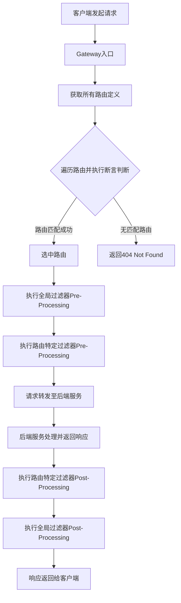

## 4. 项目配置与快速上手

### 4.1 Maven 依赖配置

```xml
<dependencies>
    <!-- Spring Cloud Gateway -->
    <dependency>
        <groupId>org.springframework.cloud</groupId>
        <artifactId>spring-cloud-starter-gateway</artifactId>
    </dependency>

    <!-- 服务注册发现 -->
    <dependency>
        <groupId>org.springframework.cloud</groupId>
        <artifactId>spring-cloud-starter-consul-discovery</artifactId>
    </dependency>

    <!-- 健康检查监控 -->
    <dependency>
        <groupId>org.springframework.boot</groupId>
        <artifactId>spring-boot-starter-actuator</artifactId>
    </dependency>

    <!-- 负载均衡 -->
    <dependency>
        <groupId>org.springframework.cloud</groupId>
        <artifactId>spring-cloud-starter-loadbalancer</artifactId>
    </dependency>
</dependencies>
```

### 4.2 基础配置示例

```yaml
server:
  port: 9527

spring:
  application:
    name: cloud-gateway
  cloud:
    consul:
      host: localhost
      port: 8500
      discovery:
        service-name: ${spring.application.name}
    gateway:
      discovery:
        locator:
          enabled: true # 开启服务发现
          lower-case-service-id: true # 服务名小写
      routes:
        - id: order_route
          uri: lb://order-service
          predicates:
            - Path=/api/order/**
          filters:
            - StripPrefix=1

        - id: user_route
          uri: lb://user-service
          predicates:
            - Path=/api/user/**
          filters:
            - StripPrefix=1
```

### 4.3 动态路由配置

使用 `lb://` 前缀可以启用基于服务发现的动态路由：

```yaml
spring:
  cloud:
    gateway:
      routes:
        - id: dynamic_route
          uri: lb://service-name # 自动从注册中心获取服务实例
          predicates:
            - Path=/api/**
```

## 5. 内置断言详解

Spring Cloud Gateway 提供了丰富的内置断言工厂，满足大多数路由匹配需求。

### 5.1 路径断言（Path Predicate）

```yaml
predicates:
  - Path=/api/order/{orderId}
  - Path=/api/user/**
```

### 5.2 时间断言（Time-based Predicates）

```yaml
predicates:
  # 在指定时间之后
  - After=2025-07-20T12:00:00.000+08:00[Asia/Shanghai]
  # 在指定时间之前
  - Before=2025-07-25T12:00:00.000+08:00[Asia/Shanghai]
  # 在指定时间范围内
  - Between=2025-07-20T12:00:00.000+08:00[Asia/Shanghai],2025-07-25T12:00:00.000+08:00[Asia/Shanghai]
```

### 5.3 请求头断言（Header Predicate）

```yaml
predicates:
  - Header=X-Request-Id, \d+
  - Header=Authorization, Bearer.*
```

### 5.4 请求方法断言（Method Predicate）

```yaml
predicates:
  - Method=GET,POST
```

### 5.5 查询参数断言（Query Predicate）

```yaml
predicates:
  - Query=version, 2
  - Query=debug
```

### 5.6 主机断言（Host Predicate）

```yaml
predicates:
  - Host=**.example.com
  - Host=api.example.com
```

### 5.7 Cookie 断言（Cookie Predicate）

```yaml
predicates:
  - Cookie=sessionId, [a-zA-Z0-9]+
```

### 5.8 远程地址断言（RemoteAddr Predicate）

```yaml
predicates:
  - RemoteAddr=192.168.1.1/24
```

## 6. 自定义断言开发

### 6.1 自定义断言的应用场景

在某些业务场景下，内置断言无法满足复杂的路由匹配需求，此时需要开发自定义断言：

- 基于用户等级的路由分发
- 基于请求内容的智能路由
- 集成外部系统的动态路由决策
- 复杂的业务逻辑判断

### 6.2 自定义断言实现步骤

#### 6.2.1 创建断言工厂类

```java
@Component
public class UserTypeRoutePredicateFactory extends AbstractRoutePredicateFactory<UserTypeRoutePredicateFactory.Config> {

    public UserTypeRoutePredicateFactory() {
        super(Config.class);
    }

    @Override
    public Predicate<ServerWebExchange> apply(Config config) {
        return exchange -> {
            String userType = exchange.getRequest().getQueryParams().getFirst("userType");

            if (userType == null) {
                return false;
            }

            return config.getUserType().equals(userType);
        };
    }

    @Override
    public List<String> shortcutFieldOrder() {
        return Arrays.asList("userType");
    }

    @Validated
    public static class Config {
        @NotEmpty
        private String userType;

        public String getUserType() {
            return userType;
        }

        public void setUserType(String userType) {
            this.userType = userType;
        }
    }
}
```

#### 6.2.2 配置使用

```yaml
spring:
  cloud:
    gateway:
      routes:
        - id: vip_user_route
          uri: lb://vip-service
          predicates:
            - Path=/api/**
            - UserType=diamond
```

### 6.3 高级自定义断言示例

#### 6.3.1 基于时间段的业务断言

```java
@Component
public class BusinessHourRoutePredicateFactory extends AbstractRoutePredicateFactory<BusinessHourRoutePredicateFactory.Config> {

    public BusinessHourRoutePredicateFactory() {
        super(Config.class);
    }

    @Override
    public Predicate<ServerWebExchange> apply(Config config) {
        return exchange -> {
            LocalTime now = LocalTime.now();
            LocalTime startTime = LocalTime.parse(config.getStartTime());
            LocalTime endTime = LocalTime.parse(config.getEndTime());

            return now.isAfter(startTime) && now.isBefore(endTime);
        };
    }

    @Override
    public List<String> shortcutFieldOrder() {
        return Arrays.asList("startTime", "endTime");
    }

    public static class Config {
        private String startTime;
        private String endTime;

        // getters and setters
    }
}
```

## 7. 过滤器深度解析

### 7.1 过滤器分类

Spring Cloud Gateway 的过滤器分为两大类：

#### 7.1.1 全局过滤器（Global Filters）

- 应用于所有路由
- 实现 `GlobalFilter` 接口
- 通过 `@Order` 注解或 `Ordered` 接口控制执行顺序

#### 7.1.2 路由过滤器（Gateway Filters）

- 特定于某个路由
- 在路由配置中通过 `filters` 属性指定
- 通过 `GatewayFilterFactory` 创建

### 7.2 内置过滤器详解

#### 7.2.1 路径操作过滤器

```yaml
filters:
  # 移除路径前缀
  - StripPrefix=1
  # 添加路径前缀
  - PrefixPath=/api
  # 路径重写
  - RewritePath=/api/(?<segment>.*), /$\{segment}
```

#### 7.2.2 请求头操作过滤器

```yaml
filters:
  # 添加请求头
  - AddRequestHeader=X-Request-Source, gateway
  # 移除请求头
  - RemoveRequestHeader=X-Internal-Header
  # 设置请求头
  - SetRequestHeader=X-Request-Time, #{T(java.time.LocalDateTime).now()}
```

#### 7.2.3 响应头操作过滤器

```yaml
filters:
  # 添加响应头
  - AddResponseHeader=X-Response-Source, gateway
  # 移除响应头
  - RemoveResponseHeader=X-Internal-Response
  # 设置响应头
  - SetResponseHeader=X-Response-Time, #{T(java.time.LocalDateTime).now()}
```

#### 7.2.4 限流过滤器

```yaml
filters:
  # Redis限流
  - name: RequestRateLimiter
    args:
      redis-rate-limiter.replenish-rate: 10
      redis-rate-limiter.burst-capacity: 20
      key-resolver: "#{@pathKeyResolver}"
```

#### 7.2.5 重试过滤器

```yaml
filters:
  - name: Retry
    args:
      retries: 3
      statuses: BAD_GATEWAY,BAD_REQUEST
      methods: GET,POST
```

#### 7.2.6 熔断过滤器

```yaml
filters:
  - name: CircuitBreaker
    args:
      name: myCircuitBreaker
      fallbackUri: forward:/fallback
```

## 8. 自定义过滤器开发

### 8.1 全局过滤器开发

#### 8.1.1 基础全局过滤器

```java
@Component
@Order(1)
public class AuthenticationGlobalFilter implements GlobalFilter {

    @Override
    public Mono<Void> filter(ServerWebExchange exchange, GatewayFilterChain chain) {
        ServerHttpRequest request = exchange.getRequest();
        ServerHttpResponse response = exchange.getResponse();

        // 获取请求头中的token
        String token = request.getHeaders().getFirst("Authorization");

        if (token == null || !token.startsWith("Bearer ")) {
            response.setStatusCode(HttpStatus.UNAUTHORIZED);
            return response.setComplete();
        }

        // 验证token逻辑
        if (!validateToken(token)) {
            response.setStatusCode(HttpStatus.UNAUTHORIZED);
            return response.setComplete();
        }

        // 添加用户信息到请求头
        ServerHttpRequest modifiedRequest = request.mutate()
            .header("X-User-Id", getUserIdFromToken(token))
            .build();

        return chain.filter(exchange.mutate().request(modifiedRequest).build());
    }

    private boolean validateToken(String token) {
        // 实现token验证逻辑
        return true;
    }

    private String getUserIdFromToken(String token) {
        // 从token中提取用户ID
        return "user123";
    }
}
```

#### 8.1.2 请求日志全局过滤器

```java
@Component
@Order(2)
@Slf4j
public class RequestLoggingGlobalFilter implements GlobalFilter {

    @Override
    public Mono<Void> filter(ServerWebExchange exchange, GatewayFilterChain chain) {
        ServerHttpRequest request = exchange.getRequest();

        // 记录请求开始时间
        long startTime = System.currentTimeMillis();

        // 记录请求信息
        log.info("Request started: {} {} from {}",
            request.getMethod(),
            request.getURI(),
            request.getRemoteAddress());

        return chain.filter(exchange).doFinally(signalType -> {
            // 记录请求完成时间
            long endTime = System.currentTimeMillis();
            log.info("Request completed: {} {} in {}ms",
                request.getMethod(),
                request.getURI(),
                endTime - startTime);
        });
    }
}
```

### 8.2 路由过滤器开发

#### 8.2.1 自定义路由过滤器工厂

```java
@Component
public class CustomRequestFilterFactory extends AbstractGatewayFilterFactory<CustomRequestFilterFactory.Config> {

    public CustomRequestFilterFactory() {
        super(Config.class);
    }

    @Override
    public GatewayFilter apply(Config config) {
        return (exchange, chain) -> {
            ServerHttpRequest request = exchange.getRequest();

            // 在这里实现自定义逻辑
            if (config.isEnabled()) {
                // 添加自定义请求头
                ServerHttpRequest modifiedRequest = request.mutate()
                    .header("X-Custom-Header", config.getHeaderValue())
                    .build();

                return chain.filter(exchange.mutate().request(modifiedRequest).build());
            }

            return chain.filter(exchange);
        };
    }

    @Override
    public List<String> shortcutFieldOrder() {
        return Arrays.asList("enabled", "headerValue");
    }

    public static class Config {
        private boolean enabled = true;
        private String headerValue = "default";

        // getters and setters
        public boolean isEnabled() {
            return enabled;
        }

        public void setEnabled(boolean enabled) {
            this.enabled = enabled;
        }

        public String getHeaderValue() {
            return headerValue;
        }

        public void setHeaderValue(String headerValue) {
            this.headerValue = headerValue;
        }
    }
}
```

#### 8.2.2 使用自定义路由过滤器

```yaml
spring:
  cloud:
    gateway:
      routes:
        - id: custom_filter_route
          uri: lb://backend-service
          predicates:
            - Path=/api/**
          filters:
            - CustomRequest=true,custom-value
```

### 8.3 高级过滤器开发

#### 8.3.1 异步处理过滤器

```java
@Component
@Order(10)
public class AsyncProcessingGlobalFilter implements GlobalFilter {

    @Autowired
    private AsyncService asyncService;

    @Override
    public Mono<Void> filter(ServerWebExchange exchange, GatewayFilterChain chain) {
        return asyncService.processRequestAsync(exchange)
            .flatMap(result -> {
                // 基于异步处理结果修改请求
                ServerHttpRequest modifiedRequest = exchange.getRequest().mutate()
                    .header("X-Async-Result", result)
                    .build();

                return chain.filter(exchange.mutate().request(modifiedRequest).build());
            })
            .onErrorResume(throwable -> {
                // 异步处理失败的处理逻辑
                ServerHttpResponse response = exchange.getResponse();
                response.setStatusCode(HttpStatus.INTERNAL_SERVER_ERROR);
                return response.setComplete();
            });
    }
}
```

#### 8.3.2 缓存过滤器

```java
@Component
public class CacheGatewayFilterFactory extends AbstractGatewayFilterFactory<CacheGatewayFilterFactory.Config> {

    @Autowired
    private RedisTemplate<String, Object> redisTemplate;

    public CacheGatewayFilterFactory() {
        super(Config.class);
    }

    @Override
    public GatewayFilter apply(Config config) {
        return (exchange, chain) -> {
            ServerHttpRequest request = exchange.getRequest();
            String cacheKey = generateCacheKey(request);

            // 尝试从缓存获取响应
            Object cachedResponse = redisTemplate.opsForValue().get(cacheKey);
            if (cachedResponse != null) {
                // 返回缓存的响应
                return writeResponse(exchange, cachedResponse);
            }

            // 如果缓存不存在，继续处理并缓存结果
            return chain.filter(exchange).doOnNext(result -> {
                // 缓存响应结果
                redisTemplate.opsForValue().set(cacheKey, result, Duration.ofMinutes(config.getTtl()));
            });
        };
    }

    private String generateCacheKey(ServerHttpRequest request) {
        return "cache:" + request.getURI().toString();
    }

    private Mono<Void> writeResponse(ServerWebExchange exchange, Object cachedResponse) {
        ServerHttpResponse response = exchange.getResponse();
        DataBuffer buffer = response.bufferFactory().wrap(cachedResponse.toString().getBytes());
        return response.writeWith(Mono.just(buffer));
    }

    public static class Config {
        private int ttl = 5; // 缓存时间（分钟）

        public int getTtl() {
            return ttl;
        }

        public void setTtl(int ttl) {
            this.ttl = ttl;
        }
    }
}
```

## 9. 高级特性与最佳实践

### 9.1 服务发现与负载均衡

#### 9.1.1 与 Consul 集成

```yaml
spring:
  cloud:
    consul:
      host: localhost
      port: 8500
      discovery:
        service-name: ${spring.application.name}
        health-check-interval: 30s
        health-check-timeout: 10s
        health-check-critical-timeout: 3m
    gateway:
      discovery:
        locator:
          enabled: true
          lower-case-service-id: true
```

#### 9.1.2 自定义负载均衡策略

```java
@Configuration
public class LoadBalancerConfiguration {

    @Bean
    @LoadBalanced
    public RestTemplate restTemplate() {
        return new RestTemplate();
    }

    @Bean
    public ReactorLoadBalancer<ServiceInstance> customLoadBalancer(Environment environment,
                                                                 LoadBalancerClientFactory loadBalancerClientFactory) {
        String name = environment.getProperty(LoadBalancerClientFactory.PROPERTY_NAME);
        return new CustomLoadBalancer(loadBalancerClientFactory.getLazyProvider(name, ServiceInstanceListSupplier.class), name);
    }
}
```

### 9.2 监控与可观测性

#### 9.2.1 Actuator 端点配置

```yaml
management:
  endpoints:
    web:
      exposure:
        include: health,info,gateway
  endpoint:
    health:
      show-details: always
    gateway:
      enabled: true
```

#### 9.2.2 自定义监控指标

```java
@Component
public class MetricsGlobalFilter implements GlobalFilter {

    private final MeterRegistry meterRegistry;
    private final Counter requestCounter;
    private final Timer requestTimer;

    public MetricsGlobalFilter(MeterRegistry meterRegistry) {
        this.meterRegistry = meterRegistry;
        this.requestCounter = Counter.builder("gateway.requests.total")
            .description("Total number of requests")
            .register(meterRegistry);
        this.requestTimer = Timer.builder("gateway.requests.duration")
            .description("Request duration")
            .register(meterRegistry);
    }

    @Override
    public Mono<Void> filter(ServerWebExchange exchange, GatewayFilterChain chain) {
        return Timer.Sample.start(meterRegistry)
            .stop(requestTimer)
            .then(chain.filter(exchange))
            .doOnSuccess(result -> requestCounter.increment())
            .doOnError(error -> requestCounter.increment("error", error.getClass().getSimpleName()));
    }
}
```

### 9.3 安全配置

#### 9.3.1 CORS 配置

```yaml
spring:
  cloud:
    gateway:
      globalcors:
        cors-configurations:
          "[/**]":
            allowed-origins: "*"
            allowed-methods: "*"
            allowed-headers: "*"
            allow-credentials: true
```

#### 9.3.2 安全过滤器

```java
@Component
public class SecurityGlobalFilter implements GlobalFilter {

    @Override
    public Mono<Void> filter(ServerWebExchange exchange, GatewayFilterChain chain) {
        ServerHttpRequest request = exchange.getRequest();
        String path = request.getURI().getPath();

        // 白名单路径
        if (isWhitelistedPath(path)) {
            return chain.filter(exchange);
        }

        // 检查认证
        String token = request.getHeaders().getFirst("Authorization");
        if (!isValidToken(token)) {
            return unauthorizedResponse(exchange);
        }

        return chain.filter(exchange);
    }

    private boolean isWhitelistedPath(String path) {
        return path.startsWith("/actuator/") || path.equals("/health");
    }

    private boolean isValidToken(String token) {
        // 实现token验证逻辑
        return token != null && token.startsWith("Bearer ");
    }

    private Mono<Void> unauthorizedResponse(ServerWebExchange exchange) {
        ServerHttpResponse response = exchange.getResponse();
        response.setStatusCode(HttpStatus.UNAUTHORIZED);
        return response.setComplete();
    }
}
```

### 9.4 性能优化

#### 9.4.1 连接池配置

```yaml
spring:
  cloud:
    gateway:
      httpclient:
        pool:
          max-connections: 1000
          max-idle-time: 30s
          max-life-time: 60s
        connect-timeout: 5000
        response-timeout: 10s
```

#### 9.4.2 内存配置

```yaml
server:
  netty:
    initial-buffer-size: 65536
    max-initial-line-length: 8192
    max-header-size: 8192
```

## 10. 故障排查与调试

### 10.1 常见问题与解决方案

#### 10.1.1 路由不匹配问题

**问题现象**：请求返回 404，路由配置看起来正确

**排查步骤**：

1. 检查断言配置是否正确
2. 确认服务是否已注册到注册中心
3. 使用 actuator 端点检查路由状态

```bash
# 查看所有路由
curl http://localhost:9527/actuator/gateway/routes

# 查看特定路由
curl http://localhost:9527/actuator/gateway/routes/{route_id}
```

#### 10.1.2 过滤器执行顺序问题

**问题现象**：过滤器没有按预期顺序执行

**解决方案**：

```java
@Component
@Order(1) // 数字越小，优先级越高
public class HighPriorityFilter implements GlobalFilter {
    // 实现逻辑
}
```

### 10.2 日志配置

```yaml
logging:
  level:
    org.springframework.cloud.gateway: DEBUG
    org.springframework.cloud.gateway.route.Route
```
```

## 来源 13: Fuwari / `springcloud/SpringSecurityAndCloudPermissionService.md`

- 原始 URL: <https://github.com/DavidHLP/Fuwari/blob/07cee2baf9cee227807dcd68004c5f2493e5ac52/src/content/posts/springcloud/SpringSecurityAndCloudPermissionService.md>
- 本地路径: `springcloud/SpringSecurityAndCloudPermissionService.md`

```markdown
---
title: Spring Cloud Gateway + Spring Security 微服务统一权限管理企业级实战
published: 2025-07-19
tags:
  [
    Spring Security,
    Spring Cloud Gateway,
    微服务权限,
    JWT认证,
    统一鉴权,
    WebFlux,
    RBAC权限模型,
    分布式安全,
    网关过滤器,
  ]
category: Spring Cloud
description: 深度解析基于Spring Cloud Gateway和Spring Security的企业级微服务统一权限管理架构，涵盖网关认证过滤器、JWT令牌验证、用户上下文传递、下游服务安全配置等分布式安全核心实践
draft: false
---

## 1. 架构概述

### 1.1 整体架构设计

本项目采用基于 Spring Cloud Gateway 的分布式权限验证架构，实现了统一的认证鉴权入口。

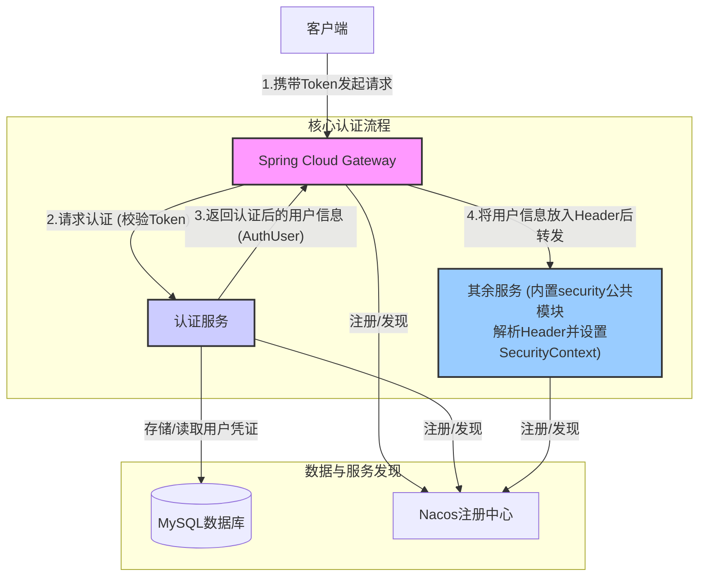

### 1.2 核心设计原则

- **单一认证入口**：所有请求统一通过网关进行认证
- **无状态设计**：基于 JWT Token 实现无状态认证
- **服务解耦**：认证逻辑与业务逻辑分离
- **高可用性**：支持水平扩展和故障转移
- **安全性优先**：多层安全防护机制

### 1.3 关键特性

- ✅ 基于 Spring WebFlux 的响应式编程模型
- ✅ JWT Token 认证与自动续期
- ✅ 细粒度的权限控制（RBAC）
- ✅ 统一的异常处理和错误响应
- ✅ 请求链路追踪和审计日志
- ✅ 动态路由配置和负载均衡

---

## 2. 技术栈与依赖

### 2.1 核心技术栈

| 技术组件             | 版本   | 用途               |
| -------------------- | ------ | ------------------ |
| Spring Boot          | 3.1.x  | 应用框架           |
| Spring Cloud Gateway | 4.0.x  | API 网关           |
| Spring Security      | 6.1.x  | 安全框架           |
| Spring WebFlux       | 6.0.x  | 响应式 Web 框架    |
| Nacos                | 2.2.x  | 服务注册与配置中心 |
| OpenFeign            | 4.0.x  | 服务间通信         |
| JWT                  | 0.11.x | 令牌认证           |

```xml
<properties>
    <spring-boot.version>3.1.5</spring-boot.version>
    <spring-cloud.version>2022.0.4</spring-cloud.version>
    <spring-cloud-alibaba.version>2022.0.0.0</spring-cloud-alibaba.version>
</properties>

<dependencies>
    <!-- Spring Cloud Gateway 核心依赖 -->
    <dependency>
        <groupId>org.springframework.cloud</groupId>
        <artifactId>spring-cloud-starter-gateway</artifactId>
    </dependency>

    <!-- Spring Security WebFlux 支持 -->
    <dependency>
        <groupId>org.springframework.boot</groupId>
        <artifactId>spring-boot-starter-security</artifactId>
    </dependency>

    <!-- WebFlux 响应式编程支持 -->
    <dependency>
        <groupId>org.springframework.boot</groupId>
        <artifactId>spring-boot-starter-webflux</artifactId>
    </dependency>

    <!-- Nacos 服务发现 -->
    <dependency>
        <groupId>com.alibaba.cloud</groupId>
        <artifactId>spring-cloud-starter-alibaba-nacos-discovery</artifactId>
    </dependency>

    <!-- OpenFeign 服务调用 -->
    <dependency>
        <groupId>org.springframework.cloud</groupId>
        <artifactId>spring-cloud-starter-openfeign</artifactId>
    </dependency>

    <!-- 负载均衡器 -->
    <dependency>
        <groupId>org.springframework.cloud</groupId>
        <artifactId>spring-cloud-starter-loadbalancer</artifactId>
    </dependency>

    <!-- 监控与健康检查 -->
    <dependency>
        <groupId>org.springframework.boot</groupId>
        <artifactId>spring-boot-starter-actuator</artifactId>
    </dependency>

    <!-- JWT 支持 -->
    <dependency>
        <groupId>io.jsonwebtoken</groupId>
        <artifactId>jjwt-api</artifactId>
        <version>0.11.5</version>
    </dependency>
    <dependency>
        <groupId>io.jsonwebtoken</groupId>
        <artifactId>jjwt-impl</artifactId>
        <version>0.11.5</version>
        <scope>runtime</scope>
    </dependency>
    <dependency>
        <groupId>io.jsonwebtoken</groupId>
        <artifactId>jjwt-jackson</artifactId>
        <version>0.11.5</version>
        <scope>runtime</scope>
    </dependency>
</dependencies>
```

### 2.3 依赖说明

- **spring-cloud-starter-gateway**：提供网关核心功能，包括路由、过滤器等
- **spring-boot-starter-security**：集成 Spring Security 安全框架
- **spring-boot-starter-webflux**：支持响应式编程模型
- **spring-cloud-starter-alibaba-nacos-discovery**：实现服务注册与发现
- **spring-cloud-starter-openfeign**：声明式服务调用客户端

---

## 3. 核心组件设计

### 3.1 认证过滤器（AuthGlobalFilter）

认证过滤器是网关的核心组件，负责拦截所有请求并进行权限验证。其主要职责包括：

- **请求拦截**：拦截所有进入网关的请求
- **令牌验证**：验证 JWT 令牌的有效性
- **用户信息提取**：从令牌中提取用户信息
- **请求头注入**：将用户信息注入到请求头中传递给下游服务
- **异常处理**：统一处理认证过程中的异常

#### 3.1.1 核心实现逻辑

```java
@Slf4j
@Component
public class AuthGlobalFilter implements GlobalFilter, Ordered {

    // 常量定义
    private static final String BEARER_PREFIX = "Bearer ";
    private static final int BEARER_PREFIX_LENGTH = BEARER_PREFIX.length();
    private static final String CONTENT_TYPE_JSON = "application/json;charset=UTF-8";
    private static final int HIGHEST_PRECEDENCE = -100;

    // 请求头常量
    private static final String HEADER_AUTHORIZATION = HttpHeaders.AUTHORIZATION;
    private static final String HEADER_USER_ID = "X-User-Id";
    private static final String HEADER_USER_NAME = "X-User-Name";
    private static final String HEADER_USER_EMAIL = "X-User-Email";
    private static final String HEADER_USER_ROLES = "X-User-Roles";
    private static final String HEADER_USER_AUTHORITIES = "X-User-Authorities";

    // 公开路径配置
    private static final List<String> PUBLIC_PATHS = List.of(
            "/api/auth/login",
            "/api/auth/register",
            "/api/auth/refresh",
            "/actuator/health",
            "/favicon.ico"
    );

    @Lazy
    @Resource
    private AuthFeignClient authFeignClient;

    @Override
    public Mono<Void> filter(ServerWebExchange exchange, GatewayFilterChain chain) {
        ServerHttpRequest request = exchange.getRequest();
        String path = request.getURI().getPath();

        // 1. 记录请求信息
        if (log.isInfoEnabled()) {
            log.info("处理请求: {} {}", request.getMethod(), path);
        }

        // 2. 检查是否为公开路径
        if (PUBLIC_PATHS.stream().anyMatch(path::startsWith)) {
            log.debug("公开路径，直接放行: {}", path);
            return chain.filter(exchange);
        }

        // 3. 验证认证头
        String authHeader = request.getHeaders().getFirst(HEADER_AUTHORIZATION);
        if (!StringUtils.hasText(authHeader) || !authHeader.startsWith(BEARER_PREFIX)) {
            log.warn("请求缺少有效的 Authorization 头");
            return handleUnauthorized(exchange.getResponse(), "缺少有效的认证令牌");
        }

        // 4. 提取令牌并进行异步认证
        String token = authHeader.substring(BEARER_PREFIX_LENGTH).trim();

        return Mono.fromCallable(() -> {
            try {
                return authFeignClient.loadUserByUsername(token).getData();
            } catch (Exception e) {
                log.error("认证服务调用异常: {}", e.getMessage(), e);
                throw new RuntimeException("认证服务异常: " + e.getMessage(), e);
            }
        })
        .subscribeOn(Schedulers.boundedElastic())
        .flatMap(authUser -> {
            if (authUser == null) {
                log.warn("认证服务返回空结果");
                return handleUnauthorized(exchange.getResponse(), "认证失败");
            }

            // 记录认证成功并添加用户信息到请求头
            if (log.isInfoEnabled()) {
                log.info("用户认证成功: {}", authUser);
            }

            String roleName = authUser.getRole() != null ? authUser.getRole().getRoleName() : "USER";
            String authorities = authUser.getAuthorities().stream()
                    .map(GrantedAuthority::getAuthority)
                    .collect(Collectors.joining(","));

            ServerHttpRequest mutatedRequest = exchange.getRequest().mutate()
                    .header(HEADER_USER_ID, String.valueOf(authUser.getUserId()))
                    .header(HEADER_USER_NAME, Objects.toString(authUser.getUsername(), ""))
                    .header(HEADER_USER_EMAIL, Objects.toString(authUser.getEmail(), ""))
                    .header(HEADER_USER_ROLES, roleName)
                    .header(HEADER_USER_AUTHORITIES, authorities)
                    .build();

            return chain.filter(exchange.mutate().request(mutatedRequest).build());
        })
        .onErrorResume(throwable -> {
            log.error("认证过程中发生异常: {}", throwable.getMessage(), throwable);
            return handleUnauthorized(exchange.getResponse(), "认证服务异常: " + throwable.getMessage());
        });
    }

    /**
     * 处理未授权请求
     */
    private Mono<Void> handleUnauthorized(ServerHttpResponse response, String message) {
        response.setStatusCode(HttpStatus.UNAUTHORIZED);
        response.getHeaders().add(HttpHeaders.CONTENT_TYPE, CONTENT_TYPE_JSON);

        String jsonResponse = String.format(
                "{\"code\": %d, \"message\": \"%s\", \"data\": null}",
                HttpStatus.UNAUTHORIZED.value(), message);

        return response.writeWith(
                Mono.just(response.bufferFactory().wrap(jsonResponse.getBytes(StandardCharsets.UTF_8))));
    }

    @Override
    public int getOrder() {
        return HIGHEST_PRECEDENCE;
    }
}
```

### 3.2 认证服务客户端（AuthFeignClient）

```java
@FeignClient(name = "user-service", path = "/api/auth")
public interface AuthFeignClient {

    /**
     * 根据令牌加载用户信息
     *
     * @param token JWT 令牌
     * @return 用户认证信息
     */
    @GetMapping("/loadUserByUsername")
    Result<AuthUser> loadUserByUsername(@RequestParam("token") String token);
}
```

---

## 4. 配置详解

### 4.1 应用配置文件（application.yml）

```yaml
spring:
  application:
    name: gateway

  # 数据库配置（如果网关需要访问数据库）
  datasource:
    driver-class-name: com.mysql.cj.jdbc.Driver
    url: jdbc:mysql://localhost:3306/springoj?useUnicode=true&characterEncoding=utf-8&useSSL=false&serverTimezone=Asia/Shanghai
    username: ${DB_USERNAME:root}
    password: ${DB_PASSWORD:123456}

  # Nacos 服务发现配置
  cloud:
    nacos:
      discovery:
        server-addr: 10.25.0.11:8848 #配置Nacos地址
        username: nacos
        password: "#Alone117"
    gateway:
      discovery:
        locator:
          enabled: true # 开启服务发现
          lower-case-service-id: true # 服务名小写
      routes:
        # 认证服务路由
        - id: authentication
          uri: lb://authentication
          predicates:
            - Path=/api/auth/**
          filters:
            - StripPrefix=0
      default-filters:
        - DedupeResponseHeader=Access-Control-Allow-Credentials Access-Control-Allow-Origin
        - AddResponseHeader=Access-Control-Allow-Origin,*
        - AddResponseHeader=Access-Control-Allow-Methods,GET,POST,PUT,DELETE,OPTIONS
        - AddResponseHeader=Access-Control-Allow-Headers,*
        - AddResponseHeader=Access-Control-Max-Age,3600
```

### 拦截代码

- AuthGlobalFilter

```java
/**
 * Gateway 全局权限验证过滤器
 * 拦截所有请求，通过 AuthenticationService 验证用户权限
 * 将用户信息存储到请求头中传递给下游服务
 */
@Slf4j
@Component
public class AuthGlobalFilter implements GlobalFilter, Ordered {
    // 常量定义
    private static final String BEARER_PREFIX = "Bearer ";
    private static final int BEARER_PREFIX_LENGTH = BEARER_PREFIX.length();
    private static final String CONTENT_TYPE_JSON = "application/json;charset=UTF-8";
    private static final int HIGHEST_PRECEDENCE = -100;

    // 请求头常量
    private static final String HEADER_AUTHORIZATION = HttpHeaders.AUTHORIZATION;
    private static final String HEADER_USER_ID = "X-User-Id";
    private static final String HEADER_USER_NAME = "X-User-Name";
    private static final String HEADER_USER_EMAIL = "X-User-Email";
    private static final String HEADER_USER_ROLES = "X-User-Roles";
    private static final String HEADER_USER_AUTHORITIES = "X-User-Authorities";

    // 默认值
    private static final String DEFAULT_ROLE = "USER";
    private static final String EMPTY_STRING = "";

    /**
     * 公开路径，无需权限验证
     */
    private static final List<String> PUBLIC_PATHS = List.of(
            "/api/auth/login",
            "/api/auth/register",
            "/api/auth/refresh",
            "/actuator/health",
            "/favicon.ico");

    @Lazy
    @Resource
    private AuthFeignClient authFeignClient;

    @Override
    public Mono<Void> filter(ServerWebExchange exchange, GatewayFilterChain chain) {
        ServerHttpRequest request = exchange.getRequest();
        String path = request.getURI().getPath();

        // 1. 记录请求信息
        if (log.isInfoEnabled()) {
            log.info("处理请求: {} {}", request.getMethod(), path);
        }

        // 2. 检查是否为公开路径
        if (PUBLIC_PATHS.stream().anyMatch(path::startsWith)) {
            log.debug("公开路径，直接放行: {}", path);
            return chain.filter(exchange);
        }

        // 3. 验证认证头
        String authHeader = request.getHeaders().getFirst(HEADER_AUTHORIZATION);
        if (!StringUtils.hasText(authHeader) || !authHeader.startsWith(BEARER_PREFIX)) {
            log.warn("请求缺少有效的 Authorization 头");
            return handleUnauthorized(exchange.getResponse(), "缺少有效的认证令牌");
        }

        // 4. 提取令牌
        String token = authHeader.substring(BEARER_PREFIX_LENGTH).trim();

        // 5. 异步调用认证服务验证令牌
        return Mono.fromCallable(() -> {
            try {
                return authFeignClient.loadUserByUsername(token).getData();
            } catch (Exception e) {
                log.error("认证服务调用异常: {}", e.getMessage(), e);
                throw new RuntimeException("认证服务异常: " + e.getMessage(), e);
            }
        })
        .subscribeOn(Schedulers.boundedElastic())
        .flatMap(authUser -> {
            // 6. 处理认证结果
            if (authUser == null) {
                log.warn("认证服务返回空结果");
                return handleUnauthorized(exchange.getResponse(), "认证失败");
            }

            // 7. 记录认证成功日志
            if (log.isInfoEnabled()) {
                log.info("用户认证成功: {}", authUser);
            }

            // 8. 添加用户信息到请求头
            String roleName = authUser.getRole() != null ? authUser.getRole().getRoleName() : DEFAULT_ROLE;
            String authorities = authUser.getAuthorities().stream()
                    .map(GrantedAuthority::getAuthority)
                    .collect(Collectors.joining(","));

            ServerHttpRequest mutatedRequest = exchange.getRequest().mutate()
                    .header(HEADER_USER_ID, String.valueOf(authUser.getUserId()))
                    .header(HEADER_USER_NAME, Objects.toString(authUser.getUsername(), EMPTY_STRING))
                    .header(HEADER_USER_EMAIL, Objects.toString(authUser.getEmail(), EMPTY_STRING))
                    .header(HEADER_USER_ROLES, roleName)
                    .header(HEADER_USER_AUTHORITIES, authorities)
                    .build();

            // 9. 继续处理请求
            return chain.filter(exchange.mutate().request(mutatedRequest).build());
        })
        .onErrorResume(throwable -> {
            // 10. 处理认证过程中的错误
            log.error("认证过程中发生异常: {}", throwable.getMessage(), throwable);
            return handleUnauthorized(exchange.getResponse(),
                    "认证服务异常: " + throwable.getMessage());
        });
    }

    /**
     * 处理未授权请求
     *
     * @param response HTTP 响应对象
     * @param message  错误消息
     * @return 包含错误响应的 Mono 对象
     */
    private Mono<Void> handleUnauthorized(ServerHttpResponse response, String message) {
        response.setStatusCode(HttpStatus.UNAUTHORIZED);
        response.getHeaders().add(HttpHeaders.CONTENT_TYPE, CONTENT_TYPE_JSON);

        String jsonResponse = String.format(
                "{\"code\": %d, \"message\": \"%s\", \"data\": null}",
                HttpStatus.UNAUTHORIZED.value(),
                message);

        return response.writeWith(
                Mono.just(response.bufferFactory().wrap(jsonResponse.getBytes(StandardCharsets.UTF_8))));
    }

    @Override
    public int getOrder() {
        return HIGHEST_PRECEDENCE;
    }
}
```

- WebConfig

```java
/**
 * WebFlux 配置类
 * 配置响应式 CORS 支持
 */
@Configuration
public class WebConfig {

    /**
     * 配置 WebFlux CORS 过滤器
     * 适配 Gateway 的响应式架构
     *
     * @return 配置完成的 CorsWebFilter 实例
     */
    @Bean
    public CorsWebFilter corsWebFilter() {
        CorsConfiguration config = new CorsConfiguration();
        config.addAllowedOriginPattern("*"); // 允许所有来源
        config.addAllowedMethod("*"); // 允许所有 HTTP 方法
        config.addAllowedHeader("*"); // 允许所有请求头
        config.setAllowCredentials(true); // 允许凭证传递
        config.addExposedHeader("*"); // 暴露所有响应头

        UrlBasedCorsConfigurationSource source = new UrlBasedCorsConfigurationSource();
        source.registerCorsConfiguration("/**", config); // 应用配置到所有路径

        return new CorsWebFilter(source);
    }
}
```

- WebClientConfig

```java
@Configuration
public class WebClientConfig {

    @Bean
    @LoadBalanced
    public WebClient.Builder loadBalancedWebClientBuilder() {
        return WebClient.builder();
    }

    /**
     * 为WebFlux环境提供HttpMessageConverters Bean
     */
    @Bean
    public HttpMessageConverters messageConverters() {
        List<HttpMessageConverter<?>> converters = new ArrayList<>();
        converters.add(new MappingJackson2HttpMessageConverter());
        return new HttpMessageConverters(converters);
    }
}
```

- SecurityConfiguration

```java
@Configuration
@EnableWebFluxSecurity
public class SecurityConfiguration {

    /**
     * 公开路径，无需认证
     */
    private static final String[] PUBLIC_PATHS = {
            "/api/auth/login",
            "/api/auth/register",
            "/api/auth/refresh",
            "/actuator/**",
            "/favicon.ico"
    };

    /**
     * 配置 WebFlux 安全过滤器链
     * 简化配置，主要权限验证交给 AuthGlobalFilter 处理
     */
    @Bean
    public SecurityWebFilterChain securityWebFilterChain(ServerHttpSecurity http) {
        return http
                // 禁用 CSRF（API 网关不需要）
                .csrf(ServerHttpSecurity.CsrfSpec::disable)
                // 禁用表单登录
                .formLogin(ServerHttpSecurity.FormLoginSpec::disable)
                // 禁用 HTTP Basic 认证
                .httpBasic(ServerHttpSecurity.HttpBasicSpec::disable)
                // 配置无状态会话管理
                .securityContextRepository(NoOpServerSecurityContextRepository.getInstance())
                // 简化权限配置，允许所有请求通过，具体权限由 AuthGlobalFilter 控制
                .authorizeExchange(exchanges -> exchanges
                        .pathMatchers(PUBLIC_PATHS).permitAll()
                        .anyExchange().permitAll() // 改为 permitAll，由 AuthGlobalFilter 控制
                )
                .build();
    }
}
```

- AuthFeignClient

```java
/**
 * 认证服务Feign客户端
 * 用于Gateway调用认证服务进行token验证
 */
@FeignClient(name = "authentication", path = "/api/auth")
public interface AuthFeignClient {
    /**
     * 验证token并获取用户信息
     * 调用认证服务的 GET /validate 接口
     *
     * @param token JWT token
     * @return 用户信息
     */
    @GetMapping("/validate/{token}")
    ResponseResult<AuthUser> loadUserByUsername(@PathVariable("token") String token);
}
```

## Spring Security 通用模块

### 1. 引入依赖

```xml
    <dependencies>
    <dependency>
        <groupId>org.springframework.boot</groupId>
        <artifactId>spring-boot-starter-validation</artifactId>
    </dependency>
    <dependency>
        <groupId>org.springframework.boot</groupId>
        <artifactId>spring-boot-starter-web</artifactId>
        <optional>true</optional>
    </dependency>
    <dependency>
        <groupId>org.springframework.boot</groupId>
        <artifactId>spring-boot-starter-security</artifactId>
        <optional>true</optional>
    </dependency>
    <dependency>
        <groupId>com.baomidou</groupId>
        <artifactId>mybatis-plus-spring-boot3-starter</artifactId>
        <version>${mybatis-plus}</version>
        <optional>true</optional>
    </dependency>
    <dependency>
        <groupId>org.springframework.boot</groupId>
        <artifactId>spring-boot-starter-data-jdbc</artifactId>
        <optional>true</optional>
    </dependency>
    <dependency>
        <groupId>io.projectreactor</groupId>
        <artifactId>reactor-core</artifactId>
    </dependency>
    <dependency>
        <groupId>org.projectlombok</groupId>
        <artifactId>lombok</artifactId>
        <scope>provided</scope>
    </dependency>
</dependencies>
```

### 实现类

- ApplicationAuditAware

```java
/**
 * 审计感知器实现类
 * 用于 JPA 审计功能，从请求头获取当前用户信息
 * 下游服务通过网关传递的用户信息进行审计
 */
@Slf4j
public class ApplicationAuditAware implements AuditorAware<Integer> {

    @Override
    public Optional<Integer> getCurrentAuditor() {
        try {
            // 首先尝试从 Spring Security 上下文获取
            Authentication authentication = SecurityContextHolder.getContext().getAuthentication();
            if (authentication != null && authentication.isAuthenticated()
                    && !"anonymousUser".equals(authentication.getPrincipal())) {
                log.debug("从 Security 上下文获取审计用户: {}", authentication.getName());
                return Optional.of(1); // 这里可以根据实际需求返回用户ID
            }

            // 如果 Security 上下文中没有，尝试从请求头获取
            ServletRequestAttributes attributes = (ServletRequestAttributes) RequestContextHolder
                    .getRequestAttributes();
            if (attributes != null) {
                HttpServletRequest request = attributes.getRequest();
                Optional<Long> userId = UserContextUtil.getCurrentUserId(request);
                Optional<String> username = UserContextUtil.getCurrentUsername(request);

                if (userId.isPresent() && username.isPresent()) {
                    log.debug("从请求头获取审计用户: {} (ID: {})", username.get(), userId.get());
                    return Optional.of(userId.get().intValue());
                }
            }

            log.debug("未找到当前用户信息，使用默认审计用户");
            return Optional.of(0); // 默认系统用户ID

        } catch (Exception e) {
            log.warn("获取当前审计用户失败: {}", e.getMessage());
            return Optional.of(0); // 异常情况下使用默认用户ID
        }
    }
}
```

- ApplicationConfig

```java
/**
 * 应用程序配置类，提供下游服务的基础配置。
 * 下游服务不需要从数据库验证用户，直接从网关传递的请求头获取用户信息。
 */
@Configuration
@RequiredArgsConstructor
@ConditionalOnMissingClass("org.springframework.web.reactive.config.WebFluxConfigurer")
public class ApplicationConfig {

  /**
   * 配置 AuditorAware，用于审计实体的创建者和修改者。
   * 从请求头获取当前用户信息用于审计。
   *
   * @return AuditorAware 实例。
   */
  @Bean
  public AuditorAware<Integer> auditorAware() {
    return new ApplicationAuditAware();
  }

  /**
   * 配置 AuthenticationManager，用于管理认证（虽然下游服务主要依赖网关认证）。
   *
   * @param config AuthenticationConfiguration 实例。
   * @return AuthenticationManager 实例。
   * @throws Exception 如果获取失败。
   */
  @Bean
  public AuthenticationManager authenticationManager(AuthenticationConfiguration config) throws Exception {
    return config.getAuthenticationManager();
  }

  /**
   * 配置 PasswordEncoder，主要用于兼容性（下游服务通常不需要密码验证）。
   *
   * @return PasswordEncoder 实例。
   */
  @Bean
  public PasswordEncoder passwordEncoder() {
    return new BCryptPasswordEncoder();
  }

  /**
   * 提供当前请求范围内的 AuthUser Bean
   * 便于在其他组件中直接注入使用
   *
   * @return 当前用户的 AuthUser 对象，如果未找到则返回 null
   */
  @Bean
  @RequestScope
  public AuthUser currentAuthUser() {
    // 首先尝试从 Security 上下文获取
    Authentication authentication = SecurityContextHolder.getContext().getAuthentication();
    if (authentication != null && authentication.getPrincipal() instanceof AuthUser) {
      return (AuthUser) authentication.getPrincipal();
    }

    // 如果 Security 上下文中没有，尝试从请求头获取
    ServletRequestAttributes attributes = (ServletRequestAttributes) RequestContextHolder.getRequestAttributes();
    if (attributes != null) {
      HttpServletRequest request = attributes.getRequest();
      Optional<AuthUser> authUserOpt = UserContextUtil.getCurrentAuthUser(request);
      return authUserOpt.orElse(null);
    }

    return null;
  }
}
```

- SecurityConfiguration

```java
/**
 * 下游服务安全配置
 * 依赖网关传递的用户信息，不进行独立的用户认证
 * 启用方法级安全，支持 @PreAuthorize、@PostAuthorize 等注解
 */
@Configuration
@EnableWebSecurity
@RequiredArgsConstructor
@EnableMethodSecurity(prePostEnabled = true)
@ConditionalOnMissingClass("org.springframework.web.reactive.config.WebFluxConfigurer")
public class SecurityConfiguration {
    private static final String[] AUTH_WHITELIST = {
            "/api/auth/**",
            "/preauthorize/**",  // 预授权端点
            "/actuator/**"  // 添加监控端点
    };

    private final GatewayAuthenticationFilter gatewayAuthenticationFilter;

    @Bean
    public SecurityFilterChain filterChain(HttpSecurity http) throws Exception {
        http
                .authorizeHttpRequests(auth -> auth
                        .requestMatchers(AUTH_WHITELIST).permitAll()
                        .anyRequest().authenticated())
                .sessionManagement(session -> session
                        .sessionCreationPolicy(SessionCreationPolicy.STATELESS))
                // 添加网关认证过滤器，从请求头获取用户信息
                .addFilterBefore(gatewayAuthenticationFilter, UsernamePasswordAuthenticationFilter.class)
                // 禁用 CSRF，因为是无状态服务
                .csrf(csrf -> csrf.disable())
                // 禁用默认的登录页面和HTTP基本认证
                .formLogin(form -> form.disable())
                .httpBasic(basic -> basic.disable())
                // 配置安全头
                .headers(headers -> headers
                        .frameOptions(frameOptions -> frameOptions.deny())
                        .contentTypeOptions(contentTypeOptions -> {})
                        .httpStrictTransportSecurity(hstsConfig -> hstsConfig
                                .maxAgeInSeconds(31536000)
                                .includeSubDomains(true)))
                // 配置异常处理
                .exceptionHandling(exceptions -> exceptions
                        .authenticationEntryPoint((request, response, authException) -> {
                            response.setStatus(401);
                            response.setContentType("application/json;charset=UTF-8");
                            response.getWriter().write("{\"error\":\"Unauthorized\",\"message\":\"请求头中缺少有效的用户信息\"}");
                        })
                        .accessDeniedHandler((request, response, accessDeniedException) -> {
                            response.setStatus(403);
                            response.setContentType("application/json;charset=UTF-8");
                            response.getWriter().write("{\"error\":\"Forbidden\",\"message\":\"权限不足\"}");
                        }));

        return http.build();
    }
}
```

- GatewayAuthenticationFilter

```java
/**
 * 下游服务权限过滤器
 * 将 Gateway 传递的用户信息转换为 Spring Security 认证上下文
 * 只在传统 Servlet 环境下加载，避免在 WebFlux Gateway 中冲突
 */
@Slf4j
@Component
@ConditionalOnWebApplication(type = ConditionalOnWebApplication.Type.SERVLET)
public class GatewayAuthenticationFilter extends OncePerRequestFilter {
    @Override
    protected void doFilterInternal(
            @NonNull HttpServletRequest request,
            @NonNull HttpServletResponse response,
            @NonNull FilterChain filterChain) throws ServletException, IOException {

        // 尝试从请求头构建 AuthUser 对象
        Optional<AuthUser> authUserOpt = UserContextUtil.getCurrentAuthUser(request);

        if (authUserOpt.isPresent()) {
            AuthUser authUser = authUserOpt.get();

            // 创建 Authentication 对象，使用 AuthUser 作为 principal
            Authentication authentication = new UsernamePasswordAuthenticationToken(
                    authUser, // principal - 使用完整的 AuthUser 对象
                    null, // credentials (不需要密码)
                    authUser.getAuthorities() // authorities - 使用 AuthUser 的 getAuthorities 方法
            );

            // 设置到 Security 上下文
            SecurityContextHolder.getContext().setAuthentication(authentication);

            log.debug("设置用户认证上下文: {} (ID: {}), 权限: {}",
                    authUser.getUsername(), authUser.getUserId(), authUser.getAuthorities());
        } else {
            log.debug("请求中未找到用户信息，跳过认证设置");
        }

        try {
            filterChain.doFilter(request, response);
        } finally {
            // 清理上下文
            SecurityContextHolder.clearContext();
        }
    }
}
```

- UserContextUtil

```java
/**
 * 统一用户上下文工具类
 * 支持 WebFlux 响应式和传统 Servlet 两种方式获取用户信息
 */
@Slf4j
public class UserContextUtil {

    // 用户信息请求头常量
    public static final String USER_ID_HEADER = "X-User-Id";
    public static final String USER_NAME_HEADER = "X-User-Name";
    public static final String USER_EMAIL_HEADER = "X-User-Email";
    public static final String USER_ROLES_HEADER = "X-User-Roles";
    public static final String USER_AUTHORITIES_HEADER = "X-User-Authorities";

    // ==================== WebFlux 响应式方法 ====================

    /**
     * 从 ServerWebExchange 获取用户ID
     */
    public static Optional<Long> getCurrentUserId(ServerWebExchange exchange) {
        try {
            String userIdStr = exchange.getRequest().getHeaders().getFirst(USER_ID_HEADER);
            if (userIdStr != null) {
                return Optional.of(Long.parseLong(userIdStr));
            }
        } catch (NumberFormatException e) {
            log.warn("解析用户ID失败: {}", e.getMessage());
        }
        return Optional.empty();
    }

    /**
     * 从 ServerWebExchange 获取用户名
     */
    public static Optional<String> getCurrentUsername(ServerWebExchange exchange) {
        String username = exchange.getRequest().getHeaders().getFirst(USER_NAME_HEADER);
        return Optional.ofNullable(username);
    }

    /**
     * 从 ServerWebExchange 获取用户邮箱
     */
    public static Optional<String> getCurrentUserEmail(ServerWebExchange exchange) {
        String email = exchange.getRequest().getHeaders().getFirst(USER_EMAIL_HEADER);
        return Optional.ofNullable(email);
    }

    /**
     * 从 ServerWebExchange 获取用户角色
     */
    public static Optional<String> getCurrentUserRole(ServerWebExchange exchange) {
        String role = exchange.getRequest().getHeaders().getFirst(USER_ROLES_HEADER);
        return Optional.ofNullable(role);
    }

    /**
     * 从 ServerWebExchange 获取用户权限
     */
    public static Optional<String> getCurrentUserAuthorities(ServerWebExchange exchange) {
        String authorities = exchange.getRequest().getHeaders().getFirst(USER_AUTHORITIES_HEADER);
        return Optional.ofNullable(authorities);
    }

    /**
     * 检查当前用户是否具有指定角色
     */
    public static boolean hasRole(ServerWebExchange exchange, String role) {
        return getCurrentUserRole(exchange)
                .map(userRole -> userRole.equals(role))
                .orElse(false);
    }

    /**
     * 检查当前用户是否具有管理员权限
     */
    public static boolean isAdmin(ServerWebExchange exchange) {
        return hasRole(exchange, "ADMIN");
    }

    // ==================== 传统 Servlet 方法（用于下游服务） ====================

    /**
     * 从 HttpServletRequest 获取用户ID
     */
    public static Optional<Long> getCurrentUserId(HttpServletRequest request) {
        try {
            String userIdStr = request.getHeader(USER_ID_HEADER);
            if (userIdStr != null) {
                return Optional.of(Long.parseLong(userIdStr));
            }
        } catch (NumberFormatException e) {
            log.warn("解析用户ID失败: {}", e.getMessage());
        }
        return Optional.empty();
    }

    /**
     * 从 HttpServletRequest 获取用户名
     */
    public static Optional<String> getCurrentUsername(HttpServletRequest request) {
        String username = request.getHeader(USER_NAME_HEADER);
        return Optional.ofNullable(username);
    }

    /**
     * 从 HttpServletRequest 获取用户邮箱
     */
    public static Optional<String> getCurrentUserEmail(HttpServletRequest request) {
        String email = request.getHeader(USER_EMAIL_HEADER);
        return Optional.ofNullable(email);
    }

    /**
     * 从 HttpServletRequest 获取用户角色
     */
    public static Optional<String> getCurrentUserRole(HttpServletRequest request) {
        String role = request.getHeader(USER_ROLES_HEADER);
        return Optional.ofNullable(role);
    }

    /**
     * 从 HttpServletRequest 获取用户权限
     */
    public static Optional<String> getCurrentUserAuthorities(HttpServletRequest request) {
        String authorities = request.getHeader(USER_AUTHORITIES_HEADER);
        return Optional.ofNullable(authorities);
    }

    /**
     * 检查当前用户是否具有指定角色（Servlet版本）
     */
    public static boolean hasRole(HttpServletRequest request, String role) {
        return getCurrentUserRole(request)
                .map(userRole -> userRole.equals(role))
                .orElse(false);
    }

    /**
     * 检查当前用户是否具有管理员权限（Servlet版本）
     */
    public static boolean isAdmin(HttpServletRequest request) {
        return hasRole(request, "ADMIN");
    }

    // ==================== 响应式安全上下文方法 ====================

    /**
     * 从响应式安全上下文获取当前认证信息
     */
    public static Mono<Authentication> getCurrentAuthentication() {
        return ReactiveSecurityContextHolder.getContext()
                .map(SecurityContext::getAuthentication)
                .filter(Authentication::isAuthenticated)
                .doOnNext(auth -> log.debug("获取当前认证信息: {}", auth.getName()))
                .doOnError(error -> log.warn("获取认证信息失败: {}", error.getMessage()));
    }

    /**
     * 从响应式安全上下文获取当前用户名
     */
    public static Mono<String> getCurrentUsernameFromContext() {
        return getCurrentAuthentication()
                .map(Authentication::getName);
    }

    /**
     * 检查当前用户是否为指定用户（通过用户ID）
     */
    public static boolean isCurrentUser(ServerWebExchange exchange, Long userId) {
        return getCurrentUserId(exchange)
                .map(currentUserId -> currentUserId.equals(userId))
                .orElse(false);
    }

    /**
     * 检查当前用户是否为指定用户（Servlet版本）
     */
    public static boolean isCurrentUser(HttpServletRequest request, Long userId) {
        return getCurrentUserId(request)
                .map(currentUserId -> currentUserId.equals(userId))
                .orElse(false);
    }

    // ==================== 便捷方法 ====================

    /**
     * 从 HttpServletRequest 构建完整的用户信息对象
     */
    public static Optional<AuthUser> getCurrentAuthUser(HttpServletRequest request) {
        Optional<Long> userId = getCurrentUserId(request);
        Optional<String> username = getCurrentUsername(request);

        if (userId.isPresent() && username.isPresent()) {
            List<String> authorities = parseAuthoritiesList(
                getCurrentUserAuthorities(request).orElse(""));

            // 构建 Role 对象
            String roleName = getCurrentUserRole(request).orElse("USER");
            Role role = Role.builder()
                    .roleName(roleName)
                    .status(1)
                    .build();

            AuthUser authUser = AuthUser.builder()
                    .userId(userId.get())
                    .username(username.get())
                    .email(getCurrentUserEmail(request).orElse(null))
                    .status(1) // 下游服务认为通过网关的用户都是启用状态
                    .role(role)
                    .authorities(authorities) // 这里是字符串列表，不是GrantedAuthority对象
                    .build();

            // 清理权限列表，确保没有空值
            authUser.cleanAuthorities();

            return Optional.of(authUser);
        }
        return Optional.empty();
    }

    /**
     * 从 ServerWebExchange 构建完整的用户信息对象
     */
    public static Optional<AuthUser> getCurrentAuthUser(ServerWebExchange exchange) {
        Optional<Long> userId = getCurrentUserId(exchange);
        Optional<String> username = getCurrentUsername(exchange);

        if (userId.isPresent() && username.isPresent()) {
            List<String> authorities = parseAuthoritiesList(
                getCurrentUserAuthorities(exchange).orElse(""));

            // 构建 Role 对象
            String roleName = getCurrentUserRole(exchange).orElse("USER");
            Role role = Role.builder()
                    .roleName(roleName)
                    .status(1)
                    .build();

            AuthUser authUser = AuthUser.builder()
                    .userId(userId.get())
                    .username(username.get())
                    .email(getCurrentUserEmail(exchange).orElse(null))
                    .status(1) // 下游服务认为通过网关的用户都是启用状态
                    .role(role)
                    .authorities(authorities) // 这里是字符串列表，不是GrantedAuthority对象
                    .build();

            // 清理权限列表，确保没有空值
            authUser.cleanAuthorities();

            return Optional.of(authUser);
        }
        return Optional.empty();
    }

    /**
     * 解析权限字符串为权限列表
     */
    private static List<String> parseAuthoritiesList(String authoritiesStr) {
        if (!StringUtils.hasText(authoritiesStr)) {
            return Collections.emptyList();
        }

        // 处理格式如 "[PERMISSION1, PERMISSION2]" 或 "PERMISSION1,PERMISSION2"
        String cleanStr = authoritiesStr.replaceAll("[\\[\\]]", "").trim();
        if (cleanStr.isEmpty()) {
            return Collections.emptyList();
        }

        return Arrays.stream(cleanStr.split(","))
                .map(String::trim)
                .filter(StringUtils::hasText)
                .collect(Collectors.toList());
    }
}
```
```
