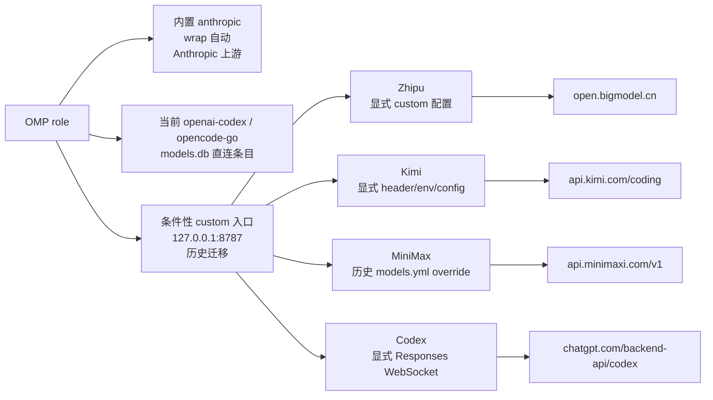

# Headroom 单端口演进：让 Zhipu、Kimi、MiniMax 与 Codex 共用 8787

本文记录一次历史单端口迁移。官方 `headroom wrap omp` 的自动范围更窄：它只把 OMP 内置的 `anthropic` provider 注入 wrapper 管理的配置。当前 `openai-codex` 与 `opencode-go` role 仍使用 `models.db` 中的直连条目；wrap 不会自动把它们改成 loopback。

下文的 Zhipu、Kimi、MiniMax 与 Codex loopback 路由都是历史迁移证据，必须有显式 custom provider 配置才会成立，并不是 `headroom wrap omp` 的默认结果。

今天的启动请以[官方 Headroom README](https://github.com/headroomlabs-ai/headroom/blob/main/README.md)及其 wrapper 为准，不要使用常驻服务：

```bash
# 只需安装一次官方 CLI（Python 3.13+）
uv tool install --python 3.13 "headroom-ai[all]"

# 唯一推荐的 OMP 启动入口：由 wrap 管理会话和本地代理
headroom wrap omp

# 在 wrapped 会话运行期间，从另一个终端验证
headroom doctor
headroom perf
headroom dashboard
```

`headroom wrap omp` 会启动 OMP，并管理当前会话所需的本地代理生命周期。它是 OMP 的唯一推荐启动入口。通常不要创建或维护旧的 `~/.config/systemd/user/headroom-proxy.service`，不要启用 provider 专用 unit，也不要手工运行 `headroom proxy --port 8787`。这些 systemd 和直接代理路径仅用于历史迁移背景，不推荐作为日常启动方式。

```text
历史 custom-provider 拓扑（不是 wrap-only 默认；自动范围仅内置 `anthropic`）
OMP（由 headroom wrap omp 启动）
      │
      ├─ 内置 `anthropic` → wrapper 管理的路由（自动；Anthropic 上游）
      ├─ 当前 `openai-codex` / `opencode-go` → `models.db` 直连上游
      │
      ▼
条件性的 custom Headroom 入口（历史迁移；127.0.0.1:8787）
      ├─ Zhipu    → https://open.bigmodel.cn/api/coding/paas/v4/chat/completions
      ├─ Kimi     → https://api.kimi.com/coding/v1/messages
      ├─ MiniMax  → https://api.minimaxi.com/v1/chat/completions
      └─ Codex WS → wss://chatgpt.com/backend-api/codex/responses
```

wrapper 负责 active 会话生命周期，但进程退出不会自动恢复路由状态。会话结束后必须显式执行 `headroom unwrap omp`；默认行为会移除 wrapper 管理的路由状态并停止本地代理。只有明确要保留代理时才使用 `headroom unwrap omp --no-stop-proxy`，否则 loopback 路由可能残留。

## 1. 为什么从多端口改成单端口

早期方案为不同 provider 启动独立的 Headroom systemd 服务。这个旧拓扑已经过时且不推荐：它虽然便于为每个进程设置固定的 `*_TARGET_API_URL`，但也带来明显问题：

- systemd 单元、端口、日志文件和生命周期变多；
- OMP 与 Kimi CLI 需要记住不同的 loopback 地址；
- 一个 provider 的重启、代理环境或 SOCKS 配置容易和其他 provider 漂移；
- 端口本身表达了路由，而不是请求携带的 provider 事实。

当前方案重新分开职责：

1. **客户端**决定请求属于哪个 provider，并通过模型缓存或自定义 header 写入上游信息；
2. **Headroom**负责协议识别、压缩、缓存和转发；
3. **`headroom wrap omp`**负责 OMP 会话所需本地代理的生命周期。

这样端口只表达“本机 Headroom 入口”，不再表达“某一个固定供应商”。

## 2. 最终的单端口架构



下面这些路由是历史或有条件的 custom provider 路由，并不是 `headroom wrap omp` 自动创建的四条路由。wrap-only 自动覆盖内置 `anthropic` provider，默认仍使用配置的 Anthropic 上游，不会隐式指向 Kimi。当前 `openai-codex` 与 `opencode-go` 条目仍然直连，除非另行显式配置：

| Provider | 客户端路由方式 | Headroom 上游结果 |
| --- | --- | --- |
| 内置 `anthropic` | wrapper 自动管理的路由；没有隐式 Kimi 目标 | 配置的 Anthropic 上游 |
| `openai-codex` / `opencode-go` | 当前 `models.db` 直连条目；不会自动改成 loopback | 各自配置的直连上游 |
| Zhipu | 历史 custom provider 路由；必须显式配置 `x-headroom-*` | `/v4/chat/completions` |
| Kimi | 历史 custom provider 路由；必须显式配置 header、环境变量或 provider | `/coding/v1/messages` |
| MiniMax | 历史 `models.yml` override 与 custom 路由；wrap 不需要 | `/v1/chat/completions` |
| Codex | 历史 custom provider 路由；必须显式配置 Responses WebSocket | Codex Responses WebSocket |

不要从这些历史 `models.db` 或 provider 条目推断当前路由。先检查 active 配置，日常启动也不要手工编辑数据库。

## 3. 官方 wrap 启动与生命周期

每次正常使用 OMP 都走 README 推荐的 `wrap` 路径：

```bash
uv tool install --python 3.13 "headroom-ai[all]"
headroom wrap omp
```

wrapped 会话保持运行时，在另一个终端执行官方验证：

```bash
headroom doctor
headroom perf
headroom dashboard
```

wrapper 会管理当前会话所需的本地代理。wrap-only 不会把非 Anthropic provider 条目自动改成 loopback；手工维护 `~/.config/systemd/user/headroom-proxy.service`、provider 专用 systemd unit，或独立运行 `headroom proxy --port 8787`，都只是旧迁移路径，不推荐用于正常运行。

## 4. MiniMax 内置 provider 的覆盖（历史迁移证据）

早期迁移曾用 `models.yml` 覆盖内置 provider。下面代码块只作为历史证据保留：当前 `headroom wrap omp` 不要求它。进程退出不会恢复 `models.yml`；wrapped 会话结束后必须显式执行 `headroom unwrap omp`（默认会停止本地代理），只有明确要保留代理时才使用 `--no-stop-proxy`。不要把这个 override 加入日常启动步骤：

```yaml
# 仅作历史迁移证据；当前 wrap 生命周期不要求。
providers:
  minimax-code-cn:
    baseUrl: http://127.0.0.1:8787/v1
    headers:
      x-headroom-base-url: https://api.minimaxi.com/v1
      x-headroom-original-path: /chat/completions
```

这两个 header 解决了两个不同问题：

- `x-headroom-base-url` 选择真实上游；
- `x-headroom-original-path` 保留 `/chat/completions`，避免把 `/v1` 重复拼接。

最终日志必须看到类似结果，而不是只看到 loopback 请求：

```text
event=outbound_request forwarder=streaming
path=https://api.minimaxi.com/v1/chat/completions

event=proxy_inbound_response ... status=200
```

## 5. Kimi 的双协议与默认目标边界

Kimi 同时存在两类请求：

- OMP/Kimi CLI 的 Anthropic Messages 请求：`/v1/messages`；
- 某些 OpenAI-compatible 客户端的 Chat Completions 请求：`/v1/chat/completions`。

历史迁移曾将 Kimi CLI provider 指向统一端口，并保留动态 header：

```toml
[providers."managed:kimi-code"]
type = "kimi"
api_key = ""
base_url = "http://127.0.0.1:8787/v1"
custom_headers = { "x-headroom-base-url" = "https://api.kimi.com/coding", "x-headroom-original-path" = "/v1/messages" }

[providers."managed:kimi-code".oauth]
storage = "file"
key = "oauth/kimi-code"
```

但是这个历史 custom `kimi-code` 路径有一个实际边界：某些请求到达 8787 时没有 `x-headroom-base-url`。旧 systemd 服务方案曾通过环境变量提供默认值；这只是迁移历史，不是日常启动要求。`headroom wrap omp` 不会自动创建这条 Kimi 路由，只有显式 provider 配置时才使用它。

历史默认目标覆盖（仅显式额外配置）：

```text
# 旧配置；headroom wrap omp 不会设置这个变量。
ANTHROPIC_TARGET_API_URL=https://api.kimi.com/coding
```


### 重要：这个历史默认值不是无副作用的透明路由

在历史 custom 配置中，任何**没有动态路由 header 的 Anthropic `/v1/messages` 请求**都会被发送到 Kimi，而不是 Anthropic 官方端点。这是旧迁移的取舍，不是 wrap-only 的自动行为。纯 `headroom wrap omp` 不会设置 `ANTHROPIC_TARGET_API_URL`，默认仍是配置的 Anthropic 上游。若使用 custom 8787 入口，必须明确选择以下方式之一：

- 为 Claude 使用独立入口；
- 让客户端显式携带正确的 `x-headroom-base-url`；
- 显式设置 `ANTHROPIC_TARGET_API_URL=https://api.kimi.com/coding`，或在代理层按客户端身份实现条件路由。

不要把这个历史默认值描述成对所有 Anthropic 客户端透明兼容。

## 6. Codex 为什么不能使用普通 OpenAI target

Codex subscription 不是普通的 OpenAI Chat Completions 请求；历史 custom 路由使用 Responses API 的 WebSocket：

```text
/v1/responses
→ wss://chatgpt.com/backend-api/codex/responses
```

对于当前的 `openai-codex` role，除非显式增加 custom provider 配置，否则应保持配置的直连上游。custom loopback 路由不能设置会覆盖 Codex Responses WebSocket 路由的通用 OpenAI target：

```ini
OPENAI_TARGET_API_URL=...
```


在历史 custom 配置中，Headroom 会检测 ChatGPT OAuth 凭据并使用内置的 `chatgpt_subscription` 路由。决定性验证日志是：

```text
WS /v1/responses connecting to wss://chatgpt.com/backend-api/codex/responses
WS /v1/responses completed
last_upstream_type=response.completed
```

## 7. 旧 provider 服务：仅限迁移，不推荐

旧的 provider 专用 systemd unit 和常驻的 `headroom-proxy.service` 都已经废弃。这里只为解释历史迁移而提及；正常使用 OMP 时不要创建、启用或维护它们。如果机器上仍残留这些旧 unit，应只做一次性清理，然后回到第 3 节的 `headroom wrap omp` 代码块，把它作为唯一启动路径。

迁移后的目标状态不是“有一个 enabled service”，而是由 wrapper 管理本地代理的 active wrapped OMP 会话。

## 8. 三层验证：不要只看 HTTP 200

单端口切换至少需要三层证据。

### L1：配置层

先区分自动、当前直连和历史 custom 状态：

```text
Wrap-only 自动范围：
anthropic → 内置 Anthropic provider 的 wrapper 管理路由
             （默认仍是 Anthropic 上游，不会隐式指向 Kimi）

当前 models.db 直连条目：
openai-codex → 配置的直连上游（不会自动改成 loopback）
opencode-go  → 配置的直连上游（不会自动改成 loopback）

历史/有条件的 custom 路由（仅在显式配置时）：
zhipu-coding-plan → http://127.0.0.1:8787/v1
kimi-code         → http://127.0.0.1:8787/v1
minimax-code-cn   → http://127.0.0.1:8787/v1
openai-codex      → http://127.0.0.1:8787/v1（仅 custom override）
```

### L2：协议层

在 active wrapped 会话上，用已有凭据向各协议发送最小请求，确认返回的是上游响应。只验证 `/health` 或 loopback HTTP 200，不足以证明路由目标正确。

### L3：编排器原生流量

下面四个 selector 的循环只是历史迁移证据，不是 wrap-only 冒烟测试。只有在另一个终端已有 wrapped 会话运行、且每个 selector 都有显式 custom provider 配置时才可执行。当前配置中 `openai-codex` 与 `opencode-go` 是直连，除非你刻意另行配置：

```bash
# 有条件的历史/custom provider 冒烟；不是默认 wrap 拓扑。
for selector in \
  zhipu-coding-plan/glm-4.7 \
  kimi-code/k3 \
  minimax-code-cn/MiniMax-M3 \
  openai-codex/gpt-5.6-luna; do
  env -u ALL_PROXY -u all_proxy -u HTTP_PROXY -u HTTPS_PROXY \
    omp --no-session --no-tools --no-skills --no-rules --no-extensions \
      --mode=json --model "$selector" -p 'Reply with exactly PONG'
done
```

然后在 `~/.headroom/logs/proxy.log` 中确认真正的上游：

| Provider | 关键证据 | 结果 |
| --- | --- | --- |
| Zhipu | `path=https://open.bigmodel.cn/api/coding/paas/v4/chat/completions` | `status=200` |
| Kimi | `path=https://api.kimi.com/coding/v1/messages` | `status=200` |
| MiniMax | `path=https://api.minimaxi.com/v1/chat/completions` | `status=200` |
| Codex | `wss://chatgpt.com/backend-api/codex/responses` | `response.completed` |

## 9. 运行时检查与回滚

wrapped 会话运行期间，在另一个终端执行官方检查：

```bash
headroom doctor
headroom perf
headroom dashboard
```

`headroom doctor` 的 Claude、Codex、shell-env 或 budget warning 不等同于代理转发失败；最终判断应以真实 selector、最终上游 URL 和 `~/.headroom/logs/proxy.log` 为准。loopback HTTP 200 永远不足以单独证明路由正确。

不要把手工修改 `models.db`、运行 reconciler 或重启 systemd unit 纳入日常启动。这些是旧方案的恢复手段；`headroom wrap omp` 管理会话本地代理和自动的内置 `anthropic` 路由，但不会在没有显式 custom 配置时改写非 Anthropic provider 条目，也不会把未标记的 Anthropic 请求发送到 Kimi。

## 10. 这次演进留下的原则

1. **一个入口不等于一个固定上游**：单端口依赖请求级路由信息。
2. **模型缓存和 provider override 是客户端契约的一部分**：保留声明，但不要把手工编辑 `models.db` 当成正常启动。
3. **Codex 是特殊协议**：不能用普通 OpenAI target 覆盖 Responses WebSocket。
4. **历史 Kimi 默认目标必须记录边界**：只有显式配置旧的 `ANTHROPIC_TARGET_API_URL` 或等价 custom 路由时，未标记的 Anthropic 请求才会去 Kimi；纯 `headroom wrap omp` 保持 Anthropic 上游。
5. **验证必须看上游 URL**：`127.0.0.1:8787` 的 200 只能证明代理收到请求，不能证明它转发到了正确供应商。
6. **wrapper 负责生命周期**：旧 systemd unit 和常驻 `headroom-proxy.service` 不是 OMP 推荐的启动路径。
