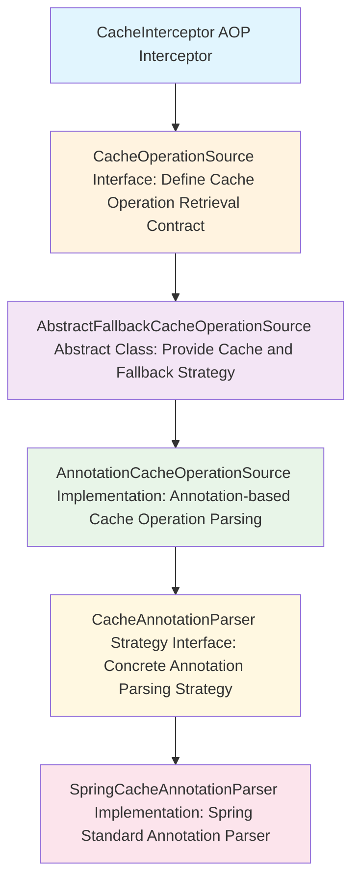
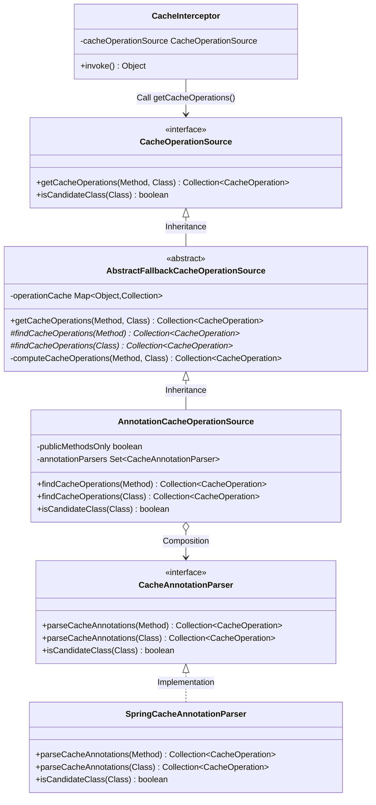
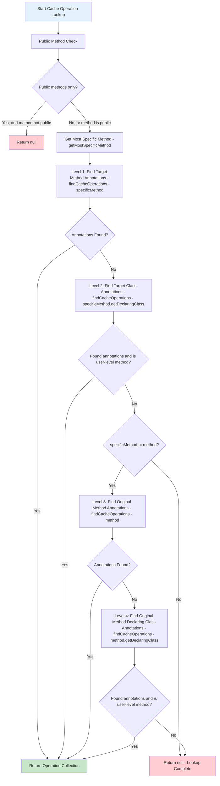
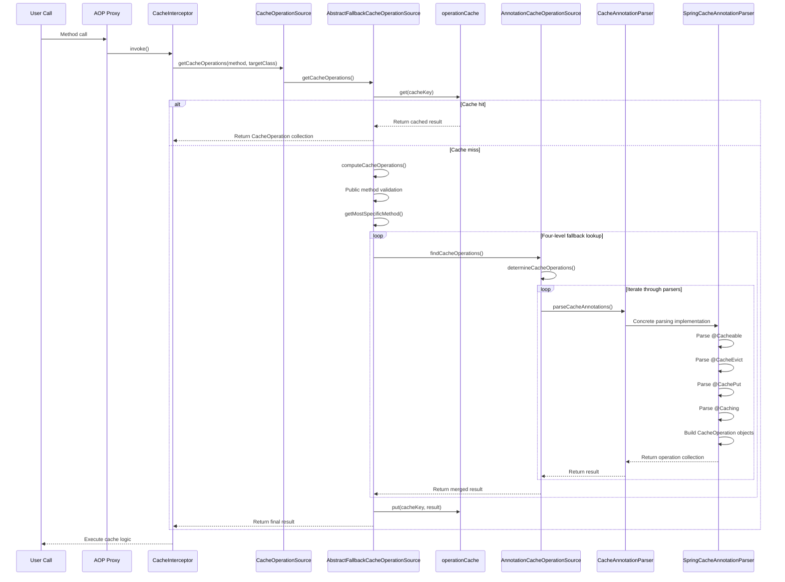
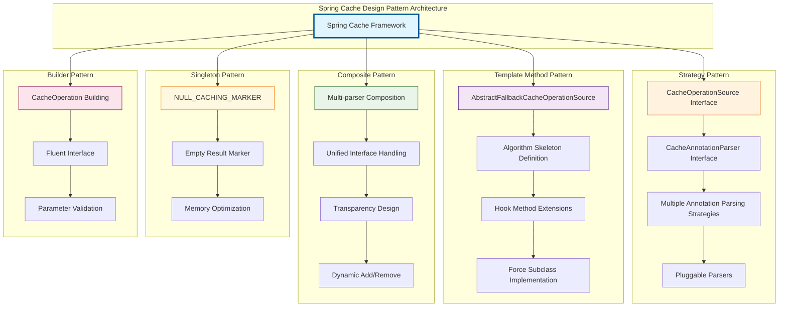
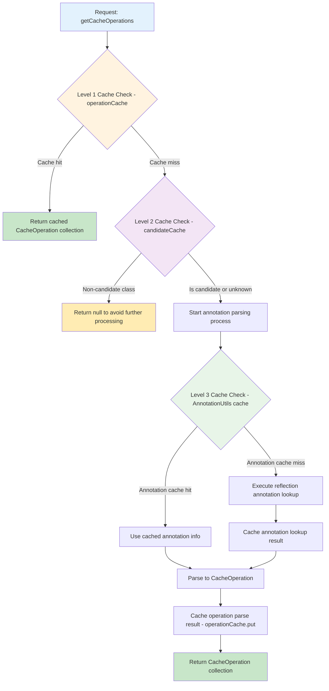
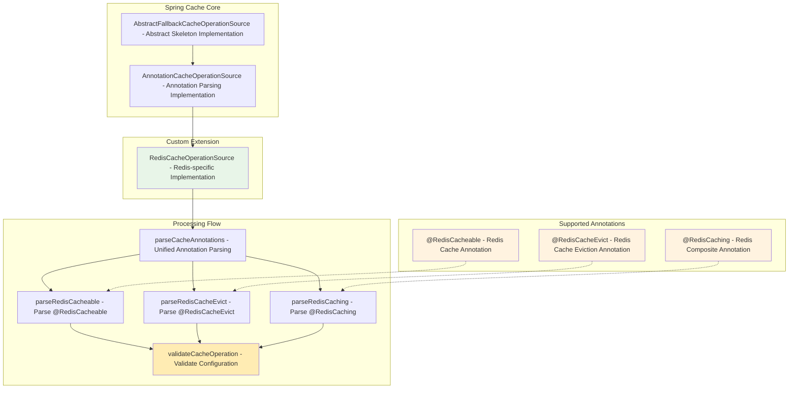
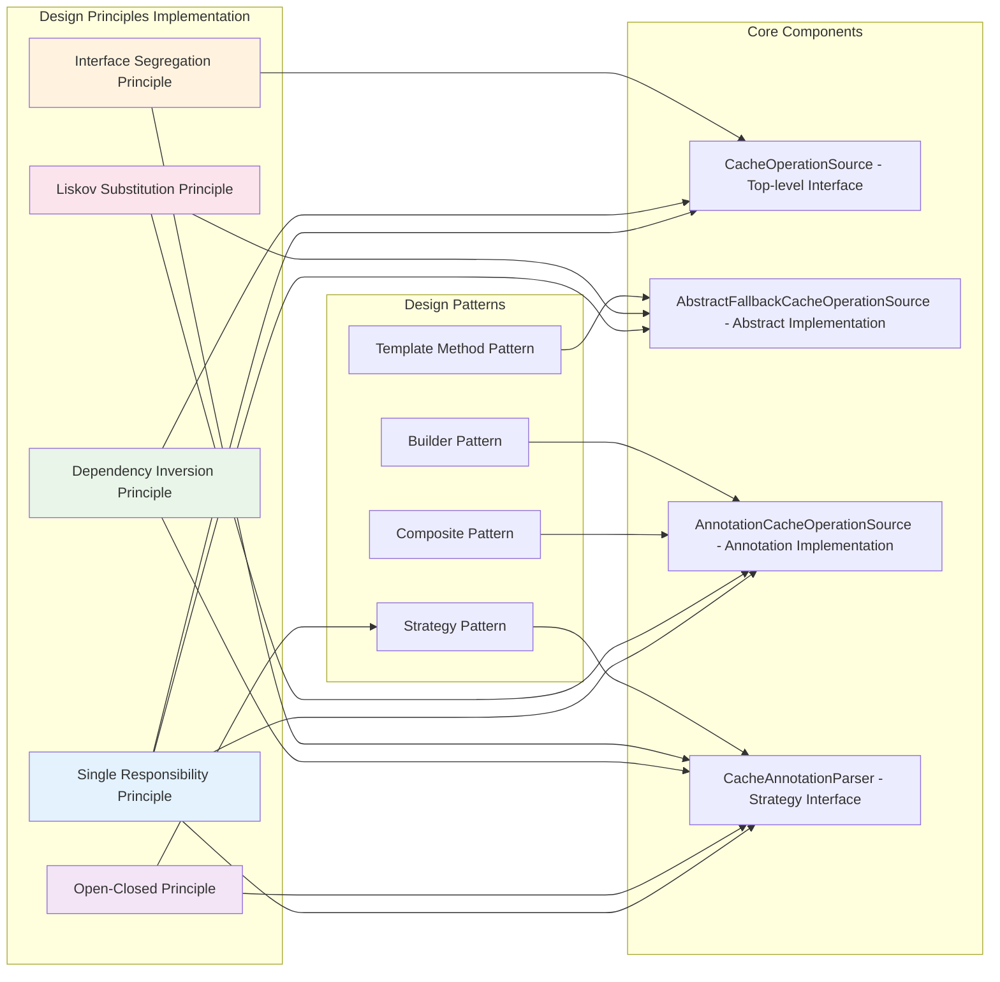

## Overview

This document provides an in-depth analysis of the core source code in Spring Cache module regarding annotation processing, focusing on four key interfaces and classes: `CacheOperationSource`, `AbstractFallbackCacheOperationSource`, `AnnotationCacheOperationSource`, and `CacheAnnotationParser`. These components form the fundamental infrastructure of Spring Cache annotation processing, and understanding their design and collaboration is crucial for mastering how Spring Cache works.

## Component Overviews

### Overall Architecture



### Component Relationship Diagram



## Detailed Component Analysis

### 1. CacheOperationSource - Top-level Interface Definition

#### Core Responsibilities

`CacheOperationSource` serves as the top-level interface of the Spring Cache system, defining the core contract for obtaining cache operation metadata.

#### Key Design Patterns

Employs the **Strategy Pattern**, providing a unified interface for different cache operation retrieval strategies (such as annotation-based, XML configuration, etc.).

#### Source Code Analysis Highlights

**Interface Definition Analysis:**

```java
public interface CacheOperationSource {

    // Core method: Get collection of cache operations for a method
    @Nullable
    Collection<CacheOperation> getCacheOperations(Method method, @Nullable Class<?> targetClass);

    // Optimization method: Determine if class is a candidate to avoid unnecessary method traversal
    default boolean isCandidateClass(Class<?> targetClass) {
        return true;
    }
}
```

**Method Signature Interpretation:**

1. **`getCacheOperations(Method method, @Nullable Class<?> targetClass)`**

- **Input Parameters**:
    - `method`: The target method to analyze, never null
    - `targetClass`: The target class, can be null (when null, the method's declaring class is used)
- **Return Value**: `Collection<CacheOperation>` - All cache operations associated with this method, returns null if no cache operations are found
- **Semantics**: This is the entry point of the entire caching framework, responsible for converting method invocations into concrete cache operation instructions

2. **`isCandidateClass(Class<?> targetClass)`**

- **Optimization Purpose**: Quickly determine if a class might contain cache annotations before traversing all its methods
- **Performance Consideration**: Returning false can skip the entire class, avoiding expensive method-level checks
- **Default Implementation**: Returns true, meaning a complete check is needed (conservative strategy)

### 2. AbstractFallbackCacheOperationSource - Abstract Skeleton Implementation

#### Core Responsibilities

`AbstractFallbackCacheOperationSource` serves as a skeleton implementation, providing caching mechanism and fallback lookup strategy, a classic application of the Template Method pattern.

#### Key Design Patterns

Employs the **Template Method Pattern**, defining the algorithm skeleton for cache operation retrieval while deferring specific lookup logic to subclass implementations.

#### Source Code Analysis Highlights

**Core Field Analysis:**

```java
public abstract class AbstractFallbackCacheOperationSource implements CacheOperationSource {

    // Empty marker to identify methods without cache operations, avoiding repeated lookups
    private static final Collection<CacheOperation> NULL_CACHING_MARKER = Collections.emptyList();

    // Operation cache: Avoid re-parsing cache operations for the same method
    // Key: MethodClassKey(method, targetClass)
    // Value: Collection<CacheOperation> or NULL_CACHING_MARKER
    private final Map<Object, Collection<CacheOperation>> operationCache = new ConcurrentHashMap<>(1024);
}
```

**Cache Mechanism Design Analysis:**

1. **Why is `operationCache` needed?**

- **Performance Optimization**: Annotation parsing is a relatively expensive operation (involving reflection, annotation lookup, etc.)
- **Frequent Calls**: The same method will be called multiple times during application runtime
- **Immutability**: A method's cache operations are immutable at runtime, suitable for caching

2. **Purpose of `NULL_CACHING_MARKER`:**

- **Avoid Repeated Lookups**: For methods without cache annotations, avoid going through the complete parsing process each time
- **State Differentiation**: Distinguish between "not yet looked up" and "looked up but found nothing" states
- **Memory Optimization**: Use a singleton empty collection to save memory

**getCacheOperations Method Implementation Analysis:**

```java
@Override
@Nullable
public Collection<CacheOperation> getCacheOperations(Method method, @Nullable Class<?> targetClass) {
    // 1. Exclude Object class methods (like toString, equals, etc.)
    if (method.getDeclaringClass() == Object.class) {
        return null;
    }

    // 2. Generate cache key
    Object cacheKey = getCacheKey(method, targetClass);

    // 3. Check cache
    Collection<CacheOperation> cached = this.operationCache.get(cacheKey);

    if (cached != null) {
        // 4. Cache hit: Return actual result or null (if NULL_CACHING_MARKER)
        return (cached != NULL_CACHING_MARKER ? cached : null);
    }
    else {
        // 5. Cache miss: Execute actual lookup logic
        Collection<CacheOperation> cacheOps = computeCacheOperations(method, targetClass);

        // 6. Cache result
        if (cacheOps != null) {
            this.operationCache.put(cacheKey, cacheOps);
        }
        else {
            // Cache "not found" result to avoid repeated lookups
            this.operationCache.put(cacheKey, NULL_CACHING_MARKER);
        }
        return cacheOps;
    }
}
```

**Cache Key Generation Strategy:**

```java
protected Object getCacheKey(Method method, @Nullable Class<?> targetClass) {
    return new MethodClassKey(method, targetClass);
}
```

- **Uniqueness Guarantee**: `MethodClassKey` ensures different methods produce different keys, and the same method produces the same key
- **Method Overloading Support**: Can correctly distinguish overloaded methods
- **Proxy Compatibility**: Considers AOP proxy situations where `targetClass` may differ from `method.getDeclaringClass()`

**Fallback Lookup Strategy Analysis:**

```java
@Nullable
private Collection<CacheOperation> computeCacheOperations(Method method, @Nullable Class<?> targetClass) {
    // 1. Public method check
    if (allowPublicMethodsOnly() && !Modifier.isPublic(method.getModifiers())) {
        return null;
    }

    // 2. Get most specific method (handle interface proxy cases)
    Method specificMethod = AopUtils.getMostSpecificMethod(method, targetClass);

    // 3. Four-level fallback lookup strategy:

    // First level: Find annotations on target method
    Collection<CacheOperation> opDef = findCacheOperations(specificMethod);
    if (opDef != null) {
        return opDef;
    }

    // Second level: Find annotations on target class
    opDef = findCacheOperations(specificMethod.getDeclaringClass());
    if (opDef != null && ClassUtils.isUserLevelMethod(method)) {
        return opDef;
    }

    // Third level: If method differs, find annotations on original method
    if (specificMethod != method) {
        opDef = findCacheOperations(method);
        if (opDef != null) {
            return opDef;
        }

        // Fourth level: Find annotations on original method's declaring class
        opDef = findCacheOperations(method.getDeclaringClass());
        if (opDef != null && ClassUtils.isUserLevelMethod(method)) {
            return opDef;
        }
    }

    return null;
}
```

**Design Philosophy of Fallback Strategy:**

1. **Decreasing Priority**: Method-level annotations > Class-level annotations > Interface method annotations > Interface class annotations
2. **Proximity Principle**: Annotations closer to the actual invocation point have higher priority
3. **Override Mechanism**: Method-level annotations completely override class-level annotations, rather than merging
4. **Proxy Compatibility**: Correctly handles both JDK dynamic proxy and CGLIB proxy cases

**Four-level Fallback Lookup Strategy Flow Chart:**



**Template Method Manifestation:**

```java
// Abstract methods: Subclasses implement specific lookup logic
@Nullable
protected abstract Collection<CacheOperation> findCacheOperations(Class<?> clazz);

@Nullable
protected abstract Collection<CacheOperation> findCacheOperations(Method method);
```

### 3. AnnotationCacheOperationSource - Standard Annotation Parsing Implementation

#### Core Responsibilities

`AnnotationCacheOperationSource` serves as an annotation-based cache operation parser, utilizing the Strategy Pattern to collaborate with multiple `CacheAnnotationParser` instances, supporting different types of cache annotations.

#### Key Design Patterns

Employs **Strategy Pattern + Composite Pattern**, supporting different annotation systems (such as Spring standard annotations, JCache annotations, etc.) through composition of multiple annotation parsing strategies.

#### Source Code Analysis Highlights

**Core Fields and Constructor Analysis:**

```java
public class AnnotationCacheOperationSource extends AbstractFallbackCacheOperationSource implements Serializable {

    private final boolean publicMethodsOnly;
    private final Set<CacheAnnotationParser> annotationParsers;

    // Default constructor: Only supports public methods, uses Spring standard annotation parser
    public AnnotationCacheOperationSource() {
        this(true);
    }

    // Basic constructor: Configure method visibility, default uses Spring standard annotation parser
    public AnnotationCacheOperationSource(boolean publicMethodsOnly) {
        this.publicMethodsOnly = publicMethodsOnly;
        this.annotationParsers = Collections.singleton(new SpringCacheAnnotationParser());
    }

    // Custom parser constructor: Supports single custom parser
    public AnnotationCacheOperationSource(CacheAnnotationParser annotationParser) {
        this.publicMethodsOnly = true;
        Assert.notNull(annotationParser, "CacheAnnotationParser must not be null");
        this.annotationParsers = Collections.singleton(annotationParser);
    }

    // Multi-parser constructor: Supports multiple parser composition
    public AnnotationCacheOperationSource(Set<CacheAnnotationParser> annotationParsers) {
        this.publicMethodsOnly = true;
        Assert.notEmpty(annotationParsers, "At least one CacheAnnotationParser needs to be specified");
        this.annotationParsers = annotationParsers;
    }
}
```

**Constructor Design Analysis:**

1. **Progressive Complexity**: From simple default configuration to fully customizable configuration
2. **Reasonable Defaults**: By default, only processes public methods and uses Spring standard parser
3. **Extensibility Support**: Supports adding custom parsers and multiple parser composition
4. **Parameter Validation**: Ensures parser set is not empty, embodying defensive programming

**Candidate Class Check Implementation:**

```java
@Override
public boolean isCandidateClass(Class<?> targetClass) {
    for (CacheAnnotationParser parser : this.annotationParsers) {
        if (parser.isCandidateClass(targetClass)) {
            return true;
        }
    }
    return false;
}
```

- **Short-circuit Optimization**: Returns true if any parser considers it a candidate class
- **Delegation Pattern**: Delegates specific judgment logic to individual parsers
- **Performance Optimization**: Avoids expensive method traversal on unrelated classes

**Core Parsing Method Implementation:**

```java
@Override
@Nullable
protected Collection<CacheOperation> findCacheOperations(Class<?> clazz) {
    return determineCacheOperations(parser -> parser.parseCacheAnnotations(clazz));
}

@Override
@Nullable
protected Collection<CacheOperation> findCacheOperations(Method method) {
    return determineCacheOperations(parser -> parser.parseCacheAnnotations(method));
}
```

**Core Implementation of Strategy Pattern:**

```java
@Nullable
protected Collection<CacheOperation> determineCacheOperations(CacheOperationProvider provider) {
    Collection<CacheOperation> ops = null;

    // Iterate through all annotation parsers
    for (CacheAnnotationParser parser : this.annotationParsers) {
        // Parse annotations using current parser
        Collection<CacheOperation> annOps = provider.getCacheOperations(parser);

        if (annOps != null) {
            if (ops == null) {
                // First operation discovered
                ops = annOps;
            }
            else {
                // Merge results from multiple parsers
                Collection<CacheOperation> combined = new ArrayList<>(ops.size() + annOps.size());
                combined.addAll(ops);
                combined.addAll(annOps);
                ops = combined;
            }
        }
    }
    return ops;
}
```

**Functional Interface Design:**

```java
@FunctionalInterface
protected interface CacheOperationProvider {
    @Nullable
    Collection<CacheOperation> getCacheOperations(CacheAnnotationParser parser);
}
```

**Design Highlights of determineCacheOperations Method:**

1. **Functional Programming**: Uses `CacheOperationProvider` functional interface, improving code reusability
2. **Lazy Evaluation**: Creates merged collection only when needed
3. **Memory Optimization**: When only one parser has results, returns original collection directly, avoiding unnecessary copying
4. **Result Merging**: Supports merging results from multiple parsers, enabling annotation system extension

### 4. CacheAnnotationParser - Strategy Interface Extension Point

#### Core Responsibilities

`CacheAnnotationParser` serves as the strategy interface for annotation parsing, providing a powerful extension point for the Spring Cache system, supporting different annotation standards and custom annotations.

#### Key Design Patterns

Employs the **Strategy Pattern**, providing a unified interface for different annotation parsing strategies, the key to the entire annotation system's extensibility.

#### Source Code Analysis Highlights

**Interface Definition Analysis:**

```java
public interface CacheAnnotationParser {

    // Candidate class check: Key to performance optimization
    default boolean isCandidateClass(Class<?> targetClass) {
        return true;
    }

    // Parse class-level cache annotations
    @Nullable
    Collection<CacheOperation> parseCacheAnnotations(Class<?> type);

    // Parse method-level cache annotations
    @Nullable
    Collection<CacheOperation> parseCacheAnnotations(Method method);
}
```

**Extensibility Embodiment of Interface Design:**

1. **Significance of `isCandidateClass` Method:**

```java
default boolean isCandidateClass(Class<?> targetClass) {
    return true;  // Conservative default implementation
}
```

- **Performance Optimization Purpose**: Quickly filter unrelated classes before parsing annotations
- **Default Implementation**: Returns true to ensure backward compatibility
- **Customization Space**: Subclasses can implement quick judgment logic based on annotation characteristics

2. **Uniformity of `parseCacheAnnotations` Methods:**

- **Consistent Method Signatures**: Class and method-level parsing use the same return type
- **Null Semantics**: Returning null indicates no related annotations found
- **Collection Return**: Supports multiple cache operations on one element (such as @Caching annotation)

**SpringCacheAnnotationParser Implementation Example:**

```java
public class SpringCacheAnnotationParser implements CacheAnnotationParser {

    @Override
    public boolean isCandidateClass(Class<?> targetClass) {
        // Check if class has Spring Cache-related annotations
        return AnnotationUtils.isCandidateClass(targetClass, CACHE_OPERATION_ANNOTATIONS);
    }

    @Override
    @Nullable
    public Collection<CacheOperation> parseCacheAnnotations(Class<?> type) {
        DefaultCacheConfig defaultConfig = new DefaultCacheConfig(type);
        return parseCacheAnnotations(defaultConfig, type);
    }

    @Override
    @Nullable
    public Collection<CacheOperation> parseCacheAnnotations(Method method) {
        DefaultCacheConfig defaultConfig = new DefaultCacheConfig(method.getDeclaringClass());
        return parseCacheAnnotations(defaultConfig, method);
    }
}
```

**Value of Extension Points:**

1. **Multi-standard Support**: Can simultaneously support Spring Cache annotations, JCache annotations, and custom annotations
2. **Progressive Migration**: Supports migrating from one annotation standard to another
3. **Business Customization**: Supports customizing special cache annotations based on business needs
4. **Third-party Integration**: Third-party caching frameworks can integrate into Spring Cache system by implementing this interface

## Complete Call Chain Analysis

### Method Call Sequence Diagram



### Key Call Path Detailed Explanation

1. **Entry Call:**

```java
// In CacheInterceptor.invoke()
Collection<CacheOperation> operations = getCacheOperationSource()
    .getCacheOperations(method, targetClass);
```

2. **Cache Lookup:**

```java
// AbstractFallbackCacheOperationSource.getCacheOperations()
Object cacheKey = getCacheKey(method, targetClass);
Collection<CacheOperation> cached = this.operationCache.get(cacheKey);
```

3. **Fallback Parsing:**

```java
// Four-level fallback strategy
Collection<CacheOperation> opDef = findCacheOperations(specificMethod);
if (opDef != null) return opDef;
// ... other fallback levels
```

4. **Strategy Delegation:**

```java
// AnnotationCacheOperationSource.determineCacheOperations()
for (CacheAnnotationParser parser : this.annotationParsers) {
    Collection<CacheOperation> annOps = provider.getCacheOperations(parser);
    // Merge results...
}
```

5. **Annotation Parsing:**

```java
// SpringCacheAnnotationParser.parseCacheAnnotations()
Cacheable cacheable = AnnotatedElementUtils.findMergedAnnotation(method, Cacheable.class);
if (cacheable != null) {
    ops.add(parseCacheableAnnotation(cacheable, method));
}
```

## Design Patterns In-depth Analysis

**Overview of Design Patterns Applied in Spring Cache Architecture:**



### 1. Template Method Pattern Application in AbstractFallbackCacheOperationSource

**Template Structure:**

```java
public abstract class AbstractFallbackCacheOperationSource {

    // Template method: Define algorithm skeleton
    public final Collection<CacheOperation> getCacheOperations(Method method, Class<?> targetClass) {
        // 1. Preprocessing: Check Object class methods
        // 2. Cache lookup
        // 3. If cache miss, call computeCacheOperations
        // 4. Result caching
    }

    // Hook method: Behavior subclasses can override
    protected boolean allowPublicMethodsOnly() {
        return false;
    }

    // Abstract methods: Force subclass implementation
    protected abstract Collection<CacheOperation> findCacheOperations(Class<?> clazz);
    protected abstract Collection<CacheOperation> findCacheOperations(Method method);
}
```

**Advantages Analysis:**

1. **Algorithm Reuse**: Caching logic and fallback strategy are the same in all subclasses
2. **Clear Extension Points**: Subclasses only need to focus on specific annotation lookup logic
3. **Consistency Guarantee**: All implementations follow the same execution flow

### 2. Strategy Pattern Application in Annotation Parsing

**Strategy Interface:**

```java
public interface CacheAnnotationParser {
    Collection<CacheOperation> parseCacheAnnotations(Class<?> type);
    Collection<CacheOperation> parseCacheAnnotations(Method method);
}
```

**Strategy Context:**

```java
public class AnnotationCacheOperationSource {
    private final Set<CacheAnnotationParser> annotationParsers;

    protected Collection<CacheOperation> determineCacheOperations(CacheOperationProvider provider) {
        // Iterate through all strategies, merge results
    }
}
```

**Concrete Strategies:**

- `SpringCacheAnnotationParser`: Handle Spring standard annotations
- `JCacheAnnotationParser`: Handle JCache standard annotations
- Custom parsers: Handle business-specific annotations

**Advantages Analysis:**

1. **Open-Closed Principle**: Can add new annotation standards without modifying existing code
2. **Separation of Concerns**: Each parser only focuses on specific annotation types
3. **Flexible Composition**: Can use multiple annotation standards simultaneously

### 3. Composite Pattern Application

**Composite Structure:**

```java
AnnotationCacheOperationSource {
    Set<CacheAnnotationParser> annotationParsers;  // Leaf node collection

    determineCacheOperations() {
        // Iterate through all leaf nodes, collect results
        for (CacheAnnotationParser parser : annotationParsers) {
            // Call leaf node processing method
        }
    }
}
```

**Advantages Analysis:**

1. **Unified Handling**: Use the same interface for single parser and parser collection
2. **Transparency**: Client doesn't need to know if it's handling a single parser or a parser collection
3. **Extensibility**: Can dynamically add or remove parsers

## Performance Optimization Strategy Analysis

### 1. Multi-level Cache Design

**Cache Hierarchy:**

```java
// Level 1: Operation result cache
private final Map<Object, Collection<CacheOperation>> operationCache;

// Level 2: Candidate class pre-check cache (may exist in actual implementation)
private final Map<Class<?>, Boolean> candidateCache;

// Level 3: Annotation lookup result cache (in AnnotationUtils)
```

**Multi-level Cache Architecture Diagram:**



**Cache Key Design:**

```java
protected Object getCacheKey(Method method, @Nullable Class<?> targetClass) {
    return new MethodClassKey(method, targetClass);
}
```

- **Uniqueness**: Ensure different methods have different keys
- **Consistency**: Same method always produces the same key
- **Efficiency**: Based on method and class hashCode calculation

### 2. Lazy Evaluation and Short-circuit Optimization

**Candidate Class Short-circuit:**

```java
public boolean isCandidateClass(Class<?> targetClass) {
    for (CacheAnnotationParser parser : this.annotationParsers) {
        if (parser.isCandidateClass(targetClass)) {
            return true;  // Short-circuit return
        }
    }
    return false;
}
```

**Empty Result Marker:**

```java
private static final Collection<CacheOperation> NULL_CACHING_MARKER = Collections.emptyList();

// Avoid repeated lookups for known no-result methods
if (cached != null) {
    return (cached != NULL_CACHING_MARKER ? cached : null);
}
```

### 3. Memory Optimization

**Collection Reuse:**

```java
// Only create new collection when merging is needed
if (ops == null) {
    ops = annOps;  // Direct reference, avoid copying
}
else {
    // Create new collection only when merging is truly needed
    Collection<CacheOperation> combined = new ArrayList<>(ops.size() + annOps.size());
    combined.addAll(ops);
    combined.addAll(annOps);
    ops = combined;
}
```

**Immutable Collections:**

```java
return Collections.unmodifiableList(ops);  // Return immutable view, prevent accidental modification
```

## Real-world Case Study: RedisCacheOperationSource

To better understand how to implement a custom `CacheOperationSource`, let's analyze a real-world case: `RedisCacheOperationSource` from the CacheGuard project. This implementation demonstrates how to extend Spring Cache to support Redis-specific caching functionality.

### Case Study Overview

`RedisCacheOperationSource` extends `AnnotationCacheOperationSource` to support custom Redis cache annotations such as `@RedisCacheable`, `@RedisCacheEvict`, and `@RedisCaching`. This implementation showcases several key design principles:

1. **Extension Over Replacement**: Extends existing Spring Cache infrastructure
2. **Custom Annotation Support**: Handles Redis-specific cache annotations
3. **Comprehensive Validation**: Provides robust error checking and logging
4. **Composite Annotation Handling**: Supports complex annotation combinations

**RedisCacheOperationSource Architecture Diagram:**



### Implementation Analysis

#### 1. Core Structure

```java
@Slf4j
public class RedisCacheOperationSource extends AnnotationCacheOperationSource {

    public RedisCacheOperationSource() {
        super(false);  // Allow non-public methods
    }

    @Override
    protected Collection<CacheOperation> findCacheOperations(Method method) {
        return parseCacheAnnotations(method);
    }

    @Override
    protected Collection<CacheOperation> findCacheOperations(Class<?> clazz) {
        return parseCacheAnnotations(clazz);
    }
}
```

**Design Decisions:**

- **Constructor Parameter**: `super(false)` allows processing non-public methods, providing more flexibility than Spring's default behavior
- **Template Method Implementation**: Overrides parent class abstract methods, delegating to custom parsing logic
- **Unified Parsing**: Uses single `parseCacheAnnotations(Object target)` method to handle both class and method targets

#### 2. Custom Annotation Parsing Strategy

```java
@Nullable
private Collection<CacheOperation> parseCacheAnnotations(Object target) {
    List<CacheOperation> ops = new ArrayList<>();
    log.trace("Parsing cache annotations for target: {}", target);

    // Handle @RedisCacheable annotation
    RedisCacheable cacheable = null;
    if (target instanceof Method) {
        cacheable = AnnotatedElementUtils.findMergedAnnotation(
                (Method) target, RedisCacheable.class);
    } else if (target instanceof Class) {
        cacheable = AnnotatedElementUtils.findMergedAnnotation(
                (Class<?>) target, RedisCacheable.class);
    }

    if (cacheable != null) {
        log.debug("Found @RedisCacheable annotation on target: {}", target);
        CacheOperation operation = parseRedisCacheable(cacheable, target);
        validateCacheOperation(target, operation);
        ops.add(operation);
    }

    // Handle @RedisCaching composite annotation
    RedisCaching caching = null;
    if (target instanceof Method) {
        caching = AnnotatedElementUtils.findMergedAnnotation((Method) target, RedisCaching.class);
    } else if (target instanceof Class) {
        caching = AnnotatedElementUtils.findMergedAnnotation((Class<?>) target, RedisCaching.class);
    }

    if (caching != null) {
        log.debug("Found @RedisCaching annotation on target: {}", target);
        // Process multiple nested annotations
        for (RedisCacheable c : caching.redisCacheable()) {
            CacheOperation operation = parseRedisCacheable(c, target);
            validateCacheOperation(target, operation);
            ops.add(operation);
        }
        for (RedisCacheEvict e : caching.redisCacheEvict()) {
            RedisCacheEvictOperation operation = parseRedisCacheEvict(e, target);
            validateCacheOperation(target, operation);
            ops.add(operation);
        }
    }

    return ops.isEmpty() ? null : Collections.unmodifiableList(ops);
}
```

**Key Design Patterns Applied:**

1. **Polymorphic Target Handling**: Uses `Object target` parameter to uniformly handle both `Method` and `Class` types
2. **Merged Annotation Support**: Uses `AnnotatedElementUtils.findMergedAnnotation()` to support annotation inheritance and meta-annotations
3. **Composite Pattern**: Handles single annotations and composite annotations through the same interface
4. **Defensive Programming**: Comprehensive logging and validation at each step

#### 3. Annotation to Operation Conversion

```java
private CacheOperation parseRedisCacheable(RedisCacheable ann, Object target) {
    String name = (target instanceof Method) ? ((Method) target).getName() : target.toString();
    log.trace("Parsing @RedisCacheable annotation for target: {}", target);

    // Use standard Spring CacheableOperation.Builder
    CacheableOperation.Builder builder = new CacheableOperation.Builder();
    builder.setName(name);
    builder.setCacheNames(ann.value().length > 0 ? ann.value() : ann.cacheNames());

    // Only set key if present
    if (StringUtils.hasText(ann.key())) {
        builder.setKey(ann.key());
    }

    // Only set condition if present
    if (StringUtils.hasText(ann.condition())) {
        builder.setCondition(ann.condition());
    }

    builder.setSync(ann.sync());

    // Only set keyGenerator if specified
    if (StringUtils.hasText(ann.keyGenerator())) {
        builder.setKeyGenerator(ann.keyGenerator());
    }

    CacheableOperation operation = builder.build();
    log.debug("Built CacheableOperation: {}", operation);
    return operation;
}
```

**Excellent Application of Builder Pattern:**

- **Fluent Interface**: Uses Spring's built-in `CacheableOperation.Builder` for clear, readable code
- **Conditional Setting**: Only sets properties when meaningful values exist, avoiding empty string pollution
- **Standard Compatibility**: Reuses Spring's standard operation classes for maximum compatibility

#### 4. Comprehensive Validation Framework

```java
private void validateCacheOperation(Object target, CacheOperation operation) {
    log.trace("Validating cache operation for target: {}", target);

    // Validate mutual exclusivity of key and keyGenerator
    if (StringUtils.hasText(operation.getKey()) &&
        StringUtils.hasText(operation.getKeyGenerator())) {
        String errorMsg = "Invalid cache annotation configuration on '" + target +
                         "'. Both 'key' and 'keyGenerator' attributes have been set. " +
                         "These attributes are mutually exclusive...";
        log.error(errorMsg);
        throw new IllegalStateException(errorMsg);
    }

    // Validate presence of cache names
    if (operation.getCacheNames().isEmpty()) {
        String errorMsg = "Invalid cache annotation configuration on '" + target +
                         "'. At least one cache name must be specified.";
        log.error(errorMsg);
        throw new IllegalStateException(errorMsg);
    }

    log.debug("Cache operation validation passed for target: {}", target);
}
```

**Validation Strategy Advantages:**

1. **Early Error Detection**: Catches configuration errors at startup time rather than runtime
2. **Clear Error Messages**: Provides detailed, actionable error messages
3. **Fail-fast Principle**: Throws `IllegalStateException` for invalid configurations
4. **Comprehensive Coverage**: Validates all critical configuration combinations

### Design Pattern Applications in Case Study

#### 1. Use of Template Method Pattern

```java
public class RedisCacheOperationSource extends AnnotationCacheOperationSource {
    // Inherits caching and fallback logic from parent class

    @Override
    protected Collection<CacheOperation> findCacheOperations(Method method) {
        return parseCacheAnnotations(method);  // Custom implementation
    }

    @Override
    protected Collection<CacheOperation> findCacheOperations(Class<?> clazz) {
        return parseCacheAnnotations(clazz);   // Custom implementation
    }
}
```

**Implementation Advantages:**

- **Code Reuse**: Inherits parent class's caching, fallback, and performance optimizations
- **Focus on Core Logic**: Only needs to implement annotation parsing logic
- **Consistency**: Follows the same execution pattern as standard Spring implementations

#### 2. Strategy Pattern for Multiple Annotations

```java
private Collection<CacheOperation> parseCacheAnnotations(Object target) {
    List<CacheOperation> ops = new ArrayList<>();

    // Strategy 1: Handle @RedisCacheable
    RedisCacheable cacheable = findAnnotation(target, RedisCacheable.class);
    if (cacheable != null) {
        ops.add(parseRedisCacheable(cacheable, target));
    }

    // Strategy 2: Handle @RedisCacheEvict
    RedisCacheEvict cacheEvict = findAnnotation(target, RedisCacheEvict.class);
    if (cacheEvict != null) {
        ops.add(parseRedisCacheEvict(cacheEvict, target));
    }

    // Strategy 3: Handle @RedisCaching composite annotation
    RedisCaching caching = findAnnotation(target, RedisCaching.class);
    if (caching != null) {
        // Handle multiple nested annotations
    }

    return ops.isEmpty() ? null : Collections.unmodifiableList(ops);
}
```

### Key Takeaways from Case Study

1. **Extension Strategy**: Extending `AnnotationCacheOperationSource` maximizes use of Spring's existing infrastructure
2. **Validation Importance**: Comprehensive validation prevents runtime errors and provides clear feedback
3. **Logging Strategy**: Multi-level logging supports both development and production debugging
4. **Pattern Application**: Real-world implementation demonstrates effective use of Template Method, Strategy, and Builder patterns
5. **Performance Awareness**: Efficient annotation processing and memory management are critical for high-performance applications

This case study demonstrates how the theoretical concepts of Spring Cache architecture translate into practical, production-ready implementations that extend and enhance the framework's capabilities.

## Extension and Customization Guide

### 1. Custom CacheAnnotationParser

```java
public class CustomCacheAnnotationParser implements CacheAnnotationParser {

    @Override
    public boolean isCandidateClass(Class<?> targetClass) {
        // Quick check for custom annotations
        return AnnotationUtils.isCandidateClass(targetClass, CustomCacheable.class);
    }

    @Override
    public Collection<CacheOperation> parseCacheAnnotations(Class<?> type) {
        CustomCacheable annotation = AnnotationUtils.findAnnotation(type, CustomCacheable.class);
        if (annotation != null) {
            return Collections.singletonList(buildCacheOperation(annotation));
        }
        return null;
    }

    @Override
    public Collection<CacheOperation> parseCacheAnnotations(Method method) {
        CustomCacheable annotation = AnnotationUtils.findAnnotation(method, CustomCacheable.class);
        if (annotation != null) {
            return Collections.singletonList(buildCacheOperation(annotation));
        }
        return null;
    }

    private CacheOperation buildCacheOperation(CustomCacheable annotation) {
        // Build custom CacheOperation
        return new CacheableOperation.Builder()
            .setName(annotation.value())
            .setCacheNames(annotation.cacheNames())
            .setKey(annotation.key())
            // Set custom properties...
            .build();
    }
}
```

### 2. Custom CacheOperationSource

```java
public class CustomCacheOperationSource extends AbstractFallbackCacheOperationSource {

    private final CustomCacheAnnotationParser parser = new CustomCacheAnnotationParser();

    @Override
    protected Collection<CacheOperation> findCacheOperations(Class<?> clazz) {
        return parser.parseCacheAnnotations(clazz);
    }

    @Override
    protected Collection<CacheOperation> findCacheOperations(Method method) {
        return parser.parseCacheAnnotations(method);
    }
}
```

### 3. Configure Custom Parser

```java
@Configuration
public class CacheConfig {

    @Bean
    public CacheOperationSource cacheOperationSource() {
        Set<CacheAnnotationParser> parsers = new LinkedHashSet<>();
        parsers.add(new SpringCacheAnnotationParser());  // Keep Spring standard support
        parsers.add(new CustomCacheAnnotationParser());  // Add custom support
        return new AnnotationCacheOperationSource(parsers);
    }
}
```

## Summary

Spring Cache's CacheOperationSource system demonstrates excellent software design principles:

1. **Single Responsibility Principle**: Each component has clear responsibility boundaries
2. **Open-Closed Principle**: Supports extension without modifying existing code through strategy pattern
3. **Dependency Inversion Principle**: High-level modules depend on abstractions rather than concrete implementations
4. **Interface Segregation Principle**: Interface design is lean and responsibility is clear
5. **Liskov Substitution Principle**: Subclasses can completely replace parent classes

**Spring Cache Architecture Design Principles Overview:**



This design makes Spring Cache not only powerful but also highly extensible and maintainable, providing flexible solutions for various caching scenarios. By understanding the design philosophy and implementation details of these core components, we can better use Spring Cache and also draw inspiration from these design patterns to build our own extensible systems.
